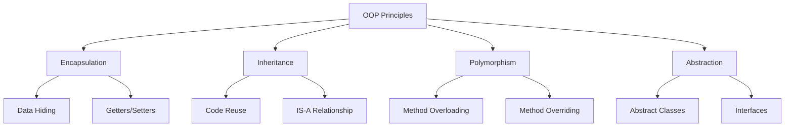
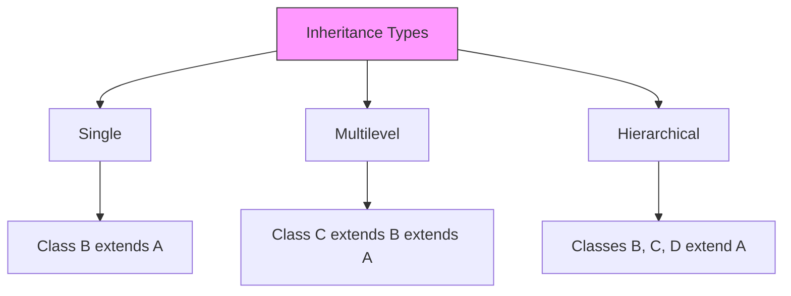
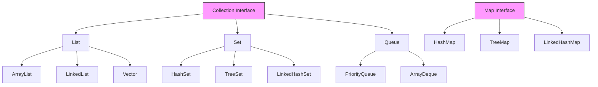
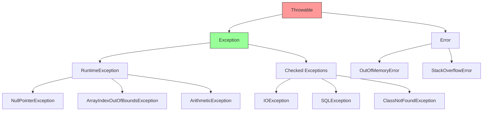
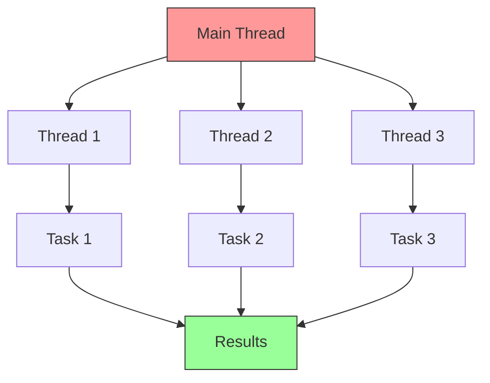

# Core Java Fundamentals - Complete Interview Guide

## 🎯 What You Need to Know Before Spring Boot

```
┌─────────────────────────────────────┐
│     Java Basics Foundation          │
├─────────────────────────────────────┤
│ • Classes & Objects                 │
│ • Inheritance & Polymorphism        │
│ • Interfaces & Abstract Classes     │
│ • Exception Handling                │
│ • Collections Framework             │
│ • Streams & Lambda Expressions      │
│ • Annotations                       │
│ • Multi-threading Basics            │
└─────────────────────────────────────┘
```

---

## 📚 Table of Contents

1. [Object-Oriented Programming (OOP)](#oop)
2. [Collections Framework](#collections)
3. [Exception Handling](#exceptions)
4. [Streams & Lambda](#streams)
5. [Annotations](#annotations)
6. [Multi-threading](#threading)
7. [Interview Questions & Answers](#interview)

---

<a name="oop"></a>
## 1️⃣ Object-Oriented Programming (OOP)

### 🔰 The Four Pillars of OOP



---

### 🔒 1. Encapsulation

**What:** Bundling data (variables) and methods together, hiding internal details.

**Why:** 
- Protects data from unauthorized access
- Provides control over data modification
- Makes code maintainable and flexible

**When to use:**
- Always! It's a fundamental principle
- When you want to control how data is accessed/modified
- When you need to validate data before setting

**When NOT to use:**
- Simple data transfer objects (DTOs) sometimes use public fields for simplicity
- Internal utility classes where encapsulation adds no value

**How:**

```java
// ❌ BAD: No Encapsulation
public class BankAccount {
    public double balance;  // Anyone can modify!
}

// Usage
BankAccount account = new BankAccount();
account.balance = -1000;  // 😱 Negative balance allowed!

// ✅ GOOD: Proper Encapsulation
public class BankAccount {
    private double balance;  // Hidden from outside
    private String accountNumber;
    
    // Constructor
    public BankAccount(String accountNumber, double initialBalance) {
        this.accountNumber = accountNumber;
        if (initialBalance >= 0) {
            this.balance = initialBalance;
        } else {
            throw new IllegalArgumentException("Initial balance cannot be negative");
        }
    }
    
    // Controlled access through methods
    public double getBalance() {
        return balance;
    }
    
    public void deposit(double amount) {
        if (amount > 0) {
            balance += amount;
            System.out.println("Deposited: $" + amount);
        } else {
            System.out.println("Invalid deposit amount");
        }
    }
    
    public void withdraw(double amount) {
        if (amount > 0 && amount <= balance) {
            balance -= amount;
            System.out.println("Withdrawn: $" + amount);
        } else {
            System.out.println("Insufficient funds or invalid amount");
        }
    }
    
    public String getAccountNumber() {
        // Return masked account number for security
        return "****" + accountNumber.substring(accountNumber.length() - 4);
    }
}

// Usage
public class Main {
    public static void main(String[] args) {
        BankAccount account = new BankAccount("1234567890", 1000);
        
        System.out.println("Balance: $" + account.getBalance());  // Output: Balance: $1000.0
        
        account.deposit(500);    // Output: Deposited: $500.0
        account.withdraw(200);   // Output: Withdrawn: $200.0
        account.withdraw(2000);  // Output: Insufficient funds or invalid amount
        
        System.out.println("Final Balance: $" + account.getBalance());  // Output: Final Balance: $1300.0
        System.out.println("Account: " + account.getAccountNumber());   // Output: Account: ****7890
    }
}
```

**Best Practices:**
- Always make fields `private`
- Provide public getters/setters only when needed
- Validate data in setters
- Use meaningful method names
- Don't expose internal collections directly

---

### 🧬 2. Inheritance

**What:** A class (child) inherits properties and methods from another class (parent).

**Why:**
- Code reusability
- Establishes IS-A relationship
- Enables polymorphism
- Reduces code duplication

**When to use:**
- When there's a clear IS-A relationship (Dog IS-A Animal)
- When child classes share common behavior
- When you want to extend existing functionality

**When NOT to use:**
- When there's only HAS-A relationship (Car HAS-A Engine) → Use composition
- When inheritance creates tight coupling
- When you need multiple inheritance (Java doesn't support it)

**How:**

```java
// Parent Class (Superclass)
public class Animal {
    protected String name;  // protected = accessible to child classes
    protected int age;
    
    public Animal(String name, int age) {
        this.name = name;
        this.age = age;
    }
    
    public void eat() {
        System.out.println(name + " is eating");
    }
    
    public void sleep() {
        System.out.println(name + " is sleeping");
    }
    
    public void makeSound() {
        System.out.println("Some generic animal sound");
    }
}

// Child Class 1
public class Dog extends Animal {
    private String breed;
    
    public Dog(String name, int age, String breed) {
        super(name, age);  // Call parent constructor
        this.breed = breed;
    }
    
    // Override parent method
    @Override
    public void makeSound() {
        System.out.println(name + " says: Woof! Woof!");
    }
    
    // New method specific to Dog
    public void fetch() {
        System.out.println(name + " is fetching the ball");
    }
}

// Child Class 2
public class Cat extends Animal {
    private boolean isIndoor;
    
    public Cat(String name, int age, boolean isIndoor) {
        super(name, age);
        this.isIndoor = isIndoor;
    }
    
    @Override
    public void makeSound() {
        System.out.println(name + " says: Meow!");
    }
    
    public void scratch() {
        System.out.println(name + " is scratching the furniture");
    }
}

// Usage
public class Main {
    public static void main(String[] args) {
        Dog dog = new Dog("Buddy", 3, "Golden Retriever");
        Cat cat = new Cat("Whiskers", 2, true);
        
        // Inherited methods
        dog.eat();      // Output: Buddy is eating
        dog.sleep();    // Output: Buddy is sleeping
        
        // Overridden methods
        dog.makeSound();  // Output: Buddy says: Woof! Woof!
        cat.makeSound();  // Output: Whiskers says: Meow!
        
        // Specific methods
        dog.fetch();      // Output: Buddy is fetching the ball
        cat.scratch();    // Output: Whiskers is scratching the furniture
    }
}
```

**Inheritance Hierarchy:**

```
         Animal (Parent)
         /     \
        /       \
      Dog       Cat
     (Child)  (Child)
```

**Types of Inheritance in Java:**



```java
// Single Inheritance
class A { }
class B extends A { }

// Multilevel Inheritance
class A { }
class B extends A { }
class C extends B { }  // C inherits from B, which inherits from A

// Hierarchical Inheritance
class Animal { }
class Dog extends Animal { }
class Cat extends Animal { }
class Bird extends Animal { }

// ❌ Multiple Inheritance NOT ALLOWED in Java
// class C extends A, B { }  // Compilation Error!
// Solution: Use interfaces
```

**Best Practices:**
- Favor composition over inheritance when possible
- Keep inheritance hierarchies shallow (max 3-4 levels)
- Use `@Override` annotation
- Don't inherit just for code reuse; ensure IS-A relationship
- Make parent class methods `protected` or `public`, not `private`

---

### 🎭 3. Polymorphism

**What:** "Many forms" - Same interface, different implementations.

**Why:**
- Write flexible, extensible code
- Reduce code duplication
- Enable dynamic method dispatch
- Support loose coupling

**Types:**
1. **Compile-time Polymorphism** (Method Overloading)
2. **Runtime Polymorphism** (Method Overriding)

---

#### 3A. Method Overloading (Compile-time Polymorphism)

**What:** Multiple methods with same name but different parameters.

**When to use:**
- Same operation on different data types
- Same operation with different number of parameters
- Providing default values

```java
public class Calculator {
    
    // Method 1: Add two integers
    public int add(int a, int b) {
        System.out.println("Adding two integers");
        return a + b;
    }
    
    // Method 2: Add three integers
    public int add(int a, int b, int c) {
        System.out.println("Adding three integers");
        return a + b + c;
    }
    
    // Method 3: Add two doubles
    public double add(double a, double b) {
        System.out.println("Adding two doubles");
        return a + b;
    }
    
    // Method 4: Add array of integers
    public int add(int[] numbers) {
        System.out.println("Adding array of integers");
        int sum = 0;
        for (int num : numbers) {
            sum += num;
        }
        return sum;
    }
}

// Usage
public class Main {
    public static void main(String[] args) {
        Calculator calc = new Calculator();
        
        System.out.println(calc.add(5, 10));           // Output: Adding two integers \n 15
        System.out.println(calc.add(5, 10, 15));       // Output: Adding three integers \n 30
        System.out.println(calc.add(5.5, 10.5));       // Output: Adding two doubles \n 16.0
        System.out.println(calc.add(new int[]{1,2,3})); // Output: Adding array of integers \n 6
    }
}
```

**Rules for Method Overloading:**
- ✅ Different number of parameters
- ✅ Different types of parameters
- ✅ Different order of parameters
- ❌ Return type alone is NOT enough
- ❌ Access modifiers don't matter

```java
// ✅ Valid Overloading
public void print(int a) { }
public void print(String a) { }
public void print(int a, String b) { }
public void print(String a, int b) { }

// ❌ Invalid Overloading - Compilation Error
public void display(int a) { }
public int display(int a) { return a; }  // ERROR: Same signature, different return type
```

---

#### 3B. Method Overriding (Runtime Polymorphism)

**What:** Child class provides specific implementation of parent class method.

**When to use:**
- When child needs different behavior than parent
- When implementing interface methods
- When customizing inherited behavior

```java
// Parent class
public class Payment {
    protected double amount;
    
    public Payment(double amount) {
        this.amount = amount;
    }
    
    public void processPayment() {
        System.out.println("Processing generic payment of $" + amount);
    }
    
    public void printReceipt() {
        System.out.println("Payment receipt: $" + amount);
    }
}

// Child class 1
public class CreditCardPayment extends Payment {
    private String cardNumber;
    
    public CreditCardPayment(double amount, String cardNumber) {
        super(amount);
        this.cardNumber = cardNumber;
    }
    
    @Override
    public void processPayment() {
        System.out.println("Processing credit card payment");
        System.out.println("Card: ****" + cardNumber.substring(cardNumber.length() - 4));
        System.out.println("Amount: $" + amount);
        System.out.println("Payment successful!");
    }
}

// Child class 2
public class PayPalPayment extends Payment {
    private String email;
    
    public PayPalPayment(double amount, String email) {
        super(amount);
        this.email = email;
    }
    
    @Override
    public void processPayment() {
        System.out.println("Processing PayPal payment");
        System.out.println("Email: " + email);
        System.out.println("Amount: $" + amount);
        System.out.println("Payment successful!");
    }
}

// Child class 3
public class CryptoPayment extends Payment {
    private String walletAddress;
    
    public CryptoPayment(double amount, String walletAddress) {
        super(amount);
        this.walletAddress = walletAddress;
    }
    
    @Override
    public void processPayment() {
        System.out.println("Processing cryptocurrency payment");
        System.out.println("Wallet: " + walletAddress);
        System.out.println("Amount: $" + amount);
        System.out.println("Waiting for blockchain confirmation...");
        System.out.println("Payment successful!");
    }
}

// Usage - Polymorphism in Action!
public class Main {
    public static void main(String[] args) {
        // Parent reference, child objects
        Payment payment1 = new CreditCardPayment(100.0, "1234567890123456");
        Payment payment2 = new PayPalPayment(50.0, "user@example.com");
        Payment payment3 = new CryptoPayment(200.0, "0x742d35Cc6634C0532925a3b844Bc9e7595f0bEb");
        
        // Same method call, different behavior!
        payment1.processPayment();
        /* Output:
         * Processing credit card payment
         * Card: ****3456
         * Amount: $100.0
         * Payment successful!
         */
        
        System.out.println();
        
        payment2.processPayment();
        /* Output:
         * Processing PayPal payment
         * Email: user@example.com
         * Amount: $50.0
         * Payment successful!
         */
        
        System.out.println();
        
        payment3.processPayment();
        /* Output:
         * Processing cryptocurrency payment
         * Wallet: 0x742d35Cc6634C0532925a3b844Bc9e7595f0bEb
         * Amount: $200.0
         * Waiting for blockchain confirmation...
         * Payment successful!
         */
        
        // Polymorphic array
        Payment[] payments = {payment1, payment2, payment3};
        
        System.out.println("\nProcessing all payments:");
        for (Payment p : payments) {
            p.processPayment();  // Calls appropriate method based on actual object type
            System.out.println("---");
        }
    }
}
```

**Rules for Method Overriding:**
- ✅ Same method name
- ✅ Same parameters (type, number, order)
- ✅ Same or covariant return type
- ✅ Same or less restrictive access modifier
- ❌ Cannot override `final` methods
- ❌ Cannot override `static` methods (they're hidden, not overridden)
- ❌ Cannot override `private` methods

```java
// Access Modifier Rules
class Parent {
    protected void method1() { }
    public void method2() { }
}

class Child extends Parent {
    // ✅ Valid: protected → public (less restrictive)
    @Override
    public void method1() { }
    
    // ❌ Invalid: public → protected (more restrictive)
    // @Override
    // protected void method2() { }  // Compilation Error!
}
```

**Best Practices:**
- Always use `@Override` annotation
- Don't change method signature
- Don't make overridden method more restrictive
- Call `super.method()` if you need parent's behavior
- Document why you're overriding

---

### 🎨 4. Abstraction

**What:** Hiding implementation details, showing only essential features.

**Why:**
- Reduces complexity
- Provides clear contracts
- Enables loose coupling
- Supports multiple implementations

**Two ways to achieve abstraction:**
1. Abstract Classes
2. Interfaces

---

#### 4A. Abstract Classes

**What:** A class that cannot be instantiated, may have abstract methods.

**When to use:**
- When classes share common code
- When you want to provide default implementation
- When you have IS-A relationship
- When you need constructors or instance variables

**When NOT to use:**
- When you need multiple inheritance
- When you don't have common code to share
- When you just need a contract (use interface instead)

```java
// Abstract class
public abstract class Shape {
    protected String color;
    protected double borderWidth;
    
    // Constructor
    public Shape(String color, double borderWidth) {
        this.color = color;
        this.borderWidth = borderWidth;
    }
    
    // Abstract methods (no implementation)
    public abstract double calculateArea();
    public abstract double calculatePerimeter();
    
    // Concrete method (with implementation)
    public void displayInfo() {
        System.out.println("Shape Color: " + color);
        System.out.println("Border Width: " + borderWidth);
        System.out.println("Area: " + calculateArea());
        System.out.println("Perimeter: " + calculatePerimeter());
    }
    
    // Concrete method
    public String getColor() {
        return color;
    }
}

// Concrete class 1
public class Circle extends Shape {
    private double radius;
    
    public Circle(String color, double borderWidth, double radius) {
        super(color, borderWidth);
        this.radius = radius;
    }
    
    @Override
    public double calculateArea() {
        return Math.PI * radius * radius;
    }
    
    @Override
    public double calculatePerimeter() {
        return 2 * Math.PI * radius;
    }
}

// Concrete class 2
public class Rectangle extends Shape {
    private double length;
    private double width;
    
    public Rectangle(String color, double borderWidth, double length, double width) {
        super(color, borderWidth);
        this.length = length;
        this.width = width;
    }
    
    @Override
    public double calculateArea() {
        return length * width;
    }
    
    @Override
    public double calculatePerimeter() {
        return 2 * (length + width);
    }
}

// Concrete class 3
public class Triangle extends Shape {
    private double side1, side2, side3;
    
    public Triangle(String color, double borderWidth, double side1, double side2, double side3) {
        super(color, borderWidth);
        this.side1 = side1;
        this.side2 = side2;
        this.side3 = side3;
    }
    
    @Override
    public double calculateArea() {
        // Using Heron's formula
        double s = (side1 + side2 + side3) / 2;
        return Math.sqrt(s * (s - side1) * (s - side2) * (s - side3));
    }
    
    @Override
    public double calculatePerimeter() {
        return side1 + side2 + side3;
    }
}

// Usage
public class Main {
    public static void main(String[] args) {
        // Shape shape = new Shape("Red", 2.0);  // ❌ ERROR: Cannot instantiate abstract class
        
        Shape circle = new Circle("Red", 1.0, 5.0);
        Shape rectangle = new Rectangle("Blue", 1.5, 10.0, 5.0);
        Shape triangle = new Triangle("Green", 1.0, 3.0, 4.0, 5.0);
        
        System.out.println("=== Circle ===");
        circle.displayInfo();
        /* Output:
         * === Circle ===
         * Shape Color: Red
         * Border Width: 1.0
         * Area: 78.53981633974483
         * Perimeter: 31.41592653589793
         */
        
        System.out.println("\n=== Rectangle ===");
        rectangle.displayInfo();
        /* Output:
         * === Rectangle ===
         * Shape Color: Blue
         * Border Width: 1.5
         * Area: 50.0
         * Perimeter: 30.0
         */
        
        System.out.println("\n=== Triangle ===");
        triangle.displayInfo();
        /* Output:
         * === Triangle ===
         * Shape Color: Green
         * Border Width: 1.0
         * Area: 6.0
         * Perimeter: 12.0
         */
        
        // Polymorphism with abstract class
        Shape[] shapes = {circle, rectangle, triangle};
        double totalArea = 0;
        
        for (Shape shape : shapes) {
            totalArea += shape.calculateArea();
        }
        
        System.out.println("\nTotal area of all shapes: " + totalArea);
        // Output: Total area of all shapes: 134.53981633974483
    }
}
```

---

#### 4B. Interfaces

**What:** A contract that defines what a class must do, not how.

**When to use:**
- When you need multiple inheritance
- When you want to define a contract
- When unrelated classes should have common behavior
- When you want 100% abstraction

**When NOT to use:**
- When you have common implementation code (use abstract class)
- When you need constructors
- When you need instance variables

```java
// Interface 1
public interface Flyable {
    // All methods are public abstract by default
    void fly();
    void land();
    
    // Default method (Java 8+)
    default void displayFlightInfo() {
        System.out.println("This object can fly!");
    }
    
    // Static method (Java 8+)
    static void printFlightRules() {
        System.out.println("Follow aviation safety rules");
    }
}

// Interface 2
public interface Swimmable {
    void swim();
    void dive();
}

// Interface 3
public interface Walkable {
    void walk();
    void run();
}

// Class implementing one interface
public class Airplane implements Flyable {
    private String model;
    
    public Airplane(String model) {
        this.model = model;
    }
    
    @Override
    public void fly() {
        System.out.println(model + " is flying at 30,000 feet");
    }
    
    @Override
    public void land() {
        System.out.println(model + " is landing on runway");
    }
}

// Class implementing multiple interfaces (Multiple Inheritance!)
public class Duck implements Flyable, Swimmable, Walkable {
    private String name;
    
    public Duck(String name) {
        this.name = name;
    }
    
    @Override
    public void fly() {
        System.out.println(name + " the duck is flying");
    }
    
    @Override
    public void land() {
        System.out.println(name + " the duck is landing");
    }
    
    @Override
    public void swim() {
        System.out.println(name + " the duck is swimming");
    }
    
    @Override
    public void dive() {
        System.out.println(name + " the duck is diving underwater");
    }
    
    @Override
    public void walk() {
        System.out.println(name + " the duck is walking");
    }
    
    @Override
    public void run() {
        System.out.println(name + " the duck is running (waddling fast!)");
    }
}

// Class implementing multiple interfaces
public class Fish implements Swimmable {
    private String species;
    
    public Fish(String species) {
        this.species = species;
    }
    
    @Override
    public void swim() {
        System.out.println(species + " is swimming gracefully");
    }
    
    @Override
    public void dive() {
        System.out.println(species + " is diving deep");
    }
}

// Usage
public class Main {
    public static void main(String[] args) {
        Airplane plane = new Airplane("Boeing 747");
        Duck duck = new Duck("Donald");
        Fish fish = new Fish("Goldfish");
        
        System.out.println("=== Airplane ===");
        plane.fly();              // Output: Boeing 747 is flying at 30,000 feet
        plane.land();             // Output: Boeing 747 is landing on runway
        plane.displayFlightInfo(); // Output: This object can fly!
        
        System.out.println("\n=== Duck (Multiple Interfaces!) ===");
        duck.fly();    // Output: Donald the duck is flying
        duck.swim();   // Output: Donald the duck is swimming
        duck.walk();   // Output: Donald the duck is walking
        duck.run();    // Output: Donald the duck is running (waddling fast!)
        duck.dive();   // Output: Donald the duck is diving underwater
        duck.land();   // Output: Donald the duck is landing
        
        System.out.println("\n=== Fish ===");
        fish.swim();   // Output: Goldfish is swimming gracefully
        fish.dive();   // Output: Goldfish is diving deep
        
        // Polymorphism with interfaces
        System.out.println("\n=== All Swimmers ===");
        Swimmable[] swimmers = {duck, fish};
        for (Swimmable swimmer : swimmers) {
            swimmer.swim();
        }
        /* Output:
         * === All Swimmers ===
         * Donald the duck is swimming
         * Goldfish is swimming gracefully
         */
        
        // Static method call
        Flyable.printFlightRules();  // Output: Follow aviation safety rules
    }
}
```

**Interface Features (Java 8+):**

```java
public interface ModernInterface {
    // 1. Abstract method (default)
    void abstractMethod();
    
    // 2. Default method (has implementation)
    default void defaultMethod() {
        System.out.println("Default implementation");
    }
    
    // 3. Static method
    static void staticMethod() {
        System.out.println("Static method in interface");
    }
    
    // 4. Private method (Java 9+) - helper for default methods
    private void helperMethod() {
        System.out.println("Private helper");
    }
    
    // 5. Constants (public static final by default)
    int MAX_VALUE = 100;
    String DEFAULT_NAME = "Unknown";
}
```

---

### 🆚 Abstract Class vs Interface

| Feature | Abstract Class | Interface |
|---------|---------------|-----------|
| **Multiple Inheritance** | ❌ No | ✅ Yes |
| **Constructor** | ✅ Yes | ❌ No |
| **Instance Variables** | ✅ Yes | ❌ No (only constants) |
| **Method Implementation** | ✅ Can have both | ✅ Default/static only (Java 8+) |
| **Access Modifiers** | ✅ Any | ❌ Public only |
| **When to use** | IS-A relationship | CAN-DO capability |
| **Keyword** | `extends` | `implements` |
| **Example** | `Dog extends Animal` | `Duck implements Flyable` |

```java
// Example showing when to use each

// Abstract Class - IS-A relationship, shared code
public abstract class Vehicle {
    protected String brand;
    protected int year;
    
    public Vehicle(String brand, int year) {
        this.brand = brand;
        this.year = year;
    }
    
    public abstract void start();
    
    public void displayInfo() {  // Shared implementation
        System.out.println(brand + " " + year);
    }
}

// Interface - CAN-DO capability
public interface Electric {
    void chargeBattery();
    int getBatteryLevel();
}

// Class using both
public class TeslaModel3 extends Vehicle implements Electric {
    private int batteryLevel;
    
    public TeslaModel3(int year) {
        super("Tesla", year);
        this.batteryLevel = 100;
    }
    
    @Override
    public void start() {
        System.out.println("Tesla starting silently...");
    }
    
    @Override
    public void chargeBattery() {
        batteryLevel = 100;
        System.out.println("Battery fully charged!");
    }
    
    @Override
    public int getBatteryLevel() {
        return batteryLevel;
    }
}
```

**Best Practices:**
- Use interfaces for defining contracts
- Use abstract classes for shared code
- Prefer interfaces over abstract classes for flexibility
- Use meaningful names: `Flyable`, `Runnable`, `Serializable`
- Keep interfaces focused (Single Responsibility Principle)

---


<a name="collections"></a>
## 2️⃣ Collections Framework

### 🎯 What is Collections Framework?

**What:** A unified architecture for storing and manipulating groups of objects.

**Why:**
- Reduces programming effort
- Increases performance
- Provides interoperability
- Reduces effort to learn APIs



---

### 📋 List Interface

**What:** Ordered collection that allows duplicates.

**When to use:**
- When order matters
- When you need index-based access
- When duplicates are allowed
- When you need to maintain insertion order

---

#### ArrayList

**What:** Resizable array implementation.

**Why:**
- Fast random access (O(1))
- Dynamic sizing
- Easy to use

**When to use:**
- Frequent read operations
- Random access needed
- Size changes infrequently

**When NOT to use:**
- Frequent insertions/deletions in middle
- Thread-safe operations needed
- Memory is constrained

**How it works:**

```
Initial ArrayList (capacity = 10):
┌───┬───┬───┬───┬───┬───┬───┬───┬───┬───┐
│ 10│ 20│ 30│   │   │   │   │   │   │   │
└───┴───┴───┴───┴───┴───┴───┴───┴───┴───┘
  0   1   2   3   4   5   6   7   8   9

After adding more elements (auto-resize):
┌───┬───┬───┬───┬───┬───┬───┬───┬───┬───┬───┬───┬───┬───┬───┐
│ 10│ 20│ 30│ 40│ 50│ 60│ 70│ 80│ 90│100│110│   │   │   │   │
└───┴───┴───┴───┴───┴───┴───┴───┴───┴───┴───┴───┴───┴───┴───┘
  0   1   2   3   4   5   6   7   8   9  10  11  12  13  14
```

```java
import java.util.*;

public class ArrayListExample {
    public static void main(String[] args) {
        // Creating ArrayList
        ArrayList<String> fruits = new ArrayList<>();
        
        // Adding elements - O(1) amortized
        fruits.add("Apple");
        fruits.add("Banana");
        fruits.add("Cherry");
        fruits.add("Banana");  // Duplicates allowed
        System.out.println("Fruits: " + fruits);
        // Output: Fruits: [Apple, Banana, Cherry, Banana]
        
        // Adding at specific index - O(n)
        fruits.add(1, "Mango");
        System.out.println("After insert: " + fruits);
        // Output: After insert: [Apple, Mango, Banana, Cherry, Banana]
        
        // Accessing elements - O(1)
        String first = fruits.get(0);
        System.out.println("First fruit: " + first);
        // Output: First fruit: Apple
        
        // Updating elements - O(1)
        fruits.set(2, "Blueberry");
        System.out.println("After update: " + fruits);
        // Output: After update: [Apple, Mango, Blueberry, Cherry, Banana]
        
        // Removing elements - O(n)
        fruits.remove("Mango");  // Remove by value
        fruits.remove(0);         // Remove by index
        System.out.println("After removal: " + fruits);
        // Output: After removal: [Blueberry, Cherry, Banana]
        
        // Size
        System.out.println("Size: " + fruits.size());
        // Output: Size: 3
        
        // Contains check - O(n)
        boolean hasCherry = fruits.contains("Cherry");
        System.out.println("Has Cherry? " + hasCherry);
        // Output: Has Cherry? true
        
        // Iteration
        System.out.println("Iterating:");
        for (String fruit : fruits) {
            System.out.println("- " + fruit);
        }
        /* Output:
         * Iterating:
         * - Blueberry
         * - Cherry
         * - Banana
         */
        
        // Sorting
        Collections.sort(fruits);
        System.out.println("Sorted: " + fruits);
        // Output: Sorted: [Banana, Blueberry, Cherry]
        
        // Searching - O(log n) if sorted
        int index = Collections.binarySearch(fruits, "Blueberry");
        System.out.println("Index of Blueberry: " + index);
        // Output: Index of Blueberry: 1
        
        // Clear all
        fruits.clear();
        System.out.println("After clear: " + fruits);
        // Output: After clear: []
        System.out.println("Is empty? " + fruits.isEmpty());
        // Output: Is empty? true
    }
}
```

**ArrayList Time Complexity:**

| Operation | Time Complexity |
|-----------|----------------|
| `add(element)` | O(1) amortized |
| `add(index, element)` | O(n) |
| `get(index)` | O(1) |
| `set(index, element)` | O(1) |
| `remove(index)` | O(n) |
| `remove(object)` | O(n) |
| `contains(object)` | O(n) |
| `size()` | O(1) |

---

#### LinkedList

**What:** Doubly-linked list implementation.

**Why:**
- Fast insertions/deletions at beginning/end (O(1))
- No resizing needed
- Implements both List and Deque

**When to use:**
- Frequent insertions/deletions
- Queue/Deque operations
- Don't need random access

**When NOT to use:**
- Need fast random access
- Memory is constrained (extra pointers)
- Mostly read operations

**How it works:**

```
LinkedList Structure:
┌──────┐    ┌──────┐    ┌──────┐    ┌──────┐
│  10  │◄──►│  20  │◄──►│  30  │◄──►│  40  │
│ prev │    │ prev │    │ prev │    │ prev │
│ next │    │ next │    │ next │    │ next │
└──────┘    └──────┘    └──────┘    └──────┘
  head                                 tail
```

```java
import java.util.*;

public class LinkedListExample {
    public static void main(String[] args) {
        LinkedList<String> tasks = new LinkedList<>();
        
        // Adding elements
        tasks.add("Task 1");
        tasks.add("Task 2");
        tasks.add("Task 3");
        System.out.println("Tasks: " + tasks);
        // Output: Tasks: [Task 1, Task 2, Task 3]
        
        // Add at beginning - O(1)
        tasks.addFirst("Urgent Task");
        System.out.println("After addFirst: " + tasks);
        // Output: After addFirst: [Urgent Task, Task 1, Task 2, Task 3]
        
        // Add at end - O(1)
        tasks.addLast("Low Priority Task");
        System.out.println("After addLast: " + tasks);
        // Output: After addLast: [Urgent Task, Task 1, Task 2, Task 3, Low Priority Task]
        
        // Get first and last - O(1)
        System.out.println("First: " + tasks.getFirst());
        // Output: First: Urgent Task
        System.out.println("Last: " + tasks.getLast());
        // Output: Last: Low Priority Task
        
        // Remove first and last - O(1)
        tasks.removeFirst();
        tasks.removeLast();
        System.out.println("After removing first and last: " + tasks);
        // Output: After removing first and last: [Task 1, Task 2, Task 3]
        
        // Using as Queue (FIFO)
        LinkedList<String> queue = new LinkedList<>();
        queue.offer("Person 1");  // Add to end
        queue.offer("Person 2");
        queue.offer("Person 3");
        System.out.println("Queue: " + queue);
        // Output: Queue: [Person 1, Person 2, Person 3]
        
        String served = queue.poll();  // Remove from beginning
        System.out.println("Served: " + served);
        // Output: Served: Person 1
        System.out.println("Queue after poll: " + queue);
        // Output: Queue after poll: [Person 2, Person 3]
        
        // Using as Stack (LIFO)
        LinkedList<String> stack = new LinkedList<>();
        stack.push("Plate 1");  // Add to beginning
        stack.push("Plate 2");
        stack.push("Plate 3");
        System.out.println("Stack: " + stack);
        // Output: Stack: [Plate 3, Plate 2, Plate 1]
        
        String top = stack.pop();  // Remove from beginning
        System.out.println("Popped: " + top);
        // Output: Popped: Plate 3
        System.out.println("Stack after pop: " + stack);
        // Output: Stack after pop: [Plate 2, Plate 1]
    }
}
```

**LinkedList Time Complexity:**

| Operation | Time Complexity |
|-----------|----------------|
| `addFirst(element)` | O(1) |
| `addLast(element)` | O(1) |
| `add(index, element)` | O(n) |
| `get(index)` | O(n) |
| `removeFirst()` | O(1) |
| `removeLast()` | O(1) |
| `remove(index)` | O(n) |

---

### 🔷 ArrayList vs LinkedList

```java
import java.util.*;

public class ArrayListVsLinkedList {
    public static void main(String[] args) {
        // Scenario 1: Random Access (ArrayList wins)
        ArrayList<Integer> arrayList = new ArrayList<>();
        LinkedList<Integer> linkedList = new LinkedList<>();
        
        for (int i = 0; i < 100000; i++) {
            arrayList.add(i);
            linkedList.add(i);
        }
        
        // ArrayList: Fast random access
        long start = System.nanoTime();
        for (int i = 0; i < 10000; i++) {
            int val = arrayList.get(i * 10);  // O(1)
        }
        long arrayListTime = System.nanoTime() - start;
        
        // LinkedList: Slow random access
        start = System.nanoTime();
        for (int i = 0; i < 10000; i++) {
            int val = linkedList.get(i * 10);  // O(n)
        }
        long linkedListTime = System.nanoTime() - start;
        
        System.out.println("Random Access:");
        System.out.println("ArrayList: " + arrayListTime + " ns");
        System.out.println("LinkedList: " + linkedListTime + " ns");
        System.out.println("ArrayList is faster for random access!\n");
        
        // Scenario 2: Insert at beginning (LinkedList wins)
        arrayList.clear();
        linkedList.clear();
        
        // ArrayList: Slow insertion at beginning
        start = System.nanoTime();
        for (int i = 0; i < 10000; i++) {
            arrayList.add(0, i);  // O(n) - shifts all elements
        }
        arrayListTime = System.nanoTime() - start;
        
        // LinkedList: Fast insertion at beginning
        start = System.nanoTime();
        for (int i = 0; i < 10000; i++) {
            linkedList.addFirst(i);  // O(1)
        }
        linkedListTime = System.nanoTime() - start;
        
        System.out.println("Insert at Beginning:");
        System.out.println("ArrayList: " + arrayListTime + " ns");
        System.out.println("LinkedList: " + linkedListTime + " ns");
        System.out.println("LinkedList is faster for insertions at beginning!");
    }
}
```

**Decision Guide:**

```
Need random access frequently?
    YES → ArrayList
    NO  → Continue

Frequent insertions/deletions at beginning/end?
    YES → LinkedList
    NO  → Continue

Mostly adding at end and reading?
    YES → ArrayList
    NO  → LinkedList
```

---

### 🔶 Set Interface

**What:** Collection that doesn't allow duplicates.

**When to use:**
- Need unique elements
- Don't care about order (HashSet)
- Need sorted order (TreeSet)
- Need insertion order (LinkedHashSet)

---

#### HashSet

**What:** Hash table implementation, no order guaranteed.

**Why:**
- Fast operations (O(1) average)
- No duplicates
- Allows null

**When to use:**
- Need unique elements
- Don't care about order
- Need fast lookups

```java
import java.util.*;

public class HashSetExample {
    public static void main(String[] args) {
        HashSet<String> set = new HashSet<>();
        
        // Adding elements - O(1) average
        set.add("Apple");
        set.add("Banana");
        set.add("Cherry");
        set.add("Apple");  // Duplicate - won't be added
        
        System.out.println("Set: " + set);
        // Output: Set: [Apple, Cherry, Banana] (order not guaranteed!)
        
        System.out.println("Size: " + set.size());
        // Output: Size: 3 (not 4, duplicate ignored)
        
        // Contains check - O(1) average
        System.out.println("Contains Apple? " + set.contains("Apple"));
        // Output: Contains Apple? true
        
        // Remove - O(1) average
        set.remove("Banana");
        System.out.println("After removal: " + set);
        // Output: After removal: [Apple, Cherry]
        
        // Iteration (order not guaranteed)
        System.out.println("Iterating:");
        for (String item : set) {
            System.out.println("- " + item);
        }
        
        // Use case: Remove duplicates from list
        List<Integer> numbers = Arrays.asList(1, 2, 3, 2, 4, 3, 5, 1);
        System.out.println("Original list: " + numbers);
        // Output: Original list: [1, 2, 3, 2, 4, 3, 5, 1]
        
        Set<Integer> uniqueNumbers = new HashSet<>(numbers);
        System.out.println("Unique numbers: " + uniqueNumbers);
        // Output: Unique numbers: [1, 2, 3, 4, 5]
        
        // Convert back to list
        List<Integer> uniqueList = new ArrayList<>(uniqueNumbers);
        System.out.println("Unique list: " + uniqueList);
        // Output: Unique list: [1, 2, 3, 4, 5]
    }
}
```

---

#### TreeSet

**What:** Red-Black tree implementation, sorted order.

**Why:**
- Sorted order maintained
- No duplicates
- Navigable (floor, ceiling, etc.)

**When to use:**
- Need sorted unique elements
- Need range operations
- Need navigation methods

**When NOT to use:**
- Don't need sorting (use HashSet)
- Need fast operations (TreeSet is O(log n))

```java
import java.util.*;

public class TreeSetExample {
    public static void main(String[] args) {
        TreeSet<Integer> scores = new TreeSet<>();
        
        // Adding elements - O(log n)
        scores.add(85);
        scores.add(92);
        scores.add(78);
        scores.add(95);
        scores.add(88);
        scores.add(85);  // Duplicate - won't be added
        
        System.out.println("Scores (sorted): " + scores);
        // Output: Scores (sorted): [78, 85, 88, 92, 95]
        
        // First and last - O(1)
        System.out.println("Lowest score: " + scores.first());
        // Output: Lowest score: 78
        System.out.println("Highest score: " + scores.last());
        // Output: Highest score: 95
        
        // Navigation methods
        System.out.println("Score lower than 90: " + scores.lower(90));
        // Output: Score lower than 90: 88
        System.out.println("Score higher than 90: " + scores.higher(90));
        // Output: Score higher than 90: 92
        System.out.println("Score floor of 90: " + scores.floor(90));
        // Output: Score floor of 90: 88
        System.out.println("Score ceiling of 90: " + scores.ceiling(90));
        // Output: Score ceiling of 90: 92
        
        // Subset operations
        System.out.println("Scores between 80 and 90: " + scores.subSet(80, 90));
        // Output: Scores between 80 and 90: [85, 88]
        
        System.out.println("Scores less than 90: " + scores.headSet(90));
        // Output: Scores less than 90: [78, 85, 88]
        
        System.out.println("Scores >= 90: " + scores.tailSet(90));
        // Output: Scores >= 90: [92, 95]
        
        // Descending order
        System.out.println("Descending: " + scores.descendingSet());
        // Output: Descending: [95, 92, 88, 85, 78]
        
        // Poll (remove and return)
        System.out.println("Poll first: " + scores.pollFirst());
        // Output: Poll first: 78
        System.out.println("Poll last: " + scores.pollLast());
        // Output: Poll last: 95
        System.out.println("After polling: " + scores);
        // Output: After polling: [85, 88, 92]
    }
}
```

---

#### LinkedHashSet

**What:** Hash table + linked list, maintains insertion order.

**When to use:**
- Need unique elements
- Need to maintain insertion order
- Need predictable iteration order

```java
import java.util.*;

public class LinkedHashSetExample {
    public static void main(String[] args) {
        // HashSet - no order
        HashSet<String> hashSet = new HashSet<>();
        hashSet.add("Zebra");
        hashSet.add("Apple");
        hashSet.add("Mango");
        hashSet.add("Banana");
        System.out.println("HashSet: " + hashSet);
        // Output: HashSet: [Apple, Mango, Banana, Zebra] (random order)
        
        // LinkedHashSet - insertion order maintained
        LinkedHashSet<String> linkedHashSet = new LinkedHashSet<>();
        linkedHashSet.add("Zebra");
        linkedHashSet.add("Apple");
        linkedHashSet.add("Mango");
        linkedHashSet.add("Banana");
        System.out.println("LinkedHashSet: " + linkedHashSet);
        // Output: LinkedHashSet: [Zebra, Apple, Mango, Banana] (insertion order!)
        
        // TreeSet - sorted order
        TreeSet<String> treeSet = new TreeSet<>();
        treeSet.add("Zebra");
        treeSet.add("Apple");
        treeSet.add("Mango");
        treeSet.add("Banana");
        System.out.println("TreeSet: " + treeSet);
        // Output: TreeSet: [Apple, Banana, Mango, Zebra] (sorted order)
    }
}
```

---

### 🗺️ Map Interface

**What:** Key-value pairs, keys are unique.

**When to use:**
- Need to associate keys with values
- Need fast lookups by key
- Need to store metadata

---

#### HashMap

**What:** Hash table implementation, no order.

**Why:**
- Fast operations (O(1) average)
- Allows one null key
- Most commonly used Map

**When to use:**
- Need key-value storage
- Don't care about order
- Need fast lookups

```java
import java.util.*;

public class HashMapExample {
    public static void main(String[] args) {
        HashMap<String, Integer> studentGrades = new HashMap<>();
        
        // Adding key-value pairs - O(1) average
        studentGrades.put("Alice", 95);
        studentGrades.put("Bob", 87);
        studentGrades.put("Charlie", 92);
        studentGrades.put("Diana", 88);
        
        System.out.println("Grades: " + studentGrades);
        // Output: Grades: {Alice=95, Bob=87, Charlie=92, Diana=88}
        
        // Get value by key - O(1) average
        int aliceGrade = studentGrades.get("Alice");
        System.out.println("Alice's grade: " + aliceGrade);
        // Output: Alice's grade: 95
        
        // Update value
        studentGrades.put("Bob", 90);  // Overwrites old value
        System.out.println("Bob's updated grade: " + studentGrades.get("Bob"));
        // Output: Bob's updated grade: 90
        
        // Check if key exists - O(1) average
        System.out.println("Has Eve? " + studentGrades.containsKey("Eve"));
        // Output: Has Eve? false
        
        // Check if value exists - O(n)
        System.out.println("Has grade 92? " + studentGrades.containsValue(92));
        // Output: Has grade 92? true
        
        // Get with default value
        int eveGrade = studentGrades.getOrDefault("Eve", 0);
        System.out.println("Eve's grade (default): " + eveGrade);
        // Output: Eve's grade (default): 0
        
        // Put if absent
        studentGrades.putIfAbsent("Eve", 85);
        studentGrades.putIfAbsent("Alice", 100);  // Won't update, Alice exists
        System.out.println("After putIfAbsent: " + studentGrades);
        // Output: After putIfAbsent: {Alice=95, Bob=90, Charlie=92, Diana=88, Eve=85}
        
        // Remove - O(1) average
        studentGrades.remove("Eve");
        System.out.println("After removal: " + studentGrades);
        // Output: After removal: {Alice=95, Bob=90, Charlie=92, Diana=88}
        
        // Size
        System.out.println("Number of students: " + studentGrades.size());
        // Output: Number of students: 4
        
        // Iterate through keys
        System.out.println("\nAll students:");
        for (String student : studentGrades.keySet()) {
            System.out.println("- " + student);
        }
        /* Output:
         * All students:
         * - Alice
         * - Bob
         * - Charlie
         * - Diana
         */
        
        // Iterate through values
        System.out.println("\nAll grades:");
        for (Integer grade : studentGrades.values()) {
            System.out.println("- " + grade);
        }
        /* Output:
         * All grades:
         * - 95
         * - 90
         * - 92
         * - 88
         */
        
        // Iterate through entries (best way)
        System.out.println("\nStudent-Grade pairs:");
        for (Map.Entry<String, Integer> entry : studentGrades.entrySet()) {
            System.out.println(entry.getKey() + ": " + entry.getValue());
        }
        /* Output:
         * Student-Grade pairs:
         * Alice: 95
         * Bob: 90
         * Charlie: 92
         * Diana: 88
         */
        
        // Compute methods (Java 8+)
        studentGrades.compute("Alice", (key, value) -> value + 5);  // Add 5 to Alice's grade
        System.out.println("\nAlice's grade after compute: " + studentGrades.get("Alice"));
        // Output: Alice's grade after compute: 100
        
        // Merge method
        studentGrades.merge("Bob", 10, (oldVal, newVal) -> oldVal + newVal);  // Add 10 to Bob
        System.out.println("Bob's grade after merge: " + studentGrades.get("Bob"));
        // Output: Bob's grade after merge: 100
        
        // Real-world use case: Count word frequency
        String text = "apple banana apple cherry banana apple";
        String[] words = text.split(" ");
        
        HashMap<String, Integer> wordCount = new HashMap<>();
        for (String word : words) {
            wordCount.put(word, wordCount.getOrDefault(word, 0) + 1);
        }
        
        System.out.println("\nWord frequency: " + wordCount);
        // Output: Word frequency: {banana=2, apple=3, cherry=1}
    }
}
```

---

#### TreeMap

**What:** Red-Black tree implementation, sorted by keys.

**When to use:**
- Need sorted keys
- Need range operations on keys
- Need navigation methods

```java
import java.util.*;

public class TreeMapExample {
    public static void main(String[] args) {
        TreeMap<Integer, String> rankings = new TreeMap<>();
        
        // Adding entries - O(log n)
        rankings.put(3, "Charlie");
        rankings.put(1, "Alice");
        rankings.put(4, "Diana");
        rankings.put(2, "Bob");
        
        System.out.println("Rankings (sorted by key): " + rankings);
        // Output: Rankings (sorted by key): {1=Alice, 2=Bob, 3=Charlie, 4=Diana}
        
        // First and last entries
        System.out.println("First: " + rankings.firstEntry());
        // Output: First: 1=Alice
        System.out.println("Last: " + rankings.lastEntry());
        // Output: Last: 4=Diana
        
        // Navigation
        System.out.println("Lower than 3: " + rankings.lowerEntry(3));
        // Output: Lower than 3: 2=Bob
        System.out.println("Higher than 2: " + rankings.higherEntry(2));
        // Output: Higher than 2: 3=Charlie
        
        // Submap
        System.out.println("Rankings 2-3: " + rankings.subMap(2, true, 3, true));
        // Output: Rankings 2-3: {2=Bob, 3=Charlie}
        
        // Descending map
        System.out.println("Descending: " + rankings.descendingMap());
        // Output: Descending: {4=Diana, 3=Charlie, 2=Bob, 1=Alice}
    }
}
```

---

#### LinkedHashMap

**What:** Hash table + linked list, maintains insertion order.

**When to use:**
- Need key-value storage
- Need to maintain insertion order
- Implementing LRU cache

```java
import java.util.*;

public class LinkedHashMapExample {
    public static void main(String[] args) {
        // Maintains insertion order
        LinkedHashMap<String, Integer> map = new LinkedHashMap<>();
        
        map.put("First", 1);
        map.put("Second", 2);
        map.put("Third", 3);
        map.put("Fourth", 4);
        
        System.out.println("LinkedHashMap: " + map);
        // Output: LinkedHashMap: {First=1, Second=2, Third=3, Fourth=4}
        
        // LRU Cache implementation
        int capacity = 3;
        LinkedHashMap<Integer, String> lruCache = new LinkedHashMap<Integer, String>(
            capacity, 0.75f, true) {  // true = access order
            
            @Override
            protected boolean removeEldestEntry(Map.Entry<Integer, String> eldest) {
                return size() > capacity;
            }
        };
        
        lruCache.put(1, "One");
        lruCache.put(2, "Two");
        lruCache.put(3, "Three");
        System.out.println("Cache: " + lruCache);
        // Output: Cache: {1=One, 2=Two, 3=Three}
        
        lruCache.get(1);  // Access 1
        lruCache.put(4, "Four");  // This will remove 2 (least recently used)
        System.out.println("After adding 4: " + lruCache);
        // Output: After adding 4: {3=Three, 1=One, 4=Four}
    }
}
```

---

### 📊 Collections Comparison Table

| Collection | Ordered | Sorted | Duplicates | Null | Time Complexity |
|------------|---------|--------|------------|------|-----------------|
| **ArrayList** | ✅ | ❌ | ✅ | ✅ | get: O(1), add: O(1) |
| **LinkedList** | ✅ | ❌ | ✅ | ✅ | get: O(n), addFirst: O(1) |
| **HashSet** | ❌ | ❌ | ❌ | ✅ (one) | add/contains: O(1) |
| **TreeSet** | ❌ | ✅ | ❌ | ❌ | add/contains: O(log n) |
| **LinkedHashSet** | ✅ | ❌ | ❌ | ✅ (one) | add/contains: O(1) |
| **HashMap** | ❌ | ❌ | Keys: ❌ | ✅ (one key) | get/put: O(1) |
| **TreeMap** | ❌ | ✅ | Keys: ❌ | ❌ | get/put: O(log n) |
| **LinkedHashMap** | ✅ | ❌ | Keys: ❌ | ✅ (one key) | get/put: O(1) |

---

### 🎯 Collection Selection Guide

```
Need key-value pairs?
    YES → Map
        Need sorted keys? → TreeMap
        Need insertion order? → LinkedHashMap
        Otherwise → HashMap
    NO → Continue

Need unique elements?
    YES → Set
        Need sorted? → TreeSet
        Need insertion order? → LinkedHashSet
        Otherwise → HashSet
    NO → List
        Need fast random access? → ArrayList
        Need fast insert/delete at ends? → LinkedList
```

---


<a name="exceptions"></a>
## 3️⃣ Exception Handling

### 🎯 What is Exception Handling?

**What:** Mechanism to handle runtime errors and maintain normal application flow.

**Why:**
- Prevents program crashes
- Provides meaningful error messages
- Separates error handling from business logic
- Enables graceful degradation



---

### 🔴 Exception Hierarchy

```
                    Throwable
                    /       \
                   /         \
              Error          Exception
              (Don't         /         \
               catch)       /           \
                    RuntimeException   Checked
                    (Unchecked)        Exceptions
```

---

### 📝 Types of Exceptions

#### 1. Checked Exceptions

**What:** Exceptions checked at compile-time.

**When:** Must be handled or declared.

**Examples:** IOException, SQLException, ClassNotFoundException

```java
import java.io.*;

public class CheckedExceptionExample {
    
    // Method 1: Handle with try-catch
    public static void readFileWithTryCatch(String filename) {
        try {
            FileReader file = new FileReader(filename);
            BufferedReader reader = new BufferedReader(file);
            String line = reader.readLine();
            System.out.println("First line: " + line);
            reader.close();
        } catch (FileNotFoundException e) {
            System.out.println("File not found: " + e.getMessage());
            // Output: File not found: nonexistent.txt (No such file or directory)
        } catch (IOException e) {
            System.out.println("Error reading file: " + e.getMessage());
        }
    }
    
    // Method 2: Declare with throws
    public static void readFileWithThrows(String filename) throws IOException {
        FileReader file = new FileReader(filename);
        BufferedReader reader = new BufferedReader(file);
        String line = reader.readLine();
        System.out.println("First line: " + line);
        reader.close();
    }
    
    public static void main(String[] args) {
        // Using method 1
        readFileWithTryCatch("nonexistent.txt");
        
        // Using method 2 - caller must handle
        try {
            readFileWithThrows("data.txt");
        } catch (IOException e) {
            System.out.println("Caught in main: " + e.getMessage());
        }
    }
}
```

---

#### 2. Unchecked Exceptions (RuntimeException)

**What:** Exceptions NOT checked at compile-time.

**When:** Usually programming errors.

**Examples:** NullPointerException, ArrayIndexOutOfBoundsException, ArithmeticException

```java
public class UncheckedExceptionExample {
    
    public static void main(String[] args) {
        // 1. NullPointerException
        String str = null;
        try {
            System.out.println(str.length());  // Throws NullPointerException
        } catch (NullPointerException e) {
            System.out.println("Caught NullPointerException: " + e.getMessage());
            // Output: Caught NullPointerException: null
        }
        
        // 2. ArrayIndexOutOfBoundsException
        int[] numbers = {1, 2, 3};
        try {
            System.out.println(numbers[5]);  // Index out of bounds
        } catch (ArrayIndexOutOfBoundsException e) {
            System.out.println("Caught ArrayIndexOutOfBoundsException: " + e.getMessage());
            // Output: Caught ArrayIndexOutOfBoundsException: Index 5 out of bounds for length 3
        }
        
        // 3. ArithmeticException
        try {
            int result = 10 / 0;  // Division by zero
        } catch (ArithmeticException e) {
            System.out.println("Caught ArithmeticException: " + e.getMessage());
            // Output: Caught ArithmeticException: / by zero
        }
        
        // 4. NumberFormatException
        try {
            int num = Integer.parseInt("abc");  // Invalid number format
        } catch (NumberFormatException e) {
            System.out.println("Caught NumberFormatException: " + e.getMessage());
            // Output: Caught NumberFormatException: For input string: "abc"
        }
        
        // 5. ClassCastException
        try {
            Object obj = "Hello";
            Integer num = (Integer) obj;  // Invalid cast
        } catch (ClassCastException e) {
            System.out.println("Caught ClassCastException: " + e.getMessage());
            // Output: Caught ClassCastException: java.lang.String cannot be cast to java.lang.Integer
        }
    }
}
```

---

### 🛡️ Try-Catch-Finally

**Structure:**

```java
try {
    // Code that might throw exception
} catch (ExceptionType1 e) {
    // Handle ExceptionType1
} catch (ExceptionType2 e) {
    // Handle ExceptionType2
} finally {
    // Always executes (cleanup code)
}
```

**Complete Example:**

```java
import java.io.*;

public class TryCatchFinallyExample {
    
    public static void processFile(String filename) {
        FileReader file = null;
        BufferedReader reader = null;
        
        try {
            System.out.println("Opening file...");
            file = new FileReader(filename);
            reader = new BufferedReader(file);
            
            System.out.println("Reading file...");
            String line;
            while ((line = reader.readLine()) != null) {
                System.out.println(line);
            }
            
        } catch (FileNotFoundException e) {
            System.out.println("File not found: " + filename);
            // Output: File not found: nonexistent.txt
            
        } catch (IOException e) {
            System.out.println("Error reading file: " + e.getMessage());
            
        } finally {
            // Cleanup - always executes
            System.out.println("Cleaning up resources...");
            try {
                if (reader != null) {
                    reader.close();
                }
                if (file != null) {
                    file.close();
                }
                System.out.println("Resources closed successfully");
            } catch (IOException e) {
                System.out.println("Error closing resources: " + e.getMessage());
            }
        }
        
        System.out.println("Method completed");
    }
    
    public static void main(String[] args) {
        processFile("nonexistent.txt");
        /* Output:
         * Opening file...
         * File not found: nonexistent.txt
         * Cleaning up resources...
         * Resources closed successfully
         * Method completed
         */
    }
}
```

---

### 🔄 Try-with-Resources (Java 7+)

**What:** Automatic resource management.

**Why:**
- Automatically closes resources
- Cleaner code
- No need for finally block

**When to use:**
- Working with files, streams, connections
- Any class implementing AutoCloseable

```java
import java.io.*;

public class TryWithResourcesExample {
    
    // Old way (verbose)
    public static void readFileOldWay(String filename) {
        BufferedReader reader = null;
        try {
            reader = new BufferedReader(new FileReader(filename));
            String line = reader.readLine();
            System.out.println(line);
        } catch (IOException e) {
            e.printStackTrace();
        } finally {
            try {
                if (reader != null) {
                    reader.close();
                }
            } catch (IOException e) {
                e.printStackTrace();
            }
        }
    }
    
    // New way (clean)
    public static void readFileNewWay(String filename) {
        try (BufferedReader reader = new BufferedReader(new FileReader(filename))) {
            String line = reader.readLine();
            System.out.println(line);
            // reader automatically closed here!
        } catch (IOException e) {
            e.printStackTrace();
        }
    }
    
    // Multiple resources
    public static void copyFile(String source, String destination) {
        try (
            BufferedReader reader = new BufferedReader(new FileReader(source));
            BufferedWriter writer = new BufferedWriter(new FileWriter(destination))
        ) {
            String line;
            while ((line = reader.readLine()) != null) {
                writer.write(line);
                writer.newLine();
            }
            System.out.println("File copied successfully");
            // Both reader and writer automatically closed!
        } catch (IOException e) {
            System.out.println("Error copying file: " + e.getMessage());
        }
    }
    
    public static void main(String[] args) {
        readFileNewWay("data.txt");
        copyFile("source.txt", "destination.txt");
    }
}
```

---

### 🎨 Custom Exceptions

**When to create:**
- Business logic errors
- Domain-specific errors
- Need custom error information

```java
// Custom checked exception
class InsufficientFundsException extends Exception {
    private double amount;
    private double balance;
    
    public InsufficientFundsException(double amount, double balance) {
        super("Insufficient funds: Tried to withdraw $" + amount + 
              " but balance is $" + balance);
        this.amount = amount;
        this.balance = balance;
    }
    
    public double getAmount() { return amount; }
    public double getBalance() { return balance; }
    public double getShortfall() { return amount - balance; }
}

// Custom unchecked exception
class InvalidAccountException extends RuntimeException {
    public InvalidAccountException(String accountNumber) {
        super("Invalid account number: " + accountNumber);
    }
}

// Using custom exceptions
class BankAccount {
    private String accountNumber;
    private double balance;
    
    public BankAccount(String accountNumber, double initialBalance) {
        if (accountNumber == null || accountNumber.length() != 10) {
            throw new InvalidAccountException(accountNumber);
        }
        this.accountNumber = accountNumber;
        this.balance = initialBalance;
    }
    
    public void withdraw(double amount) throws InsufficientFundsException {
        if (amount > balance) {
            throw new InsufficientFundsException(amount, balance);
        }
        balance -= amount;
        System.out.println("Withdrawn: $" + amount);
        System.out.println("New balance: $" + balance);
    }
    
    public void deposit(double amount) {
        if (amount <= 0) {
            throw new IllegalArgumentException("Deposit amount must be positive");
        }
        balance += amount;
        System.out.println("Deposited: $" + amount);
        System.out.println("New balance: $" + balance);
    }
    
    public double getBalance() {
        return balance;
    }
}

public class CustomExceptionExample {
    public static void main(String[] args) {
        // Test 1: Invalid account number
        try {
            BankAccount account1 = new BankAccount("123", 1000);
        } catch (InvalidAccountException e) {
            System.out.println("Error: " + e.getMessage());
            // Output: Error: Invalid account number: 123
        }
        
        // Test 2: Valid account
        try {
            BankAccount account = new BankAccount("1234567890", 1000);
            
            account.deposit(500);
            // Output: Deposited: $500.0
            //         New balance: $1500.0
            
            account.withdraw(800);
            // Output: Withdrawn: $800.0
            //         New balance: $700.0
            
            account.withdraw(1000);  // This will throw exception
            
        } catch (InsufficientFundsException e) {
            System.out.println("Error: " + e.getMessage());
            System.out.println("Shortfall: $" + e.getShortfall());
            // Output: Error: Insufficient funds: Tried to withdraw $1000.0 but balance is $700.0
            //         Shortfall: $300.0
        }
        
        // Test 3: Invalid deposit
        try {
            BankAccount account = new BankAccount("1234567890", 1000);
            account.deposit(-100);
        } catch (IllegalArgumentException e) {
            System.out.println("Error: " + e.getMessage());
            // Output: Error: Deposit amount must be positive
        }
    }
}
```

---

### 🎯 Exception Handling Best Practices

#### ✅ DO:

```java
// 1. Catch specific exceptions
try {
    // code
} catch (FileNotFoundException e) {
    // Handle file not found
} catch (IOException e) {
    // Handle other IO errors
}

// 2. Log exceptions
catch (Exception e) {
    logger.error("Error processing order", e);
    throw e;
}

// 3. Clean up resources
try (Connection conn = getConnection()) {
    // use connection
}

// 4. Provide context in custom exceptions
throw new OrderProcessingException("Failed to process order #" + orderId, e);

// 5. Fail fast
public void setAge(int age) {
    if (age < 0) {
        throw new IllegalArgumentException("Age cannot be negative");
    }
    this.age = age;
}
```

#### ❌ DON'T:

```java
// 1. Don't catch Exception or Throwable
try {
    // code
} catch (Exception e) {  // Too broad!
    // ...
}

// 2. Don't swallow exceptions
try {
    // code
} catch (Exception e) {
    // Empty catch block - BAD!
}

// 3. Don't use exceptions for control flow
try {
    while (true) {
        array[i++] = getValue();
    }
} catch (ArrayIndexOutOfBoundsException e) {
    // Using exception to exit loop - BAD!
}

// 4. Don't throw from finally
finally {
    throw new Exception();  // BAD! Masks original exception
}

// 5. Don't return from finally
finally {
    return value;  // BAD! Suppresses exceptions
}
```

---

### 📊 Exception Handling Decision Tree

```
Is it a programming error (null, index out of bounds)?
    YES → Let it fail (RuntimeException)
    NO  → Continue

Can the caller reasonably recover from this error?
    YES → Use checked exception
    NO  → Use unchecked exception

Is it a business logic error?
    YES → Create custom exception
    NO  → Use standard exception

Need to add context information?
    YES → Wrap in custom exception
    NO  → Throw as is
```

---


<a name="streams"></a>
## 4️⃣ Streams & Lambda Expressions

### 🎯 What are Lambda Expressions?

**What:** Anonymous functions (functions without a name).

**Why:**
- Concise code
- Functional programming
- Enable Streams API
- Reduce boilerplate

**Syntax:**
```
(parameters) -> expression
(parameters) -> { statements; }
```

---

### 🔰 Lambda Basics

```java
import java.util.*;

public class LambdaBasics {
    public static void main(String[] args) {
        
        // Old way: Anonymous class
        Runnable oldWay = new Runnable() {
            @Override
            public void run() {
                System.out.println("Old way");
            }
        };
        
        // New way: Lambda
        Runnable newWay = () -> System.out.println("New way with lambda");
        
        oldWay.run();  // Output: Old way
        newWay.run();  // Output: New way with lambda
        
        // Comparator - Old way
        List<String> names = Arrays.asList("Charlie", "Alice", "Bob");
        Collections.sort(names, new Comparator<String>() {
            @Override
            public int compare(String s1, String s2) {
                return s1.compareTo(s2);
            }
        });
        
        // Comparator - Lambda way
        Collections.sort(names, (s1, s2) -> s1.compareTo(s2));
        
        // Even shorter with method reference
        Collections.sort(names, String::compareTo);
        
        System.out.println("Sorted: " + names);
        // Output: Sorted: [Alice, Bob, Charlie]
        
        // Lambda with multiple parameters
        Calculator add = (a, b) -> a + b;
        Calculator multiply = (a, b) -> a * b;
        
        System.out.println("5 + 3 = " + add.calculate(5, 3));
        // Output: 5 + 3 = 8
        System.out.println("5 * 3 = " + multiply.calculate(5, 3));
        // Output: 5 * 3 = 15
        
        // Lambda with block
        Calculator complex = (a, b) -> {
            int sum = a + b;
            int product = a * b;
            return sum + product;
        };
        
        System.out.println("Complex: " + complex.calculate(5, 3));
        // Output: Complex: 23 (5+3 + 5*3 = 8 + 15 = 23)
    }
}

@FunctionalInterface
interface Calculator {
    int calculate(int a, int b);
}
```

---

### 🎭 Functional Interfaces (Complete Guide for Beginners)

**What is a Functional Interface?**
An interface with **exactly ONE abstract method**. It can have multiple default or static methods, but only ONE abstract method.

**Why do we need them?**
- Required for Lambda expressions to work
- Makes code more concise and readable
- Enables functional programming in Java
- Used heavily in Streams API

**For Beginners:**
Think of a Functional Interface as a "contract" that says "I need a function that does THIS specific thing". Lambda expressions are a short way to provide that function.

```
┌────────────────────────────────────────────────────────────────┐
│           FUNCTIONAL INTERFACE = 1 Abstract Method             │
├────────────────────────────────────────────────────────────────┤
│                                                                │
│  @FunctionalInterface  ← Optional annotation (recommended)    │
│  interface MyFunction {                                        │
│      void doSomething();  ← This is the ONE abstract method    │
│                                                                │
│      // Can have default methods (optional)                   │
│      default void helper() { ... }                            │
│                                                                │
│      // Can have static methods (optional)                    │
│      static void utility() { ... }                            │
│  }                                                             │
│                                                                │
│  WHY ONLY ONE?                                                 │
│  Because lambda needs to know which method to implement!       │
│  If there were 2+ methods, lambda wouldn't know which one.    │
│                                                                │
└────────────────────────────────────────────────────────────────┘
```

---

### 📦 Built-in Functional Interfaces (Java 8+)

Java provides many ready-to-use functional interfaces in `java.util.function` package.

```
╔════════════════════════════════════════════════════════════════════╗
║           COMMON FUNCTIONAL INTERFACES CHEAT SHEET                 ║
╠════════════════════════════════════════════════════════════════════╣
║                                                                    ║
║ 1️⃣  Predicate<T>      - Tests a condition, returns boolean       ║
║     Method: boolean test(T t)                                     ║
║     Use: Filtering, checking conditions                           ║
║     Example: n -> n > 10  (is number greater than 10?)           ║
║                                                                    ║
║ 2️⃣  Function<T, R>    - Takes input, returns output              ║
║     Method: R apply(T t)                                          ║
║     Use: Transforming data                                        ║
║     Example: s -> s.length()  (convert String to its length)     ║
║                                                                    ║
║ 3️⃣  Consumer<T>       - Takes input, returns nothing             ║
║     Method: void accept(T t)                                      ║
║     Use: Performing actions (printing, saving, etc.)              ║
║     Example: s -> System.out.println(s)  (print the string)      ║
║                                                                    ║
║ 4️⃣  Supplier<T>       - Takes nothing, returns output            ║
║     Method: T get()                                               ║
║     Use: Providing/generating values                              ║
║     Example: () -> Math.random()  (generate random number)       ║
║                                                                    ║
║ 5️⃣  BiFunction<T,U,R> - Takes 2 inputs, returns output           ║
║     Method: R apply(T t, U u)                                     ║
║     Use: Combining two values                                     ║
║     Example: (a, b) -> a + b  (add two numbers)                  ║
║                                                                    ║
║ 6️⃣  UnaryOperator<T>  - Takes T, returns T (same type)           ║
║     Method: T apply(T t)                                          ║
║     Use: Modifying values of same type                            ║
║     Example: n -> n * 2  (double a number)                       ║
║                                                                    ║
║ 7️⃣  BinaryOperator<T> - Takes 2 T's, returns T                   ║
║     Method: T apply(T t1, T t2)                                   ║
║     Use: Combining two values of same type                        ║
║     Example: (a, b) -> a + b  (sum two numbers)                  ║
║                                                                    ║
╚════════════════════════════════════════════════════════════════════╝
```

---

### 💡 Functional Interfaces Examples (For Beginners)

```java
import java.util.*;
import java.util.function.*;

public class FunctionalInterfacesDemo {
    public static void main(String[] args) {

        // ═══════════════════════════════════════════════════════
        // 1️⃣  PREDICATE - Test a condition (returns boolean)
        // ═══════════════════════════════════════════════════════
        // BEGINNER NOTE: Predicate is like asking a yes/no question

        Predicate<Integer> isEven = n -> n % 2 == 0;
        Predicate<Integer> isPositive = n -> n > 0;
        Predicate<String> isLongString = s -> s.length() > 5;

        System.out.println("=== PREDICATE Examples ===");
        System.out.println("Is 4 even? " + isEven.test(4));        // true
        System.out.println("Is 5 even? " + isEven.test(5));        // false
        System.out.println("Is 10 positive? " + isPositive.test(10)); // true
        System.out.println("Is 'Hello' long? " + isLongString.test("Hello")); // false

        // Combining predicates
        Predicate<Integer> isEvenAndPositive = isEven.and(isPositive);
        System.out.println("Is 4 even AND positive? " + isEvenAndPositive.test(4)); // true
        System.out.println("Is -4 even AND positive? " + isEvenAndPositive.test(-4)); // false

        // Real-world use: Filtering a list
        List<Integer> numbers = Arrays.asList(1, 2, 3, 4, 5, 6, 7, 8, 9, 10);
        List<Integer> evenNumbers = new ArrayList<>();
        for (Integer num : numbers) {
            if (isEven.test(num)) {
                evenNumbers.add(num);
            }
        }
        System.out.println("Even numbers: " + evenNumbers);
        // Output: Even numbers: [2, 4, 6, 8, 10]


        // ═══════════════════════════════════════════════════════
        // 2️⃣  FUNCTION - Transform input to output
        // ═══════════════════════════════════════════════════════
        // BEGINNER NOTE: Function takes something and converts it to something else

        System.out.println("\n=== FUNCTION Examples ===");

        Function<String, Integer> stringLength = s -> s.length();
        Function<Integer, Integer> square = n -> n * n;
        Function<String, String> toUpperCase = s -> s.toUpperCase();

        System.out.println("Length of 'Hello': " + stringLength.apply("Hello")); // 5
        System.out.println("Square of 5: " + square.apply(5)); // 25
        System.out.println("Uppercase: " + toUpperCase.apply("hello")); // HELLO

        // Chaining functions
        Function<Integer, Integer> addTen = n -> n + 10;
        Function<Integer, Integer> multiplyByTwo = n -> n * 2;

        // addTen then multiplyByTwo: (5 + 10) * 2 = 30
        Function<Integer, Integer> addThenMultiply = addTen.andThen(multiplyByTwo);
        System.out.println("Add 10, then multiply by 2: " + addThenMultiply.apply(5)); // 30

        // compose: multiplyByTwo first, then addTen: (5 * 2) + 10 = 20
        Function<Integer, Integer> multiplyThenAdd = addTen.compose(multiplyByTwo);
        System.out.println("Multiply by 2, then add 10: " + multiplyThenAdd.apply(5)); // 20


        // ═══════════════════════════════════════════════════════
        // 3️⃣  CONSUMER - Takes input, performs action (no return)
        // ═══════════════════════════════════════════════════════
        // BEGINNER NOTE: Consumer uses/consumes a value without returning anything

        System.out.println("\n=== CONSUMER Examples ===");

        Consumer<String> printUpperCase = s -> System.out.println(s.toUpperCase());
        Consumer<Integer> printSquare = n -> System.out.println("Square: " + (n * n));
        Consumer<String> saveToDatabase = s -> System.out.println("Saving to DB: " + s);

        printUpperCase.accept("hello");  // Output: HELLO
        printSquare.accept(5);           // Output: Square: 25

        // Chaining consumers
        Consumer<String> printAndSave = printUpperCase.andThen(saveToDatabase);
        printAndSave.accept("important data");
        /* Output:
         * IMPORTANT DATA
         * Saving to DB: important data
         */

        // Real-world use: Process each element
        List<String> names = Arrays.asList("Alice", "Bob", "Charlie");
        names.forEach(name -> System.out.println("Hello, " + name));
        /* Output:
         * Hello, Alice
         * Hello, Bob
         * Hello, Charlie
         */


        // ═══════════════════════════════════════════════════════
        // 4️⃣  SUPPLIER - Provides/generates a value (no input)
        // ═══════════════════════════════════════════════════════
        // BEGINNER NOTE: Supplier supplies a value, like a factory or generator

        System.out.println("\n=== SUPPLIER Examples ===");

        Supplier<Double> randomNumber = () -> Math.random();
        Supplier<String> getCurrentTime = () -> new Date().toString();
        Supplier<Integer> getConstant = () -> 42;

        System.out.println("Random: " + randomNumber.get());
        System.out.println("Current time: " + getCurrentTime.get());
        System.out.println("Constant: " + getConstant.get());

        // Real-world use: Lazy initialization
        // The supplier is only called when needed
        Supplier<List<String>> createList = () -> {
            System.out.println("Creating new list...");
            return new ArrayList<>();
        };

        // List is not created yet
        System.out.println("Supplier created, but list not created yet");

        // Now list is created
        List<String> myList = createList.get();  // Output: Creating new list...
        myList.add("Item 1");


        // ═══════════════════════════════════════════════════════
        // 5️⃣  BIFUNCTION - Takes 2 inputs, returns 1 output
        // ═══════════════════════════════════════════════════════
        // BEGINNER NOTE: BiFunction combines two values to produce a result

        System.out.println("\n=== BIFUNCTION Examples ===");

        BiFunction<Integer, Integer, Integer> add = (a, b) -> a + b;
        BiFunction<Integer, Integer, Integer> multiply = (a, b) -> a * b;
        BiFunction<String, String, String> concat = (s1, s2) -> s1 + " " + s2;
        BiFunction<Integer, Integer, Double> divide = (a, b) -> (double) a / b;

        System.out.println("5 + 3 = " + add.apply(5, 3));           // 8
        System.out.println("5 * 3 = " + multiply.apply(5, 3));      // 15
        System.out.println("Concat: " + concat.apply("Hello", "World")); // Hello World
        System.out.println("10 / 3 = " + divide.apply(10, 3));      // 3.333...


        // ═══════════════════════════════════════════════════════
        // 6️⃣  UNARYOPERATOR - Takes T, returns T (same type)
        // ═══════════════════════════════════════════════════════
        // BEGINNER NOTE: UnaryOperator modifies a value but keeps the same type

        System.out.println("\n=== UNARYOPERATOR Examples ===");

        UnaryOperator<Integer> doubleIt = n -> n * 2;
        UnaryOperator<String> addExclamation = s -> s + "!";
        UnaryOperator<Integer> negate = n -> -n;

        System.out.println("Double 5: " + doubleIt.apply(5));              // 10
        System.out.println("Add !: " + addExclamation.apply("Hello"));     // Hello!
        System.out.println("Negate 10: " + negate.apply(10));              // -10


        // ═══════════════════════════════════════════════════════
        // 7️⃣  BINARYOPERATOR - Takes 2 T's, returns T
        // ═══════════════════════════════════════════════════════
        // BEGINNER NOTE: BinaryOperator combines two values of same type

        System.out.println("\n=== BINARYOPERATOR Examples ===");

        BinaryOperator<Integer> sum = (a, b) -> a + b;
        BinaryOperator<Integer> max = (a, b) -> a > b ? a : b;
        BinaryOperator<String> joinStrings = (s1, s2) -> s1 + ", " + s2;

        System.out.println("Sum: " + sum.apply(10, 20));           // 30
        System.out.println("Max: " + max.apply(10, 20));           // 20
        System.out.println("Join: " + joinStrings.apply("A", "B")); // A, B

        // Real-world use: Reduce operation
        List<Integer> numList = Arrays.asList(1, 2, 3, 4, 5);
        int total = numList.stream().reduce(0, sum);
        System.out.println("Total sum: " + total);  // 15
    }
}
```

---

### 🎯 When to Use Which Functional Interface?

```
┌────────────────────────────────────────────────────────────────┐
│                  DECISION GUIDE FOR BEGINNERS                  │
├────────────────────────────────────────────────────────────────┤
│                                                                │
│  QUESTION: What do you need to do?                            │
│                                                                │
│  📍 Testing a condition (yes/no)?                             │
│     → Use Predicate<T>                                        │
│     Example: Check if number is even, if string is empty     │
│                                                                │
│  📍 Transforming one type to another?                         │
│     → Use Function<T, R>                                      │
│     Example: String to Integer, Person to String             │
│                                                                │
│  📍 Performing an action (no return value)?                   │
│     → Use Consumer<T>                                         │
│     Example: Print, save to database, send email             │
│                                                                │
│  📍 Generating/providing a value (no input)?                  │
│     → Use Supplier<T>                                         │
│     Example: Get random number, get current time             │
│                                                                │
│  📍 Combining two values?                                     │
│     → Use BiFunction<T, U, R> (different types)               │
│     → Use BinaryOperator<T> (same type)                       │
│     Example: Add two numbers, concatenate strings            │
│                                                                │
│  📍 Modifying a value (input and output same type)?           │
│     → Use UnaryOperator<T>                                    │
│     Example: Double a number, uppercase a string             │
│                                                                │
└────────────────────────────────────────────────────────────────┘
```

---

### 🔗 How Functional Interfaces Work with Streams

```java
import java.util.*;
import java.util.function.*;
import java.util.stream.*;

public class FunctionalInterfacesWithStreams {
    public static void main(String[] args) {

        List<String> names = Arrays.asList("Alice", "Bob", "Charlie", "David", "Eve");

        // Predicate - used in filter()
        Predicate<String> startsWithC = name -> name.startsWith("C");
        List<String> cNames = names.stream()
            .filter(startsWithC)  // ← Predicate here
            .collect(Collectors.toList());
        System.out.println("Names starting with C: " + cNames);
        // Output: [Charlie]

        // Function - used in map()
        Function<String, Integer> nameLength = String::length;
        List<Integer> lengths = names.stream()
            .map(nameLength)  // ← Function here
            .collect(Collectors.toList());
        System.out.println("Name lengths: " + lengths);
        // Output: [5, 3, 7, 5, 3]

        // Consumer - used in forEach()
        Consumer<String> printUpperCase = name -> System.out.println(name.toUpperCase());
        System.out.println("\nUppercase names:");
        names.stream()
            .forEach(printUpperCase);  // ← Consumer here
        /* Output:
         * ALICE
         * BOB
         * CHARLIE
         * DAVID
         * EVE
         */

        // BinaryOperator - used in reduce()
        List<Integer> numbers = Arrays.asList(1, 2, 3, 4, 5);
        BinaryOperator<Integer> sum = (a, b) -> a + b;
        int total = numbers.stream()
            .reduce(0, sum);  // ← BinaryOperator here
        System.out.println("\nSum: " + total);
        // Output: Sum: 15
    }
}
```

---

### 📝 Creating Custom Functional Interfaces

```java
// You can create your own functional interfaces!

@FunctionalInterface
interface StringProcessor {
    String process(String input);
}

@FunctionalInterface
interface TriFunction<T, U, V, R> {
    R apply(T t, U u, V v);
}

@FunctionalInterface
interface Validator<T> {
    boolean validate(T value);

    // Can have default methods
    default boolean validateNotNull(T value) {
        return value != null && validate(value);
    }
}

public class CustomFunctionalInterfaceDemo {
    public static void main(String[] args) {

        // Using StringProcessor
        StringProcessor reverseString = s -> new StringBuilder(s).reverse().toString();
        StringProcessor addPrefix = s -> "Mr. " + s;

        System.out.println(reverseString.process("Hello"));  // olleH
        System.out.println(addPrefix.process("Smith"));      // Mr. Smith

        // Using TriFunction (takes 3 inputs)
        TriFunction<Integer, Integer, Integer, Integer> sumThree =
            (a, b, c) -> a + b + c;

        System.out.println("Sum of 1, 2, 3: " + sumThree.apply(1, 2, 3));  // 6

        // Using Validator
        Validator<String> emailValidator =
            email -> email != null && email.contains("@") && email.contains(".");

        System.out.println("Valid email? " + emailValidator.validate("user@example.com"));  // true
        System.out.println("Valid email? " + emailValidator.validate("invalid"));           // false
    }
}
```

---

### 🌊 Streams API

**What:** Sequence of elements supporting sequential and parallel operations.

**Think of it like:** An assembly line in a factory where:
- **Source** = Raw materials entering the line
- **Intermediate Operations** = Different stations transforming the materials
- **Terminal Operation** = Final packaged product

**Why:**
- Declarative code (tell WHAT you want, not HOW to do it)
- Easy parallelization (process multiple items simultaneously)
- Lazy evaluation (operations only execute when needed - saves resources)
- Functional operations (clean, readable code)

**For Beginners:**
Stream is like a pipeline that processes data. You take a source (like a list), apply transformations (filter, map, etc.), and get a result.

```
┌─────────────────────────────────────────────────────────────────────┐
│                    🌊 STREAM API FLOW (For Beginners)               │
├─────────────────────────────────────────────────────────────────────┤
│                                                                     │
│  ┌──────────┐      ┌──────────────┐      ┌──────────────┐         │
│  │  SOURCE  │ ──>  │ INTERMEDIATE │ ──>  │   TERMINAL   │         │
│  │          │      │  OPERATIONS  │      │  OPERATION   │         │
│  │ (Start)  │      │  (Process)   │      │   (Result)   │         │
│  └──────────┘      └──────────────┘      └──────────────┘         │
│       │                   │                      │                 │
│   Where data           Transform/            Produce final         │
│   comes from           filter data            result               │
│                                                                     │
│   Examples:            Examples:             Examples:             │
│   • List               • filter()            • collect()           │
│   • Set                  (keep some)          (to List/Set)        │
│   • Array              • map()               • forEach()           │
│   • Stream.of()          (transform)          (do action)          │
│   • Files.lines()      • sorted()            • reduce()            │
│                          (arrange)            (combine)            │
│                        • distinct()          • count()             │
│                          (unique)             (how many)           │
│                        • limit()             • findFirst()         │
│                          (take first N)       (get first)          │
│                        • skip()              • anyMatch()          │
│                          (skip first N)       (check any)          │
│                        • peek()              • min()/max()         │
│                          (inspect)            (smallest/largest)   │
│                        • flatMap()           • toArray()           │
│                          (flatten)            (to array)           │
│                                                                     │
│  📚 IMPORTANT CONCEPTS (Must Understand):                          │
│  ─────────────────────────────────────────────────────────────────│
│  1. Source: Where data comes from (⚠️ Stream can be used ONLY ONCE)│
│  2. Intermediate: Transform/filter data                            │
│     • LAZY - Not executed immediately!                             │
│     • Only executes when terminal operation is called              │
│     • Can chain multiple intermediate operations                   │
│     • Returns a Stream (so you can chain more)                     │
│  3. Terminal: Produces result                                      │
│     • Triggers execution of all intermediate operations            │
│     • Only ONE terminal operation per stream                       │
│     • Returns non-Stream result (List, int, boolean, etc.)         │
│  4. After terminal operation, stream is closed (cannot reuse)      │
│                                                                     │
└─────────────────────────────────────────────────────────────────────┘

EXAMPLE FLOW (Step by Step for Beginners):
═══════════════════════════════════════════
Suppose you have: List<Integer> numbers = Arrays.asList(1, 2, 3, 4, 5, 6);

GOAL: Get squares of even numbers

numbers.stream()              ← SOURCE: Creates stream [1, 2, 3, 4, 5, 6]
    .filter(n -> n % 2 == 0)  ← INTERMEDIATE: Keeps only [2, 4, 6]
    .map(n -> n * n)          ← INTERMEDIATE: Squares each → [4, 16, 36]
    .collect(Collectors.toList()); ← TERMINAL: Converts to List [4, 16, 36]

Result: [4, 16, 36]

WHAT HAPPENS INTERNALLY:
────────────────────────
• .stream() - Creates a pipeline (nothing processed yet)
• .filter() - Adds a filter rule to pipeline (still nothing processed)
• .map() - Adds a transformation rule (still nothing processed)
• .collect() - TRIGGERS execution! Now all operations run

WHY THIS MATTERS (For Beginners):
═════════════════════════════════
✓ Intermediate operations are LAZY (not executed immediately)
✓ Nothing happens until you call a terminal operation
✓ Stream can only be used ONCE (after terminal operation, it's closed)
✓ More efficient than traditional loops for large datasets
```

---

### 🔄 Stream Operations

```java
import java.util.*;
import java.util.stream.*;

public class StreamOperations {
    public static void main(String[] args) {
        
        List<Integer> numbers = Arrays.asList(1, 2, 3, 4, 5, 6, 7, 8, 9, 10);
        
        // 1. filter() - Select elements
        List<Integer> evenNumbers = numbers.stream()
            .filter(n -> n % 2 == 0)
            .collect(Collectors.toList());
        System.out.println("Even numbers: " + evenNumbers);
        // Output: Even numbers: [2, 4, 6, 8, 10]
        
        // 2. map() - Transform elements
        List<Integer> squared = numbers.stream()
            .map(n -> n * n)
            .collect(Collectors.toList());
        System.out.println("Squared: " + squared);
        // Output: Squared: [1, 4, 9, 16, 25, 36, 49, 64, 81, 100]
        
        // 3. filter + map combined
        List<Integer> evenSquared = numbers.stream()
            .filter(n -> n % 2 == 0)
            .map(n -> n * n)
            .collect(Collectors.toList());
        System.out.println("Even squared: " + evenSquared);
        // Output: Even squared: [4, 16, 36, 64, 100]
        
        // 4. sorted() - Sort elements
        List<Integer> sortedDesc = numbers.stream()
            .sorted((a, b) -> b - a)  // Descending
            .collect(Collectors.toList());
        System.out.println("Sorted descending: " + sortedDesc);
        // Output: Sorted descending: [10, 9, 8, 7, 6, 5, 4, 3, 2, 1]
        
        // 5. distinct() - Remove duplicates
        List<Integer> withDuplicates = Arrays.asList(1, 2, 2, 3, 3, 3, 4, 4, 5);
        List<Integer> unique = withDuplicates.stream()
            .distinct()
            .collect(Collectors.toList());
        System.out.println("Unique: " + unique);
        // Output: Unique: [1, 2, 3, 4, 5]
        
        // 6. limit() - Take first N elements
        List<Integer> firstFive = numbers.stream()
            .limit(5)
            .collect(Collectors.toList());
        System.out.println("First 5: " + firstFive);
        // Output: First 5: [1, 2, 3, 4, 5]
        
        // 7. skip() - Skip first N elements
        List<Integer> skipFirst5 = numbers.stream()
            .skip(5)
            .collect(Collectors.toList());
        System.out.println("Skip first 5: " + skipFirst5);
        // Output: Skip first 5: [6, 7, 8, 9, 10]
        
        // 8. forEach() - Perform action on each element
        System.out.print("ForEach: ");
        numbers.stream()
            .filter(n -> n > 5)
            .forEach(n -> System.out.print(n + " "));
        System.out.println();
        // Output: ForEach: 6 7 8 9 10
        
        // 9. count() - Count elements
        long count = numbers.stream()
            .filter(n -> n > 5)
            .count();
        System.out.println("Count > 5: " + count);
        // Output: Count > 5: 5
        
        // 10. anyMatch() - Check if any element matches
        boolean hasEven = numbers.stream()
            .anyMatch(n -> n % 2 == 0);
        System.out.println("Has even? " + hasEven);
        // Output: Has even? true
        
        // 11. allMatch() - Check if all elements match
        boolean allPositive = numbers.stream()
            .allMatch(n -> n > 0);
        System.out.println("All positive? " + allPositive);
        // Output: All positive? true
        
        // 12. noneMatch() - Check if no elements match
        boolean noneNegative = numbers.stream()
            .noneMatch(n -> n < 0);
        System.out.println("None negative? " + noneNegative);
        // Output: None negative? true
        
        // 13. findFirst() - Get first element
        Optional<Integer> first = numbers.stream()
            .filter(n -> n > 5)
            .findFirst();
        System.out.println("First > 5: " + first.orElse(-1));
        // Output: First > 5: 6
        
        // 14. findAny() - Get any element (useful in parallel streams)
        Optional<Integer> any = numbers.stream()
            .filter(n -> n > 5)
            .findAny();
        System.out.println("Any > 5: " + any.orElse(-1));
        // Output: Any > 5: 6
        
        // 15. reduce() - Combine elements
        int sum = numbers.stream()
            .reduce(0, (a, b) -> a + b);
        System.out.println("Sum: " + sum);
        // Output: Sum: 55
        
        int product = numbers.stream()
            .reduce(1, (a, b) -> a * b);
        System.out.println("Product: " + product);
        // Output: Product: 3628800
        
        // 16. min() and max()
        Optional<Integer> min = numbers.stream().min(Integer::compareTo);
        Optional<Integer> max = numbers.stream().max(Integer::compareTo);
        System.out.println("Min: " + min.orElse(-1) + ", Max: " + max.orElse(-1));
        // Output: Min: 1, Max: 10

        // 17. peek() - Inspect elements (for debugging)
        // BEGINNER NOTE: peek() lets you see what's happening at each step
        // It's like adding a console.log in JavaScript - doesn't change data, just lets you see it
        System.out.println("\n=== Using peek() for debugging ===");
        List<Integer> debugResult = numbers.stream()
            .filter(n -> n % 2 == 0)
            .peek(n -> System.out.println("Filtered: " + n))  // See what passed filter
            .map(n -> n * n)
            .peek(n -> System.out.println("Squared: " + n))   // See after squaring
            .collect(Collectors.toList());
        System.out.println("Final result: " + debugResult);
        /* Output:
         * Filtered: 2
         * Squared: 4
         * Filtered: 4
         * Squared: 16
         * Filtered: 6
         * Squared: 36
         * Filtered: 8
         * Squared: 64
         * Filtered: 10
         * Squared: 100
         * Final result: [4, 16, 36, 64, 100]
         */

        // 18. flatMap() - Flatten nested structures
        // BEGINNER NOTE: flatMap() is used when each element can become multiple elements
        // Example: Each word becomes multiple characters, or each order has multiple items
        System.out.println("\n=== Using flatMap() ===");

        List<List<Integer>> nestedNumbers = Arrays.asList(
            Arrays.asList(1, 2, 3),
            Arrays.asList(4, 5, 6),
            Arrays.asList(7, 8, 9)
        );

        // Without flatMap - you get Stream<List<Integer>>
        // With flatMap - you get Stream<Integer>
        List<Integer> flattened = nestedNumbers.stream()
            .flatMap(list -> list.stream())  // Flattens [[1,2,3], [4,5,6]] to [1,2,3,4,5,6]
            .collect(Collectors.toList());
        System.out.println("Flattened: " + flattened);
        // Output: Flattened: [1, 2, 3, 4, 5, 6, 7, 8, 9]

        // Real-world example: Split sentences into words
        List<String> sentences = Arrays.asList("Hello World", "Java Streams", "Are Powerful");
        List<String> words = sentences.stream()
            .flatMap(sentence -> Arrays.stream(sentence.split(" ")))
            .collect(Collectors.toList());
        System.out.println("All words: " + words);
        // Output: All words: [Hello, World, Java, Streams, Are, Powerful]

        // 19. takeWhile() - Take elements while condition is true (Java 9+)
        // BEGINNER NOTE: Like limit(), but stops when condition becomes false
        // Difference: limit(3) takes first 3, takeWhile() takes until condition fails
        System.out.println("\n=== Using takeWhile() (Java 9+) ===");
        List<Integer> sortedNumbers = Arrays.asList(1, 2, 3, 4, 5, 6, 7, 8, 9, 10);

        // Take while less than 6
        List<Integer> takeTillSix = sortedNumbers.stream()
            .takeWhile(n -> n < 6)
            .collect(Collectors.toList());
        System.out.println("takeWhile(n < 6): " + takeTillSix);
        // Output: takeWhile(n < 6): [1, 2, 3, 4, 5]

        // Compare with filter (filter checks all elements)
        List<Integer> filterLessThanSix = sortedNumbers.stream()
            .filter(n -> n < 6)
            .collect(Collectors.toList());
        System.out.println("filter(n < 6): " + filterLessThanSix);
        // Output: filter(n < 6): [1, 2, 3, 4, 5]

        // 20. dropWhile() - Skip elements while condition is true (Java 9+)
        // BEGINNER NOTE: Opposite of takeWhile() - skips until condition becomes false
        System.out.println("\n=== Using dropWhile() (Java 9+) ===");

        List<Integer> dropTillSix = sortedNumbers.stream()
            .dropWhile(n -> n < 6)
            .collect(Collectors.toList());
        System.out.println("dropWhile(n < 6): " + dropTillSix);
        // Output: dropWhile(n < 6): [6, 7, 8, 9, 10]

        // 21. toArray() - Convert stream to array
        // BEGINNER NOTE: Sometimes you need an array instead of a List
        System.out.println("\n=== Using toArray() ===");
        Integer[] evenArray = numbers.stream()
            .filter(n -> n % 2 == 0)
            .toArray(Integer[]::new);
        System.out.println("Even numbers array: " + Arrays.toString(evenArray));
        // Output: Even numbers array: [2, 4, 6, 8, 10]

        // 22. sum(), average() - For numeric streams
        // BEGINNER NOTE: Special methods available for IntStream, DoubleStream, LongStream
        System.out.println("\n=== Using sum() and average() ===");

        int total = numbers.stream()
            .mapToInt(n -> n)  // Convert to IntStream
            .sum();
        System.out.println("Sum: " + total);
        // Output: Sum: 55

        double average = numbers.stream()
            .mapToInt(n -> n)
            .average()
            .orElse(0.0);
        System.out.println("Average: " + average);
        // Output: Average: 5.5
    }
}
```

---

### 📖 Stream Operations Cheat Sheet (For Beginners)

```
╔════════════════════════════════════════════════════════════════════╗
║                STREAM OPERATIONS QUICK REFERENCE                   ║
╠════════════════════════════════════════════════════════════════════╣
║                                                                    ║
║ 🔵 INTERMEDIATE OPERATIONS (Return Stream - Can chain more)       ║
║ ─────────────────────────────────────────────────────────────────║
║                                                                    ║
║ FILTERING & SELECTING:                                            ║
║ ┌──────────────────────────────────────────────────────────────┐ ║
║ │ filter(predicate)  → Keep elements matching condition       │ ║
║ │ Example: .filter(n -> n > 5)  // Keep numbers > 5           │ ║
║ │                                                              │ ║
║ │ distinct()         → Remove duplicates                       │ ║
║ │ Example: .distinct()  // [1,2,2,3] becomes [1,2,3]          │ ║
║ │                                                              │ ║
║ │ limit(n)          → Take first N elements                    │ ║
║ │ Example: .limit(5)  // Take first 5                          │ ║
║ │                                                              │ ║
║ │ skip(n)           → Skip first N elements                    │ ║
║ │ Example: .skip(3)  // Skip first 3                           │ ║
║ │                                                              │ ║
║ │ takeWhile(pred)   → Take until condition false (Java 9+)     │ ║
║ │ Example: .takeWhile(n -> n < 10)  // Take while < 10        │ ║
║ │                                                              │ ║
║ │ dropWhile(pred)   → Skip until condition false (Java 9+)     │ ║
║ │ Example: .dropWhile(n -> n < 5)  // Skip until >= 5         │ ║
║ └──────────────────────────────────────────────────────────────┘ ║
║                                                                    ║
║ TRANSFORMING:                                                      ║
║ ┌──────────────────────────────────────────────────────────────┐ ║
║ │ map(function)     → Transform each element                   │ ║
║ │ Example: .map(n -> n * 2)  // Double each number            │ ║
║ │                                                              │ ║
║ │ flatMap(function) → Transform and flatten                    │ ║
║ │ Example: .flatMap(list -> list.stream())  // Flatten nested │ ║
║ │                                                              │ ║
║ │ mapToInt/Long/Double → Convert to primitive stream          │ ║
║ │ Example: .mapToInt(n -> n)  // For sum(), average()         │ ║
║ └──────────────────────────────────────────────────────────────┘ ║
║                                                                    ║
║ SORTING & PEEKING:                                                 ║
║ ┌──────────────────────────────────────────────────────────────┐ ║
║ │ sorted()          → Sort elements (natural order)            │ ║
║ │ Example: .sorted()  // Ascending order                       │ ║
║ │                                                              │ ║
║ │ sorted(comparator)→ Sort with custom order                   │ ║
║ │ Example: .sorted((a,b) -> b - a)  // Descending             │ ║
║ │                                                              │ ║
║ │ peek(action)      → Inspect/debug (doesn't modify)           │ ║
║ │ Example: .peek(n -> System.out.println(n))  // Debug        │ ║
║ └──────────────────────────────────────────────────────────────┘ ║
║                                                                    ║
║ 🔴 TERMINAL OPERATIONS (End stream - Produce result)              ║
║ ─────────────────────────────────────────────────────────────────║
║                                                                    ║
║ COLLECTING:                                                        ║
║ ┌──────────────────────────────────────────────────────────────┐ ║
║ │ collect(toList()) → Convert to List                          │ ║
║ │ collect(toSet())  → Convert to Set                           │ ║
║ │ collect(toMap())  → Convert to Map                           │ ║
║ │ collect(joining())→ Join strings                             │ ║
║ │ collect(groupingBy()) → Group elements                       │ ║
║ │ toArray()         → Convert to array                         │ ║
║ └──────────────────────────────────────────────────────────────┘ ║
║                                                                    ║
║ MATCHING & FINDING:                                                ║
║ ┌──────────────────────────────────────────────────────────────┐ ║
║ │ anyMatch(pred)    → Check if any element matches             │ ║
║ │ allMatch(pred)    → Check if all elements match              │ ║
║ │ noneMatch(pred)   → Check if no elements match               │ ║
║ │ findFirst()       → Get first element (Optional)             │ ║
║ │ findAny()         → Get any element (Optional)               │ ║
║ └──────────────────────────────────────────────────────────────┘ ║
║                                                                    ║
║ REDUCING & AGGREGATING:                                            ║
║ ┌──────────────────────────────────────────────────────────────┐ ║
║ │ reduce(identity, accumulator) → Combine elements             │ ║
║ │ count()           → Count elements                           │ ║
║ │ min(comparator)   → Find minimum                             │ ║
║ │ max(comparator)   → Find maximum                             │ ║
║ │ sum()             → Sum (IntStream/DoubleStream)             │ ║
║ │ average()         → Average (IntStream/DoubleStream)         │ ║
║ └──────────────────────────────────────────────────────────────┘ ║
║                                                                    ║
║ ITERATING:                                                         ║
║ ┌──────────────────────────────────────────────────────────────┐ ║
║ │ forEach(action)   → Perform action on each element           │ ║
║ │ Example: .forEach(System.out::println)  // Print all        │ ║
║ └──────────────────────────────────────────────────────────────┘ ║
║                                                                    ║
╚════════════════════════════════════════════════════════════════════╝
```

---

### 🎓 Real-World Stream Examples

```java
import java.util.*;
import java.util.stream.*;

class Employee {
    private String name;
    private String department;
    private double salary;
    private int age;
    
    public Employee(String name, String department, double salary, int age) {
        this.name = name;
        this.department = department;
        this.salary = salary;
        this.age = age;
    }
    
    // Getters
    public String getName() { return name; }
    public String getDepartment() { return department; }
    public double getSalary() { return salary; }
    public int getAge() { return age; }
    
    @Override
    public String toString() {
        return name + " (" + department + ", $" + salary + ", " + age + "y)";
    }
}

public class StreamRealWorldExamples {
    public static void main(String[] args) {
        
        List<Employee> employees = Arrays.asList(
            new Employee("Alice", "IT", 75000, 28),
            new Employee("Bob", "HR", 55000, 35),
            new Employee("Charlie", "IT", 85000, 32),
            new Employee("Diana", "Finance", 70000, 29),
            new Employee("Eve", "IT", 90000, 40),
            new Employee("Frank", "HR", 60000, 26),
            new Employee("Grace", "Finance", 80000, 31)
        );
        
        // Example 1: Get all IT employees
        System.out.println("=== IT Employees ===");
        employees.stream()
            .filter(e -> e.getDepartment().equals("IT"))
            .forEach(System.out::println);
        /* Output:
         * Alice (IT, $75000.0, 28y)
         * Charlie (IT, $85000.0, 32y)
         * Eve (IT, $90000.0, 40y)
         */
        
        // Example 2: Get names of employees earning > 70000
        System.out.println("\n=== High Earners ===");
        List<String> highEarners = employees.stream()
            .filter(e -> e.getSalary() > 70000)
            .map(Employee::getName)
            .collect(Collectors.toList());
        System.out.println(highEarners);
        // Output: [Alice, Charlie, Eve, Grace]
        
        // Example 3: Average salary by department
        System.out.println("\n=== Average Salary by Department ===");
        Map<String, Double> avgSalaryByDept = employees.stream()
            .collect(Collectors.groupingBy(
                Employee::getDepartment,
                Collectors.averagingDouble(Employee::getSalary)
            ));
        avgSalaryByDept.forEach((dept, avg) -> 
            System.out.println(dept + ": $" + avg));
        /* Output:
         * IT: $83333.33333333333
         * HR: $57500.0
         * Finance: $75000.0
         */
        
        // Example 4: Count employees by department
        System.out.println("\n=== Employee Count by Department ===");
        Map<String, Long> countByDept = employees.stream()
            .collect(Collectors.groupingBy(
                Employee::getDepartment,
                Collectors.counting()
            ));
        countByDept.forEach((dept, count) -> 
            System.out.println(dept + ": " + count));
        /* Output:
         * IT: 3
         * HR: 2
         * Finance: 2
         */
        
        // Example 5: Highest paid employee
        System.out.println("\n=== Highest Paid Employee ===");
        Optional<Employee> highestPaid = employees.stream()
            .max(Comparator.comparing(Employee::getSalary));
        highestPaid.ifPresent(System.out::println);
        // Output: Eve (IT, $90000.0, 40y)
        
        // Example 6: Total salary expense
        System.out.println("\n=== Total Salary Expense ===");
        double totalSalary = employees.stream()
            .mapToDouble(Employee::getSalary)
            .sum();
        System.out.println("$" + totalSalary);
        // Output: $515000.0
        
        // Example 7: Employees grouped by age range
        System.out.println("\n=== Employees by Age Range ===");
        Map<String, List<Employee>> byAgeRange = employees.stream()
            .collect(Collectors.groupingBy(e -> {
                if (e.getAge() < 30) return "20s";
                else if (e.getAge() < 40) return "30s";
                else return "40+";
            }));
        byAgeRange.forEach((range, emps) -> {
            System.out.println(range + ": " + 
                emps.stream().map(Employee::getName).collect(Collectors.toList()));
        });
        /* Output:
         * 20s: [Alice, Diana, Frank]
         * 30s: [Bob, Charlie, Grace]
         * 40+: [Eve]
         */
        
        // Example 8: Top 3 highest paid employees
        System.out.println("\n=== Top 3 Highest Paid ===");
        employees.stream()
            .sorted(Comparator.comparing(Employee::getSalary).reversed())
            .limit(3)
            .forEach(System.out::println);
        /* Output:
         * Eve (IT, $90000.0, 40y)
         * Charlie (IT, $85000.0, 32y)
         * Grace (Finance, $80000.0, 31y)
         */
        
        // Example 9: Partition by salary threshold
        System.out.println("\n=== Partition by Salary ===");
        Map<Boolean, List<Employee>> partitioned = employees.stream()
            .collect(Collectors.partitioningBy(e -> e.getSalary() > 70000));
        System.out.println("Above 70k: " + 
            partitioned.get(true).stream().map(Employee::getName).collect(Collectors.toList()));
        System.out.println("Below 70k: " + 
            partitioned.get(false).stream().map(Employee::getName).collect(Collectors.toList()));
        /* Output:
         * Above 70k: [Alice, Charlie, Eve, Grace]
         * Below 70k: [Bob, Diana, Frank]
         */
        
        // Example 10: Statistics
        System.out.println("\n=== Salary Statistics ===");
        DoubleSummaryStatistics stats = employees.stream()
            .mapToDouble(Employee::getSalary)
            .summaryStatistics();
        System.out.println("Count: " + stats.getCount());
        System.out.println("Sum: $" + stats.getSum());
        System.out.println("Min: $" + stats.getMin());
        System.out.println("Max: $" + stats.getMax());
        System.out.println("Average: $" + stats.getAverage());
        /* Output:
         * Count: 7
         * Sum: $515000.0
         * Min: $55000.0
         * Max: $90000.0
         * Average: $73571.42857142857
         */
    }
}
```

---

### 🔄 Parallel Streams

**What:** Process stream elements in parallel using multiple threads.

**When to use:**
- Large datasets
- CPU-intensive operations
- Independent operations

**When NOT to use:**
- Small datasets (overhead not worth it)
- Operations with side effects
- Order matters

```java
import java.util.*;
import java.util.stream.*;

public class ParallelStreamExample {
    public static void main(String[] args) {
        
        List<Integer> numbers = IntStream.rangeClosed(1, 1000000)
            .boxed()
            .collect(Collectors.toList());
        
        // Sequential stream
        long startTime = System.currentTimeMillis();
        long sumSequential = numbers.stream()
            .mapToLong(n -> n * n)
            .sum();
        long sequentialTime = System.currentTimeMillis() - startTime;
        
        // Parallel stream
        startTime = System.currentTimeMillis();
        long sumParallel = numbers.parallelStream()
            .mapToLong(n -> n * n)
            .sum();
        long parallelTime = System.currentTimeMillis() - startTime;
        
        System.out.println("Sequential sum: " + sumSequential + " (Time: " + sequentialTime + "ms)");
        System.out.println("Parallel sum: " + sumParallel + " (Time: " + parallelTime + "ms)");
        System.out.println("Speedup: " + (double)sequentialTime / parallelTime + "x");
        
        /* Output (example):
         * Sequential sum: 333333833333500000 (Time: 45ms)
         * Parallel sum: 333333833333500000 (Time: 15ms)
         * Speedup: 3.0x
         */
    }
}
```

---

### 📊 Stream Best Practices

#### ✅ DO:

```java
// 1. Use method references when possible
list.stream().map(String::toUpperCase)  // Good
list.stream().map(s -> s.toUpperCase()) // Verbose

// 2. Chain operations
list.stream()
    .filter(s -> s.length() > 5)
    .map(String::toUpperCase)
    .sorted()
    .collect(Collectors.toList());

// 3. Use appropriate collectors
Collectors.toList()
Collectors.toSet()
Collectors.toMap()
Collectors.groupingBy()
Collectors.joining()

// 4. Handle Optional properly
optional.orElse(defaultValue)
optional.orElseGet(() -> computeDefault())
optional.ifPresent(value -> doSomething(value))
```

#### ❌ DON'T:

```java
// 1. Don't modify external state
List<Integer> results = new ArrayList<>();
stream.forEach(n -> results.add(n * 2));  // BAD! Side effect

// Use collect instead
List<Integer> results = stream
    .map(n -> n * 2)
    .collect(Collectors.toList());  // GOOD!

// 2. Don't reuse streams
Stream<String> stream = list.stream();
stream.forEach(System.out::println);
stream.forEach(System.out::println);  // ERROR! Stream already consumed

// 3. Don't use parallel streams for small data
list.stream().parallel()  // Overhead not worth it for small lists

// 4. Don't use streams for simple loops
// BAD
list.stream().forEach(System.out::println);
// GOOD
for (String item : list) {
    System.out.println(item);
}
```

---


<a name="annotations"></a>
## 5️⃣ Annotations

### 🎯 What are Annotations?

**What:** Metadata that provides information about code.

**Why:**
- Provide information to compiler
- Enable compile-time and runtime processing
- Reduce boilerplate code
- Enable frameworks (Spring, Hibernate)

---

### 📝 Built-in Annotations

```java
public class BuiltInAnnotations {
    
    // 1. @Override - Indicates method overrides parent method
    @Override
    public String toString() {
        return "BuiltInAnnotations example";
    }
    
    // 2. @Deprecated - Marks as deprecated
    @Deprecated
    public void oldMethod() {
        System.out.println("This method is deprecated");
    }
    
    // 3. @SuppressWarnings - Suppresses compiler warnings
    @SuppressWarnings("unchecked")
    public void methodWithWarnings() {
        List list = new ArrayList();  // Raw type warning suppressed
        list.add("item");
    }
    
    // 4. @FunctionalInterface - Marks as functional interface
    @FunctionalInterface
    interface Calculator {
        int calculate(int a, int b);
        // Can have only one abstract method
    }
    
    // 5. @SafeVarargs - Suppresses varargs warnings
    @SafeVarargs
    public final <T> void printAll(T... items) {
        for (T item : items) {
            System.out.println(item);
        }
    }
}
```

---

### 🎨 Custom Annotations

```java
import java.lang.annotation.*;

// 1. Simple marker annotation
@Retention(RetentionPolicy.RUNTIME)
@Target(ElementType.METHOD)
@interface Test {
}

// 2. Annotation with elements
@Retention(RetentionPolicy.RUNTIME)
@Target(ElementType.METHOD)
@interface Author {
    String name();
    String date();
    int version() default 1;
}

// 3. Annotation for validation
@Retention(RetentionPolicy.RUNTIME)
@Target(ElementType.FIELD)
@interface NotNull {
}

@Retention(RetentionPolicy.RUNTIME)
@Target(ElementType.FIELD)
@interface Range {
    int min();
    int max();
}

// Using custom annotations
class User {
    @NotNull
    private String username;
    
    @NotNull
    private String email;
    
    @Range(min = 18, max = 100)
    private int age;
    
    public User(String username, String email, int age) {
        this.username = username;
        this.email = email;
        this.age = age;
    }
    
    // Getters
    public String getUsername() { return username; }
    public String getEmail() { return email; }
    public int getAge() { return age; }
}

// Validator using reflection
class Validator {
    public static void validate(Object obj) throws Exception {
        Class<?> clazz = obj.getClass();
        
        for (java.lang.reflect.Field field : clazz.getDeclaredFields()) {
            field.setAccessible(true);
            
            // Check @NotNull
            if (field.isAnnotationPresent(NotNull.class)) {
                Object value = field.get(obj);
                if (value == null) {
                    throw new Exception(field.getName() + " cannot be null");
                }
            }
            
            // Check @Range
            if (field.isAnnotationPresent(Range.class)) {
                Range range = field.getAnnotation(Range.class);
                int value = (int) field.get(obj);
                if (value < range.min() || value > range.max()) {
                    throw new Exception(field.getName() + " must be between " + 
                        range.min() + " and " + range.max());
                }
            }
        }
    }
}

public class CustomAnnotationExample {
    
    @Test
    @Author(name = "John Doe", date = "2024-01-01", version = 2)
    public void testMethod() {
        System.out.println("Test method executed");
    }
    
    public static void main(String[] args) {
        // Test validation
        try {
            User validUser = new User("john", "john@example.com", 25);
            Validator.validate(validUser);
            System.out.println("Valid user: " + validUser.getUsername());
            // Output: Valid user: john
            
            User invalidUser1 = new User(null, "test@example.com", 25);
            Validator.validate(invalidUser1);
        } catch (Exception e) {
            System.out.println("Validation error: " + e.getMessage());
            // Output: Validation error: username cannot be null
        }
        
        try {
            User invalidUser2 = new User("jane", "jane@example.com", 15);
            Validator.validate(invalidUser2);
        } catch (Exception e) {
            System.out.println("Validation error: " + e.getMessage());
            // Output: Validation error: age must be between 18 and 100
        }
    }
}
```

---

### 📋 Annotation Elements

```java
// @Retention - How long annotation is retained
@Retention(RetentionPolicy.SOURCE)   // Discarded by compiler
@Retention(RetentionPolicy.CLASS)    // Stored in .class file, not available at runtime
@Retention(RetentionPolicy.RUNTIME)  // Available at runtime via reflection

// @Target - Where annotation can be applied
@Target(ElementType.TYPE)            // Class, interface, enum
@Target(ElementType.FIELD)           // Field
@Target(ElementType.METHOD)          // Method
@Target(ElementType.PARAMETER)       // Method parameter
@Target(ElementType.CONSTRUCTOR)     // Constructor
@Target(ElementType.LOCAL_VARIABLE)  // Local variable
@Target(ElementType.ANNOTATION_TYPE) // Annotation type
@Target(ElementType.PACKAGE)         // Package

// @Documented - Include in JavaDoc
@Documented

// @Inherited - Inherited by subclasses
@Inherited

// @Repeatable - Can be applied multiple times
@Repeatable(Authors.class)
```

---

<a name="threading"></a>
## 6️⃣ Multi-threading Basics

### 🎯 What is Multi-threading?

**What:** Running multiple threads concurrently.

**Why:**
- Better CPU utilization
- Improved responsiveness
- Parallel processing
- Background tasks



---

### 🔄 Creating Threads

#### Method 1: Extending Thread class

```java
class MyThread extends Thread {
    private String name;
    
    public MyThread(String name) {
        this.name = name;
    }
    
    @Override
    public void run() {
        for (int i = 1; i <= 5; i++) {
            System.out.println(name + ": " + i);
            try {
                Thread.sleep(500);  // Sleep for 500ms
            } catch (InterruptedException e) {
                e.printStackTrace();
            }
        }
    }
}

public class ThreadExample1 {
    public static void main(String[] args) {
        MyThread thread1 = new MyThread("Thread-1");
        MyThread thread2 = new MyThread("Thread-2");
        
        thread1.start();  // Start thread
        thread2.start();
        
        /* Output (interleaved):
         * Thread-1: 1
         * Thread-2: 1
         * Thread-1: 2
         * Thread-2: 2
         * ...
         */
    }
}
```

#### Method 2: Implementing Runnable interface (Preferred)

```java
class MyRunnable implements Runnable {
    private String name;
    
    public MyRunnable(String name) {
        this.name = name;
    }
    
    @Override
    public void run() {
        for (int i = 1; i <= 5; i++) {
            System.out.println(name + ": " + i);
            try {
                Thread.sleep(500);
            } catch (InterruptedException e) {
                e.printStackTrace();
            }
        }
    }
}

public class ThreadExample2 {
    public static void main(String[] args) {
        Thread thread1 = new Thread(new MyRunnable("Thread-1"));
        Thread thread2 = new Thread(new MyRunnable("Thread-2"));
        
        thread1.start();
        thread2.start();
        
        // With lambda (Java 8+)
        Thread thread3 = new Thread(() -> {
            for (int i = 1; i <= 5; i++) {
                System.out.println("Thread-3: " + i);
                try {
                    Thread.sleep(500);
                } catch (InterruptedException e) {
                    e.printStackTrace();
                }
            }
        });
        thread3.start();
    }
}
```

---

### 🔒 Synchronization

**What:** Controlling access to shared resources.

**Why:** Prevent race conditions and data inconsistency.

```java
// Without synchronization - Race condition
class Counter {
    private int count = 0;
    
    public void increment() {
        count++;  // Not atomic! Read-Modify-Write
    }
    
    public int getCount() {
        return count;
    }
}

// With synchronization
class SynchronizedCounter {
    private int count = 0;
    
    public synchronized void increment() {
        count++;  // Now thread-safe
    }
    
    public synchronized int getCount() {
        return count;
    }
}

public class SynchronizationExample {
    public static void main(String[] args) throws InterruptedException {
        
        // Test without synchronization
        Counter unsafeCounter = new Counter();
        Thread[] threads1 = new Thread[10];
        
        for (int i = 0; i < 10; i++) {
            threads1[i] = new Thread(() -> {
                for (int j = 0; j < 1000; j++) {
                    unsafeCounter.increment();
                }
            });
            threads1[i].start();
        }
        
        for (Thread t : threads1) {
            t.join();  // Wait for thread to finish
        }
        
        System.out.println("Unsafe counter: " + unsafeCounter.getCount());
        // Output: Unsafe counter: 9547 (not 10000! Race condition!)
        
        // Test with synchronization
        SynchronizedCounter safeCounter = new SynchronizedCounter();
        Thread[] threads2 = new Thread[10];
        
        for (int i = 0; i < 10; i++) {
            threads2[i] = new Thread(() -> {
                for (int j = 0; j < 1000; j++) {
                    safeCounter.increment();
                }
            });
            threads2[i].start();
        }
        
        for (Thread t : threads2) {
            t.join();
        }
        
        System.out.println("Safe counter: " + safeCounter.getCount());
        // Output: Safe counter: 10000 (correct!)
    }
}
```

---

### 🎯 Thread Methods

```java
public class ThreadMethods {
    public static void main(String[] args) throws InterruptedException {
        
        Thread thread = new Thread(() -> {
            System.out.println("Thread started");
            try {
                Thread.sleep(2000);
            } catch (InterruptedException e) {
                System.out.println("Thread interrupted");
            }
            System.out.println("Thread finished");
        });
        
        // 1. start() - Start thread
        thread.start();
        
        // 2. getName() / setName()
        thread.setName("MyThread");
        System.out.println("Thread name: " + thread.getName());
        
        // 3. getPriority() / setPriority()
        thread.setPriority(Thread.MAX_PRIORITY);  // 1-10
        System.out.println("Priority: " + thread.getPriority());
        
        // 4. isAlive()
        System.out.println("Is alive? " + thread.isAlive());
        
        // 5. join() - Wait for thread to finish
        thread.join();
        System.out.println("Thread joined");
        
        // 6. interrupt()
        Thread thread2 = new Thread(() -> {
            while (!Thread.currentThread().isInterrupted()) {
                System.out.println("Working...");
                try {
                    Thread.sleep(500);
                } catch (InterruptedException e) {
                    Thread.currentThread().interrupt();
                }
            }
        });
        thread2.start();
        Thread.sleep(1500);
        thread2.interrupt();
        
        // 7. yield() - Hint to scheduler
        Thread.yield();
        
        // 8. currentThread()
        System.out.println("Current thread: " + Thread.currentThread().getName());
    }
}
```

---


<a name="interview"></a>
## 7️⃣ Interview Questions & Answers

### 🎯 OOP Questions

---

#### Q1: What is the difference between Abstraction and Encapsulation?

**Answer:**

| Abstraction | Encapsulation |
|-------------|---------------|
| **What:** Hiding complexity | **What:** Hiding data |
| **How:** Abstract classes, interfaces | **How:** Private fields, public methods |
| **Focus:** What object does | **Focus:** How object does it |
| **Example:** TV remote (hide circuit details) | **Example:** Bank account (hide balance field) |

```java
// Abstraction - Hide HOW payment is processed
interface Payment {
    void processPayment(double amount);  // What, not how
}

// Encapsulation - Hide internal data
class BankAccount {
    private double balance;  // Hidden
    
    public void deposit(double amount) {  // Controlled access
        if (amount > 0) {
            balance += amount;
        }
    }
}
```

**Common Mistake:**
```java
// ❌ WRONG: Exposing internal state
class BadAccount {
    public double balance;  // Anyone can modify!
}

// ✅ CORRECT: Encapsulated
class GoodAccount {
    private double balance;
    public double getBalance() { return balance; }
}
```

---

#### Q2: Why use interface over abstract class?

**Answer:**

**Use Interface when:**
- Need multiple inheritance
- Defining a contract/capability
- Unrelated classes need same behavior

**Use Abstract Class when:**
- Have common code to share
- Need constructors or instance variables
- Have IS-A relationship

```java
// Interface - Multiple inheritance
interface Flyable { void fly(); }
interface Swimmable { void swim(); }

class Duck implements Flyable, Swimmable {  // ✅ Can implement multiple
    public void fly() { }
    public void swim() { }
}

// Abstract class - Shared code
abstract class Animal {
    protected String name;  // Shared field
    
    public Animal(String name) {  // Constructor
        this.name = name;
    }
    
    public void eat() {  // Shared implementation
        System.out.println(name + " is eating");
    }
}
```

**Interview Tip:** "I use interfaces for contracts and abstract classes for shared code. Interfaces provide flexibility through multiple inheritance."

---

#### Q3: What is method overloading vs overriding?

**Answer:**

| Overloading | Overriding |
|-------------|------------|
| **When:** Compile-time | **When:** Runtime |
| **Where:** Same class | **Where:** Parent-child classes |
| **Signature:** Different | **Signature:** Same |
| **Return type:** Can differ | **Return type:** Same or covariant |
| **Purpose:** Multiple ways to call | **Purpose:** Change behavior |

```java
// Overloading - Same class, different parameters
class Calculator {
    int add(int a, int b) { return a + b; }
    double add(double a, double b) { return a + b; }  // Different parameters
    int add(int a, int b, int c) { return a + b + c; }  // Different count
}

// Overriding - Parent-child, same signature
class Animal {
    void makeSound() { System.out.println("Some sound"); }
}

class Dog extends Animal {
    @Override
    void makeSound() { System.out.println("Woof!"); }  // Same signature
}
```

**Common Mistake:**
```java
// ❌ WRONG: Not overriding (different parameter)
class Cat extends Animal {
    void makeSound(String sound) {  // This is overloading, not overriding!
        System.out.println(sound);
    }
}

// ✅ CORRECT: Proper overriding
class Cat extends Animal {
    @Override
    void makeSound() {  // Same signature
        System.out.println("Meow!");
    }
}
```

---

### 📦 Collections Questions

---

#### Q4: ArrayList vs LinkedList - When to use which?

**Answer:**

```
Use ArrayList when:
├── Need fast random access (get by index)
├── Mostly reading data
├── Adding at end
└── Memory efficient

Use LinkedList when:
├── Frequent insertions/deletions at beginning/end
├── Don't need random access
├── Implementing Queue/Deque
└── Don't mind extra memory for pointers
```

```java
// ArrayList - Fast random access
ArrayList<String> arrayList = new ArrayList<>();
arrayList.add("A");
arrayList.add("B");
String item = arrayList.get(0);  // O(1) - Fast!

// LinkedList - Fast insertion at beginning
LinkedList<String> linkedList = new LinkedList<>();
linkedList.addFirst("A");  // O(1) - Fast!
linkedList.addFirst("B");  // O(1) - Fast!
String first = linkedList.get(0);  // O(n) - Slow!
```

**Time Complexity:**

| Operation | ArrayList | LinkedList |
|-----------|-----------|------------|
| get(index) | O(1) | O(n) |
| add(element) | O(1)* | O(1) |
| add(0, element) | O(n) | O(1) |
| remove(index) | O(n) | O(n) |
| remove(0) | O(n) | O(1) |

**Interview Tip:** "I use ArrayList by default for its fast random access. I switch to LinkedList only when I need frequent insertions/deletions at the beginning or when implementing a queue."

---

#### Q5: HashMap vs TreeMap vs LinkedHashMap?

**Answer:**

| Feature | HashMap | TreeMap | LinkedHashMap |
|---------|---------|---------|---------------|
| **Order** | No | Sorted by key | Insertion order |
| **Null key** | ✅ One | ❌ No | ✅ One |
| **Performance** | O(1) | O(log n) | O(1) |
| **Use case** | General purpose | Sorted keys | Maintain order |

```java
// HashMap - No order, fastest
HashMap<String, Integer> hashMap = new HashMap<>();
hashMap.put("C", 3);
hashMap.put("A", 1);
hashMap.put("B", 2);
System.out.println(hashMap);
// Output: {A=1, B=2, C=3} or any order

// TreeMap - Sorted by key
TreeMap<String, Integer> treeMap = new TreeMap<>();
treeMap.put("C", 3);
treeMap.put("A", 1);
treeMap.put("B", 2);
System.out.println(treeMap);
// Output: {A=1, B=2, C=3} (always sorted)

// LinkedHashMap - Insertion order
LinkedHashMap<String, Integer> linkedHashMap = new LinkedHashMap<>();
linkedHashMap.put("C", 3);
linkedHashMap.put("A", 1);
linkedHashMap.put("B", 2);
System.out.println(linkedHashMap);
// Output: {C=3, A=1, B=2} (insertion order)
```

**When to use:**
```java
// HashMap - Default choice
Map<String, User> userCache = new HashMap<>();

// TreeMap - Need sorted keys
Map<Integer, String> rankings = new TreeMap<>();  // Auto-sorted by rank

// LinkedHashMap - LRU cache, maintain order
Map<String, Data> lruCache = new LinkedHashMap<>();
```

**Interview Tip:** "I use HashMap for general key-value storage, TreeMap when I need sorted keys, and LinkedHashMap when insertion order matters, like in LRU caches."

---

#### Q6: HashSet vs TreeSet vs LinkedHashSet?

**Answer:**

```java
List<String> items = Arrays.asList("C", "A", "B", "A", "C");

// HashSet - No order, no duplicates
Set<String> hashSet = new HashSet<>(items);
System.out.println(hashSet);
// Output: [A, B, C] (random order)

// TreeSet - Sorted, no duplicates
Set<String> treeSet = new TreeSet<>(items);
System.out.println(treeSet);
// Output: [A, B, C] (sorted)

// LinkedHashSet - Insertion order, no duplicates
Set<String> linkedHashSet = new LinkedHashSet<>(items);
System.out.println(linkedHashSet);
// Output: [C, A, B] (insertion order)
```

**Decision Tree:**
```
Need unique elements?
    YES → Set
        Need sorted? → TreeSet
        Need insertion order? → LinkedHashSet
        Otherwise → HashSet
```

---

### ⚠️ Exception Handling Questions

---

#### Q7: Checked vs Unchecked exceptions?

**Answer:**

| Checked | Unchecked |
|---------|-----------|
| **Checked at:** Compile-time | **Checked at:** Runtime |
| **Must handle:** Yes | **Must handle:** No |
| **Extends:** Exception | **Extends:** RuntimeException |
| **Examples:** IOException, SQLException | **Examples:** NullPointerException, ArrayIndexOutOfBoundsException |
| **Use for:** Recoverable errors | **Use for:** Programming errors |

```java
// Checked exception - Must handle
public void readFile(String filename) throws IOException {  // Must declare
    FileReader file = new FileReader(filename);  // Checked exception
}

// Or handle with try-catch
public void readFileSafe(String filename) {
    try {
        FileReader file = new FileReader(filename);
    } catch (IOException e) {  // Must catch
        e.printStackTrace();
    }
}

// Unchecked exception - No need to handle
public void divide(int a, int b) {  // No throws needed
    int result = a / b;  // May throw ArithmeticException (unchecked)
}
```

**Common Mistake:**
```java
// ❌ WRONG: Catching Exception (too broad)
try {
    // code
} catch (Exception e) {  // Catches everything!
    // ...
}

// ✅ CORRECT: Catch specific exceptions
try {
    // code
} catch (FileNotFoundException e) {
    // Handle file not found
} catch (IOException e) {
    // Handle other IO errors
}
```

**Interview Tip:** "Checked exceptions are for recoverable errors that the caller should handle, like file not found. Unchecked exceptions are for programming errors that shouldn't happen, like null pointer."

---

#### Q8: When to use custom exceptions?

**Answer:**

**Use custom exceptions when:**
- Business logic errors
- Need domain-specific information
- Want meaningful error messages
- Need to add context

```java
// Custom exception with context
class InsufficientFundsException extends Exception {
    private double amount;
    private double balance;
    
    public InsufficientFundsException(double amount, double balance) {
        super("Cannot withdraw $" + amount + ", balance is $" + balance);
        this.amount = amount;
        this.balance = balance;
    }
    
    public double getShortfall() {
        return amount - balance;
    }
}

// Usage
class BankAccount {
    private double balance;
    
    public void withdraw(double amount) throws InsufficientFundsException {
        if (amount > balance) {
            throw new InsufficientFundsException(amount, balance);
        }
        balance -= amount;
    }
}

// Caller can handle with context
try {
    account.withdraw(1000);
} catch (InsufficientFundsException e) {
    System.out.println("Shortfall: $" + e.getShortfall());
    // Offer to transfer from savings, etc.
}
```

**Interview Tip:** "I create custom exceptions for business logic errors where I need to provide domain-specific context, like InsufficientFundsException that includes the shortfall amount."

---

### 🌊 Streams & Lambda Questions

---

#### Q9: What is the difference between map() and flatMap()?

**Answer:**

**map():** Transforms each element (1-to-1)
**flatMap():** Transforms each element to stream and flattens (1-to-many)

```java
// map() - 1-to-1 transformation
List<String> names = Arrays.asList("Alice", "Bob", "Charlie");
List<Integer> lengths = names.stream()
    .map(String::length)  // Each name → one length
    .collect(Collectors.toList());
System.out.println(lengths);
// Output: [5, 3, 7]

// flatMap() - 1-to-many transformation
List<String> sentences = Arrays.asList("Hello World", "Java Streams");
List<String> words = sentences.stream()
    .flatMap(sentence -> Arrays.stream(sentence.split(" ")))  // Each sentence → multiple words
    .collect(Collectors.toList());
System.out.println(words);
// Output: [Hello, World, Java, Streams]

// Visual difference:
// map():     ["Hello World", "Java Streams"] → [["Hello", "World"], ["Java", "Streams"]]
// flatMap(): ["Hello World", "Java Streams"] → ["Hello", "World", "Java", "Streams"]
```

**Real-world example:**
```java
class Order {
    List<Item> items;
    public List<Item> getItems() { return items; }
}

List<Order> orders = getOrders();

// Get all items from all orders
List<Item> allItems = orders.stream()
    .flatMap(order -> order.getItems().stream())  // Flatten nested lists
    .collect(Collectors.toList());
```

**Interview Tip:** "I use map() for simple transformations like converting strings to uppercase. I use flatMap() when each element produces multiple results, like splitting sentences into words or flattening nested collections."

---

#### Q10: What is the difference between intermediate and terminal operations?

**Answer:**

**Intermediate Operations:**
- Return a stream
- Lazy (not executed until terminal operation)
- Can be chained
- Examples: filter(), map(), sorted()

**Terminal Operations:**
- Return non-stream result
- Trigger execution
- End the stream
- Examples: collect(), forEach(), count()

```java
List<Integer> numbers = Arrays.asList(1, 2, 3, 4, 5);

// This doesn't execute anything!
Stream<Integer> stream = numbers.stream()
    .filter(n -> {
        System.out.println("Filtering: " + n);
        return n > 2;
    })
    .map(n -> {
        System.out.println("Mapping: " + n);
        return n * 2;
    });

System.out.println("Stream created, but nothing printed yet!");

// Now it executes (terminal operation)
List<Integer> result = stream.collect(Collectors.toList());
/* Output:
 * Stream created, but nothing printed yet!
 * Filtering: 1
 * Filtering: 2
 * Filtering: 3
 * Mapping: 3
 * Filtering: 4
 * Mapping: 4
 * Filtering: 5
 * Mapping: 5
 */
```

**Chaining:**
```java
// Intermediate operations (lazy)
numbers.stream()
    .filter(n -> n > 2)      // Intermediate
    .map(n -> n * 2)         // Intermediate
    .sorted()                // Intermediate
    .distinct()              // Intermediate
    .limit(10)               // Intermediate
    .collect(Collectors.toList());  // Terminal - triggers execution
```

**Interview Tip:** "Intermediate operations are lazy and return streams, allowing chaining. Terminal operations trigger execution and return results. This lazy evaluation improves performance by avoiding unnecessary processing."

---

### 🔄 Multi-threading Questions

---

#### Q11: What is the difference between Thread and Runnable?

**Answer:**

| Thread | Runnable |
|--------|----------|
| **Type:** Class | **Type:** Interface |
| **Inheritance:** Can't extend other class | **Inheritance:** Can extend other class |
| **Reusability:** Less flexible | **Reusability:** More flexible |
| **Best practice:** ❌ | **Best practice:** ✅ |

```java
// Using Thread - Can't extend another class
class MyThread extends Thread {
    public void run() {
        System.out.println("Thread running");
    }
}
// ❌ Can't do: class MyThread extends Thread, OtherClass

// Using Runnable - Can extend another class
class MyRunnable extends SomeClass implements Runnable {
    public void run() {
        System.out.println("Runnable running");
    }
}
// ✅ Can extend another class!

// Usage
Thread thread1 = new MyThread();
thread1.start();

Thread thread2 = new Thread(new MyRunnable());
thread2.start();

// Modern way with lambda
Thread thread3 = new Thread(() -> {
    System.out.println("Lambda running");
});
thread3.start();
```

**Interview Tip:** "I prefer Runnable because it separates the task from the thread mechanism, allows extending other classes, and is more flexible. With Java 8, I use lambda expressions for simple tasks."

---

#### Q12: What is synchronization and why is it needed?

**Answer:**

**What:** Controlling access to shared resources by multiple threads.

**Why:** Prevent race conditions and data inconsistency.

```java
// Problem: Race condition
class UnsafeCounter {
    private int count = 0;
    
    public void increment() {
        count++;  // Not atomic! Read → Modify → Write
    }
}

// Multiple threads incrementing
UnsafeCounter counter = new UnsafeCounter();
Thread t1 = new Thread(() -> {
    for (int i = 0; i < 1000; i++) counter.increment();
});
Thread t2 = new Thread(() -> {
    for (int i = 0; i < 1000; i++) counter.increment();
});
t1.start();
t2.start();
t1.join();
t2.join();
System.out.println(counter.getCount());
// Output: 1847 (not 2000! Lost updates!)

// Solution: Synchronization
class SafeCounter {
    private int count = 0;
    
    public synchronized void increment() {
        count++;  // Now atomic - only one thread at a time
    }
}

// Now it works correctly
SafeCounter safeCounter = new SafeCounter();
// ... same threads ...
System.out.println(safeCounter.getCount());
// Output: 2000 (correct!)
```

**Synchronization methods:**
```java
// 1. Synchronized method
public synchronized void method() {
    // Only one thread can execute this at a time
}

// 2. Synchronized block
public void method() {
    synchronized(this) {
        // Only one thread can execute this block at a time
    }
}

// 3. Static synchronized method
public static synchronized void method() {
    // Lock on class, not instance
}
```

**Interview Tip:** "Synchronization prevents race conditions by ensuring only one thread accesses shared data at a time. I use synchronized methods for simple cases and synchronized blocks for fine-grained control."

---

### 🎯 Common Mistakes & Corrections

---

#### Mistake 1: Modifying collection while iterating

```java
// ❌ WRONG: ConcurrentModificationException
List<String> list = new ArrayList<>(Arrays.asList("A", "B", "C", "D"));
for (String item : list) {
    if (item.equals("B")) {
        list.remove(item);  // Exception!
    }
}

// ✅ CORRECT: Use Iterator
Iterator<String> iterator = list.iterator();
while (iterator.hasNext()) {
    String item = iterator.next();
    if (item.equals("B")) {
        iterator.remove();  // Safe removal
    }
}

// ✅ CORRECT: Use removeIf (Java 8+)
list.removeIf(item -> item.equals("B"));

// ✅ CORRECT: Use stream
list = list.stream()
    .filter(item -> !item.equals("B"))
    .collect(Collectors.toList());
```

---

#### Mistake 2: Not closing resources

```java
// ❌ WRONG: Resource leak
public void readFile(String filename) throws IOException {
    FileReader file = new FileReader(filename);
    BufferedReader reader = new BufferedReader(file);
    String line = reader.readLine();
    // Forgot to close! Memory leak!
}

// ✅ CORRECT: Try-with-resources
public void readFile(String filename) throws IOException {
    try (BufferedReader reader = new BufferedReader(new FileReader(filename))) {
        String line = reader.readLine();
        // Automatically closed!
    }
}
```

---

#### Mistake 3: Using == for String comparison

```java
// ❌ WRONG: Comparing references
String s1 = new String("Hello");
String s2 = new String("Hello");
if (s1 == s2) {  // false! Different objects
    System.out.println("Equal");
}

// ✅ CORRECT: Use equals()
if (s1.equals(s2)) {  // true! Same content
    System.out.println("Equal");
}

// String pool behavior
String s3 = "Hello";  // In string pool
String s4 = "Hello";  // Same reference from pool
System.out.println(s3 == s4);  // true (same reference)
System.out.println(s3.equals(s4));  // true (same content)
```

---

#### Mistake 4: Catching Exception instead of specific exceptions

```java
// ❌ WRONG: Too broad
try {
    // code
} catch (Exception e) {  // Catches everything!
    e.printStackTrace();
}

// ✅ CORRECT: Specific exceptions
try {
    // code
} catch (FileNotFoundException e) {
    // Handle file not found
} catch (IOException e) {
    // Handle other IO errors
} catch (Exception e) {
    // Last resort
}
```

---

#### Mistake 5: Not using @Override

```java
class Parent {
    public void display() {
        System.out.println("Parent");
    }
}

// ❌ WRONG: Typo, not overriding!
class Child extends Parent {
    public void Display() {  // Capital D - new method!
        System.out.println("Child");
    }
}

// ✅ CORRECT: Use @Override
class Child extends Parent {
    @Override
    public void display() {  // Compiler checks signature
        System.out.println("Child");
    }
}
```

---

### 🎓 Quick Reference

#### Collection Selection:
```
Unique elements? → Set (HashSet/TreeSet/LinkedHashSet)
Key-value pairs? → Map (HashMap/TreeMap/LinkedHashMap)
Ordered list? → List (ArrayList/LinkedList)
FIFO queue? → Queue (LinkedList/PriorityQueue)
```

#### Exception Handling:
```
Recoverable error? → Checked exception
Programming error? → Unchecked exception
Business logic error? → Custom exception
```

#### Thread Safety:
```
Shared mutable state? → Synchronize
Read-only? → No synchronization needed
High concurrency? → Use java.util.concurrent classes
```

#### Stream Operations:
```
Transform elements? → map()
Filter elements? → filter()
Flatten nested? → flatMap()
Combine elements? → reduce()
Collect results? → collect()
```

---

## 🎯 Final Tips for Interviews

1. **Explain your reasoning:** Don't just write code, explain why you chose that approach
2. **Consider edge cases:** Null values, empty collections, negative numbers
3. **Discuss trade-offs:** Time vs space complexity, readability vs performance
4. **Use proper naming:** Clear, descriptive variable and method names
5. **Write clean code:** Proper indentation, comments where needed
6. **Test your code:** Walk through with example inputs
7. **Know time complexity:** Big O notation for common operations
8. **Understand when to use what:** ArrayList vs LinkedList, HashMap vs TreeMap
9. **Be honest:** If you don't know, say so and explain how you'd find out
10. **Practice coding:** Write code by hand, explain as you go

---

## 📚 Summary

You now have a solid foundation in:
- ✅ OOP principles (Encapsulation, Inheritance, Polymorphism, Abstraction)
- ✅ Collections Framework (List, Set, Map and their implementations)
- ✅ Exception Handling (Checked, Unchecked, Custom exceptions)
- ✅ Streams & Lambda (Functional programming in Java)
- ✅ Annotations (Built-in and custom)
- ✅ Multi-threading basics (Thread creation, synchronization)
- ✅ Common interview questions and mistakes

**Next Steps:**
1. Practice coding problems on LeetCode/HackerRank
2. Build small projects using these concepts
3. Review Spring Boot concepts (now that you have Java fundamentals)
4. Study design patterns
5. Learn about JVM internals and garbage collection

Good luck with your interviews! 🚀
