# Distributed Concurrency Control: Complete Guide 🌐

> **📚 For Beginners**: Moving from single-machine threading to distributed systems - everything you need to know about managing concurrency across multiple servers!

---

## Table of Contents
1. [From Threading to Distributed Systems](#from-threading-to-distributed-systems)
2. [Why Threading Alone Isn't Enough](#why-threading-alone-isnt-enough)
3. [Distributed Concurrency Challenges](#distributed-concurrency-challenges)
4. [Database Transactions & Isolation Levels](#database-transactions--isolation-levels)
5. [Distributed Locking Mechanisms](#distributed-locking-mechanisms)
6. [Redis for Distributed Locks](#redis-for-distributed-locks)
7. [Alternative Solutions](#alternative-solutions)
8. [Distributed Transaction Patterns](#distributed-transaction-patterns)
9. [High-Level Design Components](#high-level-design-components)
10. [Interview Questions & Answers](#interview-questions--answers)
11. [Beginner Mistakes & Solutions](#beginner-mistakes--solutions)
12. [Tips & Tricks for Quick Recall](#tips--tricks-for-quick-recall)

---

## From Threading to Distributed Systems

### The Evolution of Scalability


### Real-World Analogy 🏪

**Single Machine (Threading)**:
- One store with multiple cashiers (threads)
- Cashiers can see each other and coordinate
- Shared cash register, shared inventory

**Distributed System**:
- Multiple stores in different cities
- Cashiers can't see each other
- Each store has its own cash register
- Need phone/internet to coordinate!

---

## Why Threading Alone Isn't Enough

### The Core Problem

```mermaid
graph LR
    subgraph "Single Server - Threading Works"
        A[Thread 1] -->|Shared Memory| C[Lock Object]
        B[Thread 2] -->|Shared Memory| C
    end

    subgraph "Multiple Servers - Threading Fails"
        D[Server 1 Thread 1] -.->|No Shared Memory| F[Lock Object?]
        E[Server 2 Thread 1] -.->|No Shared Memory| F
        F -.-> G[❌ CAN'T WORK]
    end

    style G fill:#ff9999
```



### Example: E-commerce Flash Sale

**Scenario**: 100 items in stock, 10,000 customers trying to buy

#### ❌ What Doesn't Work: Single Server + Threading

**📌 Beginner Explanation:**
This code works perfectly on a SINGLE server because `synchronized` prevents multiple threads within the same JVM from accessing the method simultaneously. But when you have MULTIPLE servers, each server has its own JVM and memory - they can't see each other's locks!

```java
/**
 * This code is SAFE on a single server
 * But UNSAFE when deployed on multiple servers!
 */
public class InventoryService {
    // Each server has its OWN copy of this variable in its OWN memory
    // Server 1 has stock=100 in its memory
    // Server 2 has stock=100 in its memory (separate copy!)
    private int stock = 100;

    /**
     * synchronized works for threads on THIS server only
     *
     * What happens with ONE server:
     * Thread 1 calls purchase() -> synchronized blocks Thread 2
     * Thread 1 decrements stock to 99
     * Thread 1 releases lock
     * Thread 2 acquires lock and sees stock=99
     * ✅ WORKS CORRECTLY
     *
     * What happens with TWO servers:
     * Server 1, Thread 1: stock=100, decrements to 99
     * Server 2, Thread 1: stock=100 (different memory!), decrements to 99
     * ❌ BOTH think there's stock, BOTH sell the item!
     * ❌ We oversold! (sold 2 items when we only had 1)
     */
    public synchronized boolean purchase(String userId) {
        // Check stock in THIS server's memory
        if (stock > 0) {
            // Decrement in THIS server's memory only
            // Other servers don't see this change!
            stock--;

            System.out.println(userId + " purchased. Remaining: " + stock);
            return true;
        }
        return false;
    }

    // Key Problem: 'synchronized' only synchronizes threads within ONE JVM
    // It does NOT synchronize across multiple servers/JVMs
    // For distributed systems, we need DISTRIBUTED LOCKS (Redis, ZooKeeper, etc.)
}
```

#### ❌ What Breaks: Multiple Servers + Same Code

```mermaid
sequenceDiagram
    participant U1 as User 1
    participant S1 as Server 1 (Stock: 1)
    participant S2 as Server 2 (Stock: 1)
    participant U2 as User 2

    U1->>S1: Purchase last item
    U2->>S2: Purchase last item

    S1->>S1: Check stock: 1 ✓
    S2->>S2: Check stock: 1 ✓

    S1->>S1: Decrease to 0
    S2->>S2: Decrease to 0

    S1->>U1: Success!
    S2->>U2: Success!

    Note over S1,S2: ❌ SOLD 2 ITEMS WITH ONLY 1 IN STOCK!
```



### Key Limitations of Threading in Distributed Systems

| Threading (Single Machine) | Distributed System |
|----------------------------|---------------------|
| ✅ Shared memory | ❌ No shared memory |
| ✅ Locks work instantly | ❌ Network latency |
| ✅ ACID guaranteed | ❌ CAP theorem applies |
| ✅ Single point of failure | ✅ Fault tolerance needed |
| ✅ Simple to reason about | ❌ Complex coordination |

---

## Distributed Concurrency Challenges

### The CAP Theorem


### Common Problems in Distributed Systems

#### 1. **Race Condition Across Servers**

```mermaid
sequenceDiagram
    participant S1 as Server 1
    participant DB as Database
    participant S2 as Server 2

    S1->>DB: Read balance: $100
    S2->>DB: Read balance: $100

    S1->>S1: Deduct $60
    S2->>S2: Deduct $50

    S1->>DB: Write balance: $40
    S2->>DB: Write balance: $50

    Note over DB: ❌ Expected: -$10 Got: $50 Lost $60 transaction!
```



#### 2. **Lost Updates**

```java
// Both servers read balance = 100
// Server 1: balance = 100 - 60 = 40  (writes 40)
// Server 2: balance = 100 - 50 = 50  (writes 50, overwrites server 1!)
// Lost the $60 withdrawal!
```

#### 3. **Double Booking Problem**

```mermaid
graph LR
    A[User 1] -->|Book Seat 5A| B[Server 1]
    C[User 2] -->|Book Seat 5A| D[Server 2]

    B --> E[Database]
    D --> E

    E --> F[❌ Seat 5A booked twice!]

    style F fill:#ff9999
```



#### 4. **Network Partitions**


---

## Database Transactions & Isolation Levels

### ACID Properties


### Transaction Isolation Levels

```mermaid
graph TD
    A[Isolation Levels] --> B[Read Uncommitted]
    A --> C[Read Committed]
    A --> D[Repeatable Read]
    A --> E[Serializable]

    B --> F[Lowest isolation Highest performance]
    E --> G[Highest isolation Lowest performance]

    B --> H[❌ Dirty reads]
    C --> I[❌ Non-repeatable reads]
    D --> J[❌ Phantom reads]
    E --> K[✅ No anomalies]

    style K fill:#90EE90
```



### SQL Isolation Levels Examples

#### 1. **Read Uncommitted** (Dirty Read Problem)

```sql
-- Session 1
BEGIN TRANSACTION;
SET TRANSACTION ISOLATION LEVEL READ UNCOMMITTED;

UPDATE accounts SET balance = balance - 100 WHERE id = 1;
-- NOT YET COMMITTED!

-- Session 2 (can see uncommitted change)
SELECT balance FROM accounts WHERE id = 1;
-- Shows reduced balance even though Session 1 might rollback!

-- Session 1
ROLLBACK; -- Oops, Session 2 saw invalid data!
```

**Problem**: Session 2 read data that was never committed (dirty read).

```mermaid
sequenceDiagram
    participant T1 as Transaction 1
    participant DB as Database
    participant T2 as Transaction 2

    T1->>DB: Update balance = 900
    Note over DB: NOT committed
    T2->>DB: Read balance
    DB->>T2: Returns 900 (dirty)
    T1->>DB: ROLLBACK
    Note over T2: ❌ Used invalid data!
```



---

#### 2. **Read Committed** (Non-Repeatable Read Problem)

```sql
-- Session 1
BEGIN TRANSACTION;
SET TRANSACTION ISOLATION LEVEL READ COMMITTED;

SELECT balance FROM accounts WHERE id = 1;
-- Returns: 1000

-- Meanwhile, Session 2 updates and commits
-- Session 2
BEGIN TRANSACTION;
UPDATE accounts SET balance = 500 WHERE id = 1;
COMMIT;

-- Session 1 reads again
SELECT balance FROM accounts WHERE id = 1;
-- Returns: 500 (different from first read!)

COMMIT;
```

**Problem**: Same query returns different results within one transaction.

---

#### 3. **Repeatable Read** (Phantom Read Problem)

```sql
-- Session 1
BEGIN TRANSACTION;
SET TRANSACTION ISOLATION LEVEL REPEATABLE READ;

SELECT COUNT(*) FROM orders WHERE user_id = 123;
-- Returns: 5

-- Session 2 inserts new order
INSERT INTO orders (user_id, amount) VALUES (123, 100);
COMMIT;

-- Session 1 reads again
SELECT COUNT(*) FROM orders WHERE user_id = 123;
-- Returns: 6 (phantom row appeared!)

COMMIT;
```

**Problem**: New rows (phantoms) appear in the result set.

---

#### 4. **Serializable** (Full Isolation)

```sql
-- Session 1
BEGIN TRANSACTION;
SET TRANSACTION ISOLATION LEVEL SERIALIZABLE;

SELECT * FROM accounts WHERE balance > 1000;

-- Session 2 tries to insert
BEGIN TRANSACTION;
INSERT INTO accounts (id, balance) VALUES (999, 1500);
-- ⏳ BLOCKS until Session 1 commits!

-- Session 1
COMMIT;

-- Now Session 2 can proceed
COMMIT;
```

**Solution**: Transactions execute as if they're serial (one after another).

### Isolation Levels Comparison Table

| Isolation Level | Dirty Read | Non-Repeatable Read | Phantom Read | Performance |
|----------------|------------|---------------------|--------------|-------------|
| Read Uncommitted | ❌ Possible | ❌ Possible | ❌ Possible | ⚡⚡⚡⚡ |
| Read Committed | ✅ Prevented | ❌ Possible | ❌ Possible | ⚡⚡⚡ |
| Repeatable Read | ✅ Prevented | ✅ Prevented | ❌ Possible | ⚡⚡ |
| Serializable | ✅ Prevented | ✅ Prevented | ✅ Prevented | ⚡ |

### Practical Transaction Example

```sql
-- Real-world: Transfer money between accounts

-- ❌ WITHOUT TRANSACTION (UNSAFE)
UPDATE accounts SET balance = balance - 100 WHERE id = 1;
-- 💥 If system crashes here, money disappears!
UPDATE accounts SET balance = balance + 100 WHERE id = 2;

-- ✅ WITH TRANSACTION (SAFE)
BEGIN TRANSACTION;

UPDATE accounts SET balance = balance - 100 WHERE id = 1;
UPDATE accounts SET balance = balance + 100 WHERE id = 2;

-- Check if both succeeded
IF (@@ERROR = 0)
    COMMIT;
ELSE
    ROLLBACK;
```

### Optimistic vs Pessimistic Locking

#### Pessimistic Locking (Lock First)

```sql
-- SELECT FOR UPDATE - Locks the row
BEGIN TRANSACTION;

SELECT * FROM inventory
WHERE product_id = 123
FOR UPDATE;  -- 🔒 Locks the row, others must wait

-- Now safely update
UPDATE inventory
SET quantity = quantity - 1
WHERE product_id = 123;

COMMIT;
```



```mermaid
sequenceDiagram
    participant T1 as Transaction 1
    participant DB as Database
    participant T2 as Transaction 2

    T1->>DB: SELECT FOR UPDATE (Lock)
    DB->>T1: Row locked ✓
    T2->>DB: SELECT FOR UPDATE
    Note over T2: ⏳ WAITING...
    T1->>DB: UPDATE
    T1->>DB: COMMIT (Unlock)
    DB->>T2: Now you can proceed
```

#### Optimistic Locking (Check Before Commit)

```sql
-- Read with version number
SELECT product_id, quantity, version
FROM inventory
WHERE product_id = 123;
-- Returns: quantity=10, version=5

-- Try to update only if version hasn't changed
UPDATE inventory
SET quantity = quantity - 1,
    version = version + 1
WHERE product_id = 123
  AND version = 5;  -- ✅ Only if version still 5

-- If affected rows = 0, someone else updated it, retry!
```

```java
/**
 * OPTIMISTIC LOCKING Implementation
 *
 * Philosophy: "Assume conflicts are rare, don't lock upfront"
 * Process:
 * 1. Read data without locking
 * 2. Make changes locally
 * 3. Before committing, check if anyone else modified the data
 * 4. If modified, retry. If not, commit changes.
 *
 * Best for: Low contention scenarios (few concurrent updates)
 */
public boolean purchaseProduct(int productId) {
    // Maximum number of retry attempts
    // Why retry? Because conflicts might be temporary
    int maxRetries = 3;

    // Retry loop
    for (int i = 0; i < maxRetries; i++) {
        /**
         * Step 1: Read current state WITHOUT locking
         * Multiple threads can read simultaneously (no blocking)
         * This is fast but creates possibility of conflicts
         */
        Product product = db.findById(productId);
        // Example: product.quantity=10, product.version=5

        // Step 2: Check business logic
        if (product.quantity <= 0) {
            return false; // Out of stock, no point retrying
        }

        /**
         * Step 3: Try to update with version check
         * This is the KEY to optimistic locking!
         *
         * The WHERE clause has TWO conditions:
         * 1. product_id = ? (find the right product)
         * 2. version = ?    (ensure version hasn't changed since we read it)
         *
         * What happens:
         * - If version is STILL 5: Update succeeds, version becomes 6
         * - If version is NOW 6: Someone else updated it! Update fails (0 rows affected)
         */
        int rowsAffected = db.executeUpdate(
            "UPDATE inventory " +
            "SET quantity = quantity - 1, " +  // Decrement quantity
            "    version = version + 1 " +      // Increment version (prevent future conflicts)
            "WHERE product_id = ? " +            // Find this product
            "  AND version = ?",                 // Version must match what we read
            productId,
            product.version // The version we read earlier
        );

        /**
         * Step 4: Check if update succeeded
         * rowsAffected = 1: Success! We got the item
         * rowsAffected = 0: Conflict! Someone else updated between our read and write
         */
        if (rowsAffected > 0) {
            return true; // Successfully purchased!
        }

        // If we reach here: Conflict detected (version mismatch)
        // Another thread/server updated the product after we read it
        // Solution: Retry the entire process (read again, check again, update again)
        System.out.println("Conflict detected, retrying... (attempt " + (i + 1) + ")");

        // Optional: Add a small delay before retry to reduce contention
        // Thread.sleep(100);
    }

    // Failed after all retries
    // This happens when there's very high contention
    // Many threads competing for the same resource
    return false;

    /**
     * Comparison with Pessimistic Locking:
     *
     * Pessimistic (SELECT FOR UPDATE):
     * - Lock FIRST, update LATER
     * - Blocks other threads immediately
     * - Slower but guaranteed to succeed (no retries)
     * - Good for HIGH contention
     *
     * Optimistic (version check):
     * - Read FIRST, check LATER
     * - Doesn't block anyone
     * - Faster but may need retries
     * - Good for LOW contention
     */
}
```

### When to Use What?


---

## Distributed Locking Mechanisms

### What is a Distributed Lock?

A lock that works across multiple servers/processes!


### Properties of Good Distributed Lock


### Naive Approach (Database Lock) - Beginner's First Try

```sql
-- Create locks table
CREATE TABLE distributed_locks (
    lock_name VARCHAR(255) PRIMARY KEY,
    owner VARCHAR(255),
    acquired_at TIMESTAMP
);

-- Try to acquire lock
INSERT INTO distributed_locks (lock_name, owner, acquired_at)
VALUES ('inventory_lock', 'server1', NOW())
ON CONFLICT DO NOTHING;

-- Check if we got it
SELECT owner FROM distributed_locks WHERE lock_name = 'inventory_lock';

-- Release lock
DELETE FROM distributed_locks WHERE lock_name = 'inventory_lock' AND owner = 'server1';
```

**Problems with this approach**:
- ❌ What if server crashes before releasing?
- ❌ What if database goes down?
- ❌ Performance bottleneck
- ❌ No automatic expiration

---

## Redis for Distributed Locks

### Why Redis?


### Basic Redis Lock (SETNX)

**📌 Beginner Explanation:**
Redis distributed locks work because Redis is a SINGLE server that ALL your application servers talk to. When Server 1 acquires a lock in Redis, Server 2 can see it and must wait. This solves the "no shared memory" problem of distributed systems.

```java
import redis.clients.jedis.Jedis;
import java.util.Collections;
import java.util.UUID;

/**
 * Redis Distributed Lock Implementation
 *
 * How it solves the distributed problem:
 * ❌ Problem: Server 1 and Server 2 have separate memory, can't share locks
 * ✅ Solution: Both servers connect to the SAME Redis instance
 *             Redis becomes the "shared memory" for locks
 */
public class RedisLock {
    private Jedis redis; // Redis client connection

    // Lock automatically expires after 10 seconds
    // This prevents deadlock if a server crashes while holding lock
    private static final int LOCK_TIMEOUT = 10000; // 10 seconds in milliseconds

    /**
     * Try to acquire a distributed lock
     *
     * @param lockKey - The name of the lock (e.g., "lock:product:123")
     * @param uniqueValue - Unique identifier for THIS lock holder (use UUID)
     * @return true if lock acquired, false if already locked by someone else
     */
    public boolean acquireLock(String lockKey, String uniqueValue) {
        /**
         * Redis SET command with special options:
         *
         * SET key value NX PX milliseconds
         *
         * Breakdown:
         * - key: lockKey (e.g., "lock:product:123")
         * - value: uniqueValue (UUID to identify who owns this lock)
         * - NX: "Not eXists" - only set if key doesn't exist
         *       (If lock already exists, this operation fails)
         * - PX: Expiration in milliseconds
         * - LOCK_TIMEOUT: Auto-delete lock after 10 seconds
         *
         * Why these options matter:
         * 1. NX ensures atomicity - only ONE server can acquire lock
         * 2. PX prevents deadlock - lock auto-releases if server crashes
         * 3. uniqueValue prevents one server from releasing another's lock
         */
        String result = redis.set(
            lockKey,        // Name of the lock
            uniqueValue,    // Who owns it (UUID for this attempt)
            "NX",           // Only set if NOT exists (atomic check-and-set)
            "PX",           // Expiration type: milliseconds
            LOCK_TIMEOUT    // Expire after 10 seconds
        );

        /**
         * Return value interpretation:
         * "OK" = Lock acquired successfully (we are the first!)
         * null = Lock already exists (someone else has it)
         */
        return "OK".equals(result);
    }

    /**
     * Release a distributed lock SAFELY
     *
     * @param lockKey - The lock to release
     * @param uniqueValue - Our unique identifier (must match what we set)
     * @return true if released, false if we don't own the lock
     */
    public boolean releaseLock(String lockKey, String uniqueValue) {
        /**
         * We use a Lua script for atomicity
         *
         * Why Lua script? To avoid this race condition:
         * 1. Server 1 checks: "Is this my lock?" -> Yes
         * 2. [Lock expires here due to timeout!]
         * 3. Server 2 acquires the lock
         * 4. Server 1 deletes the lock -> DELETES SERVER 2's LOCK!
         *
         * Lua script runs ATOMICALLY in Redis (no interruption)
         * So steps 1-2 can't be separated
         */
        String script =
            // Get the current value of the lock
            "if redis.call('get', KEYS[1]) == ARGV[1] then " +
            // If it matches our uniqueValue, we own it -> delete it
            "    return redis.call('del', KEYS[1]) " +
            "else " +
            // Otherwise, we don't own it -> don't delete
            "    return 0 " +
            "end";

        /**
         * Execute Lua script
         * KEYS[1] = lockKey
         * ARGV[1] = uniqueValue
         *
         * Returns:
         * 1 = Lock deleted (we owned it)
         * 0 = Lock NOT deleted (we don't own it, or it doesn't exist)
         */
        Object result = redis.eval(
            script,
            Collections.singletonList(lockKey),    // KEYS[1]
            Collections.singletonList(uniqueValue) // ARGV[1]
        );

        // Return true only if we successfully deleted our lock
        return Long.valueOf(1).equals(result);
    }

    /**
     * Complete usage example:
     *
     * String uniqueId = UUID.randomUUID().toString();
     * if (acquireLock("lock:product:123", uniqueId)) {
     *     try {
     *         // Critical section - only one server executes this
     *         updateProduct(123);
     *     } finally {
     *         releaseLock("lock:product:123", uniqueId);
     *     }
     * } else {
     *     // Could not acquire lock - someone else has it
     *     return "Try again later";
     * }
     */
}
```

### Using Redis Lock in Practice

```java
public class InventoryService {
    private RedisLock redisLock;
    private Database database;

    public boolean purchaseProduct(String productId, String userId) {
        String lockKey = "lock:product:" + productId;
        String uniqueValue = UUID.randomUUID().toString();

        try {
            // Try to acquire lock
            if (redisLock.acquireLock(lockKey, uniqueValue)) {
                try {
                    // Critical section - only one server executes this
                    Product product = database.getProduct(productId);

                    if (product.getQuantity() > 0) {
                        product.decrementQuantity();
                        database.updateProduct(product);

                        // Create order
                        Order order = new Order(userId, productId);
                        database.saveOrder(order);

                        return true;
                    }
                    return false;

                } finally {
                    // Always release lock
                    redisLock.releaseLock(lockKey, uniqueValue);
                }
            } else {
                // Couldn't acquire lock
                return false;
            }
        } catch (Exception e) {
            e.printStackTrace();
            return false;
        }
    }
}
```

### Distributed Lock Flow


### Redlock Algorithm (Multi-Master Redis)

For higher reliability, use multiple Redis masters:

```mermaid
graph TD
    A[Client wants lock] --> B[Try to acquire on Redis 1]
    A --> C[Try to acquire on Redis 2]
    A --> D[Try to acquire on Redis 3]
    A --> E[Try to acquire on Redis 4]
    A --> F[Try to acquire on Redis 5]

    B --> G{Got majority?}
    C --> G
    D --> G
    E --> G
    F --> G

    G -->|Yes: 3+ masters| H[Lock acquired ✓]
    G -->|No: <3 masters| I[Lock failed ❌]

    style H fill:#90EE90
```



```java
import org.redisson.Redisson;
import org.redisson.api.RLock;
import org.redisson.api.RedissonClient;
import org.redisson.config.Config;

public class RedissonLockExample {
    public static void main(String[] args) {
        // Configure Redisson
        Config config = new Config();
        config.useSingleServer().setAddress("redis://127.0.0.1:6379");

        RedissonClient redisson = Redisson.create(config);

        // Get lock
        RLock lock = redisson.getLock("myLock");

        try {
            // Try to acquire lock, wait max 10 seconds, auto-release after 30 seconds
            boolean acquired = lock.tryLock(10, 30, TimeUnit.SECONDS);

            if (acquired) {
                try {
                    // Critical section
                    System.out.println("Lock acquired, doing work...");
                    Thread.sleep(5000);
                } finally {
                    lock.unlock();
                    System.out.println("Lock released");
                }
            } else {
                System.out.println("Could not acquire lock");
            }
        } catch (InterruptedException e) {
            e.printStackTrace();
        } finally {
            redisson.shutdown();
        }
    }
}
```

### Redis Lock Gotchas ⚠️

#### 1. **Lock Timeout vs Operation Time**


**Solution**: Use lock renewal (watchdog)

```java
// Redisson automatically renews locks
RLock lock = redisson.getLock("myLock");
lock.lock(); // Automatically extends lease until unlock() called

try {
    // Even if this takes long, lock is renewed automatically
    longRunningOperation();
} finally {
    lock.unlock();
}
```

#### 2. **Clock Drift Problem**


**Solution**: Use Redlock with majority consensus

---

## Alternative Solutions

### Comparison of Distributed Lock Solutions


### 1. ZooKeeper

**Best for**: Strong consistency requirements, coordination

```java
import org.apache.curator.framework.CuratorFramework;
import org.apache.curator.framework.CuratorFrameworkFactory;
import org.apache.curator.framework.recipes.locks.InterProcessMutex;
import org.apache.curator.retry.ExponentialBackoffRetry;

public class ZooKeeperLockExample {
    public static void main(String[] args) throws Exception {
        // Connect to ZooKeeper
        CuratorFramework client = CuratorFrameworkFactory.newClient(
            "localhost:2181",
            new ExponentialBackoffRetry(1000, 3)
        );
        client.start();

        // Create distributed lock
        InterProcessMutex lock = new InterProcessMutex(client, "/locks/mylock");

        try {
            // Acquire lock
            if (lock.acquire(10, TimeUnit.SECONDS)) {
                try {
                    // Critical section
                    System.out.println("Lock acquired");
                    Thread.sleep(5000);
                } finally {
                    lock.release();
                    System.out.println("Lock released");
                }
            }
        } finally {
            client.close();
        }
    }
}
```

### 2. etcd

**Best for**: Kubernetes environments, strong consistency

```java
import io.etcd.jetcd.Client;
import io.etcd.jetcd.Lock;
import io.etcd.jetcd.lease.LeaseGrantResponse;

public class EtcdLockExample {
    public static void main(String[] args) throws Exception {
        Client client = Client.builder()
            .endpoints("http://localhost:2379")
            .build();

        Lock lockClient = client.getLockClient();

        // Create lease (TTL)
        LeaseGrantResponse lease = client.getLeaseClient()
            .grant(10)
            .get();

        // Acquire lock
        lockClient.lock(
            ByteSequence.from("/locks/mylock".getBytes()),
            lease.getID()
        ).get();

        try {
            System.out.println("Lock acquired");
            Thread.sleep(5000);
        } finally {
            // Release lock
            lockClient.unlock(
                ByteSequence.from("/locks/mylock".getBytes())
            ).get();
        }

        client.close();
    }
}
```

### 3. Database Advisory Locks (PostgreSQL)

```sql
-- PostgreSQL Advisory Locks
BEGIN;

-- Try to acquire lock (non-blocking)
SELECT pg_try_advisory_lock(12345);
-- Returns true if acquired, false otherwise

-- Do critical work
UPDATE inventory SET quantity = quantity - 1 WHERE id = 1;

-- Release lock
SELECT pg_advisory_unlock(12345);

COMMIT;
```

```java
public class PostgresLockExample {
    public boolean tryLock(Connection conn, long lockId) throws SQLException {
        try (PreparedStatement stmt = conn.prepareStatement(
            "SELECT pg_try_advisory_lock(?)")) {
            stmt.setLong(1, lockId);
            ResultSet rs = stmt.executeQuery();
            rs.next();
            return rs.getBoolean(1);
        }
    }

    public void unlock(Connection conn, long lockId) throws SQLException {
        try (PreparedStatement stmt = conn.prepareStatement(
            "SELECT pg_advisory_unlock(?)")) {
            stmt.setLong(1, lockId);
            stmt.executeQuery();
        }
    }

    public void purchaseWithLock(String productId) throws SQLException {
        Connection conn = dataSource.getConnection();
        long lockId = productId.hashCode();

        try {
            if (tryLock(conn, lockId)) {
                try {
                    // Critical section
                    // ... purchase logic
                } finally {
                    unlock(conn, lockId);
                }
            } else {
                System.out.println("Could not acquire lock");
            }
        } finally {
            conn.close();
        }
    }
}
```

### Solution Comparison Table

| Solution | Consistency | Performance | Complexity | Fault Tolerance | Best Use Case |
|----------|-------------|-------------|------------|-----------------|---------------|
| **Redis (single)** | Weak | ⚡⚡⚡⚡ | Low | Low | Fast, non-critical locks |
| **Redlock** | Medium | ⚡⚡⚡ | Medium | Medium | Production distributed locks |
| **ZooKeeper** | Strong | ⚡⚡ | High | High | Coordination, leader election |
| **etcd** | Strong | ⚡⚡ | Medium | High | Kubernetes, config management |
| **Database** | Strong | ⚡ | Low | Medium | Simple apps, existing DB |
| **Consul** | Strong | ⚡⚡ | Medium | High | Microservices, service mesh |

---

## Distributed Transaction Patterns

### 1. Two-Phase Commit (2PC)

```mermaid
sequenceDiagram
    participant C as Coordinator
    participant S1 as Service 1
    participant S2 as Service 2
    participant S3 as Service 3

    Note over C: Phase 1: Prepare
    C->>S1: Prepare to commit
    C->>S2: Prepare to commit
    C->>S3: Prepare to commit

    S1->>C: OK (Ready)
    S2->>C: OK (Ready)
    S3->>C: OK (Ready)

    Note over C: All ready, decide COMMIT

    Note over C: Phase 2: Commit
    C->>S1: COMMIT
    C->>S2: COMMIT
    C->>S3: COMMIT

    S1->>C: Done
    S2->>C: Done
    S3->>C: Done
```

**Problems with 2PC**:
- ❌ Blocking protocol (all wait for coordinator)
- ❌ Single point of failure (coordinator)
- ❌ Not suitable for microservices

### 2. SAGA Pattern (Recommended for Microservices)

```mermaid
graph LR
    A[Create Order] --> B[Reserve Inventory]
    B --> C[Process Payment]
    C --> D[Ship Order]

    D -.->|Failure| E[Refund Payment]
    E -.-> F[Release Inventory]
    F -.-> G[Cancel Order]

    style A fill:#90EE90
    style B fill:#90EE90
    style C fill:#90EE90
    style D fill:#90EE90
    style E fill:#ff9999
    style F fill:#ff9999
    style G fill:#ff9999
```

**SAGA Implementation**:

```java
public class OrderSaga {
    private OrderService orderService;
    private InventoryService inventoryService;
    private PaymentService paymentService;
    private ShippingService shippingService;

    public boolean processOrder(Order order) {
        String orderId = null;
        String reservationId = null;
        String paymentId = null;

        try {
            // Step 1: Create order
            orderId = orderService.createOrder(order);

            // Step 2: Reserve inventory
            reservationId = inventoryService.reserve(order.getProductId(), order.getQuantity());

            // Step 3: Process payment
            paymentId = paymentService.charge(order.getUserId(), order.getAmount());

            // Step 4: Ship order
            shippingService.ship(orderId);

            return true;

        } catch (Exception e) {
            // Compensating transactions (rollback)
            if (paymentId != null) {
                paymentService.refund(paymentId);
            }
            if (reservationId != null) {
                inventoryService.release(reservationId);
            }
            if (orderId != null) {
                orderService.cancelOrder(orderId);
            }

            return false;
        }
    }
}
```

### 3. Event Sourcing + CQRS

```mermaid
graph TD
    A[Command] --> B[Event Store]
    B --> C[Event: OrderCreated]
    B --> D[Event: PaymentProcessed]
    B --> E[Event: OrderShipped]

    C --> F[Read Model 1: Orders]
    D --> F
    E --> F

    C --> G[Read Model 2: Analytics]
    D --> G
    E --> G

    style B fill:#FFD700
```

---

## High-Level Design Components

### Complete Distributed System Architecture

```mermaid
graph TD
    A[Load Balancer] --> B[Service Instance 1]
    A --> C[Service Instance 2]
    A --> D[Service Instance 3]

    B --> E[Redis Cluster Distributed Locks]
    C --> E
    D --> E

    B --> F[Message Queue Kafka/RabbitMQ]
    C --> F
    D --> F

    B --> G[Database Cluster Primary-Replica]
    C --> G
    D --> G

    E --> H[Redis Master 1]
    E --> I[Redis Master 2]
    E --> J[Redis Master 3]

    G --> K[Primary DB]
    K --> L[Replica 1]
    K --> M[Replica 2]

    style E fill:#90EE90
    style F fill:#FFE4B5
    style G fill:#FFD700
```

### Components Breakdown

#### 1. **Distributed Lock Manager (Redis/ZooKeeper)**

**Purpose**: Coordinate access to shared resources

```java
@Service
public class TicketBookingService {
    @Autowired
    private RedissonClient redisson;

    public boolean bookSeat(String showId, String seatId, String userId) {
        String lockKey = "lock:seat:" + showId + ":" + seatId;
        RLock lock = redisson.getLock(lockKey);

        try {
            if (lock.tryLock(5, 30, TimeUnit.SECONDS)) {
                try {
                    // Check availability
                    if (isSeatAvailable(showId, seatId)) {
                        // Book seat
                        bookSeatInDB(showId, seatId, userId);
                        return true;
                    }
                    return false;
                } finally {
                    lock.unlock();
                }
            }
            return false;
        } catch (InterruptedException e) {
            Thread.currentThread().interrupt();
            return false;
        }
    }
}
```

#### 2. **Message Queue (Kafka/RabbitMQ)**

**Purpose**: Async processing, decoupling

```java
@Service
public class OrderService {
    @Autowired
    private KafkaTemplate<String, Order> kafkaTemplate;

    public void createOrder(Order order) {
        // Save order to database
        orderRepository.save(order);

        // Publish event for async processing
        kafkaTemplate.send("order-created", order);

        // Other services will process independently:
        // - Inventory service: Reserve items
        // - Payment service: Process payment
        // - Notification service: Send email
    }
}
```

#### 3. **Distributed Cache (Redis)**

**Purpose**: Reduce database load, fast reads

```java
@Service
public class ProductService {
    @Autowired
    private RedisTemplate<String, Product> redisTemplate;

    @Autowired
    private ProductRepository productRepository;

    public Product getProduct(String productId) {
        String cacheKey = "product:" + productId;

        // Try cache first
        Product product = redisTemplate.opsForValue().get(cacheKey);

        if (product == null) {
            // Cache miss - get from database
            product = productRepository.findById(productId).orElse(null);

            if (product != null) {
                // Store in cache for 1 hour
                redisTemplate.opsForValue().set(cacheKey, product, 1, TimeUnit.HOURS);
            }
        }

        return product;
    }
}
```

#### 4. **Database Sharding**

```mermaid
graph TD
    A[Application] --> B{Shard Router}

    B -->|User ID 1-1000| C[Shard 1]
    B -->|User ID 1001-2000| D[Shard 2]
    B -->|User ID 2001-3000| E[Shard 3]

    C --> F[Replica 1A]
    D --> G[Replica 2A]
    E --> H[Replica 3A]
```

```java
public class ShardedUserRepository {
    private List<DataSource> shards;

    private DataSource getShardForUser(String userId) {
        int shardIndex = Math.abs(userId.hashCode() % shards.size());
        return shards.get(shardIndex);
    }

    public User findUser(String userId) {
        DataSource shard = getShardForUser(userId);
        // Query from specific shard
        return queryUser(shard, userId);
    }
}
```

#### 5. **Idempotency Keys**

**Purpose**: Prevent duplicate operations

```java
@RestController
public class PaymentController {
    @Autowired
    private PaymentService paymentService;

    @Autowired
    private RedisTemplate<String, String> redis;

    @PostMapping("/payment")
    public ResponseEntity<Payment> processPayment(
        @RequestBody PaymentRequest request,
        @RequestHeader("Idempotency-Key") String idempotencyKey
    ) {
        String cacheKey = "payment:idempotency:" + idempotencyKey;

        // Check if already processed
        String existingPaymentId = redis.opsForValue().get(cacheKey);
        if (existingPaymentId != null) {
            // Already processed, return existing result
            Payment payment = paymentService.getPayment(existingPaymentId);
            return ResponseEntity.ok(payment);
        }

        // Process payment
        Payment payment = paymentService.process(request);

        // Store idempotency key for 24 hours
        redis.opsForValue().set(cacheKey, payment.getId(), 24, TimeUnit.HOURS);

        return ResponseEntity.ok(payment);
    }
}
```

### Complete E-commerce System Design

```mermaid
graph TB
    subgraph "Client Layer"
        A[Mobile App]
        B[Web App]
    end

    subgraph "API Gateway"
        C[Load Balancer]
    end

    subgraph "Service Layer"
        D[Order Service]
        E[Inventory Service]
        F[Payment Service]
        G[User Service]
    end

    subgraph "Distributed Lock"
        H[Redis Cluster Redlock]
    end

    subgraph "Message Queue"
        I[Kafka]
    end

    subgraph "Database"
        J[Order DB]
        K[Inventory DB]
        L[Payment DB]
        M[User DB]
    end

    subgraph "Cache"
        N[Redis Cache]
    end

    A --> C
    B --> C
    C --> D
    C --> E
    C --> F
    C --> G

    D --> H
    E --> H
    F --> H

    D --> I
    E --> I
    F --> I

    D --> J
    E --> K
    F --> L
    G --> M

    D --> N
    E --> N
    F --> N
    G --> N
```

---

## Interview Questions & Answers

### Q1: Why can't we use Java's synchronized keyword in distributed systems?

**Answer:**

`synchronized` only works within a single JVM (Java Virtual Machine). In distributed systems:

```mermaid
graph LR
    A[Server 1 JVM] -.->|No shared memory| B[Server 2 JVM]
    C[synchronized object] --> A
    D[Different synchronized object] --> B

    E[❌ Locks don't coordinate]
```

**Code Example:**
```java
// This ONLY works on single server
public class InventoryService {
    private static final Object lock = new Object();

    public void purchase() {
        synchronized(lock) {  // ❌ Only locks THIS server's threads
            // Multiple servers can still enter this block simultaneously!
        }
    }
}
```

**Solution**: Use distributed lock (Redis, ZooKeeper)

---

### Q2: Explain the difference between optimistic and pessimistic locking with examples.

**Answer:**

```mermaid
graph TD
    A[Locking Strategies] --> B[Pessimistic Locking]
    A --> C[Optimistic Locking]

    B --> D["Lock BEFORE reading (Assume conflict will happen)"]
    C --> E["Read freely, check BEFORE writing (Assume conflict won't happen)"]

    D --> F[SELECT FOR UPDATE]
    E --> G[Version checking]
```

**Pessimistic Locking:**
```sql
-- Lock the row immediately
BEGIN;
SELECT * FROM products WHERE id = 1 FOR UPDATE;
-- Row is locked, others must wait
UPDATE products SET quantity = quantity - 1 WHERE id = 1;
COMMIT;
```

**Optimistic Locking:**
```sql
-- Read without locking
SELECT id, quantity, version FROM products WHERE id = 1;
-- Returns: quantity=10, version=5

-- Update only if version hasn't changed
UPDATE products
SET quantity = quantity - 1, version = version + 1
WHERE id = 1 AND version = 5;

-- If 0 rows affected, someone else updated it, retry
```

**When to use:**
- **Pessimistic**: High contention (ticket booking, flash sales)
- **Optimistic**: Low contention (blog posts, user profiles)

---

### Q3: What is the lost update problem? How to prevent it?

**Answer:**

**Lost Update**: Two transactions read the same value, modify it, and write back - one update is lost.

```mermaid
sequenceDiagram
    participant T1 as Transaction 1
    participant DB as Database (balance=100)
    participant T2 as Transaction 2

    T1->>DB: Read balance: 100
    T2->>DB: Read balance: 100

    T1->>T1: Deduct 30: 100-30=70
    T2->>T2: Deduct 40: 100-40=60

    T1->>DB: Write 70
    T2->>DB: Write 60 (overwrites!)

    Note over DB: ❌ Lost the $30 deduction! Should be $30, got $60
```

**Solutions:**

1. **Use Database-level locking:**
```sql
SELECT balance FROM account WHERE id = 1 FOR UPDATE;
```

2. **Optimistic locking with version:**
```sql
UPDATE account
SET balance = balance - 30, version = version + 1
WHERE id = 1 AND version = 5;
```

3. **Use atomic operations:**
```sql
UPDATE account SET balance = balance - 30 WHERE id = 1;
```

---

### Q4: Explain Redis SETNX and why we need expiration.

**Answer:**

**SETNX** = SET if Not eXists (atomic operation)

```java
// Old way (DON'T USE - not atomic!)
if (!redis.exists("lock")) {  // ❌ Race condition!
    redis.set("lock", "value");
}

// Correct way (atomic)
redis.set("lock", "value", "NX", "PX", 10000);
```

**Why expiration is critical:**

```mermaid
sequenceDiagram
    participant S1 as Server 1
    participant R as Redis
    participant S2 as Server 2

    S1->>R: SET lock:item "server1" NX
    R->>S1: OK (acquired)

    Note over S1: 💥 CRASHES before unlock!

    S2->>R: SET lock:item "server2" NX
    R->>S2: (null) - lock exists

    Note over R: ❌ Lock held forever! Deadlock!
```

**With expiration:**
```java
redis.set("lock:item", "uuid123", "NX", "PX", 10000); // Expires in 10s

// Even if server crashes, lock auto-releases after 10s
```

**Complete safe lock:**
```java
String uuid = UUID.randomUUID().toString();

// Acquire
if (redis.set("lock", uuid, "NX", "PX", 10000).equals("OK")) {
    try {
        // Critical section
    } finally {
        // Release only if we own it (Lua for atomicity)
        String script =
            "if redis.call('get', KEYS[1]) == ARGV[1] then " +
            "    return redis.call('del', KEYS[1]) " +
            "else return 0 end";
        redis.eval(script, Collections.singletonList("lock"),
                   Collections.singletonList(uuid));
    }
}
```

---

### Q5: What is the CAP theorem? Explain with real-world examples.

**Answer:**

**CAP Theorem**: In a distributed system, you can only guarantee 2 out of 3:

```mermaid
graph TD
    A[CAP Theorem] --> B[Consistency All nodes see same data]
    A --> C[Availability Always responds]
    A --> D[Partition Tolerance Works despite network failures]

    E[Choose 2] --> F[CA: Traditional SQL Not partition tolerant]
    E --> G[CP: MongoDB, HBase May be unavailable]
    E --> H[AP: Cassandra, DynamoDB Eventual consistency]

    style F fill:#ff9999
    style G fill:#FFE4B5
    style H fill:#90EE90
```

**Real-world examples:**

**CP System (Consistency + Partition Tolerance):**
```
Example: Banking system
- During network partition, may reject requests
- Ensures account balance is always correct
- Better to be unavailable than inconsistent
```

**AP System (Availability + Partition Tolerance):**
```
Example: Social media likes/views
- Always accepts requests
- Different users may see different counts temporarily
- Eventually consistent
- Better to show approximate data than be down
```

**Interview Tip**: There's no "best" choice - depends on use case!

---

### Q6: How does database isolation level affect concurrency?

**Answer:**

```mermaid
graph LR
    A[Isolation Levels] --> B[Read Uncommitted ❌ Dirty reads]
    A --> C[Read Committed ❌ Non-repeatable]
    A --> D[Repeatable Read ❌ Phantom reads]
    A --> E[Serializable ✅ Full isolation]

    B --> F[Highest Performance]
    E --> G[Lowest Performance]
```

**Real Interview Scenario:**

```sql
-- You're asked: "Two users booking the same seat, what isolation level?"

-- Wrong: Read Committed (race condition possible)
SET TRANSACTION ISOLATION LEVEL READ COMMITTED;
BEGIN;
SELECT * FROM seats WHERE id = 5 AND status = 'available';
-- User 2 can also see available here!
UPDATE seats SET status = 'booked' WHERE id = 5;
COMMIT;

-- Correct: Serializable OR SELECT FOR UPDATE
SET TRANSACTION ISOLATION LEVEL SERIALIZABLE;
BEGIN;
SELECT * FROM seats WHERE id = 5 AND status = 'available';
-- User 2 must wait!
UPDATE seats SET status = 'booked' WHERE id = 5;
COMMIT;

-- Better: Pessimistic lock
BEGIN;
SELECT * FROM seats WHERE id = 5 FOR UPDATE;
UPDATE seats SET status = 'booked' WHERE id = 5;
COMMIT;
```

---

### Q7: Design a distributed rate limiter.

**Answer:**

**Requirement**: Limit each user to 100 requests per minute across all servers.

```mermaid
graph LR
    A[User Request] --> B[Server 1]
    A --> C[Server 2]
    A --> D[Server 3]

    B --> E[Redis Counter]
    C --> E
    D --> E

    E --> F[Increment counter Check limit]
```

**Implementation:**

```java
@Service
public class RateLimiter {
    @Autowired
    private RedisTemplate<String, String> redis;

    private static final int MAX_REQUESTS = 100;
    private static final int WINDOW_SECONDS = 60;

    public boolean allowRequest(String userId) {
        String key = "ratelimit:" + userId;
        Long currentTime = System.currentTimeMillis() / 1000;

        // Use sorted set with timestamp as score
        redis.opsForZSet().add(key, UUID.randomUUID().toString(), currentTime);

        // Remove old entries (older than 60 seconds)
        redis.opsForZSet().removeRangeByScore(key, 0, currentTime - WINDOW_SECONDS);

        // Count requests in current window
        Long requestCount = redis.opsForZSet().count(key, currentTime - WINDOW_SECONDS, currentTime);

        // Set expiration
        redis.expire(key, WINDOW_SECONDS, TimeUnit.SECONDS);

        return requestCount <= MAX_REQUESTS;
    }
}
```

**Sliding Window with Redis:**
```lua
-- Lua script for atomicity
local key = KEYS[1]
local now = tonumber(ARGV[1])
local window = tonumber(ARGV[2])
local limit = tonumber(ARGV[3])

-- Remove old entries
redis.call('ZREMRANGEBYSCORE', key, 0, now - window)

-- Count current
local count = redis.call('ZCARD', key)

if count < limit then
    redis.call('ZADD', key, now, now)
    redis.call('EXPIRE', key, window)
    return 1
else
    return 0
end
```

---

### Q8: Explain the two-phase commit and its problems.

**Answer:**

**Two-Phase Commit (2PC)**: Distributed transaction protocol

```mermaid
sequenceDiagram
    participant C as Coordinator
    participant DB1 as Database 1
    participant DB2 as Database 2

    Note over C: Phase 1: PREPARE
    C->>DB1: Can you commit?
    C->>DB2: Can you commit?
    DB1->>C: Yes, ready
    DB2->>C: Yes, ready

    Note over C: All ready, decision: COMMIT

    Note over C: Phase 2: COMMIT
    C->>DB1: COMMIT
    C->>DB2: COMMIT
    DB1->>C: Done
    DB2->>C: Done
```

**Problems:**

1. **Blocking**: All participants wait for coordinator
2. **Single point of failure**: If coordinator crashes, all blocked
3. **Poor performance**: Synchronous, slow

```mermaid
graph TD
    A[2PC Problems] --> B[Coordinator crashes between phases]
    A --> C[Participant crashes after prepare]
    A --> D[Network partition]

    B --> E[All participants blocked!]
    C --> F[Resources locked forever]
    D --> G[Can't reach consensus]

    style E fill:#ff9999
    style F fill:#ff9999
    style G fill:#ff9999
```

**Better alternative**: SAGA pattern

---

### Q9: How to handle duplicate requests in distributed systems?

**Answer:**

Use **Idempotency Keys**!

```mermaid
sequenceDiagram
    participant C as Client
    participant S as Server
    participant R as Redis
    participant DB as Database

    C->>S: POST /payment (idempotency-key: abc123)
    S->>R: Check if abc123 exists
    R->>S: Not found

    S->>DB: Process payment
    S->>R: Store abc123 -> paymentId
    S->>C: 200 OK {paymentId: 789}

    Note over C: Network glitch, retry

    C->>S: POST /payment (idempotency-key: abc123)
    S->>R: Check if abc123 exists
    R->>S: Found! paymentId: 789

    S->>C: 200 OK {paymentId: 789} No duplicate processing!
```

**Implementation:**
```java
@PostMapping("/payment")
public Payment processPayment(
    @RequestBody PaymentRequest request,
    @RequestHeader("Idempotency-Key") String key) {

    String cacheKey = "idempotency:" + key;

    // Check cache
    String existingId = redis.get(cacheKey);
    if (existingId != null) {
        return paymentRepository.findById(existingId);
    }

    // Process
    Payment payment = paymentService.process(request);

    // Store idempotency key (24 hour TTL)
    redis.setex(cacheKey, 86400, payment.getId());

    return payment;
}
```

---

### Q10: Design a distributed counter (like YouTube views).

**Answer:**

**Challenges:**
- Millions of increments per second
- Can't increment DB directly (too slow)
- Need eventual consistency

**Solution: Buffering + Batching**

```mermaid
graph TD
    A[User Views] --> B[Server 1 Local Buffer]
    A --> C[Server 2 Local Buffer]
    A --> D[Server 3 Local Buffer]

    B -->|Batch every 10s| E[Redis]
    C -->|Batch every 10s| E
    D -->|Batch every 10s| E

    E -->|Aggregate every 1min| F[Database]

    G[Read View Count] --> E
    E --> G

    style E fill:#90EE90
```

**Implementation:**
```java
@Service
public class ViewCounterService {
    private final AtomicLong localBuffer = new AtomicLong(0);

    @Autowired
    private RedisTemplate<String, Long> redis;

    // Called on every view
    public void incrementView(String videoId) {
        localBuffer.incrementAndGet();
    }

    // Scheduled to run every 10 seconds
    @Scheduled(fixedDelay = 10000)
    public void flushToRedis() {
        long count = localBuffer.getAndSet(0);
        if (count > 0) {
            redis.opsForValue().increment("views:" + videoId, count);
        }
    }

    // Another job: Flush Redis to DB every minute
    @Scheduled(fixedDelay = 60000)
    public void flushToDB() {
        // Batch update database from Redis
    }

    // Read view count
    public long getViewCount(String videoId) {
        Long redisCount = redis.opsForValue().get("views:" + videoId);
        return redisCount != null ? redisCount : 0;
    }
}
```

**Why this works:**
- ✅ Fast increments (in-memory)
- ✅ Reduced database load
- ✅ Eventual consistency acceptable for view counts
- ✅ Scalable to millions of requests

---

## Beginner Mistakes & Solutions

### ❌ Mistake 1: Not releasing distributed lock on exception

```java
// WRONG ❌
public void processOrder(String orderId) {
    RLock lock = redisson.getLock("order:" + orderId);
    lock.lock();

    // If exception occurs here, lock never released!
    database.updateOrder(orderId);

    lock.unlock(); // Never reached on exception
}

// CORRECT ✅
public void processOrder(String orderId) {
    RLock lock = redisson.getLock("order:" + orderId);

    try {
        lock.lock();
        database.updateOrder(orderId);
    } finally {
        // ALWAYS unlocks, even on exception
        if (lock.isHeldByCurrentThread()) {
            lock.unlock();
        }
    }
}
```

**Interview Tip**: Always mention `finally` block when discussing locks!

---

### ❌ Mistake 2: Using same lock for different resources

```java
// WRONG ❌
RLock lock = redisson.getLock("global_lock"); // Same lock for everything!

public void bookSeat(String seatId) {
    lock.lock();  // All seats blocked by one lock!
    try {
        // Book seat
    } finally {
        lock.unlock();
    }
}

// CORRECT ✅
public void bookSeat(String showId, String seatId) {
    // Different lock per seat
    String lockKey = "lock:seat:" + showId + ":" + seatId;
    RLock lock = redisson.getLock(lockKey);

    lock.lock();
    try {
        // Only this specific seat is locked
    } finally {
        lock.unlock();
    }
}
```

**Explanation**: Fine-grained locking improves concurrency!

---

### ❌ Mistake 3: Forgetting lock expiration

```java
// WRONG ❌
redis.setnx("lock:resource", "value");
// If server crashes, lock held forever!

// CORRECT ✅
redis.set("lock:resource", "value", "NX", "PX", 10000);
// Auto-expires after 10 seconds
```

**Interview explanation**:
```mermaid
graph LR
    A[Without expiration] --> B[Server crashes]
    B --> C[Lock never released]
    C --> D[❌ Deadlock]

    E[With expiration] --> F[Server crashes]
    F --> G[Lock auto-expires]
    G --> H[✅ System recovers]

    style D fill:#ff9999
    style H fill:#90EE90
```

---

### ❌ Mistake 4: Not handling lock acquisition failure

```java
// WRONG ❌
public void processPayment(String orderId) {
    RLock lock = redisson.getLock("order:" + orderId);
    lock.lock(); // Blocks forever if can't acquire!

    // Process payment
}

// CORRECT ✅
public boolean processPayment(String orderId) {
    RLock lock = redisson.getLock("order:" + orderId);

    try {
        // Try for max 5 seconds
        if (lock.tryLock(5, 30, TimeUnit.SECONDS)) {
            try {
                // Process payment
                return true;
            } finally {
                lock.unlock();
            }
        } else {
            // Couldn't acquire lock
            log.warn("Could not acquire lock for order: " + orderId);
            return false;
        }
    } catch (InterruptedException e) {
        Thread.currentThread().interrupt();
        return false;
    }
}
```

---

### ❌ Mistake 5: Wrong isolation level in interviews

**Common Interview Scenario:**

> Interviewer: "Two users trying to book the last seat. What SQL would you write?"

```sql
-- WRONG ❌ (Race condition possible!)
BEGIN TRANSACTION;
SELECT * FROM seats WHERE id = 5 AND status = 'available';
-- Another transaction can also see available here!
UPDATE seats SET status = 'booked' WHERE id = 5;
COMMIT;

-- CORRECT ✅ (Option 1: SELECT FOR UPDATE)
BEGIN TRANSACTION;
SELECT * FROM seats WHERE id = 5 AND status = 'available' FOR UPDATE;
-- Other transactions must wait!
UPDATE seats SET status = 'booked' WHERE id = 5;
COMMIT;

-- CORRECT ✅ (Option 2: Optimistic with version)
SELECT id, status, version FROM seats WHERE id = 5;
-- version = 10

UPDATE seats
SET status = 'booked', version = 11
WHERE id = 5 AND version = 10 AND status = 'available';
-- Check affected rows, retry if 0

-- CORRECT ✅ (Option 3: Use constraint)
UPDATE seats
SET status = 'booked'
WHERE id = 5 AND status = 'available';
-- Check affected rows
```

**Interview Tip**: Explain why you chose each approach!

---

### ❌ Mistake 6: Not considering clock drift in distributed systems

```java
// WRONG ❌
long expireTime = System.currentTimeMillis() + 10000;
redis.set("lock", expireTime);

// Different server checks:
if (redis.get("lock") > System.currentTimeMillis()) {
    // Problem: Servers may have different clocks!
}

// CORRECT ✅
// Use TTL (Time To Live) instead
redis.setex("lock", 10, "value"); // Redis manages expiration

// Or use Redis time
String luaScript =
    "local time = redis.call('TIME') " +
    "return time[1]"; // Use Redis server time
```

---

### ❌ Mistake 7: Assuming transactions work across microservices

```java
// WRONG ❌
@Transactional
public void createOrder(Order order) {
    orderService.save(order);           // Service 1
    inventoryService.reserve(order);     // Service 2 (different DB!)
    paymentService.charge(order);        // Service 3 (different DB!)
    // @Transactional doesn't work across services!
}

// CORRECT ✅ - Use SAGA pattern
public void createOrder(Order order) {
    String orderId = null;
    String reservationId = null;

    try {
        orderId = orderService.save(order);
        reservationId = inventoryService.reserve(order);
        paymentService.charge(order);
    } catch (Exception e) {
        // Compensate (rollback)
        if (reservationId != null) {
            inventoryService.releaseReservation(reservationId);
        }
        if (orderId != null) {
            orderService.cancelOrder(orderId);
        }
        throw e;
    }
}
```

---

### ❌ Mistake 8: Not validating lock ownership before release

```java
// WRONG ❌
redis.set("lock:item", "server1", "NX", "PX", 10000);
// ... do work ...
redis.del("lock:item"); // Might delete another server's lock!

// What if:
// 1. Server 1 acquires lock
// 2. Server 1's operation takes 11 seconds
// 3. Lock expires at 10 seconds
// 4. Server 2 acquires lock
// 5. Server 1 finishes and deletes lock (deletes Server 2's lock!)

// CORRECT ✅
String uniqueId = UUID.randomUUID().toString();
redis.set("lock:item", uniqueId, "NX", "PX", 10000);

// ... do work ...

// Lua script to check ownership before delete
String script =
    "if redis.call('get', KEYS[1]) == ARGV[1] then " +
    "    return redis.call('del', KEYS[1]) " +
    "else " +
    "    return 0 " +
    "end";

redis.eval(script,
    Collections.singletonList("lock:item"),
    Collections.singletonList(uniqueId));
```

---

### ❌ Mistake 9: Not handling retry logic properly

```java
// WRONG ❌
public void updateInventory(String productId, int quantity) {
    // No retry, fails on first error
    database.update("UPDATE inventory SET quantity = ? WHERE id = ?",
                    quantity, productId);
}

// CORRECT ✅
public void updateInventory(String productId, int quantity) {
    int maxRetries = 3;
    int attempt = 0;

    while (attempt < maxRetries) {
        try {
            int rowsAffected = database.update(
                "UPDATE inventory SET quantity = ?, version = version + 1 " +
                "WHERE id = ? AND version = ?",
                quantity, productId, currentVersion
            );

            if (rowsAffected > 0) {
                return; // Success!
            }

            // Version conflict, retry
            attempt++;
            Thread.sleep((long) Math.pow(2, attempt) * 100); // Exponential backoff

        } catch (Exception e) {
            attempt++;
            if (attempt >= maxRetries) {
                throw new RuntimeException("Failed after " + maxRetries + " attempts", e);
            }
        }
    }
}
```

---

### ❌ Mistake 10: Explaining without diagrams in interviews

**Interview Scenario**: "Explain how distributed locking works"

```
// WRONG ❌ - Just code or verbal explanation
"So like, the server calls Redis and sets a key..."

// CORRECT ✅ - Draw a diagram!
```

```mermaid
sequenceDiagram
    participant S1 as Server 1
    participant R as Redis
    participant S2 as Server 2

    S1->>R: SETNX lock:item uuid1 PX 10000
    R->>S1: OK (Acquired)

    S2->>R: SETNX lock:item uuid2 PX 10000
    R->>S2: NULL (Failed)

    S1->>S1: Critical work
    S1->>R: DEL lock:item (if uuid1)
    R->>S1: 1 (Released)

    S2->>R: SETNX lock:item uuid2 PX 10000
    R->>S2: OK (Now acquired)
```

**Interview Tip**: Always offer to draw! "Can I draw a diagram to explain this better?"

---

## Tips & Tricks for Quick Recall

### 🧠 Memory Aids

**1. Distributed Lock Checklist - "DEAR Friend"**
- **D**on't forget expiration (TTL)
- **E**nsure ownership before release
- **A**lways use try-finally
- **R**etry with backoff
- **F**ine-grained locks (not global)
- **R**edis/ZooKeeper for coordination
- **I**dempotency for duplicate requests
- **E**xponential backoff on conflicts
- **N**ever block forever
- **D**raw diagrams in interviews

**2. Database Isolation - "Read Repeatedly, Serialize"**
- **R**ead Uncommitted - dirty reads (worst)
- **R**ead Committed - non-repeatable reads
- **R**epeatable Read - phantom reads
- **S**erializable - no anomalies (best)

**3. CAP Theorem - "Choose Any Two"**
- **C**onsistency
- **A**vailability
- **P**artition tolerance

**4. ACID - "Aunt Carol Is Durable"**
- **A**tomicity
- **C**onsistency
- **I**solation
- **D**urability

### 📌 Decision Trees for Interviews

```
Question: "How to handle concurrent updates?"

Single Server?
  ├─ Yes → synchronized / ReentrantLock
  └─ No → Distributed Lock

Distributed Lock needed?
  ├─ Simple, fast → Redis (Redisson)
  ├─ Strong consistency → ZooKeeper / etcd
  ├─ Database already used → SELECT FOR UPDATE
  └─ Microservices → SAGA pattern

High contention?
  ├─ Yes → Pessimistic locking
  └─ No → Optimistic locking

Need transactions across services?
  ├─ Yes → SAGA / Event Sourcing
  └─ No → Local transactions
```

### 🎯 Interview Response Templates

**Template 1: "How would you prevent race conditions?"**

```
1. State the problem clearly
   "Two servers reading balance=100, both deduct,
    one update lost"

2. Show the wrong approach
   "Without locking, both read same value..."

3. Present 3 solutions
   a) Distributed lock (Redis)
   b) Database pessimistic lock (SELECT FOR UPDATE)
   c) Optimistic locking (version field)

4. Compare trade-offs
   "Redis: Fast but needs infrastructure
    DB lock: Simple but slower
    Optimistic: Good for low contention"

5. Recommend based on scenario
   "For e-commerce checkout, I'd use Redis with
    database as backup for consistency"

6. Draw a diagram!
```

**Template 2: "Design a distributed system for..."**

```
1. Clarify requirements
   "Is it okay to be eventually consistent?"
   "What's the expected QPS?"

2. Start with components
   - Load balancer
   - Service instances
   - Distributed lock (Redis)
   - Message queue (Kafka)
   - Database (sharded?)
   - Cache (Redis)

3. Draw architecture diagram

4. Explain data flow

5. Address edge cases
   - Server crashes
   - Network partitions
   - Duplicate requests (idempotency)

6. Scalability discussion
```

### 🔍 Common Interview Patterns Recognition

```
If interviewer says:           Think:
--------------------           ------
"Multiple servers"         →   Distributed lock
"Concurrent updates"       →   Optimistic/Pessimistic locking
"Duplicate requests"       →   Idempotency keys
"Transaction across DBs"   →   SAGA pattern / 2PC
"High throughput"          →   Async, message queues
"Eventual consistency OK"  →   AP system (CAP)
"Must be consistent"       →   CP system (CAP)
"Rate limiting"            →   Redis + sliding window
"Session management"       →   Redis / distributed cache
"Leader election"          →   ZooKeeper / etcd
```

### ⚡ Quick Comparison Tables (Memorize These!)

**Locking Strategies:**
| Need | Use |
|------|-----|
| Single server | synchronized / ReentrantLock |
| Distributed, fast | Redis (Redisson) |
| Distributed, consistent | ZooKeeper / etcd |
| With database | SELECT FOR UPDATE |
| Low contention | Optimistic (version) |
| High contention | Pessimistic (lock first) |

**Isolation Levels:**
| Level | When to Use |
|-------|-------------|
| Read Uncommitted | Never (dirty reads!) |
| Read Committed | Web apps (default) |
| Repeatable Read | Reports, analytics |
| Serializable | Financial transactions |

**Distributed Patterns:**
| Pattern | Use Case |
|---------|----------|
| 2PC | Strong consistency (slow) |
| SAGA | Microservices (recommended) |
| Event Sourcing | Audit trail needed |
| CQRS | Read/write different scales |

### 💡 Common Gotchas

```
✅ DO:
- Always set TTL on locks
- Use unique IDs for lock values
- Check lock ownership before release
- Use Lua scripts for atomicity in Redis
- Handle lock acquisition failures
- Draw diagrams in interviews
- Explain trade-offs

❌ DON'T:
- Use Thread.sleep() for coordination
- Assume clocks are synchronized
- Forget to unlock in finally
- Use @Transactional across microservices
- Ignore retry logic
- Use global locks for everything
- Just say "use Redis" without explanation
```

### 🎓 Interview Scoring Booster

**Good Answer Components:**
1. ✅ Acknowledge the problem
2. ✅ Mention 2-3 approaches
3. ✅ Draw a diagram
4. ✅ Discuss trade-offs
5. ✅ Recommend based on scenario
6. ✅ Mention edge cases
7. ✅ Code example (if time)

**Example:**

> Q: "How to handle inventory in flash sales?"

```
"Great question! Flash sales have very high
concurrency, so we need to prevent overselling.

Let me draw the problem first:
[Draw diagram of multiple servers]

Three approaches:

1. Pessimistic DB lock (SELECT FOR UPDATE)
   - Pro: Simple, consistent
   - Con: Slow under high load

2. Redis distributed lock (Redlock)
   - Pro: Very fast
   - Con: Needs Redis cluster

3. Pre-reserve inventory strategy
   - Pro: Highest throughput
   - Con: More complex

For flash sales, I'd recommend #3:
- Pre-allocate inventory to buckets
- Each server owns a bucket
- When bucket depleted, request more
- Trade: Slight over-reservation for speed

Edge cases to handle:
- Lock expiration during slow operations
- Redis failure (fallback to DB)
- Duplicate requests (idempotency keys)

Would you like me to show code for any approach?"
```

**This answer shows:**
- ✅ Problem understanding
- ✅ Multiple solutions
- ✅ Trade-off analysis
- ✅ Recommendation with reasoning
- ✅ Edge case awareness
- ✅ Offers to go deeper

---

## Summary Cheatsheet

```
SINGLE MACHINE
├── Threading (synchronized, locks)
└── Works for single JVM only

DISTRIBUTED SYSTEMS
├── Multiple servers, no shared memory
├── Need: Coordination across network
└── Tools: Redis, ZooKeeper, etcd

DATABASE ISOLATION
├── Read Uncommitted (worst)
├── Read Committed (common)
├── Repeatable Read (stricter)
└── Serializable (strictest)

LOCKING STRATEGIES
├── Optimistic (version check)
│   └── Low contention, better performance
└── Pessimistic (lock first)
    └── High contention, guaranteed execution

DISTRIBUTED LOCKS
├── Redis (Redisson) ✅ Fast, popular
├── ZooKeeper ✅ Strong consistency
├── etcd ✅ Kubernetes-native
└── Database ✅ Simple, slower

DISTRIBUTED TRANSACTIONS
├── 2PC (blocking, not recommended)
├── SAGA ✅ Microservices
├── Event Sourcing (audit trail)
└── CQRS (read/write separation)

KEY COMPONENTS
├── Load Balancer
├── Service Instances
├── Distributed Lock Manager
├── Message Queue (Kafka)
├── Cache (Redis)
└── Database (Sharded)

INTERVIEW MUSTS
├── Draw diagrams!
├── Mention trade-offs
├── Handle edge cases
├── Discuss scalability
└── Show code awareness
```

---

## Practice Scenarios

### Scenario 1: Design Ticket Booking System
**Requirements:**
- Multiple users booking same seat
- Must prevent double booking
- High concurrency (100K requests/sec)

**Your solution should cover:**
- Distributed locking strategy
- Database schema
- API design
- Handling failures

---

### Scenario 2: Design Distributed Counter
**Requirements:**
- Track video views (YouTube-like)
- Millions of increments/second
- Eventual consistency acceptable

**Your solution should cover:**
- Buffering strategy
- When to flush to database
- How to read counts
- Scaling approach

---

### Scenario 3: Prevent Duplicate Payments
**Requirements:**
- User clicks "Pay" multiple times
- Must charge only once
- Handle retries

**Your solution should cover:**
- Idempotency implementation
- Storage mechanism
- Expiration strategy
- API design

---

## Final Advice for Interviews 💡

### The 3-Step Answer Framework

**Step 1: Clarify (30 seconds)**
- "Is eventual consistency acceptable?"
- "What's the expected QPS?"
- "Any latency requirements?"

**Step 2: Design (3-4 minutes)**
- Draw architecture
- Explain components
- Show data flow

**Step 3: Deep Dive (remaining time)**
- Code example
- Edge cases
- Scalability
- Trade-offs

### Red Flags to Avoid

❌ "Just use microservices"
❌ "Redis will solve everything"
❌ "We need Kubernetes"
❌ Not mentioning trade-offs
❌ Ignoring edge cases
❌ No diagrams

### Green Flags to Hit

✅ "Let me clarify the requirements..."
✅ "Here are 3 approaches with trade-offs..."
✅ "Let me draw this out..."
✅ "For this scale, I'd recommend..."
✅ "Edge cases to consider..."
✅ "This would scale to X because..."

---

## Additional Resources 📚

- **Book**: "Designing Data-Intensive Applications" by Martin Kleppmann
- **Book**: "Database Internals" by Alex Petrov
- **Course**: MIT 6.824 Distributed Systems
- **Tool**: Redisson (Redis Java client)
- **Tool**: Apache Curator (ZooKeeper client)
- **Visualization**: Use draw.io for architecture diagrams

---

**Happy Learning! 🚀**

> "In distributed systems, everything that can go wrong, will go wrong - and at the worst possible time. Design for failure!"

Remember: **Start with simple solutions, add complexity only when needed!**
