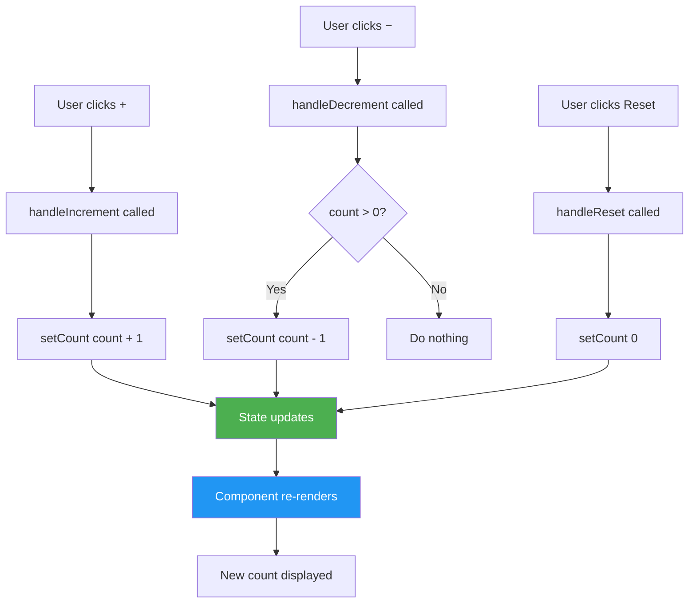
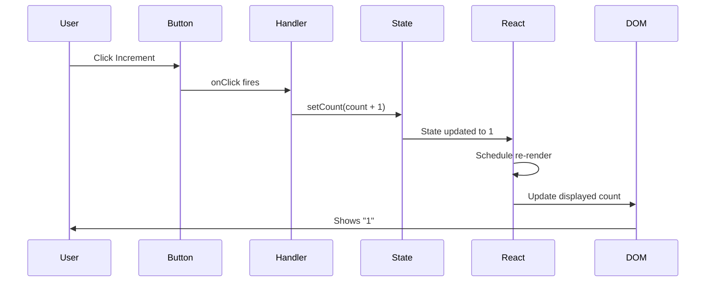

# Counter App - Easy Level

## Problem Statement

Create a counter application with the following features:
- Display current count (starts at 0)
- Increment button (+1)
- Decrement button (-1)
- Reset button (back to 0)
- Disable decrement when count is 0

## Difficulty: Easy ⭐

## Key Concepts Tested
- useState hook
- Event handlers
- Conditional rendering/disabling
- Component structure

---

## How to Think & Approach

### Step 1: Understand Requirements (2 minutes)
**Questions to ask interviewer:**
- Q: "Should the count have any limits (min/max)?"
  - A: Minimum is 0, no maximum
- Q: "Should we persist the count across page refreshes?"
  - A: No, it can reset on refresh
- Q: "Do we need any styling?"
  - A: Basic styling is fine, focus on functionality

### Step 2: Plan Component Structure (3 minutes)

```
┌─────────────────────────┐
│       Counter           │
│                         │
│  State: count (number)  │
│                         │
│  ┌─────────────────┐   │
│  │  Display: 0     │   │
│  └─────────────────┘   │
│                         │
│  [−] [Reset] [+]        │
│                         │
└─────────────────────────┘
```

**State needed:**
- `count`: number - stores current count value

**Functions needed:**
- `increment()`: increases count by 1
- `decrement()`: decreases count by 1 (if > 0)
- `reset()`: sets count back to 0

### Step 3: Identify State & Hooks (2 minutes)

```jsx
// Why useState?
// - Count changes over time (user interactions)
// - UI needs to re-render when count changes
// - Simple single value, perfect for useState

const [count, setCount] = useState(0)
//     ↑        ↑           ↑
//   current  updater   initial value
//    value  function
```

---

## Complete Implementation

```jsx
import React, { useState } from 'react'

/**
 * Counter Component
 *
 * Why this structure?
 * - Single component (no need to split for this simple app)
 * - All logic contained in one place
 * - Easy to understand and maintain
 */
function Counter() {
  // STATE MANAGEMENT
  // Why useState? Count is dynamic data that affects UI rendering
  // Initial value: 0 (requirement: start at 0)
  const [count, setCount] = useState(0)

  // EVENT HANDLERS

  /**
   * Increment handler
   * Why separate function?
   * - Reusable logic
   * - Easy to test
   * - Clear separation of concerns
   */
  const handleIncrement = () => {
    setCount(count + 1)
    // Why count + 1?
    // - We want to add 1 to current value
    // - setState triggers re-render with new value
  }

  /**
   * Decrement handler
   * Why check if count > 0?
   * - Requirement: minimum value is 0
   * - Prevents negative numbers
   * - Could also handle via disabled button (we do both for safety)
   */
  const handleDecrement = () => {
    if (count > 0) {
      setCount(count - 1)
    }
    // Alternative approach: setCount(Math.max(0, count - 1))
  }

  /**
   * Reset handler
   * Why set to 0?
   * - Requirement: reset means back to initial state
   * - 0 is our initial value
   */
  const handleReset = () => {
    setCount(0)
  }

  // RENDER
  return (
    <div className="counter">
      {/* Display Section */}
      <div className="counter-display">
        <h1>{count}</h1>
        {/* Why just {count}?
            - React automatically converts number to string
            - Direct state display, no transformation needed */}
      </div>

      {/* Controls Section */}
      <div className="counter-controls">
        {/* Decrement Button */}
        <button
          onClick={handleDecrement}
          disabled={count === 0}
          className="btn btn-decrement"
        >
          {/* Why disable when count === 0?
              - Prevents going below 0
              - Visual feedback to user
              - Better UX than allowing click with no effect */}
          −
        </button>

        {/* Reset Button */}
        <button
          onClick={handleReset}
          className="btn btn-reset"
        >
          Reset
        </button>

        {/* Increment Button */}
        <button
          onClick={handleIncrement}
          className="btn btn-increment"
        >
          +
        </button>
      </div>
    </div>
  )
}

export default Counter
```

### CSS (Minimal, Functional)

```css
.counter {
  display: flex;
  flex-direction: column;
  align-items: center;
  gap: 20px;
  padding: 40px;
}

.counter-display h1 {
  font-size: 72px;
  margin: 0;
  font-weight: bold;
}

.counter-controls {
  display: flex;
  gap: 10px;
}

.btn {
  padding: 12px 24px;
  font-size: 18px;
  border: 2px solid #333;
  border-radius: 4px;
  cursor: pointer;
  background: white;
  transition: all 0.2s;
}

.btn:hover:not(:disabled) {
  background: #f0f0f0;
}

.btn:disabled {
  opacity: 0.5;
  cursor: not-allowed;
}

.btn-increment {
  background: #4CAF50;
  color: white;
  border-color: #4CAF50;
}

.btn-decrement {
  background: #f44336;
  color: white;
  border-color: #f44336;
}

.btn-reset {
  background: #2196F3;
  color: white;
  border-color: #2196F3;
}
```

---

## State Flow Diagram



---

## Common Beginner Mistakes

### ❌ Mistake 1: Mutating State Directly

```jsx
// WRONG - Direct mutation
const handleIncrement = () => {
  count++ // ❌ Doesn't work!
  // React won't re-render because state wasn't updated via setState
}

// RIGHT - Use setState
const handleIncrement = () => {
  setCount(count + 1) // ✅ React knows state changed
}
```

**Why is this wrong?**
- React uses `Object.is()` comparison to detect state changes
- Direct mutation doesn't change the reference
- React won't re-render because it thinks nothing changed
- Always use setState/setCount to update state

---

### ❌ Mistake 2: Not Handling Edge Cases

```jsx
// WRONG - Allows negative numbers
const handleDecrement = () => {
  setCount(count - 1) // Can go below 0!
}

// RIGHT - Check boundary
const handleDecrement = () => {
  if (count > 0) {
    setCount(count - 1)
  }
}
```

**Why is this wrong?**
- Requirements say minimum is 0
- Negative counts don't make sense for this use case
- Always validate state changes against requirements

---

### ❌ Mistake 3: Multiple setState Calls

```jsx
// WRONG - Potential issue with multiple quick clicks
const handleIncrementBy3 = () => {
  setCount(count + 1) // These might not work as expected
  setCount(count + 1) // if state updates are batched!
  setCount(count + 1)
}

// RIGHT - Use functional update
const handleIncrementBy3 = () => {
  setCount(prev => prev + 1)
  setCount(prev => prev + 1)
  setCount(prev => prev + 1)
}
```

**Why is this wrong?**
- State updates may be batched
- `count` value doesn't change between setState calls in same function
- Using previous value ensures each update builds on the last

---

### ❌ Mistake 4: Inline Functions in JSX

```jsx
// WORKS but NOT OPTIMAL
<button onClick={() => setCount(count + 1)}>+</button>

// BETTER - Named function
const handleIncrement = () => setCount(count + 1)
<button onClick={handleIncrement}>+</button>
```

**Why is better approach preferred?**
- Named functions are easier to test
- Clearer what the button does
- Easier to add logic later (validation, logging, etc.)
- Better for debugging (named functions in stack traces)
- For simple cases, inline is acceptable, but named is professional

---

## Interviewer Questions & Answers

### Q1: "Why did you use useState instead of just a regular variable?"

**Answer:**
"I used useState because count is dynamic data that changes based on user interaction, and we need the UI to reflect those changes. A regular variable would update the value but wouldn't trigger a re-render, so the user wouldn't see the count change on the screen. useState tells React 'when this value changes, please re-render the component with the new value.'"

```jsx
// This won't work - UI won't update
let count = 0
const handleIncrement = () => {
  count++ // Value changes, but no re-render
}

// This works - UI updates
const [count, setCount] = useState(0)
const handleIncrement = () => {
  setCount(count + 1) // Triggers re-render
}
```

---

### Q2: "What happens when we click increment very quickly multiple times?"

**Answer:**
"React batches state updates for performance. If we click very quickly, React groups multiple setCount calls together and re-renders once instead of multiple times. However, our current code works correctly because each click is a separate event, so count has the current value at click time.

If we needed to increment multiple times in one function, we'd use functional updates:

```jsx
// Current: works for individual clicks
setCount(count + 1)

// For multiple updates in one function
setCount(prev => prev + 1) // Always gets latest value
```

The functional form is safer because it always gets the most recent state value."

---

### Q3: "How would you add a history feature to show all previous values?"

**Answer:**
"I'd add another state to track history as an array. Here's how:

```jsx
const [count, setCount] = useState(0)
const [history, setHistory] = useState([0])

const handleIncrement = () => {
  const newCount = count + 1
  setCount(newCount)
  setHistory([...history, newCount]) // Add to history
}

// Display history
{history.map((value, index) => (
  <span key={index}>{value}, </span>
))}
```

**Why this approach?**
- Separate state for separate concerns
- History doesn't affect current count logic
- Easy to add features like 'undo' later
- Could limit history size with `history.slice(-10)` for last 10 values"

---

### Q4: "How would you test this component?"

**Answer:**
"I'd test the key behaviors:

```jsx
import { render, screen, fireEvent } from '@testing-library/react'
import Counter from './Counter'

test('starts at 0', () => {
  render(<Counter />)
  expect(screen.getByText('0')).toBeInTheDocument()
})

test('increments on + click', () => {
  render(<Counter />)
  fireEvent.click(screen.getByText('+'))
  expect(screen.getByText('1')).toBeInTheDocument()
})

test('decrements on - click', () => {
  render(<Counter />)
  fireEvent.click(screen.getByText('+')) // Go to 1 first
  fireEvent.click(screen.getByText('−'))
  expect(screen.getByText('0')).toBeInTheDocument()
})

test('does not go below 0', () => {
  render(<Counter />)
  fireEvent.click(screen.getByText('−'))
  expect(screen.getByText('0')).toBeInTheDocument()
})

test('resets to 0', () => {
  render(<Counter />)
  fireEvent.click(screen.getByText('+'))
  fireEvent.click(screen.getByText('Reset'))
  expect(screen.getByText('0')).toBeInTheDocument()
})
```

These tests cover all the requirements and edge cases."

---

### Q5: "How would you make this more performant?"

**Answer:**
"For this simple component, performance is already fine. But if this were part of a larger app with many counters, I'd optimize:

```jsx
// 1. Use useCallback for functions passed to children
const handleIncrement = useCallback(() => {
  setCount(prev => prev + 1)
}, []) // No dependencies

// 2. Memoize the component
export default React.memo(Counter)

// 3. For very large apps, use useReducer for complex state
const [state, dispatch] = useReducer(counterReducer, { count: 0 })
```

**However**, premature optimization is bad. I'd profile first to see if there's actually a performance issue before adding complexity."

---

## Component Lifecycle



---

## Variations & Extensions

### Extension 1: Increment/Decrement by Custom Amount

```jsx
const [count, setCount] = useState(0)
const [step, setStep] = useState(1)

const handleIncrement = () => setCount(count + step)
const handleDecrement = () => setCount(Math.max(0, count - step))

// Add input for step
<input
  type="number"
  value={step}
  onChange={(e) => setStep(Number(e.target.value))}
  min="1"
/>
```

### Extension 2: Min/Max Limits

```jsx
const MIN = 0
const MAX = 100

const handleIncrement = () => {
  if (count < MAX) {
    setCount(count + 1)
  }
}

<button disabled={count === MAX}>+</button>
```

### Extension 3: LocalStorage Persistence

```jsx
const [count, setCount] = useState(() => {
  // Why lazy initialization?
  // - Only runs once on mount
  // - Prevents reading localStorage every render
  const saved = localStorage.getItem('count')
  return saved ? parseInt(saved) : 0
})

useEffect(() => {
  // Why useEffect?
  // - Side effect (interacting with browser API)
  // - Runs after render, not during
  localStorage.setItem('count', count)
}, [count]) // Update localStorage whenever count changes
```

---

## Time Complexity

- **Increment**: O(1) - constant time operation
- **Decrement**: O(1) - constant time operation
- **Reset**: O(1) - constant time operation
- **Render**: O(1) - fixed number of elements

## Space Complexity

- **O(1)** - only stores one number in state

---

## Key Takeaways

✅ **useState** for simple state that affects rendering
✅ **Named functions** for event handlers (easier to test/debug)
✅ **Conditional disabling** for better UX
✅ **Validate state changes** before updating
✅ **Start simple** then add features incrementally

---

## Practice Variations

Try building these variations to master the concept:

1. **Dual Counters**: Two independent counters side by side
2. **Counter List**: Add/remove multiple counters dynamically
3. **Animated Counter**: Add smooth number transitions
4. **Counter with Limits**: Set custom min/max values
5. **Multi-Step Counter**: Increment by 1, 5, 10, or custom amount

---

## Related Questions

- Todo List (Easy) - Similar state management
- Form Validation (Easy) - Input handling and validation
- Toggle Theme (Easy) - Boolean state management
