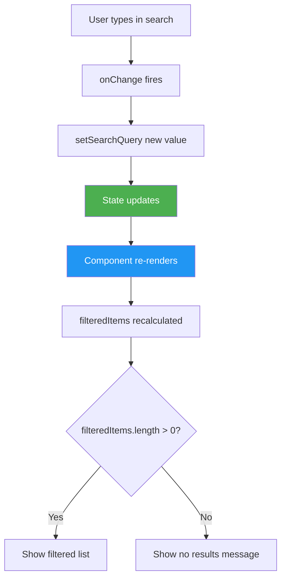

# Search Filter List - Easy Level

## Problem Statement

Create a searchable list where users can:
- Filter items as they type in search box
- See real-time filtered results
- Handle case-insensitive search
- Show "No results" when nothing matches

## Difficulty: Easy ⭐

## Key Concepts Tested
- useState for search input
- Array filtering
- Controlled inputs
- Conditional rendering

---

## How to Think & Approach

### Step 1: Understand Requirements
**Q:** Should search be case-sensitive?
**A:** No, case-insensitive

**Q:** Search in which fields?
**A:** Name/title field only

### Step 2: Plan Data & State

```
State needed:
- searchQuery: string (what user types)

Data:
- items: array of objects (can be hardcoded or props)

Derived:
- filteredItems: computed from items + searchQuery
```

### Step 3: Component Diagram

```
┌──────────────────────────┐
│   SearchableList         │
│  ┌────────────────────┐  │
│  │ Search: [____]     │  │
│  └────────────────────┘  │
│  Results: 3 of 10        │
│  ┌────────────────────┐  │
│  │ □ Apple            │  │
│  │ □ Apricot          │  │
│  │ □ Banana           │  │
│  └────────────────────┘  │
└──────────────────────────┘
```

---

## Complete Implementation

```jsx
import React, { useState } from 'react'

/**
 * SearchableList Component
 *
 * Why this approach?
 * - Single component (simple enough)
 * - State for search query only
 * - Filtered list is derived (computed from search + data)
 */
function SearchableList() {
  // DATA (In real app, this might come from props or API)
  const items = [
    { id: 1, name: 'Apple' },
    { id: 2, name: 'Banana' },
    { id: 3, name: 'Cherry' },
    { id: 4, name: 'Date' },
    { id: 5, name: 'Elderberry' },
    { id: 6, name: 'Fig' },
    { id: 7, name: 'Grape' },
    { id: 8, name: 'Honeydew' },
    { id: 9, name: 'Kiwi' },
    { id: 10, name: 'Lemon' }
  ]

  // STATE
  /**
   * Why useState for search?
   * - Search query changes as user types (dynamic)
   * - Needs to trigger re-render to show filtered results
   * - Controlled input pattern
   */
  const [searchQuery, setSearchQuery] = useState('')

  // DERIVED STATE
  /**
   * Why compute instead of useState?
   * - Filtered list depends on searchQuery and items
   * - No need for separate state
   * - Auto-updates when searchQuery changes
   * - Avoids sync issues
   *
   * Why not useMemo?
   * - For small lists, filtering is fast enough
   * - useMemo adds complexity
   * - Use useMemo for expensive operations on large data
   */
  const filteredItems = items.filter(item =>
    // Why toLowerCase()?
    // - Case-insensitive search
    // - "apple" matches "Apple"
    item.name.toLowerCase().includes(searchQuery.toLowerCase())
  )

  // HANDLERS
  const handleSearchChange = (e) => {
    setSearchQuery(e.target.value)
    // Why no trim() here?
    // - User might intentionally type spaces
    // - Filter handles it correctly anyway
    // - Show results as user types, including spaces
  }

  const handleClearSearch = () => {
    setSearchQuery('')
    // Why separate clear function?
    // - Better UX with clear button
    // - One-click to reset
  }

  // RENDER
  return (
    <div className="searchable-list">
      <h2>Fruit Search</h2>

      {/* SEARCH INPUT */}
      <div className="search-box">
        <input
          type="text"
          value={searchQuery}
          onChange={handleSearchChange}
          placeholder="Search fruits..."
          className="search-input"
        />

        {/* CLEAR BUTTON - Show only when there's text */}
        {/* Why conditional render?
            - Only useful when there's text to clear
            - Cleaner UI when search is empty */}
        {searchQuery && (
          <button onClick={handleClearSearch} className="btn-clear">
            ✕
          </button>
        )}
      </div>

      {/* RESULTS COUNT */}
      <div className="results-info">
        {searchQuery && (
          // Why show only when searching?
          // - No need to show "10 of 10" when not filtered
          <p>
            Found {filteredItems.length} of {items.length} items
          </p>
        )}
      </div>

      {/* RESULTS LIST */}
      {filteredItems.length > 0 ? (
        <ul className="items-list">
          {filteredItems.map(item => (
            <li key={item.id} className="item">
              {/* Why highlight matching text? (optional enhancement)
                  - Better UX - user sees what matched
                  - Will add in variation below */}
              {item.name}
            </li>
          ))}
        </ul>
      ) : (
        // Why show "no results" message?
        // - Better UX than empty space
        // - Confirms that search is working
        <p className="no-results">
          No items found matching "{searchQuery}"
        </p>
      )}
    </div>
  )
}

export default SearchableList
```

---

## State Flow Diagram



---

## Common Beginner Mistakes

### ❌ Mistake 1: Storing Filtered Results in State

```jsx
// WRONG - Unnecessary state
const [filteredItems, setFilteredItems] = useState(items)

const handleSearch = (e) => {
  const query = e.target.value
  setSearchQuery(query)
  setFilteredItems(items.filter(...)) // ❌ Extra state!
}

// RIGHT - Compute on render
const filteredItems = items.filter(...)
```

**Why wrong?**
- Duplicate state creates sync issues
- What if items change? filteredItems becomes stale
- Derived data should be computed, not stored

---

### ❌ Mistake 2: Case-Sensitive Search

```jsx
// WRONG - Case sensitive
item.name.includes(searchQuery)
// "apple" won't match "Apple"

// RIGHT - Case insensitive
item.name.toLowerCase().includes(searchQuery.toLowerCase())
```

---

### ❌ Mistake 3: Not Handling Empty Search

```jsx
// WRONG - Doesn't check if query is empty
const filteredItems = items.filter(item =>
  item.name.includes(searchQuery)
)
// Empty search shows all items, but might want different behavior

// BETTER - Explicit handling
const filteredItems = searchQuery === ''
  ? items
  : items.filter(item => item.name.toLowerCase().includes(searchQuery.toLowerCase()))

// OR just let filter handle it (current approach)
// Empty string matches everything, which is fine for search
```

---

## Interviewer Questions & Answers

### Q1: "How would you optimize this for 10,000 items?"

**Answer:**
"For large datasets, I'd optimize in several ways:

**1. Debounce the search:**
```jsx
import { useState, useEffect } from 'react'

const [searchQuery, setSearchQuery] = useState('')
const [debouncedQuery, setDebouncedQuery] = useState('')

useEffect(() => {
  const timer = setTimeout(() => {
    setDebouncedQuery(searchQuery)
  }, 300) // Wait 300ms after user stops typing

  return () => clearTimeout(timer)
}, [searchQuery])

// Filter using debouncedQuery instead
const filteredItems = items.filter(...)
```
Why? Prevents filtering on every keystroke.

**2. Memoize filtered results:**
```jsx
const filteredItems = useMemo(() =>
  items.filter(item =>
    item.name.toLowerCase().includes(searchQuery.toLowerCase())
  ),
  [items, searchQuery]
)
```
Why? Only recomputes when search or items actually change.

**3. Virtualize the list:**
```jsx
import { FixedSizeList } from 'react-window'
```
Why? Only render visible items, not all 10,000."

---

### Q2: "How would you highlight the matching text?"

**Answer:**
"I'd create a helper function to split and highlight:

```jsx
const highlightText = (text, query) => {
  if (!query) return text

  const parts = text.split(new RegExp(`(${query})`, 'gi'))
  return parts.map((part, index) =>
    part.toLowerCase() === query.toLowerCase() ? (
      <mark key={index}>{part}</mark>
    ) : (
      part
    )
  )
}

// Usage
<li>{highlightText(item.name, searchQuery)}</li>
```

This splits the text by the query and wraps matches in `<mark>` tags."

---

### Q3: "How would you add search to multiple fields?"

**Answer:**
"I'd modify the filter to check multiple fields:

```jsx
const items = [
  { id: 1, name: 'Apple', category: 'Fruit', color: 'Red' }
]

const filteredItems = items.filter(item => {
  const query = searchQuery.toLowerCase()
  return (
    item.name.toLowerCase().includes(query) ||
    item.category.toLowerCase().includes(query) ||
    item.color.toLowerCase().includes(query)
  )
})
```

Or create a search function:
```jsx
const matchesQuery = (item, query) => {
  const q = query.toLowerCase()
  return Object.values(item)
    .join(' ') // Combine all values
    .toLowerCase()
    .includes(q)
}

const filteredItems = items.filter(item => matchesQuery(item, searchQuery))
```"

---

## Enhancement: Debounced Search

```jsx
import { useState, useEffect } from 'react'

function DebouncedSearch() {
  const [searchQuery, setSearchQuery] = useState('')
  const [debouncedQuery, setDebouncedQuery] = useState('')

  /**
   * Why useEffect for debouncing?
   * - Side effect (setTimeout)
   * - Runs after searchQuery changes
   * - Cleanup prevents memory leaks
   */
  useEffect(() => {
    // Why setTimeout?
    // - Delay execution
    // - Wait for user to stop typing

    const timer = setTimeout(() => {
      setDebouncedQuery(searchQuery)
    }, 300) // 300ms delay

    // Why cleanup?
    // - Clear pending timer if searchQuery changes again
    // - Prevents multiple timers running
    return () => clearTimeout(timer)
  }, [searchQuery]) // Re-run when searchQuery changes

  // Filter using debounced query
  const filteredItems = items.filter(item =>
    item.name.toLowerCase().includes(debouncedQuery.toLowerCase())
  )

  return (
    <div>
      <input
        value={searchQuery}
        onChange={(e) => setSearchQuery(e.target.value)}
        placeholder="Type to search..."
      />
      {/* Shows immediate feedback */}
      {searchQuery !== debouncedQuery && <span>Searching...</span>}

      {/* Filtered results */}
      {filteredItems.map(...)}
    </div>
  )
}
```

**Why debouncing?**
- Reduces unnecessary re-renders
- Waits for user to finish typing
- Better for expensive operations (API calls, large datasets)

---

## Enhancement: Search with Highlighting

```jsx
function SearchableListWithHighlight() {
  const [searchQuery, setSearchQuery] = useState('')

  const items = [
    { id: 1, name: 'JavaScript' },
    { id: 2, name: 'Java' },
    { id: 3, name: 'Python' }
  ]

  const filteredItems = items.filter(item =>
    item.name.toLowerCase().includes(searchQuery.toLowerCase())
  )

  /**
   * Highlight matching text
   * Why regex with 'gi' flags?
   * - g: global (all matches)
   * - i: case-insensitive
   */
  const highlightText = (text, highlight) => {
    if (!highlight.trim()) {
      return text
    }

    // Escape special regex characters
    const escapedHighlight = highlight.replace(/[.*+?^${}()|[\]\\]/g, '\\$&')

    // Split by the search term
    const parts = text.split(new RegExp(`(${escapedHighlight})`, 'gi'))

    return (
      <span>
        {parts.map((part, index) =>
          part.toLowerCase() === highlight.toLowerCase() ? (
            <mark key={index} className="highlight">{part}</mark>
          ) : (
            part
          )
        )}
      </span>
    )
  }

  return (
    <div>
      <input
        value={searchQuery}
        onChange={(e) => setSearchQuery(e.target.value)}
      />

      <ul>
        {filteredItems.map(item => (
          <li key={item.id}>
            {highlightText(item.name, searchQuery)}
          </li>
        ))}
      </ul>
    </div>
  )
}
```

```css
.highlight {
  background-color: yellow;
  font-weight: bold;
}
```

---

## Time Complexity

- **Filter operation**: O(n × m)
  - n = number of items
  - m = average string length
- **For small datasets**: Fast enough
- **For large datasets**: Use debouncing + memoization

---

## Key Takeaways

✅ Derived state should be computed, not stored
✅ Use toLowerCase() for case-insensitive search
✅ Debounce for large datasets or API calls
✅ useMemo for expensive filtering operations
✅ Show "no results" for better UX
✅ Clear button improves usability

---

## Related Questions

- Autocomplete (Medium) - Similar + API integration
- Debounced Search (Medium) - Adds debouncing
- Infinite Scroll (Medium) - Pagination with search
