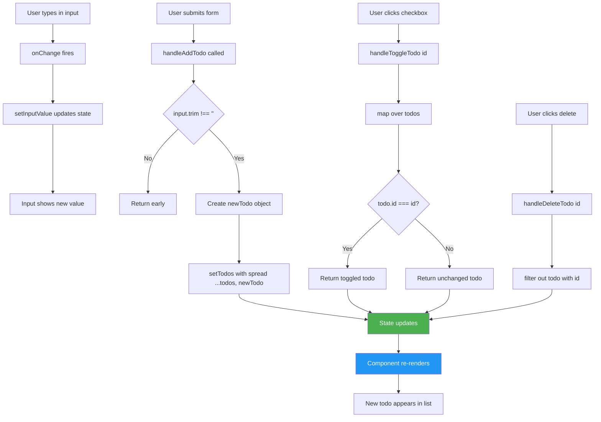
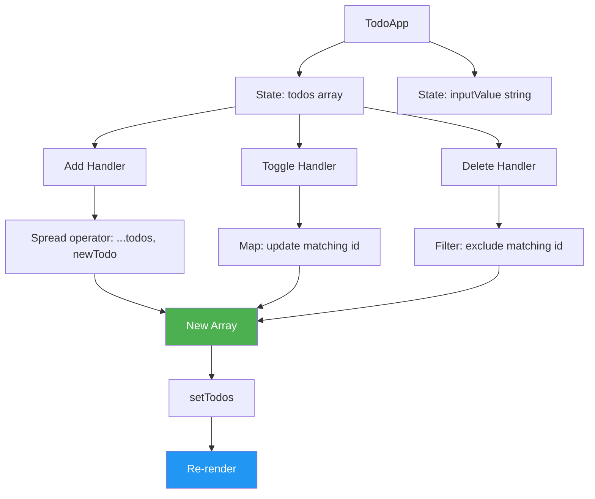

# Todo List (Basic) - Easy Level

## Problem Statement

Create a todo list application with the following features:
- Add new todos
- Mark todos as complete/incomplete (toggle)
- Delete todos
- Display count of pending todos
- Input validation (don't add empty todos)

## Difficulty: Easy ⭐

## Key Concepts Tested
- useState with arrays
- Array manipulation (add, remove, update)
- Form handling
- List rendering with keys
- Conditional styling

---

## How to Think & Approach

### Step 1: Understand Requirements (2 minutes)

**Questions to ask interviewer:**
- Q: "Should todos persist across page refresh?"
  - A: No, state can reset (we can add localStorage as extension)
- Q: "Do we need edit functionality?"
  - A: No, just add/complete/delete for basic version
- Q: "Should completed todos be visually different?"
  - A: Yes, show with line-through or different style

### Step 2: Plan Component Structure (3 minutes)

```
┌──────────────────────────────────┐
│         TodoApp                  │
│                                  │
│  State:                          │
│  - todos: Array<{id, text, done}>│
│  - inputValue: string            │
│                                  │
│  ┌────────────────────────────┐ │
│  │  Input + Add Button        │ │
│  └────────────────────────────┘ │
│                                  │
│  ┌────────────────────────────┐ │
│  │ □ Buy groceries      [×]   │ │
│  │ ☑ Walk dog          [×]   │ │
│  │ □ Read book         [×]   │ │
│  └────────────────────────────┘ │
│                                  │
│  Pending: 2 / 3                  │
└──────────────────────────────────┘
```

### Step 3: Design Data Structure

```jsx
// Todo Object Structure
{
  id: string,      // Unique identifier (Date.now() or UUID)
  text: string,    // Todo description
  completed: boolean  // Completion status
}

// Example:
[
  { id: '1', text: 'Buy groceries', completed: false },
  { id: '2', text: 'Walk dog', completed: true },
  { id: '3', text: 'Read book', completed: false }
]
```

**Why this structure?**
- `id`: Unique key for React list rendering
- `text`: What the todo says
- `completed`: Track status (boolean is clearest)

---

## Complete Implementation

```jsx
import React, { useState } from 'react'

/**
 * TodoApp Component
 *
 * Why single component?
 * - For basic version, splitting isn't necessary
 * - All state is related to todos
 * - Simple enough to maintain in one file
 *
 * When to split?
 * - When adding filters, categories, etc.
 * - When TodoItem needs complex logic
 */
function TodoApp() {
  // STATE MANAGEMENT

  /**
   * Why useState with array?
   * - Todos are a collection (multiple items)
   * - Array maintains order
   * - Easy to map over for rendering
   */
  const [todos, setTodos] = useState([])

  /**
   * Why separate state for input?
   * - Controlled input (React manages value)
   * - Can validate before adding
   * - Can clear after adding
   */
  const [inputValue, setInputValue] = useState('')

  // COMPUTED VALUES

  /**
   * Why not useState for pendingCount?
   * - Derived from todos (not independent state)
   * - Auto-updates when todos change
   * - Prevents sync issues
   *
   * Could use useMemo for optimization:
   * const pendingCount = useMemo(
   *   () => todos.filter(t => !t.completed).length,
   *   [todos]
   * )
   * But for small lists, direct calculation is fine
   */
  const pendingCount = todos.filter(todo => !todo.completed).length

  // EVENT HANDLERS

  /**
   * Add Todo
   *
   * Why validate input?
   * - Empty todos don't make sense
   * - Better UX (no accidental empty items)
   * - Prevents cluttered list
   */
  const handleAddTodo = (e) => {
    e.preventDefault() // Why? Prevent form submission/page reload

    // Validation
    if (inputValue.trim() === '') {
      // Why trim()?
      // - Removes whitespace from start/end
      // - "   " is not a valid todo
      return // Exit early if invalid
    }

    // Create new todo object
    const newTodo = {
      id: Date.now().toString(), // Why Date.now()?
      // - Unique timestamp
      // - Simple for small apps
      // - For production: use UUID library
      text: inputValue.trim(), // Store trimmed version
      completed: false // New todos start incomplete
    }

    // Update state - ADD to array
    setTodos([...todos, newTodo])
    // Why spread operator?
    // - Creates new array (immutability)
    // - React detects change
    // - Adds newTodo at end

    // Alternative: setTodos(prevTodos => [...prevTodos, newTodo])
    // Use this if dealing with rapid state changes

    // Clear input
    setInputValue('') // Reset for next todo
  }

  /**
   * Toggle Todo Completion
   *
   * Why toggle instead of separate complete/incomplete?
   * - Single button (better UX)
   * - Less code
   * - Checkbox naturally toggles
   */
  const handleToggleTodo = (id) => {
    setTodos(todos.map(todo =>
      // Why map?
      // - Need to update ONE item in array
      // - Returns new array (immutability)
      // - Preserves order and other items

      todo.id === id
        ? { ...todo, completed: !todo.completed }
        // ↑ Found target: create new object with toggled status
        // Why spread? Keep other properties (id, text) unchanged

        : todo
        // ↑ Not target: return unchanged
    ))
  }

  /**
   * Delete Todo
   *
   * Why filter?
   * - Removes item from array
   * - Returns new array (immutability)
   * - Simple and readable
   */
  const handleDeleteTodo = (id) => {
    setTodos(todos.filter(todo => todo.id !== id))
    // Keep all todos EXCEPT the one with matching id
  }

  // RENDER
  return (
    <div className="todo-app">
      <h1>My Todo List</h1>

      {/* ADD TODO FORM */}
      {/* Why form element?
          - Semantic HTML
          - Allows Enter key submission
          - Better accessibility */}
      <form onSubmit={handleAddTodo} className="todo-form">
        <input
          type="text"
          value={inputValue}
          // Why value={inputValue}?
          // - Controlled component
          // - React state is source of truth
          // - Can programmatically control value

          onChange={(e) => setInputValue(e.target.value)}
          // Why onChange?
          // - Update state as user types
          // - Keeps input and state in sync

          placeholder="Enter a todo..."
          className="todo-input"
        />

        <button type="submit" className="btn-add">
          Add Todo
        </button>
      </form>

      {/* TODO LIST */}
      {/* Why check todos.length?
          - Show message when list is empty
          - Better UX than blank screen */}
      {todos.length === 0 ? (
        <p className="empty-message">No todos yet. Add one above! 🎯</p>
      ) : (
        <ul className="todo-list">
          {todos.map(todo => (
            // Why key={todo.id}?
            // - React needs unique key for list items
            // - Helps React identify which items changed
            // - Improves rendering performance
            // - NEVER use index as key if list can change!

            <li
              key={todo.id}
              className={`todo-item ${todo.completed ? 'completed' : ''}`}
              // Why template literal?
              // - Conditionally add 'completed' class
              // - Allows CSS styling of completed todos
            >
              {/* CHECKBOX - Toggle completion */}
              <input
                type="checkbox"
                checked={todo.completed}
                // Why checked instead of defaultChecked?
                // - Controlled component
                // - State drives checkbox state

                onChange={() => handleToggleTodo(todo.id)}
                // Why arrow function?
                // - Need to pass todo.id to handler
                // - Creates closure over current todo.id
                className="todo-checkbox"
              />

              {/* TODO TEXT */}
              <span className="todo-text">{todo.text}</span>

              {/* DELETE BUTTON */}
              <button
                onClick={() => handleDeleteTodo(todo.id)}
                className="btn-delete"
                aria-label="Delete todo" // Why? Accessibility
              >
                ×
              </button>
            </li>
          ))}
        </ul>
      )}

      {/* STATS */}
      {todos.length > 0 && (
        // Why && operator?
        // - Only show stats if there are todos
        // - Cleaner than ternary when no else clause
        <div className="todo-stats">
          Pending: {pendingCount} / {todos.length}
          {/* Shows: "Pending: 2 / 5" */}
        </div>
      )}
    </div>
  )
}

export default TodoApp
```

### CSS (Minimal, Functional)

```css
.todo-app {
  max-width: 600px;
  margin: 40px auto;
  padding: 20px;
}

.todo-form {
  display: flex;
  gap: 10px;
  margin-bottom: 20px;
}

.todo-input {
  flex: 1;
  padding: 10px;
  font-size: 16px;
  border: 2px solid #ddd;
  border-radius: 4px;
}

.btn-add {
  padding: 10px 20px;
  background: #4CAF50;
  color: white;
  border: none;
  border-radius: 4px;
  cursor: pointer;
  font-size: 16px;
}

.btn-add:hover {
  background: #45a049;
}

.empty-message {
  text-align: center;
  color: #999;
  font-style: italic;
  padding: 40px 0;
}

.todo-list {
  list-style: none;
  padding: 0;
}

.todo-item {
  display: flex;
  align-items: center;
  gap: 10px;
  padding: 12px;
  border: 1px solid #ddd;
  border-radius: 4px;
  margin-bottom: 8px;
  background: white;
  transition: background 0.2s;
}

.todo-item:hover {
  background: #f5f5f5;
}

.todo-item.completed .todo-text {
  text-decoration: line-through;
  color: #999;
}

.todo-checkbox {
  cursor: pointer;
  width: 20px;
  height: 20px;
}

.todo-text {
  flex: 1;
  font-size: 16px;
}

.btn-delete {
  padding: 4px 10px;
  background: #f44336;
  color: white;
  border: none;
  border-radius: 4px;
  cursor: pointer;
  font-size: 20px;
  line-height: 1;
}

.btn-delete:hover {
  background: #da190b;
}

.todo-stats {
  margin-top: 20px;
  padding: 10px;
  background: #e3f2fd;
  border-radius: 4px;
  text-align: center;
  font-weight: bold;
}
```

---

## Data Flow Diagram



---

## Common Beginner Mistakes

### ❌ Mistake 1: Mutating Array Directly

```jsx
// WRONG - Mutates state
const handleAddTodo = () => {
  todos.push(newTodo) // ❌ Direct mutation!
  setTodos(todos) // React might not detect change
}

// RIGHT - Create new array
const handleAddTodo = () => {
  setTodos([...todos, newTodo]) // ✅ New array
}
```

**Why wrong?**
- React uses shallow comparison
- Array reference hasn't changed
- React might skip re-render

---

### ❌ Mistake 2: Using Index as Key

```jsx
// WRONG - Index as key
{todos.map((todo, index) => (
  <li key={index}> // ❌ Bad for dynamic lists
    {todo.text}
  </li>
))}

// RIGHT - Unique ID as key
{todos.map(todo => (
  <li key={todo.id}> // ✅ Stable unique key
    {todo.text}
  </li>
))}
```

**Why wrong?**
- Index changes when items are reordered/deleted
- React loses track of which item is which
- Can cause bugs with checkboxes and inputs

**When index is OK:**
- Static list that never changes
- No reordering or deletion

---

### ❌ Mistake 3: Not Trimming Input

```jsx
// WRONG - Allows whitespace-only todos
if (inputValue === '') {
  return
}

// RIGHT - Trim whitespace
if (inputValue.trim() === '') {
  return
}
```

**Why trim?**
- User might type "   " (spaces)
- Appears valid but creates empty todo
- trim() removes leading/trailing whitespace

---

### ❌ Mistake 4: Incorrect Toggle Implementation

```jsx
// WRONG - Only sets to true
const handleToggleTodo = (id) => {
  setTodos(todos.map(todo =>
    todo.id === id ? { ...todo, completed: true } : todo
    // ❌ Always true, can't uncomplete!
  ))
}

// RIGHT - Toggle boolean
const handleToggleTodo = (id) => {
  setTodos(todos.map(todo =>
    todo.id === id ? { ...todo, completed: !todo.completed } : todo
    // ✅ Flips between true/false
  ))
}
```

---

### ❌ Mistake 5: Forgetting preventDefault

```jsx
// WRONG - Page reloads on submit
<form onSubmit={handleAddTodo}>

const handleAddTodo = () => {
  // No preventDefault!
  // Form submits, page reloads, state lost
}

// RIGHT - Prevent default behavior
const handleAddTodo = (e) => {
  e.preventDefault() // ✅ Stops form submission
}
```

**Why preventDefault?**
- Form default is to submit and reload page
- We want to handle submission in JavaScript
- Prevents losing state on reload

---

## Interviewer Questions & Answers

### Q1: "Why did you use map for toggling instead of finding and updating?"

**Answer:**
"Map is the React-friendly way to update one item in an array. It creates a new array (required for immutability), and returns the updated item when found, or the unchanged item otherwise. Here's the alternative approach:

```jsx
// Using find + update (wrong approach)
const handleToggleTodo = (id) => {
  const todo = todos.find(t => t.id === id)
  todo.completed = !todo.completed // ❌ Mutates original!
  setTodos([...todos]) // Still wrong - shallow copy doesn't help
}

// Using map (correct)
const handleToggleTodo = (id) => {
  setTodos(todos.map(todo =>
    todo.id === id
      ? { ...todo, completed: !todo.completed } // New object
      : todo // Unchanged
  ))
}
```

Map ensures we create a completely new array with a new object for the updated todo, which React can detect as a change."

---

### Q2: "How would you optimize this for a large number of todos (1000+)?"

**Answer:**
"For large lists, I'd make these optimizations:

**1. Use useCallback for handlers:**
```jsx
const handleToggleTodo = useCallback((id) => {
  setTodos(prev => prev.map(todo =>
    todo.id === id ? { ...todo, completed: !todo.completed } : todo
  ))
}, []) // No dependencies - uses functional update
```

**2. Memoize TodoItem component:**
```jsx
const TodoItem = React.memo(({ todo, onToggle, onDelete }) => (
  // ... todo item JSX
))
// Only re-renders if props actually changed
```

**3. Virtualize the list:**
```jsx
import { FixedSizeList } from 'react-window'
// Renders only visible items, not all 1000
```

**4. Memoize computed values:**
```jsx
const pendingCount = useMemo(
  () => todos.filter(t => !t.completed).length,
  [todos]
)
```

However, I'd profile first before adding complexity. Premature optimization is the root of all evil!"

---

### Q3: "How would you add a filter to show All/Active/Completed todos?"

**Answer:**
"I'd add filter state and compute filtered todos:

```jsx
const [filter, setFilter] = useState('all') // 'all', 'active', 'completed'

// Compute filtered todos (derived state)
const filteredTodos = useMemo(() => {
  switch(filter) {
    case 'active':
      return todos.filter(t => !t.completed)
    case 'completed':
      return todos.filter(t => t.completed)
    default:
      return todos
  }
}, [todos, filter])

// Render filtered todos
{filteredTodos.map(todo => ...)}

// Filter buttons
<button onClick={() => setFilter('all')}>All</button>
<button onClick={() => setFilter('active')}>Active</button>
<button onClick={() => setFilter('completed')}>Completed</button>
```

Why useMemo?
- Filtering is potentially expensive for large lists
- Prevents re-filtering on every render
- Only recomputes when todos or filter changes"

---

### Q4: "How would you persist todos to localStorage?"

**Answer:**
"I'd use useEffect to sync with localStorage:

```jsx
// Load from localStorage on mount
const [todos, setTodos] = useState(() => {
  const saved = localStorage.getItem('todos')
  return saved ? JSON.parse(saved) : []
})

// Save to localStorage whenever todos change
useEffect(() => {
  localStorage.setItem('todos', JSON.stringify(todos))
}, [todos])
```

**Why this approach?**
- Lazy initialization for useState (only reads localStorage once)
- useEffect runs after render (doesn't block UI)
- Automatic sync on any todo change
- Works with all operations (add, toggle, delete)

**Potential improvement:**
Add try-catch for JSON parsing in case localStorage is corrupted."

---

### Q5: "How would you add edit functionality?"

**Answer:**
"I'd add editing state to track which todo is being edited:

```jsx
const [editingId, setEditingId] = useState(null)
const [editText, setEditText] = useState('')

const handleStartEdit = (todo) => {
  setEditingId(todo.id)
  setEditText(todo.text)
}

const handleSaveEdit = () => {
  setTodos(todos.map(todo =>
    todo.id === editingId
      ? { ...todo, text: editText }
      : todo
  ))
  setEditingId(null)
  setEditText('')
}

// In render
{editingId === todo.id ? (
  <input
    value={editText}
    onChange={(e) => setEditText(e.target.value)}
    onBlur={handleSaveEdit}
    onKeyPress={(e) => e.key === 'Enter' && handleSaveEdit()}
  />
) : (
  <span onDoubleClick={() => handleStartEdit(todo)}>
    {todo.text}
  </span>
)}
```

**Why separate editingId state?**
- Tracks which todo is being edited
- null means no editing in progress
- Only one todo can be edited at a time"

---

## Component Architecture



---

## Time & Space Complexity

| Operation | Time | Space | Notes |
|-----------|------|-------|-------|
| Add Todo | O(n) | O(n) | Spreads entire array |
| Toggle Todo | O(n) | O(n) | Maps entire array |
| Delete Todo | O(n) | O(n) | Filters entire array |
| Render List | O(n) | O(n) | Maps for rendering |

**Could we optimize?**
- Use Map/Object for O(1) lookups by ID
- But for small lists (< 1000), current approach is fine
- Premature optimization adds complexity

---

## Extensions & Variations

### 1. Priority Levels
```jsx
const newTodo = {
  id: Date.now(),
  text: inputValue,
  completed: false,
  priority: 'medium' // 'low', 'medium', 'high'
}
```

### 2. Due Dates
```jsx
const newTodo = {
  id: Date.now(),
  text: inputValue,
  completed: false,
  dueDate: selectedDate
}
```

### 3. Categories/Tags
```jsx
const newTodo = {
  id: Date.now(),
  text: inputValue,
  completed: false,
  tags: ['work', 'urgent']
}
```

---

## Key Takeaways

✅ Use spread operator for immutable array updates
✅ Map for updating, filter for deleting array items
✅ Always use unique, stable keys for list items
✅ Validate and trim user input
✅ Derived state (like counts) should be computed, not stored
✅ preventDefault on form submissions
✅ Empty states improve UX

---

## Related Questions

- Search Filter (Easy) - Similar array filtering
- Accordion (Easy) - Toggle state management
- Pagination (Medium) - More complex array slicing
- Multi-step Form (Medium) - Form state management
