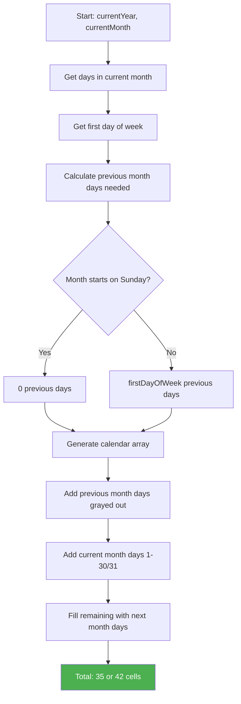

# Calendar / Date Picker - Hard Level

## Problem Statement

Create a calendar date picker component with:
- Display calendar grid for a given month
- Show days of the week (Sun-Sat)
- Navigate between months (prev/next)
- Select a date
- Highlight today's date
- Handle edge cases: leap years, month boundaries
- Show previous/next month overflow days (optional)

## Difficulty: Hard ⭐⭐⭐

## Key Concepts Tested
- JavaScript Date API manipulation
- Complex state management (current month, selected date)
- Grid layout calculation
- Edge case handling (leap years, month overflow)
- Date math and formatting

---

## How to Think & Approach

### Step 1: Understand Date Complexities (3 minutes)

**Key Challenges:**
- Months have different day counts (28-31)
- Leap years (February has 29 days)
- Week starts on different days
- First day of month might not be Sunday
- Need to calculate grid: 5-6 weeks × 7 days

**Questions to ask:**
- Q: "Should we show days from prev/next month to fill the grid?"
  - A: Yes, grayed out

- Q: "Can user select dates in the past?"
  - A: Yes (we can add restrictions later)

- Q: "Do we need year selection too?"
  - A: Start with month, add year as enhancement

### Step 2: Plan Calendar Grid

```
Calendar Grid Layout (35 or 42 cells):

Sun  Mon  Tue  Wed  Thu  Fri  Sat
─────────────────────────────────
 27   28   29   30   31    1    2   ← Previous month + current
  3    4    5    6    7    8    9
 10   11   12   13   14   15   16
 17   18   19   20   21   22   23
 24   25   26   27   28   29   30   ← Current month
  1    2    3    4    5    6    7   ← Next month overflow
```

**Algorithm:**
1. Get first day of month (day of week: 0-6)
2. Calculate days from previous month to show
3. Generate all days in current month
4. Fill remaining cells with next month days
5. Total cells = 35 or 42 (5 or 6 rows)

---

## Complete Implementation

```jsx
import React, { useState, useMemo } from 'react'

/**
 * Calendar Component
 *
 * Why complex?
 * - Date arithmetic is tricky
 * - Need to handle month boundaries
 * - Grid calculation requires careful logic
 * - Many edge cases (leap years, varying month lengths)
 */

function Calendar() {
  // STATE
  /**
   * Why store year and month separately?
   * - Easy to increment/decrement month
   * - Date object is mutable, not ideal for state
   * - Can construct dates as needed
   */
  const [currentDate, setCurrentDate] = useState(new Date())
  const [selectedDate, setSelectedDate] = useState(null)

  // DERIVED VALUES
  /**
   * Extract year and month
   * Why?
   * - Used multiple times
   * - Cleaner than repeating currentDate.getFullYear()
   */
  const currentYear = currentDate.getFullYear()
  const currentMonth = currentDate.getMonth() // 0-11

  /**
   * Today's date for highlighting
   * Why useMemo?
   * - Only create once, doesn't change during renders
   * - Used for comparison multiple times
   */
  const today = useMemo(() => {
    const now = new Date()
    now.setHours(0, 0, 0, 0) // Reset time for accurate comparison
    return now
  }, [])

  // HELPER FUNCTIONS

  /**
   * Get number of days in a month
   * Why new Date(year, month + 1, 0)?
   * - Day 0 of next month = last day of current month
   * - Returns Date object with correct day count
   */
  const getDaysInMonth = (year, month) => {
    return new Date(year, month + 1, 0).getDate()
    // Example: getDaysInMonth(2024, 1) → 29 (Feb 2024, leap year)
  }

  /**
   * Get day of week for first day of month
   * Returns 0-6 (Sun-Sat)
   */
  const getFirstDayOfMonth = (year, month) => {
    return new Date(year, month, 1).getDay()
  }

  /**
   * Generate calendar grid
   * Why useMemo?
   * - Expensive calculation (loops, date creation)
   * - Only recalculates when year or month changes
   * - Prevents regenerating on every render
   */
  const calendarDays = useMemo(() => {
    const daysInMonth = getDaysInMonth(currentYear, currentMonth)
    const firstDayOfMonth = getFirstDayOfMonth(currentYear, currentMonth)

    // How many days from previous month to show?
    const daysFromPrevMonth = firstDayOfMonth
    // If month starts on Sunday (0), show 0 prev days
    // If starts on Monday (1), show 1 prev day
    // etc.

    const prevMonth = currentMonth === 0 ? 11 : currentMonth - 1
    const prevMonthYear = currentMonth === 0 ? currentYear - 1 : currentYear
    const daysInPrevMonth = getDaysInMonth(prevMonthYear, prevMonth)

    const days = []

    // PREVIOUS MONTH DAYS (grayed out)
    for (let i = daysFromPrevMonth - 1; i >= 0; i--) {
      const day = daysInPrevMonth - i
      days.push({
        date: new Date(prevMonthYear, prevMonth, day),
        day,
        isCurrentMonth: false,
        isPrevMonth: true
      })
    }

    // CURRENT MONTH DAYS
    for (let day = 1; day <= daysInMonth; day++) {
      days.push({
        date: new Date(currentYear, currentMonth, day),
        day,
        isCurrentMonth: true,
        isPrevMonth: false
      })
    }

    // NEXT MONTH DAYS (fill to 35 or 42 cells)
    const totalCells = 35 // Could use 42 for 6 rows
    const nextMonth = currentMonth === 11 ? 0 : currentMonth + 1
    const nextMonthYear = currentMonth === 11 ? currentYear + 1 : currentYear
    const remainingCells = totalCells - days.length

    for (let day = 1; day <= remainingCells; day++) {
      days.push({
        date: new Date(nextMonthYear, nextMonth, day),
        day,
        isCurrentMonth: false,
        isPrevMonth: false
      })
    }

    return days
  }, [currentYear, currentMonth])
  // ↑ Recalculates only when month/year changes

  // EVENT HANDLERS

  /**
   * Navigate to previous month
   * Why setMonth instead of manual calculation?
   * - Date object handles month overflow automatically
   * - Dec → Nov, Jan → Dec of previous year
   */
  const handlePrevMonth = () => {
    setCurrentDate(prev => {
      const newDate = new Date(prev)
      newDate.setMonth(newDate.getMonth() - 1)
      return newDate
    })
  }

  const handleNextMonth = () => {
    setCurrentDate(prev => {
      const newDate = new Date(prev)
      newDate.setMonth(newDate.getMonth() + 1)
      return newDate
    })
  }

  /**
   * Handle date selection
   * Why store Date object?
   * - Preserves full date info
   * - Easy to format later
   * - Can compare with other dates
   */
  const handleDateClick = (date) => {
    setSelectedDate(date)
  }

  /**
   * Check if two dates are the same day
   * Why compare year, month, day separately?
   * - Date objects include time
   * - Two dates at different times are same "day"
   * - Ignore hours, minutes, seconds
   */
  const isSameDay = (date1, date2) => {
    if (!date1 || !date2) return false

    return (
      date1.getFullYear() === date2.getFullYear() &&
      date1.getMonth() === date2.getMonth() &&
      date1.getDate() === date2.getDate()
    )
  }

  /**
   * Format month and year for header
   */
  const monthNames = [
    'January', 'February', 'March', 'April', 'May', 'June',
    'July', 'August', 'September', 'October', 'November', 'December'
  ]

  const headerText = `${monthNames[currentMonth]} ${currentYear}`

  // RENDER
  return (
    <div className="calendar">
      {/* HEADER - Month navigation */}
      <div className="calendar-header">
        <button
          onClick={handlePrevMonth}
          className="nav-button"
          aria-label="Previous month"
        >
          ‹
        </button>

        <h2 className="calendar-title">{headerText}</h2>

        <button
          onClick={handleNextMonth}
          className="nav-button"
          aria-label="Next month"
        >
          ›
        </button>
      </div>

      {/* DAY NAMES */}
      <div className="calendar-weekdays">
        {['Sun', 'Mon', 'Tue', 'Wed', 'Thu', 'Fri', 'Sat'].map(day => (
          <div key={day} className="weekday-name">
            {day}
          </div>
        ))}
      </div>

      {/* CALENDAR GRID */}
      <div className="calendar-grid">
        {calendarDays.map((dayObj, index) => {
          const isToday = isSameDay(dayObj.date, today)
          const isSelected = isSameDay(dayObj.date, selectedDate)

          return (
            <button
              key={index}
              onClick={() => handleDateClick(dayObj.date)}
              className={`
                calendar-day
                ${!dayObj.isCurrentMonth ? 'other-month' : ''}
                ${isToday ? 'today' : ''}
                ${isSelected ? 'selected' : ''}
              `.trim()}
              aria-label={dayObj.date.toDateString()}
            >
              {dayObj.day}
            </button>
          )
        })}
      </div>

      {/* SELECTED DATE DISPLAY */}
      {selectedDate && (
        <div className="selected-date-display">
          <strong>Selected:</strong> {selectedDate.toDateString()}
        </div>
      )}
    </div>
  )
}

export default Calendar
```

---

## CSS

```css
.calendar {
  max-width: 400px;
  margin: 40px auto;
  padding: 20px;
  background: white;
  border-radius: 12px;
  box-shadow: 0 4px 6px rgba(0, 0, 0, 0.1);
  font-family: -apple-system, BlinkMacSystemFont, 'Segoe UI', sans-serif;
}

.calendar-header {
  display: flex;
  justify-content: space-between;
  align-items: center;
  margin-bottom: 20px;
}

.calendar-title {
  margin: 0;
  font-size: 20px;
  font-weight: 600;
}

.nav-button {
  background: #f0f0f0;
  border: none;
  border-radius: 50%;
  width: 36px;
  height: 36px;
  font-size: 24px;
  cursor: pointer;
  display: flex;
  align-items: center;
  justify-content: center;
  transition: background 0.2s;
}

.nav-button:hover {
  background: #e0e0e0;
}

.calendar-weekdays {
  display: grid;
  grid-template-columns: repeat(7, 1fr);
  gap: 4px;
  margin-bottom: 8px;
}

.weekday-name {
  text-align: center;
  font-weight: 600;
  font-size: 14px;
  color: #666;
  padding: 8px 0;
}

.calendar-grid {
  display: grid;
  grid-template-columns: repeat(7, 1fr);
  gap: 4px;
}

.calendar-day {
  aspect-ratio: 1;
  border: 1px solid transparent;
  background: white;
  border-radius: 8px;
  font-size: 14px;
  cursor: pointer;
  transition: all 0.2s;
  display: flex;
  align-items: center;
  justify-content: center;
}

.calendar-day:hover {
  background: #f5f5f5;
  border-color: #2196F3;
}

.calendar-day.other-month {
  color: #ccc;
  background: #fafafa;
}

.calendar-day.today {
  background: #e3f2fd;
  font-weight: bold;
  color: #2196F3;
}

.calendar-day.selected {
  background: #2196F3;
  color: white;
  font-weight: bold;
}

.selected-date-display {
  margin-top: 20px;
  padding: 12px;
  background: #f5f5f5;
  border-radius: 8px;
  text-align: center;
}
```

---

## Date Calculation Diagram



---

## Common Beginner Mistakes

### ❌ Mistake 1: Storing Calendar Grid in State

```jsx
// WRONG - Regenerate every render
const [calendarDays, setCalendarDays] = useState([])

useEffect(() => {
  const days = generateCalendar(...)
  setCalendarDays(days)
}, [currentMonth, currentYear])

// RIGHT - Compute with useMemo
const calendarDays = useMemo(() => {
  return generateCalendar(...)
}, [currentMonth, currentYear])
```

**Why wrong?**
- Calendar days are derived from currentMonth/currentYear
- No need for separate state
- useMemo caches result

---

### ❌ Mistake 2: Not Handling Leap Years

```jsx
// WRONG - Hardcoded days
const daysInMonth = [31, 28, 31, 30, ...] // ❌ Feb always 28!

// RIGHT - Calculate dynamically
const getDaysInMonth = (year, month) => {
  return new Date(year, month + 1, 0).getDate()
  // Automatically handles leap years
}
```

**Why this works:**
- `new Date(2024, 2, 0)` = last day of Feb 2024 = 29
- `new Date(2023, 2, 0)` = last day of Feb 2023 = 28

---

### ❌ Mistake 3: Comparing Dates with ===

```jsx
// WRONG - Compares object references
if (date1 === date2) // ❌ Always false for different objects

// RIGHT - Compare components
const isSameDay = (d1, d2) => {
  return d1.getFullYear() === d2.getFullYear() &&
         d1.getMonth() === d2.getMonth() &&
         d1.getDate() === d2.getDate()
}
```

---

### ❌ Mistake 4: Mutating Date Objects

```jsx
// WRONG - Mutates state
const handleNextMonth = () => {
  currentDate.setMonth(currentDate.getMonth() + 1)
  setCurrentDate(currentDate) // ❌ Same reference!
}

// RIGHT - Create new Date
const handleNextMonth = () => {
  const newDate = new Date(currentDate)
  newDate.setMonth(newDate.getMonth() + 1)
  setCurrentDate(newDate) // ✅ New object
}
```

---

## Interviewer Questions & Answers

### Q1: "How do you handle leap years?"

**Answer:**
"I use JavaScript's built-in Date API, which handles leap years automatically:

```jsx
const getDaysInMonth = (year, month) => {
  return new Date(year, month + 1, 0).getDate()
}

// Examples:
getDaysInMonth(2024, 1) // → 29 (leap year)
getDaysInMonth(2023, 1) // → 28 (not leap year)
getDaysInMonth(2000, 1) // → 29 (leap year - divisible by 400)
getDaysInMonth(1900, 1) // → 28 (not leap - divisible by 100 but not 400)
```

**Leap year rules:**
- Divisible by 4: leap year
- EXCEPT divisible by 100: not leap
- EXCEPT divisible by 400: is leap

JavaScript's Date handles all this automatically."

---

### Q2: "Why use useMemo for calendar days?"

**Answer:**
"Generating the calendar grid is expensive:

**Without useMemo:**
```jsx
const calendarDays = generateCalendarDays(...)
// Runs on EVERY render (typing in input, hover, etc.)
// Lots of Date object creation
// Array operations
```

**With useMemo:**
```jsx
const calendarDays = useMemo(() => {
  return generateCalendarDays(...)
}, [currentYear, currentMonth])
// Only runs when month/year actually changes
// Caches result between renders
```

**Performance impact:**
- Without: ~1ms per render (could be 60x/sec on animations)
- With: ~1ms only on month change (maybe 1x/sec)

For 60fps animations, this matters. Plus it's best practice for expensive calculations."

---

### Q3: "How would you add year selection?"

**Answer:**
"Add year navigation:

```jsx
const [showYearPicker, setShowYearPicker] = useState(false)

const handleYearChange = (year) => {
  const newDate = new Date(currentDate)
  newDate.setFullYear(year)
  setCurrentDate(newDate)
  setShowYearPicker(false)
}

// In header
<button onClick={() => setShowYearPicker(true)}>
  {currentYear}
</button>

{showYearPicker && (
  <YearPicker
    currentYear={currentYear}
    onSelectYear={handleYearChange}
  />
)}

// YearPicker component
function YearPicker({ currentYear, onSelectYear }) {
  const years = []
  for (let y = currentYear - 10; y <= currentYear + 10; y++) {
    years.push(y)
  }

  return (
    <div className="year-picker">
      {years.map(year => (
        <button
          key={year}
          onClick={() => onSelectYear(year)}
          className={year === currentYear ? 'current' : ''}
        >
          {year}
        </button>
      ))}
    </div>
  )
}
```"

---

### Q4: "How would you add date range selection?"

**Answer:**
"Track start and end dates:

```jsx
const [dateRange, setDateRange] = useState({
  start: null,
  end: null
})

const handleDateClick = (date) => {
  if (!dateRange.start || (dateRange.start && dateRange.end)) {
    // Start new range
    setDateRange({ start: date, end: null })
  } else {
    // Complete range
    if (date < dateRange.start) {
      setDateRange({ start: date, end: dateRange.start })
    } else {
      setDateRange({ start: dateRange.start, end: date })
    }
  }
}

// In render, check if date is in range
const isInRange = (date) => {
  if (!dateRange.start || !dateRange.end) return false
  return date >= dateRange.start && date <= dateRange.end
}

<button
  className={`
    ${isInRange(dayObj.date) ? 'in-range' : ''}
    ${isSameDay(dayObj.date, dateRange.start) ? 'range-start' : ''}
    ${isSameDay(dayObj.date, dateRange.end) ? 'range-end' : ''}
  `}
>
  {dayObj.day}
</button>
```"

---

### Q5: "How would you add min/max date restrictions?"

**Answer:**
"Add validation:

```jsx
const minDate = new Date(2024, 0, 1) // Jan 1, 2024
const maxDate = new Date(2024, 11, 31) // Dec 31, 2024

const isDateDisabled = (date) => {
  return date < minDate || date > maxDate
}

// In render
<button
  onClick={() => !isDateDisabled(dayObj.date) && handleDateClick(dayObj.date)}
  disabled={isDateDisabled(dayObj.date)}
  className={`
    calendar-day
    ${isDateDisabled(dayObj.date) ? 'disabled' : ''}
  `}
>
  {dayObj.day}
</button>

// Also disable month navigation if out of bounds
const isPrevMonthDisabled = () => {
  const firstDayOfMonth = new Date(currentYear, currentMonth, 1)
  return firstDayOfMonth <= minDate
}

<button
  onClick={handlePrevMonth}
  disabled={isPrevMonthDisabled()}
>
  ‹
</button>
```"

---

## Time Complexity

| Operation | Time | Notes |
|-----------|------|-------|
| Generate Calendar | O(1) | Always ~35-42 cells |
| Date Click | O(1) | Simple state update |
| Month Navigation | O(1) | Increment/decrement |
| Is Same Day | O(1) | Three comparisons |

**Overall:** Very performant, even without optimization

---

## Key Takeaways

✅ Use Date API for date math (handles edge cases)
✅ useMemo for expensive calculations
✅ Compare dates by components, not reference
✅ Create new Date objects (don't mutate)
✅ Grid layout = 35 or 42 cells (5-6 weeks)

---

## Related Questions

- Date Range Picker (Hard)
- Time Picker (Medium)
- DateTime Picker (Hard)
