# Connect Four Game - Hard Level

## Problem Statement

Build Connect Four game with:
- 6 rows × 7 columns grid
- Two players (Red & Yellow) alternate turns
- Click column to drop disc (gravity effect)
- Detect win: 4 in a row (horizontal, vertical, diagonal)
- Detect draw (board full)
- Reset/new game functionality
- Show current player and game status

## Difficulty: Hard ⭐⭐⭐

## Key Concepts Tested
- 2D array state management
- Complex game logic (win detection)
- Pure functions for game rules
- useState with complex state
- Algorithm implementation (win checking)

---

## How to Think & Approach

### Step 1: Understand Game Mechanics (3 minutes)

**Rules:**
- Discs drop to lowest available row in selected column
- Players alternate: Red → Yellow → Red...
- Win: 4 consecutive discs (horizontal/vertical/diagonal)
- Draw: Board full, no winner

**State needed:**
- `board`: 2D array (6×7) of cell values
- `currentPlayer`: 'red' or 'yellow'
- `winner`: null, 'red', 'yellow', or 'draw'

### Step 2: Plan Data Structure

```jsx
// Board representation
const board = [
  [null, null, null, null, null, null, null], // Row 0 (top)
  [null, null, null, null, null, null, null],
  [null, null, null, null, null, null, null],
  [null, null, null, null, null, null, null],
  [null, null, null, null, null, null, null],
  [null, null, null, null, null, null, null]  // Row 5 (bottom)
]

// Cell value: null (empty), 'red', or 'yellow'
```

**Why 2D array?**
- Natural grid representation
- Easy row/column access
- Simple to render

### Step 3: Win Detection Algorithm

```
Check 4 directions:
1. Horizontal (→)
2. Vertical (↓)
3. Diagonal down-right (↘)
4. Diagonal down-left (↙)

For each direction:
- Count consecutive discs of same color
- If count >= 4: Winner found!
```

---

## Complete Implementation

```jsx
import React, { useState, useCallback } from 'react'

/**
 * Connect Four Game
 *
 * Why complex?
 * - 2D state management
 * - Win detection algorithm
 * - Gravity simulation (disc drops)
 * - Multiple winning patterns
 */

const ROWS = 6
const COLS = 7
const EMPTY = null

function ConnectFour() {
  // STATE
  /**
   * Why function initialization?
   * - createEmptyBoard() only runs once on mount
   * - Not on every render
   * - Performance optimization
   */
  const [board, setBoard] = useState(() => createEmptyBoard())
  const [currentPlayer, setCurrentPlayer] = useState('red')
  const [winner, setWinner] = useState(null)
  const [winningCells, setWinningCells] = useState([])

  // HELPER FUNCTIONS

  /**
   * Create empty board
   * Why function?
   * - Reusable for reset
   * - Clean initialization
   */
  function createEmptyBoard() {
    return Array(ROWS).fill(null).map(() => Array(COLS).fill(EMPTY))
    // Creates 6 arrays of 7 null values
  }

  /**
   * Get lowest available row in a column
   * Why bottom-up?
   * - Gravity: discs fall to bottom
   * - Check from bottom row upward
   * - Return first empty cell
   */
  const getLowestEmptyRow = (board, col) => {
    for (let row = ROWS - 1; row >= 0; row--) {
      if (board[row][col] === EMPTY) {
        return row
      }
    }
    return -1 // Column full
  }

  /**
   * Check if player won
   * Why separate function?
   * - Complex logic, deserves own function
   * - Testable
   * - Checks 4 directions
   */
  const checkWinner = (board, row, col, player) => {
    // Check horizontal, vertical, and both diagonals
    return (
      checkDirection(board, row, col, 0, 1, player) ||  // Horizontal →
      checkDirection(board, row, col, 1, 0, player) ||  // Vertical ↓
      checkDirection(board, row, col, 1, 1, player) ||  // Diagonal ↘
      checkDirection(board, row, col, 1, -1, player)    // Diagonal ↙
    )
  }

  /**
   * Check one direction for 4 in a row
   * Why deltaRow and deltaCol?
   * - Generic direction checking
   * - deltaRow: 0=horizontal, 1=vertical/diagonal
   * - deltaCol: 1=right, -1=left, 0=vertical
   *
   * Algorithm:
   * 1. Count consecutive cells in both directions
   * 2. If total >= 4: winner!
   */
  const checkDirection = (board, row, col, deltaRow, deltaCol, player) => {
    let count = 1 // Current cell
    const cells = [[row, col]]

    // Count in positive direction
    count += countConsecutive(board, row, col, deltaRow, deltaCol, player, cells)

    // Count in negative direction
    count += countConsecutive(board, row, col, -deltaRow, -deltaCol, player, cells)

    if (count >= 4) {
      setWinningCells(cells.slice(0, 4)) // Store first 4 winning cells
      return true
    }

    return false
  }

  /**
   * Count consecutive discs in one direction
   */
  const countConsecutive = (board, row, col, deltaRow, deltaCol, player, cells) => {
    let count = 0
    let r = row + deltaRow
    let c = col + deltaCol

    while (
      r >= 0 && r < ROWS &&
      c >= 0 && c < COLS &&
      board[r][c] === player
    ) {
      count++
      cells.push([r, c])
      r += deltaRow
      c += deltaCol
    }

    return count
  }

  /**
   * Check if board is full (draw)
   */
  const isBoardFull = (board) => {
    return board[0].every(cell => cell !== EMPTY)
    // Top row full = entire board full (gravity)
  }

  // EVENT HANDLERS

  /**
   * Handle column click
   * Why useCallback?
   * - Passed to child components
   * - Prevents unnecessary re-renders
   * - Dependencies: board, currentPlayer, winner
   */
  const handleColumnClick = useCallback((col) => {
    // Can't play if game over
    if (winner) return

    // Find lowest empty row in this column
    const row = getLowestEmptyRow(board, col)

    // Column full
    if (row === -1) return

    // Create new board (immutability)
    const newBoard = board.map(row => [...row])
    newBoard[row][col] = currentPlayer

    // Update board
    setBoard(newBoard)

    // Check for winner
    if (checkWinner(newBoard, row, col, currentPlayer)) {
      setWinner(currentPlayer)
      return
    }

    // Check for draw
    if (isBoardFull(newBoard)) {
      setWinner('draw')
      return
    }

    // Switch player
    setCurrentPlayer(currentPlayer === 'red' ? 'yellow' : 'red')
  }, [board, currentPlayer, winner])

  /**
   * Reset game
   */
  const handleReset = () => {
    setBoard(createEmptyBoard())
    setCurrentPlayer('red')
    setWinner(null)
    setWinningCells([])
  }

  // RENDER
  return (
    <div className="connect-four">
      <h1>Connect Four</h1>

      {/* GAME STATUS */}
      <div className="game-status">
        {winner ? (
          winner === 'draw' ? (
            <div className="status-draw">Game Draw!</div>
          ) : (
            <div className={`status-winner ${winner}`}>
              {winner.toUpperCase()} Wins! 🎉
            </div>
          )
        ) : (
          <div className={`status-turn ${currentPlayer}`}>
            Current Player: {currentPlayer.toUpperCase()}
          </div>
        )}
      </div>

      {/* GAME BOARD */}
      <div className="board">
        {/* COLUMNS (clickable areas) */}
        <div className="board-columns">
          {Array(COLS).fill(null).map((_, col) => (
            <button
              key={col}
              onClick={() => handleColumnClick(col)}
              disabled={winner !== null}
              className="column-button"
              aria-label={`Drop disc in column ${col + 1}`}
            >
              {/* Visual indicator on hover */}
              {!winner && (
                <div className={`drop-indicator ${currentPlayer}`} />
              )}
            </button>
          ))}
        </div>

        {/* GRID CELLS */}
        <div className="board-grid">
          {board.map((row, rowIndex) =>
            row.map((cell, colIndex) => {
              const isWinningCell = winningCells.some(
                ([r, c]) => r === rowIndex && c === colIndex
              )

              return (
                <div
                  key={`${rowIndex}-${colIndex}`}
                  className="cell"
                >
                  <div
                    className={`
                      disc
                      ${cell || ''}
                      ${isWinningCell ? 'winning' : ''}
                    `.trim()}
                  />
                </div>
              )
            })
          )}
        </div>
      </div>

      {/* CONTROLS */}
      <button onClick={handleReset} className="reset-button">
        New Game
      </button>
    </div>
  )
}

export default ConnectFour
```

---

## CSS

```css
.connect-four {
  text-align: center;
  padding: 20px;
  max-width: 600px;
  margin: 0 auto;
}

.game-status {
  margin: 20px 0;
  font-size: 24px;
  font-weight: bold;
  min-height: 40px;
}

.status-turn.red {
  color: #e74c3c;
}

.status-turn.yellow {
  color: #f39c12;
}

.status-winner {
  font-size: 32px;
}

.status-winner.red {
  color: #e74c3c;
}

.status-winner.yellow {
  color: #f39c12;
}

.status-draw {
  color: #7f8c8d;
}

.board {
  position: relative;
  display: inline-block;
  background: #3498db;
  padding: 10px;
  border-radius: 10px;
  box-shadow: 0 4px 6px rgba(0, 0, 0, 0.1);
}

.board-columns {
  position: absolute;
  top: 0;
  left: 10px;
  right: 10px;
  bottom: 10px;
  display: grid;
  grid-template-columns: repeat(7, 1fr);
  z-index: 2;
}

.column-button {
  background: transparent;
  border: none;
  cursor: pointer;
  display: flex;
  justify-content: center;
  padding-top: 10px;
}

.column-button:disabled {
  cursor: not-allowed;
}

.column-button:hover:not(:disabled) .drop-indicator {
  opacity: 0.5;
}

.drop-indicator {
  width: 60px;
  height: 60px;
  border-radius: 50%;
  opacity: 0;
  transition: opacity 0.2s;
}

.drop-indicator.red {
  background: #e74c3c;
}

.drop-indicator.yellow {
  background: #f39c12;
}

.board-grid {
  display: grid;
  grid-template-columns: repeat(7, 70px);
  grid-template-rows: repeat(6, 70px);
  gap: 10px;
  position: relative;
  z-index: 1;
}

.cell {
  width: 70px;
  height: 70px;
  background: white;
  border-radius: 50%;
  display: flex;
  align-items: center;
  justify-content: center;
  box-shadow: inset 0 2px 4px rgba(0, 0, 0, 0.1);
}

.disc {
  width: 60px;
  height: 60px;
  border-radius: 50%;
  transition: all 0.3s ease;
}

.disc.red {
  background: #e74c3c;
  box-shadow: 0 4px 8px rgba(231, 76, 60, 0.4);
}

.disc.yellow {
  background: #f39c12;
  box-shadow: 0 4px 8px rgba(243, 156, 18, 0.4);
}

.disc.winning {
  animation: pulse 0.6s infinite alternate;
}

@keyframes pulse {
  from {
    transform: scale(1);
    box-shadow: 0 4px 8px rgba(0, 0, 0, 0.3);
  }
  to {
    transform: scale(1.1);
    box-shadow: 0 6px 12px rgba(0, 0, 0, 0.5);
  }
}

.reset-button {
  margin-top: 30px;
  padding: 12px 32px;
  font-size: 18px;
  background: #2ecc71;
  color: white;
  border: none;
  border-radius: 8px;
  cursor: pointer;
  font-weight: bold;
  transition: background 0.2s;
}

.reset-button:hover {
  background: #27ae60;
}
```

---

## Win Detection Algorithm Diagram

```mermaid
graph TD
    A[Disc placed at row, col] --> B{Check 4 directions}

    B --> C[Horizontal →]
    B --> D[Vertical ↓]
    B --> E[Diagonal ↘]
    B --> F[Diagonal ↙]

    C --> G[Count left + right]
    D --> H[Count up + down]
    E --> I[Count diagonal ↗ + ↙]
    F --> J[Count diagonal ↖ + ↘]

    G --> K{Count >= 4?}
    H --> K
    I --> K
    J --> K

    K -->|Yes| L[Winner found!]
    K -->|No| M[Continue game]

    style L fill:#4CAF50,color:#fff
```



---

## Common Beginner Mistakes

### ❌ Mistake 1: Mutating 2D Array

```jsx
// WRONG - Direct mutation
const handleClick = (col) => {
  const row = getLowestEmptyRow(board, col)
  board[row][col] = currentPlayer // ❌ Mutates state!
  setBoard(board)
}

// RIGHT - Create new array
const handleClick = (col) => {
  const row = getLowestEmptyRow(board, col)
  const newBoard = board.map(row => [...row]) // Deep copy
  newBoard[row][col] = currentPlayer
  setBoard(newBoard)
}
```

**Why map + spread?**
- `board.map(row => [...row])` creates new outer array AND new inner arrays
- Essential for React to detect change

---

### ❌ Mistake 2: Incorrect Win Detection

```jsx
// WRONG - Only checks one direction
const checkWinner = (board, row, col) => {
  // Only checks right
  let count = 0
  for (let c = col; c < COLS; c++) {
    if (board[row][c] === currentPlayer) count++
    else break
  }
  return count >= 4
}
// Misses left side, vertical, diagonals!

// RIGHT - Check all 4 directions
const checkWinner = (board, row, col, player) => {
  return (
    checkDirection(board, row, col, 0, 1, player) ||  // Horizontal
    checkDirection(board, row, col, 1, 0, player) ||  // Vertical
    checkDirection(board, row, col, 1, 1, player) ||  // Diagonal ↘
    checkDirection(board, row, col, 1, -1, player)    // Diagonal ↙
  )
}
```

---

### ❌ Mistake 3: Not Checking Column Full

```jsx
// WRONG - No validation
const handleClick = (col) => {
  const row = getLowestEmptyRow(board, col)
  // If column full, row = -1, causes error!
  newBoard[row][col] = currentPlayer // ❌ board[-1] error
}

// RIGHT - Validate first
const handleClick = (col) => {
  const row = getLowestEmptyRow(board, col)
  if (row === -1) return // Column full, exit early
  // ... continue
}
```

---

## Interviewer Questions & Answers

### Q1: "How does your win detection algorithm work?"

**Answer:**
"I check 4 directions from the last placed disc:

**1. Horizontal (←→):**
Count consecutive discs left and right

**2. Vertical (↑↓):**
Count consecutive discs up and down

**3. Diagonal (↖↘):**
Count consecutive discs in both diagonal directions

**4. Anti-diagonal (↗↙):**
Count consecutive in other diagonal

**Implementation:**
```jsx
// Generic direction checker
// deltaRow: 0=horizontal, 1=down, -1=up
// deltaCol: 1=right, 0=vertical, -1=left
const checkDirection = (board, row, col, deltaRow, deltaCol, player) => {
  let count = 1 // Current cell

  // Count positive direction
  let r = row + deltaRow, c = col + deltaCol
  while (r >= 0 && r < ROWS && c >= 0 && c < COLS && board[r][c] === player) {
    count++
    r += deltaRow
    c += deltaCol
  }

  // Count negative direction
  r = row - deltaRow
  c = col - deltaCol
  while (r >= 0 && r < ROWS && c >= 0 && c < COLS && board[r][c] === player) {
    count++
    r -= deltaRow
    c -= deltaCol
  }

  return count >= 4
}
```

This efficiently checks all winning patterns."

---

### Q2: "What's the time complexity of your win detection?"

**Answer:**
"**Per direction:** O(1) - at most 7 cells to check (board width)

**Total:** O(4) = O(1) - constant 4 directions

**Space:** O(1) - only counting, no extra structures

**Why constant?**
- Board size is fixed (6×7)
- Maximum cells to check per direction: 7
- Always checking exactly 4 directions

Even though it has loops, it's effectively O(1) for fixed board size.

**Alternative approach (slower):**
Check entire board after each move: O(rows × cols) = O(42)
Our approach is 10x faster by only checking around the last move."

---

### Q3: "How would you add an AI opponent?"

**Answer:**
"I'd implement Minimax algorithm with alpha-beta pruning:

**Basic AI (random):**
```jsx
const getAIMove = (board) => {
  const availableCols = []
  for (let col = 0; col < COLS; col++) {
    if (getLowestEmptyRow(board, col) !== -1) {
      availableCols.push(col)
    }
  }
  return availableCols[Math.floor(Math.random() * availableCols.length)]
}
```

**Smart AI (Minimax):**
```jsx
const minimax = (board, depth, isMaximizing) => {
  // Terminal states
  if (checkWinner(board, 'ai')) return 10 - depth
  if (checkWinner(board, 'player')) return depth - 10
  if (isBoardFull(board)) return 0
  if (depth >= 4) return evaluateBoard(board) // Depth limit

  if (isMaximizing) {
    let maxScore = -Infinity
    for (let col = 0; col < COLS; col++) {
      const row = getLowestEmptyRow(board, col)
      if (row === -1) continue

      // Try move
      board[row][col] = 'ai'
      const score = minimax(board, depth + 1, false)
      board[row][col] = null // Undo

      maxScore = Math.max(maxScore, score)
    }
    return maxScore
  } else {
    let minScore = Infinity
    for (let col = 0; col < COLS; col++) {
      const row = getLowestEmptyRow(board, col)
      if (row === -1) continue

      board[row][col] = 'player'
      const score = minimax(board, depth + 1, true)
      board[row][col] = null

      minScore = Math.min(minScore, score)
    }
    return minScore
  }
}
```

This evaluates all possible moves to find the best one."

---

### Q4: "How would you add an undo feature?"

**Answer:**
"Track move history:

```jsx
const [history, setHistory] = useState([createEmptyBoard()])
const [currentMove, setCurrentMove] = useState(0)

const handleColumnClick = (col) => {
  // ... make move creating newBoard

  // Update history
  const newHistory = history.slice(0, currentMove + 1)
  setHistory([...newHistory, newBoard])
  setCurrentMove(currentMove + 1)
}

const handleUndo = () => {
  if (currentMove === 0) return

  setCurrentMove(currentMove - 1)
  setBoard(history[currentMove - 1])
  setCurrentPlayer(currentMove % 2 === 0 ? 'yellow' : 'red')
  setWinner(null)
}

const handleRedo = () => {
  if (currentMove === history.length - 1) return

  setCurrentMove(currentMove + 1)
  setBoard(history[currentMove + 1])
  setCurrentPlayer((currentMove + 1) % 2 === 0 ? 'red' : 'yellow')
}
```

**Why slice history?**
- When undoing then making new move
- Discard 'future' moves
- Create new timeline"

---

## Key Takeaways

✅ 2D array for grid representation
✅ Immutable updates with map + spread
✅ Direction-based win detection
✅ Pure functions for game logic
✅ Validate moves (column full, game over)

---

## Related Questions

- Tic-Tac-Toe (Medium) - Simpler grid game
- Chess Board (Hard) - More complex game logic
- Minesweeper (Hard) - Grid + reveal logic
