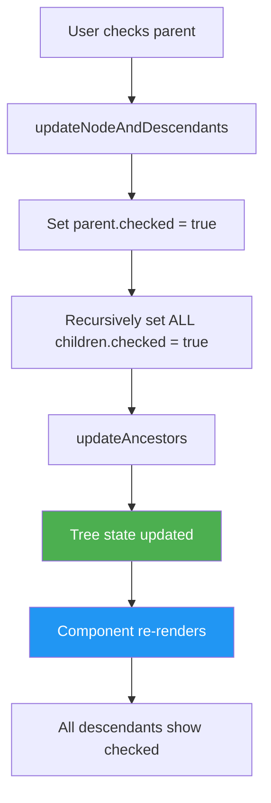
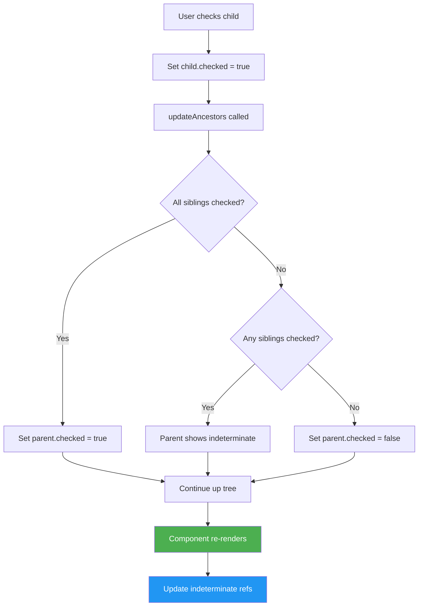

# Nested Checkboxes (Hierarchical Tree) - Hard Level

## Problem Statement

Build a hierarchical checkbox tree where:
- Parent checkboxes control all child checkboxes
- Checking parent selects all descendants
- Unchecking parent deselects all descendants
- **Indeterminate state**: Parent shows indeterminate (partial) when some (not all) children are selected
- Checking/unchecking children updates parent state accordingly
- Support unlimited nesting levels

## Difficulty: Hard ⭐⭐⭐

## Key Concepts Tested
- Complex nested state management
- Recursive component rendering
- Indeterminate checkbox state (useRef)
- Tree data structure traversal
- State synchronization between parent/children

---

## How to Think & Approach

### Step 1: Understand the Requirements (5 minutes)

**Key Questions:**
- Q: "What happens when I check a parent?"
  - A: All children and descendants become checked

- Q: "What if only some children are checked?"
  - A: Parent shows indeterminate state (dash icon)

- Q: "Do we need to track which items are selected?"
  - A: Yes, for forms/submission

**Core Challenge:**
- Bidirectional state flow: parent → children AND children → parent
- Calculate indeterminate state correctly

### Step 2: Design Data Structure (5 minutes)

```jsx
// Tree Node Structure
{
  id: string,           // Unique identifier
  label: string,        // Display text
  checked: boolean,     // Is this node checked?
  children: []          // Array of child nodes (recursive)
}

// Example Tree
const treeData = {
  id: '1',
  label: 'All Items',
  checked: false,
  children: [
    {
      id: '1.1',
      label: 'Fruits',
      checked: false,
      children: [
        { id: '1.1.1', label: 'Apple', checked: false, children: [] },
        { id: '1.1.2', label: 'Banana', checked: false, children: [] }
      ]
    },
    {
      id: '1.2',
      label: 'Vegetables',
      checked: false,
      children: [
        { id: '1.2.1', label: 'Carrot', checked: false, children: [] },
        { id: '1.2.2', label: 'Broccoli', checked: false, children: [] }
      ]
    }
  ]
}
```

**Why this structure?**
- `id`: Unique reference for each node
- `checked`: Current selection state
- `children`: Recursive structure for unlimited nesting
- Self-contained: Each node is independent

### Step 3: Plan State Flow

```
User checks parent
    ↓
1. Update parent.checked = true
2. Recursively update ALL descendants.checked = true
3. Check siblings to update grandparent's indeterminate state
    ↓
Component re-renders with new tree
```

```
User checks child
    ↓
1. Update child.checked = true
2. Check if all siblings are checked
   - If all checked: parent.checked = true
   - If none checked: parent.checked = false
   - If some checked: parent.indeterminate = true
3. Recursively update ancestors
    ↓
Component re-renders
```

---

## Complete Implementation

```jsx
import React, { useState, useRef, useEffect } from 'react'

/**
 * NestedCheckbox Component
 *
 * Why recursive component?
 * - Tree structure is naturally recursive
 * - Same logic applies at every level
 * - Component calls itself for children
 *
 * Complexity:
 * - State updates must propagate both up and down
 * - Indeterminate state requires DOM manipulation (useRef)
 * - Must maintain tree immutability
 */

// SAMPLE DATA
const initialData = {
  id: 'root',
  label: 'All Items',
  checked: false,
  children: [
    {
      id: 'fruits',
      label: 'Fruits',
      checked: false,
      children: [
        { id: 'apple', label: 'Apple', checked: false, children: [] },
        { id: 'banana', label: 'Banana', checked: false, children: [] },
        { id: 'orange', label: 'Orange', checked: false, children: [] }
      ]
    },
    {
      id: 'vegetables',
      label: 'Vegetables',
      checked: false,
      children: [
        { id: 'carrot', label: 'Carrot', checked: false, children: [] },
        { id: 'broccoli', label: 'Broccoli', checked: false, children: [] }
      ]
    },
    {
      id: 'dairy',
      label: 'Dairy',
      checked: false,
      children: [
        {
          id: 'milk',
          label: 'Milk Products',
          checked: false,
          children: [
            { id: 'whole-milk', label: 'Whole Milk', checked: false, children: [] },
            { id: 'skim-milk', label: 'Skim Milk', checked: false, children: [] }
          ]
        },
        { id: 'cheese', label: 'Cheese', checked: false, children: [] }
      ]
    }
  ]
}

function NestedCheckboxApp() {
  const [treeData, setTreeData] = useState(initialData)

  /**
   * Handle checkbox change
   *
   * Why this approach?
   * - Need to update node AND all its children
   * - Need to update all ancestors
   * - Must maintain immutability
   */
  const handleCheckboxChange = (nodeId, checked) => {
    setTreeData(prevTree => {
      // Clone the tree to maintain immutability
      const newTree = JSON.parse(JSON.stringify(prevTree))

      // Find and update the target node + all descendants
      updateNodeAndDescendants(newTree, nodeId, checked)

      // Update all ancestors' states
      updateAncestors(newTree)

      return newTree
    })
  }

  /**
   * Update target node and ALL descendants
   *
   * Why recursive?
   * - Need to update children at all levels
   * - Don't know how deep the tree is
   * - Same operation at every level
   */
  const updateNodeAndDescendants = (node, targetId, checked) => {
    if (node.id === targetId) {
      // Found the target node
      node.checked = checked

      // Update ALL descendants (recursive)
      const updateChildren = (n) => {
        n.checked = checked
        n.children?.forEach(child => updateChildren(child))
      }

      updateChildren(node)
      return true
    }

    // Search in children
    if (node.children) {
      for (let child of node.children) {
        if (updateNodeAndDescendants(child, targetId, checked)) {
          return true
        }
      }
    }

    return false
  }

  /**
   * Update all ancestors based on children states
   *
   * Why needed?
   * - When child changes, parent state might need updating
   * - Parent can be checked, unchecked, or indeterminate
   *
   * Logic:
   * - All children checked → parent checked
   * - No children checked → parent unchecked
   * - Some children checked → parent indeterminate (handled in render)
   */
  const updateAncestors = (node) => {
    if (!node.children || node.children.length === 0) {
      return { allChecked: node.checked, noneChecked: !node.checked }
    }

    // Recursively check all children
    const childStates = node.children.map(child => updateAncestors(child))

    const allChecked = childStates.every(state => state.allChecked)
    const noneChecked = childStates.every(state => state.noneChecked)

    // Update current node based on children
    if (allChecked) {
      node.checked = true
    } else if (noneChecked) {
      node.checked = false
    } else {
      // Some children checked, some not
      // Set checked to false, indeterminate will be handled by ref
      node.checked = false
    }

    return { allChecked, noneChecked }
  }

  /**
   * Get selected items
   *
   * Why?
   * - Often need to submit selected items
   * - Filter checked nodes from tree
   */
  const getSelectedItems = (node, selected = []) => {
    if (node.checked && node.children.length === 0) {
      // Leaf node that's checked
      selected.push(node.label)
    }

    node.children?.forEach(child => getSelectedItems(child, selected))

    return selected
  }

  return (
    <div className="nested-checkbox-app">
      <h2>Hierarchical Checkbox Tree</h2>

      <div className="tree-container">
        <TreeNode
          node={treeData}
          onChange={handleCheckboxChange}
        />
      </div>

      {/* SELECTED ITEMS DISPLAY */}
      <div className="selected-items">
        <h3>Selected Items:</h3>
        <ul>
          {getSelectedItems(treeData).map((item, index) => (
            <li key={index}>{item}</li>
          ))}
        </ul>
      </div>
    </div>
  )
}

/**
 * TreeNode Component (Recursive)
 *
 * Why separate component?
 * - Recursive rendering
 * - Each node needs own checkbox ref for indeterminate
 * - Cleaner separation of concerns
 */
function TreeNode({ node, onChange }) {
  const checkboxRef = useRef(null)

  /**
   * Calculate indeterminate state
   *
   * Why useEffect?
   * - Indeterminate is a DOM property, not React state
   * - Can't set via JSX attribute
   * - Must use ref to access DOM element
   */
  useEffect(() => {
    if (checkboxRef.current) {
      const allChildrenChecked = node.children?.every(child => child.checked)
      const noChildrenChecked = node.children?.every(child => !child.checked)

      // Indeterminate when some (but not all) children are checked
      const isIndeterminate = !allChildrenChecked && !noChildrenChecked

      checkboxRef.current.indeterminate = isIndeterminate
      // Why indeterminate property?
      // - Special checkbox state for "partial selection"
      // - Shows dash icon instead of check
      // - Not available as React prop, must set on DOM
    }
  }, [node])

  const hasChildren = node.children && node.children.length > 0

  return (
    <div className="tree-node">
      <div className="node-content">
        {/* Spacer for nodes without children */}
        <span className="tree-icon">
          {hasChildren && (node.checked || checkboxRef.current?.indeterminate ? '▼' : '▶')}
        </span>

        {/* CHECKBOX */}
        <label className="checkbox-label">
          <input
            ref={checkboxRef}
            type="checkbox"
            checked={node.checked}
            onChange={(e) => onChange(node.id, e.target.checked)}
            className="checkbox-input"
          />
          <span className={hasChildren ? 'parent-label' : 'leaf-label'}>
            {node.label}
          </span>
        </label>
      </div>

      {/* CHILDREN (Recursive) */}
      {hasChildren && (
        <div className="children-container">
          {node.children.map(child => (
            <TreeNode
              key={child.id}
              node={child}
              onChange={onChange}
            />
          ))}
        </div>
      )}
    </div>
  )
}

export default NestedCheckboxApp
```

---

## CSS

```css
.nested-checkbox-app {
  max-width: 800px;
  margin: 40px auto;
  padding: 20px;
}

.tree-container {
  border: 1px solid #ddd;
  padding: 20px;
  background: white;
  border-radius: 8px;
}

.tree-node {
  margin-left: 0;
}

.node-content {
  display: flex;
  align-items: center;
  padding: 6px 0;
  gap: 8px;
}

.tree-icon {
  width: 16px;
  font-size: 12px;
  color: #666;
}

.checkbox-label {
  display: flex;
  align-items: center;
  gap: 8px;
  cursor: pointer;
  user-select: none;
}

.checkbox-input {
  cursor: pointer;
  width: 18px;
  height: 18px;
}

/* Indeterminate state styling */
.checkbox-input:indeterminate {
  background-color: #2196F3;
  border-color: #2196F3;
}

.parent-label {
  font-weight: 600;
  color: #333;
}

.leaf-label {
  color: #666;
}

.children-container {
  margin-left: 24px;
  border-left: 2px solid #e0e0e0;
  padding-left: 12px;
}

.selected-items {
  margin-top: 30px;
  padding: 20px;
  background: #f5f5f5;
  border-radius: 8px;
}

.selected-items h3 {
  margin-top: 0;
}

.selected-items ul {
  list-style: none;
  padding: 0;
}

.selected-items li {
  padding: 4px 0;
  color: #2196F3;
}
```

---

## State Flow Diagrams

### Diagram 1: Checking Parent Node



### Diagram 2: Checking Child Node



### Diagram 3: Tree Structure Visualization

```
☐ All Items (indeterminate)
  ├─ ☑ Fruits
  │   ├─ ☑ Apple
  │   ├─ ☑ Banana
  │   └─ ☑ Orange
  │
  ├─ ☐ Vegetables
  │   ├─ ☐ Carrot
  │   └─ ☐ Broccoli
  │
  └─ ☐ Dairy (indeterminate)
      ├─ ☑ Milk Products
      │   ├─ ☑ Whole Milk
      │   └─ ☑ Skim Milk
      └─ ☐ Cheese
```

---

## Common Beginner Mistakes

### ❌ Mistake 1: Mutating State Directly

```jsx
// WRONG - Mutates tree
const handleChange = (nodeId, checked) => {
  const node = findNode(treeData, nodeId)
  node.checked = checked // ❌ Direct mutation!
  setTreeData(treeData) // React won't detect change
}

// RIGHT - Clone tree
const handleChange = (nodeId, checked) => {
  const newTree = JSON.parse(JSON.stringify(treeData))
  updateNode(newTree, nodeId, checked)
  setTreeData(newTree) // ✅ New reference
}
```

**Why wrong?**
- React uses shallow comparison
- Mutating nested objects doesn't change root reference
- Tree structure is deeply nested

**Alternative cloning methods:**
```jsx
// Deep clone options:
// 1. JSON parse/stringify (simple, but loses functions/dates)
const newTree = JSON.parse(JSON.stringify(tree))

// 2. Lodash cloneDeep (handles all types)
const newTree = _.cloneDeep(tree)

// 3. Immer library (immutable updates)
import produce from 'immer'
const newTree = produce(tree, draft => {
  // Mutate draft, immer handles immutability
})
```

---

### ❌ Mistake 2: Setting Indeterminate as React State

```jsx
// WRONG - indeterminate is not a React prop
<input
  type="checkbox"
  checked={node.checked}
  indeterminate={isIndeterminate} // ❌ Not a valid prop!
/>

// RIGHT - Use ref + useEffect
const checkboxRef = useRef(null)

useEffect(() => {
  checkboxRef.current.indeterminate = isIndeterminate
}, [isIndeterminate])

<input
  ref={checkboxRef}
  type="checkbox"
  checked={node.checked}
/>
```

**Why?**
- `indeterminate` is a DOM property, not HTML attribute
- Can only be set via JavaScript
- React doesn't provide a prop for it

---

### ❌ Mistake 3: Not Updating Ancestors

```jsx
// WRONG - Only updates checked node
const handleChange = (nodeId, checked) => {
  updateNode(tree, nodeId, checked)
  // Parent still shows wrong state!
}

// RIGHT - Update ancestors too
const handleChange = (nodeId, checked) => {
  updateNode(tree, nodeId, checked)
  updateDescendants(tree, nodeId, checked)
  updateAncestors(tree) // ✅ Sync parent states
}
```

---

### ❌ Mistake 4: Using Index as Key

```jsx
// WRONG - Index as key
{node.children.map((child, index) => (
  <TreeNode key={index} node={child} />
  // ❌ Breaks if children reorder
))}

// RIGHT - Use unique ID
{node.children.map(child => (
  <TreeNode key={child.id} node={child} />
  // ✅ Stable identifier
))}
```

---

## Interviewer Questions & Answers

### Q1: "Why use JSON.parse(JSON.stringify) for cloning? What are the limitations?"

**Answer:**
"I use JSON.parse(JSON.stringify) for deep cloning because:

**Advantages:**
- Simple, no external libraries
- Deep clones nested objects
- Works for our tree structure

**Limitations:**
- Loses functions, Date objects, undefined values
- Can't handle circular references
- Not performant for huge trees

**Better alternatives for production:**

```jsx
// Option 1: Immer (recommended)
import produce from 'immer'

const newTree = produce(treeData, draft => {
  const node = findNode(draft, nodeId)
  node.checked = checked
})
// Immer handles immutability, we write mutable code

// Option 2: Structural sharing with recursion
const updateTreeImmutably = (node, targetId, checked) => {
  if (node.id === targetId) {
    return { ...node, checked, children: node.children.map(...) }
  }

  return {
    ...node,
    children: node.children.map(child =>
      updateTreeImmutably(child, targetId, checked)
    )
  }
}
```

For this interview, JSON approach is acceptable and shows understanding of immutability."

---

### Q2: "How would you optimize this for a tree with 10,000 nodes?"

**Answer:**
"Several optimizations:

**1. Virtualization:**
```jsx
import { FixedSizeTree } from 'react-window'
// Only render visible nodes
```

**2. Lazy loading:**
```jsx
const [expanded, setExpanded] = useState(new Set())

// Only render children if expanded
{expanded.has(node.id) && node.children.map(...)}
```

**3. Memoization:**
```jsx
// Memoize TreeNode component
const TreeNode = React.memo(({ node, onChange }) => {
  // Only re-renders if node or onChange changes
})

// Memoize onChange handlers
const handleChange = useCallback((nodeId, checked) => {
  // ...
}, [])
```

**4. Optimize state updates:**
```jsx
// Instead of cloning entire tree, use Map for O(1) lookups
const [checkedNodes, setCheckedNodes] = useState(new Map())

// Update only affected nodes
setCheckedNodes(prev => {
  const next = new Map(prev)
  next.set(nodeId, checked)
  return next
})
```

**5. Debounce updates if user clicking rapidly**

I'd profile first to find the bottleneck before optimizing."

---

### Q3: "How do you prevent infinite loops when updating ancestors?"

**Answer:**
"Good question! The key is:

**1. Unidirectional update flow:**
```jsx
updateNodeAndDescendants(tree, nodeId, checked)
// ↓ Goes DOWN the tree

updateAncestors(tree)
// ↑ Goes UP the tree

// Never create circular updates
```

**2. updateAncestors doesn't trigger state changes:**
```jsx
const updateAncestors = (node) => {
  // Calculates state, doesn't call setState
  // Returns result, doesn't trigger re-render
  const childStates = node.children.map(updateAncestors)
  return { allChecked, noneChecked }
}
```

**3. Single setState call:**
```jsx
const handleChange = (nodeId, checked) => {
  setTreeData(prevTree => {
    const newTree = clone(prevTree)
    updateNodeAndDescendants(newTree, nodeId, checked)
    updateAncestors(newTree)
    return newTree // One state update
  })
}
```

The entire update happens in one functional update, preventing race conditions."

---

### Q4: "How would you persist the tree state to localStorage?"

**Answer:**
"I'd add useEffect to sync with localStorage:

```jsx
// Load on mount
const [treeData, setTreeData] = useState(() => {
  const saved = localStorage.getItem('treeState')
  return saved ? JSON.parse(saved) : initialData
})

// Save on change
useEffect(() => {
  localStorage.setItem('treeState', JSON.stringify(treeData))
}, [treeData])
```

**For large trees, optimize:**
```jsx
// Only store checked node IDs, not entire tree
const getCheckedIds = (node, checked = []) => {
  if (node.checked) checked.push(node.id)
  node.children.forEach(child => getCheckedIds(child, checked))
  return checked
}

// Save only IDs
localStorage.setItem('checkedIds', JSON.stringify(getCheckedIds(treeData)))

// Restore on load
const checkedIds = JSON.parse(localStorage.getItem('checkedIds') || '[]')
const restored = restoreCheckedState(initialData, checkedIds)
```

This saves space and is faster for large trees."

---

### Q5: "How would you make this accessible?"

**Answer:**
"Several ARIA attributes needed:

```jsx
<div role="tree">
  <TreeNode
    role="treeitem"
    aria-expanded={hasChildren && isExpanded}
    aria-selected={node.checked}
    aria-level={depth}
  >
    <input
      type="checkbox"
      aria-label={node.label}
      aria-describedby={`${node.id}-desc`}
    />
  </TreeNode>
</div>

// Keyboard navigation
const handleKeyDown = (e) => {
  switch(e.key) {
    case 'ArrowRight': expandNode(); break
    case 'ArrowLeft': collapseNode(); break
    case 'ArrowDown': focusNextNode(); break
    case 'ArrowUp': focusPreviousNode(); break
    case ' ': toggleCheckbox(); break
  }
}
```

Also ensure:
- Focus management with tabIndex
- Screen reader announcements
- High contrast mode support
- Keyboard-only operation"

---

## Time & Space Complexity

| Operation | Time Complexity | Notes |
|-----------|----------------|-------|
| Check/Uncheck Node | O(n) | Updates all descendants |
| Update Ancestors | O(h) | h = tree height |
| Render Tree | O(n) | Renders all visible nodes |
| Clone Tree | O(n) | Deep clone all nodes |

**Optimization opportunity:**
- Use Map<id, node> for O(1) lookups
- Track only checked IDs, not full tree state

---

## Key Takeaways

✅ Recursive components for recursive data
✅ Indeterminate requires useRef + useEffect
✅ Deep clone for nested state updates
✅ Bidirectional updates: parent ↔ children
✅ Single source of truth in tree structure

---

## Related Questions

- File System Explorer (Hard)
- Organization Chart (Hard)
- Dropdown Menu with Nested Items (Medium)
