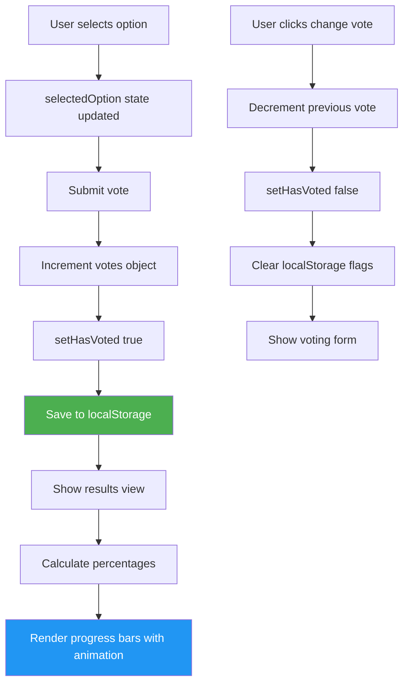

# Poll / Quiz Widget - Hard Level

## Problem Statement

Build a poll/quiz component that:
- Displays question with multiple options
- Users can vote on options
- Shows live results with percentages and visual bars
- Prevents multiple votes (localStorage or state)
- Displays total vote count
- Option to reset poll
- Animated progress bars

## Difficulty: Hard ⭐⭐⭐

## Key Concepts Tested
- Form handling with radio buttons
- Percentage calculations
- localStorage for persistence
- CSS animations for progress bars
- State management for votes
- Conditional rendering based on vote status

---

## How to Think & Approach

### Step 1: Understand Requirements (3 minutes)

**Features:**
- ✅ Display question with options
- ✅ User selects ONE option (radio)
- ✅ After voting, show results
- ✅ Calculate percentages
- ✅ Visual progress bars
- ✅ Prevent revoting
- ✅ Persist votes (localStorage)

**State needed:**
- `votes`: Object with vote counts per option
- `hasVoted`: boolean - has user voted?
- `selectedOption`: which option did user select?

### Step 2: Data Structure

```jsx
// Poll configuration
const pollData = {
  id: 'poll-1',
  question: 'What is your favorite programming language?',
  options: [
    { id: 'js', label: 'JavaScript', votes: 0 },
    { id: 'py', label: 'Python', votes: 0 },
    { id: 'java', label: 'Java', votes: 0 },
    { id: 'cpp', label: 'C++', votes: 0 }
  ]
}

// After some votes
{
  js: 45,    // 45 votes for JavaScript
  py: 32,    // 32 votes for Python
  java: 15,
  cpp: 8
}

// Total: 100 votes
// JS: 45% (45/100)
```

---

## Complete Implementation

```jsx
import React, { useState, useEffect, useMemo } from 'react'

/**
 * PollWidget Component
 *
 * Why complex?
 * - Vote persistence (localStorage)
 * - Percentage calculations
 * - Animated progress bars
 * - Prevent multiple votes
 */

const POLL_CONFIG = {
  id: 'react-poll-1',
  question: 'What is your favorite React feature?',
  options: [
    { id: 'hooks', label: 'Hooks', color: '#61dafb' },
    { id: 'jsx', label: 'JSX Syntax', color: '#ff6b6b' },
    { id: 'virtual-dom', label: 'Virtual DOM', color: '#4ecdc4' },
    { id: 'component', label: 'Component Architecture', color: '#f39c12' }
  ]
}

function PollWidget() {
  // STATE

  /**
   * Vote counts
   * Why object with option IDs as keys?
   * - Easy lookup: votes[optionId]
   * - Simple to update: votes[optionId]++
   */
  const [votes, setVotes] = useState(() => {
    // Load from localStorage on mount
    const saved = localStorage.getItem(`poll-votes-${POLL_CONFIG.id}`)
    if (saved) {
      return JSON.parse(saved)
    }

    // Initialize with 0 votes
    const initial = {}
    POLL_CONFIG.options.forEach(option => {
      initial[option.id] = 0
    })
    return initial
  })

  /**
   * Has user voted?
   * Why track separately?
   * - Controls UI (show vote form vs results)
   * - Prevents multiple votes
   */
  const [hasVoted, setHasVoted] = useState(() => {
    return localStorage.getItem(`poll-voted-${POLL_CONFIG.id}`) === 'true'
  })

  /**
   * Currently selected option (before voting)
   */
  const [selectedOption, setSelectedOption] = useState(null)

  /**
   * User's vote (after voting, for highlighting)
   */
  const [userVote, setUserVote] = useState(() => {
    return localStorage.getItem(`poll-choice-${POLL_CONFIG.id}`)
  })

  // PERSIST VOTES TO LOCALSTORAGE

  /**
   * Why useEffect?
   * - Side effect (localStorage)
   * - Runs after state updates
   * - Keeps localStorage in sync with state
   */
  useEffect(() => {
    localStorage.setItem(`poll-votes-${POLL_CONFIG.id}`, JSON.stringify(votes))
  }, [votes])

  // DERIVED VALUES

  /**
   * Total vote count
   * Why useMemo?
   * - Computed from votes
   * - Used in percentage calculation
   * - Only recalculate when votes change
   */
  const totalVotes = useMemo(() => {
    return Object.values(votes).reduce((sum, count) => sum + count, 0)
  }, [votes])

  /**
   * Calculate percentage for an option
   * Why function?
   * - Reusable calculation
   * - Handles divide-by-zero
   */
  const getPercentage = (optionId) => {
    if (totalVotes === 0) return 0
    return Math.round((votes[optionId] / totalVotes) * 100)
  }

  /**
   * Get vote count for display
   */
  const getVoteCount = (optionId) => {
    return votes[optionId] || 0
  }

  // EVENT HANDLERS

  /**
   * Handle vote submission
   */
  const handleVote = (e) => {
    e.preventDefault()

    if (!selectedOption) {
      alert('Please select an option')
      return
    }

    // Increment vote count
    setVotes(prev => ({
      ...prev,
      [selectedOption]: prev[selectedOption] + 1
    }))

    // Mark as voted
    setHasVoted(true)
    setUserVote(selectedOption)

    // Persist to localStorage
    localStorage.setItem(`poll-voted-${POLL_CONFIG.id}`, 'true')
    localStorage.setItem(`poll-choice-${POLL_CONFIG.id}`, selectedOption)
  }

  /**
   * Reset poll (admin function)
   * Why useful?
   * - Testing
   * - Clear old data
   * - Start fresh poll
   */
  const handleReset = () => {
    if (!window.confirm('Reset poll? This will clear all votes.')) return

    // Reset state
    const resetVotes = {}
    POLL_CONFIG.options.forEach(option => {
      resetVotes[option.id] = 0
    })

    setVotes(resetVotes)
    setHasVoted(false)
    setSelectedOption(null)
    setUserVote(null)

    // Clear localStorage
    localStorage.removeItem(`poll-voted-${POLL_CONFIG.id}`)
    localStorage.removeItem(`poll-choice-${POLL_CONFIG.id}`)
  }

  /**
   * Allow user to vote again (change vote)
   * Why separate from reset?
   * - Reset = clear all votes (admin)
   * - Revote = change own vote (user)
   */
  const handleRevote = () => {
    // Decrement previous vote
    setVotes(prev => ({
      ...prev,
      [userVote]: Math.max(0, prev[userVote] - 1)
    }))

    setHasVoted(false)
    setSelectedOption(null)

    localStorage.removeItem(`poll-voted-${POLL_CONFIG.id}`)
  }

  // RENDER

  return (
    <div className="poll-widget">
      {/* QUESTION */}
      <h2 className="poll-question">{POLL_CONFIG.question}</h2>

      {/* TOTAL VOTES */}
      <div className="poll-info">
        Total votes: <strong>{totalVotes}</strong>
      </div>

      {/* VOTING FORM OR RESULTS */}
      {!hasVoted ? (
        // VOTE FORM
        <form onSubmit={handleVote} className="poll-form">
          {POLL_CONFIG.options.map(option => (
            <label
              key={option.id}
              className={`poll-option ${selectedOption === option.id ? 'selected' : ''}`}
            >
              <input
                type="radio"
                name="poll-option"
                value={option.id}
                checked={selectedOption === option.id}
                onChange={(e) => setSelectedOption(e.target.value)}
                className="poll-radio"
              />
              <span className="option-label">{option.label}</span>
            </label>
          ))}

          <button
            type="submit"
            disabled={!selectedOption}
            className="vote-button"
          >
            Vote
          </button>
        </form>
      ) : (
        // RESULTS
        <div className="poll-results">
          {POLL_CONFIG.options.map(option => {
            const percentage = getPercentage(option.id)
            const voteCount = getVoteCount(option.id)
            const isUserChoice = userVote === option.id

            return (
              <div
                key={option.id}
                className={`result-item ${isUserChoice ? 'user-choice' : ''}`}
              >
                <div className="result-header">
                  <span className="result-label">
                    {option.label}
                    {isUserChoice && <span className="badge">Your vote</span>}
                  </span>
                  <span className="result-stats">
                    {voteCount} votes ({percentage}%)
                  </span>
                </div>

                {/* PROGRESS BAR */}
                <div className="progress-bar-container">
                  <div
                    className="progress-bar"
                    style={{
                      width: `${percentage}%`,
                      backgroundColor: option.color,
                      // Why inline style?
                      // - Dynamic width based on votes
                      // - Each option has different percentage
                      // - Can't use static CSS
                    }}
                  />
                </div>
              </div>
            )
          })}

          {/* ACTIONS */}
          <div className="poll-actions">
            <button onClick={handleRevote} className="revote-button">
              Change Vote
            </button>
            <button onClick={handleReset} className="reset-button">
              Reset Poll
            </button>
          </div>
        </div>
      )}
    </div>
  )
}

export default PollWidget
```

---

## CSS

```css
.poll-widget {
  max-width: 600px;
  margin: 40px auto;
  padding: 30px;
  background: white;
  border-radius: 12px;
  box-shadow: 0 4px 6px rgba(0, 0, 0, 0.1);
}

.poll-question {
  margin-top: 0;
  font-size: 24px;
  color: #2c3e50;
}

.poll-info {
  margin-bottom: 20px;
  color: #7f8c8d;
  font-size: 14px;
}

/* VOTING FORM */

.poll-form {
  display: flex;
  flex-direction: column;
  gap: 12px;
}

.poll-option {
  display: flex;
  align-items: center;
  gap: 12px;
  padding: 16px;
  border: 2px solid #ecf0f1;
  border-radius: 8px;
  cursor: pointer;
  transition: all 0.2s;
}

.poll-option:hover {
  background: #f8f9fa;
  border-color: #3498db;
}

.poll-option.selected {
  background: #e3f2fd;
  border-color: #2196F3;
}

.poll-radio {
  cursor: pointer;
  width: 20px;
  height: 20px;
}

.option-label {
  flex: 1;
  font-size: 16px;
  color: #2c3e50;
}

.vote-button {
  margin-top: 10px;
  padding: 14px 28px;
  background: #3498db;
  color: white;
  border: none;
  border-radius: 8px;
  font-size: 16px;
  font-weight: bold;
  cursor: pointer;
  transition: background 0.2s;
}

.vote-button:hover:not(:disabled) {
  background: #2980b9;
}

.vote-button:disabled {
  background: #bdc3c7;
  cursor: not-allowed;
}

/* RESULTS */

.poll-results {
  display: flex;
  flex-direction: column;
  gap: 20px;
}

.result-item {
  padding: 16px;
  background: #f8f9fa;
  border-radius: 8px;
  transition: transform 0.2s;
}

.result-item.user-choice {
  background: #e8f5e9;
  border: 2px solid #4CAF50;
}

.result-header {
  display: flex;
  justify-content: space-between;
  align-items: center;
  margin-bottom: 12px;
}

.result-label {
  font-weight: 600;
  font-size: 16px;
  color: #2c3e50;
  display: flex;
  align-items: center;
  gap: 8px;
}

.badge {
  background: #4CAF50;
  color: white;
  padding: 2px 8px;
  border-radius: 12px;
  font-size: 12px;
  font-weight: normal;
}

.result-stats {
  font-size: 14px;
  color: #7f8c8d;
}

/* PROGRESS BAR */

.progress-bar-container {
  width: 100%;
  height: 24px;
  background: #ecf0f1;
  border-radius: 12px;
  overflow: hidden;
}

.progress-bar {
  height: 100%;
  border-radius: 12px;
  transition: width 0.6s ease-out;
  /* Why transition?
     - Smooth animation when percentages change
     - Better UX than instant width change
     - 0.6s gives nice visual effect */
  animation: slideIn 0.6s ease-out;
}

@keyframes slideIn {
  from {
    width: 0;
  }
}

/* ACTIONS */

.poll-actions {
  display: flex;
  gap: 12px;
  margin-top: 20px;
  padding-top: 20px;
  border-top: 1px solid #ecf0f1;
}

.revote-button,
.reset-button {
  padding: 10px 20px;
  border: none;
  border-radius: 6px;
  font-size: 14px;
  cursor: pointer;
  transition: all 0.2s;
}

.revote-button {
  background: #3498db;
  color: white;
}

.revote-button:hover {
  background: #2980b9;
}

.reset-button {
  background: #e74c3c;
  color: white;
}

.reset-button:hover {
  background: #c0392b;
}
```

---

## State Flow Diagram



---

## Common Beginner Mistakes

### ❌ Mistake 1: Not Preventing Multiple Votes

```jsx
// WRONG - User can vote unlimited times
const handleVote = () => {
  setVotes(prev => ({ ...prev, [selectedOption]: prev[selectedOption] + 1 }))
  // No hasVoted check!
}

// RIGHT - Track voting status
const [hasVoted, setHasVoted] = useState(false)

const handleVote = () => {
  if (hasVoted) return // Prevent multiple votes

  setVotes(prev => ({ ...prev, [selectedOption]: prev[selectedOption] + 1 }))
  setHasVoted(true)
  localStorage.setItem('poll-voted', 'true')
}
```

---

### ❌ Mistake 2: Incorrect Percentage Calculation

```jsx
// WRONG - Division by zero
const percentage = (votes[optionId] / totalVotes) * 100
// If totalVotes = 0: NaN or Infinity!

// RIGHT - Handle zero case
const getPercentage = (optionId) => {
  if (totalVotes === 0) return 0
  return Math.round((votes[optionId] / totalVotes) * 100)
}
```

---

### ❌ Mistake 3: Not Persisting Votes

```jsx
// WRONG - Votes lost on refresh
const [votes, setVotes] = useState(initialVotes)
// Page refresh = all votes gone!

// RIGHT - Use localStorage
const [votes, setVotes] = useState(() => {
  const saved = localStorage.getItem('poll-votes')
  return saved ? JSON.parse(saved) : initialVotes
})

useEffect(() => {
  localStorage.setItem('poll-votes', JSON.stringify(votes))
}, [votes])
```

---

### ❌ Mistake 4: Mutating State Object

```jsx
// WRONG - Direct mutation
const handleVote = () => {
  votes[selectedOption]++ // ❌ Mutates state!
  setVotes(votes)
}

// RIGHT - Create new object
const handleVote = () => {
  setVotes(prev => ({
    ...prev,
    [selectedOption]: prev[selectedOption] + 1
  }))
}
```

---

## Interviewer Questions & Answers

### Q1: "How do you prevent users from voting multiple times?"

**Answer:**
"I use a combination of state and localStorage:

**1. State flag:**
```jsx
const [hasVoted, setHasVoted] = useState(false)

// After voting
setHasVoted(true)

// In render
{!hasVoted ? <VoteForm /> : <Results />}
```

**2. localStorage persistence:**
```jsx
localStorage.setItem('poll-voted', 'true')

// On mount
const [hasVoted, setHasVoted] = useState(() =>
  localStorage.getItem('poll-voted') === 'true'
)
```

**3. Validate on submit:**
```jsx
const handleVote = () => {
  if (hasVoted) {
    alert('You already voted!')
    return
  }
  // ... proceed with vote
}
```

**Limitations:**
- localStorage can be cleared
- Different browsers = can vote again
- Not secure against determined users

**For production:**
- Backend validation with user ID/IP
- Cookie-based tracking
- Authentication required"

---

### Q2: "How would you make this work with a backend API?"

**Answer:**
"Replace localStorage with API calls:

```jsx
// Fetch votes on mount
useEffect(() => {
  fetch('/api/poll/react-poll-1')
    .then(res => res.json())
    .then(data => {
      setVotes(data.votes)
      setHasVoted(data.userHasVoted)
      setUserVote(data.userChoice)
    })
}, [])

// Submit vote
const handleVote = async () => {
  try {
    const response = await fetch('/api/poll/react-poll-1/vote', {
      method: 'POST',
      headers: { 'Content-Type': 'application/json' },
      body: JSON.stringify({
        optionId: selectedOption,
        userId: currentUserId // From auth
      })
    })

    const data = await response.json()

    if (data.success) {
      setVotes(data.updatedVotes)
      setHasVoted(true)
      setUserVote(selectedOption)
    } else {
      alert(data.error) // 'Already voted', etc.
    }
  } catch (error) {
    console.error('Vote failed:', error)
  }
}
```

**Backend (Node.js example):**
```js
app.post('/api/poll/:pollId/vote', async (req, res) => {
  const { pollId } = req.params
  const { optionId, userId } = req.body

  // Check if user already voted
  const existingVote = await Vote.findOne({ pollId, userId })
  if (existingVote) {
    return res.json({ success: false, error: 'Already voted' })
  }

  // Save vote
  await Vote.create({ pollId, userId, optionId })

  // Get updated counts
  const votes = await Vote.aggregate([
    { $match: { pollId } },
    { $group: { _id: '$optionId', count: { $sum: 1 } } }
  ])

  res.json({ success: true, updatedVotes: votes })
})
```"

---

### Q3: "How would you add real-time updates?"

**Answer:**
"Use WebSockets to push updates to all connected clients:

**Client side:**
```jsx
import { useEffect } from 'react'

function PollWidget() {
  const [votes, setVotes] = useState(initialVotes)

  useEffect(() => {
    // Connect to WebSocket
    const ws = new WebSocket('ws://localhost:8080/poll/react-poll-1')

    // Listen for vote updates
    ws.onmessage = (event) => {
      const data = JSON.parse(event.data)
      if (data.type === 'vote-update') {
        setVotes(data.votes)
      }
    }

    // Cleanup
    return () => ws.close()
  }, [])

  const handleVote = () => {
    // Send vote via WebSocket
    ws.send(JSON.stringify({
      type: 'vote',
      optionId: selectedOption,
      userId: currentUserId
    }))

    setHasVoted(true)
  }

  // ... rest of component
}
```

**Server side (Node.js + ws):**
```js
const WebSocket = require('ws')
const wss = new WebSocket.Server({ port: 8080 })

const polls = {} // Store active polls

wss.on('connection', (ws, req) => {
  const pollId = req.url.split('/').pop()

  ws.on('message', (message) => {
    const data = JSON.parse(message)

    if (data.type === 'vote') {
      // Update vote count
      polls[pollId] = polls[pollId] || {}
      polls[pollId][data.optionId] = (polls[pollId][data.optionId] || 0) + 1

      // Broadcast to all clients
      wss.clients.forEach(client => {
        if (client.readyState === WebSocket.OPEN) {
          client.send(JSON.stringify({
            type: 'vote-update',
            votes: polls[pollId]
          }))
        }
      })
    }
  })
})
```

This pushes vote updates to all users in real-time!"

---

### Q4: "How would you handle errors?"

**Answer:**
"Add comprehensive error handling:

```jsx
const [error, setError] = useState(null)
const [isLoading, setIsLoading] = useState(false)

const handleVote = async () => {
  setIsLoading(true)
  setError(null)

  try {
    const response = await fetch('/api/vote', {
      method: 'POST',
      body: JSON.stringify({ optionId: selectedOption })
    })

    if (!response.ok) {
      throw new Error(`HTTP error ${response.status}`)
    }

    const data = await response.json()

    if (!data.success) {
      throw new Error(data.message || 'Vote failed')
    }

    setVotes(data.votes)
    setHasVoted(true)

  } catch (err) {
    setError(err.message)
    console.error('Vote error:', err)
  } finally {
    setIsLoading(false)
  }
}

// In render
{error && (
  <div className="error-message">
    {error}
    <button onClick={() => setError(null)}>Dismiss</button>
  </div>
)}

<button
  onClick={handleVote}
  disabled={isLoading || !selectedOption}
>
  {isLoading ? 'Voting...' : 'Vote'}
</button>
```

**Error types to handle:**
- Network errors
- Server errors (500)
- Validation errors (already voted)
- Timeout errors
- Parse errors (invalid JSON)"

---

## Key Takeaways

✅ Use localStorage for client-side persistence
✅ Prevent multiple votes with flags
✅ Calculate percentages with zero-check
✅ Animate progress bars for better UX
✅ Immutable state updates with spread operator

---

## Related Questions

- Survey Form (Medium) - Multiple questions
- Rating Widget (Medium) - Star ratings
- Live Voting Dashboard (Hard) - Real-time updates
