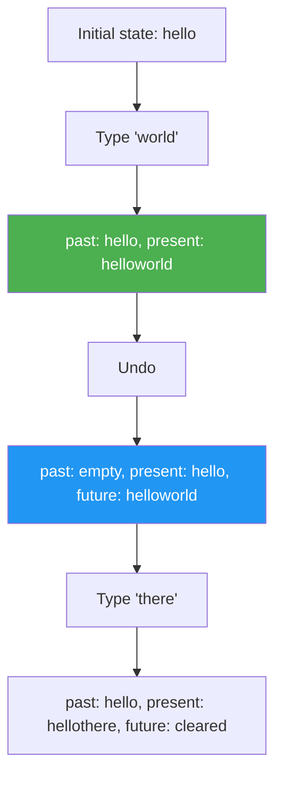

# Undo/Redo Functionality - Hard Level

## Problem Statement

Implement undo/redo functionality for a simple drawing/text editor:
- Track history of changes
- Undo: revert to previous state
- Redo: move forward through history
- Keyboard shortcuts (Cmd/Ctrl+Z, Cmd/Ctrl+Shift+Z)
- Show current position in history
- Limit history size (optional)

## Difficulty: Hard ⭐⭐⭐

## Key Concepts
- History state management
- Time-travel debugging
- useReducer for complex state
- Keyboard event handling
- Immutable state updates

---

## How to Approach

**State needed:**
- `past`: array of previous states
- `present`: current state
- `future`: array of undone states

**Pattern:**
```
[past states] → [present] → [future states]
        undo ←            → redo
```

---

## Complete Implementation

```jsx
import React, { useState, useEffect, useCallback } from 'react'

/**
 * Custom Hook: useUndoRedo
 *
 * Why custom hook?
 * - Reusable undo/redo logic
 * - Can be used with any state type
 * - Encapsulates history management
 */
function useUndoRedo(initialState) {
  const [past, setPast] = useState([])
  const [present, setPresent] = useState(initialState)
  const [future, setFuture] = useState([])

  /**
   * Set new state (with history)
   * Why useCallback?
   * - Returned from hook
   * - Prevents recreating on every render
   * - Dependencies: present, past
   */
  const setState = useCallback((newState) => {
    // Why function or value?
    // - Accept both setState(newValue) and setState(prev => newValue)
    const resolvedState = typeof newState === 'function'
      ? newState(present)
      : newState

    // Don't add if state didn't change
    if (resolvedState === present) return

    // Add current state to past
    setPast(prev => [...prev, present])

    // Set new present
    setPresent(resolvedState)

    // Clear future (new timeline)
    // Why clear future?
    // - Making change after undo creates new timeline
    // - Can't redo after making new changes
    setFuture([])
  }, [present])

  /**
   * Undo
   */
  const undo = useCallback(() => {
    if (past.length === 0) return // Nothing to undo

    // Move present to future
    setFuture(prev => [present, ...prev])

    // Move last past to present
    const newPresent = past[past.length - 1]
    setPresent(newPresent)

    // Remove last from past
    setPast(prev => prev.slice(0, -1))
  }, [past, present])

  /**
   * Redo
   */
  const redo = useCallback(() => {
    if (future.length === 0) return // Nothing to redo

    // Move present to past
    setPast(prev => [...prev, present])

    // Move first future to present
    const newPresent = future[0]
    setPresent(newPresent)

    // Remove first from future
    setFuture(prev => prev.slice(1))
  }, [future, present])

  /**
   * Reset history
   */
  const reset = useCallback((newState) => {
    setPast([])
    setPresent(newState)
    setFuture([])
  }, [])

  return {
    state: present,
    setState,
    undo,
    redo,
    canUndo: past.length > 0,
    canRedo: future.length > 0,
    reset,
    historySize: past.length + 1 + future.length
  }
}

/**
 * TextEditor Component
 * Demo of undo/redo
 */
function TextEditor() {
  const {
    state: text,
    setState: setText,
    undo,
    redo,
    canUndo,
    canRedo,
    reset
  } = useUndoRedo('')

  /**
   * Keyboard shortcuts
   * Why useEffect?
   * - Add event listener on mount
   * - Remove on unmount
   * - Respond to keyboard events
   */
  useEffect(() => {
    const handleKeyDown = (e) => {
      // Cmd+Z or Ctrl+Z = Undo
      if ((e.metaKey || e.ctrlKey) && e.key === 'z' && !e.shiftKey) {
        e.preventDefault()
        undo()
      }

      // Cmd+Shift+Z or Ctrl+Shift+Z = Redo
      if ((e.metaKey || e.ctrlKey) && e.shiftKey && e.key === 'z') {
        e.preventDefault()
        redo()
      }
    }

    window.addEventListener('keydown', handleKeyDown)
    return () => window.removeEventListener('keydown', handleKeyDown)
  }, [undo, redo])

  return (
    <div className="text-editor">
      <h2>Undo/Redo Text Editor</h2>

      {/* TOOLBAR */}
      <div className="toolbar">
        <button onClick={undo} disabled={!canUndo}>
          ↶ Undo (⌘Z)
        </button>
        <button onClick={redo} disabled={!canRedo}>
          ↷ Redo (⌘⇧Z)
        </button>
        <button onClick={() => reset('')}>
          Clear
        </button>
      </div>

      {/* EDITOR */}
      <textarea
        value={text}
        onChange={(e) => setText(e.target.value)}
        placeholder="Type something... (Cmd/Ctrl+Z to undo)"
        rows={10}
        className="editor-textarea"
      />

      {/* INFO */}
      <div className="editor-info">
        Characters: {text.length}
      </div>
    </div>
  )
}

/**
 * Canvas Drawing Example
 * More complex undo/redo with drawing
 */
function DrawingApp() {
  const {
    state: lines,
    setState: setLines,
    undo,
    redo,
    canUndo,
    canRedo
  } = useUndoRedo([])

  const [isDrawing, setIsDrawing] = useState(false)
  const [currentLine, setCurrentLine] = useState([])

  const handleMouseDown = (e) => {
    const rect = e.target.getBoundingClientRect()
    const point = {
      x: e.clientX - rect.left,
      y: e.clientY - rect.top
    }
    setIsDrawing(true)
    setCurrentLine([point])
  }

  const handleMouseMove = (e) => {
    if (!isDrawing) return

    const rect = e.target.getBoundingClientRect()
    const point = {
      x: e.clientX - rect.left,
      y: e.clientY - rect.top
    }

    // Update current line (not in history yet)
    setCurrentLine(prev => [...prev, point])
  }

  const handleMouseUp = () => {
    if (!isDrawing) return

    // Add completed line to history
    setLines(prev => [...prev, currentLine])

    setIsDrawing(false)
    setCurrentLine([])
  }

  return (
    <div className="drawing-app">
      <h2>Drawing with Undo/Redo</h2>

      <div className="toolbar">
        <button onClick={undo} disabled={!canUndo}>Undo</button>
        <button onClick={redo} disabled={!canRedo}>Redo</button>
        <button onClick={() => setLines([])}>Clear</button>
      </div>

      <svg
        width={600}
        height={400}
        onMouseDown={handleMouseDown}
        onMouseMove={handleMouseMove}
        onMouseUp={handleMouseUp}
        onMouseLeave={handleMouseUp}
        className="canvas"
      >
        {/* Completed lines from history */}
        {lines.map((line, i) => (
          <polyline
            key={i}
            points={line.map(p => `${p.x},${p.y}`).join(' ')}
            fill="none"
            stroke="black"
            strokeWidth={2}
          />
        ))}

        {/* Current line being drawn */}
        {currentLine.length > 0 && (
          <polyline
            points={currentLine.map(p => `${p.x},${p.y}`).join(' ')}
            fill="none"
            stroke="blue"
            strokeWidth={2}
          />
        )}
      </svg>
    </div>
  )
}

export default TextEditor
```

---

## State Flow Diagram



---

## Key Takeaways

✅ Custom hook for reusable undo/redo
✅ Three arrays: past, present, future
✅ Clear future on new changes
✅ Keyboard shortcuts with useEffect
✅ Works with any state type

---

## Related: Time Travel, History Management
