# Step 1: Basic Architecture Foundation

## Overview
This is the **simplest possible architecture** that can support our Amazon Shop system. We start here because:
- ✅ **Easy to understand**: Only 4 main components
- ✅ **Quick to implement**: Can build an MVP in weeks
- ✅ **Validated architecture**: Used by millions of websites
- ✅ **Foundation for scaling**: We'll add complexity incrementally

**Think of this as:** Building a house - you start with a foundation and basic structure, then add rooms, features, and upgrades later.

---

## What We're Building (Step 1)

```
User → Load Balancer → Application Servers → Database
```

This architecture can handle:
- ✅ **100,000 users** (with proper sizing)
- ✅ **1,000 requests/second** (moderate traffic)
- ✅ **Basic e-commerce** operations (browse, search, order)

**We'll upgrade this in later steps** to handle 10 million users and 7,000 req/sec!

---

## Architecture Diagram

```mermaid
graph TB
    subgraph "User Layer"
        Client1[👤 User Browser]
        Client2[📱 Mobile App]
        Client3[💻 Desktop App]
    end

    subgraph "Load Balancing Layer"
        LB[🔄 Load Balancer<br/>Nginx<br/><br/>📊 Distributes traffic<br/>🔒 SSL Termination<br/>⚡ Health Checks]
    end

    subgraph "Application Layer"
        App1[🖥️ App Server 1<br/>Node.js / Java<br/><br/>📦 Product Service<br/>🛒 Cart Service<br/>📝 Order Service]
        App2[🖥️ App Server 2<br/>Node.js / Java<br/><br/>📦 Product Service<br/>🛒 Cart Service<br/>📝 Order Service]
        App3[🖥️ App Server 3<br/>Node.js / Java<br/><br/>📦 Product Service<br/>🛒 Cart Service<br/>📝 Order Service]
    end

    subgraph "Database Layer"
        DB[(🗄️ PostgreSQL Database<br/><br/>👥 Users Table<br/>📦 Products Table<br/>🛒 Carts Table<br/>📝 Orders Table<br/>💳 Payments Table)]
    end

    Client1 --> LB
    Client2 --> LB
    Client3 --> LB

    LB -->|Round Robin| App1
    LB -->|Round Robin| App2
    LB -->|Round Robin| App3

    App1 -->|SQL Queries| DB
    App2 -->|SQL Queries| DB
    App3 -->|SQL Queries| DB

    style Client1 fill:#e3f2fd
    style Client2 fill:#e3f2fd
    style Client3 fill:#e3f2fd
    style LB fill:#fff3e0
    style App1 fill:#e8f5e9
    style App2 fill:#e8f5e9
    style App3 fill:#e8f5e9
    style DB fill:#fce4ec
```



---

## Component Breakdown (Detailed Explanation)

### 1. User Layer (Clients)

**What it is:**
- The interface users interact with (browser, mobile app, desktop app)
- Sends HTTP/HTTPS requests to the server
- Receives JSON responses and renders the UI

**Technologies:**
- **Web**: React.js, Vue.js, Angular (single-page applications)
- **Mobile**: React Native, Flutter, native iOS/Android apps
- **Desktop**: Electron, native apps

**Example Request:**
```javascript
// User clicks "Add to Cart" button
fetch('https://amazon-shop.com/api/v1/cart/add', {
  method: 'POST',
  headers: {
    'Authorization': 'Bearer jwt_token_here',
    'Content-Type': 'application/json'
  },
  body: JSON.stringify({
    productId: '12345',
    quantity: 1
  })
})
```

**Why separate client from server?**
- ✅ **Flexibility**: Can build web, mobile, desktop apps using the same API
- ✅ **Performance**: Client handles UI rendering, server handles business logic
- ✅ **Updates**: Can update UI without changing backend (and vice versa)

---

### 2. Load Balancer (Traffic Manager)

**What it is:**
- The "traffic cop" that distributes incoming requests across multiple application servers
- Ensures no single server gets overloaded
- Provides a single entry point for all clients

**Think of it like:** A restaurant host who seats customers at different tables to balance the workload across waiters.

**Key Responsibilities:**

#### a) Traffic Distribution
```
If 3,000 requests/sec arrive:
- App Server 1 handles 1,000 req/sec
- App Server 2 handles 1,000 req/sec
- App Server 3 handles 1,000 req/sec
```

**Distribution Algorithms:**
- **Round Robin**: Request 1 → Server 1, Request 2 → Server 2, Request 3 → Server 3, Request 4 → Server 1 (repeat)
- **Least Connections**: Send to server with fewest active connections
- **IP Hash**: Same user always goes to same server (useful for sessions)

#### b) SSL Termination
```
Client → HTTPS (encrypted) → Load Balancer → HTTP (unencrypted) → App Servers
```

**Why?**
- Load balancer handles expensive SSL decryption (saves CPU on app servers)
- Centralized certificate management (one place to update SSL certs)

#### c) Health Checks
```
Every 10 seconds:
- Load Balancer: "Hey App Server 1, are you alive?"
- App Server 1: "Yes! My /health endpoint returns 200 OK"
- Load Balancer: "Great, I'll keep sending you traffic"

If App Server 2 doesn't respond:
- Load Balancer: "Server 2 is down, stop sending traffic there"
- Traffic goes to Server 1 and Server 3 only
```

**Health Check Endpoint Example:**
```javascript
// app.js
app.get('/health', (req, res) => {
  // Check database connection
  if (databaseIsConnected()) {
    res.status(200).json({ status: 'healthy' });
  } else {
    res.status(503).json({ status: 'unhealthy' });
  }
});
```

**Technology Options:**

| Tool | Pros | Cons | Best For |
|------|------|------|----------|
| **Nginx** | Fast, lightweight, easy to configure | Limited advanced features | Small to medium apps |
| **HAProxy** | Very high performance, advanced routing | Complex configuration | High-traffic apps |
| **AWS ALB** | Managed (no ops), auto-scaling, integrated | Vendor lock-in, cost | Cloud-native apps |
| **F5** | Enterprise features, hardware accelerated | Expensive | Large enterprises |

**Our Choice:** **Nginx** (open-source, proven, easy to start)

**Basic Nginx Configuration:**
```nginx
upstream app_servers {
    # Round-robin load balancing
    server app1.internal:3000;
    server app2.internal:3000;
    server app3.internal:3000;
}

server {
    listen 443 ssl;
    server_name amazon-shop.com;

    # SSL Certificate
    ssl_certificate /etc/nginx/ssl/cert.pem;
    ssl_certificate_key /etc/nginx/ssl/key.pem;

    location / {
        proxy_pass http://app_servers;
        proxy_set_header Host $host;
        proxy_set_header X-Real-IP $remote_addr;
    }

    # Health check endpoint
    location /health {
        access_log off;
        return 200 "healthy\n";
    }
}
```

---

### 3. Application Layer (Business Logic)

**What it is:**
- The "brain" of the system where all business logic lives
- Processes user requests (search products, add to cart, place order)
- Talks to the database to fetch/store data
- Returns JSON responses to clients

**Key Characteristics:**

#### a) Stateless Servers
```
❌ Bad (Stateful):
User logs in → Session stored in Server 1's memory
Next request from same user → Goes to Server 2 → Session not found → User logged out!

✅ Good (Stateless):
User logs in → Session stored in database or Redis
Next request from same user → Any server can handle it (reads session from database)
```

**Why stateless?**
- ✅ **Horizontal scaling**: Can add/remove servers without losing data
- ✅ **Load balancing**: Any server can handle any request
- ✅ **High availability**: If a server crashes, no data is lost

#### b) Technology Stack

**Option 1: Node.js + Express.js**
```javascript
const express = require('express');
const app = express();

// Add to cart endpoint
app.post('/api/v1/cart/add', async (req, res) => {
  const { productId, quantity } = req.body;
  const userId = req.user.id; // from JWT token

  // Validate product exists
  const product = await db.query('SELECT * FROM products WHERE id = $1', [productId]);
  if (!product) {
    return res.status(404).json({ error: 'Product not found' });
  }

  // Add to cart
  await db.query(
    'INSERT INTO carts (user_id, product_id, quantity) VALUES ($1, $2, $3)',
    [userId, productId, quantity]
  );

  res.json({ success: true, message: 'Added to cart' });
});

app.listen(3000);
```

**Pros:**
- ✅ Fast for I/O-heavy operations (async/await)
- ✅ Same language as frontend (JavaScript)
- ✅ Large ecosystem (npm packages)

**Cons:**
- ❌ Single-threaded (use clustering for multi-core)
- ❌ Less type-safe (use TypeScript)

---

**Option 2: Java + Spring Boot**
```java
@RestController
@RequestMapping("/api/v1/cart")
public class CartController {

    @Autowired
    private ProductService productService;

    @Autowired
    private CartService cartService;

    @PostMapping("/add")
    public ResponseEntity<?> addToCart(@RequestBody AddToCartRequest request) {
        // Validate product exists
        Product product = productService.findById(request.getProductId());
        if (product == null) {
            return ResponseEntity.notFound().build();
        }

        // Add to cart
        cartService.addItem(request.getUserId(), request.getProductId(), request.getQuantity());

        return ResponseEntity.ok(new SuccessResponse("Added to cart"));
    }
}
```

**Pros:**
- ✅ Strongly typed (fewer bugs)
- ✅ Mature ecosystem (enterprise-ready)
- ✅ High performance (JVM optimizations)

**Cons:**
- ❌ Slower development (more boilerplate)
- ❌ Higher memory usage

---

**Option 3: Python + Django/Flask**
```python
from flask import Flask, request, jsonify

app = Flask(__name__)

@app.route('/api/v1/cart/add', methods=['POST'])
def add_to_cart():
    data = request.get_json()
    product_id = data['productId']
    quantity = data['quantity']
    user_id = request.user.id  # from JWT token

    # Validate product exists
    product = db.query('SELECT * FROM products WHERE id = %s', [product_id])
    if not product:
        return jsonify({'error': 'Product not found'}), 404

    # Add to cart
    db.execute(
        'INSERT INTO carts (user_id, product_id, quantity) VALUES (%s, %s, %s)',
        [user_id, product_id, quantity]
    )

    return jsonify({'success': True, 'message': 'Added to cart'})
```

**Pros:**
- ✅ Rapid development (less code)
- ✅ Great for data processing (pandas, numpy)
- ✅ Easy to learn

**Cons:**
- ❌ Slower than Node.js/Java for I/O
- ❌ GIL limits multi-threading

---

**Our Choice:** **Node.js** (fast async I/O, good for e-commerce APIs)

#### c) Horizontal Scaling

**How many servers do we need?**

**Given:**
- Peak traffic: **7,000 requests/sec** (from Phase 1)
- Each Node.js server can handle: **1,000 concurrent requests** (with proper tuning)

**Calculation:**
```
Servers needed = 7,000 / 1,000 = 7 servers (minimum)

With safety margin (20%):
Servers needed = 7 × 1.2 = 8.4 ≈ 9 servers
```

**Auto-scaling Strategy:**
```
Normal traffic (2,000 req/sec): 3 servers
Medium traffic (4,000 req/sec): 5 servers
Peak traffic (7,000 req/sec): 9 servers

Auto-scale triggers:
- Scale up if CPU > 70% for 2 minutes
- Scale down if CPU < 30% for 5 minutes
```

---

### 4. Database Layer (Data Persistence)

**What it is:**
- Stores all persistent data (users, products, orders, etc.)
- Provides ACID guarantees (Atomicity, Consistency, Isolation, Durability)
- Handles complex queries (joins, aggregations, transactions)

**Why PostgreSQL?**

| Requirement | PostgreSQL | NoSQL (MongoDB) |
|-------------|-----------|-----------------|
| **ACID Transactions** | ✅ Yes (critical for payments) | ❌ Limited |
| **Complex Queries** | ✅ JOINs, aggregations | ❌ No JOINs |
| **Data Integrity** | ✅ Foreign keys, constraints | ❌ No constraints |
| **Consistency** | ✅ Strong consistency | ⚠️ Eventual consistency |
| **Use Case** | Financial data, orders | Logs, analytics |

**For e-commerce, we need:**
- ✅ **ACID**: Can't charge a user twice or sell more items than in stock
- ✅ **Transactions**: Order placement involves multiple tables (orders, inventory, payments)
- ✅ **Referential integrity**: Order must reference a valid product and user

**Basic Schema (Simplified):**

```sql
-- Users table
CREATE TABLE users (
    user_id BIGSERIAL PRIMARY KEY,
    email VARCHAR(255) UNIQUE NOT NULL,
    password_hash VARCHAR(255) NOT NULL,
    name VARCHAR(255),
    phone VARCHAR(20),
    created_at TIMESTAMP DEFAULT NOW(),
    INDEX idx_email (email)
);

-- Products table
CREATE TABLE products (
    product_id BIGSERIAL PRIMARY KEY,
    name VARCHAR(500) NOT NULL,
    description TEXT,
    price DECIMAL(10, 2) NOT NULL,
    category VARCHAR(100),
    seller_id BIGINT,
    stock_quantity INT DEFAULT 0,
    created_at TIMESTAMP DEFAULT NOW(),
    INDEX idx_category (category),
    INDEX idx_seller (seller_id),
    FULLTEXT INDEX idx_name_desc (name, description)  -- For search
);

-- Carts table
CREATE TABLE carts (
    cart_id BIGSERIAL PRIMARY KEY,
    user_id BIGINT REFERENCES users(user_id),
    product_id BIGINT REFERENCES products(product_id),
    quantity INT DEFAULT 1,
    added_at TIMESTAMP DEFAULT NOW(),
    UNIQUE(user_id, product_id)  -- User can't add same product twice
);

-- Orders table
CREATE TABLE orders (
    order_id BIGSERIAL PRIMARY KEY,
    user_id BIGINT REFERENCES users(user_id),
    total_amount DECIMAL(10, 2) NOT NULL,
    status VARCHAR(50) DEFAULT 'PENDING',  -- PENDING, CONFIRMED, SHIPPED, DELIVERED
    shipping_address TEXT,
    created_at TIMESTAMP DEFAULT NOW(),
    INDEX idx_user_id (user_id),
    INDEX idx_status (status),
    INDEX idx_created_at (created_at)
);

-- Order items (many-to-many relationship)
CREATE TABLE order_items (
    order_item_id BIGSERIAL PRIMARY KEY,
    order_id BIGINT REFERENCES orders(order_id),
    product_id BIGINT REFERENCES products(product_id),
    quantity INT NOT NULL,
    price DECIMAL(10, 2) NOT NULL,  -- Price at time of order (can change later)
    INDEX idx_order_id (order_id)
);

-- Payments table
CREATE TABLE payments (
    payment_id BIGSERIAL PRIMARY KEY,
    order_id BIGINT REFERENCES orders(order_id),
    amount DECIMAL(10, 2) NOT NULL,
    payment_method VARCHAR(50),  -- CARD, UPI, COD
    status VARCHAR(50) DEFAULT 'PENDING',  -- PENDING, SUCCESS, FAILED
    transaction_id VARCHAR(255),
    created_at TIMESTAMP DEFAULT NOW(),
    INDEX idx_order_id (order_id)
);
```

**Example Transaction (Order Placement):**

```sql
BEGIN TRANSACTION;

-- 1. Check stock availability
SELECT stock_quantity FROM products WHERE product_id = 12345;
-- Result: 100 items

-- 2. Create order
INSERT INTO orders (user_id, total_amount, status, shipping_address)
VALUES (1001, 99.99, 'PENDING', '123 Main St');
-- Result: order_id = 50001

-- 3. Add order items
INSERT INTO order_items (order_id, product_id, quantity, price)
VALUES (50001, 12345, 2, 49.99);

-- 4. Update inventory (reduce stock)
UPDATE products SET stock_quantity = stock_quantity - 2 WHERE product_id = 12345;

-- 5. Create payment record
INSERT INTO payments (order_id, amount, payment_method, status)
VALUES (50001, 99.99, 'CARD', 'PENDING');

COMMIT;  -- All or nothing - if any step fails, rollback everything
```

**Why transactions?**
- ✅ **Atomicity**: All steps succeed or all fail (no partial orders)
- ✅ **Consistency**: Stock can't go negative (check before update)
- ✅ **Isolation**: Two users can't buy the last item simultaneously
- ✅ **Durability**: Once committed, data is safe (even if server crashes)

---

## Request Flow (Step-by-Step)

Let's trace a real request: **User searches for "laptop"**


**Time Breakdown:**
```
Network (User → Load Balancer): 20ms
Load Balancer processing: 5ms
Network (Load Balancer → App Server): 2ms
Application processing: 10ms
Database query: 50ms (FULLTEXT search)
Network (DB → App → LB → User): 23ms

Total: 110ms (within our 300ms requirement ✅)
```

---

## Capacity Analysis

### Can This Architecture Handle Our Traffic?

**From Phase 1, we need:**
- ✅ 7,000 requests/sec (peak)
- ✅ 10 million DAU
- ✅ 99.99% availability

**What we have (Step 1):**

#### Load Balancer
```
Nginx capacity: 50,000 concurrent connections
Our peak: 2 million concurrent users × 0.01% = 200 concurrent connections
✅ Plenty of headroom
```

#### Application Servers
```
Servers: 9 (for peak traffic)
Capacity per server: 1,000 req/sec
Total capacity: 9,000 req/sec
Our peak: 7,000 req/sec
✅ Can handle peak traffic with 20% buffer
```

#### Database
```
PostgreSQL capacity: 10,000 queries/sec (single instance, SSD)
Our peak queries: 1,400 write + 9,600 read (with 80% cache hit from Phase 3)
Total: 11,000 queries/sec

❌ Problem: Single database is bottleneck!
```

**Solution Preview:**
- **Step 3**: Add database replication (master-slave) to scale reads
- **Step 3**: Add read replicas to distribute read queries
- **Step 3**: Add sharding to scale writes

---

## What's Missing? (Why We Need Next Steps)

### 1. No Caching ❌
**Problem:**
- Every product search hits the database (expensive)
- Same popular products queried 1000s of times

**Impact:**
```
Without cache: 48,000 read queries/sec hit database
Database fails at: 10,000 queries/sec
Result: Database overload! 💥
```

**Solution:** **Step 2** adds Redis caching

---

### 2. Single Database ❌
**Problem:**
- Database is a single point of failure
- If database crashes, entire system goes down
- Can't handle 11,000 queries/sec

**Impact:**
```
Database downtime: 1 hour/month
Availability: (720 hours - 1 hour) / 720 = 99.86%
Our requirement: 99.99%
Result: Miss SLA! ❌
```

**Solution:** **Step 3** adds database replication and read replicas

---

### 3. No Async Processing ❌
**Problem:**
- User waits for email confirmation (2 seconds)
- User waits for inventory update (500ms)
- Slow checkout experience

**Impact:**
```
Checkout time: 5 seconds (too slow!)
User abandonment: 20% (lose sales)
```

**Solution:** **Step 4** adds message queue for async tasks

---

### 4. Images Served from App Server ❌
**Problem:**
- Product images (500 KB each) use huge bandwidth
- App server bandwidth: 1 Gbps = 125 MB/sec
- Peak image requests: 5.3 GB/sec (from Phase 1)

**Impact:**
```
App server can serve: 125 MB/sec
Needed: 5,300 MB/sec
Result: Out of bandwidth! Users see broken images 💥
```

**Solution:** **Step 5** adds CDN for images

---

### 5. Monolith Application ❌
**Problem:**
- All features in one codebase (products, orders, payments)
- Hard to scale individual features
- One bug can crash entire system

**Impact:**
```
Payment service needs 2x capacity (more transactions)
But you must scale entire app (waste resources on product catalog)
```

**Solution:** **Step 6** breaks into microservices

---

## Design Decisions & Trade-offs

### Decision 1: PostgreSQL vs MySQL

| Factor | PostgreSQL | MySQL |
|--------|-----------|-------|
| **ACID** | ✅ Strong | ✅ Strong |
| **JSON Support** | ✅ Native JSON type | ⚠️ Limited |
| **Full-text search** | ✅ Built-in | ⚠️ Requires plugin |
| **Performance** | ⚠️ Good | ✅ Faster for simple queries |
| **Extensions** | ✅ Rich (PostGIS, pg_trgm) | ⚠️ Limited |
| **Use Case** | Complex queries | High-speed reads |

**Our Choice:** **PostgreSQL**
- ✅ Need JSON for product specifications (varies by category)
- ✅ Need full-text search for product search
- ✅ Future-proof (advanced features)

---

### Decision 2: Node.js vs Java

| Factor | Node.js | Java Spring Boot |
|--------|---------|------------------|
| **Development Speed** | ✅ Fast | ⚠️ Slower |
| **Type Safety** | ⚠️ Weak (use TypeScript) | ✅ Strong |
| **Performance** | ✅ Fast I/O | ✅ Fast CPU |
| **Ecosystem** | ✅ npm (largest) | ✅ Maven (mature) |
| **Async** | ✅ Native | ⚠️ Verbose |
| **Use Case** | APIs, real-time | Enterprise, batch |

**Our Choice:** **Node.js**
- ✅ Fast for I/O-heavy APIs (database calls, external services)
- ✅ Same language as frontend (JavaScript/TypeScript)
- ✅ Easier to find developers

---

### Decision 3: Nginx vs HAProxy vs AWS ALB

| Factor | Nginx | HAProxy | AWS ALB |
|--------|-------|---------|---------|
| **Performance** | ✅ 50k conn | ✅ 100k conn | ⚠️ Limited |
| **Features** | ⚠️ Basic | ✅ Advanced | ✅ Managed |
| **Cost** | ✅ Free | ✅ Free | ❌ $20/month |
| **Ops** | ⚠️ Manual | ⚠️ Manual | ✅ Zero ops |
| **Vendor Lock** | ✅ Open | ✅ Open | ❌ AWS only |

**Our Choice:** **Nginx**
- ✅ Good enough for our scale (50k connections >> our needs)
- ✅ Free and open-source
- ✅ Easy to learn and configure
- ✅ Can migrate to AWS ALB later if needed

---

## Summary: What We Achieved

### Components Added ✅
1. **Load Balancer**: Nginx for traffic distribution and SSL termination
2. **Application Servers**: 9 Node.js servers for business logic
3. **Database**: PostgreSQL for persistent data storage

### Capabilities ✅
- ✅ Handle **100,000 users** (small to medium scale)
- ✅ Handle **1,000 requests/sec** (normal traffic)
- ✅ **ACID transactions** for order placement
- ✅ **Horizontal scaling** (add more app servers)
- ✅ **Health checks** (auto-remove failed servers)

### What We Can't Do Yet ❌
- ❌ Handle **7,000 req/sec** (peak traffic) - need caching
- ❌ **99.99% availability** - need database replication
- ❌ Fast product search - need caching layer
- ❌ Serve images efficiently - need CDN
- ❌ Async email/notifications - need message queue

---

## Next Steps

In **Step 2**, we'll add **Redis caching** to:
- ✅ Reduce database load by 80%
- ✅ Improve search response time from 100ms to 10ms
- ✅ Handle 7,000 req/sec peak traffic
- ✅ Cache product catalog, search results, user sessions

**Preview of Step 2:**
```
User → Load Balancer → App Servers → [Redis Cache] → Database
                                           ↑
                                    Check cache first!
                                    Only query DB on cache miss
```

---

**Document Version**: 1.0
**Last Updated**: 2025-11-17
**Previous**: [01_requirements_and_estimations.md](./01_requirements_and_estimations.md)
**Next**: [03_step2_add_caching.md](./03_step2_add_caching.md)
