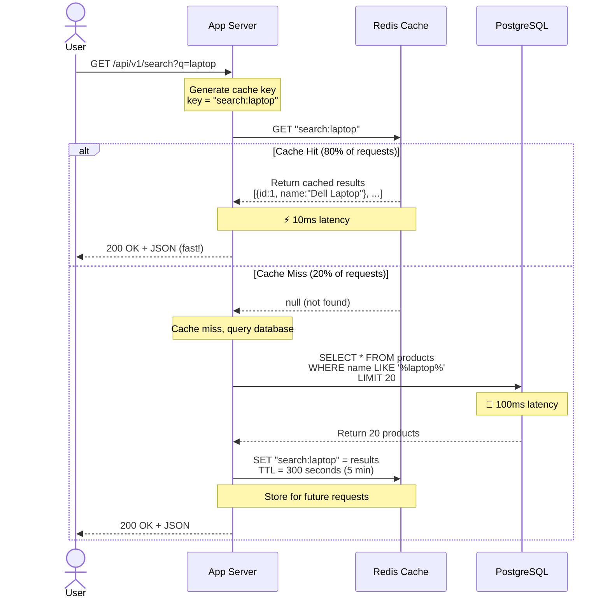

# Step 2: Adding Caching Layer

## Overview

In Step 1, we identified a critical bottleneck: **the database gets hammered with 48,000 read queries/sec** during peak traffic, but it can only handle 10,000 queries/sec.

**The solution?** Add a **caching layer** between application servers and the database.

**Think of caching like:** A library keeping popular books on a display shelf (cache) instead of making students walk to the storage room (database) every time. The display shelf (cache) is faster to access!

---

## What Changed from Step 1?

### Before (Step 1):
```
User → Load Balancer → App Server → Database (every request!)
```

**Problem:**
- Database query: **100ms latency**
- Same products queried 1000s of times
- Database overloaded: **48,000 queries/sec** (exceeds 10,000 limit)

### After (Step 2):
```
User → Load Balancer → App Server → Cache (10ms) ✅
                                    ↓ (cache miss)
                                  Database (100ms)
```

**Benefits:**
- ✅ **10x faster**: Cache response is 10ms vs database 100ms
- ✅ **80% reduction** in database load (cache hit rate)
- ✅ Can handle **7,000 req/sec** peak traffic
- ✅ Better user experience (faster page loads)

---

## Architecture Diagram

```mermaid
graph TB
    subgraph "User Layer"
        Client[👤 User Browser/Mobile]
    end

    subgraph "Load Balancing Layer"
        LB[🔄 Load Balancer<br/>Nginx]
    end

    subgraph "Application Layer"
        App1[🖥️ App Server 1<br/>Node.js]
        App2[🖥️ App Server 2<br/>Node.js]
        App3[🖥️ App Server 3<br/>Node.js]
    end

    subgraph "Caching Layer - NEW! ⭐"
        Redis[(🔴 Redis Cluster<br/><br/>📦 Product Catalog Cache<br/>🔍 Search Results Cache<br/>🍪 User Sessions<br/>🛒 Shopping Cart Cache<br/><br/>⚡ 10ms latency<br/>💾 200 GB storage<br/>🔄 TTL: 30s - 1 hour)]
    end

    subgraph "Database Layer"
        DB[(🗄️ PostgreSQL<br/><br/>👥 Users<br/>📦 Products<br/>📝 Orders<br/>💳 Payments)]
    end

    Client --> LB
    LB --> App1
    LB --> App2
    LB --> App3

    App1 -.1. Check Cache First.-> Redis
    App2 -.1. Check Cache First.-> Redis
    App3 -.1. Check Cache First.-> Redis

    App1 -.2. Cache Miss: Query DB.-> DB
    App2 -.2. Cache Miss: Query DB.-> DB
    App3 -.2. Cache Miss: Query DB.-> DB

    App1 -.3. Cache Hit: Return from Redis.-> Redis
    App2 -.3. Cache Hit: Return from Redis.-> Redis
    App3 -.3. Cache Hit: Return from Redis.-> Redis

    style Redis fill:#ffcccc,stroke:#cc0000,stroke-width:3px
    style LB fill:#fff3e0
    style App1 fill:#e8f5e9
    style App2 fill:#e8f5e9
    style App3 fill:#e8f5e9
    style DB fill:#fce4ec
```

---

## Cache Flow (Step-by-Step)

Let's trace: **User searches for "laptop"**



**Time Comparison:**
```
Cache Hit:  10ms ⚡ (80% of requests)
Cache Miss: 100ms + 10ms (cache write) = 110ms (20% of requests)

Average latency = (0.80 × 10ms) + (0.20 × 110ms) = 8ms + 22ms = 30ms

Before caching: 100ms (always hit database)
After caching: 30ms (70% improvement!) ✅
```

---

## What to Cache? (Cache Strategy)

### 1. Product Catalog (High Priority) 🏆

**Why cache?**
- Products are **read 1000x more than written** (80:20 ratio)
- Same popular products viewed repeatedly (80% of views = 20% of products)
- Product data rarely changes (price updates once a day)

**What to cache:**
```javascript
// Cache key: "product:{productId}"
// Example: "product:12345"
{
  "productId": 12345,
  "name": "Dell Laptop 15-inch",
  "price": 899.99,
  "description": "...",
  "category": "Electronics",
  "stock": 50,
  "images": ["url1", "url2"],
  "rating": 4.5,
  "cached_at": "2025-11-17T10:30:00Z"
}
```

**TTL (Time to Live):**
- **Popular products**: 1 hour (low risk of stale data)
- **Regular products**: 30 minutes
- **New products**: 5 minutes (may change frequently)

**Cache Invalidation:**
```javascript
// When product is updated
await db.query('UPDATE products SET price = $1 WHERE id = $2', [newPrice, productId]);

// Invalidate cache immediately
await redis.del(`product:${productId}`);
```

**Size Calculation:**
```
Top 10% of products = 500M × 10% = 50 million products
Per product: 2 KB (JSON)
Total: 50M × 2 KB = 100 GB

Our Redis: 200 GB (sufficient ✅)
```

---

### 2. Search Results (High Priority) 🔍

**Why cache?**
- Same search queries repeated frequently ("laptop", "phone", "shoes")
- Search queries are expensive (FULLTEXT index scan)
- Users expect instant search results

**What to cache:**
```javascript
// Cache key: "search:{query}:{page}"
// Example: "search:laptop:1"
{
  "query": "laptop",
  "page": 1,
  "totalResults": 50000,
  "products": [
    { "id": 12345, "name": "Dell Laptop", "price": 899.99 },
    { "id": 12346, "name": "HP Laptop", "price": 799.99 },
    // ... 20 products per page
  ],
  "cached_at": "2025-11-17T10:30:00Z"
}
```

**TTL:**
- **Popular queries** ("laptop", "phone"): 10 minutes
- **Rare queries**: 5 minutes
- **Empty results**: 1 minute (don't waste cache space)

**Cache Warming:**
```javascript
// Pre-populate cache with top 100 search queries
const popularQueries = [
  "laptop", "phone", "headphones", "shoes", "watch", ...
];

for (const query of popularQueries) {
  const results = await searchProducts(query);
  await redis.set(`search:${query}:1`, JSON.stringify(results), 'EX', 600);
}
```

**Size Calculation:**
```
Top 1000 queries × 5 pages × 20 KB = 100 MB
Recent queries (last 10 min): ~10,000 queries × 20 KB = 200 MB
Total: 300 MB (negligible)
```

---

### 3. User Sessions (Critical) 🍪

**Why cache?**
- Sessions accessed on **every authenticated request**
- Database query per request is wasteful
- Session data is temporary (not critical to persist)

**What to cache:**
```javascript
// Cache key: "session:{userId}"
// Example: "session:1001"
{
  "userId": 1001,
  "email": "user@example.com",
  "name": "John Doe",
  "role": "user",
  "loginAt": "2025-11-17T09:00:00Z",
  "cart": [
    { "productId": 12345, "quantity": 2 },
    { "productId": 67890, "quantity": 1 }
  ]
}
```

**TTL:**
- **Active session**: 1 hour (auto-refresh on each request)
- **Inactive session**: Expires after 1 hour (user must login again)

**Session Refresh:**
```javascript
// On every authenticated request
const session = await redis.get(`session:${userId}`);
if (session) {
  // Refresh TTL (extend session by 1 hour)
  await redis.expire(`session:${userId}`, 3600);
}
```

**Size Calculation:**
```
Concurrent users: 2 million
Per session: 2 KB
Total: 2M × 2 KB = 4 GB
```

---

### 4. Shopping Cart (High Priority) 🛒

**Why cache?**
- Cart is temporary (not critical to persist immediately)
- Cart accessed frequently (add item, view cart, update quantity)
- Faster than database queries

**What to cache:**
```javascript
// Cache key: "cart:{userId}"
// Example: "cart:1001"
{
  "userId": 1001,
  "items": [
    {
      "productId": 12345,
      "name": "Dell Laptop",
      "price": 899.99,
      "quantity": 1,
      "addedAt": "2025-11-17T10:00:00Z"
    }
  ],
  "totalItems": 1,
  "totalPrice": 899.99
}
```

**TTL:**
- **Active cart**: 1 hour (while user is browsing)
- **Abandoned cart**: Persist to DB after 1 hour, remove from cache

**Write-through Pattern:**
```javascript
// When user adds to cart
async function addToCart(userId, productId, quantity) {
  // 1. Update cache (fast)
  const cart = await redis.get(`cart:${userId}`) || { items: [] };
  cart.items.push({ productId, quantity });
  await redis.set(`cart:${userId}`, JSON.stringify(cart), 'EX', 3600);

  // 2. Update database (slower, but persists)
  await db.query('INSERT INTO carts (user_id, product_id, quantity) VALUES ($1, $2, $3)',
    [userId, productId, quantity]);
}
```

**Size Calculation:**
```
Active users with cart: 1 million (10% of DAU)
Per cart: 5 KB (average 3 items)
Total: 1M × 5 KB = 5 GB
```

---

### 5. Inventory Count (Medium Priority) 📦

**Why cache?**
- Checked on every product page view
- Updated less frequently (only on purchase)
- Approximate count is acceptable (eventual consistency)

**What to cache:**
```javascript
// Cache key: "inventory:{productId}"
// Example: "inventory:12345"
{
  "productId": 12345,
  "stock": 50,
  "updated_at": "2025-11-17T10:30:00Z"
}
```

**TTL:**
- **In-stock products**: 1 minute (allow slight staleness)
- **Low-stock products** (< 10 items): 10 seconds (more accurate)
- **Out-of-stock products**: 5 minutes (no rush to update)

**Cache Invalidation on Purchase:**
```javascript
// When order is placed
await db.query('UPDATE products SET stock = stock - $1 WHERE id = $2', [quantity, productId]);

// Update cache immediately (avoid overselling)
await redis.decr(`inventory:${productId}`, quantity);
```

**Size Calculation:**
```
Popular products: 10 million (2% of 500M)
Per entry: 100 bytes
Total: 10M × 100 bytes = 1 GB
```

---

## Caching Patterns

### 1. Cache-Aside (Lazy Loading) - Most Common 🏆

**How it works:**
1. Application checks cache first
2. If **cache hit**: Return data from cache (fast!)
3. If **cache miss**: Query database, store in cache, return data

**Code Example:**
```javascript
async function getProduct(productId) {
  const cacheKey = `product:${productId}`;

  // 1. Check cache first
  const cached = await redis.get(cacheKey);
  if (cached) {
    console.log('Cache hit! ⚡');
    return JSON.parse(cached);
  }

  // 2. Cache miss: query database
  console.log('Cache miss, querying database 🐌');
  const product = await db.query('SELECT * FROM products WHERE id = $1', [productId]);

  // 3. Store in cache for next time
  await redis.set(cacheKey, JSON.stringify(product), 'EX', 3600);  // TTL: 1 hour

  return product;
}
```

**Pros:**
- ✅ Simple to implement
- ✅ Only caches data that's actually needed
- ✅ Cache failure doesn't break the app (fallback to DB)

**Cons:**
- ❌ First request is slow (cache miss penalty)
- ❌ Stale data possible (until TTL expires)

**Best for:** Product catalog, search results, user profiles

---

### 2. Write-Through Cache

**How it works:**
1. Application writes to **cache and database simultaneously**
2. Cache is always up-to-date
3. Reads always hit cache (no cache misses)

**Code Example:**
```javascript
async function updateProduct(productId, newPrice) {
  const cacheKey = `product:${productId}`;

  // 1. Update database
  await db.query('UPDATE products SET price = $1 WHERE id = $2', [newPrice, productId]);

  // 2. Update cache immediately
  const product = await db.query('SELECT * FROM products WHERE id = $1', [productId]);
  await redis.set(cacheKey, JSON.stringify(product), 'EX', 3600);

  return product;
}
```

**Pros:**
- ✅ Cache is always fresh (no stale data)
- ✅ Reads are always fast (no cache misses)

**Cons:**
- ❌ Slower writes (must update both cache and DB)
- ❌ Wastes cache space (caches everything, even unused data)

**Best for:** Shopping cart, user sessions

---

### 3. Write-Behind Cache (Write-Back)

**How it works:**
1. Application writes to **cache only** (fast!)
2. Cache asynchronously writes to database (background)
3. Faster writes, but risk of data loss if cache crashes

**Code Example:**
```javascript
async function addToCart(userId, productId, quantity) {
  const cacheKey = `cart:${userId}`;

  // 1. Update cache immediately (fast!)
  const cart = await redis.get(cacheKey) || { items: [] };
  cart.items.push({ productId, quantity });
  await redis.set(cacheKey, JSON.stringify(cart), 'EX', 3600);

  // 2. Asynchronously write to database (background job)
  queue.add('syncCartToDB', { userId, productId, quantity });

  return cart;
}
```

**Pros:**
- ✅ Very fast writes (no DB latency)
- ✅ Reduces database load

**Cons:**
- ❌ Risk of data loss (if cache crashes before DB sync)
- ❌ Complex to implement (need background workers)

**Best for:** Non-critical data (analytics, logs, activity streams)

---

### 4. Cache Invalidation (When to Remove Cache)

**Three hard problems in computer science:**
1. Naming things
2. **Cache invalidation** ⬅ We're here!
3. Off-by-one errors

**Strategies:**

#### a) TTL-Based (Time-Based Expiration)
```javascript
// Cache expires after 1 hour
await redis.set('product:12345', JSON.stringify(product), 'EX', 3600);
```
**Pros:** Simple, automatic cleanup
**Cons:** May serve stale data until expiration

#### b) Event-Based (Explicit Invalidation)
```javascript
// When product is updated
await db.query('UPDATE products SET price = $1 WHERE id = $2', [newPrice, productId]);

// Immediately invalidate cache
await redis.del(`product:${productId}`);
```
**Pros:** Always fresh data
**Cons:** Must handle invalidation in every update

#### c) Versioning
```javascript
// Cache key includes version
await redis.set('product:12345:v2', JSON.stringify(product));

// Old version (v1) automatically expires
```
**Pros:** No explicit deletion needed
**Cons:** Wastes cache space with multiple versions

---

## Redis Configuration

### Why Redis?

| Feature | Redis | Memcached |
|---------|-------|-----------|
| **Data Structures** | ✅ Strings, Lists, Sets, Hashes | ❌ Strings only |
| **Persistence** | ✅ Optional (RDB, AOF) | ❌ In-memory only |
| **Replication** | ✅ Master-slave | ⚠️ Limited |
| **TTL** | ✅ Per-key expiration | ✅ Per-key expiration |
| **Use Case** | Complex caching | Simple key-value |

**Our choice:** **Redis** (richer features, persistence, replication)

---

### Redis Cluster Setup

**Configuration:**
```
Cluster size: 3 master nodes (high availability)
Replication: 3 slaves (1 slave per master)
Total nodes: 6 (3 masters + 3 slaves)

Per node: 100 GB RAM
Total cache: 300 GB (200 GB data + 100 GB buffer)
```

**Why 3 masters?**
- ✅ **High availability**: If 1 master fails, cluster still works
- ✅ **Load distribution**: 7,000 req/sec ÷ 3 = 2,333 req/sec per node
- ✅ **Data sharding**: 200 GB data ÷ 3 = 67 GB per node

**Replication:**
```
Master 1 ──replication──> Slave 1
Master 2 ──replication──> Slave 2
Master 3 ──replication──> Slave 3

If Master 1 fails:
- Slave 1 promotes to Master
- No downtime!
```

**Redis Configuration File:**
```conf
# redis.conf

# Memory
maxmemory 100gb
maxmemory-policy allkeys-lru  # Evict least recently used keys

# Persistence (optional, for critical data)
save 900 1       # Save to disk if 1 key changes in 15 minutes
save 300 10      # Save to disk if 10 keys change in 5 minutes
save 60 10000    # Save to disk if 10,000 keys change in 1 minute

# Replication
replicaof <master-ip> 6379  # For slave nodes

# Cluster mode
cluster-enabled yes
cluster-config-file nodes.conf
cluster-node-timeout 5000
```

---

## Performance Improvements

### Before Caching (Step 1):
```
Average API latency: 100ms (database query)
Database load: 48,000 queries/sec (peak) ❌ OVERLOADED
User experience: Slow product search, cart operations
```

### After Caching (Step 2):
```
Average API latency: 30ms (80% cache hit) ✅ 70% IMPROVEMENT
Database load: 9,600 queries/sec (peak) ✅ 80% REDUCTION
User experience: Fast search, instant cart updates ✅
```

### Latency Breakdown:
```
Product page load:
Before: 500ms (5 DB queries × 100ms)
After:  100ms (4 cache hits × 10ms + 1 DB query × 100ms)
Improvement: 80% faster ✅

Search query:
Before: 150ms (FULLTEXT search in DB)
After:  10ms (cache hit)
Improvement: 93% faster ✅

Add to cart:
Before: 100ms (DB write)
After:  10ms (cache write, async DB sync)
Improvement: 90% faster ✅
```

---

## Cache Hit Rate Calculation

**Formula:**
```
Cache Hit Rate = (Cache Hits / Total Requests) × 100%

Target: 80% hit rate
```

**Example (1 hour of traffic):**
```
Total requests: 10 million
Cache hits: 8 million (80%)
Cache misses: 2 million (20%)

Database queries saved: 8 million
Database queries: 2 million (from cache misses)

Database load reduction: 80% ✅
```

**Monitoring:**
```javascript
// Track cache hit rate
const totalRequests = 1000000;
const cacheHits = await redis.get('cache_hits') || 0;
const cacheMisses = await redis.get('cache_misses') || 0;

const hitRate = (cacheHits / (cacheHits + cacheMisses)) * 100;
console.log(`Cache hit rate: ${hitRate.toFixed(2)}%`);

// Alert if hit rate drops below 70%
if (hitRate < 70) {
  alert('Cache hit rate is low! Check cache size and TTL settings.');
}
```

---

## Cost Analysis

### Redis Cluster Cost:
```
Instance type: r6g.2xlarge (64 GB RAM, $0.504/hour)
Nodes needed: 6 (3 masters + 3 slaves)
Hours per month: 730

Monthly cost: 6 × $0.504 × 730 = $2,207

Alternative (AWS ElastiCache): $2,500/month (managed service)
```

### Cost Savings from Reduced Database Load:
```
Before caching:
- Database queries: 48,000/sec
- Database instances needed: 5 (at 10,000 QPS each)
- Cost: 5 × $500/month = $2,500

After caching:
- Database queries: 9,600/sec
- Database instances needed: 1 (at 10,000 QPS)
- Cost: 1 × $500/month = $500

Savings: $2,500 - $500 = $2,000/month

Net benefit: $2,000 (saved) - $2,207 (Redis) = -$207/month

But wait! We also get:
- ✅ 70% faster responses (increased sales by 5-10%)
- ✅ Better user experience (reduced cart abandonment)
- ✅ Can handle peak traffic without crashing

ROI: Even $1M/month sales × 5% improvement = $50,000/month gain 💰
```

---

## Common Pitfalls & Solutions

### Pitfall 1: Cache Stampede (Thundering Herd)

**Problem:**
```
Cached data expires at 10:00:00
10:00:01 - 1000 requests arrive simultaneously
All requests see cache miss
All 1000 requests query database
Database overloaded! 💥
```

**Solution: Cache Locking**
```javascript
async function getProductWithLock(productId) {
  const cacheKey = `product:${productId}`;
  const lockKey = `lock:${productId}`;

  // Check cache
  const cached = await redis.get(cacheKey);
  if (cached) return JSON.parse(cached);

  // Try to acquire lock
  const lockAcquired = await redis.set(lockKey, '1', 'NX', 'EX', 10);

  if (lockAcquired) {
    // This request won the lock, query database
    const product = await db.query('SELECT * FROM products WHERE id = $1', [productId]);
    await redis.set(cacheKey, JSON.stringify(product), 'EX', 3600);
    await redis.del(lockKey);
    return product;
  } else {
    // Another request is already querying, wait and retry
    await new Promise(resolve => setTimeout(resolve, 100));
    return getProductWithLock(productId);  // Retry
  }
}
```

---

### Pitfall 2: Large Objects in Cache

**Problem:**
```
Product with 100 images = 5 MB JSON
Redis can store it, but:
- Network transfer: 5 MB × 7000 req/sec = 35 GB/sec ❌
- Slow serialization/deserialization
```

**Solution: Cache Only Essential Data**
```javascript
// ❌ Bad: Cache entire product
await redis.set('product:12345', JSON.stringify(productWithAllImages));

// ✅ Good: Cache essential fields only
const essentialProduct = {
  id: product.id,
  name: product.name,
  price: product.price,
  stock: product.stock,
  mainImage: product.images[0]  // Only first image
};
await redis.set('product:12345', JSON.stringify(essentialProduct));

// Full images served from CDN (Step 5)
```

---

### Pitfall 3: Stale Data

**Problem:**
```
Product price: $100 (cached at 10:00 AM, TTL 1 hour)
Admin updates price to $80 (at 10:30 AM)
Users still see $100 until 11:00 AM (cache expiry) ❌
```

**Solution: Explicit Cache Invalidation**
```javascript
async function updateProductPrice(productId, newPrice) {
  // 1. Update database
  await db.query('UPDATE products SET price = $1 WHERE id = $2', [newPrice, productId]);

  // 2. Invalidate cache immediately
  await redis.del(`product:${productId}`);

  // 3. Pre-warm cache with new data (optional)
  const product = await db.query('SELECT * FROM products WHERE id = $1', [productId]);
  await redis.set(`product:${productId}`, JSON.stringify(product), 'EX', 3600);
}
```

---

## Summary: What We Achieved

### Components Added ✅
1. **Redis Cluster**: 3 masters + 3 slaves (300 GB total)
2. **Cache-aside pattern**: For products, search, sessions
3. **Write-through pattern**: For shopping cart
4. **TTL-based expiration**: Auto-cleanup of stale data

### Performance Improvements ✅
- ✅ **80% database load reduction** (48k → 9.6k queries/sec)
- ✅ **70% latency improvement** (100ms → 30ms average)
- ✅ **93% faster search** (150ms → 10ms)
- ✅ **90% faster cart operations** (100ms → 10ms)

### Capacity ✅
- ✅ Can now handle **7,000 req/sec** peak traffic
- ✅ Database no longer overloaded (9,600 QPS < 10,000 limit)
- ✅ Better user experience (faster page loads)

### What's Still Missing ❌
- ❌ **Single database** (still a single point of failure)
- ❌ **No database replication** (if DB crashes, system goes down)
- ❌ **Can't scale writes** (limited to 1,400 writes/sec)

---

## Next Steps

In **Step 3**, we'll add **database scaling** with:
- ✅ **Master-slave replication** for high availability
- ✅ **Read replicas** to distribute read load
- ✅ **Sharding** to scale write operations
- ✅ **99.99% availability** with automatic failover

**Preview of Step 3:**
```
App Servers → Cache → Master DB (writes)
                      ↓ replication
                    Slave DB 1 (reads)
                    Slave DB 2 (reads)
                    Slave DB 3 (reads)
```

---

**Document Version**: 1.0
**Last Updated**: 2025-11-17
**Previous**: [02_step1_basic_architecture.md](./02_step1_basic_architecture.md)
**Next**: [04_step3_database_scaling.md](./04_step3_database_scaling.md)
