# Step 3: Database Scaling (Replication & Sharding)

## Overview

In Step 2, we solved the **read performance problem** with caching. But we still have critical issues:

**Problems:**
1. ❌ **Single point of failure**: If database crashes, entire system goes down
2. ❌ **Limited write capacity**: 1 database can handle 1,400 writes/sec (our peak)
3. ❌ **Limited read capacity** (even with cache): 9,600 reads/sec hits 1 database
4. ❌ **No disaster recovery**: If data center fails, we lose everything
5. ❌ **Poor availability**: Current uptime = 99.5% (need 99.99%)

**Solution:** Add **database replication and read replicas**!

**Think of it like:** Having backup generators (replicas) for a hospital - if main power fails, backups take over instantly!

---

## What Changed from Step 2?

### Before (Step 2):
```
App Servers → Cache → Single Database (reads + writes)
                      ↓
                If DB fails: System down! ❌
```

### After (Step 3):
```
App Servers → Cache → Master DB (writes only)
                      ↓ replication
                    Slave 1 (reads)
                    Slave 2 (reads)
                    Slave 3 (reads)

If Master fails: Promote Slave 1 to Master ✅
If Slave fails: Use other slaves ✅
```

**Benefits:**
- ✅ **High availability**: No single point of failure
- ✅ **Read scalability**: Distribute 9,600 reads/sec across 3 slaves = 3,200 reads/sec each
- ✅ **Write scalability**: Master handles 1,400 writes/sec (within capacity)
- ✅ **Disaster recovery**: Replicas in different availability zones
- ✅ **99.99% uptime**: Automatic failover in < 30 seconds

---

## Architecture Diagram


---

## Master-Slave Replication Explained

### What is Replication?

**Simple Definition:** Making identical copies of data across multiple database servers.

**Analogy:** Like having a teacher (master) who teaches students (slaves). When the teacher writes on the board (master writes data), all students copy it into their notebooks (slaves replicate data).

### How it Works


**Key Points:**
1. **Master handles all writes** (INSERT, UPDATE, DELETE)
2. **Slaves replicate changes** from master (asynchronously)
3. **Slaves handle reads** (SELECT queries)
4. **Replication lag**: Slaves may be 100-500ms behind master (eventual consistency)

---

## Replication Types

### 1. Asynchronous Replication (Our Choice) ✅

**How it works:**
```
1. Master writes to its own disk
2. Master immediately returns success to app
3. Master sends changes to slaves in background
4. Slaves apply changes when they receive them

Timeline:
T0: App writes to master
T1: Master confirms (latency: 50ms)
T2: Slaves receive changes (latency: +200ms)

Total write latency: 50ms (app doesn't wait for slaves)
```

**Pros:**
- ✅ **Fast writes**: App doesn't wait for slaves
- ✅ **High throughput**: Can handle 1,400 writes/sec
- ✅ **Tolerates slow slaves**: One slow slave doesn't block writes

**Cons:**
- ❌ **Replication lag**: Slaves may be 100-500ms behind
- ❌ **Data loss risk**: If master crashes before replicating, recent writes are lost
- ❌ **Eventual consistency**: Reads may return slightly stale data

**When to use:** Most use cases (products, search, cart) - eventual consistency is acceptable

---

### 2. Synchronous Replication

**How it works:**
```
1. Master writes to its own disk
2. Master waits for at least 1 slave to confirm
3. Master returns success to app

Timeline:
T0: App writes to master
T1: Master writes locally (50ms)
T2: Slave receives and writes (200ms)
T3: Master confirms to app (latency: 250ms)

Total write latency: 250ms (5x slower!)
```

**Pros:**
- ✅ **No data loss**: Changes are on 2+ servers before confirming
- ✅ **Strong consistency**: Reads are always up-to-date

**Cons:**
- ❌ **Slow writes**: 5x slower than async (250ms vs 50ms)
- ❌ **Lower throughput**: Can handle only ~500 writes/sec
- ❌ **Slave failure blocks writes**: If slave is down, writes fail

**When to use:** Critical financial data (banking, stock trading) where zero data loss is required

---

### 3. Semi-Synchronous Replication (Compromise)

**How it works:**
```
1. Master writes to its own disk
2. Master waits for at least 1 slave to ACK (not fully write, just receive)
3. Master returns success

Latency: 100ms (2x slower than async, 2.5x faster than sync)
```

**Our setup:**
- **Orders and payments**: Semi-sync (can't lose orders!)
- **Products and search**: Async (can tolerate slight staleness)

---

## Read/Write Splitting Strategy

### Application-Level Splitting (Our Approach)

**Code Example:**
```javascript
const { Pool } = require('pg');

// Database connections
const masterDB = new Pool({
  host: 'master.db.internal',
  port: 5432,
  database: 'amazonshop',
  user: 'app',
  password: 'secret',
  max: 20  // Connection pool
});

const replicaDBs = [
  new Pool({ host: 'replica1.db.internal', port: 5432, /* ... */ }),
  new Pool({ host: 'replica2.db.internal', port: 5432, /* ... */ }),
  new Pool({ host: 'replica3.db.internal', port: 5432, /* ... */ })
];

// Round-robin replica selection
let replicaIndex = 0;
function getReadDB() {
  const db = replicaDBs[replicaIndex];
  replicaIndex = (replicaIndex + 1) % replicaDBs.length;
  return db;
}

// Write operations → Master
async function createOrder(userId, items, total) {
  const result = await masterDB.query(
    'INSERT INTO orders (user_id, total_amount, status) VALUES ($1, $2, $3) RETURNING order_id',
    [userId, total, 'PENDING']
  );
  return result.rows[0].order_id;
}

// Read operations → Replicas
async function getProduct(productId) {
  const db = getReadDB();  // Round-robin across replicas
  const result = await db.query(
    'SELECT * FROM products WHERE product_id = $1',
    [productId]
  );
  return result.rows[0];
}

// Complex analytics → Dedicated replica (Slave 3)
async function getTopSellingProducts() {
  const db = replicaDBs[2];  // Use replica 3 for heavy queries
  const result = await db.query(`
    SELECT p.product_id, p.name, SUM(oi.quantity) as total_sold
    FROM products p
    JOIN order_items oi ON p.product_id = oi.product_id
    GROUP BY p.product_id
    ORDER BY total_sold DESC
    LIMIT 100
  `);
  return result.rows;
}
```

**Load Distribution:**
```
Write Operations (20%):
- Create order → Master
- Update inventory → Master
- Process payment → Master
- Update user profile → Master

Read Operations (80%):
- Browse products → Replica 1 (33%)
- Search products → Replica 2 (33%)
- View orders → Replica 1 (17%)
- Analytics → Replica 3 (17%)

Load per server:
Master: 1,400 writes/sec (peak)
Replica 1: 3,200 reads/sec
Replica 2: 3,200 reads/sec
Replica 3: 3,200 reads/sec (mostly analytics)
```

---

## Handling Replication Lag

### Problem: Read-Your-Writes Consistency

**Scenario:**
```
User places order at 10:00:00.000
- Write goes to Master (order_id = 12345)
- Master replicates to slaves (takes 200ms)

User immediately views "My Orders" at 10:00:00.050
- Read goes to Replica 1
- Replica hasn't received order yet (only 50ms passed)
- User doesn't see their order! ❌

User refreshes at 10:00:00.250
- Replica now has the order
- User sees the order ✅

Result: Confusing user experience!
```

**Solution 1: Read from Master After Write**
```javascript
async function placeOrder(userId, items, total) {
  // 1. Write to master
  const orderId = await createOrder(userId, items, total);

  // 2. Immediate read from master (not replica)
  const order = await masterDB.query(
    'SELECT * FROM orders WHERE order_id = $1',
    [orderId]
  );

  return order.rows[0];
}
```

**Pros:** ✅ Always consistent
**Cons:** ❌ Adds load to master (defeats purpose of read replicas)

---

**Solution 2: Session Stickiness (Read from Same DB for Session)**
```javascript
// Track last write time per user session
const userSessions = new Map();

async function placeOrder(userId, items, total) {
  const orderId = await createOrder(userId, items, total);

  // Remember user wrote data
  userSessions.set(userId, Date.now());

  return orderId;
}

async function getUserOrders(userId) {
  const lastWrite = userSessions.get(userId);

  // If user wrote data in last 5 seconds, read from master
  if (lastWrite && (Date.now() - lastWrite < 5000)) {
    return masterDB.query('SELECT * FROM orders WHERE user_id = $1', [userId]);
  }

  // Otherwise, read from replica
  const db = getReadDB();
  return db.query('SELECT * FROM orders WHERE user_id = $1', [userId]);
}
```

**Pros:** ✅ Consistent for recent writes, ✅ Still uses replicas for older data
**Cons:** ⚠️ More complex, requires session tracking

---

**Solution 3: Eventual Consistency with UI Feedback**
```javascript
async function placeOrder(userId, items, total) {
  const orderId = await createOrder(userId, items, total);

  // Show optimistic UI immediately (don't wait for replica)
  return {
    orderId,
    status: 'PENDING',
    message: 'Order placed! It may take a few seconds to appear in your order history.'
  };
}
```

**Pros:** ✅ Simple, ✅ Fast, ✅ Honest with user
**Cons:** ⚠️ User must wait for replica to catch up

**Our choice:** **Solution 2** (session stickiness) for critical operations like orders, **Solution 3** for non-critical operations like reviews.

---

## Failover Strategy

### Automatic Failover (High Availability)

**What is failover?** When master database fails, automatically promote a slave to become the new master.

**Scenario:**
```
Normal state:
Master (writes) → Slave 1, Slave 2, Slave 3 (reads)

Master crashes at 10:00:00:
10:00:05 - Health check detects master is down
10:00:10 - Elect Slave 1 as new master
10:00:15 - Update DNS to point to Slave 1
10:00:20 - Resume writes to new master (Slave 1)

Downtime: 20 seconds ✅

New state:
Slave 1 (new master, writes) → Slave 2, Slave 3 (reads)
```

**Failover Flow:**

```mermaid
sequenceDiagram
    participant App as App Servers
    participant LB as DB Load Balancer
    participant Master as Master DB
    participant Slave1 as Slave 1
    participant Slave2 as Slave 2
    participant Monitor as Health Monitor

    Note over Master: Master is healthy

    App->>LB: Write request
    LB->>Master: Forward to master
    Master-->>App: Success

    Note over Master: Master crashes! 💥

    Monitor->>Master: Health check
    Master--xMonitor: No response (timeout)

    Monitor->>Monitor: Retry health check (3 attempts)
    Master--xMonitor: Still no response

    Note over Monitor: Master confirmed dead

    Monitor->>Slave1: Promote to master
    Slave1->>Slave1: Enable writes<br/>Stop replication
    Slave1-->>Monitor: Promoted successfully

    Monitor->>LB: Update master endpoint<br/>master = Slave1
    LB-->>Monitor: Updated

    Note over App,Slave2: Resume normal operations

    App->>LB: Write request
    LB->>Slave1: Forward to new master
    Slave1-->>App: Success

    Note over Slave1: Slave 1 is now master
```



**Tools for Automatic Failover:**

| Tool | Type | Failover Time | Complexity |
|------|------|---------------|------------|
| **AWS RDS Multi-AZ** | Managed | 30-60 seconds | ✅ Low (automatic) |
| **PostgreSQL + Patroni** | Self-managed | 10-30 seconds | ⚠️ Medium |
| **MySQL + Orchestrator** | Self-managed | 10-30 seconds | ⚠️ Medium |
| **ProxySQL** | Proxy-based | 5-10 seconds | ⚠️ Medium |

**Our choice:** **AWS RDS Multi-AZ** (managed service, automatic failover)

---

### RDS Multi-AZ Configuration

```
Primary Database (AZ-A):
- Handles all writes
- Synchronous replication to standby

Standby Database (AZ-B):
- Receives synchronous replication
- Automatically promoted if primary fails
- Hidden from application (no reads)

Read Replicas (AZ-B, AZ-C):
- Asynchronous replication from primary
- Handle read traffic
- Not promoted during failover (standby is promoted)

Failover process:
1. Primary fails (AZ-A goes down)
2. RDS detects failure (health check)
3. Standby promoted to primary (AZ-B)
4. DNS updated (app connects to new primary)
5. Downtime: 30-60 seconds ✅
```

**Cost:**
```
RDS PostgreSQL (db.r6g.2xlarge, 8 vCPU, 64 GB RAM):
- Single instance: $500/month
- Multi-AZ (primary + standby): $1,000/month
- Read replicas: 3 × $500 = $1,500/month

Total: $2,500/month

Benefits:
- ✅ 99.99% uptime (vs 99.5% for single instance)
- ✅ Zero data loss (synchronous standby)
- ✅ Automatic backups and patching
```

---

## Sharding (Horizontal Partitioning)

### What is Sharding?

**Simple Definition:** Splitting data across multiple databases based on a sharding key.

**Analogy:** Like organizing books in a library by the first letter of the title:
- Shard 1: Books A-F
- Shard 2: Books G-M
- Shard 3: Books N-S
- Shard 4: Books T-Z

**Why shard?**
- ✅ **Scale writes**: Each shard handles subset of writes (1,400 ÷ 4 = 350 writes/sec each)
- ✅ **Scale storage**: Each shard stores subset of data (1 TB ÷ 4 = 250 GB each)
- ✅ **Parallel queries**: Can query all shards in parallel

**When to shard?**
- ⚠️ **Only when necessary!** Sharding adds complexity
- Wait until single database can't handle load (10,000 writes/sec)
- Our current load: 1,400 writes/sec (no sharding needed yet ✅)

---

### Sharding Strategy for Amazon Shop

**Option 1: Shard by User ID (Hash-Based)**

```
Shard selection: shard_id = user_id % 4

Example:
- User 1001 → 1001 % 4 = 1 → Shard 1
- User 1002 → 1002 % 4 = 2 → Shard 2
- User 1003 → 1003 % 4 = 3 → Shard 3
- User 1004 → 1004 % 4 = 0 → Shard 0

Data distribution:
Shard 0: Users 1000, 1004, 1008, 1012, ...
Shard 1: Users 1001, 1005, 1009, 1013, ...
Shard 2: Users 1002, 1006, 1010, 1014, ...
Shard 3: Users 1003, 1007, 1011, 1015, ...
```

**Pros:**
- ✅ Even distribution (each shard gets ~25% of users)
- ✅ Simple to implement

**Cons:**
- ❌ Can't query across users easily (e.g., "top products globally")
- ❌ Adding shards requires rehashing (move data)

---

**Option 2: Shard by Geography (Range-Based)**

```
Shard selection: based on user's region

Shard 0: US East users
Shard 1: US West users
Shard 2: Europe users
Shard 3: Asia users
```

**Pros:**
- ✅ Low latency (data is geographically close to users)
- ✅ Regulatory compliance (data stays in region)

**Cons:**
- ❌ Uneven distribution (more US users than Europe)
- ❌ Hot shards (US shards overloaded during US peak hours)

---

**Option 3: Shard by Product Category**

```
Shard 0: Electronics (laptops, phones)
Shard 1: Fashion (clothes, shoes)
Shard 2: Home & Kitchen
Shard 3: Books & Media
```

**Pros:**
- ✅ Can scale popular categories independently
- ✅ Category-specific analytics are fast

**Cons:**
- ❌ Uneven distribution (Electronics has more products than Books)
- ❌ Cross-category queries are slow (must query all shards)

---

**Our choice for future:** **User ID hashing** (even distribution, simple)

**Sharding implementation (future):**
```javascript
function getShardForUser(userId) {
  const numShards = 4;
  return userId % numShards;
}

async function createOrder(userId, items, total) {
  const shard = getShardForUser(userId);
  const db = masterDBs[shard];  // masterDBs[0], masterDBs[1], etc.

  const result = await db.query(
    'INSERT INTO orders (user_id, total_amount, status) VALUES ($1, $2, $3)',
    [userId, total, 'PENDING']
  );

  return result.rows[0].order_id;
}
```

---

## Database Capacity Analysis

### Current Capacity (Step 3)

**With Master + 3 Read Replicas:**

```
Write Capacity:
- Master: 10,000 writes/sec (theoretical max)
- Our load: 1,400 writes/sec (peak)
- Utilization: 14% ✅ (plenty of headroom)

Read Capacity:
- Replica 1: 10,000 reads/sec
- Replica 2: 10,000 reads/sec
- Replica 3: 10,000 reads/sec
- Total: 30,000 reads/sec

- Our load: 9,600 reads/sec (peak, with 80% cache hit)
- Utilization: 32% ✅

Availability:
- Multi-AZ failover: 99.99% ✅
- Downtime: 52 minutes/year (acceptable)
```

**Can we handle 10x growth?**

```
Future load (10x):
- Writes: 14,000 writes/sec
- Reads: 96,000 reads/sec

Write capacity:
- Single master: 10,000 writes/sec ❌ Not enough!
- Solution: Shard to 2 masters (7,000 writes/sec each) ✅

Read capacity:
- 3 replicas: 30,000 reads/sec ❌ Not enough!
- Solution: Add 7 more replicas (10 total = 100,000 reads/sec) ✅
```

---

## Performance Improvements

### Before Replication (Step 2):
```
Database availability: 99.5%
Database read capacity: 10,000 reads/sec (single DB)
Database write capacity: 10,000 writes/sec
Failover time: Manual (30 minutes) ❌
```

### After Replication (Step 3):
```
Database availability: 99.99% ✅
Database read capacity: 30,000 reads/sec (3 replicas) ✅
Database write capacity: 10,000 writes/sec (master)
Failover time: Automatic (30 seconds) ✅
```

**Latency improvements:**
```
Read query latency:
Before: All reads hit master (single point)
After: Reads distributed across 3 replicas
Result: 50ms → 50ms (same latency, but higher throughput)

Write query latency:
Before: 50ms (single master)
After: 50ms (async replication adds no latency)

Availability:
Before: 99.5% = 43.8 hours downtime/year
After: 99.99% = 52 minutes downtime/year
Improvement: 50x better! 🎉
```

---

## Cost Analysis

### Database Infrastructure Cost:

```
Master DB (db.r6g.2xlarge): $500/month
Standby DB (Multi-AZ): $500/month
Read Replica 1: $500/month
Read Replica 2: $500/month
Read Replica 3: $500/month

Total: $2,500/month

Previous (Step 2): $500/month (single DB)
Increase: $2,000/month

ROI Calculation:
- Downtime cost: $10,000/hour (revenue loss)
- Prevented downtime: 43 hours/year → 52 min/year = 42 hours saved
- Savings: 42 hours × $10,000 = $420,000/year
- Infrastructure cost: $2,000/month × 12 = $24,000/year

Net benefit: $420,000 - $24,000 = $396,000/year 💰
```

---

## Summary: What We Achieved

### Components Added ✅
1. **Master-Slave Replication**: 1 master + 3 read replicas
2. **Multi-AZ Deployment**: Primary + standby in different availability zones
3. **Automatic Failover**: 30-60 second failover time
4. **Read/Write Splitting**: Application-level routing

### Performance Improvements ✅
- ✅ **99.99% availability** (vs 99.5% before)
- ✅ **3x read capacity** (30,000 reads/sec)
- ✅ **Automatic failover** (30 sec vs 30 min manual)
- ✅ **Zero data loss** (synchronous standby)

### Capacity ✅
- ✅ Can handle **9,600 reads/sec** across 3 replicas
- ✅ Can handle **1,400 writes/sec** on master
- ✅ Can handle **10x growth** with sharding

### What's Still Missing ❌
- ❌ **Synchronous operations** (user waits for email, inventory update)
- ❌ **Heavy background jobs** (analytics, reports) block main DB
- ❌ **Spike in orders** (during flash sales) causes delays

---

## Next Steps

In **Step 4**, we'll add **Message Queue** for:
- ✅ **Async email notifications** (don't make user wait)
- ✅ **Async inventory updates** (background processing)
- ✅ **Async analytics** (offload heavy queries)
- ✅ **Better user experience** (faster checkout)

**Preview of Step 4:**
```
App Server → Create Order → Master DB
            ↓
          Publish Event → Message Queue
                           ↓
                        Workers (background)
                           ↓
                        - Send email
                        - Update inventory
                        - Trigger analytics
```

---

**Document Version**: 1.0
**Last Updated**: 2025-11-17
**Previous**: [03_step2_add_caching.md](./03_step2_add_caching.md)
**Next**: [05_step4_add_message_queue.md](./05_step4_add_message_queue.md)
