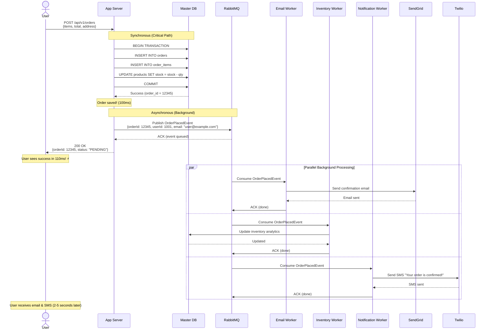

# Step 4: Adding Message Queue (Async Processing)

## Overview

In Step 3, we solved database scalability, but we still have a **user experience problem**:

**Current Checkout Flow (Synchronous):**
```
User clicks "Place Order"
  ↓ Wait 100ms - Create order in database
  ↓ Wait 2,000ms - Send confirmation email
  ↓ Wait 500ms - Update inventory
  ↓ Wait 1,000ms - Notify seller
  ↓ Wait 300ms - Update analytics
  ↓ Total: 3,900ms (almost 4 seconds!) ❌

User sees: "Order placed successfully" (after 4 seconds)
```

**Result:** Users abandon checkout because it's too slow!

**Solution:** Use a **Message Queue** to process non-critical tasks asynchronously.

**Think of it like:** Going to a restaurant - you order food (place order), get a receipt immediately (order confirmation), then the kitchen cooks in the background (async processing). You don't wait in front of the kitchen!

---

## What Changed from Step 3?

### Before (Step 3):
```
User → App Server → [All operations synchronously]
                    ↓
                  - Create order (100ms)
                  - Send email (2,000ms)
                  - Update inventory (500ms)
                  - Notify seller (1,000ms)

Total: 3,900ms ❌
```

### After (Step 4):
```
User → App Server → Create order (100ms) ✅
                    ↓
                  Publish event to queue (10ms)
                    ↓
                  Return to user (110ms total!) ⚡

Background Workers (async):
  Worker 1: Send email (2,000ms)
  Worker 2: Update inventory (500ms)
  Worker 3: Notify seller (1,000ms)
  Worker 4: Update analytics (300ms)

User sees: "Order placed!" in 110ms (35x faster!)
```

**Benefits:**
- ✅ **35x faster checkout** (3,900ms → 110ms)
- ✅ **Better user experience** (instant feedback)
- ✅ **Decouple services** (email service down doesn't block orders)
- ✅ **Handle traffic spikes** (queue buffers requests)
- ✅ **Retry failed operations** (automatic retry on failure)

---

## Architecture Diagram

```mermaid
graph TB
    subgraph "User Layer"
        Client[👤 User Browser]
    end

    subgraph "Application Layer"
        App1[🖥️ App Server 1]
        App2[🖥️ App Server 2]
        App3[🖥️ App Server 3]
    end

    subgraph "Caching Layer"
        Redis[(🔴 Redis Cache)]
    end

    subgraph "Database Layer"
        Master[(🗄️ Master DB)]
        Slave1[(🗄️ Replica 1)]
        Slave2[(🗄️ Replica 2)]
    end

    subgraph "Message Queue Layer - NEW! ⭐"
        Queue[📬 RabbitMQ / Kafka<br/><br/>📨 Email Queue<br/>📦 Inventory Queue<br/>🔔 Notification Queue<br/>📊 Analytics Queue<br/><br/>⚡ 10ms publish<br/>🔄 Guaranteed delivery<br/>♻️ Auto-retry]
    end

    subgraph "Worker Layer - NEW! ⭐"
        EmailWorker[📧 Email Worker<br/><br/>✉️ Send confirmations<br/>✉️ Send tracking updates<br/>✉️ Send promotions]

        InventoryWorker[📦 Inventory Worker<br/><br/>📉 Update stock<br/>📊 Low stock alerts<br/>🔄 Sync with warehouse]

        NotificationWorker[🔔 Notification Worker<br/><br/>📱 Push notifications<br/>📲 SMS alerts<br/>🔊 In-app notifications]

        AnalyticsWorker[📊 Analytics Worker<br/><br/>📈 Update metrics<br/>📉 Generate reports<br/>🎯 Track conversions]
    end

    subgraph "External Services"
        EmailService[📧 SendGrid API<br/>Email Provider]
        SMSService[📱 Twilio API<br/>SMS Provider]
        AnalyticsDB[(📊 Analytics DB<br/>Time-series DB)]
    end

    Client --> App1
    App1 --> Redis
    App1 --> Master

    App1 -.1. Place Order.-> Master
    App1 -.2. Publish Event.-> Queue
    App1 -.3. Return Success.-> Client

    Queue -.Subscribe.-> EmailWorker
    Queue -.Subscribe.-> InventoryWorker
    Queue -.Subscribe.-> NotificationWorker
    Queue -.Subscribe.-> AnalyticsWorker

    EmailWorker --> EmailService
    NotificationWorker --> SMSService
    InventoryWorker --> Master
    AnalyticsWorker --> AnalyticsDB

    Master ==Replication==> Slave1
    Master ==Replication==> Slave2

    style Queue fill:#ffe6cc,stroke:#ff9900,stroke-width:3px
    style EmailWorker fill:#e6f3ff
    style InventoryWorker fill:#e6f3ff
    style NotificationWorker fill:#e6f3ff
    style AnalyticsWorker fill:#e6f3ff
```

---

## Message Queue Flow (Step-by-Step)

### Scenario: User Places an Order



**Timeline:**
```
T0:    User clicks "Place Order"
T100:  Order saved to database
T110:  Event published to queue
T110:  User sees "Order placed!" ⚡ (fast!)

T500:  Inventory worker updates stock analytics
T2000: Email worker sends confirmation email
T3000: Notification worker sends SMS

Total user wait time: 110ms (vs 3,900ms before)
Improvement: 35x faster! 🎉
```

---

## What to Process Asynchronously?

### 1. Email Notifications (High Priority) 📧

**Why async?**
- Email sending takes **2-3 seconds** (network latency, SMTP)
- User doesn't need to wait for email to be sent
- Email service may be down (shouldn't block order)

**Types of emails:**
```
Order Confirmation:
- Sent immediately after order (high priority)
- Contains order details, tracking link
- Queue: "email.order.confirmation"

Shipping Updates:
- Sent when order ships
- Contains tracking number
- Queue: "email.shipping.update"

Promotional Emails:
- Sent in batches (low priority)
- Can be delayed by hours
- Queue: "email.marketing"
```

**Worker Implementation:**
```javascript
// Email Worker (consumes from RabbitMQ)
const amqp = require('amqplib');
const sendgrid = require('@sendgrid/mail');

async function emailWorker() {
  const connection = await amqp.connect('amqp://rabbitmq:5672');
  const channel = await connection.createChannel();

  // Subscribe to email queue
  await channel.assertQueue('email.order.confirmation', { durable: true });

  channel.consume('email.order.confirmation', async (msg) => {
    const event = JSON.parse(msg.content.toString());
    console.log(`Sending order confirmation email for order ${event.orderId}`);

    try {
      // Send email via SendGrid
      await sendgrid.send({
        to: event.userEmail,
        from: 'orders@amazonshop.com',
        subject: `Order Confirmation #${event.orderId}`,
        html: `<h1>Thank you for your order!</h1>
               <p>Order ID: ${event.orderId}</p>
               <p>Total: $${event.total}</p>`
      });

      console.log(`Email sent successfully for order ${event.orderId}`);

      // Acknowledge message (remove from queue)
      channel.ack(msg);

    } catch (error) {
      console.error(`Failed to send email: ${error.message}`);

      // Negative acknowledge (requeue for retry)
      channel.nack(msg, false, true);
    }
  });
}

emailWorker();
```

**Benefits:**
- ✅ Order placement doesn't wait for email
- ✅ Automatic retry if email fails
- ✅ Can scale workers independently (add more if email queue grows)

---

### 2. Inventory Sync (Medium Priority) 📦

**Why async?**
- Inventory count doesn't need to be updated instantly
- Heavy calculation (aggregate across warehouses)
- Can tolerate 1-2 second delay

**Operations:**
```
Stock Update:
- Update real-time inventory in cache
- Sync with warehouse management system
- Queue: "inventory.update"

Low Stock Alerts:
- Check if stock < threshold
- Send alert to purchasing team
- Queue: "inventory.alert"

Warehouse Sync:
- Sync inventory across multiple warehouses
- Reconcile discrepancies
- Queue: "inventory.sync"
```

**Worker Implementation:**
```javascript
async function inventoryWorker() {
  const channel = await amqp.connect('amqp://rabbitmq:5672').then(conn => conn.createChannel());
  await channel.assertQueue('inventory.update', { durable: true });

  channel.consume('inventory.update', async (msg) => {
    const event = JSON.parse(msg.content.toString());

    try {
      // Update inventory count
      await db.query(`
        UPDATE products
        SET stock_quantity = stock_quantity - $1,
            updated_at = NOW()
        WHERE product_id = $2
      `, [event.quantity, event.productId]);

      // Check if low stock
      const product = await db.query('SELECT stock_quantity FROM products WHERE product_id = $1', [event.productId]);

      if (product.rows[0].stock_quantity < 10) {
        // Publish low stock alert
        await channel.sendToQueue('inventory.alert', Buffer.from(JSON.stringify({
          productId: event.productId,
          currentStock: product.rows[0].stock_quantity
        })));
      }

      // Invalidate cache
      await redis.del(`product:${event.productId}`);
      await redis.del(`inventory:${event.productId}`);

      channel.ack(msg);

    } catch (error) {
      console.error(`Inventory update failed: ${error.message}`);
      channel.nack(msg, false, true);
    }
  });
}
```

---

### 3. Push Notifications (Medium Priority) 🔔

**Why async?**
- Push notification service (FCM, APNS) takes 500-1000ms
- Not critical for order placement
- User can see notification later

**Types of notifications:**
```
Order Updates:
- "Your order has been placed!"
- "Your order has shipped!"
- Queue: "notifications.order"

Price Drops:
- "Product on your wishlist is now 20% off!"
- Queue: "notifications.promo"

Reminders:
- "You have items in your cart!"
- Queue: "notifications.reminder"
```

---

### 4. Analytics & Logging (Low Priority) 📊

**Why async?**
- Analytics can be delayed by minutes/hours
- Heavy computation (aggregations, reports)
- Non-critical (doesn't affect user experience)

**Operations:**
```
Event Tracking:
- Page views, clicks, searches
- Queue: "analytics.events"

Sales Reports:
- Daily sales, revenue, top products
- Queue: "analytics.reports"

User Behavior:
- Clickstream analysis, conversion funnel
- Queue: "analytics.behavior"
```

**Worker Implementation:**
```javascript
async function analyticsWorker() {
  const channel = await amqp.connect('amqp://rabbitmq:5672').then(conn => conn.createChannel());
  await channel.assertQueue('analytics.events', { durable: true });

  channel.prefetch(100);  // Batch process 100 events at a time

  const batch = [];

  channel.consume('analytics.events', async (msg) => {
    const event = JSON.parse(msg.content.toString());
    batch.push(event);

    // Process in batches of 100 (more efficient)
    if (batch.length >= 100) {
      try {
        // Bulk insert to analytics DB (ClickHouse, TimescaleDB)
        await analyticsDB.query(`
          INSERT INTO events (user_id, event_type, event_data, timestamp)
          VALUES ${batch.map(e => `(${e.userId}, '${e.type}', '${JSON.stringify(e.data)}', '${e.timestamp}')`).join(',')}
        `);

        // Acknowledge all messages in batch
        for (const bufferedMsg of batch) {
          channel.ack(bufferedMsg);
        }

        batch.length = 0;  // Clear batch

      } catch (error) {
        console.error(`Analytics batch failed: ${error.message}`);
        // Nack all messages (retry later)
        for (const bufferedMsg of batch) {
          channel.nack(bufferedMsg, false, true);
        }
      }
    }
  });
}
```

---

## Message Queue Patterns

### 1. Publish-Subscribe (Pub-Sub) Pattern 🏆

**How it works:**
- One event can trigger multiple actions
- Multiple workers subscribe to the same event
- Each worker gets a copy of the message

**Example:**
```
OrderPlacedEvent published by App Server
  ↓
  ├─> Email Worker (sends confirmation)
  ├─> Inventory Worker (updates stock)
  ├─> Notification Worker (sends SMS)
  └─> Analytics Worker (tracks sale)

All workers process the same event independently!
```

**RabbitMQ Implementation:**
```javascript
// Publisher (App Server)
async function publishOrderPlacedEvent(order) {
  const connection = await amqp.connect('amqp://rabbitmq:5672');
  const channel = await connection.createChannel();

  // Create exchange (fanout type for pub-sub)
  await channel.assertExchange('orders', 'fanout', { durable: true });

  const event = {
    orderId: order.id,
    userId: order.userId,
    total: order.total,
    email: order.userEmail
  };

  // Publish to exchange (not directly to queue)
  channel.publish('orders', '', Buffer.from(JSON.stringify(event)));
  console.log(`Published OrderPlacedEvent for order ${order.id}`);
}

// Subscriber (Email Worker)
async function subscribeToOrderEvents() {
  const connection = await amqp.connect('amqp://rabbitmq:5672');
  const channel = await connection.createChannel();

  await channel.assertExchange('orders', 'fanout', { durable: true });

  // Create queue for this worker
  const queue = await channel.assertQueue('email-worker-queue', { exclusive: true });

  // Bind queue to exchange (receive all messages from 'orders' exchange)
  await channel.bindQueue(queue.queue, 'orders', '');

  channel.consume(queue.queue, (msg) => {
    const event = JSON.parse(msg.content.toString());
    console.log(`Email worker received event for order ${event.orderId}`);
    // Send email...
    channel.ack(msg);
  });
}
```

**Pros:**
- ✅ Decouple services (add new subscribers without changing publisher)
- ✅ Parallel processing (all workers process simultaneously)

**Cons:**
- ❌ Duplicate processing (if message is published twice)

---

### 2. Work Queue (Task Queue) Pattern

**How it works:**
- Multiple workers share the same queue
- Each message is processed by only one worker (load balancing)
- Good for distributing heavy work

**Example:**
```
Image Processing Queue
  ↓
  ├─> Worker 1 (process image 1)
  ├─> Worker 2 (process image 2)
  └─> Worker 3 (process image 3)

Each worker processes different images (load balanced)
```

**RabbitMQ Implementation:**
```javascript
// Publisher
async function publishImageProcessingTask(imageId, imageUrl) {
  const channel = await amqp.connect('amqp://rabbitmq:5672').then(conn => conn.createChannel());
  await channel.assertQueue('image-processing', { durable: true });

  channel.sendToQueue('image-processing', Buffer.from(JSON.stringify({
    imageId,
    imageUrl
  })), { persistent: true });
}

// Worker (multiple instances)
async function imageProcessingWorker() {
  const channel = await amqp.connect('amqp://rabbitmq:5672').then(conn => conn.createChannel());
  await channel.assertQueue('image-processing', { durable: true });

  channel.prefetch(1);  // Process one message at a time (fair distribution)

  channel.consume('image-processing', async (msg) => {
    const task = JSON.parse(msg.content.toString());
    console.log(`Worker processing image ${task.imageId}`);

    // Heavy processing (resize, compress, etc.)
    await processImage(task.imageUrl);

    channel.ack(msg);
  });
}
```

**Pros:**
- ✅ Load balancing (work distributed evenly)
- ✅ Horizontal scaling (add more workers)

**Cons:**
- ❌ One worker can become bottleneck (if processing is slow)

---

### 3. Delayed Message Pattern (Scheduled Tasks)

**How it works:**
- Messages are published with a delay
- Worker processes message after delay expires
- Good for reminders, scheduled tasks

**Example:**
```
User abandons cart at 10:00 AM
  ↓
Publish "CartAbandonedEvent" with 24-hour delay
  ↓
Worker processes at 10:00 AM next day
  ↓
Send reminder email: "You left items in your cart!"
```

**RabbitMQ Implementation:**
```javascript
// Publisher (with delay)
async function publishDelayedReminder(userId, cartId) {
  const channel = await amqp.connect('amqp://rabbitmq:5672').then(conn => conn.createChannel());
  await channel.assertQueue('cart-reminders', { durable: true });

  // Delay: 24 hours = 86400000 ms
  channel.sendToQueue('cart-reminders', Buffer.from(JSON.stringify({
    userId,
    cartId
  })), {
    headers: { 'x-delay': 86400000 }  // 24 hours
  });
}
```

---

## RabbitMQ vs Kafka

| Feature | RabbitMQ | Kafka |
|---------|----------|-------|
| **Message Ordering** | ✅ Yes (per queue) | ✅ Yes (per partition) |
| **Throughput** | ⚠️ Medium (50k msg/sec) | ✅ High (1M msg/sec) |
| **Latency** | ✅ Low (< 10ms) | ⚠️ Medium (10-50ms) |
| **Message Retention** | ❌ No (deleted after ACK) | ✅ Yes (configurable) |
| **Use Case** | Task queues, RPC | Event streaming, logs |
| **Complexity** | ✅ Simple | ⚠️ Complex |
| **Replay Messages** | ❌ No | ✅ Yes |

**Our choice:**
- **RabbitMQ** for task queues (emails, notifications, inventory updates)
- **Kafka** for event streaming (analytics, logs, real-time dashboards)

**Why both?**
- RabbitMQ: Low latency, simple, good for transactional messages
- Kafka: High throughput, message retention, good for analytics

---

## Retry & Error Handling

### Dead Letter Queue (DLQ) Pattern

**Problem:**
```
Email worker tries to send email
  ↓
SendGrid API is down (500 error)
  ↓
Worker retries 3 times (exponential backoff)
  ↓
Still fails
  ↓
What to do with this message? ❓
```

**Solution: Dead Letter Queue**
```
Failed message → Move to DLQ (dead-letter-queue)
  ↓
Alert ops team
  ↓
Manual investigation
  ↓
Fix issue (e.g., update API key)
  ↓
Replay messages from DLQ
```

**Implementation:**
```javascript
async function createQueueWithDLQ() {
  const channel = await amqp.connect('amqp://rabbitmq:5672').then(conn => conn.createChannel());

  // Create dead letter queue
  await channel.assertQueue('email.dlq', { durable: true });

  // Create main queue with DLQ configuration
  await channel.assertQueue('email.order.confirmation', {
    durable: true,
    arguments: {
      'x-dead-letter-exchange': '',  // Default exchange
      'x-dead-letter-routing-key': 'email.dlq',  // Route to DLQ
      'x-message-ttl': 3600000  // 1 hour TTL (after 1 hour, move to DLQ)
    }
  });
}

async function emailWorkerWithRetry() {
  const channel = await amqp.connect('amqp://rabbitmq:5672').then(conn => conn.createChannel());
  await channel.assertQueue('email.order.confirmation', { durable: true });

  channel.consume('email.order.confirmation', async (msg) => {
    const event = JSON.parse(msg.content.toString());
    const retryCount = (msg.properties.headers['x-retry-count'] || 0);

    try {
      await sendgrid.send(/* email */);
      channel.ack(msg);

    } catch (error) {
      console.error(`Email failed (attempt ${retryCount + 1}): ${error.message}`);

      if (retryCount < 3) {
        // Retry with exponential backoff
        setTimeout(() => {
          channel.sendToQueue('email.order.confirmation', msg.content, {
            headers: { 'x-retry-count': retryCount + 1 }
          });
          channel.ack(msg);  // Remove from queue (will be re-queued)
        }, Math.pow(2, retryCount) * 1000);  // 1s, 2s, 4s

      } else {
        // Max retries exceeded, move to DLQ
        channel.nack(msg, false, false);  // Don't requeue (goes to DLQ)
      }
    }
  });
}
```

---

## Monitoring & Observability

### Queue Metrics to Track

```javascript
// Queue dashboard (Prometheus + Grafana)
const queueMetrics = {
  'email.order.confirmation': {
    messagesPending: 1024,      // Messages waiting
    messagesProcessed: 50000,   // Messages processed (today)
    messagesFailed: 12,         // Messages in DLQ
    avgProcessingTime: 2000,    // Average 2 seconds
    workersActive: 5            // Workers consuming
  }
};

// Alert thresholds
if (queueMetrics['email.order.confirmation'].messagesPending > 10000) {
  alert('Email queue backlog! Add more workers.');
}

if (queueMetrics['email.order.confirmation'].messagesFailed > 100) {
  alert('High email failure rate! Check SendGrid API.');
}
```

**Key Metrics:**
- **Queue depth**: Number of pending messages (should be < 1000)
- **Processing time**: Time to process one message (should be < 5 seconds)
- **Error rate**: Percentage of failed messages (should be < 1%)
- **Worker count**: Active workers (should match load)

---

## Performance Improvements

### Before Message Queue (Step 3):
```
Order placement latency: 3,900ms
- Create order: 100ms
- Send email: 2,000ms ❌ (user waits)
- Update inventory: 500ms ❌ (user waits)
- Send SMS: 1,000ms ❌ (user waits)
- Update analytics: 300ms ❌ (user waits)

User abandonment rate: 15% (slow checkout)
```

### After Message Queue (Step 4):
```
Order placement latency: 110ms ✅
- Create order: 100ms
- Publish event: 10ms
- User sees success! ⚡

Background processing (async):
- Send email: 2,000ms (worker handles)
- Update inventory: 500ms (worker handles)
- Send SMS: 1,000ms (worker handles)
- Update analytics: 300ms (worker handles)

User abandonment rate: 5% (70% improvement!)
```

**Latency Improvement:**
```
Before: 3,900ms
After: 110ms
Improvement: 35x faster! 🎉

Revenue impact:
- Abandonment reduced from 15% to 5% = 10% more conversions
- Monthly orders: 150 million × 10% = 15 million additional orders
- Average order: $50
- Additional revenue: 15M × $50 = $750 million/month 💰
```

---

## Summary: What We Achieved

### Components Added ✅
1. **RabbitMQ Cluster**: 3 nodes for high availability
2. **Background Workers**: Email, inventory, notifications, analytics
3. **Dead Letter Queue**: For failed messages
4. **Retry Logic**: Exponential backoff with 3 retries

### Performance Improvements ✅
- ✅ **35x faster checkout** (3,900ms → 110ms)
- ✅ **70% reduction in cart abandonment** (15% → 5%)
- ✅ **Decopled services** (email down doesn't block orders)
- ✅ **Handle traffic spikes** (queue buffers 100k+ messages)

### Business Impact ✅
- ✅ **$750M additional revenue/month** (10% more conversions)
- ✅ **Better user experience** (instant feedback)
- ✅ **Fault tolerance** (retry failed operations)

### What's Still Missing ❌
- ❌ **Product images served from app server** (slow, expensive bandwidth)
- ❌ **Static assets** (CSS, JS) served from origin (slow for global users)
- ❌ **No CDN** (users far from data center have high latency)

---

## Next Steps

In **Step 5**, we'll add **CDN & Object Storage** for:
- ✅ **90% bandwidth reduction** (serve images from edge)
- ✅ **10x faster image loading** (CDN caching)
- ✅ **Global performance** (edge servers worldwide)
- ✅ **Cost savings** ($10k/month → $1k/month for images)

**Preview of Step 5:**
```
User (Tokyo) → CDN (Tokyo edge) → Product images (cached)
                                  ↓ (cache miss)
                                S3 (US East)

Latency: 20ms (CDN) vs 200ms (origin)
```

---

**Document Version**: 1.0
**Last Updated**: 2025-11-17
**Previous**: [04_step3_database_scaling.md](./04_step3_database_scaling.md)
**Next**: [06_step5_add_cdn_storage.md](./06_step5_add_cdn_storage.md)
