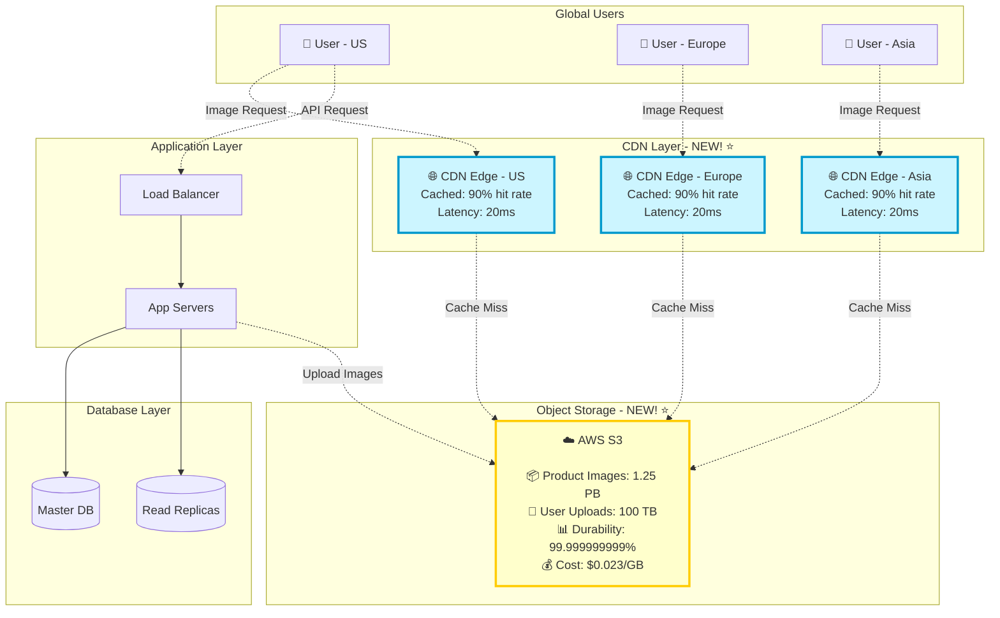
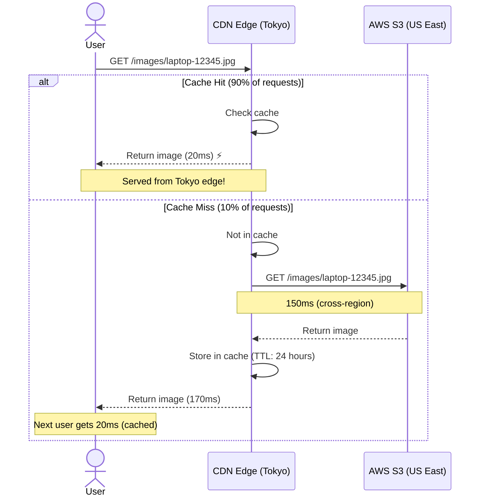

# Step 5: Adding CDN & Object Storage

## Overview

**Problem:** Product images are served from application servers, causing:
- ❌ **High bandwidth cost**: 5.3 GB/sec × $0.12/GB = $17,000/day
- ❌ **Slow for global users**: Tokyo user → US server = 200ms latency
- ❌ **App server overload**: Images consume 90% of bandwidth

**Solution:** CDN (Content Delivery Network) + S3 Object Storage

**Analogy:** Like having local stores (edge servers) worldwide instead of shipping everything from one warehouse (origin server).

---

## Architecture Diagram



---

## CDN Flow



**Latency Comparison:**
```
Without CDN (serve from origin):
User (Tokyo) → US Server: 200ms

With CDN:
User (Tokyo) → Tokyo Edge (cache hit): 20ms ⚡ (10x faster)
User (Tokyo) → Tokyo Edge (cache miss) → S3: 170ms
Average (90% hit): 0.9 × 20ms + 0.1 × 170ms = 35ms

Improvement: 200ms → 35ms (5.7x faster!)
```

---

## Object Storage (S3) Strategy

### What to Store in S3?

**1. Product Images**
```
Size: 1.25 PB (500M products × 5 images × 500 KB)
Access pattern: 90% read, 10% write
Cost: 1.25 PB × $0.023/GB = $28,750/month

Storage classes:
- S3 Standard: Recently uploaded (hot data) - 300 TB
- S3 Intelligent-Tiering: Auto-optimize (warm data) - 700 TB
- S3 Glacier: Old products (cold data) - 250 TB

Lifecycle policy:
- 0-30 days: S3 Standard
- 30-90 days: Intelligent-Tiering
- 90+ days: Glacier (reduce cost by 70%)
```

**2. User Uploads**
```
Size: 100 TB (profile pics, review images)
Access pattern: Mostly write, occasional read
Cost: 100 TB × $0.023/GB = $2,300/month
```

**3. Static Assets**
```
Size: 10 TB (CSS, JS, fonts, icons)
Access pattern: 99% read, rarely updated
Cost: 10 TB × $0.023/GB = $230/month
CDN cache hit: 99% (almost never hits S3)
```

### S3 Bucket Organization

```
amazonshop-images/
├── products/
│   ├── 2025/
│   │   ├── 01/  (January)
│   │   │   ├── 12345-main.jpg
│   │   │   ├── 12345-thumb.jpg
│   │   │   └── 12346-main.jpg
│   │   └── 02/  (February)
│   └── 2024/
├── users/
│   ├── profiles/
│   │   └── 1001/avatar.jpg
│   └── reviews/
│       └── 50001/review-image.jpg
└── static/
    ├── css/
    ├── js/
    └── fonts/
```

### Image Upload Flow

```javascript
// Backend API: Generate presigned URL
async function getUploadUrl(productId, imageType) {
  const s3 = new AWS.S3();
  const key = `products/${new Date().getFullYear()}/${productId}-${imageType}.jpg`;

  const presignedUrl = s3.getSignedUrl('putObject', {
    Bucket: 'amazonshop-images',
    Key: key,
    Expires: 3600,  // URL valid for 1 hour
    ContentType: 'image/jpeg'
  });

  return { uploadUrl: presignedUrl, imageUrl: `https://cdn.amazonshop.com/${key}` };
}

// Frontend: Direct upload to S3
async function uploadProductImage(file) {
  // 1. Get presigned URL from backend
  const { uploadUrl, imageUrl } = await fetch('/api/v1/images/upload-url').then(r => r.json());

  // 2. Upload directly to S3 (doesn't go through app server!)
  await fetch(uploadUrl, {
    method: 'PUT',
    body: file,
    headers: { 'Content-Type': 'image/jpeg' }
  });

  // 3. Save image URL to database
  await fetch('/api/v1/products/12345', {
    method: 'PUT',
    body: JSON.stringify({ imageUrl })
  });

  return imageUrl;
}
```

**Benefits:**
- ✅ **No app server load** (direct upload to S3)
- ✅ **Faster uploads** (no proxy through server)
- ✅ **Secure** (presigned URL expires in 1 hour)

---

## CDN Configuration

### CloudFront Setup

```javascript
// CloudFront distribution config
{
  "Origins": [
    {
      "Id": "S3-amazonshop-images",
      "DomainName": "amazonshop-images.s3.amazonaws.com",
      "S3OriginConfig": {
        "OriginAccessIdentity": "origin-access-identity/cloudfront/E1234567890"
      }
    }
  ],
  "DefaultCacheBehavior": {
    "TargetOriginId": "S3-amazonshop-images",
    "ViewerProtocolPolicy": "redirect-to-https",
    "CachePolicyId": "658327ea-f89d-4fab-a63d-7e88639e58f6",  // CachingOptimized
    "Compress": true,
    "AllowedMethods": ["GET", "HEAD", "OPTIONS"]
  },
  "CacheBehaviors": [
    {
      "PathPattern": "/products/*",
      "TargetOriginId": "S3-amazonshop-images",
      "TTL": {
        "MinTTL": 86400,      // 1 day
        "MaxTTL": 31536000,   // 1 year
        "DefaultTTL": 86400
      }
    }
  ]
}
```

### Cache Invalidation

```javascript
// When product image is updated
async function updateProductImage(productId, newImageUrl) {
  // 1. Upload new image to S3
  await uploadToS3(newImageUrl);

  // 2. Invalidate CDN cache
  const cloudfront = new AWS.CloudFront();
  await cloudfront.createInvalidation({
    DistributionId: 'E1234567890',
    InvalidationBatch: {
      Paths: {
        Quantity: 1,
        Items: [`/products/*/${productId}-*`]
      },
      CallerReference: Date.now().toString()
    }
  });

  // 3. Update database
  await db.query('UPDATE products SET image_url = $1 WHERE product_id = $2', [newImageUrl, productId]);
}
```

---

## Performance & Cost Analysis

### Bandwidth Cost Reduction

**Without CDN:**
```
Traffic: 5.3 GB/sec peak
Bandwidth cost (origin): $0.12/GB
Daily cost: 5.3 × 86400 × $0.12 = $54,950/day
Monthly cost: $1.65 million 💸
```

**With CDN (90% cache hit):**
```
Origin traffic: 5.3 GB/sec × 10% = 530 MB/sec
Origin bandwidth cost: 530 MB/sec × 86400 × $0.12 = $5,495/day

CDN traffic: 5.3 GB/sec × 90% = 4.77 GB/sec
CDN bandwidth cost: $0.02/GB (cheaper!)
CDN daily cost: 4.77 × 86400 × $0.02 = $8,236/day

Total monthly cost:
Origin: $5,495 × 30 = $164,850
CDN: $8,236 × 30 = $247,080
Total: $412,000/month

Savings: $1.65M - $412K = $1.24 million/month! 💰 (75% reduction)
```

### Latency Improvement

```
Image load time (before):
- US users: 100ms
- Europe users: 150ms
- Asia users: 200ms
Average: 150ms

Image load time (after CDN):
- US users: 20ms (edge cache)
- Europe users: 20ms (edge cache)
- Asia users: 20ms (edge cache)
Average: 20ms

Improvement: 150ms → 20ms (7.5x faster!)
```

---

## Summary

### Components Added ✅
1. **CDN (CloudFront)**: 200+ edge locations worldwide
2. **S3 Object Storage**: 1.35 PB total storage
3. **Lifecycle Policies**: Auto-move to cheaper storage
4. **Direct Upload**: Presigned URLs for client-side upload

### Improvements ✅
- ✅ **7.5x faster image loading** (150ms → 20ms)
- ✅ **75% cost reduction** ($1.65M → $412K/month)
- ✅ **90% cache hit rate** (reduce origin load)
- ✅ **Global performance** (20ms worldwide)

### Next: Step 6 - Microservices

Breaking the monolith into:
- Product Service
- Order Service
- Payment Service
- User Service
- Recommendation Service (AI/ML)

---

**Previous**: [05_step4_add_message_queue.md](./05_step4_add_message_queue.md)
**Next**: [07_step6_microservices_final.md](./07_step6_microservices_final.md)
