# Step 6: Microservices Architecture (Final Design)

## Overview

**Why Microservices?**

Our monolith application has grown and we're facing:
- ❌ **Tight coupling**: Payment bug can crash entire system
- ❌ **Scaling inefficiency**: Must scale entire app even if only orders need more capacity
- ❌ **Deployment risk**: One code change requires redeploying everything
- ❌ **Team bottlenecks**: 50 developers working on one codebase

**Solution:** Break into independent microservices

**Analogy:** Like a restaurant separating into specialized stations (pizza station, salad station, drinks station) instead of one person doing everything.

---

## Final Complete Architecture

```mermaid
graph TB
    subgraph "Client Layer"
        Web[🌐 Web Browser]
        Mobile[📱 Mobile App]
    end

    subgraph "CDN Layer"
        CDN[☁️ CloudFront CDN<br/>Images, Static Assets]
    end

    subgraph "API Gateway Layer"
        Gateway[🚪 API Gateway<br/><br/>🔐 Authentication<br/>⚡ Rate Limiting<br/>🔄 Load Balancing<br/>📝 Logging]
    end

    subgraph "Microservices Layer"
        ProductSvc[📦 Product Service<br/>Browse, Search]
        OrderSvc[📝 Order Service<br/>Cart, Checkout]
        PaymentSvc[💳 Payment Service<br/>Process Payments]
        UserSvc[👤 User Service<br/>Auth, Profile]
        InventorySvc[📊 Inventory Service<br/>Stock Management]
        RecommendSvc[🤖 Recommendation Service<br/>AI/ML Recommendations]
    end

    subgraph "Data Layer"
        ProductDB[(📦 Product DB<br/>PostgreSQL)]
        OrderDB[(📝 Order DB<br/>PostgreSQL)]
        UserDB[(👤 User DB<br/>PostgreSQL)]
        InventoryDB[(📊 Inventory DB<br/>PostgreSQL)]
        RecommendDB[(🤖 ML Models<br/>Redis + S3)]
    end

    subgraph "Caching Layer"
        Redis[🔴 Redis Cluster]
    end

    subgraph "Message Queue"
        RabbitMQ[📬 RabbitMQ]
        Kafka[📊 Kafka<br/>Event Streaming]
    end

    subgraph "Object Storage"
        S3[☁️ S3<br/>Images, Files]
    end

    Web --> CDN
    Web --> Gateway
    Mobile --> Gateway

    Gateway --> ProductSvc
    Gateway --> OrderSvc
    Gateway --> PaymentSvc
    Gateway --> UserSvc

    ProductSvc --> ProductDB
    ProductSvc --> Redis
    OrderSvc --> OrderDB
    OrderSvc --> RabbitMQ
    PaymentSvc --> OrderDB
    UserSvc --> UserDB

    OrderSvc -.Events.-> Kafka
    ProductSvc -.Events.-> Kafka
    Kafka --> RecommendSvc
    RecommendSvc --> RecommendDB

    OrderSvc -.Async Tasks.-> RabbitMQ
    RabbitMQ -.Email, SMS.-> OrderSvc

    ProductSvc -.Images.-> S3
    CDN -.Cache.-> S3

    style Gateway fill:#ff9999,stroke:#cc0000,stroke-width:3px
    style ProductSvc fill:#99ccff
    style OrderSvc fill:#99ccff
    style PaymentSvc fill:#99ccff
    style UserSvc fill:#99ccff
    style InventorySvc fill:#99ccff
    style RecommendSvc fill:#99ccff
```



---

## Service Breakdown

### 1. Product Service 📦

**Responsibilities:**
- Product catalog management
- Product search (Elasticsearch integration)
- Category management
- Product reviews and ratings

**Database:** PostgreSQL (10 TB)
```sql
-- Products table (500M rows)
CREATE TABLE products (
    product_id BIGSERIAL PRIMARY KEY,
    name VARCHAR(500),
    description TEXT,
    price DECIMAL(10,2),
    category_id INT,
    seller_id BIGINT,
    rating DECIMAL(3,2),
    created_at TIMESTAMP
);

-- Full-text search index
CREATE INDEX idx_product_search ON products USING GIN(to_tsvector('english', name || ' ' || description));
```

**API Endpoints:**
```
GET    /api/v1/products              - List products
GET    /api/v1/products/{id}         - Get product details
POST   /api/v1/products              - Create product (sellers)
PUT    /api/v1/products/{id}         - Update product
GET    /api/v1/products/search?q=... - Search products
POST   /api/v1/products/{id}/reviews - Add review
```

**Scaling:**
- **Read replicas**: 3 (distribute search queries)
- **Cache hit rate**: 85% (popular products in Redis)
- **Elasticsearch**: For advanced search (filters, facets)

---

### 2. Order Service 📝

**Responsibilities:**
- Shopping cart management
- Order placement
- Order tracking
- Order history

**Database:** PostgreSQL (30 TB)
```sql
-- Orders table (partitioned by date)
CREATE TABLE orders (
    order_id BIGSERIAL PRIMARY KEY,
    user_id BIGINT,
    total_amount DECIMAL(10,2),
    status VARCHAR(50),  -- PENDING, PAID, SHIPPED, DELIVERED
    created_at TIMESTAMP
) PARTITION BY RANGE (created_at);

-- Partition by month for efficient queries
CREATE TABLE orders_2025_01 PARTITION OF orders FOR VALUES FROM ('2025-01-01') TO ('2025-02-01');
```

**API Endpoints:**
```
POST   /api/v1/cart/add              - Add to cart
GET    /api/v1/cart                  - Get cart
POST   /api/v1/orders                - Place order
GET    /api/v1/orders/{id}           - Get order details
GET    /api/v1/orders/user/{userId}  - Get user's orders
PUT    /api/v1/orders/{id}/status    - Update order status
```

**Event Publishing:**
```javascript
// When order is placed
async function placeOrder(userId, items, total) {
  // 1. Create order in database
  const order = await db.query('INSERT INTO orders ...');

  // 2. Publish event to Kafka (for analytics, recommendations)
  await kafka.publish('order.placed', {
    orderId: order.id,
    userId,
    items,
    total,
    timestamp: Date.now()
  });

  // 3. Publish tasks to RabbitMQ (for async processing)
  await rabbitmq.publish('email.order.confirmation', { orderId: order.id });
  await rabbitmq.publish('inventory.update', { items });

  return order;
}
```

---

### 3. Payment Service 💳

**Responsibilities:**
- Payment processing (Stripe, PayPal integration)
- Refund processing
- Payment verification
- PCI DSS compliance

**Database:** PostgreSQL (5 TB)
```sql
-- Payments table
CREATE TABLE payments (
    payment_id BIGSERIAL PRIMARY KEY,
    order_id BIGINT REFERENCES orders(order_id),
    amount DECIMAL(10,2),
    payment_method VARCHAR(50),  -- CARD, UPI, PAYPAL
    status VARCHAR(50),           -- PENDING, SUCCESS, FAILED
    transaction_id VARCHAR(255),  -- External payment ID
    created_at TIMESTAMP
);

-- Never store raw card numbers! Use tokenization
CREATE TABLE payment_methods (
    method_id BIGSERIAL PRIMARY KEY,
    user_id BIGINT,
    type VARCHAR(50),
    token VARCHAR(255),           -- Tokenized card (from Stripe)
    last_four VARCHAR(4),         -- Last 4 digits (display only)
    expires_at DATE
);
```

**API Endpoints:**
```
POST   /api/v1/payments/process      - Process payment
GET    /api/v1/payments/{id}         - Get payment status
POST   /api/v1/payments/refund       - Refund payment
POST   /api/v1/payments/methods      - Add payment method (tokenized)
```

**Idempotency:**
```javascript
// Prevent duplicate charges
async function processPayment(orderId, amount, idempotencyKey) {
  // Check if payment already processed
  const existing = await db.query('SELECT * FROM payments WHERE idempotency_key = $1', [idempotencyKey]);
  if (existing.rows.length > 0) {
    return existing.rows[0];  // Return existing payment (don't charge again!)
  }

  // Process payment
  const charge = await stripe.charges.create({
    amount: amount * 100,  // Stripe uses cents
    currency: 'usd',
    source: paymentToken,
    idempotency_key: idempotencyKey
  });

  // Save payment
  await db.query('INSERT INTO payments (order_id, amount, transaction_id, idempotency_key) VALUES ($1, $2, $3, $4)',
    [orderId, amount, charge.id, idempotencyKey]);

  return charge;
}
```

---

### 4. User Service 👤

**Responsibilities:**
- User registration and authentication (JWT)
- Profile management
- Address management
- Session management

**Database:** PostgreSQL (1 TB)
```sql
-- Users table
CREATE TABLE users (
    user_id BIGSERIAL PRIMARY KEY,
    email VARCHAR(255) UNIQUE,
    password_hash VARCHAR(255),
    name VARCHAR(255),
    phone VARCHAR(20),
    created_at TIMESTAMP
);

-- Addresses table
CREATE TABLE addresses (
    address_id BIGSERIAL PRIMARY KEY,
    user_id BIGINT REFERENCES users(user_id),
    address_line1 VARCHAR(500),
    city VARCHAR(100),
    state VARCHAR(100),
    zip_code VARCHAR(20),
    is_default BOOLEAN DEFAULT FALSE
);
```

**API Endpoints:**
```
POST   /api/v1/auth/register         - Register user
POST   /api/v1/auth/login            - Login (returns JWT)
POST   /api/v1/auth/logout           - Logout
GET    /api/v1/users/{id}            - Get user profile
PUT    /api/v1/users/{id}            - Update profile
POST   /api/v1/users/{id}/addresses  - Add address
```

**JWT Authentication:**
```javascript
// Login flow
async function login(email, password) {
  // 1. Verify credentials
  const user = await db.query('SELECT * FROM users WHERE email = $1', [email]);
  const valid = await bcrypt.compare(password, user.password_hash);
  if (!valid) throw new Error('Invalid credentials');

  // 2. Generate JWT token
  const token = jwt.sign(
    { userId: user.user_id, email: user.email, role: user.role },
    process.env.JWT_SECRET,
    { expiresIn: '15m' }  // Short-lived token
  );

  // 3. Store session in Redis
  await redis.setex(`session:${user.user_id}`, 900, JSON.stringify(user));

  return { token, user };
}
```

---

### 5. Recommendation Service 🤖 (AI/ML)

**Responsibilities:**
- Personalized product recommendations
- Similar products ("customers who bought this also bought")
- Trending products
- Real-time recommendations

**Tech Stack:**
- **Model Training**: Python (scikit-learn, TensorFlow)
- **Model Serving**: TensorFlow Serving / TorchServe
- **Feature Store**: Redis (user features, product features)
- **Model Storage**: S3

**How it works:**
```
1. Batch Training (nightly):
   - Collect user behavior data (clicks, purchases, searches)
   - Train collaborative filtering model
   - Save model to S3

2. Real-time Inference:
   - User views product page
   - Load user features from Redis
   - Call model API: GET /recommend?userId=1001&productId=12345
   - Return top 10 recommendations

3. Features:
   - User: age, location, purchase history, browsing history
   - Product: category, price, rating, popularity
   - Context: time of day, device type
```

**API Endpoints:**
```
GET    /api/v1/recommend/user/{userId}                    - Personalized recommendations
GET    /api/v1/recommend/similar/{productId}              - Similar products
GET    /api/v1/recommend/trending?category={category}     - Trending products
```

**ML Model (simplified):**
```python
# Collaborative filtering using matrix factorization
from sklearn.decomposition import NMF

# User-product interaction matrix
# Rows: users, Columns: products, Values: ratings
interaction_matrix = load_user_product_interactions()

# Train model
model = NMF(n_components=50, init='random', random_state=0)
user_factors = model.fit_transform(interaction_matrix)
product_factors = model.components_

# Get recommendations for user
def get_recommendations(user_id, top_n=10):
    user_vector = user_factors[user_id]
    scores = np.dot(user_vector, product_factors)  # Predicted ratings
    top_products = np.argsort(scores)[::-1][:top_n]
    return top_products
```

---

## Inter-Service Communication

### 1. Synchronous (REST API) - For Critical Path

```javascript
// Order Service calls Payment Service
async function processOrderPayment(orderId, amount, paymentMethod) {
  // HTTP call to Payment Service
  const response = await fetch('http://payment-service:3000/api/v1/payments/process', {
    method: 'POST',
    headers: { 'Content-Type': 'application/json' },
    body: JSON.stringify({
      orderId,
      amount,
      paymentMethod,
      idempotencyKey: `order-${orderId}`
    })
  });

  if (!response.ok) {
    throw new Error('Payment failed');
  }

  return response.json();
}
```

**When to use:**
- ✅ Critical path operations (order → payment)
- ✅ Need immediate response
- ✅ Strong consistency required

---

### 2. Asynchronous (Message Queue) - For Background Tasks

```javascript
// Order Service publishes event
async function placeOrder(userId, items, total) {
  const order = await createOrderInDB(userId, items, total);

  // Publish event to RabbitMQ (fire and forget)
  await rabbitmq.publish('order.placed', {
    orderId: order.id,
    userId,
    items
  });

  return order;
}

// Email Service consumes event
rabbitmq.subscribe('order.placed', async (event) => {
  await sendOrderConfirmationEmail(event.orderId);
});
```

**When to use:**
- ✅ Background tasks (email, notifications)
- ✅ Eventual consistency acceptable
- ✅ Decouple services

---

### 3. Event Streaming (Kafka) - For Analytics

```javascript
// All services publish events to Kafka
await kafka.publish('product.viewed', { userId, productId, timestamp });
await kafka.publish('product.purchased', { userId, productId, price, timestamp });

// Analytics Service consumes all events
kafka.subscribe('product.*', async (event) => {
  await updateAnalytics(event);
  await updateRecommendations(event);
});
```

**When to use:**
- ✅ Real-time analytics
- ✅ Multiple consumers need same data
- ✅ Event replay needed

---

## Service Discovery & Load Balancing

**Challenge:** How does Order Service find Payment Service?

**Solution:** Service mesh (Istio) or Consul

```yaml
# Kubernetes service definition
apiVersion: v1
kind: Service
metadata:
  name: payment-service
spec:
  selector:
    app: payment
  ports:
  - port: 3000
    targetPort: 3000
  type: ClusterIP

# Other services call: http://payment-service:3000/api/v1/payments
```

---

## Comparison: Monolith vs Microservices

| Factor | Monolith (Before) | Microservices (After) |
|--------|-------------------|----------------------|
| **Deployment** | Deploy entire app | Deploy individual services |
| **Scaling** | Scale entire app | Scale services independently |
| **Technology** | One stack (Node.js) | Polyglot (Node.js, Python, Go) |
| **Team Structure** | One team | Team per service |
| **Failure Impact** | Entire system down | One service down |
| **Complexity** | ✅ Simple | ⚠️ Complex (distributed) |
| **Development Speed** | ✅ Fast (initially) | ⚠️ Slower (coordination) |
| **Scalability** | ⚠️ Limited | ✅ Unlimited |
| **Best For** | Startups, MVPs | Large scale, multiple teams |

---

## Summary

### Services Created ✅
1. **Product Service**: Catalog, search (10 TB DB)
2. **Order Service**: Cart, orders (30 TB DB)
3. **Payment Service**: Payments, refunds (5 TB DB)
4. **User Service**: Auth, profiles (1 TB DB)
5. **Inventory Service**: Stock management
6. **Recommendation Service**: AI/ML recommendations

### Benefits ✅
- ✅ **Independent scaling** (scale orders during flash sales)
- ✅ **Fault isolation** (payment down doesn't affect browsing)
- ✅ **Technology flexibility** (Python for ML, Go for performance)
- ✅ **Team autonomy** (each team owns a service)

### Trade-offs ⚠️
- ⚠️ **Increased complexity** (distributed systems, networking)
- ⚠️ **Data consistency challenges** (eventual consistency)
- ⚠️ **More operational overhead** (monitor 6 services vs 1)

---

**Previous**: [06_step5_add_cdn_storage.md](./06_step5_add_cdn_storage.md)
**Next**: [08_api_design.md](./08_api_design.md)
