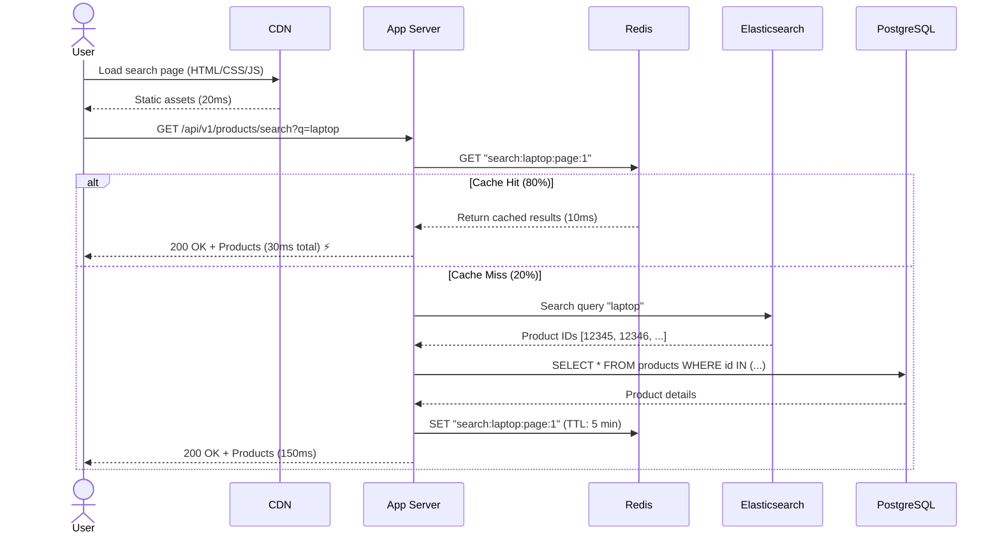
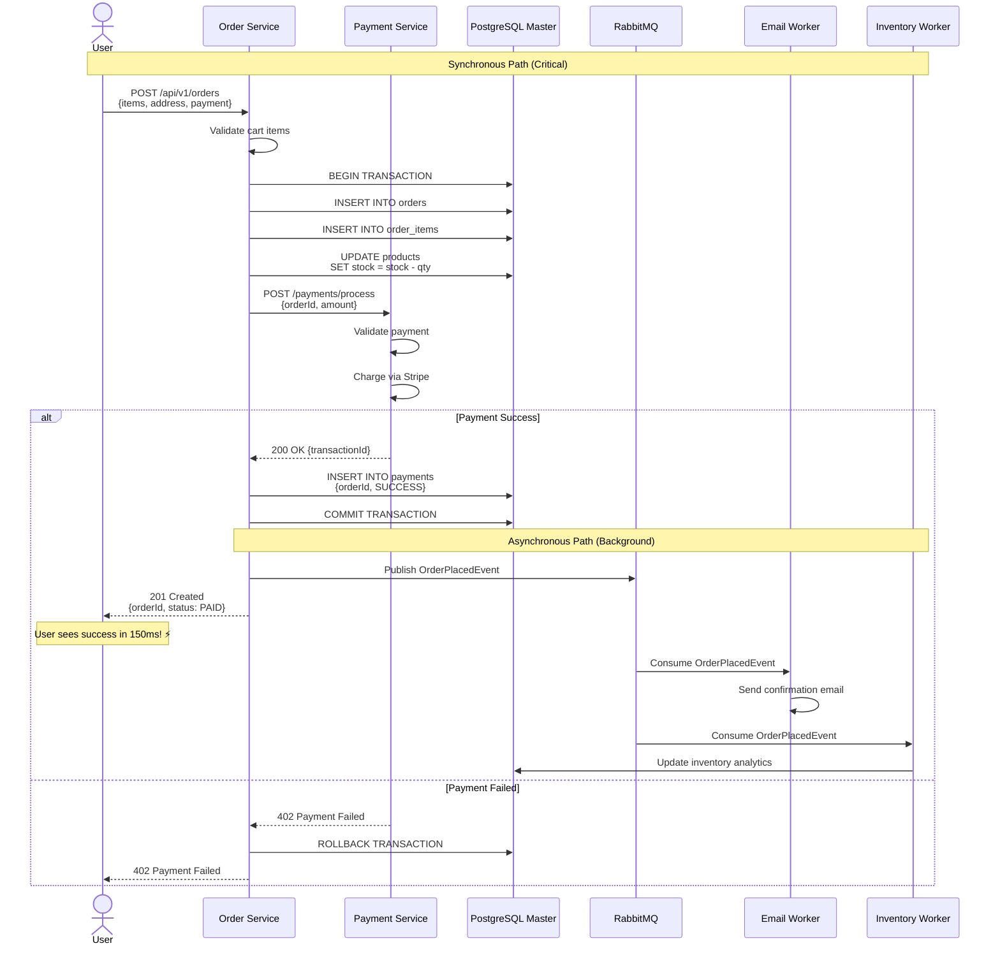
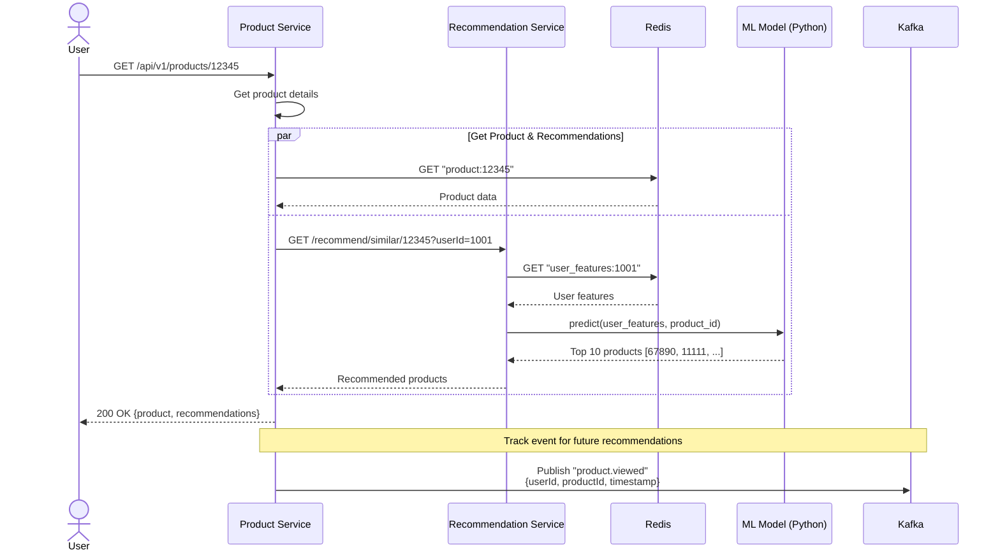
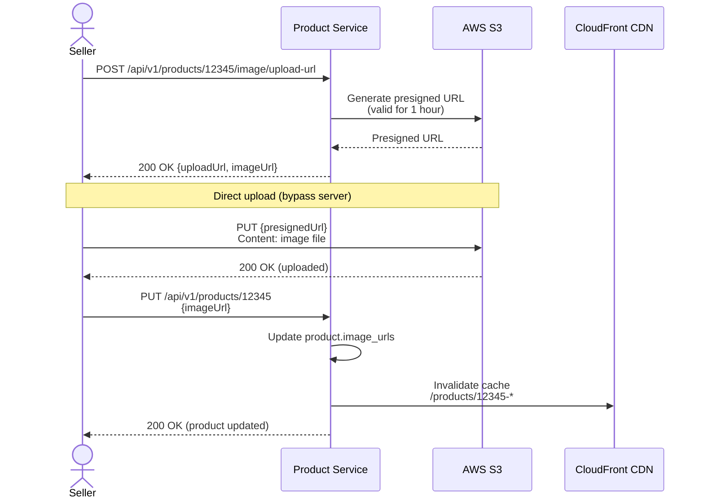
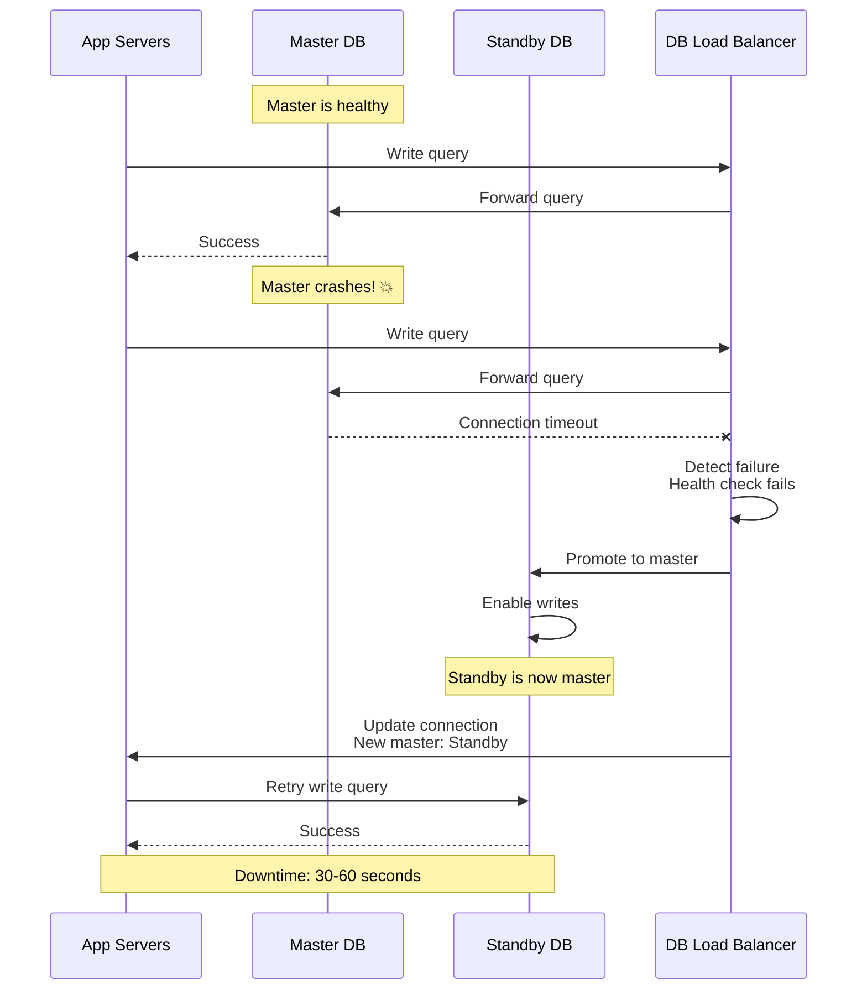
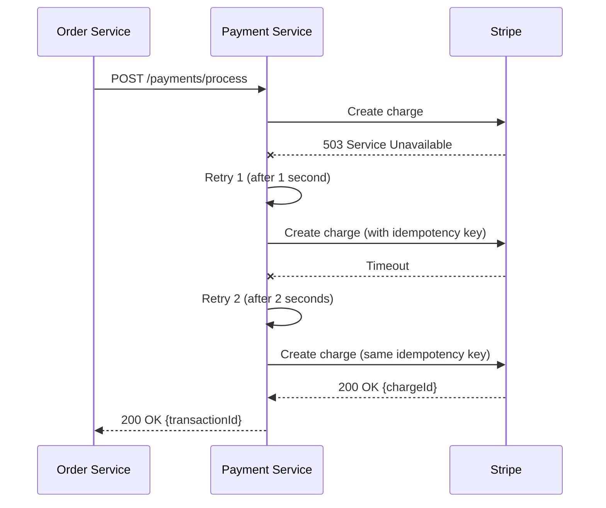

# Data Flow Diagrams

## Critical Flows

### 1. Product Search Flow

**Time Breakdown:**
- Cache hit: 30ms (80% of requests)
- Cache miss: 150ms (20% of requests)
- Average: 0.8 × 30 + 0.2 × 150 = 54ms ✅

---

### 2. Complete Checkout Flow

**Timeline:**
- T0: User clicks "Place Order"
- T50: Order inserted in database
- T100: Payment processed via Stripe
- T150: User sees "Order placed!" ⚡
- T2000: Email sent (background)
- T3000: SMS sent (background)

---

### 3. Product Recommendation Flow

---

### 4. Image Upload Flow

**Benefits:**
- ✅ No server bandwidth used (direct to S3)
- ✅ Faster upload (no proxy)
- ✅ Scalable (S3 handles load)

---

## Failure Scenarios

### 1. Database Failover

### 2. Payment Service Retry

**Idempotency ensures:**
- ✅ User is never charged twice
- ✅ Retries are safe
- ✅ Same result for same request

---

**Previous**: [09_database_design.md](./09_database_design.md)
**Next**: [11_scalability_reliability.md](./11_scalability_reliability.md)
