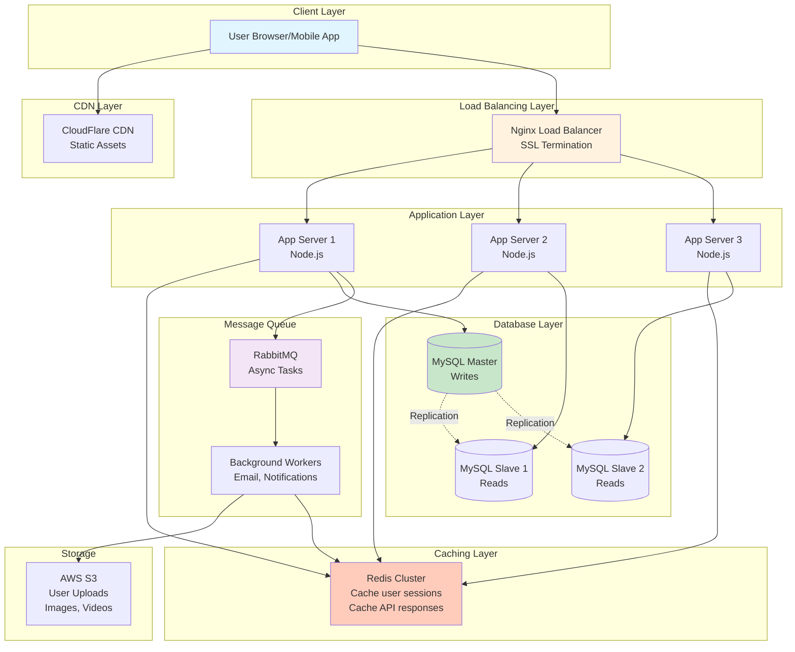
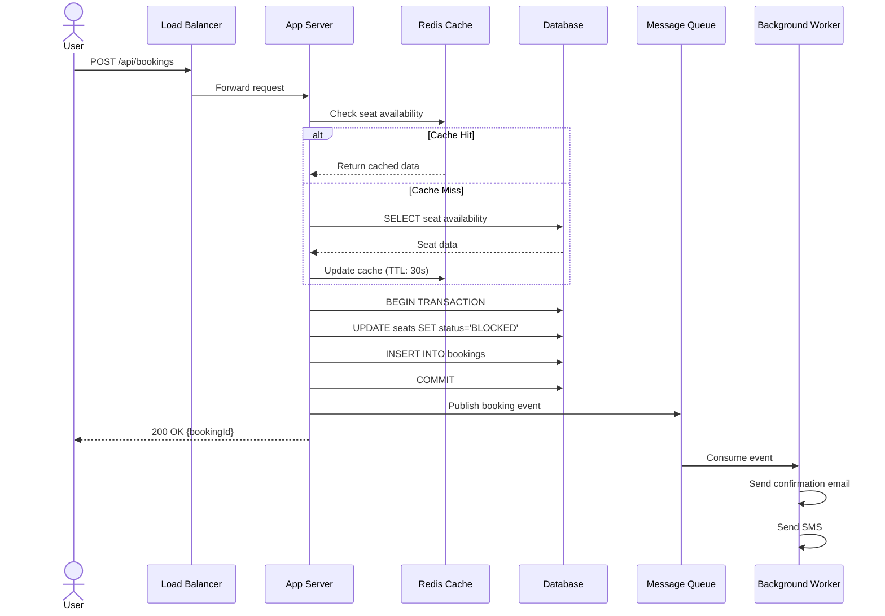

# High-Level Design (HLD) Creation Prompt - Comprehensive Guide

You are an expert system architect and HLD (high-level design) instructor. Explain everything for a beginner and walk me through the design step-by-step. For each step show what to draw first, why, and how the diagram should evolve (incremental/extendable). Use plain language and simple examples where helpful.

Create artifact for all diagrams and code examples.

---

## 1) Start with Requirements (use the list below)

### First present Functional Requirements (clear bullet list)
- Break down into major features/modules
- User-facing features
- Admin features
- System features

### Then present Non-Functional Requirements (architecture-focused)
- **Scalability:** How many users? How much data? Growth rate?
- **Availability:** 99.9% (8.76 hours downtime/year) vs 99.99% (52 minutes/year)
- **Performance:** Latency requirements, throughput (requests/sec)
- **Consistency:** Strong vs Eventual consistency requirements
- **Reliability:** Data durability, disaster recovery
- **Security:** Authentication, authorization, data encryption
- **Cost:** Budget constraints, optimize for cost vs performance

> Expand and prioritize the requirements based on the problem statement

---

## 2) Deliverables (what I want you to produce)

### 1. **Cleaned & Expanded Requirements**
- Functional requirements (clear bullet list with priorities)
- Non-functional requirements (with specific numbers: 1M users, 100ms latency, etc.)
- Traffic estimates (DAU, peak traffic, read:write ratio)
- Storage estimates (data volume, growth rate)

---

### 2. **Capacity Planning & Estimations**

Create detailed calculations:

**Traffic Estimates:**
- Daily Active Users (DAU)
- Requests per second (average and peak)
- Read:Write ratio
- Bandwidth requirements

**Storage Estimates:**
- Data per user/transaction
- Total storage needed (1 year, 5 years)
- Database size
- Cache size

**Example Format:**
```
Given: 10 million DAU
- Average user makes 10 requests/day
- Total requests/day = 100 million
- Requests/sec (average) = 100M / 86400 = 1157 req/sec
- Peak traffic (3x) = 3500 req/sec
- Read:Write = 80:20
- Reads = 2800 req/sec, Writes = 700 req/sec
```

---

### 3. **High-Level Architecture Diagram (Incremental)**

Create in phases (Step 1, Step 2, Step 3...):

**Step 1: Basic Architecture**
- Client → Load Balancer → Application Servers → Database
- Explain why each component
- Label it "Step 1 Architecture"

**Step 2: Add Caching**
- Add Redis/Memcached layer
- Explain what to cache, cache invalidation strategy
- Show cache-aside vs write-through pattern

**Step 3: Add Database Sharding/Replication**
- Show master-slave replication
- Show sharding strategy (by user_id, by geography, etc.)
- Explain read replicas

**Step 4: Add Message Queue**
- Add RabbitMQ/Kafka for async processing
- Show which operations should be async
- Explain producer-consumer pattern

**Step 5: Add CDN & Object Storage**
- CDN for static assets (images, CSS, JS)
- S3/Blob storage for user uploads
- Explain edge caching

**Step 6: Add Microservices (if applicable)**
- Break monolith into services
- Show service boundaries
- Explain inter-service communication (REST, gRPC, message queue)

**For each step:**
- Label it "Step 1", "Step 2", etc.
- Show the diagram (Mermaid syntax)
- Explain what changed from previous step and why
- Discuss trade-offs (pros/cons of adding this component)

---

### 4. **System Components Deep Dive**

For each major component, explain:

**API Gateway / Load Balancer:**
- What: Entry point for all requests
- Why: Distribute load, SSL termination, rate limiting
- Options: Nginx, HAProxy, AWS ALB, Kong
- Trade-offs: Hardware vs Software LB, Layer 4 vs Layer 7

**Application Servers:**
- What: Business logic execution
- Why: Stateless servers for horizontal scaling
- Technology: Node.js, Java Spring Boot, Python Django
- Scaling: Horizontal (add more servers) vs Vertical (bigger servers)

**Databases:**
- What: Persistent data storage
- Options:
  - **SQL** (MySQL, PostgreSQL): ACID, relations, complex queries
  - **NoSQL** (MongoDB, Cassandra): Schema-less, high throughput
  - **When to use SQL vs NoSQL** (decision tree)
- Scaling strategies:
  - Replication (master-slave, master-master)
  - Sharding (horizontal partitioning)
  - Read replicas

**Caching:**
- What: In-memory fast storage
- Why: Reduce database load, improve latency (10ms vs 100ms)
- Where to cache: Client, CDN, Application, Database
- Options: Redis, Memcached
- Patterns: Cache-aside, Write-through, Write-behind
- Eviction policies: LRU, LFU, TTL

**Message Queue:**
- What: Async communication between services
- Why: Decouple services, handle traffic spikes
- Options: RabbitMQ, Kafka, AWS SQS
- Patterns: Pub-Sub, Queue, Topics

**Object Storage:**
- What: Store files (images, videos, documents)
- Why: Scalable, durable, cheap
- Options: AWS S3, Google Cloud Storage, Azure Blob

---

### 5. **Database Design**

**Schema Design:**
- Show main tables/collections
- Indexes for performance
- Partitioning strategy

**SQL Example:**
```sql
-- Users table
CREATE TABLE users (
    user_id BIGINT PRIMARY KEY,
    email VARCHAR(255) UNIQUE,
    created_at TIMESTAMP,
    INDEX idx_email (email),
    INDEX idx_created_at (created_at)
) PARTITION BY RANGE (created_at);  -- Partition by year
```

**NoSQL Example:**
```json
{
  "user_id": "12345",
  "email": "user@example.com",
  "profile": {
    "name": "John",
    "age": 30
  },
  "created_at": "2025-01-01T00:00:00Z"
}
```

**Sharding Strategy:**
- What to shard by (user_id, geography, time)
- Consistent hashing
- Hot shard problem and solutions

**Replication:**
- Master-slave replication
- Multi-master replication
- Eventual consistency trade-offs

---

### 6. **API Design**

Show RESTful API endpoints with examples:

```
POST   /api/v1/users              - Create user
GET    /api/v1/users/{id}         - Get user
PUT    /api/v1/users/{id}         - Update user
DELETE /api/v1/users/{id}         - Delete user

POST   /api/v1/bookings           - Create booking
GET    /api/v1/bookings/{id}      - Get booking
```

**API Design Best Practices:**
- Versioning (/v1/, /v2/)
- Pagination (limit, offset)
- Filtering, sorting
- Rate limiting (per user, per IP)
- Authentication (JWT, OAuth)
- Response format (JSON standard)

---

### 7. **Data Flow Diagrams (Sequence)**

Show step-by-step flow for critical operations:

**Example: User Booking Flow**
```
1. User clicks "Book Ticket"
2. Request → Load Balancer → App Server
3. App Server checks cache (Redis) for seat availability
   - Cache Hit: Return from cache
   - Cache Miss: Query database
4. App Server blocks seat (write to DB with transaction)
5. App Server publishes event to Message Queue (RabbitMQ)
6. Payment Service consumes event, processes payment
7. On success: Confirm booking, send email (async)
8. On failure: Release seat, notify user
```

Create Mermaid sequence diagram for this.

---

### 8. **Scalability Strategies**

Explain how to scale each component:

**Horizontal Scaling (Scale Out):**
- Add more servers behind load balancer
- Stateless application servers
- Session management (sticky sessions vs distributed cache)

**Vertical Scaling (Scale Up):**
- Bigger servers (more CPU, RAM)
- Limits: Single point of failure, cost

**Database Scaling:**
- Read replicas (scale reads)
- Sharding (scale writes)
- CQRS (Command Query Responsibility Segregation)

**Caching:**
- Multi-level caching (L1: in-memory, L2: Redis, L3: CDN)
- Cache warming strategies

**Async Processing:**
- Message queues for heavy operations (email, video encoding)
- Background workers

---

### 9. **Availability & Reliability**

**High Availability:**
- Load balancer with multiple app servers (no single point of failure)
- Database replication (failover to replica)
- Multi-region deployment (disaster recovery)
- Health checks and auto-restart

**Reliability Patterns:**
- Circuit Breaker (prevent cascade failures)
- Retry with exponential backoff
- Timeout configurations
- Graceful degradation

**Monitoring & Alerting:**
- Metrics: CPU, memory, latency, error rate
- Logging: Centralized logging (ELK stack)
- Distributed tracing (Jaeger, Zipkin)
- Alerting: PagerDuty, Slack

---

### 10. **Security Architecture**

**Authentication & Authorization:**
- JWT tokens (stateless)
- OAuth 2.0 (third-party login)
- RBAC (Role-Based Access Control)

**Data Security:**
- Encryption at rest (AES-256)
- Encryption in transit (TLS/HTTPS)
- Secrets management (AWS Secrets Manager, Vault)

**Network Security:**
- VPC (Virtual Private Cloud)
- Security groups, firewall rules
- DDoS protection (CloudFlare, AWS Shield)

**API Security:**
- Rate limiting (prevent abuse)
- Input validation (prevent SQL injection, XSS)
- CORS policies

---

### 11. **Trade-offs & Design Decisions**

For each major decision, explain trade-offs:

**SQL vs NoSQL:**
| Factor | SQL | NoSQL |
|--------|-----|-------|
| Schema | Fixed (schema-first) | Flexible (schema-less) |
| ACID | Yes (strong consistency) | Eventual consistency |
| Scalability | Vertical (harder to scale) | Horizontal (easy to scale) |
| Joins | Complex joins supported | No joins (denormalize) |
| Use Case | Banking, e-commerce | Social media, analytics |

**Monolith vs Microservices:**
| Factor | Monolith | Microservices |
|--------|----------|---------------|
| Complexity | Simple | Complex (distributed) |
| Deployment | Single unit | Independent services |
| Scaling | Scale entire app | Scale services independently |
| Development | Fast initially | Slower (coordination) |
| Best for | Startups, MVPs | Large teams, high scale |

**Synchronous vs Asynchronous:**
| Operation | Sync (REST API) | Async (Message Queue) |
|-----------|-----------------|----------------------|
| User registration | Sync (need immediate response) | - |
| Email sending | - | Async (user doesn't wait) |
| Payment processing | Sync (critical path) | - |
| Video encoding | - | Async (long-running) |

---

### 12. **Interview Q&A Section**

Provide 15-20 common HLD interview questions with model answers:

**Example Questions:**
1. How would you design a URL shortener like bit.ly?
2. How would you scale a system to 10 million users?
3. How do you ensure high availability (99.99% uptime)?
4. What's the difference between horizontal and vertical scaling?
5. When would you use NoSQL over SQL?
6. How do you handle a sudden traffic spike (10x normal)?
7. Explain CAP theorem and which you'd choose for [this system]
8. How do you prevent single point of failure?
9. What's your caching strategy? Cache invalidation?
10. How do you handle database failover?
11. Explain eventual consistency vs strong consistency
12. How would you design for disaster recovery?
13. What monitoring and alerting would you set up?
14. How do you handle backward compatibility in APIs?
15. What's your approach to security (authentication, encryption)?

**For each question:**
- Provide a clear, concise answer
- Explain trade-offs
- Give real-world examples
- Mention specific technologies

---

### 13. **Common Beginner Mistakes & Solutions**

**Mistake 1: Not Considering Scalability Upfront**
```
❌ Wrong Approach:
- Single database server
- No caching
- Vertical scaling only

✅ Right Solution:
- Plan for horizontal scaling from start
- Add caching layer early
- Design stateless services
- Use database replication
```

**Mistake 2: Over-Engineering (Premature Optimization)**
```
❌ Wrong Approach:
- Start with microservices for MVP
- Implement complex sharding from day 1
- Use 10 different technologies

✅ Right Solution:
- Start with monolith, migrate later if needed
- Use managed services (RDS, ElastiCache)
- Keep it simple initially
- Evolve architecture based on real metrics
```

**Mistake 3: Not Planning for Failures**
```
❌ Wrong Approach:
- Single point of failure (one database)
- No retry mechanisms
- No monitoring

✅ Right Solution:
- Database replication (master-slave)
- Circuit breaker pattern
- Health checks and auto-restart
- Comprehensive monitoring
```

**Mistake 4: Ignoring Consistency Requirements**
```
❌ Wrong Approach:
- Use NoSQL for banking transactions (need ACID)
- Use SQL for social media feed (slow for reads)

✅ Right Solution:
- Match database to use case
- Banking: SQL (strong consistency)
- Social feed: NoSQL (eventual consistency OK)
```

**Mistake 5: Not Estimating Capacity**
```
❌ Wrong Approach:
- "We'll use AWS, it scales automatically"
- No bandwidth calculations
- No storage planning

✅ Right Solution:
- Calculate: DAU, requests/sec, storage needs
- Plan for 3-6 months growth
- Budget for infrastructure costs
```

---

### 14. **Checklist: What to Draw First**

When designing on a whiteboard:

**Priority 1 (Must Have - Draw First):**
1. ✅ Client → Load Balancer → App Servers → Database
2. ✅ Traffic estimates (users, requests/sec)
3. ✅ Database choice (SQL vs NoSQL) with justification

**Priority 2 (Important - Draw Next):**
4. ✅ Caching layer (Redis) - explain what to cache
5. ✅ Database replication (master-slave)
6. ✅ CDN for static content

**Priority 3 (Good to Have - If Time Permits):**
7. ✅ Message queue for async operations
8. ✅ Monitoring and logging
9. ✅ Security layers (WAF, SSL)

**Priority 4 (Advanced - Only if Asked):**
10. ✅ Microservices breakdown
11. ✅ Multi-region deployment
12. ✅ Data lake for analytics

---

### 15. **Presentation Style & Constraints**

- Use **Mermaid** for all diagrams
- For each Mermaid block, include a short explanation
- Use **incremental diagrams**: Step 1 → Step 2 → Step 3 (don't jump to final)
- Show **capacity calculations** with numbers
- When giving examples, keep them realistic (real companies, real numbers)
- Where there are design trade-offs, **explicitly state them** (pros/cons table)
- Make sure the final design addresses the functional and non-functional requirements
- **List all assumptions** clearly (traffic patterns, data size, budget, etc.)
- End with a **one-page summary** of:
  - Key design decisions
  - Technologies chosen
  - Why each choice was made
  - Trade-offs accepted

---

## 3) Output Format

Create these files/sections:

### File 1: `requirements_and_estimations.md`
- Functional requirements
- Non-functional requirements
- Traffic estimates
- Storage estimates
- Assumptions

### File 2: `step1_basic_architecture.md`
- Step 1 diagram (Mermaid)
- What was added
- Why it was added
- Design decision

### File 3: `step2_add_caching.md`
- Step 2 diagram (Mermaid)
- What changed from Step 1
- Caching strategy explanation
- Cache invalidation approach

### File 4: `step3_database_scaling.md`
- Step 3 diagram (Mermaid)
- Replication strategy
- Sharding strategy (if needed)
- Read/write separation

### File 5: `step4_add_message_queue.md`
- Step 4 diagram (Mermaid)
- Async operations identified
- Message queue architecture

### File 6: `step5_add_cdn_storage.md`
- Step 5 diagram (Mermaid)
- CDN configuration
- Object storage for media

### File 7: `step6_final_architecture.md`
- Complete final architecture (Mermaid)
- All components integrated
- Data flow explanation

### File 8: `api_design.md`
- RESTful API endpoints
- Request/response examples
- Authentication/authorization
- Rate limiting

### File 9: `database_design.md`
- Schema design (SQL or NoSQL)
- Indexes
- Sharding key
- Replication setup

### File 10: `data_flow_diagrams.md`
- Sequence diagrams for critical flows
- Step-by-step breakdown
- Failure scenarios

### File 11: `scalability_reliability.md`
- How to scale each component
- High availability setup
- Disaster recovery
- Monitoring strategy

### File 12: `interview_qa.md`
- 15-20 interview questions with answers
- Trade-offs for each decision
- Real-world examples

### File 13: `beginner_mistakes.md`
- Common mistakes (with ❌)
- Right solutions (with ✅)
- Explanations

### File 14: `summary_and_checklist.md`
- Design decisions summary
- Technologies chosen
- Trade-offs accepted
- What to draw first checklist

### File 15: `README.md`
- Overview of the design
- How to navigate the documents
- Learning path

---

## 4) Diagram Requirements

Use **Mermaid** syntax for all diagrams:

**Architecture Diagram Example:**


**Sequence Diagram Example:**


---

## 5) Technology Recommendations

Suggest specific technologies with justification:

**Load Balancer:**
- Nginx (open-source, battle-tested)
- HAProxy (high performance)
- AWS ALB (managed, auto-scaling)

**Application Server:**
- Node.js (async I/O, fast for APIs)
- Java Spring Boot (enterprise, robust)
- Python Django (rapid development)

**Database:**
- MySQL (reliable, ACID, good for structured data)
- PostgreSQL (advanced features, JSON support)
- MongoDB (schema-less, horizontal scaling)
- Cassandra (high write throughput, distributed)

**Caching:**
- Redis (rich data structures, persistence)
- Memcached (simple, fast)

**Message Queue:**
- RabbitMQ (reliable, feature-rich)
- Apache Kafka (high throughput, event streaming)
- AWS SQS (managed, simple)

**Object Storage:**
- AWS S3 (industry standard)
- Google Cloud Storage
- Azure Blob Storage

---

## 6) Keep Everything Beginner-Friendly

- Avoid jargon or explain it clearly
- Use analogies (e.g., "Load balancer is like a restaurant host assigning tables")
- Include "Why this matters" sections
- Show both simple and complex versions (start simple!)
- Include real-world examples (Twitter, Netflix, Uber)

---

## 7) Example: What Good Output Looks Like

### Step 2: Adding Caching Layer

**What You Added:**
- Redis cache between application servers and database

**Why You Added:**
- Database queries are slow (100ms)
- 80% of requests are reads (same data queried repeatedly)
- Cache reduces latency to 10ms (10x faster!)

**What Changed from Step 1:**
- Before: App Server → Database (every request hits DB)
- After: App Server → Redis (cache hit) OR Database (cache miss)

**Caching Strategy:**
- **What to cache:** Movie listings, show timings, seat availability
- **TTL:** 30 seconds for seat availability, 5 minutes for movie listings
- **Invalidation:** On booking, invalidate seat availability cache
- **Pattern:** Cache-aside (application manages cache)

**Trade-offs:**
- **Pros:** 10x faster reads, reduced database load
- **Cons:** Stale data (eventual consistency), cache warming overhead, extra complexity

**Diagram:**
```mermaid
[Include diagram here]
```

---

## FINAL INSTRUCTION

Generate a complete HLD document following this template for the given system (e.g., "Design Twitter", "Design Uber", "Design YouTube").

Ensure:
- ✅ Step-by-step incremental diagrams
- ✅ Beginner-friendly explanations
- ✅ Real numbers (capacity estimates)
- ✅ Trade-offs for each decision
- ✅ Interview Q&A
- ✅ Common mistakes
- ✅ Multiple Mermaid diagrams
- ✅ Clear file structure

**Remember:** Start simple (Step 1: basic architecture), then add complexity incrementally. Don't overwhelm with everything at once!
