# Step 1: Basic Architecture - Foundation Layer

## 🎯 What We're Building in This Step

In this first step, we're creating the **simplest possible job scheduler** that works. Think of this as building the skeleton before adding muscles!

**Goal:** A system where users can submit jobs, and workers execute them.

---

## 📊 Architecture Diagram - Step 1

```mermaid
graph TB
    subgraph "Client Layer"
        Client[👤 User/Application<br/>Web UI or API Client]
    end

    subgraph "API Layer"
        API[🌐 API Gateway<br/>REST API<br/>Port: 8080]
    end

    subgraph "Scheduler Layer"
        Scheduler[⏰ Job Scheduler<br/>Scans for pending jobs<br/>Assigns to workers]
    end

    subgraph "Worker Layer"
        Worker1[⚙️ Worker Node 1<br/>Executes jobs]
        Worker2[⚙️ Worker Node 2<br/>Executes jobs]
        Worker3[⚙️ Worker Node 3<br/>Executes jobs]
    end

    subgraph "Database Layer"
        DB[(🗄️ PostgreSQL Database<br/>Jobs Table<br/>Executions Table)]
    end

    Client -->|1. Submit Job| API
    Client -->|2. Check Status| API
    API -->|3. Save Job| DB
    Scheduler -->|4. Poll for Jobs| DB
    Scheduler -->|5. Assign Job| Worker1
    Scheduler -->|5. Assign Job| Worker2
    Scheduler -->|5. Assign Job| Worker3
    Worker1 -->|6. Update Status| DB
    Worker2 -->|6. Update Status| DB
    Worker3 -->|6. Update Status| DB

    style Client fill:#e1f5ff,stroke:#01579b,stroke-width:2px
    style API fill:#fff3e0,stroke:#e65100,stroke-width:2px
    style Scheduler fill:#f3e5f5,stroke:#4a148c,stroke-width:2px
    style Worker1 fill:#e8f5e9,stroke:#1b5e20,stroke-width:2px
    style Worker2 fill:#e8f5e9,stroke:#1b5e20,stroke-width:2px
    style Worker3 fill:#e8f5e9,stroke:#1b5e20,stroke-width:2px
    style DB fill:#ffebee,stroke:#b71c1c,stroke-width:2px
```



---

## 🧩 Components Breakdown

### 1. Client Layer (Blue 🔵)

**What it is:**
- User interface (web dashboard, mobile app) or API client (curl, Postman)
- Where users interact with the scheduler

**What it does:**
- Submit new jobs: "Send email report every day at 9 AM"
- Cancel jobs: "Stop sending those reports"
- Check status: "Did my job run successfully?"

**Example interaction:**
```bash
# Submit a job via API
curl -X POST http://scheduler.com/api/jobs \
  -H "Content-Type: application/json" \
  -d '{
    "name": "daily_report",
    "schedule": "0 9 * * *",
    "type": "http_request",
    "payload": {
      "url": "https://myapp.com/send-report",
      "method": "POST"
    }
  }'
```

---

### 2. API Gateway (Orange 🟠)

**What it is:**
- Single entry point for all requests
- RESTful API server (e.g., Node.js with Express, Python with Flask, Java Spring Boot)

**What it does:**
- **Authentication:** Verify user identity (JWT tokens, API keys)
- **Validation:** Check if job data is correct (valid cron syntax, required fields)
- **Rate Limiting:** Prevent abuse (max 100 requests/minute per user)
- **Routing:** Forward requests to appropriate services

**Why we need it:**
- Without API Gateway, every component needs its own authentication logic ❌
- Centralized place to enforce security and rate limits ✅

**Technology choices:**
- **Node.js + Express:** Fast, async I/O, good for APIs
- **Nginx:** Lightweight, can handle SSL termination
- **Kong/AWS API Gateway:** Enterprise-grade with built-in rate limiting

**Example endpoints:**
```
POST   /api/v1/jobs          - Create a new job
GET    /api/v1/jobs/:id      - Get job details
DELETE /api/v1/jobs/:id      - Cancel/delete a job
GET    /api/v1/jobs/:id/logs - Get execution logs
POST   /api/v1/jobs/:id/pause - Pause a recurring job
```

---

### 3. Scheduler (Purple 💜)

**What it is:**
- The "brain" of the system
- Continuously checks which jobs need to run and assigns them to workers

**What it does:**
1. **Poll Database:** Every 5 seconds, scan for jobs where `next_run_time <= NOW()`
2. **Select Jobs:** Pick jobs that are due to run
3. **Assign to Workers:** Send jobs to available worker nodes
4. **Update Database:** Mark job as `RUNNING` to prevent duplicate execution

**Analogy:**
Think of the scheduler as a **restaurant manager**:
- Checks incoming orders (jobs)
- Assigns orders to chefs (workers)
- Makes sure each order is handled only once

**Pseudocode:**
```python
while True:
    # Poll database every 5 seconds
    pending_jobs = db.query("SELECT * FROM jobs WHERE next_run_time <= NOW() AND status = 'PENDING'")

    for job in pending_jobs:
        # Assign to a worker (simple round-robin for now)
        worker = get_next_available_worker()

        # Update job status to prevent duplicate execution
        db.update(f"UPDATE jobs SET status = 'RUNNING' WHERE job_id = {job.id}")

        # Send job to worker
        worker.execute(job)

    sleep(5)  # Wait 5 seconds before next poll
```

**Why polling?**
- **Simple to implement:** Just a loop with database queries
- **Works for MVP:** Good enough for 12 jobs/sec
- **Downside:** Not real-time (up to 5-second delay)

**Limitation:**
- At high scale (1000s of jobs/sec), polling every 5 seconds is inefficient
- We'll fix this in Step 2 with a message queue! 🚀

---

### 4. Worker Layer (Green 🟢)

**What it is:**
- Servers that actually execute the jobs
- Can run HTTP requests, scripts, database queries, etc.

**What it does:**
1. **Receive Job:** Scheduler sends job details
2. **Execute Job:** Run the actual task (call API, run script, send email)
3. **Update Status:** Report success/failure back to database

**Worker types:**
- **HTTP Worker:** Makes HTTP/HTTPS requests
- **Script Worker:** Runs shell scripts, Python scripts
- **SQL Worker:** Executes database queries

**Example worker execution:**
```python
def execute_job(job):
    try:
        # Update status to RUNNING
        db.update(f"UPDATE executions SET status = 'RUNNING' WHERE execution_id = {job.execution_id}")

        if job.type == "http_request":
            response = requests.post(job.payload.url, json=job.payload.data)
            if response.status_code == 200:
                status = "COMPLETED"
            else:
                status = "FAILED"

        elif job.type == "script":
            result = subprocess.run(job.payload.script, shell=True, capture_output=True)
            if result.returncode == 0:
                status = "COMPLETED"
            else:
                status = "FAILED"

        # Update status to COMPLETED/FAILED
        db.update(f"UPDATE executions SET status = '{status}' WHERE execution_id = {job.execution_id}")

    except Exception as e:
        # Handle errors gracefully
        db.update(f"UPDATE executions SET status = 'FAILED', error = '{e}' WHERE execution_id = {job.execution_id}")
```

**Why multiple workers?**
- **Parallel execution:** 3 workers can run 3 jobs simultaneously
- **Fault tolerance:** If Worker 1 crashes, Worker 2 and 3 keep running
- **Scalability:** Add more workers as traffic grows

**Worker assignment strategy (simple round-robin):**
```
Job 1 → Worker 1
Job 2 → Worker 2
Job 3 → Worker 3
Job 4 → Worker 1 (cycle repeats)
```

---

### 5. Database Layer (Red 🔴)

**What it is:**
- Persistent storage for all job data
- PostgreSQL (relational database)

**Why PostgreSQL?**
- **ACID guarantees:** Jobs won't get lost or duplicated (critical!)
- **Transactions:** Can update job status atomically
- **SQL queries:** Easy to find jobs with `WHERE next_run_time <= NOW()`
- **Battle-tested:** Used by companies like Instagram, Spotify

**Database schema (simplified):**

#### Table 1: `jobs`
Stores job metadata

```sql
CREATE TABLE jobs (
    job_id BIGSERIAL PRIMARY KEY,
    user_id BIGINT NOT NULL,
    job_name VARCHAR(255) NOT NULL,
    job_type VARCHAR(50) NOT NULL,  -- 'http_request', 'script', 'sql_query'
    schedule VARCHAR(100),           -- Cron syntax: '0 9 * * *'
    payload JSONB,                   -- Job-specific data (URL, script path, etc.)
    status VARCHAR(20) DEFAULT 'PENDING',  -- PENDING, RUNNING, COMPLETED, FAILED, CANCELLED
    next_run_time TIMESTAMP,         -- When the job should run next
    created_at TIMESTAMP DEFAULT NOW(),
    updated_at TIMESTAMP DEFAULT NOW(),

    INDEX idx_next_run_time (next_run_time),  -- Fast lookup for scheduler polling
    INDEX idx_user_id (user_id),              -- Fast lookup for user's jobs
    INDEX idx_status (status)                  -- Fast lookup for pending jobs
);
```

**Example row:**
```
job_id: 12345
user_id: 789
job_name: "daily_sales_report"
job_type: "http_request"
schedule: "0 9 * * *"  (every day at 9 AM)
payload: {"url": "https://api.example.com/report", "method": "POST"}
status: "PENDING"
next_run_time: "2025-11-18 09:00:00"
```

#### Table 2: `executions`
Stores execution history (one row per execution)

```sql
CREATE TABLE executions (
    execution_id BIGSERIAL PRIMARY KEY,
    job_id BIGINT REFERENCES jobs(job_id),
    worker_id VARCHAR(100),          -- Which worker executed this
    status VARCHAR(20),              -- RUNNING, COMPLETED, FAILED
    start_time TIMESTAMP,
    end_time TIMESTAMP,
    duration_ms INT,                 -- Execution time in milliseconds
    error_message TEXT,              -- If failed, what went wrong?
    logs TEXT,                       -- stdout/stderr output

    INDEX idx_job_id (job_id),       -- Fast lookup for a job's execution history
    INDEX idx_start_time (start_time) -- Fast lookup for recent executions
);
```

**Example row:**
```
execution_id: 98765
job_id: 12345
worker_id: "worker-node-2"
status: "COMPLETED"
start_time: "2025-11-17 09:00:02"
end_time: "2025-11-17 09:00:08"
duration_ms: 6000  (6 seconds)
error_message: NULL
logs: "Report sent successfully"
```

---

## 🔄 Data Flow: How a Job Flows Through the System

Let's trace the journey of a job from submission to execution:

### Step-by-Step Flow

**1. User submits a job**
```
User → API Gateway: POST /api/jobs
{
  "name": "send_morning_email",
  "schedule": "0 8 * * *",  // Every day at 8 AM
  "type": "http_request",
  "payload": {"url": "https://mailer.com/send"}
}
```

**2. API Gateway validates and saves to database**
```
API Gateway → Database: INSERT INTO jobs VALUES (...)
Database returns: job_id = 12345
API Gateway → User: 201 Created { "job_id": 12345, "status": "PENDING" }
```

**3. Scheduler polls database (every 5 seconds)**
```
Scheduler → Database: SELECT * FROM jobs WHERE next_run_time <= NOW() AND status = 'PENDING'
Database returns: [job_id: 12345, next_run_time: "2025-11-18 08:00:00"]
```

**4. Scheduler assigns job to worker**
```
Scheduler → Database: UPDATE jobs SET status = 'RUNNING' WHERE job_id = 12345
Scheduler → Worker 1: Execute job_id 12345
```

**5. Worker executes job**
```
Worker 1 → Database: INSERT INTO executions (job_id, status, start_time) VALUES (12345, 'RUNNING', NOW())
Worker 1: Makes HTTP POST to https://mailer.com/send
Worker 1 → Database: UPDATE executions SET status = 'COMPLETED', end_time = NOW()
```

**6. User checks status**
```
User → API Gateway: GET /api/jobs/12345
API Gateway → Database: SELECT * FROM jobs WHERE job_id = 12345
Database returns: status = "COMPLETED"
API Gateway → User: 200 OK { "job_id": 12345, "status": "COMPLETED" }
```

---

## ⚖️ Design Decisions & Trade-offs

### Decision 1: Why PostgreSQL (SQL) instead of MongoDB (NoSQL)?

| Factor | PostgreSQL (Our Choice ✅) | MongoDB |
|--------|---------------------------|---------|
| **ACID Transactions** | Yes - Critical for job status updates | Limited - Eventual consistency |
| **Queries** | Easy: `WHERE next_run_time <= NOW()` | Harder - No JOIN support |
| **Consistency** | Strong - Job won't be executed twice | Eventual - Risk of duplicates |
| **Scalability** | Vertical (harder to scale) | Horizontal (easier to scale) |
| **Best for** | Transactional systems, job schedulers | Social media, analytics |

**Why we chose PostgreSQL:**
- **Correctness > Scalability** (at this stage)
- We CANNOT afford duplicate job executions (e.g., sending same email twice)
- ACID guarantees ensure atomic status updates
- At 12 jobs/sec, PostgreSQL can handle the load easily

**When to switch to NoSQL:**
- If we reach 10,000+ jobs/sec (need horizontal scaling)
- If job duplication is acceptable (idempotent jobs)

---

### Decision 2: Polling vs Event-Driven

**Current approach: Polling** (Scheduler checks database every 5 seconds)

**Pros:**
- ✅ Simple to implement (just a loop!)
- ✅ No extra dependencies (no message queue needed yet)
- ✅ Works fine for low traffic (12 jobs/sec)

**Cons:**
- ❌ Not real-time (up to 5-second delay)
- ❌ Wastes CPU (polling even when no jobs)
- ❌ Inefficient at high scale

**Alternative: Event-Driven** (We'll implement in Step 2!)
- When job is created → Immediately publish to message queue
- Workers subscribe to queue → No polling needed
- Real-time execution (0-second delay)

**Why we start with polling:**
- **Premature optimization is the root of all evil!** - Donald Knuth
- Start simple, optimize when you measure performance bottlenecks

---

### Decision 3: Single Scheduler (Not Distributed Yet)

**Current:** 1 scheduler node

**Pros:**
- ✅ Simple - No coordination logic
- ✅ No race conditions (only one scheduler assigning jobs)
- ✅ Enough for 12 jobs/sec

**Cons:**
- ❌ **Single Point of Failure (SPOF)** - If scheduler crashes, no jobs run!
- ❌ Cannot scale beyond 1 CPU core

**Fix in Step 3:**
- Add multiple scheduler nodes with leader election (Zookeeper/etcd)
- High availability - If leader dies, standby becomes leader

---

## 🚨 Limitations of Step 1 Architecture

Let's be honest about what's missing:

| Problem | Impact | Fix Coming In |
|---------|--------|---------------|
| **Single Point of Failure** | Scheduler crash = system down | Step 5 (HA) |
| **Duplicate Execution** | Network glitch could run job twice | Step 3 (Distributed Lock) |
| **Polling Inefficiency** | Wastes CPU, 5-second delay | Step 2 (Message Queue) |
| **No Worker Load Balancing** | Round-robin doesn't consider worker load | Step 2 (Smart Queue) |
| **Database Bottleneck** | All reads/writes hit one database | Step 5 (Replication) |
| **No Monitoring** | Can't see system health | Step 4 (Monitoring) |

**But that's okay!** 🎉

This is an **MVP (Minimum Viable Product)**. It works, it's simple, and we can iterate!

---

## 📈 Capacity Check: Can This Handle Our Load?

From our requirements (01_requirements_and_estimations.md):
- Average: 12 jobs/sec
- Peak: 36 jobs/sec
- Workers: 800 nodes

**Can this architecture handle it?**

**Scheduler:**
- Polling every 5 seconds
- Each poll: `SELECT * FROM jobs WHERE next_run_time <= NOW()`
- If 36 jobs/sec arrive, in 5 seconds: 36 × 5 = 180 jobs pending
- Can scheduler process 180 jobs in <5 seconds? **YES** ✅

**Database:**
- PostgreSQL can handle 1,000s of writes/sec
- Our load: 36 writes/sec + 6 reads/sec = 42 queries/sec
- **Easy** ✅

**Workers:**
- 800 workers, each running 10 concurrent jobs = 8,000 concurrent jobs
- Peak load: 612 concurrent jobs (from calculations)
- Utilization: 612 / 8,000 = **7.6%** (underutilized, but good for spikes!)

**Verdict:** This architecture can handle our initial scale! 🎊

---

## 🎓 Beginner Tips

### Tip 1: Start Simple, Iterate Later
Don't build microservices on day 1. This monolithic scheduler is **perfect for MVP**!

### Tip 2: Database Indexes Are Critical
Without `INDEX idx_next_run_time (next_run_time)`, the scheduler query would be SLOW!

**Query without index:**
```sql
SELECT * FROM jobs WHERE next_run_time <= NOW();
-- Scans entire table (1 million rows) = 5 seconds ❌
```

**Query with index:**
```sql
SELECT * FROM jobs WHERE next_run_time <= NOW();
-- Uses index (only scans matching rows) = 10 milliseconds ✅
```

### Tip 3: Always Consider Failure Scenarios
- What if scheduler crashes mid-assignment?
- What if worker dies while executing a job?
- We'll address these in Step 5 (Fault Tolerance)!

---

## ✅ What We Achieved in Step 1

✅ Users can submit jobs via API
✅ Jobs are stored in PostgreSQL
✅ Scheduler polls and assigns jobs to workers
✅ Workers execute jobs and update status
✅ System can handle 12 jobs/sec (our initial scale)
✅ **It works!** 🎉

---

## 🚀 Next Steps

**Proceed to Step 2:**
- Add **Message Queue (Kafka/RabbitMQ)** for real-time job distribution
- Eliminate polling inefficiency
- Improve worker load balancing

**Stay tuned!** 🚀

