# Step 4: Monitoring, Observability & Database Design

## 🎯 What We're Adding in This Step

**Current gap:**
- System is running, but we're **blind**! 😵
- How do we know if scheduler is healthy?
- How many jobs failed today?
- Is the database slow?

**Solution in Step 4:**
- Add **Monitoring** (Prometheus for metrics)
- Add **Visualization** (Grafana dashboards)
- Add **Logging** (ELK stack for centralized logs)
- Add **Alerting** (PagerDuty/Slack for critical issues)
- Design **Database Schema** in detail

---

## 📊 Architecture Diagram - Step 4

```mermaid
graph TB
    subgraph "Client Layer"
        Client[👤 User]
    end

    subgraph "API & Monitoring"
        API[🌐 API Gateway]
        Metrics[📊 Metrics Exporter<br/>Exposes /metrics endpoint]
    end

    subgraph "Coordination"
        ZK[🔒 Zookeeper]
    end

    subgraph "Schedulers"
        Sched1[⏰ Scheduler 1 LEADER]
        Sched2[⏰ Scheduler 2]
    end

    subgraph "Message Queue"
        Queue[📨 RabbitMQ]
    end

    subgraph "Workers"
        Worker1[⚙️ Worker 1]
        Worker2[⚙️ Worker 2]
    end

    subgraph "Database"
        DBMaster[(🗄️ PostgreSQL Master)]
        DBSlave1[(🗄️ PostgreSQL Slave 1)]
    end

    subgraph "Monitoring Stack"
        Prometheus[📈 Prometheus<br/>Metrics storage & queries]
        Grafana[📊 Grafana<br/>Dashboards & visualization]
        AlertManager[🚨 AlertManager<br/>Alerts routing]
    end

    subgraph "Logging Stack"
        Fluentd[📝 Fluentd<br/>Log collector]
        Elasticsearch[🔍 Elasticsearch<br/>Log storage & search]
        Kibana[📋 Kibana<br/>Log visualization]
    end

    subgraph "Alerting"
        PagerDuty[📞 PagerDuty]
        Slack[💬 Slack]
    end

    Client --> API
    API --> DBMaster

    API --> Metrics
    Sched1 --> Metrics
    Worker1 --> Metrics
    Worker2 --> Metrics

    Metrics --> Prometheus
    Prometheus --> Grafana
    Prometheus --> AlertManager

    AlertManager --> PagerDuty
    AlertManager --> Slack

    API -.logs.-> Fluentd
    Sched1 -.logs.-> Fluentd
    Worker1 -.logs.-> Fluentd
    Worker2 -.logs.-> Fluentd

    Fluentd --> Elasticsearch
    Elasticsearch --> Kibana

    Sched1 --> ZK
    Sched1 --> DBSlave1
    Sched1 --> Queue

    Worker1 --> Queue
    Worker2 --> Queue
    Worker1 --> DBMaster
    Worker2 --> DBMaster

    DBMaster -.replication.-> DBSlave1

    style Prometheus fill:#ffe0b2,stroke:#e65100,stroke-width:3px
    style Grafana fill:#b2dfdb,stroke:#00695c,stroke-width:2px
    style AlertManager fill:#ffccbc,stroke:#bf360c,stroke-width:2px
    style Elasticsearch fill:#e1bee7,stroke:#4a148c,stroke-width:2px
    style Kibana fill:#f3e5f5,stroke:#6a1b9a,stroke-width:2px
    style Fluentd fill:#c5e1a5,stroke:#33691e,stroke-width:2px
```



---

## 🧩 Monitoring Components

### 1. Prometheus (Metrics Storage) 📈

**What it is:**
- Time-series database for metrics
- Scrapes metrics from all services every 15 seconds

**Key metrics we'll track:**

**Scheduler metrics:**
```
# Jobs processed per second
scheduler_jobs_processed_total{status="success"}
scheduler_jobs_processed_total{status="failed"}

# Scheduler lag (how far behind are we?)
scheduler_lag_seconds

# Lock acquisition time
scheduler_lock_acquisition_duration_seconds
```

**Worker metrics:**
```
# Jobs executed per worker
worker_jobs_executed_total{worker_id="worker-1"}

# Job execution duration
worker_job_duration_seconds

# Worker health
worker_heartbeat_timestamp
```

**Queue metrics:**
```
# Queue depth
queue_depth{queue="pending_jobs"}
queue_depth{queue="dead_letter_queue"}

# Message age (oldest message in queue)
queue_oldest_message_age_seconds
```

**Database metrics:**
```
# Connection pool usage
db_connection_pool_active
db_connection_pool_idle

# Query duration
db_query_duration_seconds{query="select_pending_jobs"}

# Row counts
db_table_rows{table="jobs"}
db_table_rows{table="executions"}
```

**Example Prometheus query:**
```promql
# Jobs per second (average over 5 minutes)
rate(scheduler_jobs_processed_total[5m])

# 95th percentile job execution time
histogram_quantile(0.95, worker_job_duration_seconds)

# Queue depth over time
queue_depth{queue="pending_jobs"}
```

---

### 2. Grafana (Visualization) 📊

**What it is:**
- Dashboard tool that queries Prometheus and displays beautiful graphs

**Dashboard 1: System Overview**
```
┌─────────────────────────────────────────────┐
│  Job Scheduler - System Overview            │
├─────────────────────────────────────────────┤
│ ┌─────────────┐ ┌─────────────┐ ┌─────────┐│
│ │Jobs/sec     │ │Success Rate │ │Avg Lat  ││
│ │   612       │ │   99.2%     │ │ 450ms   ││
│ └─────────────┘ └─────────────┘ └─────────┘│
│                                              │
│ Jobs Executed (Last 24h)                    │
│ 📈 [Line graph showing jobs over time]      │
│                                              │
│ Worker Health                                │
│ Worker 1: ✅ Healthy (120 jobs/hour)        │
│ Worker 2: ✅ Healthy (115 jobs/hour)        │
│ Worker 3: ⚠️  Slow (50 jobs/hour)           │
│                                              │
│ Queue Depth                                  │
│ 📊 [Graph showing queue growing/shrinking]  │
└─────────────────────────────────────────────┘
```

**Dashboard 2: Job Execution Details**
- Job success vs failure rates
- Average execution time per job type
- Retry counts
- DLQ size

---

### 3. AlertManager (Alerting) 🚨

**Alert rules (Prometheus alerts):**

**Alert 1: Queue Depth High**
```yaml
- alert: QueueDepthHigh
  expr: queue_depth{queue="pending_jobs"} > 10000
  for: 5m
  labels:
    severity: warning
  annotations:
    summary: "Queue depth is {{ $value }}, workers may be overloaded"
    description: "Pending jobs queue has {{ $value }} jobs waiting"
```

**Alert 2: Job Failure Rate High**
```yaml
- alert: HighJobFailureRate
  expr: |
    rate(scheduler_jobs_processed_total{status="failed"}[5m]) /
    rate(scheduler_jobs_processed_total[5m]) > 0.1
  for: 5m
  labels:
    severity: critical
  annotations:
    summary: "Job failure rate is {{ $value | humanizePercentage }}"
```

**Alert 3: Scheduler Down**
```yaml
- alert: SchedulerDown
  expr: up{job="scheduler"} == 0
  for: 1m
  labels:
    severity: critical
  annotations:
    summary: "Scheduler is down! No jobs being scheduled."
```

**Alert 4: Worker Down**
```yaml
- alert: WorkerDown
  expr: count(up{job="worker"} == 1) < 500
  for: 5m
  labels:
    severity: warning
  annotations:
    summary: "Only {{ $value }} workers are healthy (expected 800)"
```

---

## 📝 Logging Components

### 1. Fluentd (Log Collection)

**What it is:**
- Collects logs from all services
- Sends to Elasticsearch

**Log format (structured JSON):**
```json
{
  "timestamp": "2025-11-17T09:00:05Z",
  "service": "scheduler",
  "level": "INFO",
  "message": "Job scheduled",
  "job_id": 12345,
  "user_id": 789,
  "next_run_time": "2025-11-18 09:00:00",
  "request_id": "abc-def-ghi"
}
```

---

### 2. Elasticsearch (Log Storage)

**What it is:**
- Stores all logs in searchable format
- Indexed by timestamp, service, level, job_id, etc.

**Example search queries:**
```
# Find all errors in last hour
level:ERROR AND timestamp:[now-1h TO now]

# Find logs for specific job
job_id:12345

# Find slow queries
duration:>5000 AND service:database
```

---

### 3. Kibana (Log Visualization)

**What it is:**
- Web UI for searching and visualizing logs

**Example use cases:**
- Debugging failed job: Search `job_id:12345` to see all logs
- Finding patterns: "Why are jobs failing at 2 AM?"
- Auditing: "Who deleted job 999?"

---

## 🗄️ Database Schema Design (Deep Dive)

### Table 1: `jobs` (Job Metadata)

```sql
CREATE TABLE jobs (
    -- Primary key
    job_id BIGSERIAL PRIMARY KEY,

    -- Job ownership
    user_id BIGINT NOT NULL,
    team_id BIGINT,  -- For multi-tenancy

    -- Job details
    job_name VARCHAR(255) NOT NULL,
    job_type VARCHAR(50) NOT NULL,  -- 'http_request', 'script', 'sql_query'
    description TEXT,

    -- Scheduling
    schedule VARCHAR(100),  -- Cron syntax: '0 9 * * *' or 'immediate'
    timezone VARCHAR(50) DEFAULT 'UTC',  -- Support different timezones
    next_run_time TIMESTAMP,
    last_run_time TIMESTAMP,

    -- Job payload (flexible JSON)
    payload JSONB NOT NULL,  -- {url, method, headers, body, ...}

    -- Status tracking
    status VARCHAR(20) DEFAULT 'PENDING',
    -- Possible values: PENDING, QUEUED, RUNNING, COMPLETED, FAILED, CANCELLED, PAUSED

    -- Retry configuration
    retry_policy JSONB DEFAULT '{"max_retries": 3, "backoff_factor": 3}',

    -- Priority (for future feature)
    priority INT DEFAULT 0,  -- Higher number = higher priority

    -- Timestamps
    created_at TIMESTAMP DEFAULT NOW(),
    updated_at TIMESTAMP DEFAULT NOW(),
    deleted_at TIMESTAMP,  -- Soft delete

    -- Constraints
    CONSTRAINT valid_status CHECK (status IN (
        'PENDING', 'QUEUED', 'RUNNING', 'COMPLETED', 'FAILED', 'CANCELLED', 'PAUSED'
    ))
);

-- Indexes for fast queries
CREATE INDEX idx_jobs_next_run_time ON jobs(next_run_time) WHERE status = 'PENDING';
CREATE INDEX idx_jobs_user_id ON jobs(user_id);
CREATE INDEX idx_jobs_status ON jobs(status);
CREATE INDEX idx_jobs_created_at ON jobs(created_at DESC);

-- Partial index for active jobs only (most queries)
CREATE INDEX idx_jobs_active ON jobs(job_id, status, next_run_time)
  WHERE deleted_at IS NULL AND status NOT IN ('COMPLETED', 'CANCELLED');

-- GIN index for JSONB payload searches
CREATE INDEX idx_jobs_payload ON jobs USING GIN(payload);
```

**Example rows:**
```sql
-- One-time HTTP job
INSERT INTO jobs VALUES (
    12345,  -- job_id
    789,    -- user_id
    'send_welcome_email',  -- job_name
    'http_request',  -- job_type
    '0 9 * * *',  -- schedule (daily at 9 AM)
    'UTC',
    '2025-11-18 09:00:00',  -- next_run_time
    NULL,  -- last_run_time
    '{"url": "https://api.example.com/email", "method": "POST"}',  -- payload
    'PENDING',  -- status
    '{"max_retries": 3, "backoff_factor": 3}',
    0,  -- priority
    NOW(),
    NOW(),
    NULL
);
```

---

### Table 2: `executions` (Execution History)

```sql
CREATE TABLE executions (
    -- Primary key
    execution_id BIGSERIAL PRIMARY KEY,

    -- Foreign key to jobs table
    job_id BIGINT NOT NULL REFERENCES jobs(job_id) ON DELETE CASCADE,

    -- Execution details
    worker_id VARCHAR(100),  -- Which worker executed this
    status VARCHAR(20) NOT NULL,
    -- Possible values: QUEUED, RUNNING, COMPLETED, FAILED, TIMEOUT

    -- Timing
    scheduled_time TIMESTAMP,  -- When job was supposed to run
    start_time TIMESTAMP,
    end_time TIMESTAMP,
    duration_ms INT GENERATED ALWAYS AS (
        EXTRACT(EPOCH FROM (end_time - start_time)) * 1000
    ) STORED,

    -- Results
    exit_code INT,  -- For script execution
    error_message TEXT,
    logs TEXT,  -- stdout/stderr (up to 10 KB)

    -- Retry tracking
    attempt_number INT DEFAULT 1,

    -- Metadata
    created_at TIMESTAMP DEFAULT NOW(),

    CONSTRAINT valid_status CHECK (status IN (
        'QUEUED', 'RUNNING', 'COMPLETED', 'FAILED', 'TIMEOUT'
    ))
);

-- Indexes
CREATE INDEX idx_executions_job_id ON executions(job_id);
CREATE INDEX idx_executions_start_time ON executions(start_time DESC);
CREATE INDEX idx_executions_status ON executions(status);
CREATE INDEX idx_executions_worker_id ON executions(worker_id);

-- Composite index for common query: "recent executions for a job"
CREATE INDEX idx_executions_job_time ON executions(job_id, start_time DESC);
```

**Example query:**
```sql
-- Get last 10 executions for job 12345
SELECT execution_id, status, start_time, duration_ms, error_message
FROM executions
WHERE job_id = 12345
ORDER BY start_time DESC
LIMIT 10;
```

---

### Table 3: `audit_logs` (Who Did What When)

```sql
CREATE TABLE audit_logs (
    audit_id BIGSERIAL PRIMARY KEY,
    user_id BIGINT NOT NULL,
    action VARCHAR(50) NOT NULL,  -- 'CREATE_JOB', 'CANCEL_JOB', 'PAUSE_JOB', etc.
    resource_type VARCHAR(50),  -- 'JOB', 'EXECUTION'
    resource_id BIGINT,
    old_value JSONB,  -- Before state
    new_value JSONB,  -- After state
    ip_address INET,
    user_agent TEXT,
    created_at TIMESTAMP DEFAULT NOW()
);

CREATE INDEX idx_audit_logs_user_id ON audit_logs(user_id);
CREATE INDEX idx_audit_logs_resource ON audit_logs(resource_type, resource_id);
CREATE INDEX idx_audit_logs_created_at ON audit_logs(created_at DESC);
```

**Example row:**
```sql
INSERT INTO audit_logs VALUES (
    1,
    789,  -- user_id
    'CANCEL_JOB',
    'JOB',
    12345,
    '{"status": "PENDING"}',  -- old_value
    '{"status": "CANCELLED"}',  -- new_value
    '192.168.1.100',
    'Mozilla/5.0...',
    NOW()
);
```

---

## 📊 Database Partitioning Strategy

**Problem:** `executions` table grows to billions of rows!

**Solution: Time-based partitioning**

```sql
-- Partition executions table by month
CREATE TABLE executions_2025_01 PARTITION OF executions
    FOR VALUES FROM ('2025-01-01') TO ('2025-02-01');

CREATE TABLE executions_2025_02 PARTITION OF executions
    FOR VALUES FROM ('2025-02-01') TO ('2025-03-01');

-- Auto-create partitions (using pg_cron extension)
SELECT cron.schedule('create_partition', '0 0 1 * *', $$
    CREATE TABLE IF NOT EXISTS executions_YYYY_MM PARTITION OF executions
    FOR VALUES FROM (...) TO (...)
$$);
```

**Benefits:**
- ✅ Faster queries (only scan relevant partition)
- ✅ Easy to drop old data (drop partition instead of DELETE)

**Example:**
```sql
-- Drop executions older than 1 year
DROP TABLE executions_2024_01;
```

---

## 🔍 Query Optimization Examples

### Query 1: Get Pending Jobs (Scheduler's main query)

**Slow query (no index):**
```sql
SELECT * FROM jobs WHERE next_run_time <= NOW() AND status = 'PENDING';
-- Scans 1M rows → 5 seconds ❌
```

**Fast query (with index):**
```sql
-- Uses idx_jobs_next_run_time
SELECT * FROM jobs WHERE next_run_time <= NOW() AND status = 'PENDING';
-- Scans 100 rows → 10 milliseconds ✅
```

**📝 Math Tip: Index Speedup**
```
Without index: O(N) - Must scan all N rows
With index: O(log N + K) - Binary search (log N) + scan matching rows (K)

Example:
  N = 1,000,000 rows
  K = 100 matching rows

Without index: 1,000,000 comparisons
With index: log2(1,000,000) + 100 ≈ 20 + 100 = 120 comparisons

Speedup: 1,000,000 / 120 ≈ 8,333x faster! 🚀
```

---

### Query 2: Get Job Execution History

**Query:**
```sql
SELECT e.execution_id, e.status, e.start_time, e.duration_ms
FROM executions e
WHERE e.job_id = 12345
ORDER BY e.start_time DESC
LIMIT 10;
```

**Without composite index:**
```
1. Scan idx_executions_job_id (finds 1000 rows)
2. Sort all 1000 rows by start_time
3. Take top 10
Time: 100ms ❌
```

**With composite index `idx_executions_job_time (job_id, start_time DESC)`:**
```
1. Index already sorted by start_time DESC
2. Scan first 10 rows from index
3. Done!
Time: 5ms ✅
```

---

## 📈 Capacity Planning for Database

**From requirements:** 1.4 TB storage per year

**PostgreSQL limits:**
- Max database size: 32 TB ✅ (plenty!)
- Max table size: 32 TB ✅
- Max row size: 1.6 TB (we use ~1-2 KB) ✅

**Connection pool sizing:**
```
Active connections needed:
  - Schedulers: 3 × 10 = 30
  - Workers: 800 × 2 = 1,600
  - API servers: 10 × 50 = 500
  Total: 2,130 connections

PostgreSQL max connections: 10,000 (default: 100, needs tuning!)
```

**Configuration:**
```conf
max_connections = 3000
shared_buffers = 16GB  (25% of RAM on dedicated DB server)
effective_cache_size = 48GB  (75% of RAM)
work_mem = 50MB
maintenance_work_mem = 2GB
```

---

## ✅ What We Achieved in Step 4

✅ Metrics collection (Prometheus)
✅ Real-time dashboards (Grafana)
✅ Centralized logging (ELK stack)
✅ Alerting (PagerDuty/Slack)
✅ Detailed database schema
✅ Optimized indexes for fast queries
✅ Partitioning strategy for large tables
✅ Audit logging for compliance

**Now we can answer:**
- Is the system healthy? → Check Grafana dashboard ✅
- Why did job 12345 fail? → Search logs in Kibana ✅
- Are we hitting our SLAs? → Prometheus metrics ✅
- Who deleted that job? → Audit logs ✅

---

## 🚀 Next Steps

**Proceed to Step 5:**
- Add **High Availability** (multi-region deployment)
- Add **Fault Tolerance** (graceful degradation)
- Database replication and failover

