# Step 5: High Availability & Fault Tolerance

## 🎯 What We're Achieving in This Step

**Goal:** **99.99% uptime** = Only 52 minutes downtime per year!

**Current limitations:**
- Single database master (if it dies → system down!) ❌
- No geographic redundancy (datacenter fire → total loss!) ❌
- Workers die without rescheduling jobs ❌

**Solution in Step 5:**
- **Database replication** (master-slave, multi-region)
- **Automatic failover** (promote slave to master)
- **Graceful degradation** (system works even if components fail)
- **Circuit breakers** (prevent cascade failures)
- **Health checks** & auto-recovery

---

## 📊 Architecture Diagram - Step 5 (Complete High Availability)

```mermaid
graph TB
    subgraph "US-East Region"
        subgraph "Clients"
            Client1[👤 Users US-East]
        end

        subgraph "Load Balancers"
            LB1[⚖️ Load Balancer 1<br/>Health checks]
            LB2[⚖️ Load Balancer 2<br/>Failover]
        end

        subgraph "API Tier US-East"
            API1[🌐 API 1]
            API2[🌐 API 2]
            API3[🌐 API 3]
        end

        subgraph "Coordination US-East"
            ZK1[🔒 Zookeeper 1]
            ZK2[🔒 Zookeeper 2]
            ZK3[🔒 Zookeeper 3]
        end

        subgraph "Schedulers US-East"
            Sched1[⏰ Scheduler 1<br/>🏆 LEADER]
            Sched2[⏰ Scheduler 2<br/>Standby]
        end

        subgraph "Queue US-East"
            Queue1[📨 RabbitMQ Primary]
            Queue2[📨 RabbitMQ Mirror]
        end

        subgraph "Workers US-East"
            WG1[⚙️ Worker Group 1<br/>400 workers<br/>Auto-scaling]
        end

        subgraph "Database US-East"
            DBMaster1[(🗄️ PostgreSQL<br/>PRIMARY)]
            DBSlave1[(🗄️ PostgreSQL<br/>REPLICA 1)]
            DBSlave2[(🗄️ PostgreSQL<br/>REPLICA 2)]
        end
    end

    subgraph "US-West Region DR"
        subgraph "Standby Region Components"
            API_DR[🌐 API Standby]
            Sched_DR[⏰ Scheduler Standby]
            Queue_DR[📨 RabbitMQ Standby]
            Worker_DR[⚙️ Workers Standby<br/>200 workers]
            DB_DR[(🗄️ PostgreSQL<br/>STANDBY REGION<br/>Async Replication)]
        end
    end

    Client1 --> LB1
    LB1 -.Backup.-> LB2
    LB1 --> API1
    LB1 --> API2
    LB1 --> API3

    API1 --> DBMaster1
    API2 --> DBSlave1
    API3 --> DBSlave2

    Sched1 --> ZK1
    Sched1 --> ZK2
    Sched1 --> ZK3

    Sched1 --> DBSlave1
    Sched1 --> Queue1

    Queue1 -.Mirroring.-> Queue2

    Queue1 --> WG1
    WG1 --> DBMaster1

    DBMaster1 -.Streaming Replication.-> DBSlave1
    DBMaster1 -.Streaming Replication.-> DBSlave2
    DBMaster1 -.Async Replication.-> DB_DR

    style LB1 fill:#fff59d,stroke:#f57f17,stroke-width:3px
    style DBMaster1 fill:#ffcdd2,stroke:#c62828,stroke-width:3px
    style DBSlave1 fill:#c8e6c9,stroke:#2e7d32,stroke-width:2px
    style DB_DR fill:#e1bee7,stroke:#6a1b9a,stroke-width:2px
    style WG1 fill:#e8f5e9,stroke:#1b5e20,stroke-width:2px
```



---

## 🛡️ High Availability Components

### 1. Load Balancer Redundancy (Active-Passive)

**Setup:**
```
Load Balancer 1 (Active) → Handles all traffic
Load Balancer 2 (Passive) → Monitors LB1 via heartbeat
```

**Heartbeat mechanism:**
```
Every 1 second:
  LB2 sends: "Are you alive?"
  LB1 responds: "Yes, I'm healthy"

If LB1 doesn't respond for 3 consecutive checks (3 seconds):
  LB2 takes over the Virtual IP (VIP)
  Traffic now goes to LB2
  Failover time: <5 seconds ✅
```

**Virtual IP (VIP):**
```
Users always connect to: 203.0.113.100 (VIP)

Normal operation:
  VIP points to LB1 (IP: 10.0.1.10)

LB1 fails:
  VIP automatically points to LB2 (IP: 10.0.1.11)
  Users see no interruption! ✅
```

---

### 2. API Server Redundancy (Active-Active)

**Setup:** 3 API servers behind load balancer

**Load balancing algorithm: Least Connections**
```
API1: 100 active connections
API2: 80 active connections  ← Load balancer sends next request here
API3: 120 active connections

User request arrives → Goes to API2 (least busy)
```

**Health check:**
```
Every 5 seconds, Load Balancer checks:
  GET /health → Expects 200 OK

If API1 returns 500 or timeout:
  Mark API1 as unhealthy
  Stop sending traffic to API1
  Redistribute load to API2 and API3
```

**Auto-healing:**
```
If API1 crashes:
  1. Health check detects failure (5-10 seconds)
  2. Container orchestrator (Kubernetes) restarts API1
  3. After startup, health check passes
  4. Load balancer adds API1 back to pool
  Recovery time: ~30 seconds ✅
```

---

### 3. Database Replication (Master-Slave)

**Setup:**
```
1 Master (Primary) → All writes go here
2 Slaves (Replicas) → All reads go here
```

**Replication flow:**
```
1. User submits job → API writes to Master
2. Master commits to disk
3. Master streams changes to Slaves (synchronous or asynchronous)
4. Slaves apply changes
5. User queries job status → API reads from Slave
```

**Replication types:**

**Synchronous replication (strong consistency):**
```
1. Master receives write
2. Master sends to Slave 1 and Slave 2
3. Master waits for ACK from at least 1 slave
4. Master commits
5. Returns success to client

Pros: Strong consistency (read always sees latest write)
Cons: Higher latency (wait for slave ACK)
```

**Asynchronous replication (eventual consistency):**
```
1. Master receives write
2. Master commits immediately
3. Master sends to Slaves in background
4. Returns success to client (without waiting)

Pros: Low latency
Cons: Slaves might be behind by a few milliseconds (eventual consistency)
```

**Our choice:** **Synchronous replication** for critical operations (job creation), **Asynchronous** for logs.

---

### 4. Database Failover (Automatic Promotion)

**Scenario: Master crashes**

**Before:**
```
Master (Primary) ✅ → All writes
Slave 1 (Replica) ✅ → Reads
Slave 2 (Replica) ✅ → Reads
```

**Event: Master crashes 💥**

**Automated failover (using Patroni or pg_auto_failover):**
```
1. Health check detects Master down (10 seconds)
2. Consensus algorithm elects new primary (Slave 1 chosen)
3. Slave 1 promoted to Master (30 seconds)
4. Slave 2 reconfigured to replicate from new Master
5. Applications reconnect to new Master
Total failover time: ~40 seconds ✅
```

**After:**
```
Old Master (Dead) 💀
Slave 1 (NEW Primary) ✅ → All writes
Slave 2 (Replica) ✅ → Reads from new Master
```

**Recovery:**
```
When old Master comes back online:
  1. Rejoin cluster as a Slave
  2. Catch up on missed changes
  3. Ready to become Master again if needed
```

---

### 5. Multi-Region Disaster Recovery (DR)

**Why multi-region?**
- **Datacenter failure:** Fire, flood, power outage, network partition
- **Regional outage:** AWS US-East had major outages in the past!

**Setup:**
```
Primary Region: US-East (Active)
  - All traffic goes here
  - 800 workers

DR Region: US-West (Standby)
  - Ready to take over
  - 200 workers (25% capacity for cost savings)
  - Database replicates asynchronously from US-East
```

**Replication lag:**
```
Asynchronous replication → US-West is ~1-5 seconds behind US-East

Acceptable because:
  - DR is only for catastrophic failure (rare!)
  - Losing 5 seconds of data is okay vs losing entire system
```

**Failover to DR region (manual):**
```
1. US-East datacenter fails (earthquake, fire)
2. Ops team triggers manual failover:
   - Update DNS to point to US-West load balancer
   - Promote US-West database to Primary
   - Scale US-West workers from 200 → 800
3. DNS propagation time: ~5-10 minutes
4. System back online from US-West ✅

Total RTO (Recovery Time Objective): 10-15 minutes
RPO (Recovery Point Objective): 5 seconds of data loss
```

---

## 🔄 Graceful Degradation Strategies

### Strategy 1: Read-Only Mode

**Scenario:** Database master is overloaded (99% CPU)

**Response:**
```
Instead of crashing, degrade gracefully:

✅ Allow: Read operations (get job status)
❌ Block: Write operations (submit new jobs)

User sees: "System is under heavy load, job submission temporarily disabled"
Better than: "500 Internal Server Error" ❌
```

---

### Strategy 2: Priority Queueing

**Scenario:** Workers are overloaded (queue depth = 50,000 jobs)

**Response:**
```
High-priority jobs (critical payments): Execute immediately
Medium-priority jobs (reports): Delayed by 5 minutes
Low-priority jobs (analytics): Delayed by 1 hour

This ensures critical jobs don't fail during traffic spikes
```

---

### Strategy 3: Rate Limiting with Quotas

**Per-user quotas:**
```
Free tier: 100 jobs/day
Pro tier: 10,000 jobs/day
Enterprise: Unlimited

If user exceeds quota:
  Return 429 Too Many Requests
  Prevents one user from overloading entire system
```

---

## 🚨 Circuit Breaker Pattern

**Problem:** If database is down, every API request will timeout (slow!)

**Without circuit breaker:**
```
API receives 1000 requests/sec
Each request tries to connect to dead database
Each request times out after 30 seconds
Result: 1000 × 30 = 30,000 threads blocked! 💥
System crashes due to thread exhaustion ❌
```

**With circuit breaker:**
```
State 1: CLOSED (normal operation)
  - Requests flow through
  - Track failure rate

State 2: OPEN (circuit tripped)
  - If failure rate > 50% for 10 seconds
  - Stop sending requests to database
  - Immediately return 503 Service Unavailable
  - Retry after 60 seconds (half-open state)

State 3: HALF-OPEN (testing recovery)
  - Send 1 test request
  - If succeeds → Reset to CLOSED
  - If fails → Back to OPEN
```

**Code example:**
```python
class CircuitBreaker:
    def __init__(self):
        self.state = "CLOSED"
        self.failure_count = 0
        self.last_failure_time = None

    def call_database(self):
        if self.state == "OPEN":
            # Don't even try, fail fast
            if time.now() - self.last_failure_time > 60:
                self.state = "HALF_OPEN"
            else:
                raise ServiceUnavailableException("Circuit breaker is OPEN")

        try:
            result = database.query()
            self.failure_count = 0  # Reset on success
            self.state = "CLOSED"
            return result
        except Exception:
            self.failure_count += 1
            if self.failure_count > 10:
                self.state = "OPEN"
                self.last_failure_time = time.now()
            raise
```

**Benefits:**
- ✅ Fast failure (no 30-second timeouts)
- ✅ Prevents resource exhaustion
- ✅ Automatic recovery testing

---

## 🔍 Health Checks & Auto-Recovery

### Component Health Checks

**Scheduler health:**
```
/health endpoint:
  1. Check database connection (SELECT 1)
  2. Check Zookeeper connection
  3. Check queue connection
  4. Check last job processed < 60 seconds ago

If all pass: 200 OK
If any fails: 503 Service Unavailable
```

**Worker health:**
```
/health endpoint:
  1. Check database connection
  2. Check queue connection
  3. Check CPU < 90%
  4. Check memory < 90%
  5. Check last job executed < 300 seconds ago

If worker is stuck:
  - Kubernetes detects 503 response
  - Kills and restarts worker pod
  - New worker joins pool
```

---

## 📊 Calculating Uptime (Beginner-Friendly Math)

**Goal:** 99.99% uptime

**📝 What does 99.99% mean?**
```
Uptime = (Total time - Downtime) / Total time × 100%

99.99% = 0.9999
Downtime allowed = (1 - 0.9999) × Total time
                 = 0.0001 × Total time

In 1 year:
  Total time = 365 days × 24 hours × 60 minutes = 525,600 minutes
  Downtime = 0.0001 × 525,600 = 52.56 minutes
```

**Comparison table:**
| Uptime % | Downtime per Year | Downtime per Month | Downtime per Week |
|----------|-------------------|-------------------|-------------------|
| 99% | 3.65 days | 7.31 hours | 1.68 hours |
| 99.9% | 8.76 hours | 43.83 minutes | 10.08 minutes |
| 99.99% | 52.56 minutes | 4.38 minutes | 1.01 minutes |
| 99.999% | 5.26 minutes | 26.30 seconds | 6.05 seconds |

**Our target:** 99.99% = **52 minutes/year**

**How to achieve it:**
```
Total uptime = Product of component uptimes

Example:
  Load Balancer: 99.99%
  API Servers: 99.99%
  Database: 99.95%
  Workers: 99.99%

Total = 0.9999 × 0.9999 × 0.9995 × 0.9999 = 0.9992 = 99.92%

⚠️  We missed our target! Need to improve database HA.
```

---

## 🎯 Failure Mode and Effects Analysis (FMEA)

| Component | Failure Scenario | Impact | Mitigation | Recovery Time |
|-----------|------------------|--------|------------|---------------|
| **Load Balancer** | LB1 crashes | Traffic fails | LB2 takes over (heartbeat) | 5 seconds |
| **API Server** | 1 API crashes | Reduced capacity | Traffic redistributes to others | 10 seconds |
| **Scheduler** | Leader crashes | No jobs scheduled | Standby promotes to leader | 5 seconds |
| **Zookeeper Node** | 1 of 3 nodes dies | No impact (quorum=2) | Continue with 2 nodes | 0 seconds |
| **Database Master** | Master crashes | Can't write | Slave promotes to master | 40 seconds |
| **Database Slave** | Slave crashes | Reduced read capacity | Reads go to other slave | 0 seconds |
| **RabbitMQ** | Primary queue dies | Jobs can't be delivered | Mirror queue takes over | 10 seconds |
| **Worker Node** | Worker crashes | In-flight job lost | Job requeued (no ACK) | 60 seconds |
| **Datacenter** | US-East region fails | Total outage | Manual failover to US-West | 10-15 minutes |

**Maximum single-component downtime:** 40 seconds (database failover)

**Assuming 1 database failover per month:**
```
Downtime = 40 seconds/month
Uptime = (30 days × 86400 seconds - 40) / (30 days × 86400 seconds)
       = (2,592,000 - 40) / 2,592,000
       = 0.999985
       = 99.9985% ✅ Exceeds our 99.99% target!
```

---

## ✅ What We Achieved in Step 5

✅ Load balancer redundancy (active-passive with VIP)
✅ API server redundancy (active-active with health checks)
✅ Database replication (1 master + 2 slaves)
✅ Automatic database failover (<40 seconds)
✅ Multi-region disaster recovery (RPO: 5 sec, RTO: 15 min)
✅ Graceful degradation (read-only mode, priority queueing)
✅ Circuit breaker pattern (fast failure, auto-recovery)
✅ Health checks for all components
✅ **99.99% uptime guarantee** ✅

---

## 🚀 Next Steps

**Proceed to Step 6:**
- **Data Flow Diagrams** (sequence diagrams for all workflows)
- **API Design** (RESTful endpoints, authentication)
- **Failure scenario playbooks** (exactly what to do when X fails)

