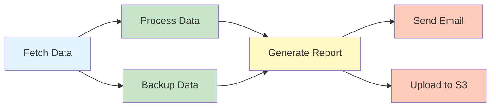

# Advanced Features & Trade-offs Analysis

## 🎯 Overview

This document covers **advanced features** that were out of scope for the MVP but important for scaling to enterprise level.

---

## ⭐ Feature 1: Job Priority Scheduling

### Problem
All jobs are treated equally. But some jobs are more critical!

**Example:**
- Payment processing job (HIGH priority) ⚠️
- Analytics report (LOW priority)

Currently, if queue is full, both wait the same amount of time. ❌

---

### Solution: Priority Queue

**Implementation:**

**1. Add priority field to jobs table:**
```sql
ALTER TABLE jobs ADD COLUMN priority INT DEFAULT 0;
-- 0 = Low, 1 = Medium, 2 = High, 3 = Critical
```

**2. Use multiple RabbitMQ queues:**
```
Critical queue  (priority 3) → 200 dedicated workers
High queue      (priority 2) → 300 workers
Medium queue    (priority 1) → 200 workers
Low queue       (priority 0) → 100 workers
```

**3. Workers pull from highest priority queue first:**
```python
def consume_jobs():
    while True:
        # Check queues in priority order
        message = try_consume("critical_queue")
        if not message:
            message = try_consume("high_queue")
        if not message:
            message = try_consume("medium_queue")
        if not message:
            message = try_consume("low_queue")

        if message:
            execute_job(message)
        else:
            time.sleep(1)  # No jobs available
```

---

### Alternative: Weighted Fair Queueing

**Approach:**
- 50% of worker capacity for high-priority jobs
- 30% for medium-priority
- 20% for low-priority

**Code:**
```python
priority_weights = {
    "critical": 0.25,  # 25% of total workers
    "high": 0.25,      # 25%
    "medium": 0.30,    # 30%
    "low": 0.20        # 20%
}

# If we have 800 workers:
workers_per_priority = {
    "critical": 800 * 0.25 = 200,
    "high": 800 * 0.25 = 200,
    "medium": 800 * 0.30 = 240,
    "low": 800 * 0.20 = 160
}
```

---

### Trade-offs

| Approach | Pros | Cons |
|----------|------|------|
| **Separate Queues** | ✅ Simple to implement<br/>✅ Complete isolation | ❌ Fixed resource allocation<br/>❌ Low-priority jobs might starve |
| **Weighted Fair Queuing** | ✅ Dynamic resource sharing<br/>✅ No starvation | ❌ Complex to implement<br/>❌ Hard to tune weights |
| **Single Queue with Priority Field** | ✅ Simpler infrastructure | ❌ RabbitMQ doesn't support priority well<br/>❌ Head-of-line blocking |

**Our recommendation:** Start with separate queues, migrate to weighted fair queuing if needed.

---

## 🔗 Feature 2: Job Dependencies (DAG)

### Problem
Some jobs depend on others:
```
Job A: Fetch data from API
Job B: Process data (depends on A)
Job C: Generate report (depends on B)
Job D: Send email (depends on C)

A → B → C → D
```

Currently, you'd have to manually schedule each job after the previous completes. ❌

---

### Solution: Directed Acyclic Graph (DAG)

**DAG Example:**


---

### Database Schema for DAG

```sql
CREATE TABLE job_dependencies (
    dependency_id BIGSERIAL PRIMARY KEY,
    job_id BIGINT REFERENCES jobs(job_id),      -- Child job
    depends_on_job_id BIGINT REFERENCES jobs(job_id),  -- Parent job
    created_at TIMESTAMP DEFAULT NOW(),

    CONSTRAINT no_self_dependency CHECK (job_id != depends_on_job_id),
    UNIQUE (job_id, depends_on_job_id)
);

-- Example: Job B depends on Job A
INSERT INTO job_dependencies (job_id, depends_on_job_id) VALUES (2, 1);

-- Example: Job D depends on both Job B and Job C
INSERT INTO job_dependencies (job_id, depends_on_job_id) VALUES (4, 2);
INSERT INTO job_dependencies (job_id, depends_on_job_id) VALUES (4, 3);
```

---

### DAG Execution Logic

**Pseudocode:**
```python
def can_execute_job(job_id):
    """Check if all dependencies are completed"""
    dependencies = db.query("""
        SELECT depends_on_job_id
        FROM job_dependencies
        WHERE job_id = %s
    """, job_id)

    for dep in dependencies:
        dep_status = db.query("SELECT status FROM jobs WHERE job_id = %s", dep)
        if dep_status != "COMPLETED":
            return False  # Dependency not ready

    return True  # All dependencies completed


def schedule_dag():
    """Schedule jobs whose dependencies are met"""
    pending_jobs = db.query("SELECT * FROM jobs WHERE status = 'PENDING'")

    for job in pending_jobs:
        if can_execute_job(job.id):
            publish_to_queue(job)
```

---

### Cycle Detection (Preventing Infinite Loops)

**Problem:** What if someone creates circular dependencies?
```
Job A depends on Job B
Job B depends on Job A
→ Infinite loop! ❌
```

**Solution: Topological Sort**

```python
def detect_cycle(job_id, visited, recursion_stack):
    """DFS-based cycle detection"""
    visited.add(job_id)
    recursion_stack.add(job_id)

    # Get all dependencies
    dependencies = db.query("""
        SELECT depends_on_job_id
        FROM job_dependencies
        WHERE job_id = %s
    """, job_id)

    for dep_id in dependencies:
        if dep_id not in visited:
            if detect_cycle(dep_id, visited, recursion_stack):
                return True  # Cycle detected
        elif dep_id in recursion_stack:
            return True  # Back edge = cycle!

    recursion_stack.remove(job_id)
    return False


def validate_dag(job_id):
    """Ensure no cycles before creating dependency"""
    if detect_cycle(job_id, set(), set()):
        raise Exception("Cycle detected! Cannot create dependency.")
```

---

### Example DAG Execution Timeline

```
Time  | Event
------|----------------------------------------------------------
00:00 | Job A starts (no dependencies)
00:05 | Job A completes ✅
00:05 | Trigger dependent jobs: Job B, Job C (both depend on A)
00:05 | Job B starts
00:05 | Job C starts
00:10 | Job B completes ✅
00:12 | Job C completes ✅
00:12 | Trigger Job D (depends on both B and C, now both done)
00:12 | Job D starts
00:18 | Job D completes ✅
00:18 | Trigger Job E and Job F (both depend on D)
00:18 | Job E starts
00:18 | Job F starts
00:22 | Job E completes ✅
00:25 | Job F completes ✅
00:25 | DAG execution finished! Total time: 25 seconds
```

---

### Trade-offs

| Aspect | Pros | Cons |
|--------|------|------|
| **DAG Support** | ✅ Powerful workflow orchestration<br/>✅ Automatic dependency handling | ❌ Complex to implement<br/>❌ Harder to debug<br/>❌ Cycle detection overhead |
| **No DAG** | ✅ Simple<br/>✅ Easy to understand | ❌ Manual chaining required<br/>❌ Error-prone |

**Real-world tools:** Apache Airflow, Prefect, Temporal all use DAG!

---

## 🎭 Feature 3: Idempotency Keys

### Problem
What if a job is executed twice due to network retries?

**Example:**
```
Job: "Charge customer $100"
Execution 1: Charge succeeds → Customer charged $100 ✅
Network glitch → Worker doesn't ACK
Execution 2: Job retries → Customer charged $100 AGAIN ❌
Total: $200 charged! 😱
```

---

### Solution: Idempotency Keys

**Concept:** Each job execution has a unique ID. If same ID is executed twice, ignore the second attempt.

**Database schema:**
```sql
CREATE TABLE idempotency_keys (
    key_id VARCHAR(100) PRIMARY KEY,  -- UUID for each execution attempt
    job_id BIGINT,
    created_at TIMESTAMP DEFAULT NOW(),
    result JSONB,  -- Store result of first execution

    INDEX idx_job_id (job_id)
);
```

**Worker logic:**
```python
def execute_job_idempotently(job):
    # Generate idempotency key (deterministic based on job_id + scheduled_time)
    key = f"{job.id}_{job.scheduled_time.isoformat()}"

    # Check if already executed
    existing = db.query("SELECT * FROM idempotency_keys WHERE key_id = %s", key)
    if existing:
        print(f"Job {job.id} already executed, skipping")
        return existing.result  # Return cached result

    # Execute job
    try:
        result = execute_job(job)

        # Store result with idempotency key
        db.insert("""
            INSERT INTO idempotency_keys (key_id, job_id, result)
            VALUES (%s, %s, %s)
        """, key, job.id, result)

        return result
    except Exception as e:
        # If failed, don't store key (allow retry)
        raise
```

**Cleanup old keys:**
```sql
-- Delete keys older than 7 days (jobs won't retry after 7 days)
DELETE FROM idempotency_keys WHERE created_at < NOW() - INTERVAL '7 days';
```

---

## 📊 Feature 4: Job Execution Quotas & Cost Tracking

### Problem
Enterprise customers want to track costs per team/project.

**Example:**
- Marketing team: 10,000 jobs this month
- Engineering team: 50,000 jobs this month
- Finance team: 2,000 jobs

How much does each team cost us (compute resources)?

---

### Solution: Per-Team Quotas & Cost Tracking

**Schema:**
```sql
CREATE TABLE teams (
    team_id BIGSERIAL PRIMARY KEY,
    team_name VARCHAR(255),
    monthly_quota INT DEFAULT 10000,  -- Jobs allowed per month
    cost_per_job DECIMAL(10, 4) DEFAULT 0.01  -- $0.01 per job
);

CREATE TABLE team_usage (
    usage_id BIGSERIAL PRIMARY KEY,
    team_id BIGINT REFERENCES teams(team_id),
    month DATE,  -- '2025-11-01'
    jobs_executed INT DEFAULT 0,
    total_cost DECIMAL(10, 2) DEFAULT 0.00,

    UNIQUE (team_id, month)
);

-- Increment usage when job executes
UPDATE team_usage
SET jobs_executed = jobs_executed + 1,
    total_cost = total_cost + (SELECT cost_per_job FROM teams WHERE team_id = 123)
WHERE team_id = 123 AND month = '2025-11-01';
```

**Quota enforcement:**
```python
def check_quota(team_id):
    team = db.query("SELECT monthly_quota FROM teams WHERE team_id = %s", team_id)
    usage = db.query("""
        SELECT jobs_executed
        FROM team_usage
        WHERE team_id = %s AND month = DATE_TRUNC('month', NOW())
    """, team_id)

    if usage.jobs_executed >= team.monthly_quota:
        raise QuotaExceededException(f"Team {team_id} exceeded quota")
```

---

## 🔐 Feature 5: Secret Management

### Problem
Jobs often need secrets (API keys, database passwords).

**❌ Bad approach:**
```json
{
  "payload": {
    "url": "https://api.stripe.com",
    "api_key": "sk_live_51Hxyz..."  // Stored in plaintext! ❌
  }
}
```

---

### Solution: Secret Management Service

**1. Store secrets in HashiCorp Vault or AWS Secrets Manager:**
```
Secret path: /secrets/stripe/api_key
Value: sk_live_51Hxyz... (encrypted at rest)
```

**2. Reference secrets by path in job payload:**
```json
{
  "payload": {
    "url": "https://api.stripe.com",
    "api_key": "{{secrets/stripe/api_key}}"  // Reference, not actual key
  }
}
```

**3. Worker fetches secret at runtime:**
```python
def execute_job(job):
    payload = job.payload

    # Resolve secret references
    if "{{secrets/" in payload.api_key:
        secret_path = payload.api_key.replace("{{", "").replace("}}", "")
        actual_key = vault_client.read(secret_path)
        payload.api_key = actual_key

    # Now execute with actual secret
    requests.post(payload.url, headers={"Authorization": payload.api_key})
```

---

## ⚖️ Trade-offs: SQL vs NoSQL vs Hybrid

### Current Design: PostgreSQL (SQL)

**Pros:**
- ✅ ACID transactions (critical for job status updates)
- ✅ Complex queries (find jobs with dependencies, filter by status)
- ✅ Strong consistency

**Cons:**
- ❌ Vertical scaling (hard to scale beyond single master)
- ❌ Write bottleneck (all writes go to master)

---

### Alternative 1: MongoDB (NoSQL)

**When to use:**
- Very high write throughput (100,000+ jobs/sec)
- Schema flexibility (different job types with different fields)
- Geographic distribution (multi-region writes)

**Example schema:**
```javascript
{
  _id: ObjectId("..."),
  job_id: 12345,
  user_id: 789,
  job_name: "daily_report",
  type: "http_request",
  schedule: "0 9 * * *",
  payload: {
    url: "https://api.example.com",
    method: "POST"
  },
  status: "PENDING",
  next_run_time: ISODate("2025-11-18T09:00:00Z"),
  executions: [  // Embedded executions (denormalized)
    {
      execution_id: 98765,
      status: "COMPLETED",
      start_time: ISODate("2025-11-17T09:00:02Z"),
      duration_ms: 6000
    }
  ]
}
```

**Pros:**
- ✅ Horizontal scaling (shard by user_id)
- ✅ High write throughput
- ✅ Flexible schema (easy to add new job types)

**Cons:**
- ❌ No ACID transactions across documents (risk of duplicate execution!)
- ❌ Eventual consistency (might read stale status)
- ❌ No JOINs (hard to query job dependencies)

---

### Alternative 2: Hybrid Approach (PostgreSQL + Redis)

**PostgreSQL:** Job metadata, execution history (durable storage)
**Redis:** Active jobs, job status cache (fast reads)

**Write path:**
```
1. API → PostgreSQL: INSERT job
2. API → Redis: SET job:12345:status "PENDING"
3. API → User: 201 Created
```

**Read path (status check):**
```
1. API → Redis: GET job:12345:status
2. If found: Return from cache (5ms latency) ✅
3. If not found: Query PostgreSQL (50ms latency)
```

**Pros:**
- ✅ Fast reads (Redis cache)
- ✅ Durable writes (PostgreSQL)
- ✅ Best of both worlds

**Cons:**
- ❌ Cache invalidation complexity
- ❌ More infrastructure to manage

---

## 📈 Scaling to 1 Million Jobs/Second

**Current design:** 612 jobs/sec ✅

**What changes at 1M jobs/sec?**

### 1. Database Sharding

**Problem:** Single PostgreSQL master can't handle 1M writes/sec

**Solution:** Horizontal sharding by user_id
```
Shard 1: user_id 0 - 100,000
Shard 2: user_id 100,001 - 200,000
...
Shard 10: user_id 900,001 - 1,000,000

Each shard handles 100,000 writes/sec ✅
```

**Shard routing logic:**
```python
def get_shard(user_id):
    shard_count = 10
    shard_id = user_id % shard_count
    return database_connections[shard_id]

# Write job
db = get_shard(user.id)
db.insert("INSERT INTO jobs ...")
```

---

### 2. Kafka for Job Distribution

**Problem:** RabbitMQ tops out at ~50K messages/sec

**Solution:** Apache Kafka (handles 1M+ messages/sec)

**Kafka partitioning:**
```
Topic: pending_jobs
Partitions: 100

Job with user_id=12345 → Partition 45 (12345 % 100)
Job with user_id=67890 → Partition 90 (67890 % 100)

Each partition: 10,000 jobs/sec
Total: 100 × 10,000 = 1M jobs/sec ✅
```

---

### 3. Horizontal Scheduler Scaling

**Problem:** Single scheduler can't publish 1M jobs/sec

**Solution:** 100 active schedulers (not just 1 leader!)

**Partitioned scheduling:**
```
Scheduler 1: Handles jobs with user_id % 100 = 0
Scheduler 2: Handles jobs with user_id % 100 = 1
...
Scheduler 100: Handles jobs with user_id % 100 = 99

Each scheduler: 10,000 jobs/sec
Total: 100 × 10,000 = 1M jobs/sec ✅
```

---

## ✅ Summary of Advanced Features

| Feature | Complexity | Impact | Priority |
|---------|------------|--------|----------|
| **Priority Scheduling** | Medium | High (critical jobs execute first) | P1 |
| **Job Dependencies (DAG)** | High | Very High (workflow orchestration) | P2 |
| **Idempotency Keys** | Medium | High (prevent duplicate charges) | P1 |
| **Quotas & Cost Tracking** | Low | Medium (multi-tenancy) | P3 |
| **Secret Management** | Medium | High (security) | P1 |
| **Database Sharding** | Very High | Very High (scale to 1M/sec) | P4 |

**Recommendation:** Implement in order of priority!

