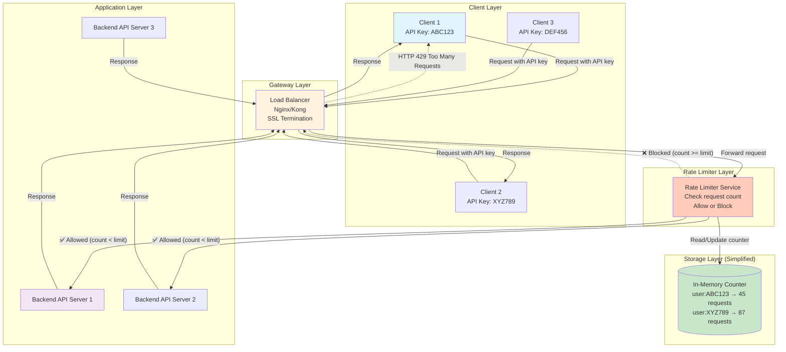
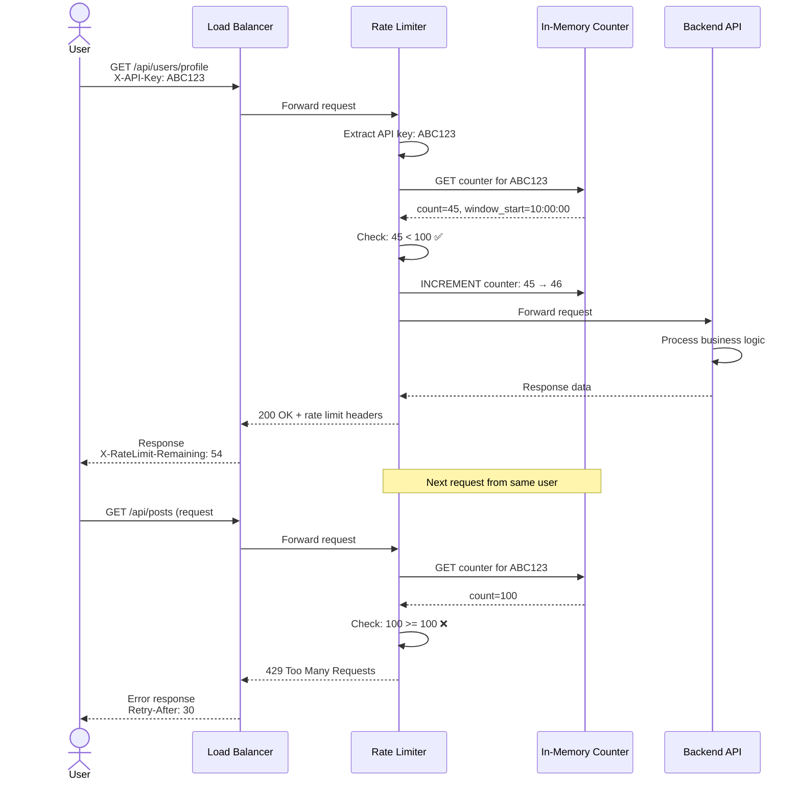

# Step 1: Basic Architecture

## What We're Building in This Step

In this step, we'll design the **simplest possible rate limiter architecture** that can work. Think of this as our foundation - we'll add complexity in later steps.

**Goal:** Create a basic flow where requests pass through a rate limiter before reaching the backend service.

---

## Components Added in Step 1

### 1. Client (User/Application)
- Web browsers, mobile apps, or third-party services
- Makes API requests to our backend services
- Each client has a unique API key or user identifier

### 2. API Gateway / Load Balancer
- Entry point for all requests
- Routes requests to backend services
- Handles SSL/TLS termination
- **Technology:** Nginx, HAProxy, AWS ALB, Kong

**Why we need it:**
- Single entry point for all traffic
- Can distribute load across multiple servers
- Can add cross-cutting concerns (logging, monitoring)

### 3. Rate Limiter Service
- **The core component we're designing!**
- Checks if the request should be allowed or blocked
- Maintains counters for each user
- Returns decision: Allow (200) or Block (429)

### 4. Backend Service (API Server)
- The actual application logic (e.g., e-commerce API, social media API)
- Only receives requests that pass the rate limiter
- Protected from overload and abuse

---

## Architecture Diagram - Step 1



---

## How It Works - Step by Step

### Scenario: User Makes a Request

Let's say **User ABC123** makes a request, and they're allowed **100 requests per minute**.

**Step 1:** Client sends request
```
GET /api/users/profile
Header: X-API-Key: ABC123
```

**Step 2:** Load Balancer receives request
- Terminates SSL connection
- Forwards request to Rate Limiter

**Step 3:** Rate Limiter checks the counter
```
1. Extract API key: ABC123
2. Check current count: Memory shows "45 requests in current minute"
3. Compare: 45 < 100 (limit)
4. Decision: ✅ ALLOW
5. Increment counter: 45 → 46
6. Forward request to Backend API
```

**Step 4:** Backend API processes request
- Executes business logic
- Queries database
- Returns response

**Step 5:** Response flows back to client
```
HTTP/1.1 200 OK
X-RateLimit-Limit: 100
X-RateLimit-Remaining: 54
X-RateLimit-Reset: 1735689660

{
  "user": {
    "id": 123,
    "name": "John Doe"
  }
}
```

### Scenario: User Exceeds Limit

Same user **ABC123** makes their **101st request** in the same minute.

**Step 3 (modified):** Rate Limiter checks the counter
```
1. Extract API key: ABC123
2. Check current count: Memory shows "100 requests in current minute"
3. Compare: 100 >= 100 (limit)
4. Decision: ❌ BLOCK
5. Do NOT increment counter
6. Return HTTP 429 to Load Balancer
```

**Step 5 (modified):** Error response to client
```
HTTP/1.1 429 Too Many Requests
X-RateLimit-Limit: 100
X-RateLimit-Remaining: 0
X-RateLimit-Reset: 1735689660
Retry-After: 30

{
  "error": "Rate limit exceeded",
  "message": "You have exceeded 100 requests per minute",
  "retryAfter": 30
}
```

---

## Beginner-Friendly Example with Numbers

Let's make this super concrete with a timeline:

**User: Alice** (API Key: ABC123)
**Rate Limit: 5 requests per minute** (simplified for clarity)
**Current Time: 10:00:00**

| Time | Request # | Current Count | Limit | Decision | Remaining |
|------|-----------|---------------|-------|----------|-----------|
| 10:00:05 | 1 | 0 → 1 | 5 | ✅ Allow | 4 |
| 10:00:12 | 2 | 1 → 2 | 5 | ✅ Allow | 3 |
| 10:00:23 | 3 | 2 → 3 | 5 | ✅ Allow | 2 |
| 10:00:34 | 4 | 3 → 4 | 5 | ✅ Allow | 1 |
| 10:00:45 | 5 | 4 → 5 | 5 | ✅ Allow | 0 |
| 10:00:50 | 6 | 5 (no change) | 5 | ❌ Block (429) | 0 |
| 10:00:55 | 7 | 5 (no change) | 5 | ❌ Block (429) | 0 |
| **10:01:00** | - | **Reset to 0** | 5 | - | 5 |
| 10:01:05 | 8 | 0 → 1 | 5 | ✅ Allow | 4 |

**Key Insight:** At 10:01:00, the counter resets because the 1-minute window has passed!

---

## Simple In-Memory Counter Implementation

Here's pseudocode for the rate limiter logic:

```python
# Simple in-memory rate limiter (NOT production-ready)

class SimpleRateLimiter:
    def __init__(self):
        # Dictionary to store counters: {user_id: {"count": 0, "window_start": timestamp}}
        self.counters = {}
        self.limit = 100  # requests per minute
        self.window_size = 60  # seconds

    def is_allowed(self, user_id):
        current_time = time.time()

        # Get user's counter (or create new one)
        if user_id not in self.counters:
            self.counters[user_id] = {
                "count": 0,
                "window_start": current_time
            }

        user_data = self.counters[user_id]

        # Check if current window has expired
        if current_time - user_data["window_start"] >= self.window_size:
            # Reset counter for new window
            user_data["count"] = 0
            user_data["window_start"] = current_time

        # Check if under limit
        if user_data["count"] < self.limit:
            user_data["count"] += 1
            return True  # ✅ Allow
        else:
            return False  # ❌ Block
```

**Usage example:**
```python
rate_limiter = SimpleRateLimiter()

# User ABC123 makes a request
if rate_limiter.is_allowed("ABC123"):
    # Forward to backend API
    response = backend_api.handle_request()
    return response
else:
    # Return 429 Too Many Requests
    return {
        "status": 429,
        "error": "Rate limit exceeded"
    }
```

---

## Design Decisions for Step 1

### Decision 1: Where to Place the Rate Limiter?

**Option A: Client-Side Rate Limiting**
- ❌ Easy to bypass (malicious users can modify client code)
- ❌ Not trustworthy
- ✅ Reduces unnecessary network calls

**Option B: API Gateway Level** ⭐ **CHOSEN**
- ✅ Centralized enforcement
- ✅ Cannot be bypassed
- ✅ Protects all backend services
- ❌ Single point of failure (we'll address in later steps)

**Option C: Backend Service Level**
- ✅ Fine-grained control per endpoint
- ❌ Rate limiter code in every service (duplication)
- ❌ Higher latency (traffic already reached backend)

**Decision:** We place the rate limiter at the API Gateway level for centralized enforcement.

---

### Decision 2: How to Identify Users?

**Option A: By IP Address**
- ✅ Simple, no authentication needed
- ❌ Multiple users behind same NAT/proxy share IP
- ❌ User can bypass by changing IP (VPN, mobile network)

**Option B: By API Key** ⭐ **CHOSEN**
- ✅ Accurate per-user tracking
- ✅ Tied to user account
- ❌ Requires authentication
- ❌ API key could be shared/stolen

**Option C: By User ID (after authentication)**
- ✅ Most accurate
- ✅ Tied to authenticated session
- ❌ Requires full authentication before rate limiting
- ❌ Higher latency

**Decision:** We use API Key for identification (good balance of accuracy and performance).

---

### Decision 3: Where to Store Counters?

**Option A: In-Memory (Single Server)** ⭐ **CHOSEN for Step 1**
- ✅ Extremely fast (nanoseconds)
- ✅ Simple to implement
- ❌ Not shared across servers
- ❌ Lost on server restart

**Option B: Database (MySQL/PostgreSQL)**
- ✅ Persistent
- ✅ Shared across servers
- ❌ Slow (10-50ms per query)
- ❌ High write load (every request writes to DB)

**Option C: Distributed Cache (Redis)** (We'll use in Step 2)
- ✅ Fast (1-2ms)
- ✅ Shared across servers
- ✅ Built-in expiration (TTL)
- ❌ More complex to set up

**Decision:** For Step 1, we use in-memory storage. We'll upgrade to Redis in Step 2.

---

## Limitations of Step 1 Architecture

🚨 **Problem 1: Not Distributed**
- Each server has its own in-memory counter
- User can make 100 requests to Server A + 100 requests to Server B = 200 total (bypassed limit!)

**Solution in Step 2:** Use Redis for shared counters

---

🚨 **Problem 2: Single Point of Failure**
- If the rate limiter service crashes, all requests fail

**Solution in Step 3:** Add redundancy and health checks

---

🚨 **Problem 3: No Persistence**
- Counters are lost if server restarts
- Configuration is hardcoded

**Solution in Step 4:** Store configuration in database

---

🚨 **Problem 4: Simple Algorithm**
- Fixed window counter has edge cases (we'll explain later)

**Solution in Step 5:** Implement better algorithms (Sliding Window, Token Bucket)

---

## Trade-offs Table

| Aspect | Choice | Pros | Cons |
|--------|--------|------|------|
| **Placement** | API Gateway | Centralized, protects all services | Single point of failure |
| **User ID** | API Key | Accurate, tied to account | Requires authentication |
| **Storage** | In-Memory | Fast (< 1ms) | Not shared, lost on restart |
| **Algorithm** | Fixed Window Counter | Simple to implement | Burst traffic edge cases |
| **Deployment** | Single instance | Simple | Not scalable |

---

## Request Flow Sequence Diagram



---

## What Changed from Step 0 (No Rate Limiter)

### Before (No Rate Limiter):
```
Client → Load Balancer → Backend API → Database
```
**Problems:**
- ❌ Anyone can overload the API
- ❌ DDoS attacks can bring down the service
- ❌ No fair usage enforcement

### After (Step 1 Rate Limiter):
```
Client → Load Balancer → Rate Limiter → Backend API → Database
                              ↓
                       In-Memory Counter
```
**Benefits:**
- ✅ Prevents abuse
- ✅ Protects backend from overload
- ✅ Fair usage across users

---

## Code Example: API Gateway Integration

Here's how you might integrate this in an API Gateway (e.g., Kong, Nginx):

**Nginx Configuration Example:**
```nginx
http {
    # Define rate limiter zone (in-memory storage)
    limit_req_zone $http_x_api_key zone=api_limit:10m rate=100r/m;

    server {
        listen 80;

        location /api/ {
            # Apply rate limiting
            limit_req zone=api_limit burst=20 nodelay;

            # Add rate limit headers
            add_header X-RateLimit-Limit 100;
            add_header X-RateLimit-Remaining $limit_req_status;

            # Proxy to backend
            proxy_pass http://backend_servers;
        }
    }
}
```

**Kong Plugin Configuration:**
```yaml
plugins:
  - name: rate-limiting
    config:
      minute: 100
      policy: local  # In-memory (not distributed yet)
      fault_tolerant: true
      hide_client_headers: false
```

---

## Capacity Analysis for Step 1

**Can this architecture handle our requirements?**

| Requirement | Step 1 Capability | Status |
|-------------|-------------------|--------|
| **3,500 req/sec (peak)** | Single server: ~10,000 req/sec | ✅ Sufficient |
| **< 5ms latency** | In-memory lookup: < 1ms | ✅ Excellent |
| **Distributed enforcement** | In-memory counters (not shared) | ❌ Not supported |
| **High availability (99.99%)** | Single instance (SPOF) | ❌ Not supported |
| **1M concurrent users** | Limited by server memory | ⚠️ Needs horizontal scaling |

**Verdict:** Step 1 works for a single server, but we need distributed architecture (Redis) for production.

---

## Testing the Rate Limiter

**Test Case 1: Normal Usage**
```bash
# Make 50 requests (should all succeed)
for i in {1..50}; do
  curl -H "X-API-Key: ABC123" http://api.example.com/users
done

# Expected: All return 200 OK
# X-RateLimit-Remaining: 50, 49, 48, ..., 50
```

**Test Case 2: Exceeding Limit**
```bash
# Make 150 requests (100 should succeed, 50 should fail)
for i in {1..150}; do
  curl -H "X-API-Key: ABC123" http://api.example.com/users
done

# Expected:
# - First 100 requests: 200 OK
# - Next 50 requests: 429 Too Many Requests
```

**Test Case 3: Window Reset**
```bash
# Make 100 requests (use up quota)
for i in {1..100}; do
  curl -H "X-API-Key: ABC123" http://api.example.com/users
done

# Wait 61 seconds (window expires)
sleep 61

# Make 1 request (should succeed - new window)
curl -H "X-API-Key: ABC123" http://api.example.com/users

# Expected: 200 OK
# X-RateLimit-Remaining: 99
```

---

## Summary - What We Achieved

✅ **Built the foundation:**
- Client → Load Balancer → Rate Limiter → Backend API

✅ **Components:**
- Load Balancer for traffic distribution
- Rate Limiter service with counter logic
- In-memory storage for counters
- Backend API protected from abuse

✅ **Functionality:**
- Per-API-key rate limiting
- HTTP 429 responses for violations
- Rate limit headers in responses

✅ **Performance:**
- < 1ms latency for rate limit checks
- Can handle 10,000 req/sec on single server

❌ **Limitations (to be fixed in next steps):**
- Not distributed (counters not shared across servers)
- Single point of failure
- No configuration persistence
- Simple algorithm with edge cases

---

## Next Steps

In **Step 2**, we'll address the biggest limitation: **distributed rate limiting**.

**What we'll add:**
- Redis cluster for shared counters
- Atomic operations (INCR, EXPIRE)
- Consistency across multiple servers
- TTL-based automatic cleanup

**Preview of Step 2 Architecture:**
```
Client → Load Balancer → Rate Limiter → Backend API
                              ↓
                         Redis Cluster ← (Shared across all Rate Limiter instances)
```

---

**Document Version:** 1.0
**Last Updated:** 2025-11-17
**Previous:** [Requirements and Estimations](./1_requirements_and_estimations.md)
**Next:** [Step 2: Add Distributed Cache (Redis)](./3_step2_add_caching.md)
