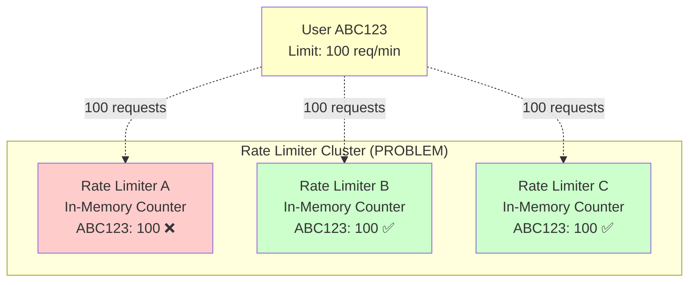
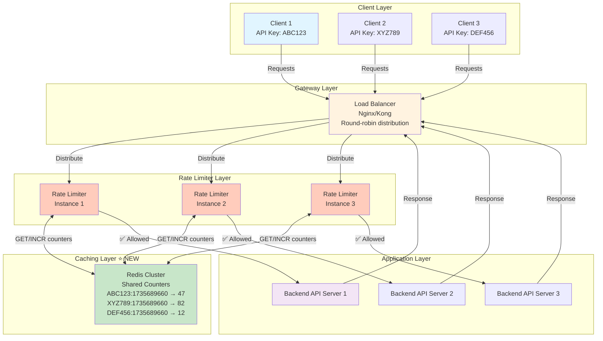
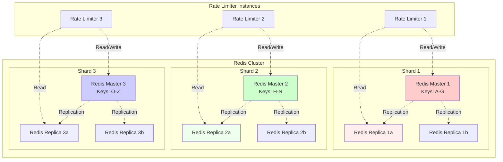
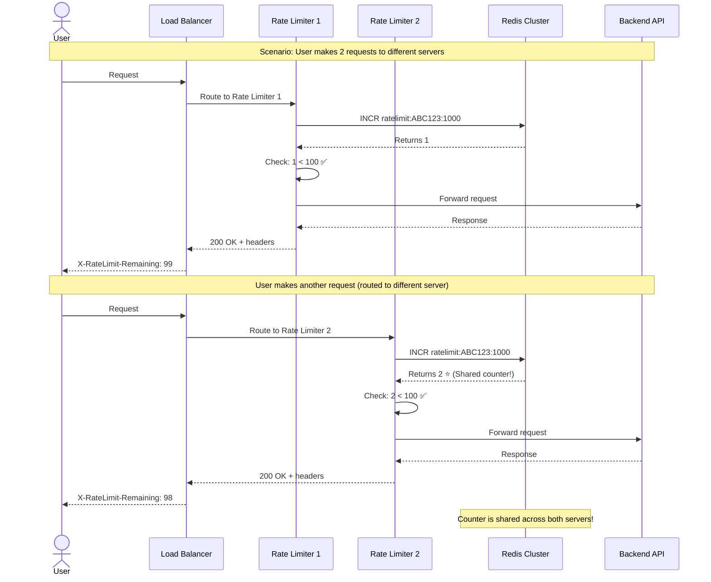

# Step 2: Add Distributed Caching (Redis)

## What We're Adding in This Step

In Step 1, we had a major problem: **each server maintained its own in-memory counters**. This meant users could bypass rate limits by hitting different servers.

**In Step 2, we'll add Redis** - a distributed in-memory cache that all rate limiter instances can share.

---

## The Problem with Step 1

### Scenario: User Bypassing Rate Limits

**Setup:**
- Rate limit: 100 requests per minute
- 3 rate limiter servers (Server A, B, C)
- Load balancer distributes requests randomly

**What happens:**
```
User makes 100 requests → Load balancer sends to Server A
Server A counter: 100 requests → Next request BLOCKED ❌

User makes 100 MORE requests → Load balancer sends to Server B
Server B counter: 0 requests (separate memory!) → All 100 ALLOWED ✅

User makes 100 MORE requests → Load balancer sends to Server C
Server C counter: 0 requests (separate memory!) → All 100 ALLOWED ✅

Total: 300 requests allowed (should have been 100!)
```

**Diagram of the Problem:**



**The Root Cause:** Counters are not shared across servers!

---

## The Solution: Centralized Redis Cache

We'll replace in-memory counters with a **Redis cluster** that all rate limiter instances can access.

**Key Benefits:**
✅ **Shared State:** All servers read/write to the same counters
✅ **Atomic Operations:** Redis supports INCR (atomic increment)
✅ **Built-in Expiration:** TTL (Time-To-Live) for automatic cleanup
✅ **High Performance:** 1-2ms latency (vs 50ms for database)
✅ **High Availability:** Redis Cluster with replication

---

## Step 2 Architecture Diagram



---

## What Changed from Step 1

| Aspect | Step 1 | Step 2 |
|--------|--------|--------|
| **Counter Storage** | In-memory (per server) | Redis (shared) |
| **Consistency** | ❌ Inconsistent across servers | ✅ Strongly consistent |
| **Scalability** | Limited to single server | ✅ Horizontal scaling |
| **Persistence** | ❌ Lost on restart | ✅ Optional persistence |
| **Latency** | < 1ms (local memory) | 1-2ms (network call to Redis) |
| **Operations** | Simple increment | Atomic INCR + EXPIRE |

---

## Redis Data Structures for Rate Limiting

### Strategy 1: Simple Counter with TTL (Fixed Window)

**Redis Key:** `ratelimit:{user_id}:{window_start_timestamp}`
**Redis Value:** Integer (request count)

**Example:**
```redis
# User ABC123, window starting at timestamp 1735689660
SET ratelimit:ABC123:1735689660 1 EX 60

# Subsequent requests in same window
INCR ratelimit:ABC123:1735689660
# Returns: 2

INCR ratelimit:ABC123:1735689660
# Returns: 3

# Get current count
GET ratelimit:ABC123:1735689660
# Returns: 3

# TTL (Time To Live) automatically expires after 60 seconds
TTL ratelimit:ABC123:1735689660
# Returns: 42 (seconds remaining)
```

**Key Components:**
- `ratelimit` - Namespace/prefix
- `ABC123` - User identifier
- `1735689660` - Window start timestamp (Unix epoch)
- `EX 60` - Expire after 60 seconds

---

### Strategy 2: Sliding Window with Sorted Set

For more advanced algorithms (Sliding Window Log), we use Redis Sorted Sets:

**Redis Key:** `ratelimit:log:{user_id}`
**Redis Value:** Sorted Set (timestamp-scored request logs)

**Example:**
```redis
# Add request timestamp to sorted set
ZADD ratelimit:log:ABC123 1735689661 "req-1"
ZADD ratelimit:log:ABC123 1735689665 "req-2"
ZADD ratelimit:log:ABC123 1735689670 "req-3"

# Count requests in last 60 seconds
ZCOUNT ratelimit:log:ABC123 (NOW-60) NOW
# Returns: 3

# Remove requests older than 60 seconds
ZREMRANGEBYSCORE ratelimit:log:ABC123 -inf (NOW-60)

# Set expiration for cleanup
EXPIRE ratelimit:log:ABC123 60
```

---

## Beginner-Friendly Example: Redis in Action

Let's see how Redis solves the distributed problem:

**Scenario:**
- User: ABC123
- Limit: 5 requests per minute
- 3 Rate Limiter servers (A, B, C)
- All use the same Redis cluster

### Timeline:

| Time | Request | Server | Redis Operation | Redis Counter | Decision |
|------|---------|--------|-----------------|---------------|----------|
| 10:00:05 | #1 | A | `INCR ratelimit:ABC123:1000` → 1 | 1 | ✅ Allow |
| 10:00:12 | #2 | B | `INCR ratelimit:ABC123:1000` → 2 | 2 | ✅ Allow |
| 10:00:23 | #3 | C | `INCR ratelimit:ABC123:1000` → 3 | 3 | ✅ Allow |
| 10:00:34 | #4 | A | `INCR ratelimit:ABC123:1000` → 4 | 4 | ✅ Allow |
| 10:00:45 | #5 | B | `INCR ratelimit:ABC123:1000` → 5 | 5 | ✅ Allow |
| 10:00:50 | #6 | C | `GET ratelimit:ABC123:1000` → 5 | 5 | ❌ Block (429) |
| 10:00:55 | #7 | A | `GET ratelimit:ABC123:1000` → 5 | 5 | ❌ Block (429) |
| **10:01:00** | - | - | **Key expires (TTL)** | **0** | - |
| 10:01:05 | #8 | B | `INCR ratelimit:ABC123:1001` → 1 | 1 | ✅ Allow |

**Key Insight:**
- All servers (A, B, C) access the **same counter** in Redis
- No matter which server handles the request, the limit is enforced correctly
- Redis automatically cleans up expired counters (TTL)

---

## Redis Commands Explained (Beginner-Friendly)

### 1. INCR - Atomic Increment
```redis
INCR ratelimit:ABC123:1000
```
**What it does:**
- Increments the value by 1
- Returns the new value
- **Atomic:** No race conditions (thread-safe)
- Creates key if it doesn't exist (starts at 0)

**Why atomic matters:**
```
❌ Without Atomic (Dangerous):
1. Server A reads counter: 10
2. Server B reads counter: 10 (at same time)
3. Server A writes: 10 + 1 = 11
4. Server B writes: 10 + 1 = 11
Result: 2 requests but counter only went from 10 to 11 (lost update!)

✅ With Atomic INCR:
1. Server A: INCR → Returns 11
2. Server B: INCR → Returns 12
Result: Correct count!
```

### 2. EXPIRE - Set TTL (Time To Live)
```redis
EXPIRE ratelimit:ABC123:1000 60
```
**What it does:**
- Sets the key to automatically delete after 60 seconds
- Prevents memory leaks (old counters auto-cleanup)
- Returns how many seconds until expiration

### 3. GET - Retrieve Value
```redis
GET ratelimit:ABC123:1000
```
**What it does:**
- Returns current counter value
- Returns `nil` if key doesn't exist
- Read-only (doesn't modify)

### 4. SET with EX - Set Value with Expiration
```redis
SET ratelimit:ABC123:1000 1 EX 60
```
**What it does:**
- Sets value to 1
- Automatically expires after 60 seconds
- Combines SET + EXPIRE in one command

---

## Rate Limiter Logic with Redis

**Pseudocode:**

```python
import redis
import time

class DistributedRateLimiter:
    def __init__(self):
        self.redis_client = redis.Redis(host='redis-cluster', port=6379)
        self.limit = 100  # requests per minute
        self.window_size = 60  # seconds

    def is_allowed(self, user_id):
        current_time = int(time.time())

        # Calculate window start (align to minute boundaries)
        # Example: 1735689665 → 1735689660 (start of that minute)
        window_start = (current_time // self.window_size) * self.window_size

        # Redis key for this user and window
        key = f"ratelimit:{user_id}:{window_start}"

        try:
            # Get current counter (atomic operation)
            current_count = self.redis_client.get(key)

            if current_count is None:
                # First request in this window
                # Set counter to 1 and expire after window_size seconds
                self.redis_client.setex(key, self.window_size, 1)
                return True  # ✅ Allow

            current_count = int(current_count)

            if current_count < self.limit:
                # Under limit - increment and allow
                new_count = self.redis_client.incr(key)
                return True  # ✅ Allow
            else:
                # Over limit - reject
                return False  # ❌ Block

        except redis.RedisError as e:
            # Redis error - fail open (allow request) or fail closed (block request)
            print(f"Redis error: {e}")
            return True  # Fail-open: allow request if Redis is down

    def get_remaining_quota(self, user_id):
        current_time = int(time.time())
        window_start = (current_time // self.window_size) * self.window_size
        key = f"ratelimit:{user_id}:{window_start}"

        current_count = self.redis_client.get(key)
        if current_count is None:
            return self.limit  # Full quota available

        return max(0, self.limit - int(current_count))

    def get_reset_time(self, user_id):
        current_time = int(time.time())
        window_start = (current_time // self.window_size) * self.window_size
        window_end = window_start + self.window_size

        return window_end  # Unix timestamp when window resets
```

**Usage:**
```python
rate_limiter = DistributedRateLimiter()

# Request comes in
user_id = request.headers.get("X-API-Key")

if rate_limiter.is_allowed(user_id):
    # Allow request
    remaining = rate_limiter.get_remaining_quota(user_id)
    reset_time = rate_limiter.get_reset_time(user_id)

    response = backend_api.handle_request()
    response.headers["X-RateLimit-Limit"] = "100"
    response.headers["X-RateLimit-Remaining"] = str(remaining)
    response.headers["X-RateLimit-Reset"] = str(reset_time)

    return response
else:
    # Block request
    reset_time = rate_limiter.get_reset_time(user_id)
    retry_after = reset_time - int(time.time())

    return {
        "status": 429,
        "error": "Rate limit exceeded",
        "retryAfter": retry_after
    }, 429
```

---

## Redis Cluster Architecture

For high availability and scalability, we use **Redis Cluster** instead of a single Redis instance.



**Key Concepts:**

### 1. Sharding (Horizontal Partitioning)
- Data is split across multiple Redis masters
- Each master handles a range of keys (based on hash slot)
- Example: User ABC123 → Hash → Slot 5432 → Master 2

**Hash Slot Calculation:**
```python
import crc16

def get_hash_slot(key):
    # Redis uses CRC16 hash
    hash_value = crc16.crc16xmodem(key.encode())
    slot = hash_value % 16384  # Redis has 16384 slots
    return slot

# Example
get_hash_slot("ratelimit:ABC123:1000")  # → 5432 → Master 2
get_hash_slot("ratelimit:XYZ789:1000")  # → 12891 → Master 3
```

### 2. Replication (High Availability)
- Each master has 2 replicas (copies)
- Writes go to master
- Reads can go to replicas (reduce master load)
- If master fails, replica is promoted to master (automatic failover)

### 3. Sentinel (Monitoring & Failover)
- Redis Sentinel monitors master health
- Detects failures (heartbeat checks)
- Promotes replica to master automatically
- Provides high availability (99.99%+)

---

## Caching Strategy Explained

### What to Cache?
✅ **Rate limit counters** (user request counts)
✅ **Rate limit rules** (user tier configurations)
✅ **User API key metadata** (tier, limits, expiration)

❌ **Don't cache:** Actual API response data (that's a different use case)

### Cache Expiration (TTL)

**Rate limit counters:**
```
TTL = window_size + buffer
Example: 1-minute window → TTL = 70 seconds

Why +10 seconds buffer?
- Clock skew between servers
- Prevent premature deletion
```

**Rate limit rules:**
```
TTL = 5 minutes (or no expiration)

Why?
- Rules change infrequently
- Cache invalidation on config update
```

### Cache Invalidation

**When to invalidate:**
1. User tier changes (Free → Premium)
2. Rate limit rule updated
3. API key revoked

**How to invalidate:**
```redis
# Delete specific user's counter
DEL ratelimit:ABC123:1735689660

# Delete all counters for a user (use pattern)
EVAL "return redis.call('DEL', unpack(redis.call('KEYS', 'ratelimit:ABC123:*')))" 0
```

---

## Performance Comparison

| Operation | In-Memory (Step 1) | Redis (Step 2) | Database (MySQL) |
|-----------|-------------------|----------------|------------------|
| **Read latency** | < 1ms | 1-2ms | 10-50ms |
| **Write latency** | < 1ms | 1-2ms | 10-50ms |
| **Throughput** | 100K ops/sec | 100K ops/sec (per instance) | 5K-10K ops/sec |
| **Consistency** | ❌ Per-server | ✅ Distributed | ✅ ACID |
| **Persistence** | ❌ Lost on restart | ⚠️ Optional (RDB/AOF) | ✅ Durable |
| **Scalability** | ❌ Vertical only | ✅ Horizontal (clustering) | ⚠️ Complex sharding |

**Verdict:** Redis is the sweet spot for rate limiting (fast + distributed + scalable).

---

## Sequence Diagram: Distributed Rate Limiting



---

## Trade-offs of Adding Redis

### Pros ✅

**Distributed Consistency:**
- All servers share the same counters
- No bypassing limits by server-hopping
- Strong consistency (atomic operations)

**Scalability:**
- Add more Redis nodes (horizontal scaling)
- Sharding distributes load
- Can handle billions of keys

**Auto-Cleanup:**
- TTL automatically deletes expired counters
- No manual memory management
- Prevents memory leaks

**High Performance:**
- In-memory (1-2ms latency)
- 100K+ operations per second per instance
- Pipelined commands for batch operations

### Cons ❌

**Added Complexity:**
- New component to manage (Redis cluster)
- Network calls (vs local memory)
- Operational overhead (monitoring, backups)

**Increased Latency:**
- 1-2ms network call to Redis
- vs < 1ms for local memory
- Acceptable trade-off for consistency

**Single Point of Failure (if not clustered):**
- Need Redis replication for HA
- Sentinel for automatic failover
- Increased infrastructure cost

**Network Dependency:**
- If Redis is unreachable, rate limiter fails
- Need fallback strategy (fail-open vs fail-closed)
- Circuit breaker pattern

**Cost:**
- Redis cluster infrastructure
- ~$50-200/month for managed Redis (AWS ElastiCache, Redis Cloud)
- vs free in-memory storage

---

## Failure Scenarios & Handling

### Scenario 1: Redis is Down

**Options:**

**A) Fail-Open (Prefer Availability)**
```python
try:
    allowed = redis_client.incr(key)
except redis.RedisError:
    print("Redis down - allowing request (fail-open)")
    return True  # Allow all requests
```
**Pros:** Service stays available
**Cons:** No rate limiting (vulnerable to abuse)

**B) Fail-Closed (Prefer Security)**
```python
try:
    allowed = redis_client.incr(key)
except redis.RedisError:
    print("Redis down - blocking request (fail-closed)")
    return False  # Block all requests
```
**Pros:** Prevent abuse
**Cons:** Service unavailable (bad user experience)

**C) Fallback to Local Cache (Best of Both)**
```python
try:
    allowed = redis_client.incr(key)
except redis.RedisError:
    print("Redis down - using local in-memory cache")
    allowed = local_cache.is_allowed(user_id)
    return allowed
```
**Pros:** Service available + some rate limiting
**Cons:** Counters not shared (users can bypass by server-hopping)

**Recommended:** Fail-open for non-critical APIs, fail-closed for critical APIs (payment, auth).

---

### Scenario 2: High Redis Latency

**Solution: Connection Pooling**
```python
redis_pool = redis.ConnectionPool(
    host='redis-cluster',
    port=6379,
    max_connections=50,  # Reuse connections
    socket_keepalive=True,
    socket_connect_timeout=0.5,  # 500ms timeout
    socket_timeout=0.5
)

redis_client = redis.Redis(connection_pool=redis_pool)
```

---

## Capacity Planning for Redis

**From our earlier estimates:**
- Peak: 3,500 requests/sec
- Each request = 1 INCR + 1 GET
- Total Redis operations: 7,000 ops/sec

**Single Redis instance capacity:**
- Can handle ~100,000 ops/sec
- **Utilization:** 7,000 / 100,000 = 7% (plenty of headroom!)

**Memory:**
- 500 MB for counters (calculated earlier)
- Redis overhead: 30% → 650 MB
- Safety margin: 2x → 1.3 GB
- **Recommended:** 2 GB RAM per Redis instance

**Redis Cluster Size:**
```
Primary capacity: 1 Redis master (can handle 100K ops/sec)
High availability: 2 replicas per master
Total: 3 Redis instances (1 master + 2 replicas)

Total memory: 3 × 2 GB = 6 GB
Total cost: ~$100-150/month (managed service)
```

---

## Summary - What We Achieved in Step 2

✅ **Distributed Consistency:**
- All rate limiter instances share the same Redis counters
- Users cannot bypass limits by hitting different servers

✅ **Redis Integration:**
- Atomic INCR operations for thread-safe counters
- TTL for automatic cleanup
- High performance (1-2ms latency)

✅ **High Availability:**
- Redis cluster with replication
- Automatic failover with Sentinel
- Fault tolerance (fail-open/fail-closed strategies)

✅ **Scalability:**
- Horizontal scaling (add more Redis nodes)
- Sharding for load distribution
- Can handle billions of keys

✅ **Production-Ready:**
- Connection pooling
- Error handling
- Monitoring and alerting

---

## Next Steps

In **Step 3**, we'll dive deep into **rate limiting algorithms**:

**We'll explore:**
1. **Fixed Window Counter** (what we've used so far)
2. **Sliding Window Log** (more accurate)
3. **Sliding Window Counter** (hybrid approach)
4. **Token Bucket** (allows bursts)
5. **Leaky Bucket** (smooth traffic)

**Each algorithm has pros/cons - we'll explain when to use which!**

---

**Document Version:** 1.0
**Last Updated:** 2025-11-17
**Previous:** [Step 1: Basic Architecture](./2_step1_basic_architecture.md)
**Next:** [Step 3: Rate Limiting Algorithms](./4_step3_rate_limiting_algorithms.md)
