# Step 3: Rate Limiting Algorithms Deep Dive

## Overview: Why Different Algorithms?

So far, we've used a simple **Fixed Window Counter**. But this algorithm has limitations (we'll explain!).

In this document, we'll explore **5 popular rate limiting algorithms**, each with different trade-offs:

1. **Fixed Window Counter** - Simplest, but has edge cases
2. **Sliding Window Log** - Most accurate, but memory-intensive
3. **Sliding Window Counter** - Hybrid approach (good balance)
4. **Token Bucket** - Allows bursts, flexible
5. **Leaky Bucket** - Smooths traffic, prevents bursts

---

## Quick Comparison Table

| Algorithm | Accuracy | Memory Usage | Complexity | Allows Bursts | Use Case |
|-----------|----------|--------------|------------|---------------|----------|
| **Fixed Window** | ⚠️ Medium | ✅ Low | ✅ Simple | ❌ No | General APIs |
| **Sliding Window Log** | ✅ High | ❌ High | ⚠️ Complex | ❌ No | Strict limits |
| **Sliding Window Counter** | ✅ Good | ✅ Low | ⚠️ Medium | ❌ No | Production (recommended) |
| **Token Bucket** | ✅ Good | ✅ Low | ⚠️ Medium | ✅ Yes | Elastic APIs |
| **Leaky Bucket** | ✅ Good | ✅ Low | ⚠️ Medium | ❌ No | Smooth traffic |

Let's dive deep into each!

---

## Algorithm 1: Fixed Window Counter

### How It Works

Divide time into fixed windows (e.g., 1 minute). Count requests in each window.

**Example:**
- Window size: 1 minute
- Limit: 5 requests per minute
- Window 1: 10:00:00 - 10:00:59
- Window 2: 10:01:00 - 10:01:59

```mermaid
graph LR
    subgraph "Window 1 (10:00:00 - 10:00:59)"
        W1[Count: 0 → 1 → 2 → 3 → 4 → 5]
    end

    subgraph "Window 2 (10:01:00 - 10:01:59)"
        W2[Count: RESET to 0 → 1 → 2]
    end

    W1 -->|"Reset at 10:01:00"| W2
```



### Beginner-Friendly Example

**Limit: 5 requests per minute**

| Time | Request # | Window Start | Counter | Limit | Decision |
|------|-----------|--------------|---------|-------|----------|
| 10:00:05 | 1 | 10:00:00 | 0 → 1 | 5 | ✅ Allow |
| 10:00:15 | 2 | 10:00:00 | 1 → 2 | 5 | ✅ Allow |
| 10:00:25 | 3 | 10:00:00 | 2 → 3 | 5 | ✅ Allow |
| 10:00:35 | 4 | 10:00:00 | 3 → 4 | 5 | ✅ Allow |
| 10:00:45 | 5 | 10:00:00 | 4 → 5 | 5 | ✅ Allow |
| 10:00:55 | 6 | 10:00:00 | 5 (no change) | 5 | ❌ Block |
| **10:01:00** | - | **10:01:00** | **RESET** | 5 | - |
| 10:01:05 | 7 | 10:01:00 | 0 → 1 | 5 | ✅ Allow |

### Visualization


### The Edge Case Problem

🚨 **Problem: Burst at window boundaries**

**Scenario:**
- Limit: 100 requests per minute
- User makes 100 requests at 10:00:59 (end of Window 1) ✅
- User makes 100 requests at 10:01:00 (start of Window 2) ✅
- **Total: 200 requests in 2 seconds!** (Should be 100 per minute)

**Timeline:**
```
10:00:58 → 100 requests ✅ (Window 1)
10:00:59 → Window 1 ends
10:01:00 → Counter RESETS
10:01:01 → 100 requests ✅ (Window 2)

Result: 200 requests in 3 seconds (exceeds intended rate!)
```

**Diagram:**


### Redis Implementation

```python
class FixedWindowCounter:
    def __init__(self, redis_client, limit=100, window_size=60):
        self.redis = redis_client
        self.limit = limit
        self.window_size = window_size

    def is_allowed(self, user_id):
        current_time = int(time.time())

        # Calculate window start (align to window boundaries)
        window_start = (current_time // self.window_size) * self.window_size

        key = f"ratelimit:fixed:{user_id}:{window_start}"

        # Increment counter
        count = self.redis.incr(key)

        # Set expiration on first request
        if count == 1:
            self.redis.expire(key, self.window_size)

        # Check limit
        return count <= self.limit
```

**Redis Operations:**
```redis
# Request 1 at 10:00:05
INCR ratelimit:fixed:ABC123:600  # Returns 1
EXPIRE ratelimit:fixed:ABC123:600 60

# Request 2 at 10:00:15
INCR ratelimit:fixed:ABC123:600  # Returns 2

# Request 6 at 10:00:55 (over limit)
INCR ratelimit:fixed:ABC123:600  # Returns 6
# Check: 6 > 5 → BLOCK

# At 10:01:00, key expires automatically (TTL)
# New request creates new key
INCR ratelimit:fixed:ABC123:660  # Returns 1 (new window)
```

### Pros and Cons

**Pros ✅**
- Simple to understand and implement
- Low memory usage (1 counter per user per window)
- Fast (1 Redis operation: INCR)
- Predictable behavior

**Cons ❌**
- Edge case: Burst at window boundaries (2x rate in short period)
- Not accurate for strict rate limiting
- Sudden reset can be jarring for users

**When to Use:**
- General-purpose APIs where occasional bursts are acceptable
- Internal services (not public-facing)
- Quick prototypes

---

## Algorithm 2: Sliding Window Log

### How It Works

Store a **log of all request timestamps**. Count requests in the last N seconds (sliding window).

**Key Idea:** Instead of fixed boundaries, the window "slides" with each request.

### Beginner-Friendly Example

**Limit: 5 requests per minute (60 seconds)**

**Timeline:**

| Time | Request # | Log (timestamps) | Count in Last 60s | Decision |
|------|-----------|------------------|-------------------|----------|
| 10:00:05 | 1 | [10:00:05] | 1 | ✅ Allow |
| 10:00:15 | 2 | [10:00:05, 10:00:15] | 2 | ✅ Allow |
| 10:00:25 | 3 | [10:00:05, 10:00:15, 10:00:25] | 3 | ✅ Allow |
| 10:00:35 | 4 | [10:00:05, 10:00:15, 10:00:25, 10:00:35] | 4 | ✅ Allow |
| 10:00:45 | 5 | [10:00:05, 10:00:15, 10:00:25, 10:00:35, 10:00:45] | 5 | ✅ Allow |
| 10:00:55 | 6 | [10:00:05, 10:00:15, 10:00:25, 10:00:35, 10:00:45] | 5 | ❌ Block |
| 10:01:10 | 7 | [10:00:15, 10:00:25, 10:00:35, 10:00:45, 10:01:10] | 5 (removed 10:00:05) | ❌ Block |
| 10:01:20 | 8 | [10:00:25, 10:00:35, 10:00:45, 10:01:10, 10:01:20] | 5 (removed 10:00:15) | ❌ Block |

**Key Insight:** Old timestamps (> 60 seconds) are automatically removed from the log!

### Visualization: Sliding Window


### No More Edge Case!

**Same scenario as Fixed Window:**
- User makes 100 requests at 10:00:59
- User tries 100 more at 10:01:01

**What happens:**
```
10:00:59 → 100 requests logged
10:01:01 → Count requests in last 60 seconds
           Still 100 requests in the log (from 10:00:59)
           ❌ BLOCK all new requests!

Requests only allowed after 10:01:59 (when old requests expire)
```

**This solves the burst problem!**

### Redis Implementation (Sorted Set)

```python
class SlidingWindowLog:
    def __init__(self, redis_client, limit=100, window_size=60):
        self.redis = redis_client
        self.limit = limit
        self.window_size = window_size

    def is_allowed(self, user_id):
        current_time = time.time()
        window_start = current_time - self.window_size

        key = f"ratelimit:log:{user_id}"

        # Remove old entries (older than window_start)
        self.redis.zremrangebyscore(key, '-inf', window_start)

        # Count current requests in window
        count = self.redis.zcard(key)

        if count < self.limit:
            # Add current request timestamp to log
            # Use current time with microseconds for uniqueness
            self.redis.zadd(key, {f"req-{current_time}": current_time})

            # Set expiration for cleanup
            self.redis.expire(key, self.window_size)

            return True  # ✅ Allow
        else:
            return False  # ❌ Block
```

**Redis Operations:**
```redis
# Sorted Set: score = timestamp, member = unique request ID

# Request 1 at 10:00:05 (timestamp: 600.5)
ZADD ratelimit:log:ABC123 600.5 "req-600.5"
EXPIRE ratelimit:log:ABC123 60

# Request 2 at 10:00:15 (timestamp: 600.15)
ZADD ratelimit:log:ABC123 615 "req-615"

# Request 6 at 10:01:10 (timestamp: 670)
# Remove old entries (older than 610)
ZREMRANGEBYSCORE ratelimit:log:ABC123 -inf 610
# This removes request from 600.5 (10:00:05)

# Count remaining entries
ZCARD ratelimit:log:ABC123  # Returns 5

# Check if allowed
If count < 5: ZADD (allow)
If count >= 5: Don't add (block)
```

### Pros and Cons

**Pros ✅**
- Most accurate algorithm (no edge cases)
- No burst problem
- Perfect enforcement of rate limits
- Fair for all users

**Cons ❌**
- High memory usage (stores every request timestamp)
- More Redis operations (ZADD, ZREMRANGEBYSCORE, ZCARD)
- Slower than fixed window (3 operations vs 1)
- Expensive for high traffic (100 req/min = 100 timestamps stored)

**Memory Calculation:**
```
Each request timestamp: ~16 bytes
Limit: 100 requests per minute
Memory per user: 100 × 16 bytes = 1.6 KB

For 100,000 users: 100,000 × 1.6 KB = 160 MB
vs Fixed Window: 100,000 × 56 bytes = 5.6 MB

30x more memory!
```

**When to Use:**
- Strict rate limiting (billing APIs, critical operations)
- Low request volume
- When accuracy > performance

---

## Algorithm 3: Sliding Window Counter (Hybrid)

### How It Works

**Best of both worlds:** Combines Fixed Window + estimation to approximate Sliding Window.

**Key Idea:**
- Keep counters for current and previous windows
- Estimate requests in sliding window using weighted average

### Formula

```
Requests in Sliding Window ≈
    (Requests in Previous Window × Overlap %) +
    (Requests in Current Window)
```

### Beginner-Friendly Example

**Limit: 10 requests per minute**

**Scenario:** Current time is **10:00:45** (45 seconds into current window)

```
Previous Window (10:00:00 - 10:00:59): 8 requests
Current Window (10:01:00 - 10:01:59): 5 requests
Current Time: 10:01:45 (45 seconds into current window)

Overlap from previous window: 60 - 45 = 15 seconds (25% of window)

Estimated count in last 60 seconds:
= (8 × 25%) + 5
= 2 + 5
= 7 requests

7 < 10 → ✅ Allow
```

### Visual Explanation


**Calculation:**
```
Current time: 10:01:45
Window size: 60 seconds
Sliding window: 10:00:45 - 10:01:45

Overlap with previous window: 10:00:45 - 10:01:00 = 15 seconds (25%)
Current window portion: 10:01:00 - 10:01:45 = 45 seconds (75%)

Estimated requests:
= (Previous window count × 25%) + (Current window count × 100%)
= (8 × 0.25) + (5 × 1)
= 2 + 5
= 7
```

### Step-by-Step Timeline Example

**Limit: 5 requests per minute**

| Current Time | Prev Window Count | Curr Window Count | % Elapsed | Estimated Count | Decision |
|--------------|-------------------|-------------------|-----------|-----------------|----------|
| 10:01:00 | 4 | 0 | 0% | (4 × 100%) + 0 = 4 | ✅ Allow (4 < 5) |
| 10:01:15 | 4 | 1 | 25% | (4 × 75%) + 1 = 4 | ✅ Allow |
| 10:01:30 | 4 | 2 | 50% | (4 × 50%) + 2 = 4 | ✅ Allow |
| 10:01:45 | 4 | 3 | 75% | (4 × 25%) + 3 = 4 | ✅ Allow |
| 10:02:00 | 3 | 0 | 0% | (3 × 100%) + 0 = 3 | ✅ Allow |

### Redis Implementation

```python
class SlidingWindowCounter:
    def __init__(self, redis_client, limit=100, window_size=60):
        self.redis = redis_client
        self.limit = limit
        self.window_size = window_size

    def is_allowed(self, user_id):
        current_time = int(time.time())

        # Calculate current and previous window start times
        current_window_start = (current_time // self.window_size) * self.window_size
        previous_window_start = current_window_start - self.window_size

        # Redis keys
        current_key = f"ratelimit:sliding:{user_id}:{current_window_start}"
        previous_key = f"ratelimit:sliding:{user_id}:{previous_window_start}"

        # Get counts
        current_count = int(self.redis.get(current_key) or 0)
        previous_count = int(self.redis.get(previous_key) or 0)

        # Calculate position in current window (0.0 to 1.0)
        elapsed_time_in_window = current_time - current_window_start
        position_in_window = elapsed_time_in_window / self.window_size

        # Calculate weighted count
        # Weight of previous window = (1 - position_in_window)
        weighted_count = (previous_count * (1 - position_in_window)) + current_count

        if weighted_count < self.limit:
            # Increment current window counter
            self.redis.incr(current_key)
            self.redis.expire(current_key, self.window_size * 2)  # Keep for 2 windows
            return True  # ✅ Allow
        else:
            return False  # ❌ Block
```

**Concrete Calculation Example:**
```python
# Scenario
current_time = 1735689705  # 10:01:45
window_size = 60
current_window_start = 1735689660  # 10:01:00
previous_window_start = 1735689600  # 10:00:00

previous_count = 8
current_count = 5

elapsed_time_in_window = 1735689705 - 1735689660 = 45 seconds
position_in_window = 45 / 60 = 0.75 (75% through window)

weighted_count = (8 × (1 - 0.75)) + 5
               = (8 × 0.25) + 5
               = 2 + 5
               = 7

if 7 < 10:  # limit is 10
    return True  # ✅ Allow
```

### Pros and Cons

**Pros ✅**
- Good accuracy (approximates sliding window)
- Low memory usage (only 2 counters per user)
- Fast (2 Redis reads + 1 write)
- No burst problem (smooths window boundaries)
- **Best balance for production!**

**Cons ❌**
- Not 100% accurate (estimation-based)
- Slightly more complex than fixed window
- Edge case: Very slight inaccuracy at window boundaries

**Memory Comparison:**
```
Sliding Window Log: 160 MB (100K users, 100 req/min)
Sliding Window Counter: 11.2 MB (100K users, 2 counters)
Fixed Window: 5.6 MB (100K users, 1 counter)

Trade-off: 2x memory for much better accuracy!
```

**When to Use:**
- **Production rate limiters** (recommended!)
- Public-facing APIs
- High traffic services
- Good balance of accuracy, performance, memory

---

## Algorithm 4: Token Bucket

### How It Works

**Analogy:** Imagine a bucket that holds tokens. Requests consume tokens.

**Key Concepts:**
1. Bucket has a **capacity** (max tokens)
2. Tokens are **refilled at a constant rate**
3. Each request consumes 1 token
4. If no tokens available → request blocked

**Special Feature:** Allows bursts up to bucket capacity!

### Beginner-Friendly Example

**Setup:**
- Bucket capacity: 10 tokens
- Refill rate: 5 tokens per minute (1 token every 12 seconds)
- Each request costs 1 token

**Timeline:**

| Time | Event | Tokens Before | Tokens After | Decision |
|------|-------|---------------|--------------|----------|
| 10:00:00 | Start | 10 (full) | 10 | - |
| 10:00:05 | Request 1 | 10 | 9 | ✅ Allow |
| 10:00:06 | Request 2 | 9 | 8 | ✅ Allow |
| 10:00:07 | Request 3 | 8 | 7 | ✅ Allow |
| ... | 7 more requests | 7 → 0 | 0 | ✅ Allow (burst!) |
| 10:00:10 | Request 11 | 0 | 0 | ❌ Block (no tokens) |
| 10:00:12 | (Refill) | 0 | 1 | - |
| 10:00:13 | Request 12 | 1 | 0 | ✅ Allow |
| 10:00:24 | (Refill) | 0 | 1 | - |
| 10:00:25 | Request 13 | 1 | 0 | ✅ Allow |

**Key Insight:** User can make 10 requests instantly (burst), then limited to 1 per 12 seconds.

### Visualization


### Detailed Calculation Example

**Refill Rate Calculation:**
```
Limit: 100 requests per minute
Bucket capacity: 10 tokens (allows bursts)
Refill rate: 100 tokens / 60 seconds = 1.67 tokens/second

Time between refills: 1 / 1.67 = 0.6 seconds per token
```

**Scenario: User makes requests**

```python
# Initial state
tokens = 10  # Full bucket
last_refill_time = 10:00:00

# Request 1 at 10:00:05
time_elapsed = 5 seconds
tokens_to_add = 5 × 1.67 = 8.35 tokens
tokens = min(10, 10 + 8.35) = 10 (capped at capacity)
tokens -= 1  # Consume for request
tokens = 9 ✅

# Burst: 10 requests at 10:00:06 (1 second later)
time_elapsed = 1 second
tokens_to_add = 1 × 1.67 = 1.67 tokens
tokens = min(10, 9 + 1.67) = 10
tokens -= 10  # Consume for 10 requests
tokens = 0 ✅ (All allowed!)

# Request at 10:00:07 (immediately after burst)
time_elapsed = 1 second
tokens_to_add = 1 × 1.67 = 1.67 tokens
tokens = min(10, 0 + 1.67) = 1.67
tokens -= 1  # Consume for request
tokens = 0.67 ✅
```

### Redis Implementation

```python
class TokenBucket:
    def __init__(self, redis_client, capacity=10, refill_rate=100/60):
        self.redis = redis_client
        self.capacity = capacity  # Max tokens
        self.refill_rate = refill_rate  # Tokens per second

    def is_allowed(self, user_id):
        current_time = time.time()
        key = f"ratelimit:token:{user_id}"

        # Get current state (tokens, last_refill_time)
        data = self.redis.hgetall(key)

        if not data:
            # First request - initialize with full bucket
            tokens = self.capacity - 1  # Consume 1 for this request
            self.redis.hset(key, mapping={
                'tokens': tokens,
                'last_refill': current_time
            })
            self.redis.expire(key, 3600)  # Cleanup after 1 hour idle
            return True  # ✅ Allow

        # Parse existing data
        tokens = float(data[b'tokens'])
        last_refill = float(data[b'last_refill'])

        # Calculate tokens to add based on time elapsed
        time_elapsed = current_time - last_refill
        tokens_to_add = time_elapsed * self.refill_rate

        # Refill tokens (capped at capacity)
        tokens = min(self.capacity, tokens + tokens_to_add)

        if tokens >= 1:
            # Consume 1 token
            tokens -= 1
            self.redis.hset(key, mapping={
                'tokens': tokens,
                'last_refill': current_time
            })
            return True  # ✅ Allow
        else:
            # Not enough tokens
            return False  # ❌ Block
```

### Pros and Cons

**Pros ✅**
- Allows controlled bursts (good UX)
- Handles traffic spikes gracefully
- Simple to understand (bucket metaphor)
- Smooth rate limiting over time
- Used by AWS, Stripe, Shopify

**Cons ❌**
- Can allow bursts (not suitable for strict limits)
- More complex than fixed window
- Requires floating-point math (tokens can be fractional)
- Clock drift issues in distributed systems

**When to Use:**
- APIs that should allow occasional bursts
- Upload/download services
- Payment processing (Stripe uses this!)
- Video streaming

**Real-World Example: AWS API Gateway**
```
Bucket capacity: 5000 tokens
Refill rate: 10,000 tokens per second
→ Allows bursts up to 5000 requests
→ Sustained rate: 10,000 req/sec
```

---

## Algorithm 5: Leaky Bucket

### How It Works

**Analogy:** Imagine a bucket with a hole at the bottom. Water (requests) pours in, leaks out at constant rate.

**Key Concepts:**
1. Requests enter a queue (bucket)
2. Requests are processed at a **constant rate** (leak rate)
3. If bucket is full → new requests are dropped
4. **Smooths bursts** into steady stream

### Beginner-Friendly Example

**Setup:**
- Bucket capacity: 10 requests
- Leak rate: 5 requests per minute (1 request every 12 seconds)

**Timeline:**

| Time | Event | Queue Size | Leak (Process) | Decision |
|------|-------|------------|----------------|----------|
| 10:00:00 | 10 requests arrive | 10 | - | ✅ Queued |
| 10:00:12 | - | 10 | Process 1 (9 left) | - |
| 10:00:13 | 1 request arrives | 10 | - | ✅ Queued |
| 10:00:24 | - | 10 | Process 1 (9 left) | - |
| 10:00:25 | 5 requests arrive | 14 | - | ❌ 4 dropped (capacity=10) |
| 10:00:36 | - | 10 | Process 1 (9 left) | - |

**Key Insight:** Requests are processed at constant rate, regardless of arrival pattern.

### Visualization



```mermaid
graph TB
    subgraph "Leaky Bucket"
        Input[⬇️ Requests arrive<br/>Variable rate]
        Bucket[🪣 Queue<br/>Capacity: 10 requests]
        Leak[⬇️ Process requests<br/>Constant rate: 5/min]
    end

    Input -->|"Add to queue"| Bucket
    Bucket -->|"Leak (process)"| Leak

    Input2[Burst: 20 requests] -.->|"10 queued<br/>10 dropped"| Bucket

    style Bucket fill:#c8e6c9
    style Leak fill:#bbdefb
    style Input2 fill:#ffcccc
```

### Comparison: Token Bucket vs Leaky Bucket

**Token Bucket:**
- **Bursts allowed** (process immediately if tokens available)
- Output rate = variable (can spike)

**Leaky Bucket:**
- **Bursts queued** (processed at constant rate)
- Output rate = constant (smooth)


### Redis Implementation

```python
class LeakyBucket:
    def __init__(self, redis_client, capacity=10, leak_rate=5/60):
        self.redis = redis_client
        self.capacity = capacity  # Max queue size
        self.leak_rate = leak_rate  # Requests per second

    def is_allowed(self, user_id):
        current_time = time.time()
        key = f"ratelimit:leaky:{user_id}"

        # Get current state
        data = self.redis.hgetall(key)

        if not data:
            # First request
            self.redis.hset(key, mapping={
                'queue_size': 1,
                'last_leak': current_time
            })
            self.redis.expire(key, 3600)
            return True  # ✅ Allow

        queue_size = float(data[b'queue_size'])
        last_leak = float(data[b'last_leak'])

        # Calculate how many requests have leaked (processed)
        time_elapsed = current_time - last_leak
        leaked = time_elapsed * self.leak_rate

        # Update queue size (remove leaked requests)
        queue_size = max(0, queue_size - leaked)

        if queue_size < self.capacity:
            # Add request to queue
            queue_size += 1
            self.redis.hset(key, mapping={
                'queue_size': queue_size,
                'last_leak': current_time
            })
            return True  # ✅ Allow (queued)
        else:
            # Queue full - drop request
            return False  # ❌ Block
```

### Pros and Cons

**Pros ✅**
- Smooths traffic (constant output rate)
- Protects backend from bursts
- Predictable load on backend
- Good for resource management

**Cons ❌**
- Doesn't allow bursts (poor UX for users)
- Adds latency (requests are queued)
- More complex implementation (queue management)
- Not suitable for interactive APIs

**When to Use:**
- Background job processing
- Message queue rate limiting
- Database write rate limiting
- Protecting downstream services from spikes

---

## Complete Comparison: All 5 Algorithms

### Scenario: User makes requests over time

**Setup:**
- Limit: 5 requests per minute (for easy visualization)
- Request pattern: 10 requests at 10:00:00, then 1 request every 10 seconds

| Time | Fixed Window | Sliding Window Log | Sliding Window Counter | Token Bucket | Leaky Bucket |
|------|--------------|-------------------|----------------------|--------------|--------------|
| 10:00:00 | 5 ✅, 5 ❌ | 5 ✅, 5 ❌ | 5 ✅, 5 ❌ | 10 ✅ (burst!) | 5 ✅, 5 ❌ (queued) |
| 10:00:10 | ❌ (same window) | ❌ (5 in last 60s) | ❌ (estimated 5) | ✅ (refilled 1 token) | ✅ (1 leaked, queue has space) |
| 10:00:20 | ❌ | ❌ | ❌ | ✅ | ✅ |
| 10:01:00 | ✅ (new window!) | ❌ (still 5 in last 60s) | ✅ (estimated < 5) | ✅ | ✅ |

### Memory Usage Comparison (100K users, 100 req/min limit)

| Algorithm | Memory | Calculation |
|-----------|--------|-------------|
| Fixed Window | **5.6 MB** | 100K users × 56 bytes |
| Sliding Window Log | **160 MB** | 100K users × 100 timestamps × 16 bytes |
| Sliding Window Counter | **11.2 MB** | 100K users × 2 counters × 56 bytes |
| Token Bucket | **8.4 MB** | 100K users × 2 fields × 42 bytes |
| Leaky Bucket | **8.4 MB** | 100K users × 2 fields × 42 bytes |

### Recommendation Matrix

| Use Case | Recommended Algorithm | Reason |
|----------|---------------------|--------|
| **Public API (general)** | Sliding Window Counter | Best balance of accuracy, memory, performance |
| **Payment/Billing API** | Sliding Window Log | Strictest accuracy, no edge cases |
| **File Upload/Download** | Token Bucket | Allows bursts for better UX |
| **Database Write Rate** | Leaky Bucket | Smooth traffic, protect downstream |
| **Internal Service** | Fixed Window | Simple, low overhead |
| **Real-time API (chat)** | Token Bucket | Flexible, handles spikes |

---

## Summary: Choosing the Right Algorithm

### Decision Tree


### Quick Reference

**For 90% of use cases, use: Sliding Window Counter**
- Good accuracy
- Low memory
- Fast performance
- Production-proven

**For strictest enforcement: Sliding Window Log**

**For burst-friendly APIs: Token Bucket**

---

**Document Version:** 1.0
**Last Updated:** 2025-11-17
**Previous:** [Step 2: Add Distributed Cache](./3_step2_add_caching.md)
**Next:** [Step 4: Database & Storage Design](./5_step4_database_design.md)
