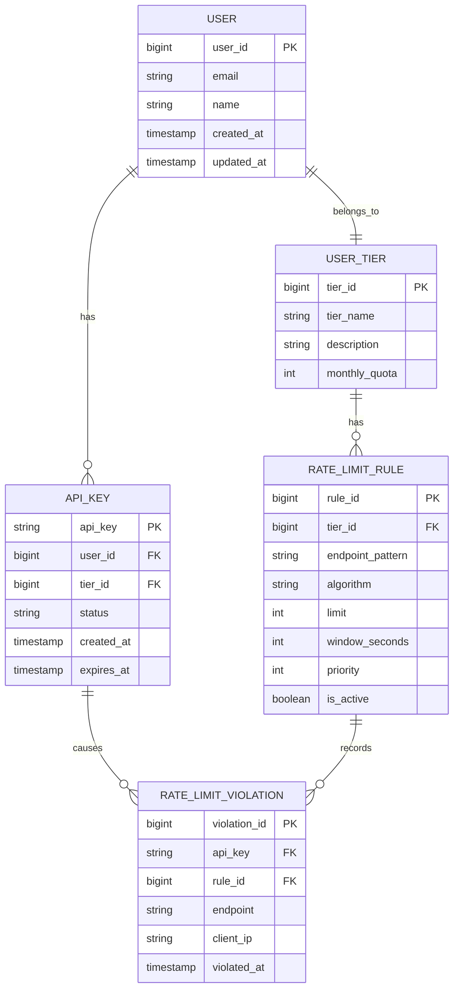
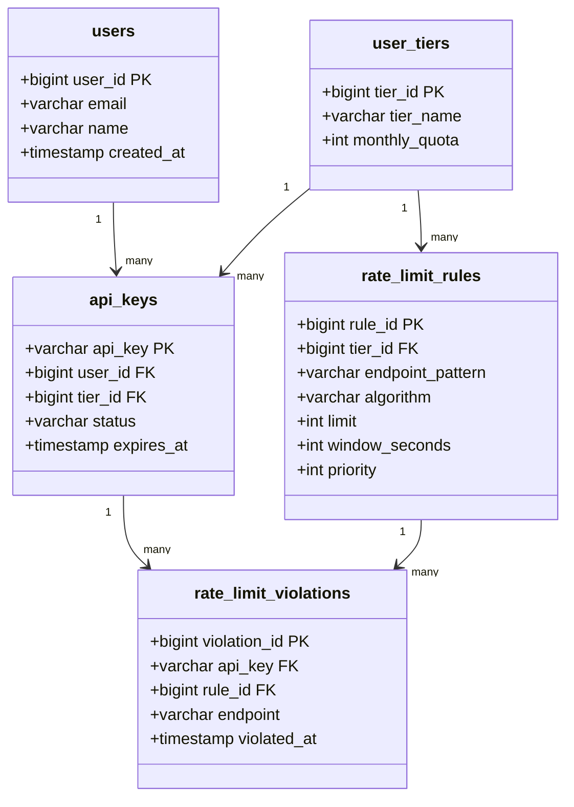
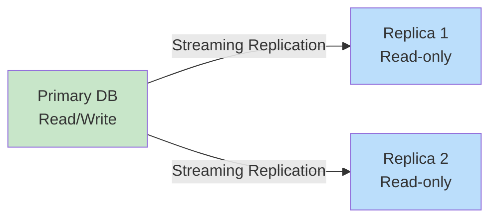

# Step 4: Database & Storage Design

## Overview

So far, we've designed the rate limiting logic and algorithms. But where do we store:
- ✅ Rate limit **rules** (configurations)?
- ✅ User **tiers** and quotas?
- ✅ API **endpoint** patterns?
- ✅ **Historical** data for analytics?

In this section, we'll design the database schema for persistent storage.

---

## Storage Requirements Recap

From our requirements, we need to store:

**1. Configuration Data (Persistent)**
- Rate limit rules (per user tier, per endpoint)
- User tier information (Free, Premium, Enterprise)
- API key metadata
- Whitelist/blacklist rules

**2. Transient Data (Short-lived)**
- Rate limit counters (Redis - covered earlier)
- Request logs (for sliding window algorithms)

**3. Analytics Data (Optional)**
- Rate limit violations
- API usage metrics
- Historical trends

---

## Database Choice: SQL vs NoSQL

### Decision Matrix

| Requirement | SQL (PostgreSQL) | NoSQL (MongoDB) | Winner |
|-------------|------------------|-----------------|--------|
| **ACID Transactions** | ✅ Strong | ⚠️ Eventual | ✅ SQL |
| **Schema Changes** | ⚠️ Migrations needed | ✅ Flexible | NoSQL |
| **Complex Queries** | ✅ JOINs supported | ❌ Limited | SQL |
| **Horizontal Scaling** | ⚠️ Complex | ✅ Easy | NoSQL |
| **Consistency** | ✅ Strong | ⚠️ Eventual | SQL |
| **Read Performance** | ✅ Indexed | ✅ Fast | Tie |
| **Write Performance** | ⚠️ Moderate | ✅ Fast | NoSQL |

### Our Choice: **PostgreSQL (SQL)**

**Why SQL?**
- ✅ Rate limit rules rarely change (not write-heavy)
- ✅ Need ACID compliance (can't lose configuration)
- ✅ Complex queries (find rule by tier + endpoint pattern)
- ✅ Strong consistency (all servers must see same config)
- ✅ Industry standard (mature, well-supported)

**Use Case Fit:**
```
Configuration data = SQL ✅
Real-time counters = Redis ✅ (in-memory, fast)
Analytics/Logs = NoSQL/Data Lake ⚠️ (optional, can use ClickHouse, BigQuery)
```

---

## Entity-Relationship Diagram (ERD)



---

## Table Schemas (SQL)

### 1. Users Table

**Purpose:** Store user account information

```sql
CREATE TABLE users (
    user_id BIGSERIAL PRIMARY KEY,
    email VARCHAR(255) UNIQUE NOT NULL,
    name VARCHAR(255) NOT NULL,
    created_at TIMESTAMP DEFAULT CURRENT_TIMESTAMP,
    updated_at TIMESTAMP DEFAULT CURRENT_TIMESTAMP,

    -- Indexes
    INDEX idx_email (email)
);
```

**Sample Data:**
| user_id | email | name | created_at |
|---------|-------|------|------------|
| 1 | alice@example.com | Alice | 2025-01-01 10:00:00 |
| 2 | bob@example.com | Bob | 2025-01-02 11:30:00 |

---

### 2. User Tiers Table

**Purpose:** Define different pricing tiers (Free, Premium, Enterprise)

```sql
CREATE TABLE user_tiers (
    tier_id BIGSERIAL PRIMARY KEY,
    tier_name VARCHAR(50) UNIQUE NOT NULL,  -- 'free', 'premium', 'enterprise'
    description TEXT,
    monthly_quota INT NOT NULL,  -- Total requests per month
    created_at TIMESTAMP DEFAULT CURRENT_TIMESTAMP
);
```

**Sample Data:**
| tier_id | tier_name | description | monthly_quota |
|---------|-----------|-------------|---------------|
| 1 | free | Free tier | 10,000 |
| 2 | premium | Premium tier | 1,000,000 |
| 3 | enterprise | Enterprise tier | Unlimited (999999999) |

**Seed Data:**
```sql
INSERT INTO user_tiers (tier_name, description, monthly_quota) VALUES
    ('free', 'Free tier with basic features', 10000),
    ('premium', 'Premium tier with higher limits', 1000000),
    ('enterprise', 'Enterprise tier with unlimited requests', 999999999);
```

---

### 3. API Keys Table

**Purpose:** Store API keys for authentication and rate limiting

```sql
CREATE TABLE api_keys (
    api_key VARCHAR(64) PRIMARY KEY,  -- SHA-256 hash (64 chars)
    user_id BIGINT NOT NULL REFERENCES users(user_id) ON DELETE CASCADE,
    tier_id BIGINT NOT NULL REFERENCES user_tiers(tier_id),
    status VARCHAR(20) DEFAULT 'active',  -- 'active', 'revoked', 'expired'
    created_at TIMESTAMP DEFAULT CURRENT_TIMESTAMP,
    expires_at TIMESTAMP,  -- NULL = never expires
    last_used_at TIMESTAMP,

    -- Indexes
    INDEX idx_user_id (user_id),
    INDEX idx_status (status)
);
```

**Sample Data:**
| api_key | user_id | tier_id | status | expires_at |
|---------|---------|---------|--------|------------|
| abc123...789 | 1 | 1 | active | 2026-01-01 |
| xyz456...012 | 2 | 2 | active | NULL |

**Why hash the API key?**
```
Security best practice:
- Store only hash in database (like passwords)
- If database breached, attackers can't use raw keys
- Use SHA-256 or bcrypt for hashing
```

---

### 4. Rate Limit Rules Table

**Purpose:** Define rate limiting rules per tier and endpoint

```sql
CREATE TABLE rate_limit_rules (
    rule_id BIGSERIAL PRIMARY KEY,
    tier_id BIGINT NOT NULL REFERENCES user_tiers(tier_id) ON DELETE CASCADE,
    endpoint_pattern VARCHAR(255) NOT NULL,  -- '/api/v1/users', '/api/v1/*'
    algorithm VARCHAR(50) NOT NULL,  -- 'fixed_window', 'sliding_window', 'token_bucket'
    limit INT NOT NULL,  -- Max requests
    window_seconds INT NOT NULL,  -- Time window in seconds
    priority INT DEFAULT 0,  -- Higher priority = checked first
    is_active BOOLEAN DEFAULT TRUE,
    created_at TIMESTAMP DEFAULT CURRENT_TIMESTAMP,
    updated_at TIMESTAMP DEFAULT CURRENT_TIMESTAMP,

    -- Indexes
    INDEX idx_tier_endpoint (tier_id, endpoint_pattern),
    INDEX idx_priority (priority DESC)
);
```

**Sample Data:**

| rule_id | tier_id | endpoint_pattern | algorithm | limit | window_seconds | priority |
|---------|---------|------------------|-----------|-------|----------------|----------|
| 1 | 1 | /api/v1/* | sliding_window | 100 | 60 | 10 |
| 2 | 1 | /api/v1/auth/login | fixed_window | 5 | 60 | 100 |
| 3 | 2 | /api/v1/* | sliding_window | 1000 | 60 | 10 |
| 4 | 2 | /api/v1/upload | token_bucket | 50 | 60 | 50 |
| 5 | 3 | /api/v1/* | sliding_window | 10000 | 60 | 10 |

**Seed Data:**
```sql
-- Free tier rules
INSERT INTO rate_limit_rules (tier_id, endpoint_pattern, algorithm, limit, window_seconds, priority)
VALUES
    (1, '/api/v1/auth/login', 'fixed_window', 5, 60, 100),  -- 5 logins/min
    (1, '/api/v1/auth/*', 'fixed_window', 10, 60, 90),     -- 10 auth/min
    (1, '/api/v1/*', 'sliding_window', 100, 60, 10);       -- 100 general/min

-- Premium tier rules
INSERT INTO rate_limit_rules (tier_id, endpoint_pattern, algorithm, limit, window_seconds, priority)
VALUES
    (2, '/api/v1/upload', 'token_bucket', 50, 60, 50),    -- 50 uploads/min
    (2, '/api/v1/*', 'sliding_window', 1000, 60, 10);     -- 1000 general/min

-- Enterprise tier rules
INSERT INTO rate_limit_rules (tier_id, endpoint_pattern, algorithm, limit, window_seconds, priority)
VALUES
    (3, '/api/v1/*', 'sliding_window', 10000, 60, 10);    -- 10000 general/min
```

**Priority Explanation:**
```
When a request comes in, rules are checked in order of priority (highest first):

Example: POST /api/v1/auth/login (Free tier)
1. Check rule_id=2 (priority=100): /api/v1/auth/login → 5/min
2. If not matched, check rule_id=1 (priority=10): /api/v1/* → 100/min

This allows specific endpoints to override general rules!
```

---

### 5. Rate Limit Violations Table (Analytics)

**Purpose:** Log when rate limits are exceeded (for monitoring, abuse detection)

```sql
CREATE TABLE rate_limit_violations (
    violation_id BIGSERIAL PRIMARY KEY,
    api_key VARCHAR(64) NOT NULL REFERENCES api_keys(api_key),
    rule_id BIGINT REFERENCES rate_limit_rules(rule_id),
    endpoint VARCHAR(255) NOT NULL,
    client_ip VARCHAR(45),  -- IPv4 or IPv6
    user_agent TEXT,
    violated_at TIMESTAMP DEFAULT CURRENT_TIMESTAMP,

    -- Partitioning by month for performance
    -- Partition key: violated_at
) PARTITION BY RANGE (violated_at);

-- Create monthly partitions
CREATE TABLE rate_limit_violations_2025_01 PARTITION OF rate_limit_violations
    FOR VALUES FROM ('2025-01-01') TO ('2025-02-01');

CREATE TABLE rate_limit_violations_2025_02 PARTITION OF rate_limit_violations
    FOR VALUES FROM ('2025-02-01') TO ('2025-03-01');

-- Indexes
CREATE INDEX idx_violations_api_key ON rate_limit_violations(api_key, violated_at DESC);
CREATE INDEX idx_violations_time ON rate_limit_violations(violated_at DESC);
```

**Why partitioning?**
```
Violations table can grow very large (millions of rows).
Partitioning by month:
- Faster queries (only scan relevant partition)
- Easy cleanup (DROP old partitions)
- Better performance for time-range queries
```

**Sample Data:**
| violation_id | api_key | endpoint | client_ip | violated_at |
|--------------|---------|----------|-----------|-------------|
| 1 | abc123...789 | /api/v1/users | 192.168.1.1 | 2025-01-15 10:30:00 |
| 2 | abc123...789 | /api/v1/posts | 192.168.1.1 | 2025-01-15 10:30:05 |

---

## Common Queries & Indexes

### Query 1: Find Rate Limit Rule for Request

**Use Case:** When a request comes in, find the matching rule.

```sql
-- Input: tier_id=1, endpoint='/api/v1/auth/login'

SELECT
    rule_id,
    endpoint_pattern,
    algorithm,
    limit,
    window_seconds
FROM rate_limit_rules
WHERE
    tier_id = 1
    AND is_active = TRUE
    AND endpoint_pattern IN (
        '/api/v1/auth/login',  -- Exact match
        '/api/v1/auth/*',      -- Pattern match
        '/api/v1/*'            -- Wildcard
    )
ORDER BY priority DESC
LIMIT 1;
```

**Result:**
| rule_id | endpoint_pattern | algorithm | limit | window_seconds |
|---------|------------------|-----------|-------|----------------|
| 2 | /api/v1/auth/login | fixed_window | 5 | 60 |

**Performance:**
- Index on `(tier_id, endpoint_pattern)` makes this O(1)
- Priority ordering ensures most specific rule is selected

---

### Query 2: Get User's API Key and Tier

**Use Case:** Authenticate request and determine rate limit tier.

```sql
-- Input: api_key='abc123...789'

SELECT
    ak.api_key,
    ak.user_id,
    ak.status,
    ut.tier_id,
    ut.tier_name,
    ut.monthly_quota
FROM api_keys ak
JOIN user_tiers ut ON ak.tier_id = ut.tier_id
WHERE
    ak.api_key = 'abc123...789'
    AND ak.status = 'active'
    AND (ak.expires_at IS NULL OR ak.expires_at > NOW());
```

**Result:**
| api_key | user_id | tier_id | tier_name | monthly_quota |
|---------|---------|---------|-----------|---------------|
| abc123...789 | 1 | 1 | free | 10,000 |

---

### Query 3: Count Violations in Last Hour

**Use Case:** Detect abuse patterns.

```sql
SELECT
    api_key,
    COUNT(*) AS violation_count,
    MAX(violated_at) AS last_violation
FROM rate_limit_violations
WHERE
    violated_at > NOW() - INTERVAL '1 hour'
GROUP BY api_key
HAVING COUNT(*) > 100  -- More than 100 violations in 1 hour
ORDER BY violation_count DESC;
```

**Result (Abuse Detection):**
| api_key | violation_count | last_violation |
|---------|-----------------|----------------|
| xyz456...012 | 543 | 2025-01-15 11:45:00 |

**Action:** Flag this API key for review or auto-revoke.

---

## Database Schema Diagram



---

## Caching Strategy for Database Queries

**Problem:** Querying the database for every request is slow (10-50ms).

**Solution:** Cache rate limit rules in Redis!

### Cache Layer

```python
class RateLimitRuleCache:
    def __init__(self, redis_client, db_connection):
        self.redis = redis_client
        self.db = db_connection
        self.cache_ttl = 300  # 5 minutes

    def get_rule(self, tier_id, endpoint):
        # Try cache first
        cache_key = f"rule:{tier_id}:{endpoint}"
        cached_rule = self.redis.get(cache_key)

        if cached_rule:
            # Cache hit
            return json.loads(cached_rule)

        # Cache miss - query database
        rule = self.db.execute("""
            SELECT rule_id, algorithm, limit, window_seconds
            FROM rate_limit_rules
            WHERE tier_id = %s
                AND is_active = TRUE
                AND %s LIKE endpoint_pattern
            ORDER BY priority DESC
            LIMIT 1
        """, (tier_id, endpoint)).fetchone()

        if rule:
            # Store in cache
            self.redis.setex(cache_key, self.cache_ttl, json.dumps(rule))

        return rule

    def invalidate(self, tier_id, endpoint):
        # When rule is updated, invalidate cache
        cache_key = f"rule:{tier_id}:{endpoint}"
        self.redis.delete(cache_key)
```

**Performance Improvement:**
```
Without cache: 10-50ms (database query)
With cache: 1-2ms (Redis lookup)
→ 10x faster!
```

**Cache Invalidation:**
```
When to invalidate:
1. Rate limit rule updated
2. User tier changed
3. Manual invalidation via admin panel

How:
DELETE FROM Redis: rule:{tier_id}:{endpoint}
```

---

## NoSQL Alternative (MongoDB)

If you prefer NoSQL, here's the equivalent schema:

### Users Collection

```json
{
  "_id": ObjectId("..."),
  "email": "alice@example.com",
  "name": "Alice",
  "tier": {
    "tier_id": 1,
    "tier_name": "free",
    "monthly_quota": 10000
  },
  "api_keys": [
    {
      "key": "abc123...789",
      "status": "active",
      "created_at": ISODate("2025-01-01T00:00:00Z"),
      "expires_at": ISODate("2026-01-01T00:00:00Z")
    }
  ],
  "created_at": ISODate("2025-01-01T00:00:00Z")
}
```

### Rate Limit Rules Collection

```json
{
  "_id": ObjectId("..."),
  "tier_id": 1,
  "endpoint_pattern": "/api/v1/auth/login",
  "algorithm": "fixed_window",
  "limit": 5,
  "window_seconds": 60,
  "priority": 100,
  "is_active": true
}
```

**Pros of NoSQL:**
- Flexible schema (easy to add fields)
- Embedded documents (no JOINs needed)
- Horizontal scaling

**Cons of NoSQL:**
- Eventual consistency (not ideal for rate limit config)
- Complex queries (pattern matching harder)
- No foreign key constraints

---

## Data Migration & Seeding

### Complete Setup Script

```sql
-- 1. Create tables
CREATE TABLE users (...);
CREATE TABLE user_tiers (...);
CREATE TABLE api_keys (...);
CREATE TABLE rate_limit_rules (...);
CREATE TABLE rate_limit_violations (...) PARTITION BY RANGE (violated_at);

-- 2. Seed tiers
INSERT INTO user_tiers (tier_name, description, monthly_quota) VALUES
    ('free', 'Free tier', 10000),
    ('premium', 'Premium tier', 1000000),
    ('enterprise', 'Enterprise tier', 999999999);

-- 3. Seed default rules
INSERT INTO rate_limit_rules (tier_id, endpoint_pattern, algorithm, limit, window_seconds, priority)
VALUES
    -- Free tier
    (1, '/api/v1/auth/login', 'fixed_window', 5, 60, 100),
    (1, '/api/v1/*', 'sliding_window', 100, 60, 10),

    -- Premium tier
    (2, '/api/v1/*', 'sliding_window', 1000, 60, 10),

    -- Enterprise tier
    (3, '/api/v1/*', 'sliding_window', 10000, 60, 10);

-- 4. Create sample user
INSERT INTO users (email, name) VALUES ('alice@example.com', 'Alice');

-- 5. Create API key for sample user
INSERT INTO api_keys (api_key, user_id, tier_id, status)
VALUES ('abc123def456', 1, 1, 'active');

-- 6. Create partitions for violations (current + next 3 months)
CREATE TABLE rate_limit_violations_2025_01 PARTITION OF rate_limit_violations
    FOR VALUES FROM ('2025-01-01') TO ('2025-02-01');
-- ... (repeat for more months)
```

---

## Backup & Disaster Recovery

### Backup Strategy

```sql
-- Daily full backup
pg_dump -h localhost -U postgres -d ratelimiter > backup_2025-01-15.sql

-- Continuous archiving (Point-in-Time Recovery)
-- Enable WAL archiving in postgresql.conf
archive_mode = on
archive_command = 'cp %p /mnt/backup/wal/%f'
```

### Replication



**Benefits:**
- High availability (automatic failover)
- Read scaling (distribute read queries to replicas)
- Disaster recovery (replicas in different regions)

---

## Storage Estimates

### Configuration Data

```
Users: 1 million × 200 bytes = 200 MB
API Keys: 1 million × 150 bytes = 150 MB
User Tiers: 10 rows × 100 bytes = 1 KB
Rate Limit Rules: 1000 rows × 300 bytes = 300 KB

Total: ~350 MB
```

### Violations Data (1 year)

```
Assumptions:
- 1% of requests violate rate limits
- 100 million requests/day
- 1 million violations/day

Storage per violation: 500 bytes
Storage per day: 1M × 500 bytes = 500 MB
Storage per year: 500 MB × 365 = 182.5 GB

With partitioning: Can drop old partitions to save space
Retention: 90 days → 500 MB × 90 = 45 GB
```

---

## Summary

✅ **Database Design Complete:**
- PostgreSQL for configuration (ACID, strong consistency)
- 5 core tables: users, user_tiers, api_keys, rate_limit_rules, violations
- Indexes for performance
- Partitioning for scalability

✅ **Caching Strategy:**
- Cache rules in Redis (10x faster)
- 5-minute TTL with invalidation

✅ **Scalability:**
- Partitioned violations table (time-based)
- Replication for high availability
- Read replicas for scaling

✅ **Analytics:**
- Violations table for abuse detection
- Time-series queries for trends

---

## Next Steps

In **Step 5**, we'll design the **API endpoints and data flows**:
- Rate limit management APIs
- Request flow diagrams
- Authentication & authorization
- Response headers

---

**Document Version:** 1.0
**Last Updated:** 2025-11-17
**Previous:** [Step 3: Rate Limiting Algorithms](./4_step3_rate_limiting_algorithms.md)
**Next:** [Step 5: API Design & Data Flow](./6_step5_api_design.md)
