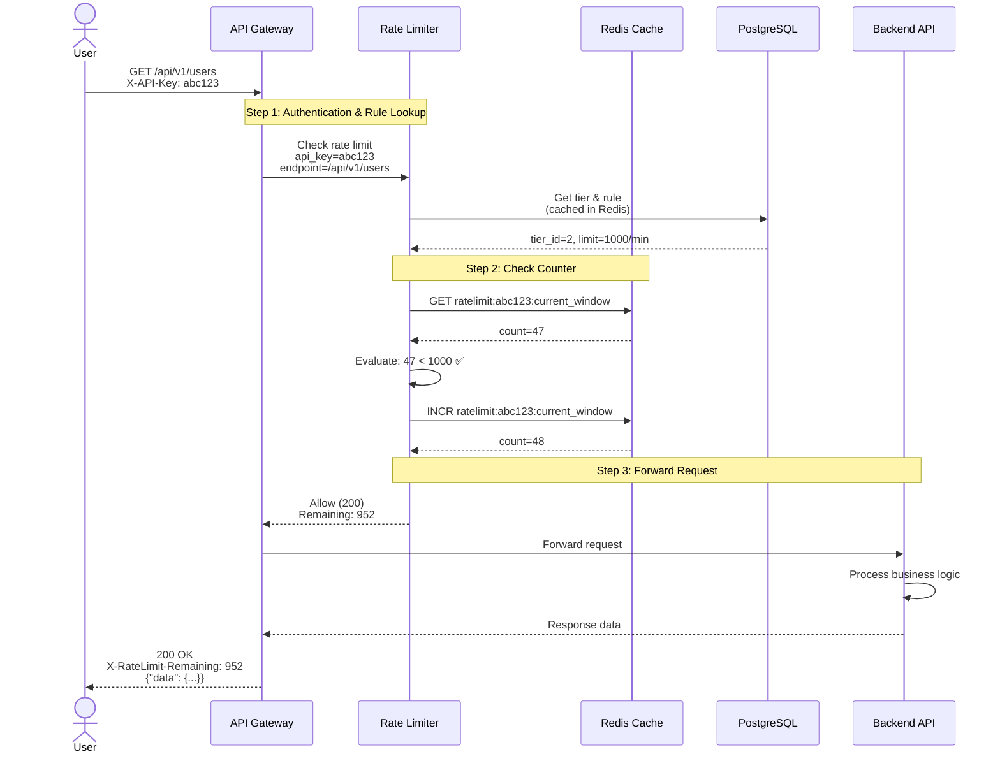
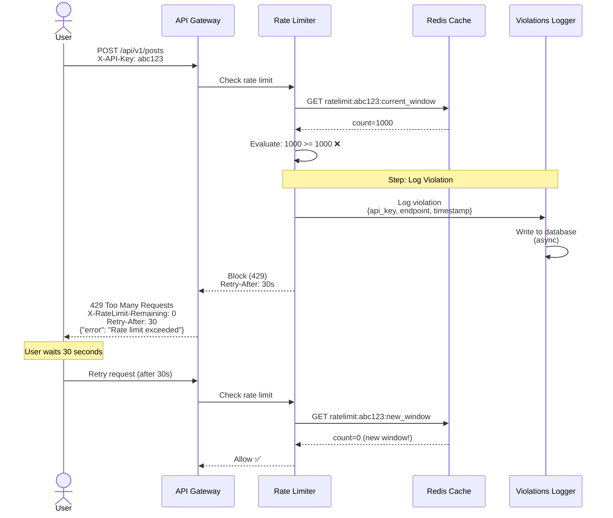
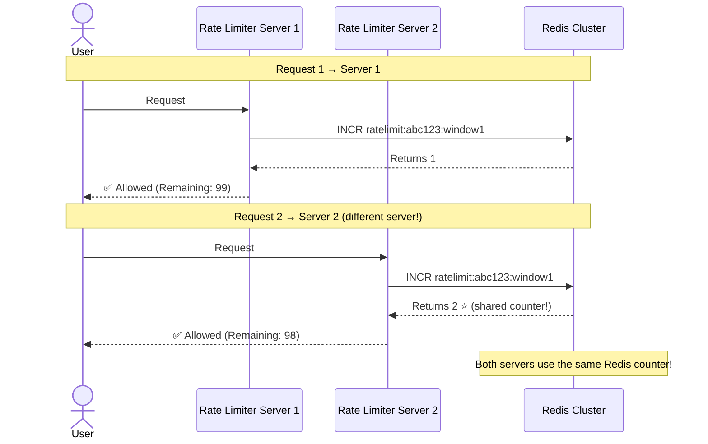
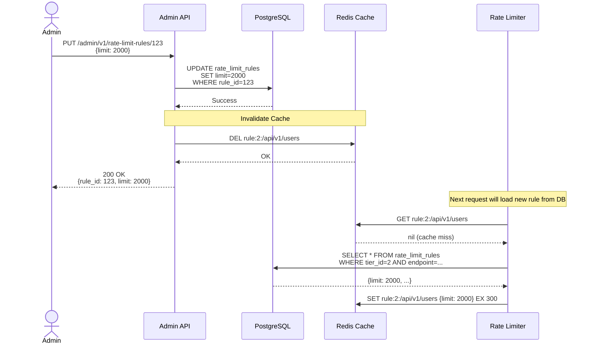
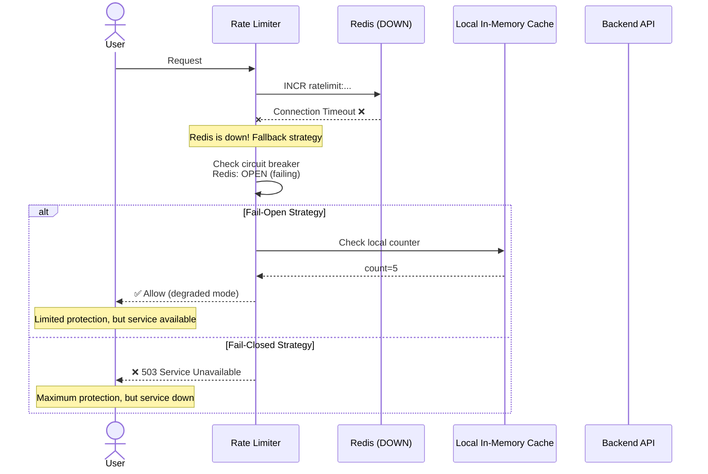

# Step 5: API Design & Data Flow

## Overview

In this section, we'll design:
1. **Rate Limiter APIs** - How applications interact with the rate limiter
2. **Management APIs** - How admins configure rate limits
3. **Data Flow Diagrams** - Step-by-step request flows with sequence diagrams
4. **Response Headers** - Standard rate limit headers
5. **Error Handling** - How to handle failures gracefully

---

## Part 1: Rate Limiter Integration

### How Applications Use the Rate Limiter

The rate limiter sits between the API Gateway and backend services. Applications don't call it directly - it's **middleware** that intercepts requests.

**Flow:**
```
Client → API Gateway → [Rate Limiter Middleware] → Backend API
```

---

## Part 2: Management APIs

These APIs allow administrators to configure rate limits.

### Base URL
```
https://api.example.com/admin/v1
```

### Authentication
```
Authorization: Bearer <admin_jwt_token>
```

---

### API 1: Create Rate Limit Rule

**Create a new rate limiting rule**

```http
POST /admin/v1/rate-limit-rules
Content-Type: application/json
Authorization: Bearer <token>

{
  "tier_id": 1,
  "endpoint_pattern": "/api/v1/uploads",
  "algorithm": "token_bucket",
  "limit": 50,
  "window_seconds": 60,
  "priority": 50
}
```

**Response (201 Created):**
```json
{
  "rule_id": 123,
  "tier_id": 1,
  "endpoint_pattern": "/api/v1/uploads",
  "algorithm": "token_bucket",
  "limit": 50,
  "window_seconds": 60,
  "priority": 50,
  "is_active": true,
  "created_at": "2025-01-15T10:30:00Z"
}
```

---

### API 2: Get All Rules for a Tier

**List all rate limit rules for a specific tier**

```http
GET /admin/v1/rate-limit-rules?tier_id=1
Authorization: Bearer <token>
```

**Response (200 OK):**
```json
{
  "tier_id": 1,
  "tier_name": "free",
  "rules": [
    {
      "rule_id": 1,
      "endpoint_pattern": "/api/v1/auth/login",
      "algorithm": "fixed_window",
      "limit": 5,
      "window_seconds": 60,
      "priority": 100
    },
    {
      "rule_id": 2,
      "endpoint_pattern": "/api/v1/*",
      "algorithm": "sliding_window",
      "limit": 100,
      "window_seconds": 60,
      "priority": 10
    }
  ],
  "total": 2
}
```

---

### API 3: Update Rate Limit Rule

**Modify an existing rule**

```http
PUT /admin/v1/rate-limit-rules/123
Content-Type: application/json
Authorization: Bearer <token>

{
  "limit": 75,
  "window_seconds": 60,
  "is_active": true
}
```

**Response (200 OK):**
```json
{
  "rule_id": 123,
  "tier_id": 1,
  "endpoint_pattern": "/api/v1/uploads",
  "algorithm": "token_bucket",
  "limit": 75,
  "window_seconds": 60,
  "updated_at": "2025-01-15T11:00:00Z"
}
```

**Side Effect:** Cache invalidation
```redis
DELETE rule:1:/api/v1/uploads
```

---

### API 4: Delete Rate Limit Rule

**Remove a rule**

```http
DELETE /admin/v1/rate-limit-rules/123
Authorization: Bearer <token>
```

**Response (204 No Content):**
```
(empty body)
```

---

### API 5: Create API Key

**Generate a new API key for a user**

```http
POST /admin/v1/api-keys
Content-Type: application/json
Authorization: Bearer <token>

{
  "user_id": 42,
  "tier_id": 2,
  "expires_at": "2026-01-15T00:00:00Z"
}
```

**Response (201 Created):**
```json
{
  "api_key": "ak_live_1234567890abcdef",
  "user_id": 42,
  "tier_id": 2,
  "tier_name": "premium",
  "status": "active",
  "created_at": "2025-01-15T10:30:00Z",
  "expires_at": "2026-01-15T00:00:00Z"
}
```

**Security Note:** Return the raw API key **only once**. Store only the hash in the database.

---

### API 6: Revoke API Key

**Deactivate an API key**

```http
POST /admin/v1/api-keys/{api_key}/revoke
Authorization: Bearer <token>
```

**Response (200 OK):**
```json
{
  "api_key": "ak_live_1234567890abcdef",
  "status": "revoked",
  "revoked_at": "2025-01-15T11:00:00Z"
}
```

---

### API 7: Get Rate Limit Usage (Analytics)

**Check how many requests a user has made**

```http
GET /admin/v1/usage/{api_key}?window=current
Authorization: Bearer <token>
```

**Response (200 OK):**
```json
{
  "api_key": "ak_live_1234567890abcdef",
  "tier": "premium",
  "current_window": {
    "window_start": "2025-01-15T11:00:00Z",
    "window_end": "2025-01-15T11:01:00Z",
    "requests_made": 47,
    "limit": 1000,
    "remaining": 953
  },
  "last_24_hours": {
    "total_requests": 12543,
    "violations": 3
  }
}
```

---

## Part 3: Standard Rate Limit Headers

All API responses should include rate limit information in headers.

### Response Headers

```http
X-RateLimit-Limit: 1000
X-RateLimit-Remaining: 953
X-RateLimit-Reset: 1735689720
X-RateLimit-Window: 60
```

**Header Definitions:**

| Header | Description | Example |
|--------|-------------|---------|
| `X-RateLimit-Limit` | Maximum requests in window | `1000` |
| `X-RateLimit-Remaining` | Requests remaining in current window | `953` |
| `X-RateLimit-Reset` | Unix timestamp when window resets | `1735689720` (2025-01-15 11:02:00) |
| `X-RateLimit-Window` | Window size in seconds | `60` |

**Example (Success - 200 OK):**
```http
HTTP/1.1 200 OK
Content-Type: application/json
X-RateLimit-Limit: 1000
X-RateLimit-Remaining: 953
X-RateLimit-Reset: 1735689720

{
  "data": { ... }
}
```

**Example (Rate Limited - 429):**
```http
HTTP/1.1 429 Too Many Requests
Content-Type: application/json
X-RateLimit-Limit: 1000
X-RateLimit-Remaining: 0
X-RateLimit-Reset: 1735689720
Retry-After: 30

{
  "error": {
    "code": "RATE_LIMIT_EXCEEDED",
    "message": "You have exceeded the rate limit of 1000 requests per minute",
    "retry_after_seconds": 30,
    "reset_at": "2025-01-15T11:02:00Z"
  }
}
```

---

## Part 4: Data Flow Diagrams

### Flow 1: Successful Request (Under Limit)



---

### Flow 2: Rate Limit Exceeded (Blocked Request)



---

### Flow 3: Distributed Rate Limiting (Multi-Server)

**Scenario:** User makes requests to different servers, but counters are shared via Redis.



---

### Flow 4: Cache Invalidation on Rule Update



---

### Flow 5: Failure Scenario (Redis Down)



---

## Part 5: Error Codes & Responses

### Standard Error Response Format

```json
{
  "error": {
    "code": "ERROR_CODE",
    "message": "Human-readable error message",
    "details": {
      "field": "additional context"
    }
  }
}
```

### Error Codes

| HTTP Status | Error Code | Description | Example |
|-------------|------------|-------------|---------|
| 400 | `INVALID_API_KEY` | API key format is invalid | Invalid key format |
| 401 | `MISSING_API_KEY` | No API key provided | X-API-Key header missing |
| 403 | `API_KEY_REVOKED` | API key has been revoked | Key was revoked on 2025-01-15 |
| 403 | `API_KEY_EXPIRED` | API key has expired | Key expired on 2025-01-14 |
| 429 | `RATE_LIMIT_EXCEEDED` | Rate limit exceeded | 1000 requests/min exceeded |
| 500 | `INTERNAL_ERROR` | Internal server error | Redis connection failed |
| 503 | `SERVICE_UNAVAILABLE` | Rate limiter is down | Rate limiter maintenance |

### Example Error Responses

**400 - Invalid API Key:**
```http
HTTP/1.1 400 Bad Request
Content-Type: application/json

{
  "error": {
    "code": "INVALID_API_KEY",
    "message": "The provided API key format is invalid. Expected format: ak_live_<32 chars>",
    "details": {
      "provided_key": "invalid123"
    }
  }
}
```

**403 - API Key Revoked:**
```http
HTTP/1.1 403 Forbidden
Content-Type: application/json

{
  "error": {
    "code": "API_KEY_REVOKED",
    "message": "This API key has been revoked and can no longer be used",
    "details": {
      "revoked_at": "2025-01-15T10:00:00Z",
      "reason": "User account suspended"
    }
  }
}
```

**429 - Rate Limit Exceeded:**
```http
HTTP/1.1 429 Too Many Requests
Content-Type: application/json
X-RateLimit-Limit: 1000
X-RateLimit-Remaining: 0
X-RateLimit-Reset: 1735689720
Retry-After: 42

{
  "error": {
    "code": "RATE_LIMIT_EXCEEDED",
    "message": "You have exceeded the rate limit of 1000 requests per minute",
    "details": {
      "limit": 1000,
      "window_seconds": 60,
      "reset_at": "2025-01-15T11:02:00Z",
      "retry_after_seconds": 42
    }
  }
}
```

---

## Part 6: Client Best Practices

### How Clients Should Handle Rate Limits

**1. Check Headers Before Request:**
```javascript
const rateLimitRemaining = parseInt(lastResponse.headers['x-ratelimit-remaining']);

if (rateLimitRemaining < 10) {
  console.warn('Approaching rate limit! Slow down requests.');
}
```

**2. Respect Retry-After:**
```javascript
async function makeRequest(url) {
  const response = await fetch(url, {
    headers: { 'X-API-Key': API_KEY }
  });

  if (response.status === 429) {
    const retryAfter = parseInt(response.headers['retry-after']);
    console.log(`Rate limited. Retrying after ${retryAfter} seconds...`);

    await sleep(retryAfter * 1000);
    return makeRequest(url);  // Retry
  }

  return response.json();
}
```

**3. Exponential Backoff (for 5xx errors):**
```javascript
async function makeRequestWithBackoff(url, maxRetries = 3) {
  for (let i = 0; i < maxRetries; i++) {
    const response = await fetch(url);

    if (response.ok) {
      return response.json();
    }

    if (response.status >= 500) {
      const delay = Math.pow(2, i) * 1000;  // 1s, 2s, 4s
      console.log(`Server error. Retrying in ${delay}ms...`);
      await sleep(delay);
    } else {
      throw new Error(`Request failed: ${response.status}`);
    }
  }
}
```

**4. Batching Requests:**
```javascript
// Instead of 100 individual requests:
for (let i = 0; i < 100; i++) {
  await fetch(`/api/users/${i}`);  // ❌ 100 rate limit hits
}

// Use batch endpoint:
await fetch('/api/users/batch', {
  method: 'POST',
  body: JSON.stringify({ user_ids: [1, 2, 3, ..., 100] })
});  // ✅ 1 rate limit hit
```

---

## Part 7: Monitoring & Observability APIs

### API 8: Health Check

```http
GET /health
```

**Response (200 OK):**
```json
{
  "status": "healthy",
  "components": {
    "redis": "healthy",
    "database": "healthy",
    "rate_limiter": "healthy"
  },
  "timestamp": "2025-01-15T11:00:00Z"
}
```

**Response (503 Service Unavailable):**
```json
{
  "status": "unhealthy",
  "components": {
    "redis": "unhealthy",
    "database": "healthy",
    "rate_limiter": "degraded"
  },
  "errors": [
    "Redis connection timeout"
  ]
}
```

---

### API 9: Metrics Endpoint (Prometheus Format)

```http
GET /metrics
```

**Response (200 OK):**
```
# HELP rate_limiter_requests_total Total requests processed
# TYPE rate_limiter_requests_total counter
rate_limiter_requests_total{status="allowed"} 1523451
rate_limiter_requests_total{status="blocked"} 12034

# HELP rate_limiter_latency_seconds Request processing latency
# TYPE rate_limiter_latency_seconds histogram
rate_limiter_latency_seconds_bucket{le="0.001"} 1200000
rate_limiter_latency_seconds_bucket{le="0.005"} 1500000
rate_limiter_latency_seconds_bucket{le="0.01"} 1535000

# HELP redis_connection_pool_size Current Redis connections
# TYPE redis_connection_pool_size gauge
redis_connection_pool_size 45
```

---

## Summary

✅ **API Design Complete:**
- Management APIs for CRUD operations on rules
- Standard rate limit headers (X-RateLimit-*)
- Comprehensive error handling

✅ **Data Flows Documented:**
- Successful request flow
- Rate limit exceeded flow
- Distributed rate limiting
- Cache invalidation
- Failure scenarios

✅ **Client Best Practices:**
- Respect Retry-After header
- Exponential backoff
- Request batching

✅ **Observability:**
- Health checks
- Metrics endpoints
- Structured error responses

---

## Next Steps

In **Step 6**, we'll create the **final complete architecture diagram** integrating all components:
- API Gateway
- Rate Limiter cluster
- Redis cluster
- PostgreSQL with replication
- Monitoring & alerting
- Multi-region deployment

---

**Document Version:** 1.0
**Last Updated:** 2025-11-17
**Previous:** [Step 4: Database & Storage Design](./5_step4_database_design.md)
**Next:** [Step 6: Final Complete Architecture](./7_step6_final_architecture.md)
