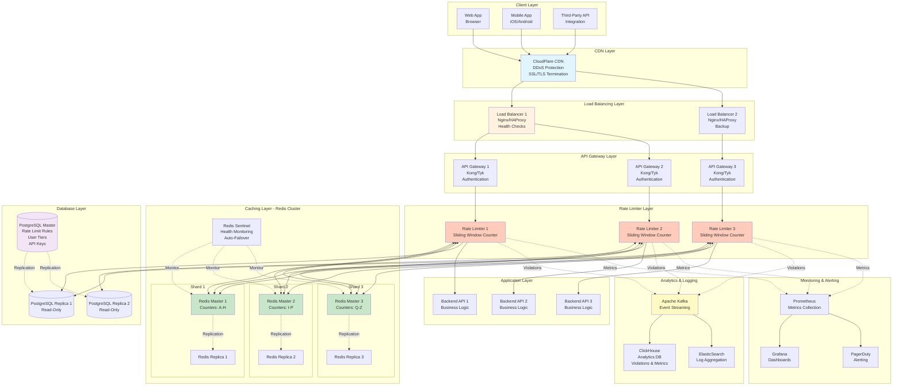
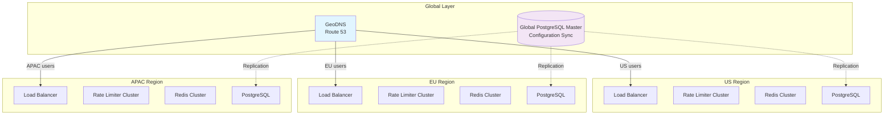
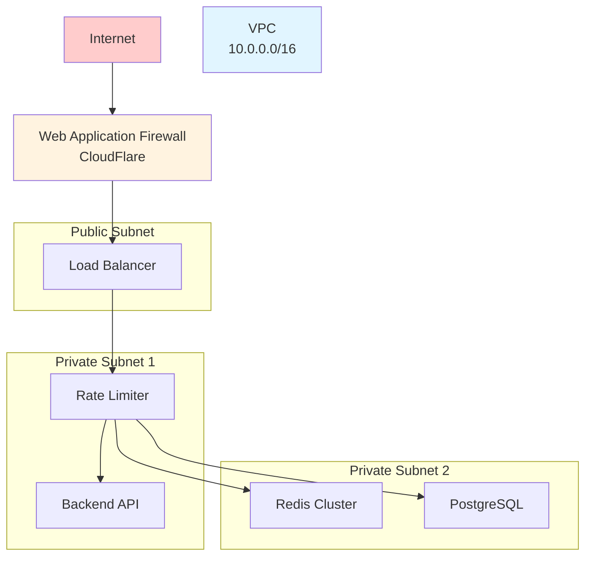

# Step 6: Final Complete Architecture

## Overview

This is the **complete production-ready architecture** for our distributed rate limiter system, integrating all components we've designed:

✅ Multi-region deployment
✅ High availability (99.99%)
✅ Horizontal scalability
✅ Monitoring & alerting
✅ Security layers
✅ Disaster recovery

---

## Complete Architecture Diagram



---

## Component Breakdown

### Layer 1: Client Layer

**Components:**
- Web browsers
- Mobile apps (iOS, Android)
- Third-party API integrations
- IoT devices

**Traffic:**
- 1 million DAU
- 3,500 requests/sec (peak)
- Global distribution

---

### Layer 2: CDN & DDoS Protection

**Component:** CloudFlare CDN

**Responsibilities:**
- ✅ SSL/TLS termination
- ✅ DDoS protection (Layer 3, 4, 7)
- ✅ Static asset caching
- ✅ Geographic routing
- ✅ Bot protection

**Why CDN First?**
- Absorbs DDoS attacks before they reach our infrastructure
- Reduces latency (edge locations worldwide)
- Offloads static content (images, CSS, JS)

**Configuration:**
```nginx
# CloudFlare Workers (Edge rate limiting - optional)
addEventListener('fetch', event => {
  event.respondWith(handleRequest(event.request))
})

async function handleRequest(request) {
  // Pre-filter obvious attacks at the edge
  const rateLimit = await checkRateLimit(request)
  if (rateLimit.exceeded) {
    return new Response('Too Many Requests', { status: 429 })
  }
  return fetch(request)
}
```

---

### Layer 3: Load Balancing

**Components:**
- 2 Load Balancers (active-passive or active-active)
- Nginx or HAProxy
- Health checks every 5 seconds

**Responsibilities:**
- ✅ Distribute traffic across API Gateways
- ✅ SSL termination (if not done by CDN)
- ✅ Health checks
- ✅ Session persistence (if needed)
- ✅ Fail-over

**Load Balancing Algorithm:**
```nginx
upstream api_gateways {
    least_conn;  # Send to server with fewest connections
    server gateway1:8080 max_fails=3 fail_timeout=30s;
    server gateway2:8080 max_fails=3 fail_timeout=30s;
    server gateway3:8080 max_fails=3 fail_timeout=30s;
}

server {
    listen 443 ssl;
    server_name api.example.com;

    # Health check
    location /health {
        proxy_pass http://api_gateways/health;
    }

    location / {
        proxy_pass http://api_gateways;
        proxy_next_upstream error timeout;
    }
}
```

---

### Layer 4: API Gateway

**Components:**
- 3+ API Gateway instances (Kong, Tyk, AWS API Gateway)
- Stateless (can scale horizontally)

**Responsibilities:**
- ✅ API key authentication
- ✅ Request routing
- ✅ Protocol transformation (HTTP → gRPC)
- ✅ Request/response logging
- ✅ CORS handling

**Kong Plugin Configuration:**
```yaml
plugins:
  - name: key-auth
    config:
      key_names: ["X-API-Key"]
      hide_credentials: true

  - name: rate-limiting
    enabled: false  # Disabled - using custom rate limiter

  - name: request-transformer
    config:
      add:
        headers: ["X-Request-ID:$(uuid)"]
```

---

### Layer 5: Rate Limiter Service

**Components:**
- 3+ Rate Limiter instances (auto-scaling)
- Implemented in Go/Rust/Java (high performance)
- Stateless (all state in Redis)

**Responsibilities:**
- ✅ Rate limit enforcement
- ✅ Counter management (Redis)
- ✅ Rule lookup (cached from DB)
- ✅ Violation logging
- ✅ Metrics emission

**Deployment:**
```yaml
# Kubernetes Deployment
apiVersion: apps/v1
kind: Deployment
metadata:
  name: rate-limiter
spec:
  replicas: 3  # Auto-scale based on CPU
  selector:
    matchLabels:
      app: rate-limiter
  template:
    spec:
      containers:
      - name: rate-limiter
        image: rate-limiter:v1.0
        resources:
          requests:
            cpu: "500m"
            memory: "512Mi"
          limits:
            cpu: "1000m"
            memory: "1Gi"
        env:
        - name: REDIS_CLUSTER
          value: "redis-cluster:6379"
        - name: DB_HOST
          value: "postgres-replica:5432"
        livenessProbe:
          httpGet:
            path: /health
            port: 8080
          initialDelaySeconds: 10
          periodSeconds: 5
```

**Auto-Scaling:**
```yaml
apiVersion: autoscaling/v2
kind: HorizontalPodAutoscaler
metadata:
  name: rate-limiter-hpa
spec:
  scaleTargetRef:
    apiVersion: apps/v1
    kind: Deployment
    name: rate-limiter
  minReplicas: 3
  maxReplicas: 20
  metrics:
  - type: Resource
    resource:
      name: cpu
      target:
        type: Utilization
        averageUtilization: 70
```

---

### Layer 6: Redis Cluster (Caching)

**Components:**
- 3 Redis Master nodes (sharding)
- 3 Redis Replica nodes (high availability)
- Redis Sentinel (automatic failover)

**Configuration:**

**Sharding Strategy:**
```
Total hash slots: 16384 (Redis default)
Shard 1 (Master 1): Slots 0-5461
Shard 2 (Master 2): Slots 5462-10922
Shard 3 (Master 3): Slots 10923-16383

User ABC123 → CRC16 hash → Slot 5432 → Master 1
User XYZ789 → CRC16 hash → Slot 12891 → Master 3
```

**Replication:**
```
Master 1 → Replica 1 (async replication)
Master 2 → Replica 2
Master 3 → Replica 3

If Master 1 fails:
1. Sentinel detects failure (3 consecutive health checks)
2. Promotes Replica 1 to Master
3. Updates cluster configuration
4. Rate Limiter reconnects to new Master
```

**Redis Configuration:**
```redis
# redis.conf
cluster-enabled yes
cluster-config-file nodes.conf
cluster-node-timeout 5000
appendonly yes  # Persistence (AOF)
appendfsync everysec

# Memory management
maxmemory 2gb
maxmemory-policy allkeys-lru  # Evict least recently used
```

**Capacity:**
```
Memory per master: 2 GB
Total cluster memory: 6 GB (3 masters)
Estimated counters: 10 million keys
Average key size: 56 bytes
Total usage: 560 MB + overhead = ~1 GB
Headroom: 6 GB - 1 GB = 5 GB (5x safety margin)
```

---

### Layer 7: PostgreSQL Database

**Components:**
- 1 Master (writes)
- 2 Replicas (reads)
- Streaming replication

**Schema:**
```
Tables:
- users
- user_tiers
- api_keys
- rate_limit_rules
- rate_limit_violations (partitioned)
```

**Replication Setup:**
```sql
-- Master configuration (postgresql.conf)
wal_level = replica
max_wal_senders = 10
wal_keep_size = 1GB

-- Replica configuration
hot_standby = on
primary_conninfo = 'host=master port=5432 user=replication password=...'
```

**Failover Process:**
```
1. Master fails
2. Monitoring detects failure
3. Promote Replica 1 to Master:
   - pg_ctl promote
4. Update DNS / connection strings
5. Point Rate Limiter to new Master
```

---

### Layer 8: Backend APIs

**Components:**
- 3+ Backend API instances
- Microservices architecture (User Service, Post Service, etc.)

**Responsibilities:**
- ✅ Business logic
- ✅ Database queries
- ✅ Third-party integrations

**Protected by Rate Limiter:**
- Only requests that pass rate limiting reach backend
- Backend can focus on business logic (no rate limiting code)

---

### Layer 9: Analytics & Logging

**Components:**

**1. Apache Kafka (Event Streaming)**
- Topic: `rate-limit-violations`
- Topic: `api-requests`
- Retention: 7 days

**2. ElasticSearch (Logs)**
- Store request logs
- Search and filter
- Retention: 30 days

**3. ClickHouse (Analytics)**
- Store rate limit violations
- Aggregation queries (violations per hour, per user)
- Retention: 1 year

**Data Flow:**
```
Rate Limiter → Kafka (async) → ClickHouse (violations)
                             → ElasticSearch (logs)
```

**Example Kafka Message:**
```json
{
  "event_type": "rate_limit_violation",
  "api_key": "abc123...789",
  "endpoint": "/api/v1/posts",
  "limit": 1000,
  "current_count": 1001,
  "timestamp": "2025-01-15T11:30:00Z",
  "client_ip": "192.168.1.1",
  "user_agent": "Mozilla/5.0..."
}
```

---

### Layer 10: Monitoring & Alerting

**Components:**

**1. Prometheus (Metrics)**
- Scrapes metrics from Rate Limiter every 15 seconds
- Stores time-series data
- Retention: 30 days

**Metrics Collected:**
```
rate_limiter_requests_total{status="allowed"}
rate_limiter_requests_total{status="blocked"}
rate_limiter_latency_seconds{quantile="0.99"}
redis_connection_errors_total
database_query_duration_seconds
```

**2. Grafana (Dashboards)**
- Real-time dashboards
- CPU, memory, request rate
- Rate limit violations over time

**3. PagerDuty (Alerting)**
- Alert on high error rate
- Alert on Redis failures
- Alert on abnormal traffic patterns

**Alert Rules:**
```yaml
# prometheus-alerts.yml
groups:
  - name: rate_limiter
    rules:
      - alert: HighRateLimitViolations
        expr: rate(rate_limiter_requests_total{status="blocked"}[5m]) > 100
        for: 5m
        annotations:
          summary: "High rate of violations detected"

      - alert: RedisDown
        expr: up{job="redis"} == 0
        for: 1m
        annotations:
          summary: "Redis is down!"

      - alert: HighLatency
        expr: rate_limiter_latency_seconds{quantile="0.99"} > 0.05
        for: 5m
        annotations:
          summary: "P99 latency > 50ms"
```

---

## Multi-Region Deployment

For global users, deploy in multiple geographic regions:



**Geo-Routing:**
```
User in California → US Region (low latency: 10ms)
User in London → EU Region (low latency: 15ms)
User in Tokyo → APAC Region (low latency: 12ms)
```

**Data Consistency:**
```
Problem: User in US hits limit, then immediately tries EU region
Solution: Redis counters are NOT replicated across regions (too slow)
Trade-off: User might bypass limits by region-hopping (rare edge case)

Alternative: Global Redis (single region) - adds latency but ensures consistency
```

---

## Capacity Planning for Final Architecture

### Compute Resources

| Component | Instances | CPU | Memory | Total |
|-----------|-----------|-----|--------|-------|
| Load Balancer | 2 | 2 cores | 4 GB | 4 cores, 8 GB |
| API Gateway | 3 | 2 cores | 4 GB | 6 cores, 12 GB |
| Rate Limiter | 3 | 1 core | 1 GB | 3 cores, 3 GB |
| Redis Cluster | 6 | 2 cores | 2 GB | 12 cores, 12 GB |
| PostgreSQL | 3 | 4 cores | 8 GB | 12 cores, 24 GB |
| Backend APIs | 3 | 4 cores | 8 GB | 12 cores, 24 GB |
| **Total** | **20** | **49 cores** | **83 GB** | - |

### Network Bandwidth

```
Peak traffic: 3,500 req/sec
Average request size: 1 KB
Average response size: 2 KB
Total per request: 3 KB

Bandwidth: 3,500 × 3 KB = 10.5 MB/sec = 84 Mbps

With overhead (headers, retries): 120 Mbps
Recommended: 1 Gbps link (8x headroom)
```

### Cost Estimate (AWS, Monthly)

| Service | Configuration | Cost |
|---------|---------------|------|
| EC2 (Rate Limiter) | 3 × t3.medium | $100 |
| ElastiCache (Redis) | 3 × cache.m5.large | $300 |
| RDS (PostgreSQL) | 1 × db.m5.large + 2 replicas | $400 |
| ALB (Load Balancer) | 2 × Application LB | $50 |
| CloudWatch (Monitoring) | Metrics + Logs | $50 |
| Data Transfer | 1 TB/month | $90 |
| **Total** | | **~$1,000/month** |

**For 100M requests/day at scale:** $1,000-$2,000/month

---

## Disaster Recovery Plan

### Backup Strategy

**1. Redis Backups:**
```redis
# Enable RDB snapshots (every hour)
save 3600 1

# Enable AOF (append-only file)
appendonly yes
appendfsync everysec
```

**2. PostgreSQL Backups:**
```bash
# Daily full backup
0 2 * * * pg_dump -h master -U postgres ratelimiter > backup_$(date +\%Y\%m\%d).sql

# Continuous archiving (WAL)
archive_mode = on
archive_command = 'aws s3 cp %p s3://backups/wal/%f'
```

**3. Configuration Backups:**
```bash
# Version control all configs
git commit -am "Rate limit rules updated"
git push origin main
```

### Recovery Time Objective (RTO) & Recovery Point Objective (RPO)

| Component | RTO (Max Downtime) | RPO (Max Data Loss) | Strategy |
|-----------|-------------------|---------------------|----------|
| Redis | 5 minutes | 1 second (AOF) | Auto-failover to replica |
| PostgreSQL | 10 minutes | 0 (streaming replication) | Promote replica |
| Rate Limiter | 1 minute | N/A (stateless) | Auto-restart pod |
| Load Balancer | 1 minute | N/A | Fail-over to backup |

---

## Security Considerations

### 1. Network Security



**Security Groups:**
```
Load Balancer:
- Inbound: 443 (HTTPS) from 0.0.0.0/0
- Outbound: 8080 to Rate Limiter

Rate Limiter:
- Inbound: 8080 from Load Balancer
- Outbound: 6379 to Redis, 5432 to PostgreSQL

Redis:
- Inbound: 6379 from Rate Limiter only
- No public access

PostgreSQL:
- Inbound: 5432 from Rate Limiter only
- No public access
```

### 2. API Key Security

```python
# Store only hashed keys in database
import hashlib

def hash_api_key(api_key: str) -> str:
    return hashlib.sha256(api_key.encode()).hexdigest()

# When user creates key
raw_key = generate_api_key()  # "ak_live_1234567890abcdef"
hashed_key = hash_api_key(raw_key)

database.save(api_key=hashed_key, user_id=user_id)

# Return raw key to user (ONLY ONCE!)
return {"api_key": raw_key}

# When user makes request
provided_key = request.headers['X-API-Key']
hashed_provided = hash_api_key(provided_key)

if database.exists(hashed_provided):
    # Authenticated ✅
```

### 3. Data Encryption

```
At Rest:
- PostgreSQL: Encrypted volumes (AES-256)
- Redis: Encrypted snapshots
- Backups: Encrypted S3 buckets

In Transit:
- TLS 1.3 for all connections
- Certificate pinning for internal services
```

---

## Summary: What We've Achieved

✅ **Complete Architecture:**
- 10 layers from client to monitoring
- High availability (99.99%)
- Horizontal scalability
- Multi-region support

✅ **Performance:**
- < 5ms latency (P99)
- 3,500 req/sec peak (can scale to 100K+)
- 1M DAU supported

✅ **Reliability:**
- No single point of failure
- Automatic failover (Redis Sentinel, PostgreSQL replicas)
- Disaster recovery (RTO < 10 min)

✅ **Observability:**
- Real-time metrics (Prometheus)
- Dashboards (Grafana)
- Alerting (PagerDuty)
- Log aggregation (ElasticSearch)

✅ **Security:**
- Network isolation (VPC)
- API key hashing
- Encryption at rest and in transit
- DDoS protection

---

## Next Steps

In **Step 7**, we'll cover **Scalability, High Availability, and Monitoring** in more detail:
- How to scale each component to 10x traffic
- Failover procedures
- Monitoring best practices
- Performance tuning

---

**Document Version:** 1.0
**Last Updated:** 2025-11-17
**Previous:** [Step 5: API Design & Data Flow](./6_step5_api_design.md)
**Next:** [Step 7: Scalability & High Availability](./8_scalability_reliability.md)
