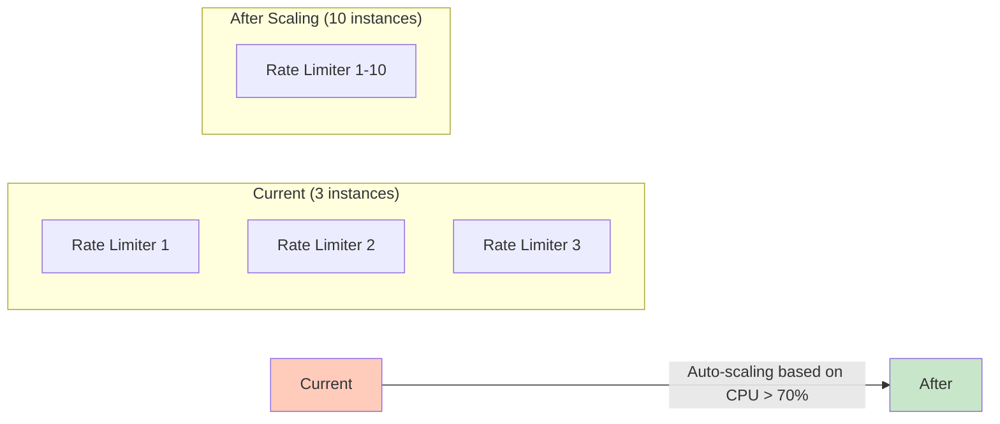
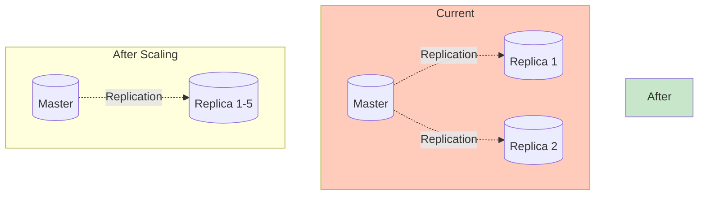
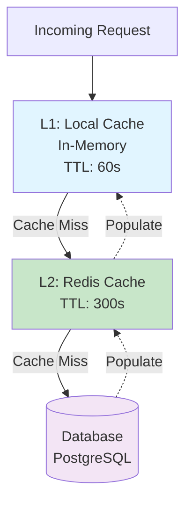
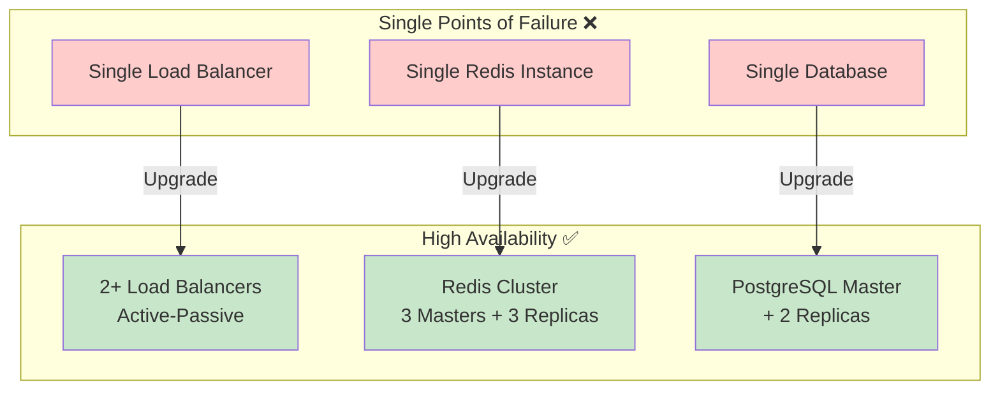
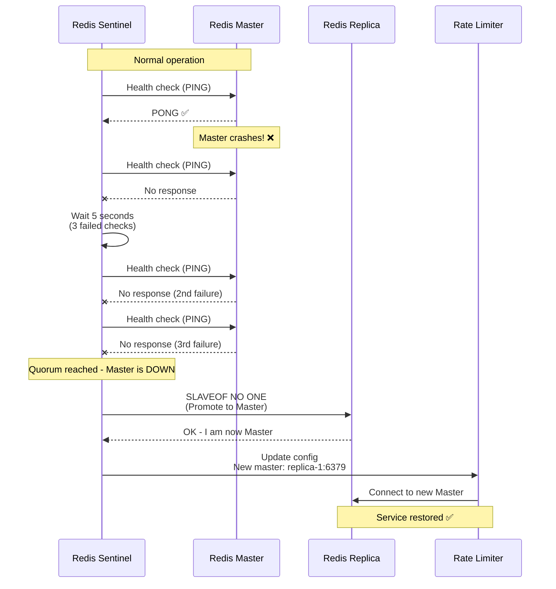
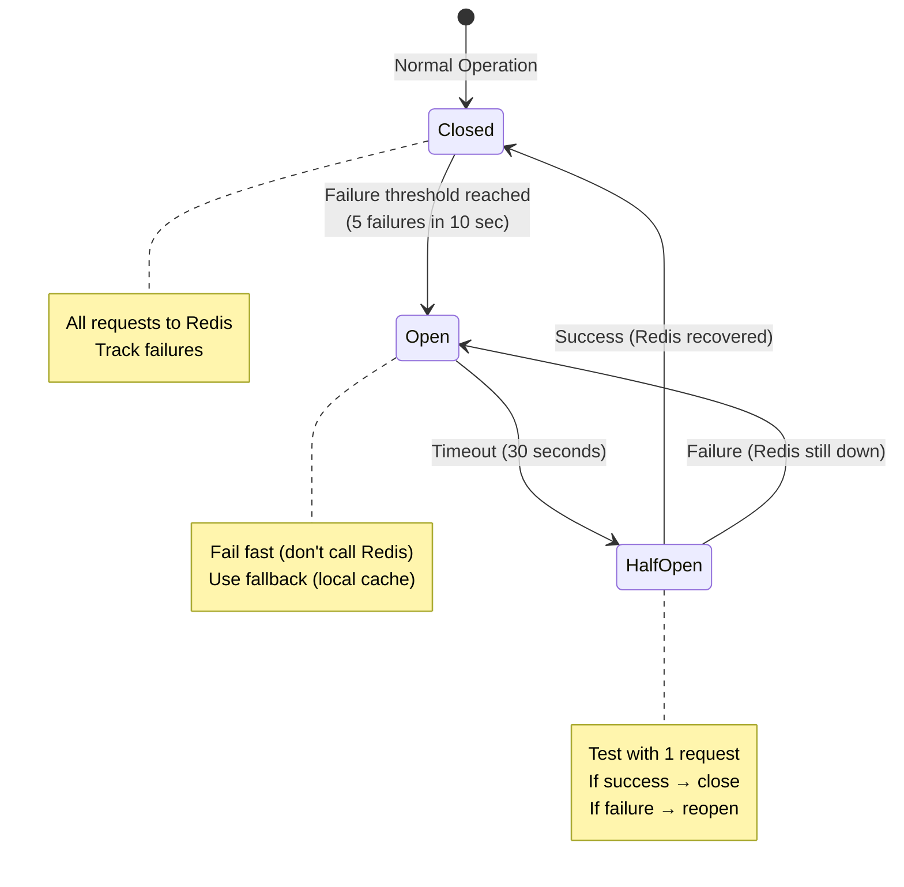
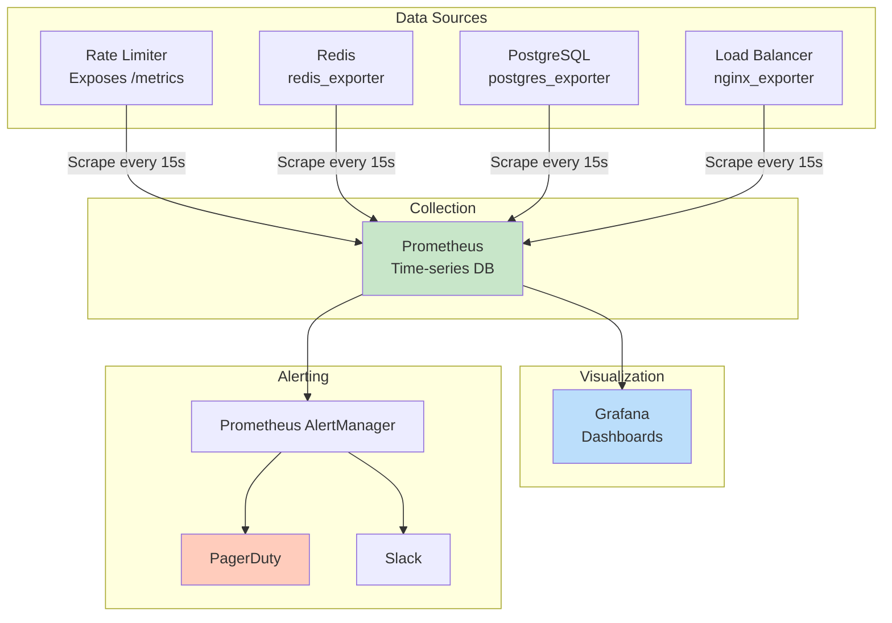

# Scalability, High Availability & Monitoring

## Overview

This document covers how to:
1. **Scale** the rate limiter from 1M to 100M DAU
2. **Ensure high availability** (99.99% uptime)
3. **Monitor** performance and detect issues
4. **Handle failures** gracefully

---

## Part 1: Scalability Strategies

### Current Capacity vs Target

| Metric | Current (V1) | Target (10x) | Strategy |
|--------|--------------|--------------|----------|
| **DAU** | 1M | 10M | Horizontal scaling |
| **Requests/sec** | 3,500 | 35,000 | Add more instances |
| **Redis memory** | 2 GB | 20 GB | Add more shards |
| **DB size** | 350 MB | 3.5 GB | Read replicas |
| **Bandwidth** | 84 Mbps | 840 Mbps | CDN + edge caching |

---

### Scaling Strategy 1: Horizontal Scaling (Add More Instances)

**Rate Limiter Instances:**



**Auto-Scaling Configuration (Kubernetes):**
```yaml
apiVersion: autoscaling/v2
kind: HorizontalPodAutoscaler
metadata:
  name: rate-limiter-hpa
spec:
  scaleTargetRef:
    apiVersion: apps/v1
    kind: Deployment
    name: rate-limiter
  minReplicas: 3
  maxReplicas: 50  # Can scale up to 50 instances
  metrics:
  - type: Resource
    resource:
      name: cpu
      target:
        type: Utilization
        averageUtilization: 70
  - type: Pods
    pods:
      metric:
        name: rate_limiter_requests_per_second
      target:
        type: AverageValue
        averageValue: "10000"  # Scale if >10K req/sec per pod
```

**Scaling Triggers:**
- CPU > 70% → Add 1 instance
- Requests/sec > 10,000 per instance → Add instances
- Redis latency > 10ms → Add Redis shards

**Cost:**
```
Current: 3 instances × $30/month = $90/month
10x traffic: 10 instances × $30/month = $300/month
→ Linear cost scaling ✅
```

---

### Scaling Strategy 2: Redis Cluster Expansion

**Current: 3 Shards (6 instances)**

```
Shard 1: 0-5461 (33.3% of keys)
Shard 2: 5462-10922 (33.3% of keys)
Shard 3: 10923-16383 (33.3% of keys)

Total memory: 6 GB
Max keys: ~10 million
```

**After 10x Growth: 9 Shards (18 instances)**

```
Shard 1-9: Each handles ~11% of keys
Total memory: 18 GB
Max keys: ~100 million
```

**Resharding Process:**
```bash
# Add new shard (Master 4 + Replica 4)
redis-cli --cluster add-node new-master-4:6379 existing-master-1:6379

# Rebalance hash slots
redis-cli --cluster rebalance existing-master-1:6379 --cluster-use-empty-masters

# This redistributes keys across all shards
# Zero downtime - Redis handles migration automatically
```

**Performance Impact:**
```
Before resharding:
- 10M keys across 3 shards = 3.3M keys per shard
- Latency: ~2ms

After resharding:
- 100M keys across 9 shards = 11M keys per shard
- Latency: ~2ms (same, because load is distributed)
```

---

### Scaling Strategy 3: Database Read Replicas

**Problem:** High read load on database (rule lookups)

**Solution:** Add more read replicas



**Read Distribution:**
```python
# Round-robin reads across replicas
read_replicas = [
    "postgres-replica-1:5432",
    "postgres-replica-2:5432",
    "postgres-replica-3:5432",
    "postgres-replica-4:5432",
    "postgres-replica-5:5432"
]

current_replica = 0

def get_rule(tier_id, endpoint):
    global current_replica

    # Route reads to replicas
    replica = read_replicas[current_replica]
    current_replica = (current_replica + 1) % len(read_replicas)

    return query_database(replica, "SELECT * FROM rate_limit_rules WHERE ...")

def update_rule(rule_id, new_limit):
    # All writes go to master
    return query_database("postgres-master:5432", "UPDATE rate_limit_rules SET ...")
```

**Benefits:**
- Distribute read load across 5 replicas
- Master handles only writes (< 1% of traffic)
- Each replica: 3,500 / 5 = 700 req/sec (well within capacity)

---

### Scaling Strategy 4: Caching Layer Optimization

**Problem:** Database queries for rules (even with replicas) add latency

**Solution:** Multi-level caching



**Implementation:**
```python
class MultiLevelCache:
    def __init__(self):
        self.local_cache = {}  # In-memory (per instance)
        self.redis_client = redis.Redis()
        self.db_client = psycopg2.connect()

    def get_rule(self, tier_id, endpoint):
        key = f"rule:{tier_id}:{endpoint}"

        # L1: Check local cache (fastest)
        if key in self.local_cache:
            entry = self.local_cache[key]
            if entry['expires_at'] > time.time():
                return entry['data']  # ⚡ < 0.1ms

        # L2: Check Redis cache
        cached = self.redis_client.get(key)
        if cached:
            data = json.loads(cached)
            # Populate L1
            self.local_cache[key] = {
                'data': data,
                'expires_at': time.time() + 60
            }
            return data  # ⚡ 1-2ms

        # L3: Query database
        data = self.db_client.execute(
            "SELECT * FROM rate_limit_rules WHERE ..."
        ).fetchone()  # 10-50ms

        # Populate L2
        self.redis_client.setex(key, 300, json.dumps(data))

        # Populate L1
        self.local_cache[key] = {
            'data': data,
            'expires_at': time.time() + 60
        }

        return data
```

**Performance Gains:**
```
Without caching: 10-50ms (database query)
With L2 (Redis): 1-2ms (90% faster)
With L1 (Local): < 0.1ms (99% faster!)

Cache hit rate:
- L1: 80% (frequently accessed rules)
- L2: 15% (less frequent rules)
- DB: 5% (cache misses, new rules)

Average latency: (0.8 × 0.1ms) + (0.15 × 2ms) + (0.05 × 20ms) = 1.38ms
→ 10x improvement over direct DB queries!
```

---

## Part 2: High Availability (99.99% Uptime)

### Availability Calculation

**Target: 99.99% (Four Nines)**
```
Uptime: 99.99%
Downtime per year: 0.01% × 365 × 24 × 60 = 52.56 minutes
Downtime per month: 52.56 / 12 = 4.38 minutes
```

**How to achieve:**
1. No single point of failure
2. Automatic failover
3. Health checks
4. Circuit breakers
5. Graceful degradation

---

### HA Strategy 1: Eliminate Single Points of Failure



**Redundancy Checklist:**
- ✅ Load Balancer: 2 instances (active-passive)
- ✅ API Gateway: 3+ instances
- ✅ Rate Limiter: 3+ instances
- ✅ Redis: 3 masters + 3 replicas
- ✅ PostgreSQL: 1 master + 2 replicas
- ✅ Monitoring: Prometheus HA setup

---

### HA Strategy 2: Automatic Failover

**Redis Sentinel Failover:**



**Failover Time:**
```
Detection: 15 seconds (3 × 5 second checks)
Promotion: 2 seconds (SLAVEOF NO ONE)
Reconnection: 1 second
Total: ~18 seconds downtime per failover

With proper configuration: < 30 seconds
```

**PostgreSQL Failover:**
```bash
# Automatic failover with pg_auto_failover
pg_autoctl create monitor --hostname monitor.example.com
pg_autoctl create postgres --hostname primary.example.com
pg_autoctl create postgres --hostname standby.example.com

# Monitors health, promotes standby if primary fails
# Failover time: < 30 seconds
```

---

### HA Strategy 3: Health Checks

**Rate Limiter Health Check Endpoint:**
```python
@app.route('/health')
def health_check():
    health = {
        "status": "healthy",
        "components": {},
        "timestamp": datetime.utcnow().isoformat()
    }

    # Check Redis
    try:
        redis_client.ping()
        health["components"]["redis"] = "healthy"
    except Exception as e:
        health["components"]["redis"] = "unhealthy"
        health["status"] = "unhealthy"

    # Check Database
    try:
        db_client.execute("SELECT 1")
        health["components"]["database"] = "healthy"
    except Exception as e:
        health["components"]["database"] = "unhealthy"
        health["status"] = "degraded"

    # Check self
    health["components"]["rate_limiter"] = "healthy"

    status_code = 200 if health["status"] == "healthy" else 503
    return jsonify(health), status_code
```

**Load Balancer Health Check Configuration:**
```nginx
upstream rate_limiters {
    server rate-limiter-1:8080 max_fails=3 fail_timeout=30s;
    server rate-limiter-2:8080 max_fails=3 fail_timeout=30s;
    server rate-limiter-3:8080 max_fails=3 fail_timeout=30s;

    # Health check every 5 seconds
    check interval=5000 rise=2 fall=3 timeout=3000 type=http;
    check_http_send "GET /health HTTP/1.0\r\n\r\n";
    check_http_expect_alive http_2xx;
}
```

---

### HA Strategy 4: Circuit Breaker Pattern

**Problem:** If Redis is slow, all requests get queued and timeout

**Solution:** Circuit breaker opens after threshold, fails fast



**Implementation:**
```python
from circuitbreaker import circuit

class RateLimiterWithCircuitBreaker:
    @circuit(failure_threshold=5, recovery_timeout=30)
    def check_redis_counter(self, user_id):
        # This method is protected by circuit breaker
        count = redis_client.incr(f"ratelimit:{user_id}")
        return count

    def is_allowed(self, user_id):
        try:
            count = self.check_redis_counter(user_id)
            return count <= LIMIT
        except CircuitBreakerOpen:
            # Circuit is open - Redis is down
            # Fallback: Use local in-memory cache (degraded mode)
            print("Circuit open! Falling back to local cache")
            return local_cache.is_allowed(user_id)
```

**Benefits:**
- Prevents cascade failures
- Fast failure (no waiting for timeout)
- Automatic recovery
- Service remains available (degraded)

---

## Part 3: Monitoring & Observability

### Monitoring Stack



---

### Key Metrics to Monitor

**1. Request Metrics:**
```
rate_limiter_requests_total{status="allowed"}
rate_limiter_requests_total{status="blocked"}

Query:
rate(rate_limiter_requests_total[5m])  # Requests/sec over last 5 min

Dashboard:
- Line graph: Requests/sec over time
- Pie chart: Allowed vs Blocked
```

**2. Latency Metrics:**
```
rate_limiter_latency_seconds{quantile="0.5"}   # P50
rate_limiter_latency_seconds{quantile="0.99"}  # P99
rate_limiter_latency_seconds{quantile="0.999"} # P999

Query:
histogram_quantile(0.99, rate(rate_limiter_latency_seconds_bucket[5m]))

Alert:
P99 latency > 10ms for 5 minutes → PagerDuty
```

**3. Redis Metrics:**
```
redis_connected_clients
redis_memory_used_bytes
redis_commands_processed_total
redis_keyspace_hits_total
redis_keyspace_misses_total

Cache Hit Rate:
redis_keyspace_hits_total / (redis_keyspace_hits_total + redis_keyspace_misses_total)

Alert:
Cache hit rate < 80% → Investigate
Memory usage > 90% → Add shards
```

**4. Database Metrics:**
```
pg_stat_database_tup_fetched  # Rows read
pg_stat_database_tup_updated  # Rows updated
pg_stat_database_conflicts    # Replication conflicts
pg_replication_lag_seconds    # Replica lag

Alert:
Replication lag > 10 seconds → Warning
Replication lag > 60 seconds → Critical
```

**5. Error Metrics:**
```
rate_limiter_errors_total{type="redis_timeout"}
rate_limiter_errors_total{type="db_connection"}
rate_limiter_errors_total{type="invalid_api_key"}

Query:
sum(rate(rate_limiter_errors_total[5m])) by (type)

Alert:
Error rate > 1% of total requests → PagerDuty
```

---

### Sample Grafana Dashboard

**Panel 1: Request Rate**
```promql
# Allowed requests/sec
rate(rate_limiter_requests_total{status="allowed"}[5m])

# Blocked requests/sec
rate(rate_limiter_requests_total{status="blocked"}[5m])
```

**Panel 2: Latency Percentiles**
```promql
# P50, P99, P999
histogram_quantile(0.50, rate(rate_limiter_latency_seconds_bucket[5m]))
histogram_quantile(0.99, rate(rate_limiter_latency_seconds_bucket[5m]))
histogram_quantile(0.999, rate(rate_limiter_latency_seconds_bucket[5m]))
```

**Panel 3: Redis Health**
```promql
# Memory usage
redis_memory_used_bytes / redis_memory_max_bytes

# Cache hit rate
rate(redis_keyspace_hits_total[5m]) / (
  rate(redis_keyspace_hits_total[5m]) + rate(redis_keyspace_misses_total[5m])
)
```

**Panel 4: Error Rate**
```promql
# % of requests that error
rate(rate_limiter_errors_total[5m]) / rate(rate_limiter_requests_total[5m]) * 100
```

---

### Alert Rules

**alerts.yml:**
```yaml
groups:
  - name: rate_limiter
    interval: 30s
    rules:
      # High latency
      - alert: HighLatency
        expr: histogram_quantile(0.99, rate(rate_limiter_latency_seconds_bucket[5m])) > 0.01
        for: 5m
        labels:
          severity: warning
        annotations:
          summary: "P99 latency is {{ $value }}s (threshold: 10ms)"
          description: "Rate limiter is slow. Check Redis and DB performance."

      # High error rate
      - alert: HighErrorRate
        expr: rate(rate_limiter_errors_total[5m]) / rate(rate_limiter_requests_total[5m]) > 0.01
        for: 2m
        labels:
          severity: critical
        annotations:
          summary: "Error rate is {{ $value }}% (threshold: 1%)"

      # Redis down
      - alert: RedisDown
        expr: up{job="redis"} == 0
        for: 1m
        labels:
          severity: critical
        annotations:
          summary: "Redis is down!"
          description: "Immediate action required. Check Redis cluster."

      # High violation rate (potential attack)
      - alert: SuspiciousActivity
        expr: rate(rate_limiter_requests_total{status="blocked"}[5m]) > 1000
        for: 5m
        labels:
          severity: warning
        annotations:
          summary: "High rate of violations ({{ $value }} req/sec)"
          description: "Possible DDoS or abuse. Investigate top violators."
```

---

## Part 4: Performance Tuning

### Tuning 1: Redis Optimization

**Enable Pipelining:**
```python
# Instead of multiple round-trips:
for user_id in user_ids:
    redis_client.incr(f"ratelimit:{user_id}")  # ❌ N network calls

# Use pipeline (batch):
pipe = redis_client.pipeline()
for user_id in user_ids:
    pipe.incr(f"ratelimit:{user_id}")
pipe.execute()  # ✅ 1 network call

# Speedup: 10x faster for batch operations
```

**Connection Pooling:**
```python
# Reuse connections instead of creating new ones
redis_pool = redis.ConnectionPool(
    host='redis-cluster',
    port=6379,
    max_connections=50,
    socket_keepalive=True,
    socket_connect_timeout=0.5
)

redis_client = redis.Redis(connection_pool=redis_pool)
```

---

### Tuning 2: Database Query Optimization

**Add Indexes:**
```sql
-- Speed up rule lookups
CREATE INDEX idx_rules_tier_endpoint ON rate_limit_rules(tier_id, endpoint_pattern);

-- Speed up API key lookups
CREATE INDEX idx_api_keys_status ON api_keys(status) WHERE status = 'active';

-- Partial index (only active keys)
-- Smaller index = faster lookups
```

**Query Optimization:**
```sql
-- ❌ Slow (full table scan)
SELECT * FROM rate_limit_rules WHERE endpoint_pattern LIKE '%/api/v1/%';

-- ✅ Fast (index scan)
SELECT * FROM rate_limit_rules
WHERE tier_id = 1 AND endpoint_pattern = '/api/v1/users'
LIMIT 1;
```

---

## Summary

✅ **Scalability:**
- Horizontal scaling (3 → 50 instances)
- Redis cluster expansion (3 → 9 shards)
- Database read replicas (2 → 5)
- Multi-level caching (L1 + L2 + DB)

✅ **High Availability:**
- No single points of failure
- Automatic failover (< 30 seconds)
- Circuit breaker pattern
- Graceful degradation

✅ **Monitoring:**
- Prometheus + Grafana dashboards
- Real-time alerts (PagerDuty)
- Key metrics (latency, errors, violations)
- Log aggregation (ElasticSearch)

✅ **Performance:**
- P99 latency < 10ms
- 99.99% availability
- Can scale to 100M+ DAU

---

## Next Steps

In **Step 10 (Final)**, we'll cover:
- Interview Q&A (15-20 common questions)
- Common beginner mistakes
- Summary of design decisions
- Learning checklist

---

**Document Version:** 1.0
**Last Updated:** 2025-11-17
**Previous:** [Step 6: Final Architecture](./7_step6_final_architecture.md)
**Next:** [Interview Q&A & Summary](./9_interview_qa_and_summary.md)
