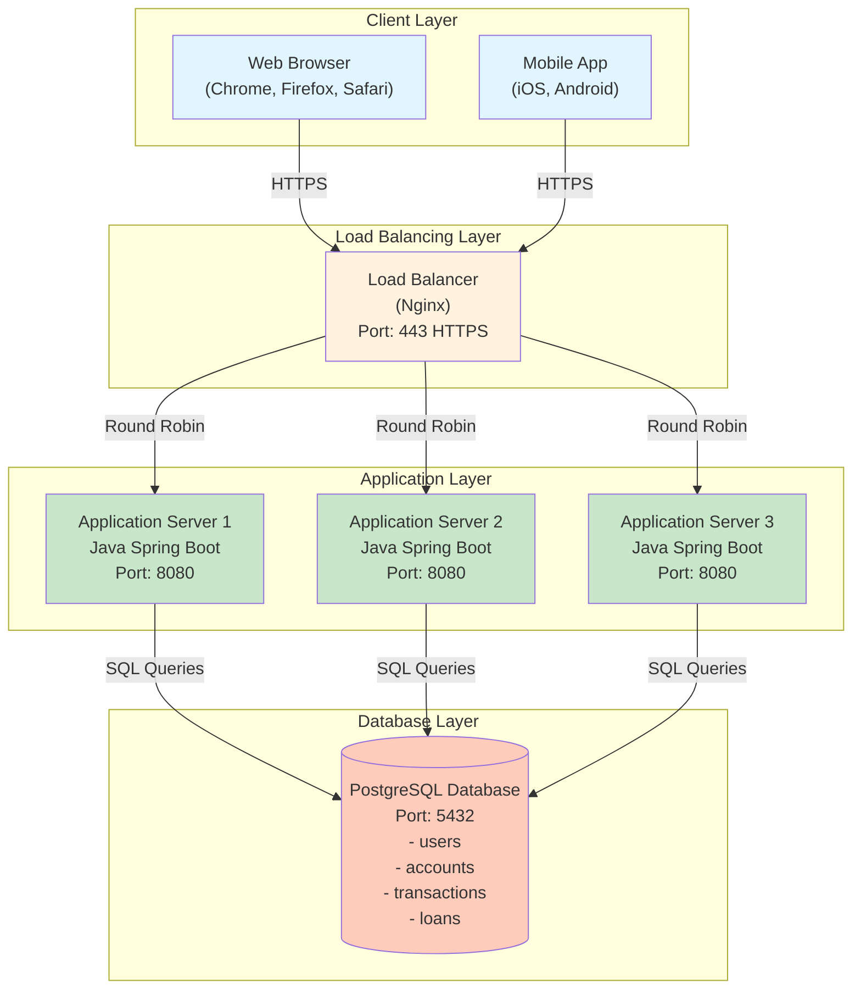
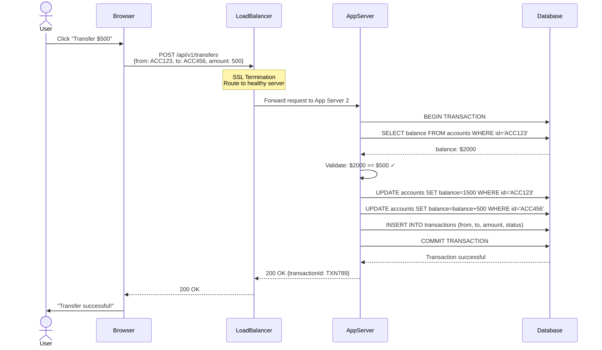
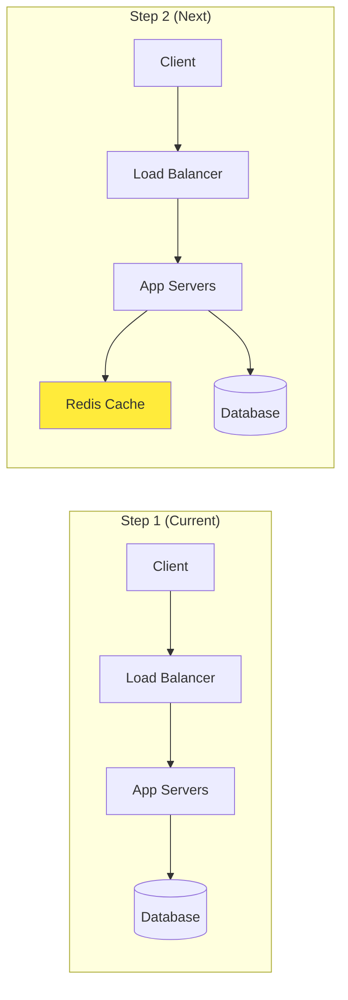

# Phase 2: Basic Architecture (Step 1)

## What We're Building in Step 1

In this step, we create the **foundational architecture** for our bank web application. This is the simplest architecture that can handle basic banking operations.

**Components**:
1. Client (User's browser/mobile app)
2. Load Balancer (Nginx)
3. Application Servers (Java Spring Boot)
4. Database (PostgreSQL)

---

## Step 1 Architecture Diagram



---

## Request Flow Example (Fund Transfer)

Let's trace a **fund transfer request** through our architecture:



---

## Component Deep Dive

### 1. Client Layer (User Devices)

**What it is**:
- The user's interface to interact with the bank
- Can be a web browser (Chrome, Firefox) or mobile app (iOS, Android)

**Responsibilities**:
- Display user interface (balance, transaction history)
- Capture user input (transfer amount, beneficiary)
- Send HTTPS requests to the backend
- Handle user authentication (login, MFA)

**Technologies**:
- **Web**: React.js or Angular (Single Page Application)
- **Mobile**:
  - iOS: Swift/SwiftUI
  - Android: Kotlin/Jetpack Compose

**Why This Matters**:
- Users never directly connect to the database (security)
- All communication happens over encrypted HTTPS (data protection)
- Client validates input before sending to server (better UX)

---

### 2. Load Balancer (Nginx)

**What it is**:
- The "traffic cop" that distributes incoming requests across multiple application servers
- Entry point for all client requests

**Key Responsibilities**:

**a) Distribute Load (Round Robin)**
```
Request 1 → App Server 1
Request 2 → App Server 2
Request 3 → App Server 3
Request 4 → App Server 1 (cycle repeats)
```

**b) SSL/TLS Termination**
```
Client ----[HTTPS (encrypted)]----> Load Balancer
Load Balancer ----[HTTP (internal)]----> App Servers

Benefit: App servers don't need to handle encryption (faster)
```

**c) Health Checks**
```
Every 10 seconds:
- Load Balancer: "App Server 2, are you healthy?"
- App Server 2 crashes (no response)
- Load Balancer: "Remove Server 2 from pool"
- Routes traffic only to Server 1 and 3
```

**d) Rate Limiting**
```
User A: 100 requests/minute → ✓ Allow
User B: 1000 requests/minute → ❌ Block (potential attack)
```

**Configuration Example (Nginx)**:
```nginx
upstream backend {
    server app1.example.com:8080 max_fails=3 fail_timeout=30s;
    server app2.example.com:8080 max_fails=3 fail_timeout=30s;
    server app3.example.com:8080 max_fails=3 fail_timeout=30s;
}

server {
    listen 443 ssl;
    server_name api.mybank.com;

    ssl_certificate /path/to/cert.pem;
    ssl_certificate_key /path/to/key.pem;
    ssl_protocols TLSv1.2 TLSv1.3;

    location /api/ {
        proxy_pass http://backend;
        proxy_set_header Host $host;
        proxy_set_header X-Real-IP $remote_addr;
    }
}
```

**Why We Need It**:
- **High Availability**: If one server crashes, others handle traffic
- **Scalability**: Add more servers during peak load (salary days)
- **Security**: Single point to enforce SSL, rate limiting, DDoS protection

---

### 3. Application Servers (Java Spring Boot)

**What it is**:
- The "brain" of the application
- Contains all business logic for banking operations

**Key Responsibilities**:

**a) Authentication & Authorization**
```java
@PostMapping("/api/v1/login")
public ResponseEntity<?> login(@RequestBody LoginRequest request) {
    // 1. Validate credentials
    User user = userService.validateCredentials(request.getEmail(), request.getPassword());

    // 2. Generate JWT token
    String token = jwtService.generateToken(user);

    // 3. Send OTP for MFA
    otpService.sendOTP(user.getPhone());

    return ResponseEntity.ok(new LoginResponse(token, "OTP sent"));
}
```

**b) Business Logic Validation**
```java
@PostMapping("/api/v1/transfers")
public ResponseEntity<?> transferFunds(@RequestBody TransferRequest request) {
    // 1. Validate sufficient balance
    Account fromAccount = accountService.getAccount(request.getFromAccountId());
    if (fromAccount.getBalance() < request.getAmount()) {
        throw new InsufficientBalanceException("Balance too low");
    }

    // 2. Validate daily limit
    BigDecimal todayTransfers = transactionService.getTodayTotal(fromAccount);
    if (todayTransfers.add(request.getAmount()).compareTo(DAILY_LIMIT) > 0) {
        throw new DailyLimitExceededException("Daily limit exceeded");
    }

    // 3. Execute transfer (in database transaction)
    Transaction txn = transactionService.executeTransfer(request);

    return ResponseEntity.ok(txn);
}
```

**c) Database Operations**
```java
@Transactional
public Transaction executeTransfer(TransferRequest request) {
    // Debit from source account
    accountRepository.updateBalance(
        request.getFromAccountId(),
        request.getAmount().negate()
    );

    // Credit to destination account
    accountRepository.updateBalance(
        request.getToAccountId(),
        request.getAmount()
    );

    // Record transaction
    Transaction txn = new Transaction();
    txn.setFromAccount(request.getFromAccountId());
    txn.setToAccount(request.getToAccountId());
    txn.setAmount(request.getAmount());
    txn.setStatus(TransactionStatus.SUCCESS);

    return transactionRepository.save(txn);
}
```

**Why Java Spring Boot?**

| Feature | Benefit for Banking |
|---------|---------------------|
| **Transaction Management** | Built-in `@Transactional` for ACID compliance |
| **Security** | Spring Security for authentication, authorization |
| **Mature Ecosystem** | Banks prefer stable, battle-tested frameworks |
| **Enterprise Support** | Large community, extensive documentation |
| **Performance** | JVM optimizations, connection pooling |

**Server Specifications** (for 10,000 concurrent users):
- **CPU**: 4 cores per server
- **RAM**: 8 GB per server
- **Count**: 3 servers (can scale to 5-10 during peak)
- **JVM Settings**: `-Xms4G -Xmx6G` (heap size)

---

### 4. Database (PostgreSQL)

**What it is**:
- Persistent storage for all banking data
- ACID-compliant relational database

**Why PostgreSQL?**

| Factor | PostgreSQL | MySQL | MongoDB (NoSQL) |
|--------|------------|-------|-----------------|
| **ACID Compliance** | ✓ Strong | ✓ Strong | ❌ Eventual consistency |
| **Complex Queries** | ✓ Excellent (JOINs) | ✓ Good | ❌ Limited |
| **JSON Support** | ✓ Native JSON | Partial | ✓ Native |
| **Banking Use Case** | ✓ Perfect | ✓ Good | ❌ Not suitable |
| **Transaction Safety** | ✓ Excellent | ✓ Good | ❌ Limited |

**Banking Needs ACID**:
```
Scenario: Transfer $500 from Account A to Account B

Without ACID (MongoDB - eventual consistency):
1. Deduct $500 from Account A ✓
2. [Server crashes before step 3]
3. Add $500 to Account B ❌ (never happens)
Result: $500 disappears! ❌

With ACID (PostgreSQL):
BEGIN TRANSACTION;
  UPDATE accounts SET balance = balance - 500 WHERE id = 'A';
  UPDATE accounts SET balance = balance + 500 WHERE id = 'B';
COMMIT;  -- Both updates succeed or both rollback

If server crashes before COMMIT:
- Both updates are rolled back automatically
- Money is safe! ✓
```

**Key Tables** (we'll design schema in Phase 8):
```sql
-- users table
CREATE TABLE users (
    user_id VARCHAR(16) PRIMARY KEY,
    email VARCHAR(255) UNIQUE NOT NULL,
    password_hash VARCHAR(255) NOT NULL,
    created_at TIMESTAMP DEFAULT NOW()
);

-- accounts table
CREATE TABLE accounts (
    account_id VARCHAR(16) PRIMARY KEY,
    user_id VARCHAR(16) REFERENCES users(user_id),
    account_type VARCHAR(20) NOT NULL,
    balance DECIMAL(15, 2) NOT NULL DEFAULT 0.00,
    status VARCHAR(20) DEFAULT 'ACTIVE'
);

-- transactions table
CREATE TABLE transactions (
    transaction_id VARCHAR(20) PRIMARY KEY,
    from_account VARCHAR(16) REFERENCES accounts(account_id),
    to_account VARCHAR(16) REFERENCES accounts(account_id),
    amount DECIMAL(15, 2) NOT NULL,
    status VARCHAR(20) NOT NULL,
    created_at TIMESTAMP DEFAULT NOW()
);
```

**Database Specifications**:
- **Storage**: 500 GB SSD (for 5 years of data)
- **RAM**: 16 GB (for buffer pool)
- **CPU**: 8 cores
- **IOPS**: 3000 (for fast reads/writes)
- **Backup**: Automated daily backups, 7-day retention

---

## Why This Architecture? (Step 1 Justification)

### Design Decisions

**Decision 1: Multiple Application Servers (3 servers)**

**Why?**
- **High Availability**: If one server crashes, 2 others continue serving traffic
- **Load Distribution**: 105 requests/sec ÷ 3 servers = 35 req/sec per server (manageable)
- **Zero-Downtime Deployments**: Update Server 1, then 2, then 3 (rolling deployment)

**Beginner Analogy**:
```
Single Server = Single cashier at bank (if sick, bank closes ❌)
Multiple Servers = 3 cashiers at bank (one sick, 2 still serve customers ✓)
```

---

**Decision 2: Load Balancer (Nginx)**

**Why?**
- **Single Entry Point**: Clients connect to one IP (load balancer IP)
- **Health Monitoring**: Automatically removes unhealthy servers
- **SSL Termination**: Centralized certificate management

**Without Load Balancer**:
```
Client needs to know all server IPs:
- If Server 1 is down, client gets error ❌
- Client must manually try Server 2 (bad UX)
```

**With Load Balancer**:
```
Client only knows Load Balancer IP:
- Load Balancer detects Server 1 down
- Automatically routes to Server 2 ✓
```

---

**Decision 3: PostgreSQL Database**

**Why?**
- **ACID Transactions**: Money cannot disappear (critical for banking)
- **Mature & Reliable**: Used by major banks globally
- **Complex Queries**: Support for JOINs (get user + accounts + transactions)

**Example Query (needs JOIN)**:
```sql
-- Get user's total balance across all accounts
SELECT
    u.name,
    SUM(a.balance) as total_balance
FROM users u
JOIN accounts a ON u.user_id = a.user_id
WHERE u.user_id = 'USR123'
GROUP BY u.name;

-- This is hard to do in NoSQL (MongoDB) without multiple queries
```

---

**Decision 4: Stateless Application Servers**

**What does "stateless" mean?**
```
Stateful (Bad ❌):
User logs in → Session stored on Server 1
Next request → Load Balancer routes to Server 2
Server 2 doesn't have session → User must login again!

Stateless (Good ✓):
User logs in → Server 1 generates JWT token
Next request with JWT → Load Balancer routes to Server 2
Server 2 validates JWT (no session needed) → Request succeeds!
```

**How to Achieve Stateless**:
- Use JWT tokens (self-contained, no server-side session)
- Store session in database or Redis (if needed)
- Don't store user data in server memory

---

## Current Capabilities & Limitations

### What This Architecture Can Handle ✓

| Metric | Capability |
|--------|------------|
| **Concurrent Users** | 10,000 users |
| **Requests/Second** | 105 req/sec (peak) |
| **Availability** | 99.9% (if one server down, others work) |
| **Data Storage** | 60 GB (1 year) |
| **Response Time** | 2-3 seconds (without caching) |

### Current Limitations ❌

| Problem | Impact | Solution (Next Steps) |
|---------|--------|----------------------|
| **Slow Database Queries** | 2-3 sec response time | Add Redis cache (Step 2) |
| **Single Database** | If DB crashes, system down | Add replication (Step 3) |
| **No Async Processing** | Email delays, slow loan processing | Add message queue (Step 4) |
| **Large File Handling** | App servers handle KYC documents | Add S3 storage (Step 5) |
| **No Disaster Recovery** | Regional failure = system down | Multi-region setup (Step 9) |

---

## Example: How a Fund Transfer Works (Step-by-Step)

```
1. User Action:
   - User opens app: "Transfer $500 from Savings to Current"
   - Clicks "Submit"

2. Client Side (React App):
   - Validate amount > 0 ✓
   - Send POST request:
     POST https://api.mybank.com/api/v1/transfers
     Headers: { Authorization: "Bearer JWT_TOKEN" }
     Body: { fromAccount: "ACC123", toAccount: "ACC456", amount: 500 }

3. Load Balancer (Nginx):
   - Receive request on port 443 (HTTPS)
   - Terminate SSL (decrypt)
   - Check: Which server is least loaded?
   - Route to App Server 2

4. App Server 2 (Spring Boot):
   - Validate JWT token (is user authenticated?)
   - Extract user_id from token
   - Check: Does user own account ACC123? ✓
   - Check: Is balance >= 500? ✓
   - Check: Daily limit not exceeded? ✓

   Database Transaction:
   BEGIN;
     UPDATE accounts SET balance = balance - 500 WHERE id = 'ACC123';
     UPDATE accounts SET balance = balance + 500 WHERE id = 'ACC456';
     INSERT INTO transactions (...);
   COMMIT;

   - Return: { transactionId: "TXN789", status: "SUCCESS" }

5. Client Side:
   - Display: "Transfer successful! Transaction ID: TXN789"
   - Update balance display

Total Time: ~2 seconds (will improve to 500ms with caching in Step 2)
```

---

## Technology Stack Summary

| Component | Technology | Version | Why Chosen |
|-----------|------------|---------|------------|
| **Load Balancer** | Nginx | 1.24+ | Industry standard, fast, reliable |
| **App Server** | Java Spring Boot | 3.2+ | Banking industry standard, ACID support |
| **Database** | PostgreSQL | 15+ | ACID compliance, reliability |
| **Web Client** | React.js | 18+ | Modern, component-based |
| **Mobile (iOS)** | Swift | 5+ | Native performance |
| **Mobile (Android)** | Kotlin | 1.9+ | Modern Android development |

---

## Cost Estimation (Monthly - AWS)

| Resource | Type | Quantity | Cost/Month |
|----------|------|----------|------------|
| **Load Balancer** | AWS ALB | 1 | $25 |
| **App Servers** | EC2 t3.large (2 vCPU, 8GB) | 3 | $150 |
| **Database** | RDS PostgreSQL (db.t3.large) | 1 | $150 |
| **Storage** | EBS SSD (100 GB) | 1 | $10 |
| **Data Transfer** | Outbound (1 TB) | — | $90 |
| **SSL Certificate** | AWS Certificate Manager | 1 | Free |
| **Total** | — | — | **~$425/month** |

---

## What's Next?

In **Step 2**, we'll add a **Redis caching layer** to improve performance:
- Reduce database load by 80%
- Improve response time from 2s to 500ms
- Cache account balances, recent transactions

**Learning Checkpoint**:
- Can you explain why we need a load balancer? (High availability, load distribution)
- Why PostgreSQL over MongoDB? (ACID compliance for banking)
- What does "stateless" mean? (No server-side session storage)

---

## Diagram: Current vs Future State



**Key Improvement**: Redis cache between App and Database (80% of requests won't hit database!)

Let's move to Step 2 next! 🚀
