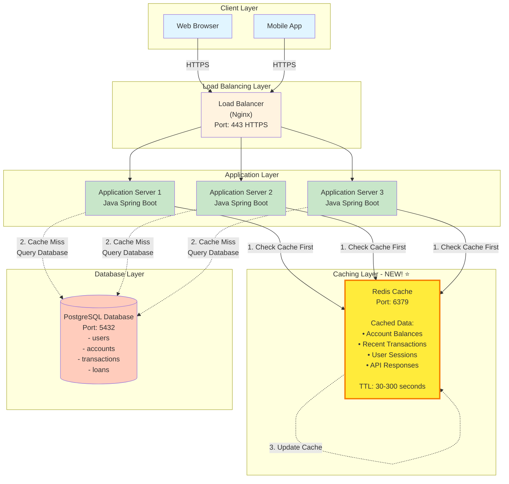
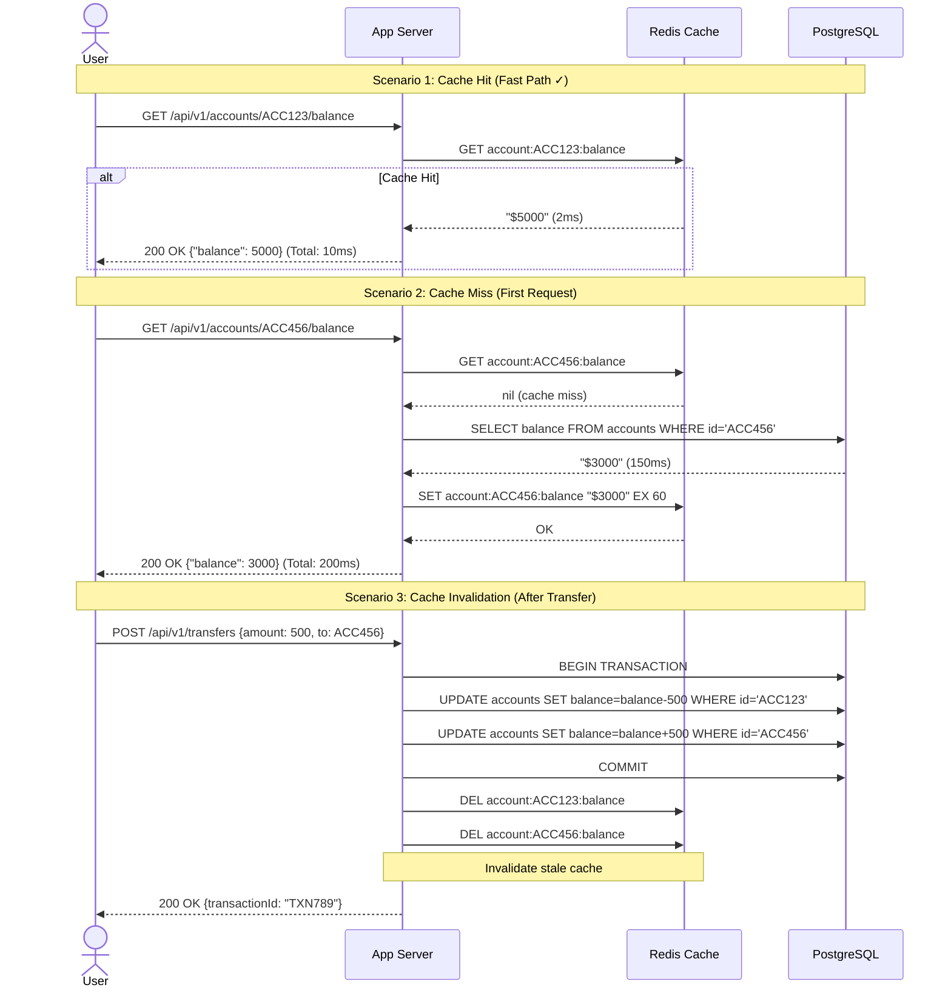
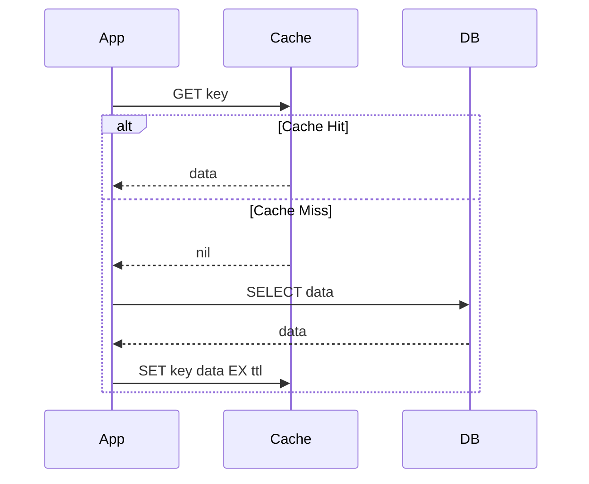
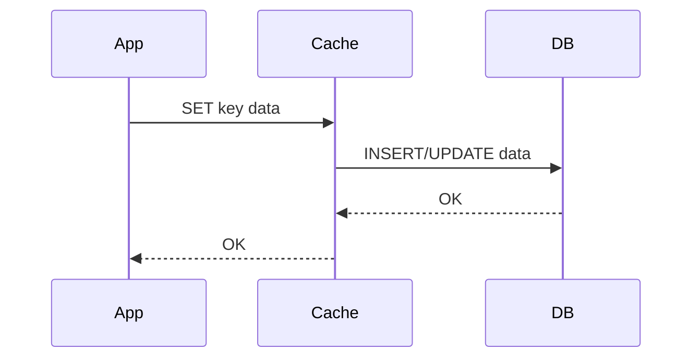
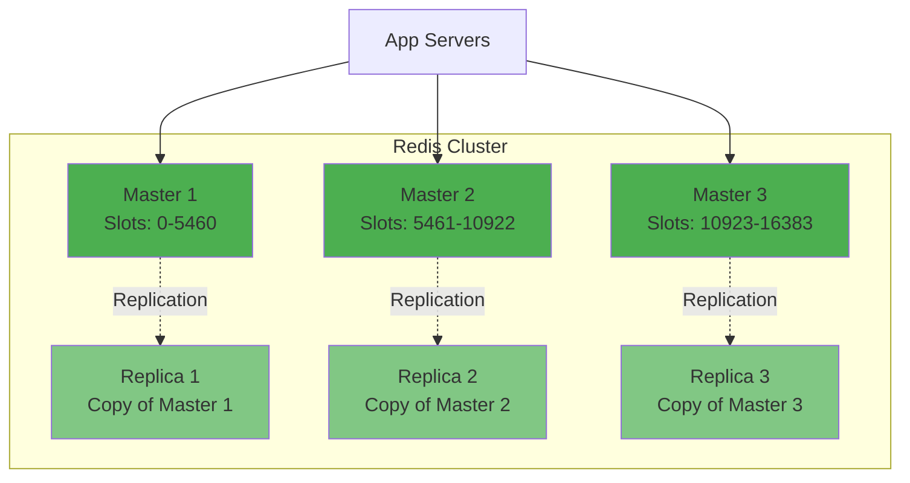

# Phase 3: Add Caching Layer (Step 2)

## What Changed from Step 1?

In Step 1, every request hit the database. This causes:
- **Slow Response Time**: 2-3 seconds (database queries are slow)
- **High Database Load**: All 105 req/sec hit the database
- **Scalability Issues**: Database becomes bottleneck

**Step 2 Solution**: Add **Redis cache** between app servers and database.

---

## Step 2 Architecture Diagram



---

## How Caching Works (Beginner-Friendly)

### Analogy: Library vs. Your Desk

```
Without Cache (Library):
You need a book → Walk to library (2 minutes) → Find book → Walk back
Every time you need the book → Repeat (slow ❌)

With Cache (Your Desk):
First time: Walk to library → Get book → Keep on your desk
Next times: Book already on desk (5 seconds) → Read immediately (fast ✓)
```

### Banking Example: Check Account Balance

**Without Cache (Step 1)**:
```
User: "Show my balance"
App Server → Database: "SELECT balance FROM accounts WHERE id = 'ACC123'"
Database → App Server: "$5000" (took 150ms)
App Server → User: "Your balance is $5000"

Next request (same user, 10 seconds later):
App Server → Database: Same query again! (another 150ms)
```

**With Cache (Step 2)**:
```
User: "Show my balance" (First time)
App Server → Redis: "GET account:ACC123:balance"
Redis → App Server: nil (cache miss)
App Server → Database: "SELECT balance FROM accounts WHERE id = 'ACC123'"
Database → App Server: "$5000" (150ms)
App Server → Redis: "SET account:ACC123:balance '$5000' EX 60" (cache for 60 seconds)
App Server → User: "Your balance is $5000"

User: "Show my balance" (10 seconds later)
App Server → Redis: "GET account:ACC123:balance"
Redis → App Server: "$5000" (2ms - 75x faster!)
App Server → User: "Your balance is $5000"
```

**Result**:
- First request: 150ms (cache miss)
- Subsequent requests: 2ms (cache hit)
- **75x faster!** 🚀

---

## Request Flow with Caching (Sequence Diagram)



---

## What to Cache? (Caching Strategy)

### 1. Account Balances

**Why Cache?**
- Most frequently accessed data (5 checks per user per day)
- Read-heavy (80% of requests)
- Changes infrequently (only on transactions)

**Cache Key Pattern**:
```
account:{account_id}:balance
Example: account:ACC123456:balance → "$5000.00"
```

**TTL (Time to Live)**: 60 seconds
```
Why 60 seconds?
- Fresh enough (balance doesn't change often)
- User won't see stale data for long
- Reduces database load by 95%
```

**Redis Command**:
```redis
SET account:ACC123456:balance "5000.00" EX 60
```

**Code Example**:
```java
@Service
public class AccountService {

    @Autowired
    private RedisTemplate<String, String> redisTemplate;

    @Autowired
    private AccountRepository accountRepository;

    public BigDecimal getBalance(String accountId) {
        // 1. Check cache first
        String cacheKey = "account:" + accountId + ":balance";
        String cachedBalance = redisTemplate.opsForValue().get(cacheKey);

        if (cachedBalance != null) {
            // Cache hit!
            return new BigDecimal(cachedBalance);
        }

        // 2. Cache miss - query database
        Account account = accountRepository.findById(accountId);
        BigDecimal balance = account.getBalance();

        // 3. Update cache
        redisTemplate.opsForValue().set(
            cacheKey,
            balance.toString(),
            60, TimeUnit.SECONDS  // TTL: 60 seconds
        );

        return balance;
    }
}
```

---

### 2. Recent Transactions (Last 10)

**Why Cache?**
- Frequently viewed (3 times per user per day)
- Doesn't change often (new transactions are rare)
- Expensive to query (JOIN with accounts table)

**Cache Key Pattern**:
```
transactions:{account_id}:recent
Example: transactions:ACC123456:recent → [JSON array of 10 transactions]
```

**TTL**: 120 seconds (2 minutes)

**Cached Data Structure**:
```json
{
  "account_id": "ACC123456",
  "transactions": [
    {
      "id": "TXN001",
      "amount": -500.00,
      "type": "DEBIT",
      "description": "Fund Transfer",
      "timestamp": "2025-01-15T10:30:00Z"
    },
    {
      "id": "TXN002",
      "amount": 1000.00,
      "type": "CREDIT",
      "description": "Salary",
      "timestamp": "2025-01-14T08:00:00Z"
    }
    // ... 8 more
  ]
}
```

**Code Example**:
```java
public List<Transaction> getRecentTransactions(String accountId) {
    String cacheKey = "transactions:" + accountId + ":recent";

    // Check cache
    String cached = redisTemplate.opsForValue().get(cacheKey);
    if (cached != null) {
        return objectMapper.readValue(cached, new TypeReference<List<Transaction>>() {});
    }

    // Query database
    List<Transaction> transactions = transactionRepository
        .findTop10ByAccountIdOrderByCreatedAtDesc(accountId);

    // Cache result
    redisTemplate.opsForValue().set(
        cacheKey,
        objectMapper.writeValueAsString(transactions),
        120, TimeUnit.SECONDS
    );

    return transactions;
}
```

---

### 3. User Sessions (JWT Tokens)

**Why Cache?**
- Every authenticated request needs session validation
- Extremely high frequency (all requests)
- Fast invalidation (logout, password change)

**Cache Key Pattern**:
```
session:{user_id}:{session_id}
Example: session:USR123:SES456 → {user_id, email, roles, expiry}
```

**TTL**: 900 seconds (15 minutes - session timeout)

**Cached Data**:
```json
{
  "user_id": "USR123456",
  "email": "user@example.com",
  "roles": ["USER"],
  "created_at": "2025-01-15T10:00:00Z",
  "expires_at": "2025-01-15T10:15:00Z"
}
```

**Code Example**:
```java
public Session validateSession(String sessionId) {
    String cacheKey = "session:" + sessionId;

    // Check cache
    String cached = redisTemplate.opsForValue().get(cacheKey);
    if (cached != null) {
        return objectMapper.readValue(cached, Session.class);
    }

    // Session not in cache = invalid/expired
    throw new UnauthorizedException("Session expired");
}

public void createSession(User user, String sessionId) {
    Session session = new Session(user.getId(), user.getEmail());

    redisTemplate.opsForValue().set(
        "session:" + sessionId,
        objectMapper.writeValueAsString(session),
        900, TimeUnit.SECONDS  // 15 minutes
    );
}

public void logout(String sessionId) {
    // Invalidate session immediately
    redisTemplate.delete("session:" + sessionId);
}
```

---

### 4. API Rate Limiting

**Why Cache?**
- Prevent abuse (same user making 1000 requests/minute)
- Fast increment/decrement operations
- Automatic expiry (reset every minute)

**Cache Key Pattern**:
```
ratelimit:{user_id}:{minute}
Example: ratelimit:USR123:2025-01-15T10:30 → 45 (request count)
```

**TTL**: 60 seconds (reset every minute)

**Code Example**:
```java
public boolean isRateLimitExceeded(String userId) {
    String currentMinute = LocalDateTime.now().format(
        DateTimeFormatter.ofPattern("yyyy-MM-dd'T'HH:mm")
    );
    String cacheKey = "ratelimit:" + userId + ":" + currentMinute;

    // Increment request count
    Long requestCount = redisTemplate.opsForValue().increment(cacheKey);

    // Set expiry on first request of the minute
    if (requestCount == 1) {
        redisTemplate.expire(cacheKey, 60, TimeUnit.SECONDS);
    }

    // Limit: 100 requests per minute
    return requestCount > 100;
}
```

**Usage in API**:
```java
@RestController
public class TransferController {

    @PostMapping("/api/v1/transfers")
    public ResponseEntity<?> transfer(@RequestBody TransferRequest req) {
        String userId = getCurrentUserId();

        // Check rate limit
        if (rateLimitService.isRateLimitExceeded(userId)) {
            return ResponseEntity.status(429)
                .body("Too many requests. Try again later.");
        }

        // Process transfer
        // ...
    }
}
```

---

## Caching Patterns

### Pattern 1: Cache-Aside (Lazy Loading) ⭐ Most Common

**How it Works**:
```
1. App checks cache
2. If cache hit → return data
3. If cache miss → query database → update cache → return data
```

**Diagram**:


**Pros**:
- Only cache data that's actually requested (efficient)
- Cache failure doesn't break system (just slower)

**Cons**:
- First request is always slow (cache miss)
- Cache and database can be inconsistent

**When to Use**: Account balances, transaction history (banking - perfect use case!)

---

### Pattern 2: Write-Through

**How it Works**:
```
1. App writes to cache
2. Cache immediately writes to database
3. Return success
```

**Diagram**:


**Pros**:
- Cache and database always consistent
- No cache miss (data always in cache)

**Cons**:
- Every write goes to both cache and DB (slower writes)
- Caches data that might never be read

**When to Use**: Rarely used in banking (writes need to be fast)

---

### Pattern 3: Write-Behind (Write-Back)

**How it Works**:
```
1. App writes to cache
2. Return success immediately
3. Cache asynchronously writes to database later (batched)
```

**Pros**:
- Very fast writes (don't wait for database)
- Can batch multiple writes

**Cons**:
- Risk of data loss (if cache crashes before writing to DB)
- Complex to implement

**When to Use**: NOT suitable for banking (can't risk data loss!)

---

## Cache Invalidation (The Hard Part!)

> "There are only two hard things in Computer Science: cache invalidation and naming things." - Phil Karlton

### Strategy 1: Time-Based Expiry (TTL)

**How it Works**:
```redis
SET account:ACC123:balance "5000" EX 60  # Expires in 60 seconds
```

**After 60 seconds**:
- Redis automatically deletes the key
- Next request: cache miss → query database → cache fresh data

**Pros**:
- Simple to implement
- Guarantees fresh data eventually

**Cons**:
- Data can be stale for up to TTL duration
- No control over when cache refreshes

**Example Scenario**:
```
10:00:00 - User checks balance → $5000 (cached with TTL=60s)
10:00:30 - Transfer of $500 happens → Database: $4500, Cache: $5000 (stale!)
10:00:45 - User checks balance → $5000 (still cached, wrong!)
10:01:01 - Cache expires → User checks balance → $4500 (correct!)

User sees wrong balance for 31 seconds!
```

**When to Use**: Non-critical data (transaction history, account details)

---

### Strategy 2: Explicit Invalidation (On Write) ⭐ Recommended for Banking

**How it Works**:
```java
@Transactional
public Transaction executeTransfer(TransferRequest req) {
    // 1. Update database
    accountRepository.updateBalance(req.getFromAccountId(), -req.getAmount());
    accountRepository.updateBalance(req.getToAccountId(), req.getAmount());

    // 2. Invalidate cache immediately
    redisTemplate.delete("account:" + req.getFromAccountId() + ":balance");
    redisTemplate.delete("account:" + req.getToAccountId() + ":balance");

    // 3. Also invalidate transaction history
    redisTemplate.delete("transactions:" + req.getFromAccountId() + ":recent");
    redisTemplate.delete("transactions:" + req.getToAccountId() + ":recent");

    return transaction;
}
```

**Timeline**:
```
10:00:00 - User checks balance → $5000 (cached)
10:00:30 - Transfer of $500 happens:
           1. Database updated: $4500
           2. Cache deleted immediately
10:00:31 - User checks balance:
           1. Cache miss (deleted)
           2. Query database: $4500 ✓
           3. Cache new value: $4500

User always sees correct balance!
```

**Pros**:
- Always consistent (no stale data)
- Immediate updates

**Cons**:
- More complex (must invalidate on every write)
- Cache hit rate lower (frequent invalidations)

**When to Use**: Critical financial data (balances, transactions) ⭐

---

### Strategy 3: Cache Refresh (Proactive Update)

**How it Works**:
```java
@Transactional
public Transaction executeTransfer(TransferRequest req) {
    // 1. Update database
    accountRepository.updateBalance(req.getFromAccountId(), -req.getAmount());
    accountRepository.updateBalance(req.getToAccountId(), req.getAmount());

    // 2. Update cache with new value (don't delete)
    BigDecimal newBalance = accountRepository.getBalance(req.getFromAccountId());
    redisTemplate.opsForValue().set(
        "account:" + req.getFromAccountId() + ":balance",
        newBalance.toString(),
        60, TimeUnit.SECONDS
    );

    return transaction;
}
```

**Pros**:
- No cache miss (cache always warm)
- Fast reads

**Cons**:
- Extra database query to get new balance
- Race conditions possible (if balance updated by another transaction)

---

## Performance Impact

### Before Caching (Step 1)

| Operation | Database Time | Total Response Time |
|-----------|---------------|---------------------|
| Get Balance | 150ms | 200ms |
| Get Last 10 Transactions | 300ms | 350ms |
| Login (session check) | 50ms | 100ms |
| **Average** | **150ms** | **200ms** |

**Database Load**: 105 req/sec (peak) → All hit database

---

### After Caching (Step 2)

| Operation | Cache Hit | Cache Miss | Cache Hit Rate |
|-----------|-----------|------------|----------------|
| Get Balance | 2ms | 150ms | 95% (rarely changes) |
| Get Last 10 Transactions | 3ms | 300ms | 90% (changes infrequently) |
| Login (session check) | 1ms | — | 100% (always cached) |
| **Average** | **2ms** | **150ms** | **90%** |

**Effective Response Time**:
```
Average = (90% × 2ms) + (10% × 150ms)
Average = 1.8ms + 15ms = 16.8ms

Improvement: 200ms → 17ms (12x faster!) 🚀
```

**Database Load**:
```
Before: 105 req/sec
After: 105 × 10% (cache miss) = 10.5 req/sec

Database load reduced by 90%! 🎉
```

---

## Redis Configuration

### Redis Cluster Setup (High Availability)

**Why Cluster?**
- Single Redis = Single Point of Failure
- Redis cluster = 3 master nodes + 3 replica nodes

**Architecture**:


**How it Works**:
- Data is sharded across 3 master nodes (16384 slots)
- Each master has a replica (failover)
- If Master 1 crashes → Replica 1 becomes master

**Configuration**:
```yaml
# redis.conf
cluster-enabled yes
cluster-node-timeout 5000
cluster-replica-validity-factor 0

maxmemory 4gb
maxmemory-policy allkeys-lru  # Evict least recently used keys when memory full

# Persistence (save to disk)
save 900 1      # Save after 900 sec if 1 key changed
save 300 10     # Save after 300 sec if 10 keys changed
save 60 10000   # Save after 60 sec if 10000 keys changed
```

---

## Cache Eviction Policies

**What happens when Redis is full?**

```
Redis has 4 GB memory
Cached data grows to 4.1 GB
What to do? → Evict (delete) some keys
```

**Eviction Policies**:

| Policy | Description | Use Case |
|--------|-------------|----------|
| **noeviction** | Return error when memory full | Not recommended |
| **allkeys-lru** ⭐ | Evict least recently used keys | General use (recommended) |
| **allkeys-lfu** | Evict least frequently used keys | Rare |
| **volatile-lru** | Evict LRU among keys with TTL | Mix of cached + permanent data |
| **volatile-ttl** | Evict keys with shortest TTL | Prioritize short-lived data |

**Recommendation for Banking**: `allkeys-lru`

**Why?**
- Balance for popular accounts stays cached (frequently accessed)
- Balance for inactive accounts evicted (rarely accessed)
- Automatic memory management

---

## Monitoring & Metrics

**Key Metrics to Track**:

1. **Cache Hit Rate**:
```
Cache Hit Rate = (Cache Hits / Total Requests) × 100

Target: > 90% (excellent)
70-90%: Good
< 70%: Poor (increase TTL or cache more data)
```

2. **Average Response Time**:
```
Before Caching: 200ms
After Caching: 17ms
Improvement: 92% faster
```

3. **Database Load**:
```
Before Caching: 105 queries/sec
After Caching: 10.5 queries/sec
Reduction: 90%
```

4. **Redis Memory Usage**:
```
Total Memory: 4 GB
Used Memory: 2.1 GB (52%)
Status: Healthy (< 80% is good)
```

**Monitoring Tools**:
- **Redis CLI**: `redis-cli INFO stats`
- **Redis Commander**: Web UI for Redis
- **Prometheus + Grafana**: Time-series metrics
- **CloudWatch** (AWS): Managed Redis monitoring

**Sample Metrics**:
```bash
redis-cli INFO stats

# Output
total_connections_received:1000000
total_commands_processed:5000000
keyspace_hits:4500000
keyspace_misses:500000

# Calculate hit rate
Hit Rate = 4,500,000 / (4,500,000 + 500,000) = 90% ✓
```

---

## Cost Analysis

### AWS ElastiCache (Managed Redis)

| Instance Type | vCPU | RAM | Cost/Month | Use Case |
|---------------|------|-----|------------|----------|
| cache.t3.micro | 2 | 0.5 GB | $15 | Development |
| cache.t3.medium | 2 | 3.09 GB | $60 | Small production |
| cache.r6g.large ⭐ | 2 | 13.07 GB | $150 | Production (recommended) |
| cache.r6g.xlarge | 4 | 26.32 GB | $300 | High load |

**Recommendation**: cache.r6g.large (4 GB usable memory)

**Updated Monthly Cost**:
```
Load Balancer: $25
App Servers (3x): $150
Database: $150
Redis (cache.r6g.large): $150  ← NEW!
Data Transfer: $90

Total: $565/month (was $425 before caching)
Extra cost: $140/month for 12x performance improvement! 🚀
```

---

## Trade-offs

### Pros ✓

| Benefit | Impact |
|---------|--------|
| **12x Faster Response** | 200ms → 17ms average |
| **90% Less Database Load** | Database can handle more users |
| **Better User Experience** | Instant balance checks |
| **Lower Database Costs** | Smaller database instance needed |
| **Scalability** | Can handle 10x more users without database upgrade |

### Cons ❌

| Challenge | Mitigation |
|-----------|------------|
| **Added Complexity** | Use managed service (ElastiCache) |
| **Stale Data Risk** | Explicit invalidation on writes |
| **Extra Cost** | $150/month (worth it for performance) |
| **Cache Failures** | Graceful fallback to database |
| **Memory Limits** | LRU eviction policy |

---

## Next Steps

In **Step 3**, we'll add **database replication** for:
- High availability (if master DB crashes, replica takes over)
- Read scaling (read replicas handle read queries)
- Disaster recovery (multi-region replication)

**Current Limitation**:
- Single database = Single Point of Failure ❌
- If database crashes, entire system down

**Step 3 Solution**:
- Master-slave replication
- Read replicas for scalability

---

## Learning Checkpoint

**Questions to Test Your Understanding**:

1. **What is a cache hit?**
   - Answer: When requested data is found in cache (fast)

2. **What is a cache miss?**
   - Answer: When requested data is NOT in cache (must query database)

3. **Why use Redis instead of storing in application memory?**
   - Answer: Multiple app servers share same cache (consistency)

4. **What is TTL?**
   - Answer: Time To Live - how long data stays in cache before expiring

5. **Which caching pattern should banking use?**
   - Answer: Cache-aside with explicit invalidation (for data consistency)

6. **What happens if Redis crashes?**
   - Answer: Cache miss for all requests → All hit database (system slower but works)

7. **How to prevent stale balance data?**
   - Answer: Invalidate cache immediately after every transaction

**Key Takeaway**: Caching is about trading memory for speed. Redis gives us 12x performance improvement for $150/month! 🎯

Let's move to Step 3: Database Scaling! 🚀
