# Phase 4: Database Scaling (Step 3)

## What Changed from Step 2?

In Step 2, we had:
- Single PostgreSQL database
- All reads and writes go to one server
- **Problem**: Single Point of Failure (SPOF) + Limited scalability

**What if the database crashes?**
- ❌ Entire banking system goes down
- ❌ Customers can't check balance, transfer money
- ❌ Business loses $10,000+ per minute of downtime

**Step 3 Solution**: Add database replication and read replicas

---

## Step 3 Architecture Diagram

```mermaid
graph TB
    subgraph "Client Layer"
        WebClient["Web Browser"]
        MobileClient["Mobile App"]
    end

    subgraph "Load Balancing Layer"
        LB["Load Balancer<br/>(Nginx)"]
    end

    subgraph "Application Layer"
        App1["App Server 1"]
        App2["App Server 2"]
        App3["App Server 3"]
    end

    subgraph "Caching Layer"
        Redis["Redis Cache<br/>4 GB"]
    end

    subgraph "Database Layer - ENHANCED! ⭐"
        DBMaster[("Master Database<br/>PostgreSQL<br/>📝 Writes Only<br/><br/>Operations:<br/>• Fund Transfers<br/>• Account Updates<br/>• Loan Applications")]

        DBSlave1[("Replica 1<br/>PostgreSQL<br/>📖 Reads Only<br/><br/>Operations:<br/>• View Balance<br/>• Transaction History<br/>• Account Details")]

        DBSlave2[("Replica 2<br/>PostgreSQL<br/>📖 Reads Only<br/><br/>Backup + Reads")]

        DBMaster -->|"Async Replication<br/>< 1 second lag"| DBSlave1
        DBMaster -->|"Async Replication<br/>< 1 second lag"| DBSlave2
    end

    WebClient --> LB
    MobileClient --> LB
    LB --> App1
    LB --> App2
    LB --> App3

    App1 --> Redis
    App2 --> Redis
    App3 --> Redis

    App1 -->|"WRITE Operations"| DBMaster
    App2 -->|"WRITE Operations"| DBMaster
    App3 -->|"WRITE Operations"| DBMaster

    App1 -.->|"READ Operations"| DBSlave1
    App2 -.->|"READ Operations"| DBSlave2
    App3 -.->|"READ Operations"| DBSlave1

    style DBMaster fill:#ef5350,stroke:#c62828,stroke-width:3px,color:#fff
    style DBSlave1 fill:#66bb6a,stroke:#2e7d32,stroke-width:2px
    style DBSlave2 fill:#66bb6a,stroke:#2e7d32,stroke-width:2px
    style Redis fill:#ffeb3b
    style LB fill:#fff3e0
    style App1 fill:#c8e6c9
    style App2 fill:#c8e6c9
    style App3 fill:#c8e6c9
```



---

## Core Concepts (Beginner-Friendly)

### 1. Master-Slave Replication

**Analogy: Professor and Students**
```
Master Database (Professor):
- Creates original content (writes to database)
- Students (replicas) copy everything from professor's notes

Slave/Replica Databases (Students):
- Read professor's notes and copy them
- Can answer questions (read queries)
- Cannot modify notes (no writes)
```

**Banking Example**:
```
User transfers $500:
1. App → Master DB: "UPDATE accounts SET balance = balance - 500..."
2. Master DB: Executes write ✓
3. Master DB → Replica 1: "Here's the change, copy it"
4. Master DB → Replica 2: "Here's the change, copy it"
5. Replicas update their data (< 1 second later)

User checks balance (different request):
1. App → Replica 1: "SELECT balance FROM accounts WHERE..."
2. Replica 1: Returns balance
(Master DB is free to handle writes!)
```

---

### 2. Read-Write Split

**How it Works**:
```
Read Operations (80% of traffic):
- View balance
- View transaction history
- Check loan status
→ Route to Read Replicas (Slave 1, Slave 2)

Write Operations (20% of traffic):
- Fund transfer
- Account updates
- New loan application
→ Route to Master Database
```

**Code Example**:
```java
@Service
public class AccountService {

    @Autowired
    @Qualifier("masterDataSource")  // Write operations
    private JdbcTemplate masterJdbc;

    @Autowired
    @Qualifier("replicaDataSource")  // Read operations
    private JdbcTemplate replicaJdbc;

    // READ - Use replica
    public BigDecimal getBalance(String accountId) {
        String sql = "SELECT balance FROM accounts WHERE account_id = ?";
        return replicaJdbc.queryForObject(sql, BigDecimal.class, accountId);
    }

    // WRITE - Use master
    @Transactional
    public void updateBalance(String accountId, BigDecimal amount) {
        String sql = "UPDATE accounts SET balance = balance + ? WHERE account_id = ?";
        masterJdbc.update(sql, amount, accountId);
    }
}
```

**Spring Boot Configuration**:
```java
@Configuration
public class DatabaseConfig {

    @Bean(name = "masterDataSource")
    @Primary
    public DataSource masterDataSource() {
        return DataSourceBuilder.create()
            .url("jdbc:postgresql://master-db.us-east-1.rds.amazonaws.com:5432/bankdb")
            .username("admin")
            .password("********")
            .build();
    }

    @Bean(name = "replicaDataSource")
    public DataSource replicaDataSource() {
        return DataSourceBuilder.create()
            .url("jdbc:postgresql://replica-1.us-east-1.rds.amazonaws.com:5432/bankdb")
            .username("readonly")
            .password("********")
            .build();
    }
}
```

---

## Replication Flow (Sequence Diagram)


---

## Replication Lag (Important Concept!)

### What is Replication Lag?

**Definition**: Time delay between master write and replica update

```
10:00:00.000 - Master: UPDATE balance = $4500 (after transfer)
10:00:00.200 - Replica 1: Updated to $4500 (200ms lag)
10:00:00.250 - Replica 2: Updated to $4500 (250ms lag)

Replication Lag = 200-250 milliseconds
```

### Real-World Scenario

**Problem**:
```
User transfers $500:
1. 10:00:00.000 - App writes to Master: balance = $4500 ✓
2. 10:00:00.050 - App redirects to success page
3. 10:00:00.100 - User clicks "View Balance"
4. 10:00:00.120 - App reads from Replica 1: balance = $5000 ❌ (stale!)
   (Replica hasn't received update yet - 200ms lag)
5. 10:00:00.300 - User refreshes page
6. 10:00:00.320 - App reads from Replica 1: balance = $4500 ✓ (updated)

User sees wrong balance for 200ms!
```

### Solution 1: Read Your Writes Consistency

**Concept**: After write, read from master for a short period

```java
@Service
public class AccountService {

    private LoadingCache<String, Instant> recentWrites = CacheBuilder.newBuilder()
        .expireAfterWrite(1, TimeUnit.SECONDS)
        .build(new CacheLoader<String, Instant>() {
            public Instant load(String key) {
                return Instant.now();
            }
        });

    public BigDecimal getBalance(String accountId) {
        // Check if we recently wrote to this account
        Instant lastWrite = recentWrites.getIfPresent(accountId);

        if (lastWrite != null &&
            Duration.between(lastWrite, Instant.now()).toMillis() < 1000) {
            // Within 1 second of write - read from master!
            return masterJdbc.queryForObject(
                "SELECT balance FROM accounts WHERE account_id = ?",
                BigDecimal.class,
                accountId
            );
        }

        // Normal read from replica
        return replicaJdbc.queryForObject(
            "SELECT balance FROM accounts WHERE account_id = ?",
            BigDecimal.class,
            accountId
        );
    }

    @Transactional
    public void updateBalance(String accountId, BigDecimal amount) {
        masterJdbc.update(
            "UPDATE accounts SET balance = balance + ? WHERE account_id = ?",
            amount, accountId
        );

        // Mark this account as recently written
        recentWrites.put(accountId, Instant.now());
    }
}
```

**How it Works**:
```
Transfer happens:
1. Write to master → Track write timestamp
2. Next 1 second: All reads for this account → Master
3. After 1 second: Reads → Replica (replication complete)

Result: User always sees correct balance! ✓
```

### Solution 2: Synchronous Replication (Trade-off)

**Asynchronous Replication (Current)**:
```
App → Master: Write
Master → App: OK (50ms)
Master → Replicas: Update (async, 200ms later)
```

**Synchronous Replication**:
```
App → Master: Write
Master → Replicas: Update (wait for confirmation)
Replicas → Master: OK (200ms)
Master → App: OK (250ms total)
```

**Pros**: No replication lag (always consistent)
**Cons**: Slower writes (5x slower!)

**Recommendation for Banking**:
- Asynchronous replication + "Read Your Writes" pattern ✓
- Synchronous too slow for user experience

---

## High Availability: Automatic Failover

### What Happens if Master Crashes?


**Timeline**:
```
10:00:00 - Master DB crashes (disk failure)
10:00:05 - Failover manager detects failure (3x health checks)
10:00:10 - Promote Replica 1 to Master
10:00:15 - Reconfigure Replica 2 to follow new Master
10:00:20 - Update DNS/connection pool in app servers
10:00:30 - System fully operational

Downtime: 30 seconds (meets 99.99% availability ✓)
```

**AWS RDS Automatic Failover**:
- Amazon RDS does this automatically
- No manual intervention needed
- DNS update: `master-db.rds.amazonaws.com` points to new master

---

## Database Sharding (Horizontal Partitioning)

### When Do We Need Sharding?

**Current Setup (Single Master)**:
- Can handle ~10,000 writes/second
- Database size: 295 GB (5 years)

**Future Growth**:
```
Year 1: 1 million users
Year 3: 5 million users (5x growth)
Year 5: 20 million users (20x growth)

Year 5 Estimates:
- Writes: 20x = 200,000 writes/second
- Database size: 20x = 5.9 TB
- Single database can't handle this! ❌
```

**Solution**: Shard data across multiple master databases

---

### Sharding Strategy 1: By User ID (Hash-Based)

**How it Works**:
```
Users are divided into shards based on user_id hash

Shard 1: user_id ends in 0-3 (40% of users)
Shard 2: user_id ends in 4-6 (30% of users)
Shard 3: user_id ends in 7-9 (30% of users)
```

**Example**:
```
User ID: USR123456789 → Hash % 3 = 0 → Shard 1
User ID: USR987654321 → Hash % 3 = 1 → Shard 2
User ID: USR456789123 → Hash % 3 = 2 → Shard 3
```

**Architecture**:


**Code Example**:
```java
@Service
public class ShardingService {

    private static final int NUM_SHARDS = 3;

    private Map<Integer, DataSource> shards = new HashMap<>();

    public ShardingService() {
        shards.put(0, createDataSource("shard-1.rds.amazonaws.com"));
        shards.put(1, createDataSource("shard-2.rds.amazonaws.com"));
        shards.put(2, createDataSource("shard-3.rds.amazonaws.com"));
    }

    public DataSource getShardForUser(String userId) {
        int shardId = Math.abs(userId.hashCode()) % NUM_SHARDS;
        return shards.get(shardId);
    }

    public Account getAccount(String userId, String accountId) {
        DataSource shard = getShardForUser(userId);
        JdbcTemplate jdbc = new JdbcTemplate(shard);

        return jdbc.queryForObject(
            "SELECT * FROM accounts WHERE account_id = ?",
            new AccountRowMapper(),
            accountId
        );
    }
}
```

**Pros**:
- Even distribution of data
- Easy to implement
- Scales to millions of users

**Cons**:
- Cross-shard queries difficult (joins across shards)
- User data split across shards

---

### Sharding Strategy 2: By Geography

**How it Works**:
```
Shard 1 (US-East): Users in US East Coast
Shard 2 (US-West): Users in US West Coast
Shard 3 (EU): Users in Europe
Shard 4 (Asia): Users in Asia
```

**Pros**:
- Lower latency (data close to users)
- Regulatory compliance (EU data stays in EU)

**Cons**:
- Uneven distribution (US has more users)
- Complex routing logic

---

### Handling Cross-Shard Queries

**Problem**:
```sql
-- User USR123 (Shard 1) transfers to User USR456 (Shard 2)
-- Both shards need to be updated atomically!

-- Shard 1
UPDATE accounts SET balance = balance - 500 WHERE user_id = 'USR123';

-- Shard 2
UPDATE accounts SET balance = balance + 500 WHERE user_id = 'USR456';

-- What if Shard 1 succeeds but Shard 2 fails? 💰 Money lost!
```

**Solution: Two-Phase Commit (2PC)**


**If Any Shard Fails**:
```
Phase 1: Shard 1 READY, Shard 2 FAIL
Coordinator: ROLLBACK both shards
Result: No money lost ✓
```

**Library**: Use distributed transaction manager
- **XA Transactions** (JTA in Java)
- **Saga Pattern** (for microservices)

---

## Capacity Analysis

### Before Database Scaling (Step 2)

| Metric | Value | Limit |
|--------|-------|-------|
| **Read Queries/Sec** | 84 | 1000 (single DB limit) |
| **Write Queries/Sec** | 21 | 500 (single DB limit) |
| **Database Size** | 60 GB | 1 TB (max for instance) |
| **Availability** | 99.5% | Single point of failure |

**Bottleneck**: Single database can fail

---

### After Database Scaling (Step 3)

| Metric | Value | Improvement |
|--------|-------|-------------|
| **Read Queries/Sec** | 84 ÷ 2 = 42/replica | 2x capacity (can add more replicas) |
| **Write Queries/Sec** | 21 (master only) | Same (but failover ready) |
| **Database Size** | 60 GB per shard | 3x shards = 180 GB total capacity |
| **Availability** | 99.99% | Auto-failover in 30s |

**Benefits**:
- **Read Scalability**: Add more replicas → Handle more reads
- **High Availability**: Master fails → Replica promoted (30s downtime)
- **Write Scalability**: Shard → Distribute writes across masters

---

## Cost Analysis (AWS RDS)

### Step 2 (Single Database)
```
Master: db.r6g.large (2 vCPU, 16 GB) = $150/month
Total: $150/month
```

### Step 3 (Master + 2 Replicas)
```
Master: db.r6g.large (2 vCPU, 16 GB) = $150/month
Replica 1: db.r6g.large (2 vCPU, 16 GB) = $150/month
Replica 2: db.r6g.large (2 vCPU, 16 GB) = $150/month

Total: $450/month (3x cost for high availability)
```

**Is it Worth It?**
```
Cost of 1 hour downtime: $10,000 (lost business)
Extra cost for HA: $300/month
Break-even: 18 minutes of prevented downtime/month

99.5% uptime → 99.99% uptime
Downtime reduction: 3.6 hours/month → 4 minutes/month
Savings: 3.5 hours × $10,000/hr = $35,000/month

ROI: $35,000 saved / $300 cost = 116x return! 🚀
```

---

## Monitoring & Alerting

### Key Metrics

**1. Replication Lag**
```sql
-- PostgreSQL: Check replication lag
SELECT
    client_addr,
    state,
    pg_wal_lsn_diff(pg_current_wal_lsn(), replay_lsn) AS lag_bytes
FROM pg_stat_replication;

-- Alert if lag > 1 MB (or > 5 seconds)
```

**2. Database Connection Pool**
```
Active Connections: 45 / 100
Idle Connections: 30
Waiting: 2

Alert if Active > 80 or Waiting > 10
```

**3. Query Performance**
```sql
-- Slow queries (> 1 second)
SELECT
    query,
    mean_exec_time,
    calls
FROM pg_stat_statements
WHERE mean_exec_time > 1000  -- milliseconds
ORDER BY mean_exec_time DESC
LIMIT 10;
```

**4. Disk Usage**
```
Database Size: 62 GB / 500 GB (12%)
Alert if > 80%
```

---

## Best Practices

### 1. Read Replica Routing

```java
// ❌ Wrong: All reads hit master
jdbcTemplate.queryForObject("SELECT * FROM accounts...", ...);

// ✓ Right: Reads from replica
@Transactional(readOnly = true)  // Route to replica
public Account getAccount(String id) {
    return replicaJdbc.queryForObject("SELECT * FROM accounts WHERE id = ?", ...);
}
```

### 2. Connection Pooling

```java
// ❌ Wrong: Create new connection for each query
Connection conn = DriverManager.getConnection(url, user, password);

// ✓ Right: Use connection pool (HikariCP)
@Bean
public DataSource dataSource() {
    HikariConfig config = new HikariConfig();
    config.setJdbcUrl("jdbc:postgresql://...");
    config.setMaximumPoolSize(20);  // 20 connections
    config.setMinimumIdle(5);       // Keep 5 idle
    config.setConnectionTimeout(30000);  // 30s timeout
    return new HikariDataSource(config);
}
```

### 3. Retry Logic for Failover

```java
@Retryable(
    value = SQLException.class,
    maxAttempts = 3,
    backoff = @Backoff(delay = 1000)  // 1s delay
)
public void transfer(TransferRequest req) {
    // If master fails during failover, retry connects to new master
    jdbcTemplate.update("UPDATE accounts...", ...);
}
```

---

## Next Steps

In **Step 4**, we'll add a **Message Queue (Kafka/RabbitMQ)** for:
- Asynchronous processing (emails, SMS, statements)
- Event-driven architecture
- Decoupling services

**Current Limitation**:
- All operations are synchronous (user waits for email to be sent)
- Slow operations block API response

**Step 4 Solution**:
- Send email asynchronously via message queue
- User gets instant response

Let's move to Step 4! 🚀
