# Phase 5: Add Message Queue (Step 4)

## What Changed from Step 3?

In Step 3, all operations were **synchronous**:
```
User clicks "Transfer Money"
→ App processes transfer (50ms)
→ App sends SMS (500ms) ⏰ User waits
→ App sends Email (700ms) ⏰ User waits
→ App updates audit log (100ms)
→ Return response to user

Total wait time: 1350ms (1.35 seconds)
```

**Problems**:
- ❌ User waits for non-critical operations (SMS, email)
- ❌ If email service is slow/down, entire request fails
- ❌ Cannot handle traffic spikes (email service overwhelmed)

**Step 4 Solution**: Add **Apache Kafka** message queue for async processing

---

## Step 4 Architecture Diagram

```mermaid
graph TB
    subgraph "Client Layer"
        Client["Web/Mobile Client"]
    end

    subgraph "Load Balancing"
        LB["Load Balancer"]
    end

    subgraph "Application Layer"
        App1["App Server 1"]
        App2["App Server 2"]
        App3["App Server 3"]
    end

    subgraph "Caching Layer"
        Redis["Redis Cache"]
    end

    subgraph "Message Queue - NEW! ⭐"
        Kafka["Apache Kafka<br/><br/>Topics:<br/>• transaction.completed<br/>• user.registered<br/>• loan.applied<br/>• bill.paid<br/>• account.frozen"]
    end

    subgraph "Background Workers - NEW! ⭐"
        EmailWorker["Email Worker<br/>(SendGrid)"]
        SMSWorker["SMS Worker<br/>(Twilio)"]
        NotifWorker["Notification Worker<br/>(Push Notifications)"]
        StatementWorker["Statement Generator<br/>(PDF Generator)"]
        AuditWorker["Audit Log Worker<br/>(Write to S3)"]
    end

    subgraph "Database Layer"
        DBMaster[("Master DB")]
        DBReplica1[("Replica 1")]
        DBReplica2[("Replica 2")]
    end

    subgraph "External Services"
        SendGrid["SendGrid<br/>(Email)"]
        Twilio["Twilio<br/>(SMS)"]
        FCM["Firebase<br/>(Push Notif)"]
        S3["AWS S3<br/>(Audit Logs)"]
    end

    Client --> LB
    LB --> App1
    LB --> App2
    LB --> App3

    App1 --> Redis
    App2 --> Redis
    App3 --> Redis

    App1 -->|Writes| DBMaster
    App1 -.->|Reads| DBReplica1

    App1 -->|"Publish Events"| Kafka
    App2 -->|"Publish Events"| Kafka
    App3 -->|"Publish Events"| Kafka

    Kafka -->|"Subscribe"| EmailWorker
    Kafka -->|"Subscribe"| SMSWorker
    Kafka -->|"Subscribe"| NotifWorker
    Kafka -->|"Subscribe"| StatementWorker
    Kafka -->|"Subscribe"| AuditWorker

    EmailWorker --> SendGrid
    SMSWorker --> Twilio
    NotifWorker --> FCM
    StatementWorker --> S3
    AuditWorker --> S3

    DBMaster --> DBReplica1
    DBMaster --> DBReplica2

    style Kafka fill:#9c27b0,stroke:#6a1b9a,stroke-width:3px,color:#fff
    style EmailWorker fill:#ba68c8
    style SMSWorker fill:#ba68c8
    style NotifWorker fill:#ba68c8
    style StatementWorker fill:#ba68c8
    style AuditWorker fill:#ba68c8
    style DBMaster fill:#ef5350
    style Redis fill:#ffeb3b
```



---

## Synchronous vs Asynchronous Processing

### Synchronous (Before - Step 3)

```mermaid
sequenceDiagram
    actor User
    participant App
    participant DB
    participant SMS
    participant Email

    User->>App: Transfer $500
    App->>DB: UPDATE accounts (50ms)
    DB-->>App: OK

    App->>SMS: Send OTP (500ms) ⏰
    SMS-->>App: Sent

    App->>Email: Send confirmation (700ms) ⏰
    Email-->>App: Sent

    App-->>User: Transfer successful (1250ms total)

    Note over User: User waited 1250ms! ❌
```



**Total Response Time**: 1250ms (too slow!)

---

### Asynchronous (After - Step 4)

```mermaid
sequenceDiagram
    actor User
    participant App
    participant DB
    participant Kafka
    participant EmailWorker
    participant SMSWorker

    User->>App: Transfer $500
    App->>DB: UPDATE accounts (50ms)
    DB-->>App: OK

    App->>Kafka: Publish "transaction.completed" event (5ms)
    Kafka-->>App: Ack

    App-->>User: Transfer successful (55ms total) ✓

    Note over User: User got response in 55ms! Fast! ✓

    par Background Processing
        Kafka->>EmailWorker: Event: transaction.completed
        EmailWorker->>EmailWorker: Send email (700ms)
    and
        Kafka->>SMSWorker: Event: transaction.completed
        SMSWorker->>SMSWorker: Send SMS (500ms)
    end

    Note over EmailWorker,SMSWorker: User doesn't wait for these!
```



**Total Response Time**: 55ms (23x faster! 🚀)

---

## What to Make Asynchronous?

### Async Operations (Offload to Queue)

| Operation | Sync Time | Why Async? |
|-----------|-----------|------------|
| **Email Notifications** | 700ms | User doesn't need to wait |
| **SMS/OTP** | 500ms | External service can be slow |
| **Push Notifications** | 300ms | Not critical for response |
| **PDF Statement Generation** | 3000ms | CPU-intensive, slow |
| **Audit Logging** | 100ms | Can be written later |
| **Loan Credit Score Check** | 5000ms | Third-party API, very slow |
| **Monthly Statement Emails** | 2000ms | Batch operation |

### Sync Operations (Keep Synchronous)

| Operation | Why Sync? |
|-----------|-----------|
| **Fund Transfer (DB update)** | Must confirm immediately |
| **Login Authentication** | User needs instant response |
| **Balance Check** | Real-time data required |
| **Transaction History** | User expects immediate display |

---

## Kafka Topics & Events

### Event-Driven Architecture

**What is an Event?**
```
Something happened in the system → Publish event → Other services react
```

**Example**:
```
Event: "User registered"
→ Email Worker: Send welcome email
→ SMS Worker: Send verification SMS
→ Analytics Worker: Update user count
→ Marketing Worker: Add to campaign
```

### Kafka Topics for Banking

**Topic Naming Convention**: `{domain}.{entity}.{action}`

```
1. transaction.completed
   - Published when: Fund transfer succeeds
   - Subscribers: Email, SMS, Audit, Analytics

2. transaction.failed
   - Published when: Transfer fails (insufficient balance, etc.)
   - Subscribers: Email (failure notification), Fraud detection

3. user.registered
   - Published when: New user signs up
   - Subscribers: Email (welcome), SMS (OTP), KYC service

4. user.login
   - Published when: User logs in
   - Subscribers: Audit log, Fraud detection (unusual location)

5. loan.applied
   - Published when: User applies for loan
   - Subscribers: Credit score check, Email (confirmation)

6. loan.approved
   - Published when: Loan is approved
   - Subscribers: Email, SMS, Disbursement service

7. account.frozen
   - Published when: Admin freezes account
   - Subscribers: Email, SMS, Audit log

8. bill.paid
   - Published when: Bill payment succeeds
   - Subscribers: Email (receipt), SMS, Audit log

9. statement.requested
   - Published when: User requests bank statement
   - Subscribers: PDF generator → Email sender

10. scheduled.transfer
    - Published when: Recurring transfer executes
    - Subscribers: Same as transaction.completed
```

---

## Event Schema Example

### Transaction Completed Event

```json
{
  "event_id": "EVT-12345678",
  "event_type": "transaction.completed",
  "timestamp": "2025-01-15T10:30:45.123Z",
  "version": "1.0",
  "data": {
    "transaction_id": "TXN-987654321",
    "from_account": {
      "account_id": "ACC123456",
      "user_id": "USR789012",
      "user_name": "John Doe",
      "user_email": "john@example.com",
      "user_phone": "+911234567890"
    },
    "to_account": {
      "account_id": "ACC654321",
      "beneficiary_name": "Jane Smith"
    },
    "amount": 5000.00,
    "currency": "INR",
    "transaction_type": "FUND_TRANSFER",
    "description": "Monthly rent",
    "balance_after": 45000.00
  },
  "metadata": {
    "ip_address": "192.168.1.1",
    "user_agent": "BankApp/1.2.3 iOS"
  }
}
```

---

## Code Examples

### 1. Publishing Events (Producer)

```java
@Service
public class TransactionService {

    @Autowired
    private KafkaTemplate<String, TransactionEvent> kafkaTemplate;

    @Transactional
    public Transaction executeTransfer(TransferRequest req) {
        // 1. Execute database transaction
        Transaction txn = new Transaction();
        txn.setFromAccount(req.getFromAccountId());
        txn.setToAccount(req.getToAccountId());
        txn.setAmount(req.getAmount());
        txn.setStatus(TransactionStatus.SUCCESS);

        accountRepository.updateBalance(req.getFromAccountId(), req.getAmount().negate());
        accountRepository.updateBalance(req.getToAccountId(), req.getAmount());
        transactionRepository.save(txn);

        // 2. Publish event to Kafka (async)
        TransactionEvent event = TransactionEvent.builder()
            .eventId(UUID.randomUUID().toString())
            .eventType("transaction.completed")
            .timestamp(Instant.now())
            .transactionId(txn.getId())
            .fromAccount(getAccountDetails(req.getFromAccountId()))
            .toAccount(getAccountDetails(req.getToAccountId()))
            .amount(req.getAmount())
            .build();

        kafkaTemplate.send("transaction.completed", event);
        // Returns immediately (Kafka buffers the message)

        // 3. Return response to user (fast!)
        return txn;
    }
}
```

**Key Points**:
- Database transaction completes first
- Kafka publish is fire-and-forget (doesn't block)
- User gets response in ~50ms

---

### 2. Consuming Events (Email Worker)

```java
@Service
public class EmailWorker {

    @Autowired
    private EmailService emailService;

    @KafkaListener(
        topics = "transaction.completed",
        groupId = "email-worker-group"
    )
    public void handleTransactionCompleted(TransactionEvent event) {
        try {
            // Send email to sender
            emailService.sendTransactionConfirmation(
                event.getFromAccount().getUserEmail(),
                event.getTransactionId(),
                event.getAmount(),
                event.getBalanceAfter()
            );

            log.info("Email sent for transaction: {}", event.getTransactionId());

        } catch (Exception e) {
            log.error("Failed to send email for transaction: {}",
                event.getTransactionId(), e);
            // Message will be retried automatically (Kafka consumer retry)
        }
    }
}
```

**Email Template**:
```html
Subject: Transaction Successful - ₹5,000

Dear John Doe,

Your fund transfer of ₹5,000.00 to Jane Smith has been completed successfully.

Transaction Details:
- Transaction ID: TXN-987654321
- Amount: ₹5,000.00
- To: Jane Smith (ACC654321)
- Date: 15 Jan 2025, 10:30 AM
- Available Balance: ₹45,000.00

Thank you for banking with us!
```

---

### 3. Consuming Events (SMS Worker)

```java
@Service
public class SMSWorker {

    @Autowired
    private TwilioService twilioService;

    @KafkaListener(
        topics = "transaction.completed",
        groupId = "sms-worker-group"
    )
    public void handleTransactionCompleted(TransactionEvent event) {
        String message = String.format(
            "Your account %s has been debited by Rs.%.2f. " +
            "Transaction ID: %s. Available balance: Rs.%.2f",
            maskAccount(event.getFromAccount().getAccountId()),
            event.getAmount(),
            event.getTransactionId(),
            event.getBalanceAfter()
        );

        twilioService.sendSMS(
            event.getFromAccount().getUserPhone(),
            message
        );

        log.info("SMS sent for transaction: {}", event.getTransactionId());
    }

    private String maskAccount(String accountId) {
        // ACC123456 → ACCXXX456
        return accountId.substring(0, 3) + "XXX" +
               accountId.substring(accountId.length() - 3);
    }
}
```

---

### 4. Statement Generator Worker (Heavy Processing)

```java
@Service
public class StatementWorker {

    @Autowired
    private StatementService statementService;

    @Autowired
    private S3Service s3Service;

    @Autowired
    private EmailService emailService;

    @KafkaListener(
        topics = "statement.requested",
        groupId = "statement-worker-group",
        concurrency = "3"  // 3 parallel consumers
    )
    public void generateStatement(StatementRequestEvent event) {
        try {
            // 1. Fetch transactions from database (heavy query)
            List<Transaction> transactions = transactionRepository
                .findByAccountAndDateRange(
                    event.getAccountId(),
                    event.getStartDate(),
                    event.getEndDate()
                );

            // 2. Generate PDF (CPU-intensive, ~3 seconds)
            byte[] pdfBytes = statementService.generatePDF(
                event.getAccountId(),
                transactions
            );

            // 3. Upload to S3
            String s3Key = String.format(
                "statements/%s/%s_%s.pdf",
                event.getAccountId(),
                event.getStartDate(),
                event.getEndDate()
            );
            String s3Url = s3Service.upload(s3Key, pdfBytes);

            // 4. Send email with download link
            emailService.sendStatementEmail(
                event.getUserEmail(),
                s3Url,
                event.getStartDate(),
                event.getEndDate()
            );

            log.info("Statement generated and emailed: {}", event.getAccountId());

        } catch (Exception e) {
            log.error("Failed to generate statement", e);
            // Message will be retried (with backoff)
        }
    }
}
```

**Timeline**:
```
User clicks "Download Statement"
→ App publishes "statement.requested" event (5ms)
→ User gets response: "Statement will be emailed shortly" (10ms)

Background (user doesn't wait):
→ Statement Worker picks up event
→ Generates PDF (3000ms)
→ Uploads to S3 (500ms)
→ Sends email with link (700ms)

Total background time: 4.2 seconds
User experience: 10ms response time! ✓
```

---

## Kafka Consumer Groups

### What is a Consumer Group?

**Concept**: Multiple workers processing messages in parallel


**How it Works**:
- Topic has 3 partitions
- Consumer group has 3 workers
- Each worker processes one partition (parallel!)
- Throughput: 3x faster than single consumer

**Scaling**:
```
1 consumer: 100 messages/sec
3 consumers: 300 messages/sec
10 consumers: 1000 messages/sec (limited by partitions)
```

---

## Error Handling & Retry

### Retry Strategy

```java
@KafkaListener(
    topics = "transaction.completed",
    groupId = "email-worker-group"
)
public void handleEvent(TransactionEvent event) {
    try {
        emailService.send(event.getUserEmail(), ...);
    } catch (EmailServiceException e) {
        // Retry with exponential backoff
        throw e;  // Kafka will retry automatically
    }
}
```

**Kafka Retry Configuration**:
```yaml
spring:
  kafka:
    consumer:
      properties:
        retry.backoff.ms: 1000      # Wait 1s before retry
        max.poll.records: 10        # Process 10 messages at a time
        session.timeout.ms: 30000   # 30s session timeout
    listener:
      ack-mode: manual              # Manual acknowledgment
      retrybackoff: 2000ms, 4000ms, 8000ms  # Exponential backoff
```

**Retry Timeline**:
```
Attempt 1: Send email → Fail (network error)
Wait 1 second
Attempt 2: Send email → Fail
Wait 2 seconds (exponential backoff)
Attempt 3: Send email → Success ✓

Total retries: 3
Max wait: 7 seconds
```

---

### Dead Letter Queue (DLQ)

**What if message fails after all retries?**


**Code**:
```java
@KafkaListener(topics = "transaction.completed")
public void handleEvent(TransactionEvent event) {
    try {
        emailService.send(event);
    } catch (Exception e) {
        // After max retries, send to DLQ
        kafkaTemplate.send("failed.emails", event);
        log.error("Email failed after retries, sent to DLQ: {}", event);
    }
}
```

**DLQ Monitoring**:
- Alert if DLQ has > 100 messages
- Manual investigation needed
- Replay messages after fixing issue

---

## Performance Impact

### Before Message Queue (Step 3)

```
Fund Transfer API:
- Database update: 50ms
- Send SMS: 500ms
- Send Email: 700ms
- Audit log: 100ms

Total Response Time: 1350ms
Throughput: 0.74 req/sec per server (1000ms / 1350ms)
```

### After Message Queue (Step 4)

```
Fund Transfer API:
- Database update: 50ms
- Publish to Kafka: 5ms

Total Response Time: 55ms (24x faster! 🚀)
Throughput: 18 req/sec per server (1000ms / 55ms)
```

**Scalability**:
```
Before: 3 app servers × 0.74 req/sec = 2.2 req/sec total
After: 3 app servers × 18 req/sec = 54 req/sec total

Improvement: 24x throughput increase!
```

---

## Kafka Configuration & Sizing

### Kafka Cluster Setup

```
3 Kafka Brokers (for high availability)
- Each broker: 4 vCPU, 16 GB RAM
- Storage: 500 GB SSD per broker (message retention)
```

### Topic Configuration

```yaml
transaction.completed:
  partitions: 10          # 10 parallel consumers max
  replication-factor: 3   # Data replicated on 3 brokers
  retention.ms: 604800000 # 7 days (7 × 24 × 60 × 60 × 1000)
  retention.bytes: 10GB   # Or 10 GB, whichever comes first
```

**Why 10 partitions?**
```
Peak load: 175 transactions/sec (salary days)
Per partition: 175 / 10 = 17.5 messages/sec
Each consumer can handle: 100 messages/sec
Result: 10 consumers can easily handle peak load ✓
```

---

## Cost Analysis

### AWS MSK (Managed Kafka)

| Component | Type | Quantity | Cost/Month |
|-----------|------|----------|------------|
| Kafka Brokers | kafka.m5.large | 3 | $450 |
| Storage | EBS (500 GB × 3) | 1500 GB | $150 |
| Data Transfer | Outbound | 100 GB | $10 |
| **Total** | — | — | **$610/month** |

**Updated Total Cost**:
```
Load Balancer: $25
App Servers (3x): $150
Database (Master + 2 Replicas): $450
Redis Cache: $150
Kafka Cluster: $610  ← NEW!

Total: $1,385/month
```

---

## Monitoring & Alerting

### Key Metrics

**1. Consumer Lag**
```
Messages in Topic: 1000
Messages Processed: 950
Consumer Lag: 50 messages

Alert if lag > 1000 (consumers falling behind)
```

**2. Throughput**
```
Messages Published: 175/sec
Messages Consumed: 180/sec

Status: Healthy (consumers keeping up) ✓
```

**3. Failed Messages**
```
Dead Letter Queue Size: 5 messages

Alert if > 100 (something wrong with consumers)
```

---

## Next Steps

In **Step 5**, we'll add **CDN & Object Storage (S3)** for:
- Static assets (JavaScript, CSS, images)
- User uploads (KYC documents, bank statements)
- Edge caching for global users

Let's move to Step 5! 🚀
