# Phase 6: Add CDN & Object Storage (Step 5)

## What Changed from Step 4?

**Current Problems**:
- ❌ Static files (JS, CSS, images) served from app servers (slow, wastes server resources)
- ❌ User uploads (KYC docs, statements) stored in database (expensive, slow)
- ❌ Users in Asia experience high latency (servers in US-East)

**Step 5 Solution**: Add CloudFront CDN + S3 Object Storage

---

## Step 5 Architecture Diagram

```mermaid
graph TB
    subgraph "Global Users"
        UserUS["User in USA"]
        UserEU["User in Europe"]
        UserAsia["User in Asia"]
    end

    subgraph "CDN Layer - NEW! ⭐"
        CDN["CloudFront CDN<br/><br/>Edge Locations:<br/>• us-east-1<br/>• eu-west-1<br/>• ap-south-1<br/><br/>Cached Content:<br/>• app.js, styles.css<br/>• images, fonts<br/>• Logo, icons"]
    end

    subgraph "Load Balancing"
        LB["Load Balancer<br/>(API Requests Only)"]
    end

    subgraph "Application Layer"
        App["App Servers"]
    end

    subgraph "Object Storage - NEW! ⭐"
        S3["AWS S3<br/><br/>Buckets:<br/>• kyc-documents/<br/>• bank-statements/<br/>• loan-documents/<br/>• profile-pictures/"]
    end

    subgraph "Database"
        DB[("PostgreSQL<br/>(Metadata Only)")]
    end

    UserUS -->|"Static: app.js, CSS"| CDN
    UserEU -->|"Static: app.js, CSS"| CDN
    UserAsia -->|"Static: app.js, CSS"| CDN

    CDN -->|"Cache Miss"| S3

    UserUS -->|"API: /api/v1/..."| LB
    UserEU -->|"API: /api/v1/..."| LB
    UserAsia -->|"API: /api/v1/..."| LB

    LB --> App
    App --> S3
    App --> DB

    S3 -.->|"Metadata:<br/>s3://bucket/user123.pdf"| DB

    style CDN fill:#00bcd4,stroke:#0097a7,stroke-width:3px,color:#fff
    style S3 fill:#ff9800,stroke:#f57c00,stroke-width:3px,color:#fff
    style DB fill:#ef5350
```



---

## Content Delivery Network (CDN)

### What is a CDN?

**Analogy: Pizza Delivery**
```
Without CDN (Central Kitchen):
- User in Asia orders pizza
- Pizza shipped from USA kitchen
- Delivery time: 2 hours ❌

With CDN (Local Branches):
- User in Asia orders pizza
- Served from Asia branch (cached)
- Delivery time: 15 minutes ✓
```

### How CDN Works


---

## What to Store in CDN?

### Static Assets (Cached for 1 hour - 1 day)

| Asset Type | Size | Cache TTL | Example |
|------------|------|-----------|---------|
| **JavaScript** | 500 KB | 1 day | app.bundle.js |
| **CSS** | 200 KB | 1 day | styles.min.css |
| **Images (Logo)** | 50 KB | 7 days | bank-logo.png |
| **Fonts** | 100 KB | 30 days | roboto.woff2 |
| **Icons** | 10 KB | 7 days | favicon.ico |

**Benefits**:
- 60x faster load time (10ms vs 600ms)
- Reduced load on app servers
- Better user experience globally

### API Responses (Optional - Short TTL)

```
GET /api/v1/exchange-rates
- Changes once per day
- Cache for 1 hour
- Reduces database queries
```

---

## Object Storage (AWS S3)

### What is S3?

**Think of it as**: Unlimited file storage (like Google Drive for servers)

**Characteristics**:
- ✅ Unlimited storage (petabytes)
- ✅ Highly durable (99.999999999% - "11 nines")
- ✅ Cheap ($0.023 per GB/month)
- ✅ Scalable (no server management)
- ❌ Not a database (no queries, only GET/PUT)

---

### S3 Buckets for Banking

**Bucket Structure**:
```
mybank-documents-prod/
├── kyc-documents/
│   ├── USR123456/
│   │   ├── aadhaar-front.jpg
│   │   ├── aadhaar-back.jpg
│   │   ├── pan-card.pdf
│   │   └── photo.jpg
│   └── USR789012/
│       └── ...
├── bank-statements/
│   ├── ACC123456/
│   │   ├── 2025-01.pdf
│   │   ├── 2025-02.pdf
│   │   └── 2025-03.pdf
│   └── ...
├── loan-documents/
│   ├── LOAN001/
│   │   ├── application.pdf
│   │   ├── salary-slip.pdf
│   │   └── approval-letter.pdf
│   └── ...
└── profile-pictures/
    ├── USR123456.jpg
    └── ...
```

---

### Uploading Files to S3

**Flow**:


**Code Example**:
```java
@Service
public class DocumentService {

    @Autowired
    private AmazonS3 s3Client;

    public String uploadKYCDocument(
        String userId,
        MultipartFile file,
        String docType
    ) {
        // 1. Validate file
        if (file.getSize() > 5 * 1024 * 1024) {  // 5 MB limit
            throw new FileTooLargeException("File must be < 5 MB");
        }

        String contentType = file.getContentType();
        if (!Arrays.asList("image/jpeg", "image/png", "application/pdf")
                .contains(contentType)) {
            throw new InvalidFileTypeException("Only JPG, PNG, PDF allowed");
        }

        // 2. Generate S3 key
        String s3Key = String.format(
            "kyc-documents/%s/%s-%s.%s",
            userId,
            docType,
            System.currentTimeMillis(),
            getFileExtension(file.getOriginalFilename())
        );

        // 3. Upload to S3
        ObjectMetadata metadata = new ObjectMetadata();
        metadata.setContentType(contentType);
        metadata.setContentLength(file.getSize());

        s3Client.putObject(
            "mybank-documents-prod",
            s3Key,
            file.getInputStream(),
            metadata
        );

        // 4. Generate public URL (with expiry)
        String s3Url = s3Client.getUrl("mybank-documents-prod", s3Key).toString();

        // 5. Save metadata to database
        documentRepository.save(new Document(
            userId,
            docType,
            s3Key,
            s3Url,
            file.getSize()
        ));

        return s3Url;
    }
}
```

---

### Downloading Files from S3

**Presigned URLs** (Secure, Temporary Access)

```java
public String generateDownloadUrl(String userId, String documentId) {
    Document doc = documentRepository.findById(documentId);

    // Verify user owns this document
    if (!doc.getUserId().equals(userId)) {
        throw new UnauthorizedException("Not your document");
    }

    // Generate presigned URL (valid for 15 minutes)
    Date expiration = new Date(System.currentTimeMillis() + 15 * 60 * 1000);

    GeneratePresignedUrlRequest request = new GeneratePresignedUrlRequest(
        "mybank-documents-prod",
        doc.getS3Key()
    ).withMethod(HttpMethod.GET)
     .withExpiration(expiration);

    URL presignedUrl = s3Client.generatePresignedUrl(request);

    return presignedUrl.toString();
}
```

**Generated URL**:
```
https://mybank-documents-prod.s3.amazonaws.com/kyc-documents/USR123/aadhaar.jpg
?X-Amz-Algorithm=AWS4-HMAC-SHA256
&X-Amz-Credential=...
&X-Amz-Date=20250115T103045Z
&X-Amz-Expires=900
&X-Amz-Signature=...

Valid for: 15 minutes (900 seconds)
After 15 minutes: URL becomes invalid (secure!)
```

---

## S3 Storage Classes (Cost Optimization)

| Storage Class | Cost | Use Case | Retrieval Time |
|---------------|------|----------|----------------|
| **S3 Standard** | $0.023/GB | Frequently accessed | Instant |
| **S3 Intelligent-Tiering** | $0.023-$0.0125/GB | Auto-move to cheaper tier | Instant |
| **S3 Glacier** | $0.004/GB | Archive (7+ years) | Minutes-Hours |
| **S3 Glacier Deep Archive** | $0.00099/GB | Long-term archive | 12 hours |

**Banking Use Case**:
```
KYC Documents (active users):
- First 90 days: S3 Standard ($0.023/GB)
- After 90 days: S3 Intelligent-Tiering ($0.0125/GB)

Bank Statements (compliance - 7 years):
- First 1 year: S3 Standard
- Year 2-7: S3 Glacier ($0.004/GB)

Cost Savings:
- Without tiering: 7 years × $0.023 = $0.161/GB
- With tiering: 1 year × $0.023 + 6 years × $0.004 = $0.047/GB
- Savings: 71% cheaper! 🎉
```

**Lifecycle Policy (Auto-transition)**:
```xml
<LifecycleConfiguration>
  <Rule>
    <Id>Archive bank statements</Id>
    <Status>Enabled</Status>
    <Transition>
      <Days>365</Days>
      <StorageClass>GLACIER</StorageClass>
    </Transition>
  </Rule>
</LifecycleConfiguration>
```

---

## CDN Cache Invalidation

### Problem: Stale Content

```
10:00 - Deploy new app.js (v2.0)
10:01 - User in Asia requests app.js
        → CDN returns cached v1.0 (stale!) ❌
```

### Solution 1: Versioned URLs

```html
<!-- ❌ Wrong: Same URL (CDN caches forever) -->
<script src="/static/app.js"></script>

<!-- ✓ Right: Versioned URL (cache bust on deploy) -->
<script src="/static/app.js?v=2.0.0"></script>
<script src="/static/app-v2.0.0.js"></script>
```

**How it Works**:
```
Deploy v1.0: /static/app.js?v=1.0.0 (cached for 1 day)
Deploy v2.0: /static/app.js?v=2.0.0 (new URL, cache miss)

Users automatically get latest version! ✓
```

### Solution 2: Manual Invalidation

```java
// Invalidate CDN cache after deployment
public void invalidateCache(List<String> paths) {
    InvalidationRequest request = new InvalidationRequest()
        .withDistributionId("E1234ABCD")
        .withPaths("/static/app.js", "/static/styles.css");

    cloudFrontClient.createInvalidation(request);
}
```

**Cost**: $0.005 per path (first 1000 free/month)

---

## Performance Impact

### Without CDN (Step 4)

```
User in Asia requests index.html:
- DNS lookup: 50ms
- TCP connection to USA: 200ms
- TLS handshake: 150ms
- Download HTML: 100ms
- Download app.js (500 KB): 600ms
- Download styles.css (200 KB): 300ms

Total Load Time: 1400ms
```

### With CDN (Step 5)

```
User in Asia requests index.html:
- DNS lookup: 10ms (GeoDNS)
- TCP connection to Singapore Edge: 20ms
- TLS handshake: 30ms
- Download HTML (cached): 10ms
- Download app.js (cached): 50ms
- Download styles.css (cached): 30ms

Total Load Time: 150ms (9x faster! 🚀)
```

---

## Storage Estimates & Costs

### Document Storage (5 years)

| Document Type | Per User | 1M Users | 5-Year Growth (20M users) |
|---------------|----------|----------|---------------------------|
| KYC (Aadhaar, PAN, Photo) | 1 MB | 1 TB | 20 TB |
| Bank Statements (monthly) | 500 KB/month | 500 GB/month | 30 TB (5 years) |
| Loan Documents | 2 MB (10% users) | 200 GB | 4 TB |
| Profile Pictures | 100 KB | 100 GB | 2 TB |
| **Total** | — | **~1.8 TB/year** | **56 TB (5 years)** |

### S3 Cost Calculation

```
Year 1: 1.8 TB
Year 2: 1.8 TB (Year 1 → Glacier) + 3.6 TB (new) = 5.4 TB
Year 5: ~56 TB total

With tiering:
- 20 TB in S3 Standard (recent): 20,000 GB × $0.023 = $460/month
- 36 TB in Glacier (archive): 36,000 GB × $0.004 = $144/month

Total: $604/month

Without tiering:
- 56 TB × $0.023 = $1,288/month

Savings: $684/month (53% cheaper!) 🎉
```

---

## CDN Cost (CloudFront)

```
Traffic: 630 GB/month (from Phase 1 estimates)
- 50% served by CDN: 315 GB

CloudFront Pricing:
- First 10 TB: $0.085/GB
- 315 GB × $0.085 = $26.78/month

Data Transfer Savings:
- Without CDN: All 630 GB from US servers = $60/month
- With CDN: 315 GB from edge locations = $27/month
- Savings: $33/month + faster performance! ✓
```

---

## Security: Preventing Unauthorized Access

### S3 Bucket Policy (Private by Default)

```json
{
  "Version": "2012-10-17",
  "Statement": [
    {
      "Effect": "Deny",
      "Principal": "*",
      "Action": "s3:GetObject",
      "Resource": "arn:aws:s3:::mybank-documents-prod/*",
      "Condition": {
        "StringNotEquals": {
          "aws:SourceVpn": "vpn-12345"
        }
      }
    }
  ]
}
```

**Access Methods**:
1. **Presigned URLs** (temporary, 15 min expiry) ✓ Recommended
2. **IAM Roles** (for app servers only)
3. **Bucket Policies** (IP whitelist)

---

## Monitoring & Alerting

### S3 Metrics

```
Total Storage: 20 TB / 100 TB (20%)
Monthly Uploads: 50,000 files
Monthly Downloads: 200,000 requests
Failed Uploads: 10 (0.02%)
```

### CDN Metrics

```
Cache Hit Rate: 95% (excellent)
Avg Edge Latency: 15ms
Total Requests: 5,000,000/month
4xx Errors: 100 (0.002%)
5xx Errors: 0 (healthy)
```

**Alerts**:
- Cache hit rate < 80% (investigate)
- 5xx errors > 0.1% (CDN issue)
- S3 upload failures > 1% (app bug)

---

## Next Steps

In **Step 6**, we'll add **Security & Compliance**:
- Multi-Factor Authentication (MFA)
- Encryption (TLS 1.2+, AES-256)
- Audit logs (7-year retention)
- PCI-DSS compliance

Let's move to Step 6! 🚀
