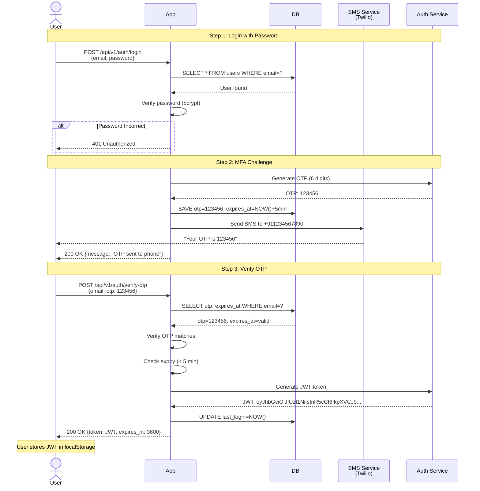

# Phase 7: Security & Compliance (Step 6)

## Security Architecture Overview

Banking systems require **defense in depth** - multiple layers of security.

```mermaid
graph TB
    subgraph "Layer 1: Network Security"
        WAF["Web Application Firewall<br/>(AWS WAF)<br/>• Block SQL injection<br/>• Block XSS attacks<br/>• Rate limiting"]
        DDoS["DDoS Protection<br/>(AWS Shield)<br/>• Absorb large attacks<br/>• Auto-scaling"]
    end

    subgraph "Layer 2: Application Security"
        Auth["Authentication<br/>• Email + Password<br/>• MFA (OTP)<br/>• JWT Tokens"]
        Authz["Authorization<br/>• RBAC<br/>• Permission checks"]
        Input["Input Validation<br/>• Sanitize inputs<br/>• Prevent injection"]
    end

    subgraph "Layer 3: Data Security"
        TLS["Encryption in Transit<br/>• TLS 1.2+<br/>• HTTPS only"]
        AES["Encryption at Rest<br/>• AES-256<br/>• Database encryption"]
        Secrets["Secrets Management<br/>• AWS Secrets Manager<br/>• No hardcoded passwords"]
    end

    subgraph "Layer 4: Monitoring & Audit"
        Logs["Audit Logs<br/>• All transactions<br/>• 7-year retention"]
        Monitor["Security Monitoring<br/>• Failed login attempts<br/>• Anomaly detection"]
        Alerts["Real-time Alerts<br/>• Suspicious activity<br/>• Data breaches"]
    end

    Internet[Internet] --> WAF
    WAF --> DDoS
    DDoS --> Auth
    Auth --> Authz
    Authz --> Input
    Input --> TLS
    TLS --> AES
    AES --> Secrets
    Secrets --> Logs
    Logs --> Monitor
    Monitor --> Alerts

    style WAF fill:#ef5350,color:#fff
    style DDoS fill:#ef5350,color:#fff
    style Auth fill:#ff9800,color:#fff
    style Authz fill:#ff9800,color:#fff
    style TLS fill:#4caf50,color:#fff
    style AES fill:#4caf50,color:#fff
    style Logs fill:#2196f3,color:#fff
```



---

## 1. Authentication & Authorization

### Multi-Factor Authentication (MFA) Flow



---

### JWT Token Structure

```javascript
// Header
{
  "alg": "HS256",  // HMAC with SHA-256
  "typ": "JWT"
}

// Payload (Claims)
{
  "user_id": "USR123456",
  "email": "john@example.com",
  "roles": ["USER"],
  "iat": 1673784000,  // Issued at: 2025-01-15 10:00:00
  "exp": 1673787600   // Expires: 2025-01-15 11:00:00 (1 hour)
}

// Signature (prevents tampering)
HMACSHA256(
  base64UrlEncode(header) + "." + base64UrlEncode(payload),
  SECRET_KEY
)
```

**Example JWT**:
```
eyJhbGciOiJIUzI1NiIsInR5cCI6IkpXVCJ9.
eyJ1c2VyX2lkIjoiVVNSMTIzNDU2IiwiZW1haWwiOiJqb2huQGV4YW1wbGUuY29tIn0.
SflKxwRJSMeKKF2QT4fwpMeJf36POk6yJV_adQssw5c
```

**Code: Generating JWT**:
```java
@Service
public class JWTService {

    @Value("${jwt.secret}")
    private String SECRET_KEY;

    public String generateToken(User user) {
        return Jwts.builder()
            .setSubject(user.getUserId())
            .claim("email", user.getEmail())
            .claim("roles", user.getRoles())
            .setIssuedAt(new Date())
            .setExpiration(new Date(System.currentTimeMillis() + 3600000))  // 1 hour
            .signWith(SignatureAlgorithm.HS256, SECRET_KEY)
            .compact();
    }

    public Claims validateToken(String token) {
        return Jwts.parser()
            .setSigningKey(SECRET_KEY)
            .parseClaimsJws(token)
            .getBody();
    }
}
```

---

### Role-Based Access Control (RBAC)

**Roles**:
```
1. USER: Regular customer (view balance, transfer, pay bills)
2. ADMIN: Bank employee (view all users, freeze accounts)
3. SUPER_ADMIN: IT admin (user management, system config)
```

**Permissions Matrix**:

| Operation | USER | ADMIN | SUPER_ADMIN |
|-----------|------|-------|-------------|
| View own balance | ✓ | ✓ | ✓ |
| Transfer funds (own account) | ✓ | ✓ | ✓ |
| View other users' accounts | ❌ | ✓ | ✓ |
| Freeze account | ❌ | ✓ | ✓ |
| Create admin user | ❌ | ❌ | ✓ |

**Code: Authorization Check**:
```java
@RestController
public class AccountController {

    @GetMapping("/api/v1/admin/accounts")
    @PreAuthorize("hasRole('ADMIN') or hasRole('SUPER_ADMIN')")
    public List<Account> getAllAccounts() {
        // Only admins can view all accounts
        return accountService.findAll();
    }

    @PostMapping("/api/v1/admin/accounts/{id}/freeze")
    @PreAuthorize("hasRole('ADMIN')")
    public ResponseEntity<?> freezeAccount(@PathVariable String id) {
        accountService.freeze(id);
        return ResponseEntity.ok("Account frozen");
    }
}
```

---

## 2. Encryption

### Encryption in Transit (TLS 1.2+)

**What is TLS?**
```
Without TLS (HTTP):
Client → Server: "Transfer $500 to ACC456"
Hacker intercepts: Can read and modify! ❌

With TLS (HTTPS):
Client → Server: "8f7a3bc2d9e1f4a5b6c7..." (encrypted)
Hacker intercepts: Cannot read gibberish! ✓
```

**Nginx Configuration**:
```nginx
server {
    listen 443 ssl http2;
    server_name api.mybank.com;

    # TLS Certificate
    ssl_certificate /etc/ssl/certs/mybank.crt;
    ssl_certificate_key /etc/ssl/private/mybank.key;

    # TLS Protocol (only 1.2 and 1.3)
    ssl_protocols TLSv1.2 TLSv1.3;

    # Strong Ciphers Only
    ssl_ciphers 'ECDHE-RSA-AES256-GCM-SHA384:ECDHE-RSA-AES128-GCM-SHA256';
    ssl_prefer_server_ciphers on;

    # HSTS (Force HTTPS for 1 year)
    add_header Strict-Transport-Security "max-age=31536000; includeSubDomains" always;

    location / {
        proxy_pass http://backend;
    }
}

# Redirect HTTP to HTTPS
server {
    listen 80;
    server_name api.mybank.com;
    return 301 https://$host$request_uri;
}
```

---

### Encryption at Rest (AES-256)

**Database Encryption (PostgreSQL)**:

```sql
-- Enable encryption at database level
ALTER SYSTEM SET ssl = on;
ALTER SYSTEM SET ssl_cert_file = '/path/to/server.crt';
ALTER SYSTEM SET ssl_key_file = '/path/to/server.key';

-- Encrypted column (for sensitive data)
CREATE EXTENSION pgcrypto;

CREATE TABLE users (
    user_id VARCHAR(16) PRIMARY KEY,
    email VARCHAR(255),
    ssn VARCHAR(255),  -- Social Security Number (sensitive!)
    encrypted_ssn BYTEA  -- Store encrypted version
);

-- Insert with encryption
INSERT INTO users (user_id, email, encrypted_ssn)
VALUES (
    'USR123',
    'john@example.com',
    pgp_sym_encrypt('123-45-6789', 'encryption_key')
);

-- Query with decryption
SELECT
    user_id,
    email,
    pgp_sym_decrypt(encrypted_ssn, 'encryption_key') AS ssn
FROM users
WHERE user_id = 'USR123';
```

**Application-Level Encryption**:
```java
@Service
public class EncryptionService {

    @Value("${encryption.key}")
    private String ENCRYPTION_KEY;

    public String encrypt(String plainText) {
        try {
            SecretKeySpec key = new SecretKeySpec(
                ENCRYPTION_KEY.getBytes(), "AES"
            );

            Cipher cipher = Cipher.getInstance("AES/GCM/NoPadding");
            cipher.init(Cipher.ENCRYPT_MODE, key);

            byte[] encrypted = cipher.doFinal(plainText.getBytes());
            return Base64.getEncoder().encodeToString(encrypted);

        } catch (Exception e) {
            throw new EncryptionException("Encryption failed", e);
        }
    }

    public String decrypt(String encryptedText) {
        try {
            SecretKeySpec key = new SecretKeySpec(
                ENCRYPTION_KEY.getBytes(), "AES"
            );

            Cipher cipher = Cipher.getInstance("AES/GCM/NoPadding");
            cipher.init(Cipher.DECRYPT_MODE, key);

            byte[] decoded = Base64.getDecoder().decode(encryptedText);
            byte[] decrypted = cipher.doFinal(decoded);

            return new String(decrypted);

        } catch (Exception e) {
            throw new EncryptionException("Decryption failed", e);
        }
    }
}
```

---

## 3. Input Validation & Attack Prevention

### SQL Injection Prevention

```java
// ❌ WRONG: Vulnerable to SQL injection
public User findByEmail(String email) {
    String sql = "SELECT * FROM users WHERE email = '" + email + "'";
    return jdbcTemplate.queryForObject(sql, new UserRowMapper());
}

// Attack: email = "' OR '1'='1"
// Query becomes: SELECT * FROM users WHERE email = '' OR '1'='1'
// Returns ALL users! ❌

// ✓ RIGHT: Use parameterized queries
public User findByEmail(String email) {
    String sql = "SELECT * FROM users WHERE email = ?";
    return jdbcTemplate.queryForObject(sql, new UserRowMapper(), email);
}

// Attack: email = "' OR '1'='1"
// Query: SELECT * FROM users WHERE email = '\' OR \'1\'=\'1'
// No injection! ✓
```

---

### XSS (Cross-Site Scripting) Prevention

```java
// ❌ WRONG: Display user input directly
@GetMapping("/profile")
public String profile(Model model, @RequestParam String name) {
    model.addAttribute("userName", name);  // Dangerous!
    return "profile";
}

// Attack: name = "<script>alert('XSS')</script>"
// Browser executes script! ❌

// ✓ RIGHT: Sanitize input
@GetMapping("/profile")
public String profile(Model model, @RequestParam String name) {
    String sanitized = HtmlUtils.htmlEscape(name);
    model.addAttribute("userName", sanitized);
    return "profile";
}

// Attack: name = "<script>alert('XSS')</script>"
// Displayed as: &lt;script&gt;alert('XSS')&lt;/script&gt;
// Not executed! ✓
```

---

### CSRF (Cross-Site Request Forgery) Prevention

```java
// Spring Security CSRF Protection
@Configuration
public class SecurityConfig extends WebSecurityConfigurerAdapter {

    @Override
    protected void configure(HttpSecurity http) throws Exception {
        http.csrf()
            .csrfTokenRepository(CookieCsrfTokenRepository.withHttpOnlyFalse());
    }
}
```

**HTML Form with CSRF Token**:
```html
<form method="POST" action="/api/v1/transfers">
    <input type="hidden" name="_csrf" value="${_csrf.token}"/>
    <input name="amount" type="number"/>
    <button type="submit">Transfer</button>
</form>
```

**Without CSRF**:
```
Attacker creates malicious site:
<form action="https://mybank.com/api/v1/transfers" method="POST">
    <input name="amount" value="10000"/>
    <input name="to_account" value="ATTACKER_ACCOUNT"/>
</form>
<script>document.forms[0].submit();</script>

If user visits attacker site while logged in → Money transferred! ❌

With CSRF token:
- Attacker doesn't know CSRF token
- Request rejected! ✓
```

---

## 4. Audit Logging

### What to Log?

```json
{
  "timestamp": "2025-01-15T10:30:45.123Z",
  "event_type": "FUND_TRANSFER",
  "user_id": "USR123456",
  "session_id": "SES789012",
  "ip_address": "192.168.1.1",
  "user_agent": "BankApp/1.2.3 iOS",
  "action": "TRANSFER",
  "resource": "ACCOUNT",
  "resource_id": "ACC123456",
  "details": {
    "from_account": "ACC123456",
    "to_account": "ACC654321",
    "amount": 5000.00,
    "status": "SUCCESS"
  },
  "geolocation": {
    "country": "IN",
    "city": "Mumbai",
    "lat": 19.0760,
    "lon": 72.8777
  }
}
```

**Code: Audit Logger**:
```java
@Aspect
@Component
public class AuditAspect {

    @Autowired
    private AuditLogService auditLogService;

    @AfterReturning(
        pointcut = "@annotation(Audited)",
        returning = "result"
    )
    public void logAudit(JoinPoint joinPoint, Object result) {
        MethodSignature signature = (MethodSignature) joinPoint.getSignature();
        String methodName = signature.getName();

        User currentUser = getCurrentUser();
        HttpServletRequest request = getCurrentRequest();

        AuditLog log = AuditLog.builder()
            .timestamp(Instant.now())
            .userId(currentUser.getUserId())
            .ipAddress(request.getRemoteAddr())
            .action(methodName)
            .details(result)
            .build();

        auditLogService.save(log);
    }
}

// Usage
@Service
public class TransferService {

    @Audited
    public Transaction executeTransfer(TransferRequest req) {
        // ... transfer logic
        // Automatically logged after execution
    }
}
```

---

### 7-Year Retention (Compliance)

**Storage Strategy**:
```
Logs (0-90 days):
- Store in Elasticsearch (fast search)
- Cost: $0.10/GB/month

Logs (90 days - 1 year):
- Store in AWS S3 Standard
- Cost: $0.023/GB/month

Logs (1-7 years):
- Store in AWS S3 Glacier
- Cost: $0.004/GB/month (83% cheaper!)
```

**Lifecycle Policy**:
```java
public void setupLifecycle() {
    BucketLifecycleConfiguration.Rule rule = new BucketLifecycleConfiguration.Rule()
        .withId("Archive audit logs")
        .withStatus(BucketLifecycleConfiguration.ENABLED)
        .withTransitions(Arrays.asList(
            new Transition()
                .withDays(90)
                .withStorageClass(StorageClass.StandardInfrequentAccess),
            new Transition()
                .withDays(365)
                .withStorageClass(StorageClass.Glacier)
        ))
        .withExpirationInDays(2555);  // 7 years

    s3Client.setBucketLifecycleConfiguration("mybank-audit-logs", config);
}
```

---

## 5. Fraud Detection

### Anomaly Detection Rules

```java
@Service
public class FraudDetectionService {

    public void checkTransaction(Transaction txn, User user) {
        List<String> alerts = new ArrayList<>();

        // Rule 1: Unusual amount (> 10x average)
        BigDecimal avgAmount = getAverageTransactionAmount(user.getUserId());
        if (txn.getAmount().compareTo(avgAmount.multiply(new BigDecimal(10))) > 0) {
            alerts.add("UNUSUAL_AMOUNT");
        }

        // Rule 2: Multiple transfers in short time (> 5 in 1 hour)
        long recentCount = getRecentTransactionCount(user.getUserId(), 1);  // 1 hour
        if (recentCount > 5) {
            alerts.add("HIGH_FREQUENCY");
        }

        // Rule 3: Login from new location
        String currentCountry = getCountryFromIP(getCurrentIP());
        String lastCountry = user.getLastLoginCountry();
        if (!currentCountry.equals(lastCountry)) {
            alerts.add("NEW_LOCATION");
        }

        // Rule 4: Large transfer to new beneficiary
        boolean isNewBeneficiary = !beneficiaryRepository.exists(
            user.getUserId(),
            txn.getToAccount()
        );
        if (isNewBeneficiary && txn.getAmount().compareTo(new BigDecimal(10000)) > 0) {
            alerts.add("NEW_BENEFICIARY_LARGE_AMOUNT");
        }

        // If alerts exist, block transaction and notify user
        if (!alerts.isEmpty()) {
            txn.setStatus(TransactionStatus.BLOCKED);
            sendFraudAlert(user, alerts);
            throw new SuspiciousActivityException(
                "Transaction blocked due to: " + String.join(", ", alerts)
            );
        }
    }
}
```

---

## 6. Compliance (PCI-DSS, GDPR, RBI)

### PCI-DSS Requirements (Payment Card Industry)

| Requirement | Implementation |
|-------------|----------------|
| **1. Firewall** | AWS WAF + Security Groups |
| **2. No default passwords** | Enforce strong password policy |
| **3. Protect cardholder data** | AES-256 encryption |
| **4. Encrypt data in transit** | TLS 1.2+ |
| **5. Antivirus** | AWS GuardDuty (threat detection) |
| **6. Secure code** | Code reviews, SAST/DAST tools |
| **7. Access control** | RBAC, least privilege |
| **8. Unique IDs** | User IDs, audit logs |
| **9. Physical security** | AWS data centers |
| **10. Audit logs** | 7-year retention |
| **11. Security testing** | Quarterly pen tests |
| **12. Security policy** | Documented policies |

---

### GDPR Compliance (EU Data Protection)

```java
// Right to Access (User can download all their data)
@GetMapping("/api/v1/users/me/data")
public ResponseEntity<byte[]> downloadMyData() {
    User user = getCurrentUser();

    // Collect all user data
    Map<String, Object> data = new HashMap<>();
    data.put("profile", userService.getProfile(user.getUserId()));
    data.put("accounts", accountService.getAccounts(user.getUserId()));
    data.put("transactions", transactionService.getAll(user.getUserId()));
    data.put("loans", loanService.getLoans(user.getUserId()));

    // Generate JSON export
    byte[] json = objectMapper.writeValueAsBytes(data);

    return ResponseEntity.ok()
        .header("Content-Disposition", "attachment; filename=my-data.json")
        .body(json);
}

// Right to Erasure (User can delete account)
@DeleteMapping("/api/v1/users/me")
public ResponseEntity<?> deleteMyAccount() {
    User user = getCurrentUser();

    // Anonymize user data (don't delete - financial records must be kept)
    userService.anonymize(user.getUserId());

    return ResponseEntity.ok("Account deleted. Data anonymized.");
}
```

---

## 7. Security Monitoring & Alerting

### Metrics to Monitor

```
1. Failed Login Attempts:
   - Normal: < 10/hour
   - Alert: > 100/hour (brute force attack)

2. Unusual IP Locations:
   - Alert: User login from 2 countries in 10 minutes

3. API Error Rates:
   - Normal: < 1%
   - Alert: > 5% (potential attack)

4. Database Queries:
   - Alert: Sudden spike in SELECT * queries (data exfiltration)

5. Privilege Escalation:
   - Alert: Regular user accessing admin endpoints
```

**Code: Real-time Alerts**:
```java
@Service
public class SecurityMonitor {

    @Autowired
    private SlackService slackService;

    @Scheduled(fixedRate = 60000)  // Every minute
    public void checkFailedLogins() {
        long failedLogins = auditLogRepository.countByEventTypeAndTimestampAfter(
            "LOGIN_FAILED",
            Instant.now().minus(1, ChronoUnit.HOURS)
        );

        if (failedLogins > 100) {
            slackService.sendAlert(
                "⚠️ SECURITY ALERT: " + failedLogins +
                " failed login attempts in last hour. Possible brute force attack!"
            );
        }
    }
}
```

---

## Summary: Security Checklist

| Layer | Feature | Status |
|-------|---------|--------|
| **Network** | WAF (SQL injection, XSS) | ✓ |
| **Network** | DDoS Protection | ✓ |
| **Auth** | Multi-Factor Authentication | ✓ |
| **Auth** | JWT Tokens (stateless) | ✓ |
| **Auth** | RBAC (role-based access) | ✓ |
| **Encryption** | TLS 1.2+ (in transit) | ✓ |
| **Encryption** | AES-256 (at rest) | ✓ |
| **Encryption** | Secrets Manager (no hardcoded keys) | ✓ |
| **Input** | Parameterized queries (SQL injection) | ✓ |
| **Input** | HTML escaping (XSS) | ✓ |
| **Input** | CSRF tokens | ✓ |
| **Audit** | Comprehensive logging | ✓ |
| **Audit** | 7-year retention | ✓ |
| **Fraud** | Anomaly detection | ✓ |
| **Fraud** | Real-time alerts | ✓ |
| **Compliance** | PCI-DSS | ✓ |
| **Compliance** | GDPR | ✓ |

**Next**: Phase 8 - Database & API Design! 🚀
