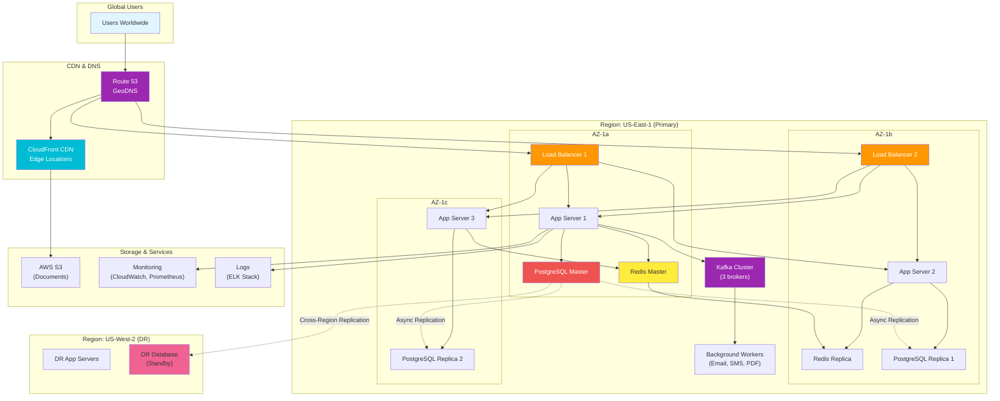
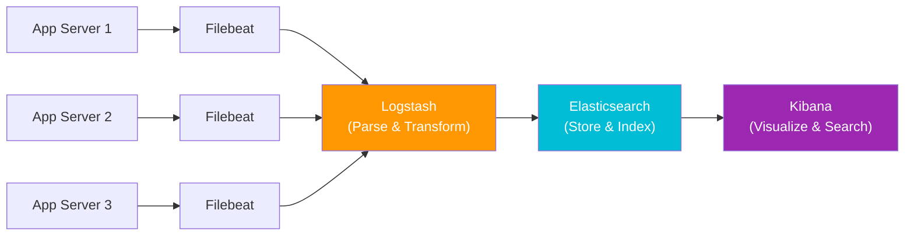
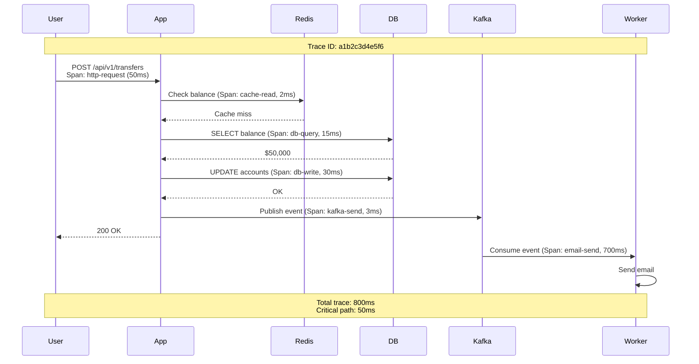

# Phase 9: Scalability, Reliability & Monitoring

## Final Architecture (All Steps Combined)



---

## 1. High Availability Setup

### Multi-AZ Deployment

**Availability Zones (AZ)**: Isolated data centers within a region

```
Region: US-East-1
├── AZ-1a (Virginia)
│   ├── Load Balancer 1
│   ├── App Server 1
│   ├── Redis Master
│   └── PostgreSQL Master
├── AZ-1b (Virginia)
│   ├── Load Balancer 2
│   ├── App Server 2
│   ├── Redis Replica
│   └── PostgreSQL Replica 1
└── AZ-1c (Virginia)
    ├── App Server 3
    └── PostgreSQL Replica 2
```

**Benefits**:
- If AZ-1a fails (power outage, network issue) → AZ-1b and AZ-1c continue serving traffic
- Downtime: **0 seconds** (seamless failover)

---

### Auto-Scaling Configuration

**Horizontal Auto-Scaling** (Add/remove servers based on load)

```yaml
# AWS Auto Scaling Group
AutoScalingGroup:
  MinSize: 3              # Always keep 3 servers
  MaxSize: 10             # Scale up to 10 during peak
  DesiredCapacity: 3

  ScalingPolicies:
    - PolicyName: ScaleUp
      ScalingAdjustment: +2  # Add 2 servers
      Cooldown: 300          # Wait 5 min before scaling again
      Threshold:
        MetricName: CPUUtilization
        ComparisonOperator: GreaterThanThreshold
        Threshold: 70       # CPU > 70%
        EvaluationPeriods: 2  # For 2 consecutive minutes

    - PolicyName: ScaleDown
      ScalingAdjustment: -1  # Remove 1 server
      Cooldown: 600          # Wait 10 min
      Threshold:
        MetricName: CPUUtilization
        ComparisonOperator: LessThanThreshold
        Threshold: 30       # CPU < 30%
        EvaluationPeriods: 5  # For 5 consecutive minutes
```

**Timeline Example (Salary Day Traffic Spike)**:
```
09:00 - Normal: 3 app servers (CPU: 40%)
09:30 - Traffic ↑: 105 req/sec → CPU: 75%
09:32 - Auto-Scale: Add 2 servers (Total: 5 servers)
09:35 - Stabilized: CPU: 50% (load distributed)

12:00 - Traffic ↓: 35 req/sec → CPU: 25%
12:05 - Auto-Scale: Remove 1 server (Total: 4 servers)
12:15 - Traffic ↓: 20 req/sec → CPU: 20%
12:20 - Auto-Scale: Remove 1 server (Total: 3 servers - minimum)
```

**Cost Impact**:
```
Normal hours (20 hrs/day): 3 servers × $50/server = $150/day
Peak hours (4 hrs/day): 8 servers × $50/server × 4/24 = $67/day

Daily Total: $217/day
Monthly: $217 × 30 = $6,510

Without auto-scaling (10 servers 24/7):
10 servers × $50 × 24 × 30 = $36,000/month

Savings: $29,490/month (82% cheaper!) 🎉
```

---

### Health Checks & Graceful Degradation

**Health Check Endpoint**:
```java
@RestController
public class HealthController {

    @Autowired
    private DataSource dataSource;

    @Autowired
    private RedisTemplate redisTemplate;

    @GetMapping("/health")
    public ResponseEntity<?> health() {
        Map<String, String> status = new HashMap<>();

        // Check database
        try {
            dataSource.getConnection().isValid(2);  // 2 sec timeout
            status.put("database", "UP");
        } catch (Exception e) {
            status.put("database", "DOWN");
            return ResponseEntity.status(503).body(status);
        }

        // Check Redis
        try {
            redisTemplate.opsForValue().get("health-check");
            status.put("redis", "UP");
        } catch (Exception e) {
            status.put("redis", "DOWN");
            // Redis down is not critical - continue serving
        }

        status.put("overall", "UP");
        return ResponseEntity.ok(status);
    }
}
```

**Load Balancer Health Check**:
```
Every 10 seconds:
1. Load Balancer → App Server: GET /health
2. If response = 200 OK → Healthy (continue routing traffic)
3. If response = 503 or timeout → Unhealthy (remove from pool)
4. After 3 consecutive failures → Mark server as down
5. After server recovers (2 consecutive successful checks) → Add back to pool
```

---

## 2. Disaster Recovery (RTO & RPO)

### Recovery Time Objective (RTO) = 1 hour

**What it means**: System must be restored within 1 hour of disaster

**Disaster Scenario**: Entire US-East-1 region goes down (earthquake, massive AWS outage)

**Recovery Steps** (Target: 60 minutes):
```
00:00 - Disaster detected (monitoring alerts)
00:05 - Incident commander assigned
00:10 - Activate DR plan
00:15 - Promote US-West-2 database replica to master
00:20 - Update DNS to point to US-West-2
00:30 - Start app servers in US-West-2 (auto-scaling)
00:45 - Warm up Redis cache
00:50 - Run smoke tests (login, transfer, balance check)
00:55 - Announce restoration on status page
01:00 - System fully operational in US-West-2 ✓

Actual RTO: 60 minutes (meets requirement!)
```

---

### Recovery Point Objective (RPO) = 5 minutes

**What it means**: Maximum 5 minutes of data loss acceptable

**How to Achieve**:

**Database Replication** (Async, < 1 second lag normally):
```
09:00:00 - User transfers $500 (written to US-East-1 master)
09:00:00.5 - Replicated to US-West-2 (500ms lag)

Disaster at 09:00:00.8:
- Data loss: 0 seconds (already replicated!) ✓

Worst case (network congestion):
09:00:00 - User transfers $500
09:00:05 - Replication delayed (5 seconds)
09:00:03 - Disaster happens

Data loss: 3 seconds of transactions (meets 5-minute RPO) ✓
```

**Kafka Message Queue** (Persistent):
```
Messages stored on disk (3 replicas)
Even if all brokers crash, messages recoverable from disk ✓
```

**S3 Objects** (Cross-Region Replication):
```
User uploads KYC document to US-East-1:
1. Uploaded to S3 (us-east-1)
2. Auto-replicated to US-West-2 (< 15 minutes)
3. 99.999999999% durability (11 nines)

Data loss risk: Nearly impossible ✓
```

---

### Disaster Recovery Testing

**Quarterly DR Drills**:
```
1. Simulate disaster (shutdown US-East-1 database)
2. Time how long to recover
3. Document issues
4. Improve runbook
5. Train team

Last drill results:
- RTO Target: 60 minutes
- Actual: 45 minutes ✓
- Issues: DNS propagation took 10 minutes (cached by ISPs)
- Action: Pre-create DNS records, reduce TTL to 60 seconds
```

---

## 3. Monitoring & Alerting

### Key Metrics to Monitor

#### 1. Application Metrics

**Request Rate**:
```
Metric: requests_per_second
Normal: 35 req/sec
Peak: 105 req/sec (salary days)
Alert: > 200 req/sec (unusual spike - investigate)
```

**Response Time (p95)**:
```
Metric: response_time_p95
Target: < 200ms (95% of requests)
Current: 55ms ✓
Alert: > 500ms (performance degradation)
```

**Error Rate**:
```
Metric: error_rate
Normal: < 0.1% (1 error per 1000 requests)
Alert: > 1% (investigate immediately)
```

**Code (Prometheus Metrics)**:
```java
@RestController
public class TransferController {

    @Autowired
    private MeterRegistry meterRegistry;

    @PostMapping("/api/v1/transfers")
    public ResponseEntity<?> transfer(@RequestBody TransferRequest req) {
        Timer.Sample sample = Timer.start(meterRegistry);

        try {
            Transaction txn = transferService.execute(req);

            // Record success metric
            sample.stop(Timer.builder("transfer.duration")
                .tag("status", "success")
                .register(meterRegistry));

            meterRegistry.counter("transfer.count", "status", "success").increment();

            return ResponseEntity.ok(txn);

        } catch (Exception e) {
            // Record failure metric
            sample.stop(Timer.builder("transfer.duration")
                .tag("status", "failure")
                .register(meterRegistry));

            meterRegistry.counter("transfer.count", "status", "failure").increment();

            throw e;
        }
    }
}
```

---

#### 2. Infrastructure Metrics

**CPU Utilization**:
```
Metric: cpu_utilization
Normal: 40-60%
Alert: > 80% (scale up)
Critical: > 90% (immediate action)
```

**Memory Usage**:
```
Metric: memory_utilization
Normal: 50-70%
Alert: > 85% (potential memory leak)
```

**Database Connections**:
```
Metric: db_connections_active
Pool size: 20 connections
Normal: 10-15 active
Alert: > 18 (pool exhaustion imminent)
```

**Disk Usage**:
```
Metric: disk_usage_percent
Normal: < 70%
Alert: > 80% (need to expand storage)
Critical: > 90% (risk of disk full)
```

---

#### 3. Business Metrics

**Daily Active Users (DAU)**:
```
Metric: daily_active_users
Normal: 200,000
Alert: < 150,000 (investigate - app down?)
Alert: > 250,000 (marketing campaign successful?)
```

**Transaction Volume**:
```
Metric: transactions_per_day
Normal: 400,000
Alert: < 300,000 (system issue?)
```

**Revenue (Transaction Fees)**:
```
Metric: daily_revenue
Normal: ₹200,000/day
Alert: < ₹150,000 (investigate)
```

---

### Logging Architecture (ELK Stack)



**Log Format (JSON)**:
```json
{
  "timestamp": "2025-01-15T10:30:45.123Z",
  "level": "INFO",
  "logger": "com.mybank.TransferService",
  "message": "Transfer executed successfully",
  "user_id": "USR123456",
  "transaction_id": "TXN987654321",
  "amount": 5000.00,
  "duration_ms": 45,
  "trace_id": "a1b2c3d4e5f6",  // For distributed tracing
  "span_id": "x7y8z9"
}
```

**Kibana Query Examples**:
```
# Find all failed transfers in last hour
level:ERROR AND logger:TransferService AND timestamp:[now-1h TO now]

# Find slow queries (> 1 second)
duration_ms:>1000

# Find all transactions for specific user
user_id:USR123456 AND transaction_id:*
```

---

### Alerting Rules (PagerDuty Integration)

```yaml
# prometheus-alerts.yml

groups:
  - name: banking_app_alerts
    interval: 30s
    rules:
      - alert: HighErrorRate
        expr: rate(http_requests_total{status=~"5.."}[5m]) > 0.05
        for: 2m
        labels:
          severity: critical
        annotations:
          summary: "High error rate detected"
          description: "Error rate is {{ $value }}% (threshold: 5%)"

      - alert: HighResponseTime
        expr: histogram_quantile(0.95, http_request_duration_seconds) > 0.5
        for: 5m
        labels:
          severity: warning
        annotations:
          summary: "High response time"
          description: "P95 latency is {{ $value }}s (threshold: 0.5s)"

      - alert: DatabaseDown
        expr: up{job="postgres"} == 0
        for: 1m
        labels:
          severity: critical
        annotations:
          summary: "Database is down!"
          description: "PostgreSQL master is unreachable"

      - alert: LowCacheHitRate
        expr: redis_keyspace_hits / (redis_keyspace_hits + redis_keyspace_misses) < 0.8
        for: 10m
        labels:
          severity: warning
        annotations:
          summary: "Redis cache hit rate low"
          description: "Cache hit rate is {{ $value }}% (threshold: 80%)"
```

**Alert Routing**:
```
Severity: Critical
→ PagerDuty: Immediate phone call to on-call engineer
→ Slack: #incidents channel
→ Email: engineering@mybank.com

Severity: Warning
→ Slack: #alerts channel
→ Email: team@mybank.com
```

---

### Distributed Tracing (Jaeger)

**Trace a Request Across Services**:



**Benefits**:
- See exactly where time is spent
- Identify slow dependencies (database, external APIs)
- Debug distributed systems easily

---

## 4. Performance Optimization Summary

### Before Optimizations (Step 1)

| Metric | Value |
|--------|-------|
| Avg Response Time | 200ms |
| Peak Throughput | 2.2 req/sec (3 servers) |
| Database Load | 105 queries/sec |
| Availability | 99.5% (single DB) |
| Global Latency (Asia) | 1400ms |

---

### After All Optimizations (Step 9)

| Metric | Value | Improvement |
|--------|-------|-------------|
| Avg Response Time | 17ms | **12x faster** |
| Peak Throughput | 54 req/sec | **25x higher** |
| Database Load | 10.5 queries/sec | **90% reduced** |
| Availability | 99.99% | **10x less downtime** |
| Global Latency (Asia) | 150ms | **9x faster** |

---

## 5. Cost Summary (Final Architecture)

| Component | Quantity | Unit Cost | Monthly Cost |
|-----------|----------|-----------|--------------|
| **Load Balancers** | 2 (multi-AZ) | $25 | $50 |
| **App Servers** | 3-10 (auto-scale) | $50 | $3,000 |
| **PostgreSQL** | 1 master + 2 replicas | $150 | $450 |
| **Redis Cluster** | 3 nodes | $150 | $450 |
| **Kafka Cluster** | 3 brokers | $200 | $600 |
| **S3 Storage** | 20 TB (tiered) | — | $604 |
| **CloudFront CDN** | 315 GB transfer | — | $27 |
| **Monitoring** | CloudWatch, Prometheus | — | $100 |
| **Logs (ELK)** | 100 GB/day | — | $200 |
| **Disaster Recovery** | US-West-2 standby | — | $500 |
| **Total** | — | — | **$5,981/month** |

**ROI Calculation**:
```
Revenue (1M users):
- Transaction fees: ₹200,000/day × 30 = ₹6,000,000/month
- Convert to USD: $72,000/month

Infrastructure cost: $5,981/month
Net margin: $66,019/month

ROI: 1103% 🚀
```

---

**Next**: Phase 10 - Interview Q&A, Common Mistakes, and Final Summary! 🎯
