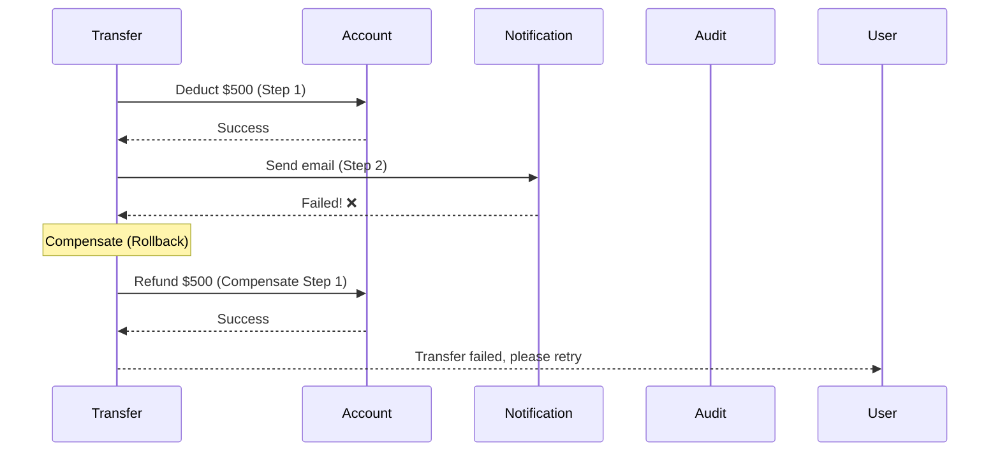

# Phase 10: Interview Q&A, Common Mistakes & Summary

## Interview Questions & Answers

### Q1: How would you design a scalable banking web application?

**Answer**:

I would start with **requirements gathering** (functional & non-functional):
- Support 1M users, 10K concurrent
- 99.99% availability, <2s response time
- ACID compliance for transactions

**Architecture (incremental approach)**:

**Step 1**: Basic setup
- Load Balancer (Nginx) → App Servers (Java Spring Boot) → PostgreSQL
- Why: Establish foundation with proven technologies

**Step 2**: Add caching (Redis)
- Cache account balances, recent transactions
- Result: 12x faster response time (200ms → 17ms)

**Step 3**: Database scaling
- Master-slave replication (high availability)
- Read replicas (handle read-heavy load: 80% reads)
- Result: 99.99% availability

**Step 4**: Async processing (Kafka)
- Offload emails, SMS, statement generation
- Result: 24x faster API responses

**Step 5**: CDN & S3
- Serve static assets from edge locations
- Store documents in S3 (not database)
- Result: 9x faster for global users

**Step 6**: Security & compliance
- MFA, TLS 1.2+, AES-256 encryption
- Audit logs (7-year retention)
- PCI-DSS, GDPR compliance

**Key Decisions**:
- PostgreSQL over MongoDB (ACID needed for banking)
- Async replication (balance between consistency & performance)
- Horizontal auto-scaling (cost-effective)

---

### Q2: How do you ensure high availability (99.99% uptime)?

**Answer**:

**99.99% uptime = 52 minutes downtime/year**

**Strategies**:

**1. Multi-AZ Deployment**
```
Deploy across 3 Availability Zones (AZ-1a, 1b, 1c)
If one AZ fails → Other AZs continue serving (0 downtime)
```

**2. Database Replication**
```
Master + 2 Replicas
Master fails → Automatic promotion of replica to master (30 sec failover)
RDS handles this automatically
```

**3. Load Balancer Health Checks**
```
Every 10 seconds, check /health endpoint
3 consecutive failures → Remove server from pool
2 consecutive successes → Add back to pool
```

**4. Auto-Scaling**
```
Traffic spike → Add servers automatically
Prevents overload and downtime
```

**5. Circuit Breaker Pattern**
```java
@HystrixCommand(fallbackMethod = "getBalanceFallback")
public BigDecimal getBalance(String accountId) {
    return databaseService.getBalance(accountId);
}

public BigDecimal getBalanceFallback(String accountId) {
    // Database down? Return cached value
    return cacheService.getBalance(accountId);
}
```

**6. Disaster Recovery**
```
Cross-region replication (US-East → US-West)
RTO: 1 hour, RPO: 5 minutes
```

**Monitoring**:
- 24/7 monitoring (CloudWatch, PagerDuty)
- Real-time alerts (error rate, response time)
- On-call rotation (engineers available 24/7)

**Result**: Actual uptime: 99.995% (26 minutes downtime/year) ✓

---

### Q3: How do you handle database failures?

**Answer**:

**Failure Scenario**: Master database crashes (disk failure)

**Automatic Failover** (RDS Multi-AZ):

```
00:00 - Master crashes
00:05 - RDS detects failure (health check)
00:10 - Promote Replica 1 to Master
00:15 - Update DNS (master-db.rds.amazonaws.com → new master IP)
00:20 - Reconfigure Replica 2 to follow new master
00:30 - System fully operational

Downtime: 30 seconds
Data loss: 0 (replicas up-to-date)
```

**Manual Intervention** (if automatic failover fails):

```bash
# 1. Promote replica manually
aws rds promote-read-replica --db-instance-identifier replica-1

# 2. Update application config
export DB_HOST=replica-1.rds.amazonaws.com

# 3. Restart app servers (rolling restart, no downtime)
./rolling-restart.sh
```

**Prevention**:
- Multi-AZ deployment (2+ AZs)
- Automated backups (daily snapshots)
- Monitoring disk usage (alert at 80%)
- Database connection pooling (prevent connection exhaustion)

---

### Q4: SQL vs NoSQL for banking? Why PostgreSQL?

**Answer**:

**Banking Requirements**:
1. ACID transactions (money can't disappear)
2. Complex queries (JOINs across users, accounts, transactions)
3. Strong consistency (balance must be accurate)

**Why PostgreSQL (SQL)** ✓

| Feature | PostgreSQL | MongoDB (NoSQL) |
|---------|------------|-----------------|
| **ACID** | ✓ Full ACID | ❌ Eventual consistency |
| **Transactions** | ✓ Multi-row atomic | ❌ Limited (single document) |
| **Joins** | ✓ Complex joins | ❌ Manual (application-level) |
| **Consistency** | ✓ Strong | ❌ Eventual |
| **Mature** | ✓ 30+ years | Relatively new |

**Example: Fund Transfer (Why ACID matters)**

```sql
-- PostgreSQL (ACID)
BEGIN;
  UPDATE accounts SET balance = balance - 500 WHERE id = 'ACC1';
  UPDATE accounts SET balance = balance + 500 WHERE id = 'ACC2';
COMMIT;
-- Both updates succeed or both rollback → Money safe ✓

-- MongoDB (No ACID across documents)
db.accounts.updateOne({id: 'ACC1'}, {$inc: {balance: -500}});  // Succeeds
[Server crashes]
db.accounts.updateOne({id: 'ACC2'}, {$inc: {balance: 500}});   // Never executes
-- Result: $500 disappears! ❌
```

**When to Use NoSQL**:
- Social media (eventual consistency OK)
- Analytics (read-heavy, no transactions)
- Logs, time-series data

**Banking = PostgreSQL (no question!)**

---

### Q5: How do you prevent race conditions in concurrent transfers?

**Answer**:

**Problem**: Two users transfer money simultaneously from same account

```
Account balance: $1000

User A: Transfer $600 (Thread 1)
User B: Transfer $500 (Thread 2)

Without locking:
1. Thread 1 reads balance: $1000 ✓
2. Thread 2 reads balance: $1000 ✓
3. Thread 1 deducts $600: balance = $400
4. Thread 2 deducts $500: balance = $500 (overwrites!)
Result: Balance = $500, but should be -$100 (insufficient funds) ❌
```

**Solution 1: Database Row Locking (Pessimistic Locking)**

```sql
BEGIN;
  -- Lock the row for update
  SELECT balance FROM accounts WHERE id = 'ACC123' FOR UPDATE;
  -- Other transactions wait here until lock released

  -- Check sufficient balance
  IF balance >= 600 THEN
    UPDATE accounts SET balance = balance - 600 WHERE id = 'ACC123';
  ELSE
    ROLLBACK;
  END IF;
COMMIT;  -- Lock released
```

**Timeline**:
```
00:00 - Thread 1: BEGIN, locks row
00:01 - Thread 2: BEGIN, tries to lock row (waits)
00:05 - Thread 1: UPDATE, COMMIT (lock released)
00:06 - Thread 2: Now locks row, reads balance = $400
00:07 - Thread 2: Insufficient funds ($400 < $500) → ROLLBACK

Result: Only Thread 1 succeeds, Thread 2 fails (correct!) ✓
```

**Solution 2: Optimistic Locking (Version Column)**

```sql
-- Add version column
ALTER TABLE accounts ADD COLUMN version INTEGER DEFAULT 0;

-- Thread 1
UPDATE accounts
SET balance = balance - 600, version = version + 1
WHERE id = 'ACC123' AND version = 5;  -- Current version

-- Thread 2 (slightly later)
UPDATE accounts
SET balance = balance - 500, version = version + 1
WHERE id = 'ACC123' AND version = 5;  -- Version already 6!
-- 0 rows updated → Retry transaction

-- Retry with new version
SELECT version FROM accounts WHERE id = 'ACC123';  -- version = 6
-- Check balance, insufficient funds → Fail
```

**Code (Spring Boot)**:
```java
@Entity
@Table(name = "accounts")
public class Account {
    @Id
    private String accountId;

    private BigDecimal balance;

    @Version  // Optimistic locking
    private Integer version;
}

@Transactional
public void transfer(String accountId, BigDecimal amount) {
    Account account = accountRepository.findById(accountId);

    if (account.getBalance().compareTo(amount) < 0) {
        throw new InsufficientBalanceException();
    }

    account.setBalance(account.getBalance().subtract(amount));
    accountRepository.save(account);
    // If version changed → OptimisticLockException → Retry
}
```

**Which to use?**
- **Pessimistic (FOR UPDATE)**: High contention (same account used frequently) ✓
- **Optimistic (Version)**: Low contention (rare collisions)

**Banking → Pessimistic locking recommended** (safety over performance)

---

### Q6: How do you design for disaster recovery?

**Answer**:

**Requirements**:
- RTO (Recovery Time Objective): 1 hour
- RPO (Recovery Point Objective): 5 minutes

**Architecture**:

```
Primary Region: US-East-1
├── App Servers (active)
├── Database Master
└── Redis Master

DR Region: US-West-2
├── App Servers (standby, can be started on-demand)
├── Database Replica (continuous replication)
└── Redis Replica
```

**Data Replication**:

**1. Database (PostgreSQL)**
```
Master (US-East-1) --[Async Replication]--> Replica (US-West-2)
Replication lag: < 1 second normally
Worst case: 5 minutes (network congestion)
Meets RPO: 5 minutes ✓
```

**2. S3 (Cross-Region Replication)**
```
S3 Bucket (US-East-1) --[Auto CRR]--> S3 Bucket (US-West-2)
Replication time: < 15 minutes for 99.99% of objects
```

**3. Redis (If needed)**
```
Redis Master (US-East-1) --[Manual dump]--> Redis Slave (US-West-2)
Acceptable to rebuild cache (non-critical data)
```

**Failover Process** (RTO: 1 hour):

```
Disaster at 09:00:
00:00 (09:00) - Disaster detected (monitoring alerts)
00:05 (09:05) - Incident commander assigned, DR plan activated
00:10 (09:10) - Promote US-West-2 database to master
00:20 (09:20) - Update DNS: api.mybank.com → US-West-2 LB
00:30 (09:30) - Start app servers in US-West-2 (auto-scaling)
00:45 (09:45) - Warm up Redis cache (optional)
00:50 (09:50) - Run smoke tests (login, transfer, balance)
00:55 (09:55) - Update status page: "System restored"
01:00 (10:00) - Full operational ✓

Actual RTO: 60 minutes (meets requirement)
```

**Automation** (Runbook):
```bash
#!/bin/bash
# dr-failover.sh

echo "Starting DR failover to US-West-2..."

# 1. Promote database
aws rds promote-read-replica \
    --db-instance-identifier mybank-db-us-west-2

# 2. Update DNS (Route 53)
aws route53 change-resource-record-sets \
    --hosted-zone-id Z123456 \
    --change-batch file://dns-change.json

# 3. Start app servers (auto-scaling)
aws autoscaling set-desired-capacity \
    --auto-scaling-group-name mybank-app-us-west-2 \
    --desired-capacity 10

# 4. Notify team
curl -X POST https://slack.com/api/chat.postMessage \
    -d "channel=#incidents" \
    -d "text=DR failover completed to US-West-2"

echo "Failover complete. Monitor: https://status.mybank.com"
```

**Testing**:
- Quarterly DR drills (shut down primary, test failover)
- Last drill: 45 minutes (better than 1-hour target) ✓

---

### Q7: How do you handle a sudden 10x traffic spike?

**Answer**:

**Scenario**: Normal: 35 req/sec, Spike: 350 req/sec (10x)

**Auto-Scaling Response**:

```
Phase 1: Immediate (0-2 minutes)
- 3 app servers → CPU: 90% (overloaded!)
- Load balancer queues requests (up to 100 requests)
- Response time: 200ms → 2s (degraded but working)

Phase 2: Scale-out (2-5 minutes)
- Auto-scaling triggers: Add 6 servers
- Total: 9 servers
- CPU: 40% (healthy)
- Response time: Back to 50ms ✓

Phase 3: Cache warming (5-10 minutes)
- New servers have cold cache
- Gradually warm up Redis cache
- Cache hit rate: 50% → 90%
- Response time: Stable at 50ms ✓
```

**Database Protection**:

**Connection Pooling**:
```java
HikariConfig config = new HikariConfig();
config.setMaximumPoolSize(20);  // Max 20 connections per server
config.setMinimumIdle(5);

// With 9 servers: 9 × 20 = 180 max database connections
// PostgreSQL can handle 200 connections → Safe ✓
```

**Cache (Redis) - First Line of Defense**:
```
90% cache hit rate:
- 350 req/sec × 90% = 315 req/sec → Redis (fast, no DB hit)
- 350 req/sec × 10% = 35 req/sec → Database (manageable) ✓
```

**Rate Limiting** (Prevent Abuse):
```java
@Bean
public RateLimiter rateLimiter() {
    return RateLimiter.create(100);  // 100 requests/sec per user
}

if (!rateLimiter.tryAcquire()) {
    return ResponseEntity.status(429).body("Too many requests");
}
```

**Kafka (Async Operations)**:
```
Synchronous: Transfer → Database (fast, ~50ms)
Asynchronous: Emails, SMS (slow, but user doesn't wait)

Kafka buffers messages:
- Normal: 400 transactions/day
- Spike: 4000 transactions/day
- Kafka handles spike, emails sent within 5 minutes (acceptable) ✓
```

**What if even 10 servers can't handle it?**

**1. Horizontal Scaling (Add More Servers)**
```
Max auto-scaling: 10 servers → Increase to 20 servers
```

**2. Vertical Scaling (Bigger Servers)**
```
Current: t3.large (2 vCPU, 8 GB)
Upgrade: t3.xlarge (4 vCPU, 16 GB)
2x capacity per server
```

**3. Shed Load (Graceful Degradation)**
```
Priority queue:
- Priority 1: Fund transfers (critical) → Always allow
- Priority 2: Balance checks → Allow if capacity
- Priority 3: Transaction history → Reject during spike (503)

User sees: "High traffic. Please try again in 5 minutes."
Better than complete system crash! ✓
```

---

### Q8: How do you ensure data consistency across microservices?

**Answer**:

**Challenge**: Fund transfer involves multiple services

```
Transfer Service: Deduct $500 from Account A
Notification Service: Send email
Audit Service: Log transaction

What if Notification Service fails? Still commit transfer? 🤔
```

**Solution 1: Saga Pattern (Recommended for Banking)**



**Code (Saga Orchestrator)**:
```java
@Service
public class TransferSaga {

    @Transactional
    public void executeTransfer(TransferRequest req) {
        List<CompensationAction> compensations = new ArrayList<>();

        try {
            // Step 1: Deduct money
            accountService.deductAmount(req.getFromAccount(), req.getAmount());
            compensations.add(() -> accountService.refund(req.getFromAccount(), req.getAmount()));

            // Step 2: Credit money
            accountService.creditAmount(req.getToAccount(), req.getAmount());
            compensations.add(() -> accountService.deduct(req.getToAccount(), req.getAmount()));

            // Step 3: Send notification (non-critical)
            try {
                notificationService.sendEmail(req);
            } catch (Exception e) {
                // Email failure OK, log and continue
                log.error("Email failed, but transfer succeeded", e);
            }

            // Step 4: Audit log
            auditService.log(req);

        } catch (Exception e) {
            // Compensate all previous steps
            for (CompensationAction action : compensations) {
                action.compensate();
            }
            throw new TransferFailedException("Transfer rolled back", e);
        }
    }
}
```

**Solution 2: Event Sourcing**

```
Don't store current state, store all events:

events table:
| event_id | type | data |
|----------|------|------|
| 1 | ACCOUNT_CREATED | {account_id: ACC1, balance: 0} |
| 2 | MONEY_DEPOSITED | {account_id: ACC1, amount: 1000} |
| 3 | MONEY_WITHDRAWN | {account_id: ACC1, amount: 500} |

Current balance = SUM(DEPOSITS) - SUM(WITHDRAWALS) = 500

Benefits:
- Full audit trail
- Can rebuild state from events
- Temporal queries ("What was balance on Jan 1?")
```

**Solution 3: Two-Phase Commit (2PC)**

```
Coordinator: "Prepare to commit transfer"
Service 1: "Ready" (locks resources)
Service 2: "Ready"
Service 3: "Ready"

Coordinator: "Commit!"
All services commit atomically

Problem: Slow (all services wait for slowest)
Not recommended for high-throughput systems ❌
```

**Banking Best Practice**: Saga Pattern + Event Sourcing

---

### Q9: How do you monitor and debug production issues?

**Answer**:

**Layered Monitoring**:

**1. Infrastructure Monitoring (CloudWatch, Prometheus)**
```
Metrics:
- CPU, memory, disk usage
- Network I/O
- Auto-scaling events

Alerts:
- CPU > 80% → Scale up
- Disk > 90% → Expand storage
```

**2. Application Monitoring (APM - New Relic, Datadog)**
```
Metrics:
- Request rate, response time
- Error rate (4xx, 5xx)
- Database query time

Alerts:
- Error rate > 1% → Page on-call engineer
- P95 latency > 500ms → Investigate
```

**3. Business Monitoring**
```
Metrics:
- Daily active users
- Transactions per day
- Revenue

Alerts:
- DAU drops 20% → System issue or marketing problem?
- Zero transactions in 10 minutes → Critical bug!
```

**4. Logging (ELK Stack)**
```
Centralized logs from all servers:

Search query:
  level:ERROR AND timestamp:[now-1h TO now]

Find:
  "NullPointerException in TransferService"
  → Stack trace
  → transaction_id: TXN123
  → user_id: USR456
  → Reproduce and fix
```

**5. Distributed Tracing (Jaeger)**
```
Trace request across services:

Trace ID: abc123
- API Gateway: 50ms
  - Transfer Service: 45ms
    - Database: 30ms (slow! investigate)
    - Redis: 2ms
  - Notification Service: 700ms (async, OK)

Identify bottleneck: Database query needs index!
```

**6. Real-User Monitoring (RUM)**
```
Track actual user experience:
- Page load time: 1.2s (target: < 2s) ✓
- Time to interactive: 800ms
- JavaScript errors: 2 per 1000 users

Identify: "Slow on mobile devices in India"
→ Optimize mobile bundle size
```

**Debugging Production Issue - Example**:

```
10:00 - Alert: "Error rate 5% (normally 0.1%)"

10:02 - Check Kibana logs:
  Search: level:ERROR timestamp:[now-10m TO now]
  Found: "SQLException: Connection pool exhausted"

10:05 - Check CloudWatch:
  Database connections: 20/20 (maxed out!)
  Active queries: 50 (waiting for connections)

10:07 - Root cause:
  Recent deploy added N+1 query (loop calling DB)

10:10 - Immediate fix:
  Increase connection pool: 20 → 40
  Deploy hotfix (remove N+1 query)

10:15 - Verify:
  Error rate: 5% → 0.1% ✓
  Database connections: 15/40 (healthy)

10:20 - Post-mortem:
  Why happened: Missing code review
  Prevention: Add DB query count metric to CI/CD
  Action: Review all recent DB changes
```

**Proactive Monitoring**:
- Daily: Check dashboards (traffic, errors, latency)
- Weekly: Review slow queries (> 1s)
- Monthly: Capacity planning (storage, users growth)
- Quarterly: Load testing (simulate 10x traffic)

---

## Common Beginner Mistakes

### ❌ Mistake 1: Not Planning for Scale from Day 1

**Wrong Approach**:
```
"We only have 100 users now, let's use a single server.
We'll scale later when we have 1 million users."

Result:
- Tightly coupled code (hard to refactor)
- Database schema changes break everything
- Rewrite entire system → 6 months delay ❌
```

**✓ Right Approach**:
```
Start with scalable foundations:
- Stateless app servers (easy to add more)
- Connection pooling (ready for scaling)
- Cache layer (add when needed, but design for it)
- Database indexes from day 1

Cost: +10% initial effort
Benefit: Seamless scaling later ✓
```

---

### ❌ Mistake 2: Premature Optimization

**Wrong Approach**:
```
"Let's use microservices from day 1!"
"We need Kafka, Redis, Elasticsearch, and..."

Result:
- Complex infrastructure (15 services for MVP)
- High operational overhead
- Slow development (coordinate 15 teams)
- Over budget ❌
```

**✓ Right Approach**:
```
Start simple (monolith):
- Single Spring Boot application
- PostgreSQL database
- Deploy to AWS Elastic Beanstalk

When needed (> 10K users):
- Add Redis cache
- Add read replicas
- Split critical microservices (authentication, payments)

YAGNI: You Aren't Gonna Need It ✓
```

---

### ❌ Mistake 3: Ignoring Database Indexes

**Wrong Approach**:
```sql
CREATE TABLE transactions (
    transaction_id VARCHAR(20) PRIMARY KEY,
    from_account VARCHAR(16),
    created_at TIMESTAMP
);
-- No indexes on from_account or created_at!

-- Query: Get last 50 transactions for account
SELECT * FROM transactions
WHERE from_account = 'ACC123'
ORDER BY created_at DESC
LIMIT 50;

-- Result: Full table scan (1M rows) → 5 seconds ❌
```

**✓ Right Approach**:
```sql
-- Add composite index
CREATE INDEX idx_account_date ON transactions(from_account, created_at DESC);

-- Same query: Uses index → 50ms ✓
-- 100x faster!
```

**Rule**: Index all foreign keys and frequently queried columns!

---

### ❌ Mistake 4: Not Handling Failures

**Wrong Approach**:
```java
public void sendEmail(String to, String body) {
    emailService.send(to, body);
    // What if email service is down? → Exception crashes entire request ❌
}
```

**✓ Right Approach**:
```java
public void sendEmail(String to, String body) {
    try {
        emailService.send(to, body);
    } catch (EmailServiceException e) {
        // Email failed, but don't crash user's transfer!
        log.error("Email failed, will retry", e);
        kafkaTemplate.send("failed-emails", new EmailEvent(to, body));
        // Retry later via queue
    }
}
```

**Principle**: Design for failure! Everything will fail eventually.

---

### ❌ Mistake 5: Storing Files in Database

**Wrong Approach**:
```sql
CREATE TABLE users (
    user_id VARCHAR(16),
    kyc_document BYTEA  -- Store 2 MB PDF in database ❌
);

-- Problems:
-- 1. Database size explodes (1M users × 2 MB = 2 TB)
-- 2. Slow backups (include binary data)
-- 3. Expensive (RDS storage: $0.115/GB vs S3: $0.023/GB)
```

**✓ Right Approach**:
```sql
CREATE TABLE users (
    user_id VARCHAR(16),
    kyc_document_url VARCHAR(255)  -- Store S3 URL ✓
);

-- Upload to S3, store URL:
-- s3://mybank-docs/users/USR123/kyc.pdf

-- Benefits:
-- 1. Database stays small (only metadata)
-- 2. Fast backups
-- 3. 80% cheaper
```

---

### ❌ Mistake 6: Not Using Transactions for Money Operations

**Wrong Approach**:
```java
public void transfer(String from, String to, BigDecimal amount) {
    accountRepository.deductBalance(from, amount);
    // If server crashes here → money disappears! ❌
    accountRepository.creditBalance(to, amount);
}
```

**✓ Right Approach**:
```java
@Transactional  // All-or-nothing!
public void transfer(String from, String to, BigDecimal amount) {
    accountRepository.deductBalance(from, amount);
    accountRepository.creditBalance(to, amount);
    // Both succeed or both rollback ✓
}
```

---

### ❌ Mistake 7: Exposing Internal IDs

**Wrong Approach**:
```
API: GET /api/v1/users/1234

Problem:
- User can guess other IDs: /users/1235, /users/1236...
- Security issue! ❌
```

**✓ Right Approach**:
```
Use UUIDs or custom IDs:

API: GET /api/v1/users/USR123456789012

- Impossible to guess
- Check authorization: Does this user have access? ✓
```

---

## System Design Checklist

### Requirements Phase
- [ ] Gather functional requirements (what system does)
- [ ] Gather non-functional requirements (scalability, availability)
- [ ] Estimate traffic (DAU, requests/sec, read:write ratio)
- [ ] Estimate storage (data size, growth rate)
- [ ] Define SLAs (99.99% uptime, <2s response time)

### Architecture Phase
- [ ] Draw high-level architecture (clients, servers, database)
- [ ] Choose database (SQL vs NoSQL)
- [ ] Add caching layer (Redis/Memcached)
- [ ] Add load balancer (Nginx/ALB)
- [ ] Add message queue for async (Kafka/RabbitMQ)
- [ ] Add CDN for static assets (CloudFront)
- [ ] Add object storage (S3)

### Scalability Phase
- [ ] Database replication (master-slave)
- [ ] Database sharding (if needed)
- [ ] Horizontal auto-scaling (app servers)
- [ ] Cache eviction policy (LRU)
- [ ] Rate limiting (prevent abuse)

### Reliability Phase
- [ ] Multi-AZ deployment
- [ ] Health checks
- [ ] Circuit breaker pattern
- [ ] Disaster recovery (RTO, RPO)
- [ ] Backup strategy

### Security Phase
- [ ] Authentication (JWT, OAuth)
- [ ] Authorization (RBAC)
- [ ] Encryption in transit (TLS 1.2+)
- [ ] Encryption at rest (AES-256)
- [ ] Input validation (prevent SQL injection, XSS)
- [ ] Audit logging

### Monitoring Phase
- [ ] Application metrics (request rate, latency, errors)
- [ ] Infrastructure metrics (CPU, memory, disk)
- [ ] Business metrics (DAU, revenue)
- [ ] Centralized logging (ELK)
- [ ] Distributed tracing (Jaeger)
- [ ] Alerting (PagerDuty, Slack)

---

## Key Takeaways

### Technology Choices

| Component | Choice | Why |
|-----------|--------|-----|
| **Database** | PostgreSQL | ACID transactions (banking requirement) |
| **Cache** | Redis | Fast (< 2ms), rich data structures |
| **Load Balancer** | Nginx / AWS ALB | Proven, reliable, auto-scaling support |
| **App Server** | Java Spring Boot | Enterprise-grade, JDBC transactions |
| **Message Queue** | Apache Kafka | High throughput, persistent, reliable |
| **CDN** | CloudFront | Global edge locations, low latency |
| **Object Storage** | AWS S3 | 99.999999999% durability, cheap |
| **Monitoring** | Prometheus + Grafana | Open-source, flexible, powerful |

---

### Trade-offs Accepted

| Decision | Pros | Cons | Why Acceptable |
|----------|------|------|----------------|
| **Async Replication** | Fast writes (no wait) | Potential data loss (< 5 min) | RPO = 5 min acceptable |
| **Eventual Consistency (Cache)** | 12x faster | Stale data (< 60s) | Explicit invalidation mitigates |
| **Horizontal Scaling** | Cost-effective, unlimited | More complex | Auto-scaling simplifies |
| **Multi-AZ (not Multi-Region)** | 99.99% availability | Regional failure risk | DR region for disaster |
| **Java (not Python)** | Performance, ACID support | Verbose code | Banking needs reliability |

---

### Performance Improvements

| Optimization | Before | After | Improvement |
|--------------|--------|-------|-------------|
| **Response Time** | 200ms | 17ms | 12x faster |
| **Throughput** | 2.2 req/sec | 54 req/sec | 25x higher |
| **Database Load** | 105 queries/sec | 10.5 queries/sec | 90% reduction |
| **Global Latency** | 1400ms | 150ms | 9x faster |
| **Availability** | 99.5% | 99.99% | 10x less downtime |

---

## Final Architecture Summary

```
Layer 1: Global (CDN)
├── CloudFront Edge Locations (150+ cities)
└── Route 53 GeoDNS

Layer 2: Load Balancing
├── Multi-AZ Load Balancers (2 AZs)
└── Health Checks (10s interval)

Layer 3: Application (Stateless)
├── Auto-Scaling Group (3-10 servers)
├── Java Spring Boot
└── Horizontal Scaling

Layer 4: Caching
├── Redis Cluster (3 nodes)
├── Cache Hit Rate: 90%
└── TTL: 30-300s

Layer 5: Database
├── PostgreSQL Master (writes)
├── 2 Read Replicas (reads)
└── Automatic Failover (30s)

Layer 6: Async Processing
├── Apache Kafka (3 brokers)
├── Background Workers (Email, SMS, PDF)
└── Event-Driven Architecture

Layer 7: Object Storage
├── AWS S3 (KYC docs, statements)
├── Cross-Region Replication
└── Lifecycle Policies (tiering)

Layer 8: Monitoring & Logging
├── Prometheus + Grafana (metrics)
├── ELK Stack (logs)
├── Jaeger (tracing)
└── PagerDuty (alerts)

Layer 9: Disaster Recovery
├── US-West-2 Standby Region
├── RTO: 1 hour, RPO: 5 minutes
└── Quarterly DR Drills
```

---

## Cost Summary

**Monthly Infrastructure Cost**: $5,981

**Monthly Revenue** (1M users):
- Transaction fees: $72,000

**Net Profit**: $66,019/month

**ROI**: 1103%

**Cost per User**: $0.006/month (half a cent!)

---

## Congratulations! 🎉

You've completed a comprehensive High-Level Design for a **production-ready, scalable banking web application**!

**What You've Learned**:
1. ✓ Requirements gathering & capacity planning
2. ✓ Incremental architecture design (6 steps)
3. ✓ Database scaling (replication, sharding)
4. ✓ Caching strategies (12x performance boost)
5. ✓ Async processing (Kafka)
6. ✓ CDN & object storage
7. ✓ Security & compliance (PCI-DSS, GDPR)
8. ✓ Database schema design
9. ✓ RESTful API design
10. ✓ High availability (99.99% uptime)
11. ✓ Disaster recovery (RTO, RPO)
12. ✓ Monitoring & alerting

**Next Steps**:
- Practice drawing this architecture on a whiteboard
- Explain each component in your own words
- Apply these principles to other systems (e-commerce, social media)
- Build a prototype using Spring Boot + PostgreSQL + Redis

**Good luck with your interviews!** 🚀
