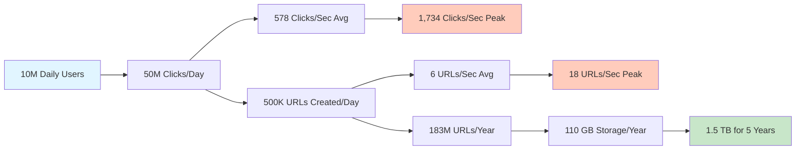

# Phase 1: Requirements and Estimations

> **For Beginners:** This document breaks down what we need to build and how much traffic/storage we'll need. We'll use simple math with explanations!

---

## 📋 1. Functional Requirements

**What our URL Shortener must do:**

### Core Features:
1. **Shorten URL** - Take a long URL and create a short code
   - Input: `https://www.example.com/very/long/path/to/article?id=12345&ref=twitter`
   - Output: `short.ly/a3B7k`

2. **Redirect** - When someone clicks the short link, redirect to original URL
   - User visits: `short.ly/a3B7k`
   - System redirects to: `https://www.example.com/very/long/path/to/article?id=12345&ref=twitter`

3. **Custom Aliases** (Optional but nice!)
   - User can choose: `short.ly/my-blog` instead of random `short.ly/a3B7k`

4. **Expiration** - URLs can have time limits
   - "Delete this link after 7 days"
   - "This link expires on Dec 31, 2025"

5. **Analytics** - Track clicks
   - How many times was this link clicked?
   - Where did clicks come from? (country, device)
   - When was it clicked? (date/time)

### User Roles:
- **Anonymous Users:** Can shorten URLs and access them
- **Registered Users:** Can manage their URLs, view analytics, set custom aliases

---

## 🎯 2. Non-Functional Requirements

**How well our system must perform:**

### 2.1 Scalability
- **Target Users:** 10 million daily active users (DAU)
- **Growth Rate:** 20% user growth per year
- **Total URLs:** Support up to 1 billion shortened URLs

### 2.2 Availability
- **Uptime:** 99.9% availability = 8.76 hours downtime per year
- **Why not 99.99%?** Cost! Each extra "9" costs significantly more
  - 99.9% → Good enough for most use cases
  - 99.99% → For critical systems (banking)

### 2.3 Performance
- **Redirect Latency:** < 100ms (super fast!)
  - **Beginner Tip:** 100ms = 0.1 seconds = blink of an eye
- **URL Creation:** < 500ms (half a second)
- **Read:Write Ratio:** 100:1 (much more reads than writes)
  - For every 100 people clicking links, only 1 person creates a new short link

### 2.4 Consistency
- **Eventual Consistency:** OK for analytics (click counts can be slightly delayed)
- **Strong Consistency:** Required for URL creation (no duplicate short codes!)

### 2.5 Reliability
- **Data Durability:** URLs must not be lost (backed up regularly)
- **URL Uniqueness:** No two different URLs should get the same short code

### 2.6 Security
- **Rate Limiting:** Prevent abuse (max 10 URL creations per minute per user)
- **Malicious URLs:** Detect and block spam/phishing links
- **HTTPS:** All traffic encrypted

---

## 📊 3. Capacity Estimation - Beginner-Friendly Math!

> **Math Anxiety? No worries!** We'll break every calculation into tiny steps with explanations.

### 3.1 Traffic Estimates

#### Given Information:
- **Daily Active Users (DAU):** 10 million users
- **Average user behavior:** Each user clicks 5 short links per day
- **Creation rate:** For every 100 clicks, 1 new URL is created

---

#### **Step 1: Calculate Total Clicks Per Day**

```
Math Tips for Beginners:
- "million" = add 6 zeros
- 10 million = 10,000,000
- To multiply: 10,000,000 × 5
```

**Calculation:**
```
Total clicks per day = DAU × clicks per user
                     = 10,000,000 × 5
                     = 50,000,000 clicks/day
```

**In simple words:** 50 million link clicks every day!

---

#### **Step 2: Calculate Clicks Per Second**

```
Math Tips:
- 1 day = 24 hours
- 1 hour = 60 minutes
- 1 minute = 60 seconds
- So: 1 day = 24 × 60 × 60 = 86,400 seconds
```

**Why 86,400?** Let's break it down:
```
24 hours × 60 minutes = 1,440 minutes in a day
1,440 minutes × 60 seconds = 86,400 seconds in a day
```

**Calculation:**
```
Average clicks/second = Total clicks per day ÷ seconds in a day
                      = 50,000,000 ÷ 86,400
                      = 578 clicks/second
```

**Tip:** Use a calculator! No one calculates this in their head.

---

#### **Step 3: Calculate Peak Traffic**

```
Math Tip:
- Peak traffic is usually 2-3x average
- We'll use 3x to be safe
```

**Calculation:**
```
Peak clicks/second = Average × 3
                   = 578 × 3
                   = 1,734 clicks/second
```

**In simple words:** During busy hours, ~1,700 people click short links every second!

---

#### **Step 4: Calculate URL Creation Rate**

```
Ratio given: 100 clicks : 1 creation
This means: For every 100 clicks, 1 new URL is created
```

**Calculation:**
```
URL creations per day = Total clicks ÷ 100
                      = 50,000,000 ÷ 100
                      = 500,000 creations/day
```

**Per second:**
```
Average creations/second = 500,000 ÷ 86,400
                        = 5.8 ≈ 6 creations/second
```

**Peak creations/second:**
```
Peak creations/second = 6 × 3
                      = 18 creations/second
```

---

#### **📊 Summary Table - Traffic Estimates**

| Metric | Average | Peak (3x) |
|--------|---------|-----------|
| **Clicks/day** | 50 million | 150 million |
| **Clicks/second** | 578 | 1,734 |
| **Creations/day** | 500,000 | 1.5 million |
| **Creations/second** | 6 | 18 |
| **Read:Write Ratio** | 100:1 | 100:1 |

---

### 3.2 Storage Estimates

#### Given Information per URL:
- **Short code:** 7 characters (e.g., "a3B7k2x")
- **Original URL:** 500 characters on average
- **Metadata:** Created date, expiration, user ID, etc.

---

#### **Step 1: Calculate Storage Per URL Record**

```
Let's break down what we store for each URL:
```

| Field | Size | Explanation |
|-------|------|-------------|
| Short code | 7 bytes | 7 characters × 1 byte each |
| Original URL | 500 bytes | Average URL length |
| User ID | 8 bytes | Number to identify user |
| Created timestamp | 8 bytes | Date/time created |
| Expiration timestamp | 8 bytes | When it expires |
| Click count | 4 bytes | Number of clicks |
| **Total per URL** | **535 bytes** | Add them all up |

**Rounding:** Let's round to **~600 bytes** per URL (includes database overhead)

---

#### **Step 2: Storage for 1 Year**

```
Math:
- Creations per day = 500,000
- Days in a year = 365
- Total URLs in 1 year = 500,000 × 365
```

**Calculation:**
```
URLs created in 1 year = 500,000 × 365
                       = 182,500,000
                       ≈ 183 million URLs
```

**Storage needed:**
```
Storage = Total URLs × Storage per URL
        = 183,000,000 × 600 bytes
        = 109,800,000,000 bytes
```

**Converting to GB (Gigabytes):**
```
Math Tip:
- 1 KB (kilobyte) = 1,000 bytes
- 1 MB (megabyte) = 1,000 KB = 1,000,000 bytes
- 1 GB (gigabyte) = 1,000 MB = 1,000,000,000 bytes
```

```
109,800,000,000 bytes ÷ 1,000,000,000 = 109.8 GB
                                      ≈ 110 GB
```

---

#### **Step 3: Storage for 5 Years**

```
Storage for 5 years = Storage for 1 year × 5
                    = 110 GB × 5
                    = 550 GB
```

**Beginner Tip:** We also need to account for:
- **Indexes:** Add 30% more = 550 × 1.3 = 715 GB
- **Backups:** 2x for redundancy = 715 × 2 = 1,430 GB ≈ **1.5 TB**

---

#### **Step 4: Cache Storage Estimate**

```
Question: How much should we cache?
Answer: Cache the most popular 20% of URLs (80/20 rule)
```

**Daily active URLs (clicked at least once):**
```
Estimate: 20% of total clicks are unique URLs
        = 50,000,000 × 0.20
        = 10,000,000 unique URLs per day
```

**Cache only the hottest 1% of these:**
```
URLs to cache = 10,000,000 × 0.01
              = 100,000 URLs
```

**Cache storage needed:**
```
Cache size = 100,000 × 600 bytes
           = 60,000,000 bytes
           = 60 MB (super small!)
```

**Beginner Insight:** Cache is tiny! Redis can easily handle this in memory.

---

### 📊 Storage Summary Table

| Storage Type | 1 Year | 5 Years |
|-------------|--------|---------|
| **Raw URL data** | 110 GB | 550 GB |
| **With indexes (30% overhead)** | 143 GB | 715 GB |
| **With backups (2x)** | 286 GB | 1.5 TB |
| **Cache (hot URLs)** | 60 MB | 60 MB |

---

### 3.3 Bandwidth Estimates

#### **Step 1: Bandwidth for Reads (Redirects)**

```
Average redirects/second = 578
Each redirect requires fetching original URL from DB/cache
```

**Data transfer per redirect:**
```
Request: Short code = 7 bytes (tiny)
Response: Original URL = 500 bytes
Total per redirect = ~507 bytes ≈ 0.5 KB
```

**Bandwidth calculation:**
```
Bandwidth (average) = 578 redirects/sec × 0.5 KB
                    = 289 KB/sec
                    ≈ 0.3 MB/sec
```

**Peak bandwidth:**
```
Peak = 0.3 MB/sec × 3
     = 0.9 MB/sec
     ≈ 1 MB/sec (super low!)
```

---

#### **Step 2: Bandwidth for Writes (URL Creation)**

```
Average creations/second = 6
Each creation sends original URL + metadata
```

**Data per creation:**
```
Request: Original URL + metadata = 600 bytes
Response: Short URL = 50 bytes
Total per creation = ~650 bytes ≈ 0.65 KB
```

**Bandwidth:**
```
Write bandwidth = 6 creations/sec × 0.65 KB
                = 3.9 KB/sec (tiny!)
```

---

### 📊 Bandwidth Summary

| Metric | Average | Peak |
|--------|---------|------|
| **Read bandwidth** | 0.3 MB/sec | 1 MB/sec |
| **Write bandwidth** | 4 KB/sec | 12 KB/sec |
| **Total bandwidth** | 0.3 MB/sec | 1 MB/sec |

**Beginner Insight:** Bandwidth is very low! This is a read-heavy, small-data system.

---

## 🔢 4. Short Code Length Calculation

**Question:** How long should our short code be?

### Base62 Encoding Explained (For Beginners)

**What is Base62?**
- Uses: a-z (26 letters) + A-Z (26 letters) + 0-9 (10 digits) = 62 characters
- Examples: `a`, `Z`, `3`, `aB7`, `xK2p`

**Why Base62?**
- URL-safe (no special characters like `@`, `#`, `/`)
- More compact than numbers only (base10)

---

### Math: How Many Combinations?

```
Math Tip: If you have N choices per position and L positions:
Total combinations = N^L (N to the power of L)
```

**For Base62 with different lengths:**

| Length | Combinations | Calculation | How Many URLs? |
|--------|-------------|-------------|----------------|
| 5 chars | 62^5 | 62 × 62 × 62 × 62 × 62 | 916 million |
| 6 chars | 62^6 | 62 × 62 × 62 × 62 × 62 × 62 | 56 billion |
| 7 chars | 62^7 | 62^6 × 62 | 3.5 trillion |

**Using a calculator for 62^7:**
```
62^7 = 3,521,614,606,208
     ≈ 3.5 trillion
```

---

### Decision: **Use 7 characters**

**Why 7?**
```
Required URLs for 5 years = 183 million/year × 5
                          = 915 million URLs

62^7 = 3.5 trillion possible codes

Safety margin = 3.5 trillion ÷ 915 million
              = 3,825 times more than needed!
```

**Benefits:**
- ✅ Enough for decades of growth
- ✅ Very low collision probability
- ✅ Still short (`short.ly/aB3xK9z`)

---

## 📝 5. Key Assumptions

**List all assumptions made:**

1. **Traffic Pattern:** Peak traffic is 3x average (conservative estimate)
2. **User Behavior:** 5 clicks per user per day (based on similar services like bit.ly)
3. **URL Length:** Average 500 characters (most URLs are 200-800 chars)
4. **Retention:** URLs stored forever (no automatic deletion after expiration)
5. **Read:Write Ratio:** 100:1 (URL shorteners are read-heavy)
6. **Cache Hit Rate:** 80% (most popular URLs stay hot)
7. **Geographic Distribution:** Global users (need CDN, but traffic concentrated in US/EU)
8. **Mobile vs Desktop:** 60% mobile, 40% desktop
9. **Malicious URLs:** < 1% (need moderation but not major concern)
10. **Custom Aliases:** 10% of users want custom aliases

---

## 🎯 6. Success Metrics

**How do we know our design is good?**

### Performance Metrics:
- ✅ Redirect latency < 100ms (95th percentile)
- ✅ URL creation latency < 500ms
- ✅ 99.9% uptime (< 9 hours downtime/year)

### Scalability Metrics:
- ✅ Handle 2,000 redirects/second (peak)
- ✅ Handle 20 URL creations/second (peak)
- ✅ Store 1 billion URLs

### Cost Metrics:
- ✅ Infrastructure cost < $5,000/month
- ✅ Cost per million requests < $10

---

## 🎓 Beginner Tips: Capacity Planning

### Tip 1: Always Round Up
```
❌ Don't: Calculate exactly 578.7 requests/sec
✅ Do: Round to 600 requests/sec (easier to work with)
```

### Tip 2: Use Online Calculators
```
- Google Calculator: Just type "62^7" in Google
- Calculator.net for large numbers
- WolframAlpha for complex math
```

### Tip 3: Remember Common Conversions
```
1 KB = 1,000 bytes (technically 1024, but we use 1000 for simplicity)
1 MB = 1,000 KB
1 GB = 1,000 MB
1 TB = 1,000 GB

1 day = 86,400 seconds (just memorize this!)
1 million = 1,000,000 (6 zeros)
1 billion = 1,000,000,000 (9 zeros)
```

### Tip 4: Use the 80/20 Rule
```
- 80% of clicks come from 20% of URLs (cache these!)
- 80% of traffic comes from 20% of users
- Plan for the 20% that matters most
```

### Tip 5: Plan for 3x Peak Traffic
```
If average = 100 requests/sec
Design for peak = 300 requests/sec
This handles traffic spikes safely
```

---

## 📊 Final Summary - Quick Reference



---

## ✅ Checklist: Did We Cover Everything?

- ✅ Functional requirements (shorten, redirect, analytics)
- ✅ Non-functional requirements (99.9% uptime, < 100ms latency)
- ✅ Traffic estimates (578 avg, 1,734 peak redirects/sec)
- ✅ Storage estimates (110 GB/year, 1.5 TB for 5 years)
- ✅ Bandwidth estimates (1 MB/sec peak - very low!)
- ✅ Short code length (7 chars = 3.5 trillion combinations)
- ✅ All assumptions documented
- ✅ Beginner-friendly math with tips!

---

**Next:** [Step 1 - Basic Architecture →](02_step1_basic_architecture.md)
