# Phase 2: Step 1 - Basic Architecture

> **For Beginners:** Every complex system starts simple! We'll build the foundation first, then add fancy features later.

---

## 🎯 What We're Building in Step 1

**The Simplest Possible URL Shortener:**
1. User sends a long URL
2. Server generates a short code
3. Server saves it in a database
4. Later, when someone visits the short link, server looks it up and redirects

**That's it!** No caching, no analytics, no fancy stuff yet.

---

## 🏗️ Components in Step 1

### 1. **Client (User's Device)**
- **What:** Web browser or mobile app
- **Does:** Sends requests to our service
- **Examples:** Chrome browser, iPhone Safari, Android app

### 2. **Load Balancer**
- **What:** Traffic cop for incoming requests
- **Why:**
  - Distributes load across multiple servers
  - If one server dies, routes traffic to healthy ones
  - Single entry point for all requests
- **Real-World:** Like a restaurant host assigning customers to different tables
- **Technology:** Nginx, HAProxy, AWS Application Load Balancer

### 3. **Application Servers** (Multiple)
- **What:** Runs our business logic (code)
- **Does:**
  - Generate short codes
  - Store URL mappings
  - Handle redirects
- **Why Multiple?**
  - If one crashes, others keep working (High Availability!)
  - Distribute load (Scalability!)
- **Technology:** Node.js, Java Spring Boot, Python Flask

### 4. **Database**
- **What:** Stores the URL mappings
- **Schema:**
  ```
  short_code → original_url
  "aB7x3K"   → "https://example.com/very/long/url"
  ```
- **Technology:** PostgreSQL, MySQL (we'll discuss why SQL vs NoSQL later)

---

## 📐 Step 1 Architecture Diagram

```mermaid
graph TB
    subgraph "User Layer"
        U1[👤 User 1<br/>Web Browser]
        U2[👤 User 2<br/>Mobile App]
        U3[👤 User 3<br/>Desktop]
    end

    subgraph "Load Balancing Layer"
        LB[🔀 Load Balancer<br/>Nginx<br/><br/>- Distributes traffic<br/>- SSL termination<br/>- Health checks]
    end

    subgraph "Application Layer<br/>(Stateless Servers)"
        App1[🖥️ App Server 1<br/>Node.js<br/><br/>Port: 8080]
        App2[🖥️ App Server 2<br/>Node.js<br/><br/>Port: 8080]
        App3[🖥️ App Server 3<br/>Node.js<br/><br/>Port: 8080]
    end

    subgraph "Data Layer"
        DB[(🗄️ PostgreSQL Database<br/><br/>Tables:<br/>- urls<br/>- analytics_basic)]
    end

    U1 --> LB
    U2 --> LB
    U3 --> LB

    LB -->|Round Robin| App1
    LB -->|Round Robin| App2
    LB -->|Round Robin| App3

    App1 -->|SQL Queries| DB
    App2 -->|SQL Queries| DB
    App3 -->|SQL Queries| DB

    style U1 fill:#e1f5ff,stroke:#01579b,stroke-width:2px
    style U2 fill:#e1f5ff,stroke:#01579b,stroke-width:2px
    style U3 fill:#e1f5ff,stroke:#01579b,stroke-width:2px
    style LB fill:#fff3e0,stroke:#e65100,stroke-width:3px
    style App1 fill:#f3e5f5,stroke:#4a148c,stroke-width:2px
    style App2 fill:#f3e5f5,stroke:#4a148c,stroke-width:2px
    style App3 fill:#f3e5f5,stroke:#4a148c,stroke-width:2px
    style DB fill:#c8e6c9,stroke:#1b5e20,stroke-width:3px
```



---

## 🔄 How It Works - Step by Step

### Scenario 1: Creating a Short URL


**Beginner Breakdown:**
1. **User** types long URL in our website
2. **Load Balancer** picks one of our 3 app servers (round-robin = takes turns)
3. **App Server** generates a random 7-character code like "aB7x3K"
4. **Database** saves the mapping: `aB7x3K → https://example.com/long-url`
5. **User** gets back the short link: `short.ly/aB7x3K`

**Time taken:** ~200-300ms (mostly database write)

---

### Scenario 2: Redirecting (Clicking a Short URL)


**Beginner Breakdown:**
1. **User** clicks `short.ly/aB7x3K`
2. **Load Balancer** forwards to an app server
3. **App Server** looks up `aB7x3K` in the database
4. **Database** returns the original URL
5. **App Server** tells browser to redirect to original URL
6. **Browser** automatically goes to the long URL

**Time taken:** ~50-100ms (database read is fast!)

---

## 🔑 Key Design Decisions

### Decision 1: Why Load Balancer?

**❌ Without Load Balancer:**
```
Problem: If we have 1 server and it crashes → Entire service DOWN!
Problem: 1 server can handle only ~1,000 req/sec → Not enough!
```

**✅ With Load Balancer:**
```
✅ Handles 10,000+ req/sec (distribute across 10 servers)
✅ If Server 2 crashes → LB routes traffic to Server 1 and 3
✅ Easy to add more servers (just tell LB about new server)
```

**Real-World Analogy:**
```
❌ One cashier at McDonald's → Long line, if cashier sick = store closes
✅ 5 cashiers + a manager directing customers → Fast, reliable
```

---

### Decision 2: Why Multiple App Servers?

**Stateless Servers Concept (Important!):**
```
Stateless = Server doesn't remember previous requests
All data is in Database, not in server memory

Benefits:
✅ Any server can handle any request
✅ Easy to add/remove servers
✅ If server crashes, no data lost
```

**Example:**
```
Request 1: User creates short URL → Handled by Server 1
Request 2: User clicks that URL → Handled by Server 2 (different server!)

This works because Server 2 can look up the URL in the shared database!
```

---

### Decision 3: Why SQL Database (PostgreSQL)?

**SQL vs NoSQL Decision:**

| Factor | SQL (PostgreSQL) | NoSQL (MongoDB) |
|--------|------------------|-----------------|
| **Data Structure** | Fixed schema (short_code, original_url) | ✅ Fixed structure, SQL is perfect |
| **ACID Guarantees** | ✅ Strong consistency needed | ❌ Eventual consistency = duplicate codes! |
| **Relationships** | ✅ Joins for analytics (later) | ❌ No joins |
| **Scalability** | Vertical + Replication | Horizontal (but we don't need it yet) |
| **Query Flexibility** | ✅ Complex analytics queries | ❌ Limited queries |

**Decision: Use PostgreSQL**

**Why?**
1. **Uniqueness Critical:** Cannot have duplicate short codes!
   - SQL's UNIQUE constraint guarantees this
   - NoSQL has eventual consistency (risk of duplicates)

2. **Simple Schema:** Just one main table (urls), SQL is perfect

3. **Analytics:** Later we'll need complex queries (clicks by country, time, etc.)

4. **ACID Transactions:** When creating URL, must be atomic (all-or-nothing)

**Beginner Tip:** For URL shorteners, SQL is the right choice. NoSQL is better for social media feeds, chat apps (where eventual consistency is OK).

---

### Decision 4: What Database Table Structure?

**Simple Schema for Step 1:**

```sql
CREATE TABLE urls (
    id BIGSERIAL PRIMARY KEY,              -- Auto-incrementing ID
    short_code VARCHAR(7) UNIQUE NOT NULL, -- "aB7x3K" (must be unique!)
    original_url TEXT NOT NULL,            -- Long URL (up to 2,048 chars)
    created_at TIMESTAMP DEFAULT NOW(),    -- When was it created
    expires_at TIMESTAMP,                  -- Optional expiration
    click_count BIGINT DEFAULT 0,          -- How many clicks
    user_id BIGINT,                        -- Who created it (optional)
    is_active BOOLEAN DEFAULT TRUE         -- Can be disabled
);

-- Index for super-fast lookups by short_code
CREATE UNIQUE INDEX idx_short_code ON urls(short_code);

-- Index for user's URLs (if logged in)
CREATE INDEX idx_user_id ON urls(user_id);

-- Index for cleanup job (find expired URLs)
CREATE INDEX idx_expires_at ON urls(expires_at) WHERE expires_at IS NOT NULL;
```

**Beginner Explanation:**

**Why UNIQUE on short_code?**
```
Prevents duplicates!
If we try to insert "aB7x3K" twice → Database will reject it
```

**Why INDEX on short_code?**
```
Without index: Database scans all 1 billion rows to find "aB7x3K" → Slow! 💀
With index: Database uses a tree structure → Finds it in milliseconds ⚡

Think: Index in a book vs reading every page
```

**Why BIGINT for click_count?**
```
INT max = 2 billion clicks
BIGINT max = 9 quintillion clicks (9,223,372,036,854,775,807)

Viral link might get billions of clicks → BIGINT is safer!
```

---

## 📊 Capacity Check - Can Step 1 Handle Our Traffic?

From Phase 1, we need to handle:
- **1,734 redirects/second** (peak)
- **18 URL creations/second** (peak)

### Load Balancer Capacity:
```
Nginx can handle: 50,000+ requests/sec
Our need: 1,734 req/sec
✅ Plenty of headroom! (28x more than needed)
```

### Application Server Capacity:
```
One Node.js server: ~1,000 req/sec
We have: 3 servers = 3,000 req/sec
Our need: 1,734 req/sec
✅ Good! (1.7x capacity, room to grow)
```

### Database Capacity:
```
PostgreSQL on good hardware: 5,000-10,000 reads/sec, 1,000 writes/sec
Our need: 1,734 reads/sec, 18 writes/sec
✅ Excellent! Database is not the bottleneck
```

**Conclusion:** ✅ Step 1 architecture can handle our projected load!

---

## ⚠️ Limitations of Step 1 (What We'll Fix Later)

### Problem 1: Database is a Single Point of Failure
```
❌ If database crashes → Entire service DOWN!
❌ No backup if data is lost
🔧 Fix in Step 3: Add database replication (master-slave)
```

### Problem 2: No Caching (Slow for Popular URLs)
```
❌ Every redirect hits database (even for viral links clicked 1M times)
❌ Database becomes bottleneck at high scale
🔧 Fix in Step 2: Add Redis cache for hot URLs
```

### Problem 3: No Geographic Distribution
```
❌ User in Australia connects to US server → High latency (200ms+)
🔧 Fix later: Multi-region deployment, CDN
```

### Problem 4: Limited Analytics
```
❌ Only basic click count, no country/device info
🔧 Fix in Step 5: Add message queue for detailed analytics
```

### Problem 5: No Rate Limiting
```
❌ Malicious user can spam URL creation
🔧 Fix in Step 5: Add rate limiting service
```

---

## 🎓 Beginner Concepts Explained

### Concept 1: What is Round Robin?

**Round Robin Load Balancing:**
```
Request 1 → Server 1
Request 2 → Server 2
Request 3 → Server 3
Request 4 → Server 1 (back to first)
Request 5 → Server 2
...and so on
```

**Like:** Taking turns in a game. Everyone gets a fair share!

**Other strategies:**
- **Least Connections:** Send to server with fewest active connections
- **IP Hash:** Same user always goes to same server
- **Weighted:** Server 1 gets 50% traffic, Server 2 gets 30%, Server 3 gets 20%

---

### Concept 2: What is Stateless?

**Stateless Server:**
```
❌ Server does NOT store user sessions in memory
✅ All data is in Database or Client (JWT tokens)

Benefits:
- Any server can handle any request
- Easy to scale horizontally (add more servers)
- Server crashes don't lose data
```

**Example:**
```
❌ Stateful (Bad):
Server 1 remembers "User ABC is logged in"
If User ABC's next request goes to Server 2 → Server 2 doesn't know them!

✅ Stateless (Good):
User ABC sends JWT token with every request
Any server can validate the token and know who they are
```

---

### Concept 3: What is an Index?

**Database Index = Book Index**

**Without Index:**
```
Find "aB7x3K" in 1 billion URLs
→ Read row 1, row 2, row 3... (could take seconds!)
```

**With Index:**
```
Database maintains a sorted tree structure (B-Tree)
→ Binary search finds "aB7x3K" in ~30 lookups (milliseconds!)
```

**Math for Beginners:**
```
1 billion rows without index: 1,000,000,000 comparisons
1 billion rows with index: log₂(1,000,000,000) ≈ 30 comparisons

Time saved: 99.9997% faster! 🚀
```

**Trade-off:**
```
✅ Reads are super fast
❌ Writes are slightly slower (must update index)
❌ Extra storage (index can be 20-30% of table size)

For our use case: 100:1 read:write ratio → Worth it!
```

---

### Concept 4: 301 vs 302 Redirect

**301 Permanent Redirect:**
```
Meaning: "This short URL will ALWAYS redirect to the same long URL"
Browser behavior: Caches the redirect (doesn't ask server next time)
Good for: Permanent URL shorteners
```

**302 Temporary Redirect:**
```
Meaning: "This redirect might change later"
Browser behavior: Always asks server (can track every click)
Good for: A/B testing, click tracking
```

**For URL Shortener:**
```
Use 302 if you want to track every click
Use 301 if performance > analytics
```

**Our choice: 302** (because we want click analytics!)

---

## 🔍 Trade-Offs Summary

| Aspect | Choice | Trade-Off |
|--------|--------|-----------|
| **Load Balancer** | Nginx | ✅ Open-source, fast<br/>❌ Need to manage ourselves (vs AWS ALB) |
| **App Server** | Node.js | ✅ Fast for I/O, async<br/>❌ Single-threaded (but we have 3 servers) |
| **Database** | PostgreSQL | ✅ ACID, reliable<br/>❌ Harder to scale horizontally (vs NoSQL) |
| **3 App Servers** | Good balance | ✅ High availability<br/>❌ More infrastructure cost |
| **Single DB** | Simple | ✅ Easy to manage<br/>❌ Single point of failure (fix in Step 3) |

---

## ✅ What We Accomplished in Step 1

✅ **Basic working system** - Can shorten URLs and redirect
✅ **High Availability** - 3 app servers (if one dies, others work)
✅ **Load Distribution** - Load balancer spreads traffic evenly
✅ **Stateless Design** - Easy to scale horizontally
✅ **Fast Lookups** - Database indexes for millisecond queries
✅ **Can handle traffic** - 3,000 req/sec capacity (need 1,734)

**Beginner Achievement:** 🎉 You now understand the foundation of every web service!

---

## 📈 What's Next?

**Step 2: Add Caching Layer**
- Problem: Database hit on every redirect (slow, not scalable)
- Solution: Redis cache for popular URLs (80% cache hit rate)
- Benefit: 10x faster redirects (10ms vs 100ms)

---

**Previous:** [← Requirements & Estimations](01_requirements_and_estimations.md)
**Next:** [Step 2 - Add Caching →](03_step2_add_caching.md)
