# Phase 3: Step 2 - Add Caching Layer

> **For Beginners:** Caching = Keeping frequently used data in super-fast memory, like keeping your favorite book on your desk instead of walking to the library every time!

---

## 🎯 The Problem We're Solving

### Problem from Step 1:
```
Every redirect hits the database
↓
For a viral link clicked 1 million times:
- 1 million database queries for the SAME URL!
- Database becomes bottleneck
- Slow response times (100ms+)
```

### Real-World Example:
```
Imagine a celebrity tweets: "Check out my new song! short.ly/aB7x3K"
↓
10 million fans click in 1 hour
↓
Without cache: 10M database queries (database melts 🔥)
With cache: 1 database query + 9,999,999 cache hits (smooth! ⚡)
```

---

## 🚀 The Solution: Redis Cache

### What Changed from Step 1:
1. ✅ Added **Redis** (in-memory cache) between App Servers and Database
2. ✅ **Cache Hit:** Return URL from Redis (10ms) - Super fast!
3. ✅ **Cache Miss:** Query database → Store in Redis → Return (100ms first time)
4. ✅ **80% of requests** now served from cache (never touch database!)

### Benefits:
- 🚀 **10x faster** response time (10ms vs 100ms)
- 💪 **90% less** database load
- 💰 **Cost savings** (need fewer database servers)
- 📈 **Better scalability** (cache handles millions of req/sec)

---

## 📐 Step 2 Architecture Diagram

```mermaid
graph TB
    subgraph "User Layer"
        U1[👤 User 1]
        U2[👤 User 2]
        U3[👤 User 3]
    end

    subgraph "Load Balancing Layer"
        LB[🔀 Load Balancer<br/>Nginx<br/><br/>SSL Termination<br/>Rate Limiting]
    end

    subgraph "Application Layer"
        App1[🖥️ App Server 1]
        App2[🖥️ App Server 2]
        App3[🖥️ App Server 3]
    end

    subgraph "⚡ CACHING LAYER - NEW!"
        Redis[🔴 Redis Cache Cluster<br/><br/>💾 In-Memory Store<br/>⏱️ TTL: 24 hours<br/>📊 Cache Size: 10 GB<br/><br/>Stores:<br/>- Hot URLs mappings<br/>- Click counts<br/>- User sessions]
    end

    subgraph "Data Layer"
        DB[(🗄️ PostgreSQL<br/><br/>Source of Truth)]
    end

    U1 & U2 & U3 --> LB
    LB --> App1 & App2 & App3

    App1 & App2 & App3 -.->|"1️⃣ Check cache first"| Redis
    Redis -.->|"✅ Cache Hit (80%)<br/>Return in 10ms"| App1 & App2 & App3
    Redis -.->|"❌ Cache Miss (20%)<br/>Query DB"| App1 & App2 & App3

    App1 & App2 & App3 -->|"2️⃣ If cache miss"| DB
    DB -->|"3️⃣ Return data"| App1 & App2 & App3
    App1 & App2 & App3 -.->|"4️⃣ Store in cache"| Redis

    style U1 fill:#e1f5ff
    style U2 fill:#e1f5ff
    style U3 fill:#e1f5ff
    style LB fill:#fff3e0,stroke:#e65100,stroke-width:3px
    style App1 fill:#f3e5f5
    style App2 fill:#f3e5f5
    style App3 fill:#f3e5f5
    style Redis fill:#ffcdd2,stroke:#c62828,stroke-width:4px
    style DB fill:#c8e6c9,stroke:#1b5e20,stroke-width:3px
```



---

## 🔄 How Caching Works - Step by Step

### Scenario: User Clicks Short URL

```mermaid
sequenceDiagram
    actor User
    participant App as App Server
    participant Cache as Redis Cache
    participant DB as PostgreSQL

    Note over User,DB: Scenario 1: Cache Hit (80% of requests)

    User->>App: GET /aB7x3K

    App->>Cache: GET short:aB7x3K
    Note over Cache: Key exists in cache!

    Cache-->>App: "https://example.com/long-url"
    Note over App,Cache: ⚡ 5-10ms response time

    App-->>User: 302 Redirect to long URL
    Note over User: Total time: 15ms ⚡

    Note over User,DB: ━━━━━━━━━━━━━━━━━━━━━━━━━━━━━━━━━━━

    Note over User,DB: Scenario 2: Cache Miss (20% of requests)

    User->>App: GET /xY9zK2

    App->>Cache: GET short:xY9zK2
    Note over Cache: Key NOT in cache

    Cache-->>App: NULL (cache miss)

    App->>DB: SELECT original_url<br/>FROM urls<br/>WHERE short_code='xY9zK2'
    Note over App,DB: 50-100ms query time

    DB-->>App: "https://example.com/other-url"

    App->>Cache: SET short:xY9zK2<br/>"https://example.com/other-url"<br/>TTL: 24 hours
    Note over App,Cache: Store for next time

    Cache-->>App: OK

    App-->>User: 302 Redirect to long URL
    Note over User: Total time: 120ms<br/>(first time only!)
```



**Beginner Breakdown:**

**Cache Hit Path (Fast!):**
1. App checks Redis first
2. Redis has the URL → Returns immediately (10ms)
3. User redirected ⚡

**Cache Miss Path (Slower first time):**
1. App checks Redis → Not found
2. App queries Database (100ms)
3. App stores result in Redis for next time
4. User redirected
5. Next 1 million users get cache hit! 🎉

---

## 🧠 Caching Strategy - Deep Dive

### 1. Cache-Aside Pattern (Lazy Loading)

**How it works:**
```
On READ:
1. Check cache first
2. If found (hit) → Return from cache
3. If not found (miss) → Query database → Store in cache → Return

On WRITE:
1. Write to database
2. Invalidate/update cache
```

**Why Cache-Aside?**
- ✅ Simple to implement
- ✅ Cache only popular data (saves memory)
- ✅ App has full control
- ❌ Cache miss penalty (first request is slow)

**Other Patterns:**
```
Write-Through: Write to cache and DB simultaneously
  ✅ Cache always fresh
  ❌ Write latency doubled

Write-Behind: Write to cache → Async write to DB
  ✅ Super fast writes
  ❌ Risk of data loss if cache crashes
```

**Our choice:** Cache-Aside (best for read-heavy workloads)

---

### 2. What to Cache?

**✅ Cache These:**
```
1. URL mappings (short_code → original_url)
   - Cache key: "short:aB7x3K"
   - Cache value: "https://example.com/long-url"
   - TTL: 24 hours

2. Popular URLs (viral links)
   - Detect: If click_count > 1000
   - TTL: Longer (7 days)

3. User sessions (JWT tokens)
   - Cache key: "session:user_12345"
   - TTL: 1 hour
```

**❌ Don't Cache These:**
```
1. Analytics data (changes every click)
2. One-time URLs (clicked once, no point caching)
3. Expired URLs (waste of memory)
```

---

### 3. TTL (Time To Live) Strategy

**What is TTL?**
```
TTL = How long data stays in cache before auto-deletion
Example: TTL: 3600 seconds = Cache for 1 hour
```

**Our TTL Strategy:**

| Data Type | TTL | Reason |
|-----------|-----|--------|
| **Regular URLs** | 24 hours | Most URLs accessed within a day |
| **Viral URLs** | 7 days | Popular links stay hot longer |
| **Expired URLs** | 5 minutes | Only cache briefly (might be deleted) |
| **User sessions** | 1 hour | Security (force re-login periodically) |
| **Analytics counters** | 10 seconds | Real-time counts (frequent updates) |

**Beginner Tip:** Shorter TTL = Fresher data but more cache misses

---

### 4. Cache Eviction Policies

**What is Eviction?**
```
Cache is full (out of memory)
Need to delete something to make space
Which key to delete?
```

**Eviction Policies:**

| Policy | How It Works | Best For |
|--------|--------------|----------|
| **LRU** (Least Recently Used) | Delete oldest accessed key | ✅ URL shortener (old URLs = less popular) |
| **LFU** (Least Frequently Used) | Delete least accessed key | ✅ Also good for us |
| **FIFO** (First In First Out) | Delete oldest added key | ❌ Not smart (old != unpopular) |
| **Random** | Delete random key | ❌ Unpredictable |

**Our choice: LRU** (Redis default)

**Example:**
```
Cache size: 10 GB (full!)
New URL needs caching
LRU finds: "short:xyz123" last accessed 30 days ago
→ Delete "short:xyz123" to make room
```

---

## 📊 Cache Size Calculation

**Question:** How much memory does Redis need?

### Step 1: Estimate Hot URLs

From Phase 1:
```
Daily clicks: 50 million
Unique URLs clicked per day: 10 million (estimate)

Pareto Principle (80/20 rule):
- 20% of URLs = 80% of traffic
- Hot URLs to cache: 10M × 20% = 2 million URLs
```

### Step 2: Calculate Memory per URL

```
Data stored in cache per URL:
- Cache key: "short:aB7x3K" = 13 bytes
- Cache value: "https://..." = 500 bytes (average URL)
- Redis overhead: ~100 bytes (pointers, metadata)
━━━━━━━━━━━━━━━━━━━━━━━━━━━━━━━━━━━━━━━━━
Total per URL: ~600 bytes
```

### Step 3: Total Cache Size

```
Math:
Total URLs in cache: 2 million
Memory per URL: 600 bytes

Total = 2,000,000 × 600 bytes
      = 1,200,000,000 bytes
      = 1.2 GB
```

**Add 50% buffer for growth:**
```
Cache size = 1.2 GB × 1.5
           = 1.8 GB
           ≈ 2 GB (round up)
```

**Beginner Insight:** 2 GB is TINY! Modern servers have 64-128 GB RAM. We're only using 2 GB!

---

### Step 4: Cache Hit Ratio Calculation

**What is Cache Hit Ratio?**
```
Cache Hit Ratio = (Cache Hits / Total Requests) × 100%

Example:
100 requests total
80 found in cache (hits)
20 not found (misses)
Hit ratio = 80/100 = 80%
```

**Our Expected Hit Ratio:**
```
Given:
- 80% of clicks are for top 20% URLs
- We cache all popular URLs

Expected hit ratio: 75-85%
Conservative estimate: 80%
```

**Impact:**
```
Total requests: 1,734 req/sec (peak)

With 80% hit ratio:
- Cache serves: 1,734 × 0.80 = 1,387 req/sec (Redis)
- DB serves: 1,734 × 0.20 = 347 req/sec (PostgreSQL)

Database load reduced by 80%! 🎉
```

---

## ⚡ Performance Comparison

### Before Caching (Step 1):

```
Every redirect:
1. App → Database query → 50-100ms
2. Database handles: 1,734 queries/sec (peak)
3. Database CPU: 80% (stressed!)
```

### After Caching (Step 2):

```
80% of redirects:
1. App → Redis → 5-10ms (10x faster!)
2. Redis handles: 1,387 queries/sec
3. Redis CPU: 10% (easy!)

20% of redirects:
1. App → Database → 50-100ms
2. Database handles: 347 queries/sec
3. Database CPU: 20% (relaxed!)
```

**Latency Improvement:**
```
Before: Average 100ms
After: (80% × 10ms) + (20% × 100ms) = 8ms + 20ms = 28ms

28ms vs 100ms = 3.5x faster! 🚀
```

---

## 🔧 Cache Invalidation Strategy

**Phil Karlton's famous quote:**
> "There are only two hard things in Computer Science: cache invalidation and naming things."

**The Challenge:**
```
Cache has: short:aB7x3K → "https://example.com/old-url"
User updates URL to: "https://example.com/new-url"
Problem: Cache is now STALE (wrong data!)
```

### Strategy 1: Time-Based Expiration (TTL)
```
Pros:
✅ Simple (Redis auto-deletes after TTL)
✅ No code needed

Cons:
❌ Data stale until TTL expires (max 24 hours old)
❌ Not real-time

Use when: Staleness is acceptable
```

### Strategy 2: Explicit Invalidation (Delete on Update)
```
Pros:
✅ Always fresh data
✅ Real-time updates

Cons:
❌ More complex code
❌ Must invalidate on every update/delete

Code example:
When user updates URL:
1. UPDATE urls in database
2. DELETE "short:aB7x3K" from Redis
3. Next request will cache miss → Fetch fresh data
```

### Strategy 3: Write-Through (Update Cache on Write)
```
Pros:
✅ Cache always in sync with DB
✅ No cache miss after update

Cons:
❌ Complex to implement
❌ Write latency increases

Code example:
When user updates URL:
1. UPDATE urls in database
2. SET "short:aB7x3K" in Redis with new value
```

**Our Choice:** Strategy 2 (Delete on Update)
```
For URL shortener:
- URLs rarely updated (mostly read-only)
- When updated, must be immediately correct
- Simple to implement
```

---

## 🛠️ Redis Configuration

### Redis Cluster Setup

**Why Cluster?**
```
Single Redis server:
❌ If it crashes → All cache lost
❌ Limited to one server's memory
❌ Single point of failure

Redis Cluster:
✅ Data distributed across 3+ nodes
✅ If one node fails → Others continue
✅ More memory available
```

**Our Setup:**
```
3 Redis nodes in cluster
Each node: 4 GB memory
Total capacity: 12 GB
Replication: 1 master + 2 replicas per shard
```

---

### Redis Data Structures

**1. String (for URL mappings):**
```redis
SET short:aB7x3K "https://example.com/long-url" EX 86400
GET short:aB7x3K
# EX 86400 = TTL of 86,400 seconds (24 hours)
```

**2. Hash (for URL metadata):**
```redis
HSET url:aB7x3K original_url "https://example.com/long-url"
HSET url:aB7x3K created_at "2025-01-15T10:30:00Z"
HSET url:aB7x3K click_count 1523
HGETALL url:aB7x3K
```

**3. Counter (for analytics):**
```redis
INCR clicks:aB7x3K:2025-01-15
# Atomic increment (thread-safe!)
```

---

## 🎓 Beginner Concepts Explained

### Concept 1: What is In-Memory Cache?

**Disk vs Memory:**
```
💾 Hard Disk (Database):
- Read speed: 100 MB/sec (HDD) or 500 MB/sec (SSD)
- Latency: 5-10ms (SSD) or 50-100ms (HDD)
- Capacity: Terabytes (cheap!)
- Persistent: Data survives restart

⚡ RAM (Redis Cache):
- Read speed: 10 GB/sec (100x faster!)
- Latency: 0.1ms (100x faster!)
- Capacity: Gigabytes (expensive!)
- Volatile: Data lost on restart (unless persistence enabled)
```

**Analogy:**
```
Database = Library (huge but far away)
Cache = Your desk (small but instant access)
```

---

### Concept 2: Cache Hit vs Cache Miss

**Visual Example:**
```
Request 1: GET /aB7x3K
  → Check cache: Found! ✅ (Cache Hit)
  → Return in 10ms

Request 2: GET /xY9zK2
  → Check cache: Not found ❌ (Cache Miss)
  → Query database (100ms)
  → Store in cache
  → Return in 120ms

Request 3: GET /xY9zK2 (same URL again!)
  → Check cache: Found! ✅ (Cache Hit - now cached!)
  → Return in 10ms
```

**Hit Ratio Math:**
```
5 requests total:
- 4 cache hits
- 1 cache miss

Hit ratio = 4/5 = 0.80 = 80%
Miss ratio = 1/5 = 0.20 = 20%

(Hit ratio + Miss ratio always = 100%)
```

---

### Concept 3: Cache Stampede Problem

**The Problem:**
```
Popular URL's cache expires at 12:00:00
At 12:00:01, 10,000 users request it simultaneously

Without protection:
→ 10,000 cache misses!
→ 10,000 database queries at once!
→ Database overloaded! 💀
```

**Solution: Cache Locking**
```
1. First request sees cache miss
2. Sets a lock: "fetching:aB7x3K"
3. Queries database
4. Updates cache
5. Releases lock

Requests 2-10,000:
→ See lock → Wait → Get fresh cache value
→ Only 1 database query! ✅
```

**Code Concept:**
```javascript
async function getURL(shortCode) {
  // Try cache first
  let url = await redis.get(`short:${shortCode}`);
  if (url) return url; // Cache hit!

  // Check if someone is already fetching
  const lock = await redis.set(`lock:${shortCode}`, '1', 'NX', 'EX', 10);
  if (!lock) {
    // Someone else is fetching, wait and retry
    await sleep(100);
    return getURL(shortCode); // Recursive retry
  }

  // We got the lock, fetch from DB
  url = await database.query(`SELECT original_url WHERE short_code='${shortCode}'`);

  // Store in cache
  await redis.set(`short:${shortCode}`, url, 'EX', 86400);

  // Release lock
  await redis.del(`lock:${shortCode}`);

  return url;
}
```

---

## 📊 Monitoring Cache Performance

**Key Metrics to Track:**

| Metric | Good Value | Bad Value | Action |
|--------|------------|-----------|--------|
| **Hit Ratio** | > 80% | < 60% | Increase cache size or TTL |
| **Evictions/sec** | < 10 | > 100 | Cache too small, add memory |
| **Memory Usage** | 60-80% | > 95% | Add more nodes |
| **Latency (p99)** | < 10ms | > 50ms | Check network or CPU |
| **Commands/sec** | Matches traffic | 10x traffic | Something wrong! |

---

## ⚠️ Trade-Offs of Adding Cache

| Aspect | Pros ✅ | Cons ❌ |
|--------|---------|---------|
| **Performance** | 10x faster reads | Write complexity increases |
| **Scalability** | Reduce DB load 80% | Need to manage Redis cluster |
| **Availability** | More resilient | Another component to fail |
| **Consistency** | - | Cache can be stale (eventual consistency) |
| **Cost** | Reduce DB server needs | Redis servers cost money |
| **Complexity** | - | Invalidation logic, monitoring |

**Is it worth it?** ✅ YES!
```
For read-heavy systems (100:1 ratio):
Benefits >> Costs
```

---

## ✅ What We Accomplished in Step 2

✅ **10x faster redirects** (10ms vs 100ms average)
✅ **80% less database load** (only 20% requests hit DB)
✅ **Better scalability** (Redis handles millions of req/sec)
✅ **Cost savings** (need smaller database servers)
✅ **Cache-aside pattern** implemented
✅ **Proper TTL strategy** (24 hours for normal URLs)
✅ **LRU eviction** for memory management

---

## 🎯 Limitations of Step 2 (What's Next?)

### Still Need to Fix:
1. **Database Single Point of Failure**
   - If PostgreSQL crashes → Service partially down (cache helps but not enough)
   - Fix in Step 3: Database replication

2. **No Sharding Yet**
   - Single DB can't scale infinitely
   - Fix in Step 3: Horizontal partitioning

3. **No Analytics Processing**
   - Just basic counters
   - Fix in Step 4: Message queue for detailed analytics

---

**Previous:** [← Step 1 - Basic Architecture](02_step1_basic_architecture.md)
**Next:** [Step 3 - Database Scaling →](04_step3_database_scaling.md)
