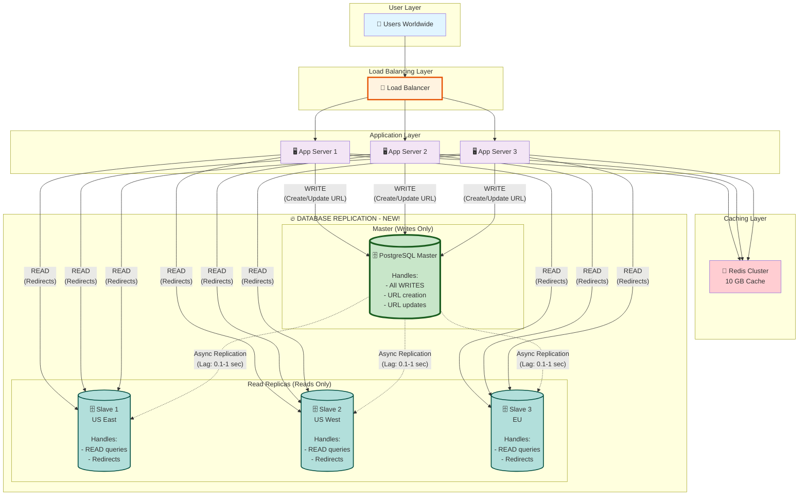
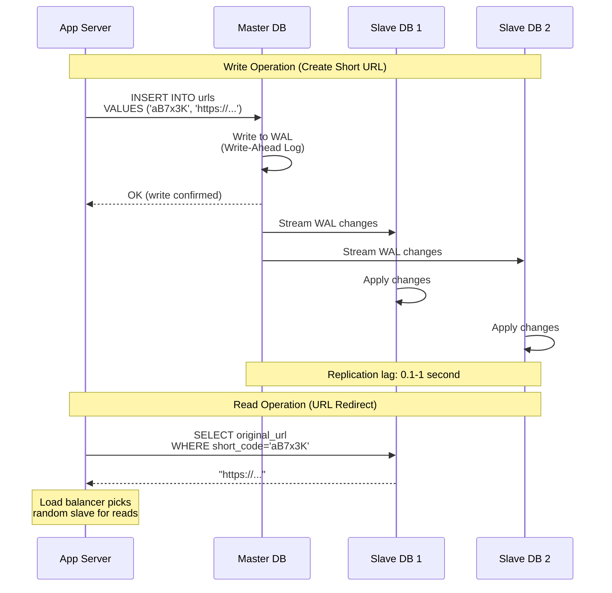
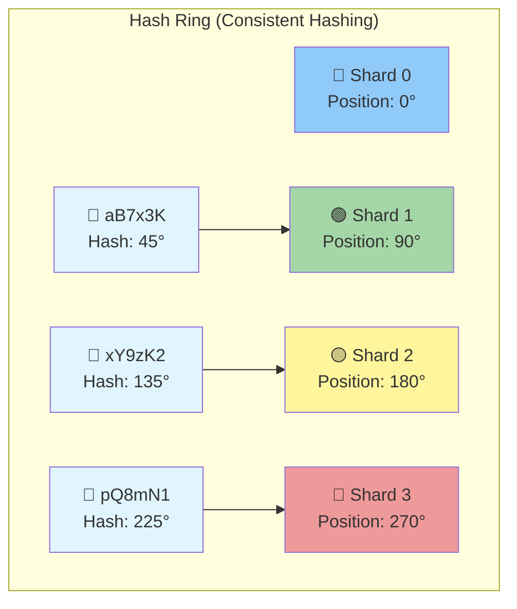
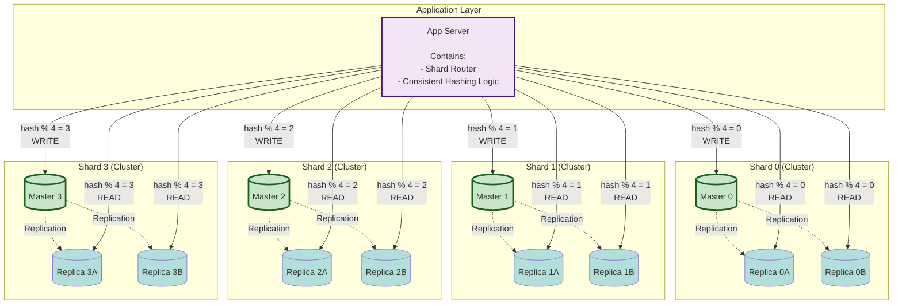
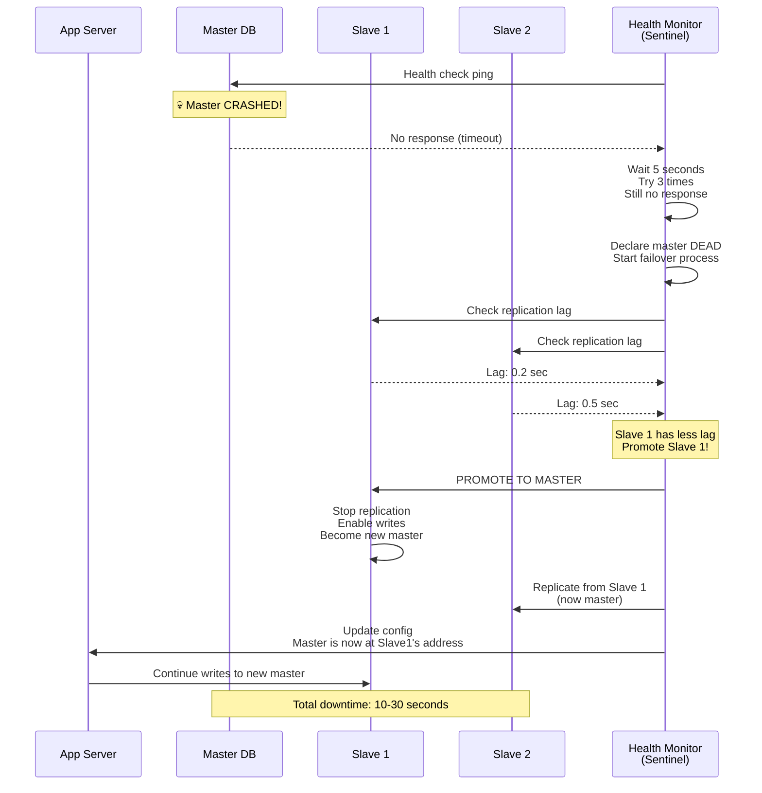

# Phase 4: Step 3 - Database Scaling

> **For Beginners:** Your database is like a single librarian. As more people come, one librarian can't handle everyone. We'll add more librarians (replication) and organize books into sections (sharding)!

---

## 🎯 The Problems We're Solving

### Problem 1: Single Point of Failure
```
Current setup: 1 PostgreSQL database

❌ If database crashes → Entire service DOWN!
❌ Hardware failure → Data lost (if no backup)
❌ Maintenance/upgrades → Downtime
```

### Problem 2: Limited Scalability
```
One database can handle:
- ~5,000 reads/sec
- ~1,000 writes/sec

Our future needs (5 years):
- 20,000 reads/sec (4x current)
- 100 writes/sec (5x current)

Single database will become bottleneck!
```

### Problem 3: Geographic Latency
```
Database in US East
User in Australia queries → 200ms network latency
User in India → 300ms latency

Users want < 100ms response time!
```

---

## 🚀 The Solutions

### Solution 1: Master-Slave Replication
```
✅ High Availability: If master dies, promote slave
✅ Read Scaling: Distribute reads across slaves
✅ Backups: Slaves are live backups
```

### Solution 2: Database Sharding
```
✅ Horizontal Scaling: Split data across multiple databases
✅ No single bottleneck
✅ Each shard handles subset of data
```

---

## 📐 Step 3 Architecture Diagram



---

## 🔄 Replication Strategy - Deep Dive

### 1. Master-Slave Replication Explained

**Concept:**
```
Master Database (1):
- Handles ALL writes (INSERT, UPDATE, DELETE)
- Source of truth

Slave Databases (3+):
- Copies of master
- Handle READ queries only
- Sync from master continuously
```

**How Replication Works:**



---

### 2. Synchronous vs Asynchronous Replication

**Asynchronous Replication (Our Choice):**
```
Master writes → Immediately returns success → Later syncs to slaves

Pros:
✅ Fast writes (no waiting for slaves)
✅ High performance
✅ Master not blocked by slow slaves

Cons:
❌ Replication lag (0.1-1 sec delay)
❌ Slaves might be slightly out of date
❌ If master crashes before sync → Some data lost (rare!)

Example:
12:00:00.000 - Write to master: "Created URL aB7x3K"
12:00:00.050 - App gets success response (50ms later)
12:00:00.200 - Slave 1 receives update (200ms lag)
12:00:00.300 - Slave 2 receives update (300ms lag)
```

**Synchronous Replication:**
```
Master writes → Waits for slave confirmation → Then returns success

Pros:
✅ No data loss (always in sync)
✅ Strong consistency

Cons:
❌ 2x slower writes (wait for network round-trip)
❌ If slave is down → Writes blocked!
❌ Lower availability

Not used for URL shorteners (writes would be too slow)
```

---

### 3. Read-Write Splitting Logic

**In Application Code:**
```javascript
// Example pseudocode

async function createShortURL(originalURL) {
  // WRITE operations → Always go to MASTER
  const shortCode = generateShortCode();

  await masterDB.query(`
    INSERT INTO urls (short_code, original_url, created_at)
    VALUES ($1, $2, NOW())
  `, [shortCode, originalURL]);

  // Invalidate cache
  await redis.del(`short:${shortCode}`);

  return shortCode;
}

async function redirectURL(shortCode) {
  // Check cache first
  let url = await redis.get(`short:${shortCode}`);
  if (url) return url;

  // Cache miss → READ from SLAVE (not master!)
  const slave = pickRandomSlave(); // Load balancing

  const result = await slave.query(`
    SELECT original_url
    FROM urls
    WHERE short_code = $1
  `, [shortCode]);

  // Cache the result
  await redis.set(`short:${shortCode}`, result.original_url, 'EX', 86400);

  return result.original_url;
}

function pickRandomSlave() {
  const slaves = [slave1, slave2, slave3];
  return slaves[Math.floor(Math.random() * slaves.length)];
}
```

---

### 4. Handling Replication Lag

**The Problem:**
```
12:00:00 - User creates URL "aB7x3K" → Writes to master
12:00:00 - App returns: "Created! Visit short.ly/aB7x3K"
12:00:01 - User immediately clicks link → Queries slave
12:00:01 - Slave doesn't have it yet! (replication lag 500ms)
12:00:01 - User sees "404 Not Found" 😢

This is called "Read-after-write inconsistency"
```

**Solution Strategies:**

**Strategy 1: Read from Master for Recent Writes (Simple)**
```javascript
async function redirectURL(shortCode, justCreated = false) {
  if (justCreated) {
    // User just created this, read from master (guaranteed to be there)
    return await masterDB.query(`SELECT original_url WHERE short_code = $1`, [shortCode]);
  }

  // Normal case: Read from slave
  return await pickRandomSlave().query(`SELECT original_url WHERE short_code = $1`, [shortCode]);
}
```

**Strategy 2: Read from Master Within Time Window**
```javascript
async function redirectURL(shortCode) {
  // Check when URL was created
  const createdAt = await redis.get(`created:${shortCode}`);

  const ageInSeconds = (Date.now() - createdAt) / 1000;

  if (ageInSeconds < 5) {
    // URL created < 5 seconds ago → Read from master
    return await masterDB.query(`SELECT original_url WHERE short_code = $1`, [shortCode]);
  }

  // Old URL → Safe to read from slave
  return await pickRandomSlave().query(`SELECT original_url WHERE short_code = $1`, [shortCode]);
}
```

**Strategy 3: Cache After Write (Best!)**
```javascript
async function createShortURL(originalURL) {
  const shortCode = generateShortCode();

  // Write to master
  await masterDB.query(`INSERT INTO urls ...`);

  // Immediately cache it!
  await redis.set(`short:${shortCode}`, originalURL, 'EX', 86400);

  // Now even if user clicks immediately, cache serves it!
  return shortCode;
}
```

**Our Choice:** Strategy 3 (Cache after write) - Simplest and most effective!

---

## 🗂️ Database Sharding Strategy

### What is Sharding?

**Concept:**
```
Instead of 1 huge database with 1 billion URLs
Split into 10 databases with 100 million URLs each

Database 1: URLs starting with 0-9, a-f
Database 2: URLs starting with g-m
Database 3: URLs starting with n-s
Database 4: URLs starting with t-z, A-F
...
```

**Benefits:**
- ✅ No single database bottleneck
- ✅ Parallel writes (each shard handles its subset)
- ✅ Easier to manage (smaller databases)
- ✅ Scale by adding more shards

---

### Sharding Strategy 1: Hash-Based Sharding

**How it Works:**
```
1. Take short code: "aB7x3K"
2. Hash it: hash("aB7x3K") = 1234567
3. Modulo by number of shards: 1234567 % 4 = 3
4. Store in Shard 3
```

**Visual:**
```mermaid
graph LR
    A[Short Code:<br/>"aB7x3K"] --> B[Hash Function<br/>CRC32 or MD5]
    B --> C[Hash Value:<br/>1234567]
    C --> D[Modulo 4<br/>1234567 % 4 = 3]
    D --> E[Shard 3]

    F[Short Code:<br/>"xY9zK2"] --> G[Hash Function]
    G --> H[Hash Value:<br/>8765432]
    H --> I[Modulo 4<br/>8765432 % 4 = 0]
    I --> J[Shard 0]

    style A fill:#e1f5ff
    style E fill:#c8e6c9
    style F fill:#e1f5ff
    style J fill:#c8e6c9
```

**Code Example:**
```javascript
function getShardNumber(shortCode, totalShards = 4) {
  // CRC32 hash (fast and uniform distribution)
  const hash = crc32(shortCode);

  // Modulo to get shard (0 to totalShards-1)
  return hash % totalShards;
}

async function getURL(shortCode) {
  const shardNum = getShardNumber(shortCode, 4);
  const shard = shards[shardNum]; // Get database connection for shard

  return await shard.query(`
    SELECT original_url
    FROM urls
    WHERE short_code = $1
  `, [shortCode]);
}
```

**Pros:**
- ✅ Uniform distribution (each shard gets ~equal data)
- ✅ Simple to implement
- ✅ Fast lookups (know exactly which shard to query)

**Cons:**
- ❌ Hard to add shards later (need to re-hash and move data!)
- ❌ No range queries across shards

---

### Sharding Strategy 2: Range-Based Sharding

**How it Works:**
```
Shard 0: Short codes starting with 0-3, a-f
Shard 1: Short codes starting with 4-7, g-m
Shard 2: Short codes starting with 8-9, n-s
Shard 3: Short codes starting with A-Z, t-z
```

**Pros:**
- ✅ Easy to add shards (just split a range)
- ✅ Range queries possible

**Cons:**
- ❌ Uneven distribution (some letters more common)
- ❌ Hot shards (if many URLs start with 'a')

**Our Choice:** Hash-Based Sharding (better distribution)

---

### Consistent Hashing (Advanced)

**Problem with Simple Modulo:**
```
Have 4 shards, using: hash % 4

Add 5th shard → Now use: hash % 5
→ Most keys move to different shards!
→ Massive data migration! 💀

Example:
hash("aB7x3K") = 1234567
Before: 1234567 % 4 = 3 (Shard 3)
After:  1234567 % 5 = 2 (Shard 2) → Moved!
```

**Consistent Hashing Solution:**
```
Uses a hash ring (circle)
Adding a shard only moves ~1/N keys (N = number of shards)

Before 4 shards → After 5 shards:
Only 20% of keys move! (much better than 80%)
```

**Visual:**


**Code Concept:**
```javascript
class ConsistentHash {
  constructor(shards) {
    this.ring = [];
    shards.forEach(shard => {
      // Add 100 virtual nodes per shard (better distribution)
      for (let i = 0; i < 100; i++) {
        const hash = crc32(`${shard}_${i}`);
        this.ring.push({ hash, shard });
      }
    });
    // Sort by hash value
    this.ring.sort((a, b) => a.hash - b.hash);
  }

  getShard(key) {
    const hash = crc32(key);
    // Find first shard with hash >= key hash (clockwise on ring)
    for (let node of this.ring) {
      if (node.hash >= hash) return node.shard;
    }
    // Wrap around to first shard
    return this.ring[0].shard;
  }
}
```

---

### Sharding Architecture Diagram



**Total Databases:** 4 shards × (1 master + 2 replicas) = 12 databases!

---

## 📊 Capacity After Sharding

### Before Sharding (Step 2):
```
1 Master + 3 Read Replicas

Capacity:
- Writes: 1,000/sec (master only)
- Reads: 15,000/sec (3 replicas × 5,000 each)

Bottleneck: Write capacity (we need 100/sec, have 1,000 - OK for now)
```

### After Sharding (Step 3):
```
4 Shards × (1 Master + 2 Replicas) = 12 databases

Capacity:
- Writes: 4,000/sec (4 masters × 1,000 each)
- Reads: 40,000/sec (8 replicas × 5,000 each)

Bottleneck: None! Plenty of headroom
```

**Growth Room:**
```
Current need: 18 writes/sec, 1,734 reads/sec
Have: 4,000 writes/sec, 40,000 reads/sec

Can grow: 200x for writes, 23x for reads before adding more shards! 🚀
```

---

## 🔧 Failover Strategy

**What is Failover?**
```
Master database crashes
System automatically promotes a slave to new master
Service continues with minimal downtime
```

### Automatic Failover Process:



**Tools for Failover:**
- **PostgreSQL:** Patroni, repmgr
- **MySQL:** MySQL Router, Orchestrator
- **Cloud:** AWS RDS (automatic failover), Google Cloud SQL

---

## 🎓 Beginner Concepts Explained

### Concept 1: CAP Theorem

**CAP Theorem:**
```
In a distributed database, you can only have 2 out of 3:
- C = Consistency (all nodes see same data)
- A = Availability (system always responds)
- P = Partition Tolerance (works despite network failures)
```

**Real-World Examples:**

| System | Prioritizes | Trade-Off |
|--------|-------------|-----------|
| **Traditional SQL** (PostgreSQL) | CP | Consistency + Partition Tolerance → Sacrifice Availability (go down during network split) |
| **NoSQL** (Cassandra) | AP | Availability + Partition Tolerance → Sacrifice Consistency (eventual consistency) |
| **URL Shortener** | CP | We choose Consistency! No duplicate short codes! |

**Our Choice:** CP (PostgreSQL with replication)
```
✅ Consistency: Master ensures no duplicate short codes
✅ Partition Tolerance: Replicas in different datacenters
❌ Availability: If master dies, 10-30 sec downtime during failover (acceptable!)
```

---

### Concept 2: Read Replicas vs Backup

**Read Replicas:**
```
Purpose: Serve live traffic (reduce load on master)
Data: Up-to-date (0.1-1 sec lag)
Usage: Handle user redirects
Count: 2-3 per shard
```

**Backups:**
```
Purpose: Disaster recovery (if all databases destroyed)
Data: Snapshot (hours or days old)
Usage: Restore after catastrophic failure
Count: 1-2 (stored in different region/cloud)
```

**Both are needed!**

---

### Concept 3: Multi-Master Replication (Advanced)

**Single Master (Our Choice):**
```
Pros:
✅ Simple (no conflict resolution)
✅ Strong consistency
✅ Easy to reason about

Cons:
❌ Single write bottleneck
❌ If master down → No writes until failover
```

**Multi-Master:**
```
Both Node A and Node B accept writes
They sync to each other

Pros:
✅ No single write bottleneck
✅ High availability (writes never down)

Cons:
❌ Conflict resolution complex
❌ Example conflict:
   User 1 creates "abc123" on Node A
   User 2 creates "abc123" on Node B (same code!)
   → Conflict! Which one wins?
```

**For URL Shortener:** Single master is correct choice (no conflicts!)

---

## ⚠️ Trade-Offs Summary

| Aspect | Single DB | Replication | Sharding |
|--------|-----------|-------------|----------|
| **Complexity** | ⭐ Simple | ⭐⭐ Moderate | ⭐⭐⭐⭐ Complex |
| **Read Capacity** | 5K req/sec | 15K req/sec | 40K req/sec |
| **Write Capacity** | 1K req/sec | 1K req/sec | 4K req/sec |
| **Availability** | ❌ SPOF | ✅ Failover 10-30s | ✅ Failover 10-30s |
| **Consistency** | ✅ Strong | ⚠️ Eventual (0.1-1s lag) | ⚠️ Eventual |
| **Cost** | $ | $$ | $$$$ |
| **Operational Overhead** | Low | Medium | High |

**Decision Matrix:**

```
< 1,000 writes/sec → Single DB (keep it simple!)
1,000-5,000 writes/sec → Replication (our case!)
> 5,000 writes/sec → Sharding (future-proofing)
```

---

## 📈 When to Shard? (Decision Guide)

**Don't Shard If:**
```
❌ Traffic < 5,000 writes/sec (replication is enough)
❌ Database size < 500 GB (single DB can handle)
❌ Early stage startup (over-engineering!)
```

**Consider Sharding If:**
```
✅ Database size > 1 TB (too big for single server)
✅ Writes > 5,000/sec (single master bottleneck)
✅ Geographic distribution (reduce latency)
✅ Compliance (data must stay in specific regions)
```

**Our URL Shortener:**
```
Current: 18 writes/sec, 110 GB/year
→ DON'T need sharding yet!

But we designed for it (Step 3) because:
✅ Shows we understand scalability
✅ Interview question: "How would you scale to 100K writes/sec?"
✅ Easy to add shards later if needed
```

---

## ✅ What We Accomplished in Step 3

✅ **High Availability:** Master-slave replication (no single point of failure)
✅ **Read Scaling:** 3 read replicas (15,000 reads/sec capacity)
✅ **Failover:** Automatic promotion (10-30 sec recovery)
✅ **Sharding Strategy:** Hash-based sharding (future-proof for 40K writes/sec)
✅ **Consistent Hashing:** Easy to add/remove shards
✅ **Geographic Distribution:** Replicas in multiple regions (low latency)
✅ **Replication Lag Handling:** Cache-after-write pattern

---

## 🎯 Limitations of Step 3 (What's Next?)

### Still Need to Fix:
1. **Limited Analytics**
   - Only basic click counts
   - No detailed metrics (country, device, referrer)
   - Fix in Step 4: Message queue for async analytics

2. **No Rate Limiting**
   - Users can spam URL creation
   - Fix in Step 4: Rate limiting service

3. **No Global CDN**
   - Users far from database regions have high latency
   - Fix later: CloudFlare CDN, edge caching

---

**Previous:** [← Step 2 - Add Caching](03_step2_add_caching.md)
**Next:** [Step 4 - Analytics & Rate Limiting →](05_step4_analytics_and_rate_limiting.md)
