```mermaid
graph LR
    A[🪣 Token Bucket<br/>Capacity: 10 tokens] --> B{Request Arrives}
    B -->|Tokens > 0| C[✅ Allow Request<br/>Consume 1 token]
    B -->|Tokens = 0| D[❌ Reject Request<br/>Rate Limited!]

    E[⏱️ Refill Timer<br/>+1 token every 6 sec] -.->|Add tokens| A

    style A fill:#fff9c4
    style C fill:#c8e6c9
    style D fill:#ffcdd2
```

# Phase 5: Step 4 - Analytics & Rate Limiting

> **For Beginners:** Analytics = Understanding who clicks your links and when. Rate Limiting = Preventing people from abusing your service. We'll add these without slowing down redirects!

---

## 🎯 The Problems We're Solving

### Problem 1: Limited Analytics
```
Current: Only basic click count in database

Users want to know:
❌ Which countries clicked my link?
❌ What devices (mobile, desktop)?
❌ When were most clicks? (time of day)
❌ Which referrers? (Twitter, Facebook, Email)

These queries are SLOW and load the database!
```

### Problem 2: No Rate Limiting
```
Malicious user can:
❌ Create 1 million URLs per minute (spam attack)
❌ Overwhelm database with writes
❌ Use up all available short codes
❌ Cost us money (storage, bandwidth)

Need to limit: 10 URLs per minute per user
```

### Problem 3: Redirects Slowed by Analytics
```
Current flow:
1. User clicks link
2. Look up URL in DB
3. Increment click counter (UPDATE query - slow!)
4. Redirect user

Step 3 adds 50ms latency!
User waits longer just for analytics 😢
```

---

## 🚀 The Solutions

### Solution 1: Message Queue for Async Analytics
```
✅ Redirect user immediately (don't wait for analytics)
✅ Send click event to queue
✅ Background workers process analytics
✅ User doesn't wait!
```

### Solution 2: Rate Limiting Service
```
✅ Check Redis for rate limit before creating URL
✅ Reject requests above limit
✅ Fast (in-memory check)
```

### Solution 3: Dedicated Analytics Database
```
✅ Don't mix analytics with URL data
✅ Use columnar database (ClickHouse) for fast analytics queries
✅ Can drop analytics data if needed (not critical)
```

---

## 📐 Step 4 Architecture Diagram

```mermaid
graph TB
    subgraph "User Layer"
        U[👤 Users]
    end

    subgraph "Load Balancing Layer"
        LB[🔀 Load Balancer<br/>+ WAF]
    end

    subgraph "Application Layer"
        App1[🖥️ App Server 1]
        App2[🖥️ App Server 2]
        App3[🖥️ App Server 3]
    end

    subgraph "Caching Layer"
        Redis[🔴 Redis Cluster<br/><br/>Stores:<br/>- URL cache<br/>- Rate limit counters<br/>- User sessions]
    end

    subgraph "🔥 MESSAGE QUEUE - NEW!"
        MQ[📬 Kafka / RabbitMQ<br/><br/>Topics:<br/>- url.created<br/>- url.clicked<br/>- url.deleted]
    end

    subgraph "🔥 BACKGROUND WORKERS - NEW!"
        W1[⚙️ Analytics Worker 1<br/><br/>Consumes:<br/>- Click events<br/>- Processes analytics]
        W2[⚙️ Analytics Worker 2]
        W3[⚙️ Email Worker<br/><br/>Sends:<br/>- Welcome emails<br/>- Reports]
    end

    subgraph "URL Database"
        DBM[(🗄️ PostgreSQL Master<br/><br/>urls table)]
        DBS1[(🗄️ Slave 1)]
        DBS2[(🗄️ Slave 2)]
    end

    subgraph "🔥 ANALYTICS DATABASE - NEW!"
        ClickHouse[(📊 ClickHouse<br/><br/>Analytics DB<br/><br/>Tables:<br/>- clicks<br/>- daily_stats<br/>- country_stats)]
    end

    U --> LB
    LB --> App1 & App2 & App3

    App1 & App2 & App3 <-->|"1. Check rate limit<br/>2. Cache URL"| Redis

    App1 & App2 & App3 -->|"Write URLs"| DBM
    App1 & App2 & App3 -->|"Read URLs"| DBS1 & DBS2

    App1 & App2 & App3 -->|"Publish Events<br/>(Fire and Forget)"| MQ

    MQ --> W1 & W2 & W3

    W1 & W2 -->|"Store Analytics"| ClickHouse
    W3 -->|"Query User Info"| DBS1

    DBM -.->|Replication| DBS1 & DBS2

    style U fill:#e1f5ff
    style LB fill:#fff3e0,stroke:#e65100,stroke-width:3px
    style App1 fill:#f3e5f5
    style App2 fill:#f3e5f5
    style App3 fill:#f3e5f5
    style Redis fill:#ffcdd2
    style MQ fill:#fff9c4,stroke:#f57f17,stroke-width:4px
    style W1 fill:#e1bee7,stroke:#6a1b9a,stroke-width:2px
    style W2 fill:#e1bee7,stroke:#6a1b9a,stroke-width:2px
    style W3 fill:#e1bee7,stroke:#6a1b9a,stroke-width:2px
    style DBM fill:#c8e6c9
    style DBS1 fill:#b2dfdb
    style DBS2 fill:#b2dfdb
    style ClickHouse fill:#bbdefb,stroke:#01579b,stroke-width:3px
```



---

## 🔄 Async Analytics Flow


**Beginner Breakdown:**
1. User clicks link → App looks up URL (10ms)
2. App **immediately** redirects user (user happy! ⚡)
3. App **asynchronously** sends click event to queue (1ms, non-blocking)
4. User is already browsing the destination site
5. Meanwhile, worker processes analytics in background (user doesn't wait!)

**Latency Improvement:**
```
Before: 100ms (lookup) + 50ms (update counter) = 150ms
After:  10ms (lookup) + 1ms (publish event) = 11ms

11ms vs 150ms = 13x faster! 🚀
```

---

## 📬 Message Queue Deep Dive

### Why Message Queue?

**Without Queue (Synchronous):**
```
App Server:
1. Look up URL (10ms)
2. Update click counter (50ms)
3. GeoIP lookup (20ms)
4. Update country stats (30ms)
5. Send email if threshold reached (100ms)
────────────────────────────────────────
Total: 210ms! User waits entire time 😢
```

**With Queue (Asynchronous):**
```
App Server:
1. Look up URL (10ms)
2. Publish to queue (1ms)
3. Redirect user (1ms)
────────────────────────────────────────
Total: 12ms! User happy ⚡

Background Worker (user doesn't wait):
4. GeoIP lookup (20ms)
5. Update analytics DB (50ms)
6. Send email (100ms)
────────────────────────────────────────
Total: 170ms, but async!
```

---

### Kafka vs RabbitMQ (Choosing Message Queue)

| Feature | RabbitMQ | Kafka |
|---------|----------|-------|
| **Throughput** | 10K-50K msg/sec | 100K-1M msg/sec |
| **Latency** | 1-5ms | 5-10ms |
| **Ordering** | Per queue | Per partition (shard) |
| **Durability** | Configurable | Always persisted to disk |
| **Use Case** | Task queues | Event streaming, logs |
| **Complexity** | ⭐⭐ Moderate | ⭐⭐⭐ Complex |
| **Message Retention** | Until consumed | Configurable (days/weeks) |

**Our Choice: Kafka** (better for high-volume analytics)

**Why?**
- ✅ High throughput (50M clicks/day = 578 events/sec)
- ✅ Event replay (can reprocess analytics if needed)
- ✅ Multiple consumers (analytics worker, email worker, ML worker)
- ✅ Industry standard for event streaming

---

### Event Schema Design

**Event: url.clicked**
```json
{
  "event_type": "url.clicked",
  "event_id": "550e8400-e29b-41d4-a716-446655440000",
  "timestamp": "2025-01-15T10:30:00.000Z",
  "short_code": "aB7x3K",
  "user": {
    "ip": "203.0.113.45",
    "user_agent": "Mozilla/5.0 (iPhone; CPU iPhone OS 14_0...)",
    "session_id": "sess_abc123"
  },
  "request": {
    "referrer": "https://twitter.com/post/123",
    "headers": {
      "accept-language": "en-US,en;q=0.9"
    }
  },
  "geo": null  // Will be enriched by worker
}
```

**Event: url.created**
```json
{
  "event_type": "url.created",
  "event_id": "650e8400-e29b-41d4-a716-446655440001",
  "timestamp": "2025-01-15T10:25:00.000Z",
  "short_code": "aB7x3K",
  "original_url": "https://example.com/long-url",
  "user_id": 12345,
  "custom_alias": false,
  "expires_at": "2025-12-31T23:59:59Z"
}
```

---

## 🚦 Rate Limiting Strategy

### Why Rate Limiting?

**Attack Scenarios:**
```
1. Spam Attack:
   - Malicious user creates 1M URLs/minute
   - Database overwhelmed
   - Uses up short code space

2. DDoS (Distributed Denial of Service):
   - Attacker sends 100K redirect requests/sec
   - Servers crash

3. Scraping:
   - Competitor scrapes all our URLs
   - Free ride on our infrastructure
```

---

### Rate Limiting Algorithms

#### Algorithm 1: Fixed Window Counter

**How it Works:**
```
Window: 1 minute
Limit: 10 requests

00:00:00 - 00:00:59 → Count requests
00:01:00 - 00:01:59 → Reset counter, count again
```

**Visual:**


**Code:**
```javascript
async function isRateLimitedFixedWindow(userId) {
  const key = `rate:${userId}:${Math.floor(Date.now() / 60000)}`; // 1-min window
  const count = await redis.incr(key);

  if (count === 1) {
    await redis.expire(key, 60); // Expire after 60 seconds
  }

  return count > 10; // Limit: 10 requests/minute
}
```

**Pros:**
- ✅ Simple to implement
- ✅ Low memory usage

**Cons:**
- ❌ **Burst at window edges!**
  ```
  00:00:59 → 10 requests (allowed)
  00:01:00 → 10 requests (allowed)
  Total: 20 requests in 2 seconds! (burst attack!)
  ```

---

#### Algorithm 2: Sliding Window Log

**How it Works:**
```
Store timestamp of each request
Count requests in last 60 seconds (rolling window)
```

**Visual:**
```
Current time: 10:30:00

Stored requests:
- 10:29:05
- 10:29:15
- 10:29:45 ← First request in 60-sec window
- 10:29:55
- 10:30:00 ← Current

Count = 5 requests in last 60 seconds
```

**Code:**
```javascript
async function isRateLimitedSlidingLog(userId) {
  const key = `rate:${userId}`;
  const now = Date.now();
  const windowStart = now - 60000; // 60 seconds ago

  // Remove old requests outside window
  await redis.zremrangebyscore(key, 0, windowStart);

  // Count requests in window
  const count = await redis.zcard(key);

  if (count >= 10) {
    return true; // Rate limited!
  }

  // Add current request
  await redis.zadd(key, now, `${now}-${Math.random()}`);
  await redis.expire(key, 60);

  return false;
}
```

**Pros:**
- ✅ No burst problem (true sliding window)
- ✅ Accurate

**Cons:**
- ❌ High memory usage (store all timestamps)
- ❌ Slower (need to query and cleanup)

---

#### Algorithm 3: Token Bucket (Our Choice!)

**How it Works:**
```
Bucket has 10 tokens
Every request consumes 1 token
Tokens refill at 10 tokens/minute (1 token every 6 seconds)

If bucket empty → Rate limited!
```

**Visual:**


**Code:**
```javascript
async function isRateLimitedTokenBucket(userId) {
  const key = `rate:${userId}`;
  const now = Date.now();

  // Get current bucket state
  const bucket = await redis.hgetall(key);

  let tokens = parseFloat(bucket.tokens) || 10; // Start with full bucket
  let lastRefill = parseInt(bucket.lastRefill) || now;

  // Calculate tokens to add based on time elapsed
  const timeElapsed = now - lastRefill; // milliseconds
  const tokensToAdd = timeElapsed / 6000; // 1 token every 6 seconds

  tokens = Math.min(10, tokens + tokensToAdd); // Max 10 tokens

  if (tokens < 1) {
    return true; // Rate limited!
  }

  // Consume 1 token
  tokens -= 1;

  // Save updated state
  await redis.hset(key, 'tokens', tokens, 'lastRefill', now);
  await redis.expire(key, 60);

  return false;
}
```

**Pros:**
- ✅ Allows bursts (up to bucket capacity)
- ✅ Smooth refilling
- ✅ Low memory (just 2 numbers)

**Cons:**
- ⚠️ Slightly complex logic

---

### Multi-Tier Rate Limiting

**Different Limits for Different Users:**

| User Tier | URLs/min | URLs/day | Cost |
|-----------|----------|----------|------|
| **Anonymous** | 5 | 20 | Free |
| **Free Account** | 10 | 100 | Free |
| **Pro Account** | 100 | 10,000 | $10/month |
| **Enterprise** | 1,000 | Unlimited | $100/month |

**Code:**
```javascript
function getRateLimit(user) {
  if (!user) return { perMinute: 5, perDay: 20 }; // Anonymous
  if (user.tier === 'free') return { perMinute: 10, perDay: 100 };
  if (user.tier === 'pro') return { perMinute: 100, perDay: 10000 };
  if (user.tier === 'enterprise') return { perMinute: 1000, perDay: Infinity };
}

async function checkRateLimit(user) {
  const limit = getRateLimit(user);

  // Check minute limit
  const minuteKey = `rate:${user.id}:minute`;
  if (await redis.incr(minuteKey) > limit.perMinute) {
    return { allowed: false, reason: 'Exceeded per-minute limit' };
  }
  await redis.expire(minuteKey, 60);

  // Check day limit
  const dayKey = `rate:${user.id}:day`;
  if (await redis.incr(dayKey) > limit.perDay) {
    return { allowed: false, reason: 'Exceeded daily limit' };
  }
  await redis.expire(dayKey, 86400); // 24 hours

  return { allowed: true };
}
```

---

## 📊 Analytics Database (ClickHouse)

### Why Not Use PostgreSQL for Analytics?

**PostgreSQL (OLTP - Online Transaction Processing):**
```
Optimized for:
✅ Small, fast transactions (INSERT, UPDATE one row)
✅ ACID guarantees
✅ Complex joins

Bad at:
❌ Analytical queries (scan millions of rows)
❌ Aggregations (SUM, AVG, GROUP BY)

Example slow query:
SELECT country, COUNT(*) FROM clicks
WHERE created_at > '2025-01-01'
GROUP BY country
ORDER BY COUNT(*) DESC;

On 100M rows → Takes 30 seconds! 💀
```

**ClickHouse (OLAP - Online Analytical Processing):**
```
Optimized for:
✅ Read-heavy workloads
✅ Fast aggregations (GROUP BY, SUM, AVG)
✅ Columnar storage (only read needed columns)

Same query:
On 100M rows → Takes 0.5 seconds! 🚀 (60x faster!)
```

---

### Analytics Schema (ClickHouse)

**Table 1: clicks (Raw Events)**
```sql
CREATE TABLE clicks (
    event_id UUID,
    short_code String,
    timestamp DateTime,
    ip String,
    country String,
    city String,
    device_type String,  -- mobile, desktop, tablet
    browser String,      -- Chrome, Firefox, Safari
    os String,           -- iOS, Android, Windows
    referrer String      -- twitter.com, facebook.com
) ENGINE = MergeTree()
ORDER BY (short_code, timestamp)
PARTITION BY toYYYYMM(timestamp);  -- Partition by month
```

**Table 2: daily_stats (Pre-aggregated)**
```sql
CREATE TABLE daily_stats (
    short_code String,
    date Date,
    click_count UInt64,
    unique_ips UInt64,
    top_country String,
    top_device String
) ENGINE = SumMingMergeTree()
ORDER BY (short_code, date);
```

---

### Analytics Queries (Examples)

**Query 1: Clicks by Country**
```sql
SELECT country, COUNT(*) as clicks
FROM clicks
WHERE short_code = 'aB7x3K'
  AND timestamp > now() - INTERVAL 7 DAY
GROUP BY country
ORDER BY clicks DESC
LIMIT 10;

-- Result in 100ms for millions of rows!
```

**Query 2: Hourly Click Distribution**
```sql
SELECT toHour(timestamp) as hour, COUNT(*) as clicks
FROM clicks
WHERE short_code = 'aB7x3K'
  AND toDate(timestamp) = '2025-01-15'
GROUP BY hour
ORDER BY hour;

-- Shows: Most clicks at 9 AM and 2 PM
```

**Query 3: Device Breakdown**
```sql
SELECT device_type, COUNT(*) * 100.0 / (SELECT COUNT(*) FROM clicks WHERE short_code = 'aB7x3K') as percentage
FROM clicks
WHERE short_code = 'aB7x3K'
GROUP BY device_type;

-- Result:
-- mobile: 65%
-- desktop: 30%
-- tablet: 5%
```

---

## 🎓 Beginner Concepts Explained

### Concept 1: Synchronous vs Asynchronous

**Synchronous (Wait for result):**
```javascript
function slowOperation() {
  sleep(5000); // Wait 5 seconds
  return "Done";
}

const result = slowOperation(); // Blocks here for 5 seconds
console.log(result); // Prints "Done" after 5 seconds
console.log("Next line"); // Waits for above to finish
```

**Asynchronous (Don't wait):**
```javascript
function fastOperation() {
  setTimeout(() => {
    console.log("Done"); // Executes later
  }, 5000);
  return "Started"; // Returns immediately
}

const result = fastOperation(); // Returns immediately
console.log(result); // Prints "Started" instantly
console.log("Next line"); // Doesn't wait!

// Output:
// Started
// Next line
// Done (5 seconds later)
```

**For URL Shortener:**
```
Redirect = Synchronous (user must wait for URL)
Analytics = Asynchronous (user doesn't care when it's processed)
```

---

### Concept 2: Publisher-Subscriber Pattern

**Traditional Request-Response:**
```
Client ──► Server ──► Database
        (wait)      (wait)
```

**Pub-Sub:**
```
Publisher (App Server):
  "I have an event: user clicked URL"
  Publishes to topic

Subscribers (Workers):
  Worker 1: "I'll update analytics"
  Worker 2: "I'll send email if needed"
  Worker 3: "I'll train ML model"

All subscribe to same topic, process independently!
```

**Benefits:**
- ✅ Decoupling (publisher doesn't know subscribers)
- ✅ Scalability (add more subscribers anytime)
- ✅ Fault tolerance (if one subscriber fails, others continue)

---

### Concept 3: Backpressure

**Problem:**
```
Events published: 10,000/sec
Workers can process: 1,000/sec

Queue grows: 9,000 events/sec
After 1 hour: 32 million backlogged events! 💀
```

**Solution 1: Add More Workers**
```
10 workers × 1,000 events/sec = 10,000 events/sec
Now balanced!
```

**Solution 2: Drop Non-Critical Events**
```
Priority 1: url.created → Never drop
Priority 2: url.clicked → Sample (only process 10%)
Priority 3: heartbeat → Drop if queue full
```

**Solution 3: Rate Limit Publishers**
```
If queue > 1M events → Slow down publishers
Return 429 Too Many Requests
```

---

## ⚠️ Trade-Offs Summary

| Aspect | Without Queue | With Queue |
|--------|---------------|------------|
| **Redirect Latency** | 150ms | 11ms ⚡ |
| **Analytics Accuracy** | Real-time | Delayed 1-5 sec |
| **System Complexity** | ⭐ Simple | ⭐⭐⭐ Complex |
| **Fault Tolerance** | ❌ If analytics fails, redirect fails | ✅ Independent |
| **Scalability** | Limited | ✅ Easy to scale workers |
| **Cost** | $ | $$$ (Kafka cluster + workers) |
| **Debugging** | ⭐ Easy | ⭐⭐ Harder (distributed tracing needed) |

**Is it worth it?** ✅ YES for high-traffic systems!

---

## ✅ What We Accomplished in Step 4

✅ **13x faster redirects** (11ms vs 150ms)
✅ **Async analytics processing** (user doesn't wait)
✅ **Message queue** (Kafka) for event streaming
✅ **Background workers** for analytics, emails
✅ **ClickHouse** for fast analytics queries (60x faster than PostgreSQL)
✅ **Rate limiting** (Token Bucket algorithm)
✅ **Multi-tier limits** (free, pro, enterprise)
✅ **Detailed analytics** (country, device, referrer)

---

## 🎯 Limitations of Step 4 (What's Next?)

### Still Need to Document:
1. **API Design** - RESTful endpoints, request/response formats
2. **Database Schema** - Detailed table structures
3. **Data Flow Diagrams** - Sequence diagrams for all operations
4. **Scalability & Reliability** - How to scale to 10x traffic

---

**Previous:** [← Step 3 - Database Scaling](04_step3_database_scaling.md)
**Next:** [API Design & Database Schema →](06_api_and_database_design.md)
