# Phase 7: Data Flow Diagrams

> **For Beginners:** Data flow diagrams show exactly how data moves through our system, step by step. Like a recipe that shows each cooking step in order!

---

## 🎯 What We'll Cover

We'll create detailed sequence diagrams for:
1. URL Creation (Shortening)
2. URL Redirect (Clicking short link)
3. Analytics Processing
4. Password-Protected URL Access
5. Custom Alias Creation
6. Bulk URL Creation
7. Failure Scenarios

---

## 📊 Flow 1: URL Creation (Happy Path)

**Scenario:** User creates a short URL


**Step-by-Step Breakdown:**

| Step | Time | What Happens |
|------|------|--------------|
| 1. Validate | 1ms | Check URL format, length, blacklist |
| 2. Rate Limit | 5ms | Check Redis counter (allow/reject) |
| 3. Generate Code | 2ms | Hash URL + timestamp + random |
| 4. Check Uniqueness | 10ms | Query DB (indexed lookup) |
| 5. Save to DB | 100ms | Transaction: INSERT URL |
| 6. Cache | 5ms | Store in Redis for fast access |
| 7. Publish Event | 1ms | Send to Kafka (async) |
| **Total** | **~150ms** | Response to user |

---

## 📊 Flow 2: URL Redirect (Happy Path - Cache Hit)

**Scenario:** User clicks short.ly/aB7x3K


**Performance:**
- Cache lookup: **5ms**
- Publish event: **1ms**
- Response: **4ms**
- **Total: ~10ms** (10x faster than database query!)

---

## 📊 Flow 3: URL Redirect (Cache Miss)

**Scenario:** Short code not in cache (first time or expired)

```mermaid
sequenceDiagram
    actor User
    participant App as App Server
    participant Redis as Redis Cache
    participant DB as PostgreSQL
    participant MQ as Kafka Queue

    User->>App: GET /xY9zK2

    Note over App: Step 1: Check cache

    App->>Redis: GET short:xY9zK2

    Redis-->>App: NULL

    Note over App: ❌ Cache MISS (20% of requests)

    Note over App: Step 2: Query database

    App->>DB: SELECT original_url, expires_at, is_active<br/>FROM urls<br/>WHERE short_code = 'xY9zK2'<br/>AND is_active = TRUE

    DB-->>App: {<br/>  original_url: "https://example.com/other",<br/>  expires_at: NULL,<br/>  is_active: true<br/>}

    Note over App: Step 3: Check expiration

    App->>App: expires_at == NULL → Not expired ✅

    Note over App: Step 4: Store in cache for next time

    App->>Redis: SET short:xY9zK2<br/>"https://example.com/other"<br/>EX 86400

    Redis-->>App: OK

    Note over App: Step 5: Publish analytics (async)

    App->>MQ: Publish click event

    Note over App: Step 6: Redirect

    App-->>User: 302 Redirect<br/>Location: https://example.com/other

    Note over User: Total time: ~100ms<br/>(First time only!)

    Note over User: Next 1M users → Cache hit (10ms) ⚡
```



**Performance Comparison:**

| Scenario | Time | Frequency |
|----------|------|-----------|
| **Cache Hit** | 10ms | 80% of requests |
| **Cache Miss** | 100ms | 20% of requests |
| **Average** | (0.8 × 10) + (0.2 × 100) = **28ms** | - |

---

## 📊 Flow 4: Analytics Processing (Background)

**Scenario:** Worker processes click event

```mermaid
sequenceDiagram
    participant MQ as Kafka Queue
    participant Worker as Analytics Worker
    participant GeoIP as GeoIP Service
    participant ClickHouse as ClickHouse DB
    participant Aggregator as Aggregation Worker

    MQ->>Worker: Consume event<br/>{<br/>  type: "url.clicked",<br/>  short_code: "aB7x3K",<br/>  ip: "203.0.113.45",<br/>  user_agent: "Mozilla/5.0 (iPhone...)"<br/>}

    Note over Worker: Step 1: Enrich event data

    Worker->>GeoIP: Lookup IP: 203.0.113.45

    GeoIP-->>Worker: {<br/>  country: "US",<br/>  city: "San Francisco",<br/>  lat: 37.7749,<br/>  lon: -122.4194<br/>}

    Worker->>Worker: Parse user_agent<br/>→ device: "mobile"<br/>→ os: "iOS"<br/>→ browser: "Safari"

    Note over Worker: Step 2: Insert raw event

    Worker->>ClickHouse: INSERT INTO clicks<br/>(event_id, short_code, timestamp,<br/> ip, country, city, device_type, os, browser)

    ClickHouse-->>Worker: Inserted

    Note over Worker: Step 3: Update daily aggregates

    Worker->>ClickHouse: INSERT INTO daily_stats<br/>(short_code, date, click_count)<br/>VALUES ('aB7x3K', '2025-01-15', 1)<br/>ON CONFLICT (short_code, date)<br/>DO UPDATE SET click_count = click_count + 1

    ClickHouse-->>Worker: Updated

    Note over Worker: Step 4: Update Redis counter (hot cache)

    Worker->>Worker: If viral link (clicks > 1000)<br/>→ Cache hot stats in Redis

    Note over Worker: Total processing time: 50-100ms<br/>(User already redirected!)

    Note over Aggregator: ━━━ Hourly Aggregation Job ━━━

    Note over Aggregator: Runs every hour

    Aggregator->>ClickHouse: SELECT short_code, country, COUNT(*)<br/>FROM clicks<br/>WHERE timestamp >= now() - INTERVAL 1 HOUR<br/>GROUP BY short_code, country

    Aggregator->>ClickHouse: INSERT INTO hourly_stats ...

    Note over Aggregator: Pre-compute hourly stats<br/>for fast dashboard loading
```



---

## 📊 Flow 5: Password-Protected URL Access

**Scenario:** User tries to access password-protected URL


---

## 📊 Flow 6: Custom Alias Creation

**Scenario:** User wants custom alias "my-blog"


---

## 📊 Flow 7: Expired URL Access

**Scenario:** User tries to access expired URL


---

## 📊 Flow 8: Database Failover (Failure Scenario)

**Scenario:** Master database crashes during write

```mermaid
sequenceDiagram
    actor User
    participant App as App Server
    participant DBMaster as Master DB
    participant DBSlave as Slave DB
    participant Monitor as Health Monitor

    User->>App: POST /v1/urls<br/>{original_url: "https://..."}

    App->>App: Generate short code: "aB7x3K"

    App->>DBMaster: INSERT INTO urls ...

    Note over DBMaster: 💀 MASTER CRASHES!

    DBMaster-->>App: ❌ Connection Error<br/>Timeout

    App->>App: Retry logic<br/>Attempt 1 of 3

    App->>DBMaster: INSERT INTO urls ...

    DBMaster-->>App: ❌ Still down

    Note over Monitor: Health check detects failure

    Monitor->>Monitor: Master down for 10 seconds<br/>Initiate failover!

    Monitor->>DBSlave: PROMOTE TO MASTER

    DBSlave->>DBSlave: Stop replication<br/>Enable writes<br/>Now NEW MASTER ✅

    Monitor->>App: Update DB config<br/>New master: Slave IP

    App->>App: Retry logic<br/>Attempt 2 of 3

    App->>DBSlave: INSERT INTO urls ...<br/>(Now writing to new master)

    DBSlave-->>App: Success!

    App-->>User: 201 Created<br/>{short_code: "aB7x3K"}

    Note over User: Total time: 15 seconds<br/>(Retry + Failover)<br/>User might see brief delay

    Note over DBMaster,Monitor: Total downtime: 10-30 seconds
```



---

## 📊 Flow 9: Rate Limit Exceeded (Failure Scenario)

**Scenario:** User exceeds rate limit


---

## 📊 Flow 10: Bulk URL Creation (Optimized)

**Scenario:** User creates 1000 URLs at once


**Performance Optimization:**
```
Individual inserts: 150ms × 1000 = 150 seconds
Batch insert: 2 seconds

Speedup: 75x faster! 🚀
```

---

## 🎓 Beginner Tips: Reading Sequence Diagrams

### Tip 1: Time Flows Downward
```
Top of diagram = Start
Bottom of diagram = End
Vertical axis = Time
```

### Tip 2: Arrows Show Communication
```
Solid arrow (→): Synchronous call (wait for response)
Dashed arrow (⇢): Asynchronous call (don't wait)
Return arrow (←--): Response
```

### Tip 3: Boxes Show Different Systems
```
Each vertical line = A different component
(User, App Server, Database, etc.)
```

### Tip 4: Notes Explain "Why"
```
"Note over App: This is why we do this step"
```

---

## 📊 Complete Flow Summary Table

| Flow | Avg Time | Frequency | Complexity |
|------|----------|-----------|------------|
| **URL Creation** | 150ms | 6/sec | Medium |
| **Redirect (Cache Hit)** | 10ms | 1,387/sec | Low |
| **Redirect (Cache Miss)** | 100ms | 347/sec | Medium |
| **Analytics Processing** | 50-100ms | Async | Medium |
| **Password-Protected** | 200ms | Rare | High |
| **Custom Alias** | 150ms | 10% of creates | Medium |
| **Expired URL** | 100ms | Rare | Low |
| **Rate Limit** | 5ms | Varies | Low |
| **Bulk Create (1000)** | 2000ms | Rare | High |
| **Database Failover** | 10-30 sec | Very rare | High |

---

## ✅ Key Takeaways

### Performance Optimization:
✅ **Caching reduces redirect time by 10x** (10ms vs 100ms)
✅ **Async analytics** (user doesn't wait for processing)
✅ **Batch operations** (75x faster for bulk creates)

### Reliability:
✅ **Retry logic** (handles transient failures)
✅ **Database failover** (10-30 sec recovery)
✅ **Rate limiting** (protects from abuse)

### User Experience:
✅ **Fast redirects** (< 10ms for cache hits)
✅ **Clear error messages** (tell user what went wrong)
✅ **Password protection** (secure sensitive links)

---

**Previous:** [← API & Database Design](06_api_and_database_design.md)
**Next:** [Scalability & Reliability →](08_scalability_and_reliability.md)
