# Phase 8: Scalability & Reliability

> **For Beginners:** Scalability = Handling more users/traffic. Reliability = Staying online even when things break. We'll learn how to design systems that grow and survive failures!

---

## 🚀 Scaling Strategies

### 1. Horizontal Scaling (Scale Out)

**Concept:** Add more servers instead of making existing servers bigger


**Advantages:**
```
✅ No downtime when adding servers
✅ If one server dies, others continue
✅ Can scale infinitely (add more servers)
✅ Cost-effective (use commodity hardware)
```

**Disadvantages:**
```
❌ More complex (need load balancer, orchestration)
❌ Network overhead (inter-server communication)
❌ Stateless design required
```

---

### 2. Database Scaling Strategy

#### Read Scaling (Add Read Replicas)


**Calculation:**
```
Current: 1,734 reads/sec
One replica: 5,000 reads/sec capacity

Number of replicas needed:
= 1,734 / 5,000
= 0.35 replicas

With headroom (3x capacity):
= 0.35 × 3
= 1.05 replicas
→ Use 2 replicas (for high availability)

Future (10x growth):
= 17,340 / 5,000
= 3.47 replicas
→ Use 4 replicas
```

---

#### Write Scaling (Sharding)

**When to Shard:**
```
Current: 18 writes/sec
Master capacity: 1,000 writes/sec
Utilization: 18/1000 = 1.8% → DON'T SHARD YET!

Future (100x growth):
= 1,800 writes/sec
→ Need 2 shards

Future (1000x growth):
= 18,000 writes/sec
→ Need 18 shards
```

**Sharding Strategy Revisited:**
```javascript
// Consistent hashing for future-proof sharding

class ShardManager {
  constructor(numShards) {
    this.shards = [];
    this.ring = [];

    // Initialize shards
    for (let i = 0; i < numShards; i++) {
      this.shards.push({
        id: i,
        master: `db-master-${i}.internal`,
        replicas: [
          `db-replica-${i}-1.internal`,
          `db-replica-${i}-2.internal`
        ]
      });

      // Add virtual nodes (100 per shard for even distribution)
      for (let v = 0; v < 100; v++) {
        const hash = crc32(`shard-${i}-vnode-${v}`);
        this.ring.push({ hash, shardId: i });
      }
    }

    // Sort ring by hash
    this.ring.sort((a, b) => a.hash - b.hash);
  }

  getShard(shortCode) {
    const hash = crc32(shortCode);

    // Find first virtual node >= hash
    for (let node of this.ring) {
      if (node.hash >= hash) {
        return this.shards[node.shardId];
      }
    }

    // Wrap around
    return this.shards[this.ring[0].shardId];
  }
}

// Usage
const shardManager = new ShardManager(4);
const shard = shardManager.getShard('aB7x3K');
console.log(shard);
// { id: 2, master: 'db-master-2.internal', replicas: [...] }
```

---

### 3. Caching at Multiple Levels


**Cache Hit Calculation:**
```
L1 (CDN): 40% of requests
L2 (App): 30% of remaining 60% = 18% total
L3 (Redis): 25% of remaining 42% = 10.5% total
L4 (DB): 5% of remaining 31.5% = 1.6% total

Database load reduction: 100% - 1.6% = 98.4% 🚀

Only 1.6% of requests hit database!
```

---

### 4. Geographic Distribution (Multi-Region)


**Latency Improvement:**
```
Before (Single Region - US East):
- US users: 20ms ✅
- EU users: 150ms 😐
- Asia users: 300ms 💀

After (Multi-Region):
- US users: 20ms ✅
- EU users: 25ms ✅
- Asia users: 30ms ✅

Average latency reduction: 170ms → 25ms (7x faster!)
```

---

## 🛡️ Reliability & High Availability

### 1. Failure Scenarios & Solutions

#### Scenario 1: App Server Crash

**Problem:**
```
App Server 2 crashes (out of memory)
10% of traffic affected
```

**Solution:**

```mermaid
sequenceDiagram
    participant LB as Load Balancer
    participant App1 as App Server 1
    participant App2 as App Server 2 💀
    participant App3 as App Server 3

    Note over LB: Health check every 5 seconds

    LB->>App1: GET /health
    App1-->>LB: 200 OK {status: "healthy"}

    LB->>App2: GET /health
    Note over App2: 💀 CRASHED!
    App2-->>LB: ❌ Timeout

    LB->>App3: GET /health
    App3-->>LB: 200 OK {status: "healthy"}

    Note over LB: Mark App2 as unhealthy<br/>Remove from rotation

    LB->>LB: Active servers: [App1, App3]

    Note over LB: Redistribute traffic:<br/>50% to App1<br/>50% to App3

    Note over App2: Auto-restart (Docker/K8s)<br/>Takes 30 seconds

    App2->>App2: Restart complete

    LB->>App2: GET /health
    App2-->>LB: 200 OK {status: "healthy"}

    Note over LB: Add App2 back to rotation

    LB->>LB: Active servers: [App1, App2, App3]

    Note over LB: Total user-facing downtime: 0 seconds ✅
```


---

#### Scenario 2: Database Master Failure

```mermaid
graph TB
    subgraph "Before Failure"
        M1[(Master<br/>✅ Healthy)] --> R1[(Replica 1)]
        M1 --> R2[(Replica 2)]
    end

    subgraph "During Failure (10 seconds)"
        M2[(Master<br/>💀 CRASHED)] -.x.-> R3[(Replica 1<br/>⏳ Promoting...)]
        M2 -.x.-> R4[(Replica 2)]
    end

    subgraph "After Failover"
        M3[(Old Replica 1<br/>✅ NEW MASTER)] --> R5[(Replica 2)]
        M3 --> R6[(Replica 3<br/>New replica)]
    end

    style M1 fill:#c8e6c9
    style M2 fill:#ffcdd2
    style M3 fill:#c8e6c9
    style R3 fill:#fff59d
```

**Recovery Time Objective (RTO):** 10-30 seconds

---

#### Scenario 3: Redis Cache Failure

**Problem:**
```
Redis cluster crashes
All cache misses → 100% requests hit database
Database overloaded!
```

**Solution (Circuit Breaker Pattern):**
```javascript
class CircuitBreaker {
  constructor() {
    this.state = 'CLOSED';  // CLOSED, OPEN, HALF_OPEN
    this.failureCount = 0;
    this.failureThreshold = 5;
    this.timeout = 60000;  // 60 seconds
    this.lastFailureTime = null;
  }

  async executeWithBreaker(fn) {
    if (this.state === 'OPEN') {
      // Check if timeout elapsed
      if (Date.now() - this.lastFailureTime > this.timeout) {
        this.state = 'HALF_OPEN';
        this.failureCount = 0;
      } else {
        throw new Error('Circuit breaker OPEN - Redis unavailable');
      }
    }

    try {
      const result = await fn();

      if (this.state === 'HALF_OPEN') {
        this.state = 'CLOSED';  // Redis recovered!
      }

      return result;
    } catch (error) {
      this.failureCount++;
      this.lastFailureTime = Date.now();

      if (this.failureCount >= this.failureThreshold) {
        this.state = 'OPEN';
        console.log('Circuit breaker OPEN - too many Redis failures');
      }

      throw error;
    }
  }
}

// Usage
const redisBreaker = new CircuitBreaker();

async function getFromCache(key) {
  try {
    return await redisBreaker.executeWithBreaker(async () => {
      return await redis.get(key);
    });
  } catch (error) {
    // Graceful degradation: Go straight to database
    console.log('Cache unavailable, querying database');
    return await database.query('SELECT ...');
  }
}
```

---

### 2. Monitoring & Alerting

#### Key Metrics to Monitor


#### Alert Thresholds

| Metric | Warning | Critical | Action |
|--------|---------|----------|--------|
| **Request Latency (p95)** | > 200ms | > 500ms | Scale app servers |
| **Error Rate** | > 1% | > 5% | Page on-call engineer |
| **CPU Usage** | > 70% | > 90% | Auto-scale |
| **Memory Usage** | > 80% | > 95% | Restart + investigate |
| **Cache Hit Rate** | < 70% | < 50% | Increase cache size |
| **Database Replication Lag** | > 1 sec | > 5 sec | Investigate network |
| **Database Connection Pool** | > 80% | > 95% | Increase pool size |

---

### 3. Disaster Recovery Plan

#### Backup Strategy


**Recovery Time Objectives (RTO):**
```
Scenario 1: Database corruption (last hour)
- Restore from: Hourly snapshot
- RTO: 15 minutes

Scenario 2: Entire region failure
- Failover to: DR region
- RTO: 5 minutes (DNS update)

Scenario 3: Accidental data deletion
- Restore from: Point-in-time (WAL replay)
- RTO: 30 minutes
```

---

## 📈 Scaling Roadmap (5-Year Plan)

### Year 1: Current State
```
Traffic: 1,734 req/sec
Users: 10M DAU
Architecture: 3 app servers, 1 master + 2 replicas
Cost: $2,000/month
```

### Year 2: 3x Growth
```
Traffic: 5,000 req/sec
Users: 30M DAU
Changes:
  - Add 3 more app servers (total: 6)
  - Add 2 more read replicas (total: 4)
  - Increase Redis memory: 2 GB → 6 GB
Cost: $5,000/month
```

### Year 3: 10x Growth
```
Traffic: 17,000 req/sec
Users: 100M DAU
Changes:
  - Implement sharding (4 shards)
  - Auto-scaling (10-20 app servers)
  - Multi-region deployment (US, EU)
  - CDN for static assets
Cost: $15,000/month
```

### Year 4: 30x Growth
```
Traffic: 50,000 req/sec
Users: 300M DAU
Changes:
  - 8 shards
  - 3 regions (US, EU, Asia)
  - Dedicated analytics cluster
  - Object storage for QR codes
Cost: $40,000/month
```

### Year 5: 100x Growth
```
Traffic: 170,000 req/sec
Users: 1B DAU
Changes:
  - 16 shards
  - 5 regions globally
  - Edge computing for redirects
  - ML for fraud detection
Cost: $120,000/month
```

---

## ✅ Reliability Checklist

### ✅ High Availability (99.9%)
- [x] Multiple app servers (no single point of failure)
- [x] Database replication (master + 2 replicas)
- [x] Auto-failover (10-30 sec recovery)
- [x] Health checks (every 5 seconds)
- [x] Load balancer redundancy (2 LBs)

### ✅ Data Durability
- [x] Database backups (hourly, daily, weekly)
- [x] Cross-region replication
- [x] WAL archiving (point-in-time recovery)
- [x] S3 backups (99.999999999% durability)

### ✅ Performance
- [x] Caching (80% cache hit rate)
- [x] CDN (40% of traffic)
- [x] Read replicas (scale reads)
- [x] Async processing (analytics, emails)

### ✅ Monitoring
- [x] Application metrics (Prometheus)
- [x] Log aggregation (ELK stack)
- [x] Distributed tracing (Jaeger)
- [x] Alerting (PagerDuty)

### ✅ Security
- [x] Rate limiting (prevent abuse)
- [x] HTTPS/TLS (encryption in transit)
- [x] Database encryption (encryption at rest)
- [x] Regular security audits

---

**Previous:** [← Data Flow Diagrams](07_data_flow_diagrams.md)
**Next:** [Interview Q&A →](09_interview_qa.md)
