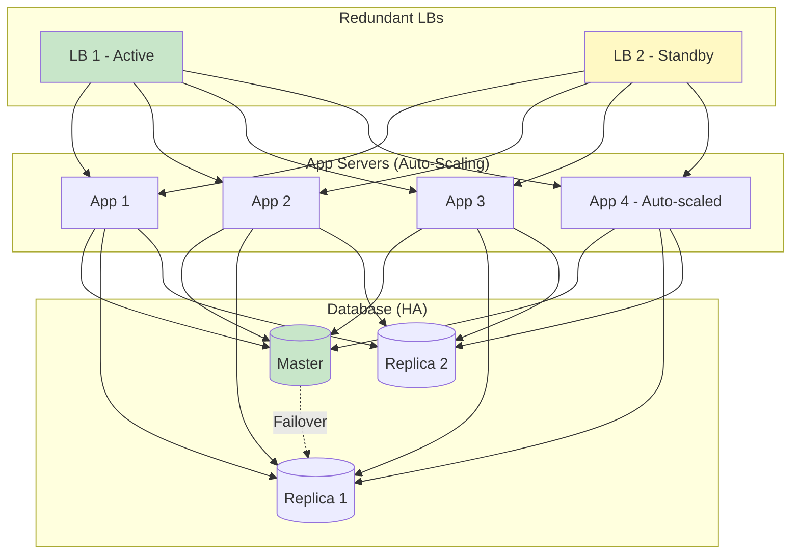

# Phase 9: Interview Q&A

> **For Beginners:** This section prepares you for real system design interviews! We'll cover 20 common questions with detailed, interview-ready answers.

---

## 🎯 How to Use This Section

**In an Interview:**
1. Listen to the question carefully
2. Clarify requirements (ask questions!)
3. Start with simple design
4. Iteratively add complexity
5. Discuss trade-offs
6. Mention monitoring and failure scenarios

---

## ❓ Question 1: How would you design a URL shortener like bit.ly?

**Answer:**

**Step 1: Clarify Requirements**
```
Me: "Let me clarify the requirements first:
- How many URLs do we need to shorten per day?
- What's the expected read:write ratio?
- Do we need analytics?
- Any custom alias support?"

Interviewer: "10M URLs/day, 100:1 read:write, basic analytics, yes to custom aliases."
```

**Step 2: Back-of-Envelope Calculations**
```
URLs/day: 10M
URLs/sec: 10M / 86,400 ≈ 116/sec (writes)
Reads/sec: 116 × 100 = 11,600/sec

Storage (5 years):
10M/day × 365 × 5 = 18.25 billion URLs
Each URL: ~600 bytes
Total: 18.25B × 600 = 11 TB

Short code length:
62^7 = 3.5 trillion combinations
More than enough for 18B URLs
```

**Step 3: High-Level Design**
```
[Draw on whiteboard]

Client → Load Balancer → App Servers → Redis Cache → Database

Components:
1. Load Balancer: Nginx (distribute traffic)
2. App Servers: Stateless, horizontal scaling (10+ servers)
3. Redis: Cache popular URLs (80% hit rate)
4. PostgreSQL: Master-slave replication (1 master + 3 replicas)
5. Message Queue: Kafka for async analytics
```

**Step 4: Deep Dives**

*API Design:*
```
POST /api/v1/urls
{
  "original_url": "https://example.com/long-url",
  "custom_alias": "my-blog"  // optional
}

GET /{short_code}
→ 302 Redirect to original URL
```

*Database Schema:*
```sql
CREATE TABLE urls (
    id BIGSERIAL PRIMARY KEY,
    short_code VARCHAR(7) UNIQUE NOT NULL,
    original_url TEXT NOT NULL,
    created_at TIMESTAMP,
    click_count BIGINT DEFAULT 0
);

CREATE INDEX idx_short_code ON urls(short_code);
```

*Short Code Generation:*
```
Approach: Hash-based
1. Hash(original_url + timestamp + random)
2. Take first 7 characters
3. Encode in Base62
4. Check uniqueness in DB
5. If collision, retry with new random value
```

**Step 5: Scalability**
```
Database:
- Read scaling: Add read replicas (handle 15K reads/sec per replica)
- Write scaling: Shard by hash of short_code when > 1K writes/sec

Cache:
- Redis Cluster: 2 GB memory
- Multi-level caching: CDN → App Cache → Redis → DB

Application:
- Auto-scaling: 5-20 servers based on traffic
- Stateless design: Any server handles any request
```

**Step 6: Trade-Offs**
```
SQL vs NoSQL:
- Chose SQL (PostgreSQL) for ACID guarantees
- Need unique short codes (no duplicates!)
- NoSQL has eventual consistency → Risk of collision

Counter-based vs Hash-based:
- Chose Hash-based for security (can't guess next URL)
- Counter reveals total URLs (privacy concern)
```

---

## ❓ Question 2: How would you handle 1 million requests per second?

**Answer:**

**Current Capacity Analysis:**
```
One app server: ~1,000 req/sec
One read replica: ~5,000 reads/sec
Redis: ~100,000 req/sec
```

**To Handle 1M req/sec:**

**1. Horizontal Scaling**
```
App Servers:
1M req/sec ÷ 1K per server = 1,000 servers
With load factor 0.7: 1,000 ÷ 0.7 = 1,429 servers

Cost optimization: Use auto-scaling
- Peak (1M req/sec): 1,500 servers
- Off-peak (100K req/sec): 150 servers
- Average: 500 servers
```

**2. Geographic Distribution**
```
Deploy in 5 regions:
- North America: 400K req/sec → 600 servers
- Europe: 300K req/sec → 450 servers
- Asia: 200K req/sec → 300 servers
- South America: 50K req/sec → 75 servers
- Australia: 50K req/sec → 75 servers

Total: 1,500 servers across 5 regions
```

**3. Caching Strategy**
```
Multi-level caching:

L1 (CDN): 50% hit rate → 500K req/sec
L2 (App local cache): 30% hit rate → 150K req/sec
L3 (Redis): 15% hit rate → 75K req/sec
L4 (Database): 5% → 25K req/sec

Database load: 25K reads/sec
= 25K ÷ 5K per replica
= 5 read replicas needed
```

**4. Database Sharding**
```
Writes at 1M req/sec (assume 1% write ratio):
= 10K writes/sec

Each master: 1K writes/sec
Shards needed: 10K ÷ 1K = 10 shards

Total databases: 10 shards × (1 master + 5 replicas) = 60 databases
```

**5. Network Bandwidth**
```
Avg response: 500 bytes
Bandwidth: 1M req/sec × 500 bytes = 500 MB/sec = 4 Gbps

Use CDN (CloudFlare) to handle 50% → 2 Gbps from origin
Cost: ~$5,000/month for bandwidth
```

**Estimated Cost:**
```
Servers: 500 avg × $100/month = $50,000/month
Databases: 60 × $200/month = $12,000/month
Redis: 20 nodes × $100/month = $2,000/month
Load Balancers: 10 × $50/month = $500/month
CDN: $5,000/month
Monitoring: $1,000/month

Total: ~$70,000/month for 1M req/sec
```

---

## ❓ Question 3: How do you ensure uniqueness of short codes?

**Answer:**

**Approach 1: Database Unique Constraint (Recommended)**
```sql
CREATE TABLE urls (
    short_code VARCHAR(7) UNIQUE NOT NULL,
    ...
);

-- Unique index ensures no duplicates
CREATE UNIQUE INDEX idx_short_code ON urls(short_code);
```

**Generation Flow:**
```javascript
async function generateUniqueShortCode(originalURL) {
  const maxAttempts = 5;

  for (let attempt = 0; attempt < maxAttempts; attempt++) {
    // Generate candidate
    const hash = crypto.createHash('md5')
      .update(originalURL + Date.now() + Math.random())
      .digest('hex');
    const shortCode = hash.substring(0, 7);

    // Try to insert
    try {
      await db.query(`
        INSERT INTO urls (short_code, original_url)
        VALUES ($1, $2)
      `, [shortCode, originalURL]);

      return shortCode;  // Success!

    } catch (error) {
      if (error.code === '23505') {  // Unique violation
        // Collision detected, retry with new hash
        continue;
      }
      throw error;
    }
  }

  // Fallback: Use guaranteed-unique counter
  const counter = await redis.incr('url_counter_fallback');
  return encodeBase62(counter);
}
```

**Why This Works:**
```
✅ Database enforces uniqueness (ACID guarantees)
✅ Collision probability very low with 7-char Base62
✅ Retry mechanism handles rare collisions
✅ Fallback ensures we always succeed
```

**Approach 2: Distributed ID Generation (Alternative)**
```
Use Snowflake algorithm:
- Timestamp (41 bits): milliseconds since epoch
- Worker ID (10 bits): which server generated it
- Sequence (12 bits): counter per millisecond

Total: 63 bits → Encode in Base62 → 11 characters

Pros:
✅ Guaranteed unique (no collision)
✅ Time-ordered IDs
✅ No database roundtrip

Cons:
❌ Longer codes (11 chars vs 7)
❌ Requires coordination for worker IDs
```

---

## ❓ Question 4: How would you handle a viral link with 10M clicks in 1 hour?

**Answer:**

**Problem Analysis:**
```
10M clicks in 1 hour = 2,778 clicks/sec
Without caching: 2,778 database queries/sec for SAME URL
Database would melt! 🔥
```

**Solution: Aggressive Caching**

**1. Detect Viral Links (Auto-Scaling)**
```javascript
// Monitor click rate in real-time
const clickRates = new Map();  // short_code → clicks/minute

async function handleRedirect(shortCode) {
  // Track click rate
  const key = `${shortCode}:${Math.floor(Date.now() / 60000)}`;  // per minute
  const clicks = clickRates.get(key) || 0;
  clickRates.set(key, clicks + 1);

  // If viral (> 100 clicks/min), adjust caching
  if (clicks > 100) {
    // Extend TTL
    await redis.expire(`short:${shortCode}`, 86400);  // 24 hours

    // Cache in CDN
    await cdnAPI.cache(`/${shortCode}`, {
      ttl: 3600,  // 1 hour
      origin: 'https://short.ly'
    });
  }

  // ... rest of redirect logic
}
```

**2. Multi-Level Caching**
```
Request Flow:

10M clicks/hour → 2,778/sec

L1 (CDN - CloudFlare):
- Hit rate: 90% for viral links
- Handles: 2,778 × 0.9 = 2,500/sec
- From edge locations (20ms latency)

L2 (Redis):
- Hit rate: 9% (cache misses from CDN)
- Handles: 2,778 × 0.09 = 250/sec
- In-memory (5ms latency)

L3 (Database):
- Hit rate: 1% (cache misses)
- Handles: 2,778 × 0.01 = 28/sec
- Easily manageable!

Database load reduced from 2,778/sec to 28/sec (99% reduction!)
```

**3. CDN Configuration**
```nginx
# CloudFlare Page Rule for viral links

/aB7x3K*
  Cache Level: Cache Everything
  Edge Cache TTL: 1 hour
  Browser Cache TTL: 5 minutes
```

**4. Rate Limiting (Prevent Abuse)**
```javascript
// Prevent single IP from hammering
const ipRateLimiter = new RateLimiter({
  points: 100,  // 100 requests
  duration: 60   // per minute
});

try {
  await ipRateLimiter.consume(userIP);
  // Allow request
} catch {
  // Rate limited
  return res.status(429).json({
    error: 'Too many requests from this IP'
  });
}
```

**5. Analytics (Async Processing)**
```
Don't increment click counter synchronously!

Instead:
1. Redirect user immediately (10ms)
2. Publish click event to Kafka (1ms, async)
3. Worker processes analytics later (user doesn't wait)

This way, even 10K clicks/sec won't slow down redirects
```

**Cost Analysis:**
```
Without optimization:
- Database: 2,778 queries/sec → Need 10 read replicas → $2,000/month

With caching:
- CDN: 2,500 req/sec → $500/month
- Redis: 250 req/sec → Included in base cost
- Database: 28 req/sec → Base 3 replicas → $600/month

Savings: $2,000 - $1,100 = $900/month saved (45% cost reduction)
```

---

## ❓ Question 5: How do you prevent malicious users from abusing the system?

**Answer:**

**1. Rate Limiting (Multiple Layers)**

```
Tier 1: Anonymous Users
- 5 URLs per minute
- 20 URLs per day
- Tracked by IP address

Tier 2: Registered Users (Free)
- 10 URLs per minute
- 100 URLs per day
- Tracked by user ID

Tier 3: Paid Users
- 100 URLs per minute
- 10,000 URLs per day
```

**Implementation:**
```javascript
async function checkRateLimit(user, ip) {
  const identifier = user ? `user:${user.id}` : `ip:${ip}`;

  // Check minute limit
  const minuteKey = `rate:${identifier}:minute`;
  const minuteCount = await redis.incr(minuteKey);

  if (minuteCount === 1) {
    await redis.expire(minuteKey, 60);
  }

  const limit = user ? (user.tier === 'paid' ? 100 : 10) : 5;

  if (minuteCount > limit) {
    throw new RateLimitError('Exceeded per-minute limit');
  }

  // Check daily limit (similar logic)
  // ...
}
```

**2. URL Validation & Blacklisting**

```javascript
const BLACKLIST = [
  'malware.com',
  'phishing-site.net',
  'spam.xyz'
];

async function validateURL(url) {
  // Check format
  if (!/^https?:\/\/.+/.test(url)) {
    throw new ValidationError('Invalid URL format');
  }

  // Check length
  if (url.length > 2048) {
    throw new ValidationError('URL too long');
  }

  // Check blacklist
  const domain = new URL(url).hostname;
  if (BLACKLIST.includes(domain)) {
    throw new ValidationError('Domain is blacklisted');
  }

  // Check against Google Safe Browsing API
  const isSafe = await googleSafeBrowsing.check(url);
  if (!isSafe) {
    throw new ValidationError('URL flagged as unsafe');
  }
}
```

**3. CAPTCHA for Anonymous Users**

```javascript
async function createShortURL(req) {
  // Require CAPTCHA for anonymous or suspicious users
  if (!req.user || req.suspiciousActivity) {
    const captchaValid = await verifyCaptcha(req.body.captcha);
    if (!captchaValid) {
      throw new CaptchaError('Invalid CAPTCHA');
    }
  }

  // ... create URL
}

// Detect suspicious activity
function isSuspicious(req) {
  return (
    req.recentRateLimitViolations > 3 ||
    req.createdURLsLastHour > 50 ||
    req.ipReputationScore < 0.5
  );
}
```

**4. Email Verification**

```
For free accounts:
1. User signs up → Email verification required
2. Until verified: Can only create 5 URLs total
3. After verified: Full free tier limits (100/day)

This prevents:
- Disposable email abuse
- Automated bot sign-ups
```

**5. Cost-Based Deterrence**

```
Premium features (require payment):
- Custom aliases
- No expiration
- Detailed analytics
- API access

Free tier limitations:
- Random codes only
- 30-day expiration
- Basic analytics
- No API
```

**6. Monitoring & Automated Blocking**

```javascript
// Background job: Detect abuse patterns
async function detectAbuse() {
  // Find users creating many URLs to same domain
  const suspiciousUsers = await db.query(`
    SELECT user_id, COUNT(*) as url_count,
           COUNT(DISTINCT original_url) as unique_urls
    FROM urls
    WHERE created_at > NOW() - INTERVAL '1 hour'
    GROUP BY user_id
    HAVING COUNT(*) > 100
       AND COUNT(DISTINCT original_url) < 10
  `);

  for (let user of suspiciousUsers) {
    // 100+ URLs in 1 hour, but only 10 unique destinations?
    // Likely spam/abuse!
    await blockUser(user.user_id, 'Automated abuse detection');
    await sendAlertToTeam(user);
  }
}
```

---

## ❓ Question 6: How do you design for 99.9% availability?

**Answer:**

**99.9% Availability = 8.76 hours downtime per year**

**1. Eliminate Single Points of Failure**

```
Component          | SPOF Risk | Solution
-------------------|-----------|------------------
Load Balancer      | ✅ Yes    | Use 2 LBs (active-passive)
App Servers        | ✅ Yes    | Use 3+ servers
Database Master    | ✅ Yes    | Auto-failover to replica
Redis Cache        | ✅ Yes    | Redis Cluster (3+ nodes)
Message Queue      | ✅ Yes    | Kafka cluster (3+ brokers)
```

**Architecture:**


**2. Health Checks & Auto-Recovery**

```javascript
// Load Balancer health check configuration
{
  interval: 5,        // Check every 5 seconds
  timeout: 2,         // 2 seconds timeout
  unhealthyThreshold: 3,  // 3 failures → mark unhealthy
  healthyThreshold: 2,    // 2 successes → mark healthy
  path: '/health'
}

// App server health endpoint
app.get('/health', async (req, res) => {
  const checks = await Promise.all([
    checkDatabaseConnection(),
    checkRedisConnection(),
    checkMemoryUsage(),
    checkCPUUsage()
  ]);

  const allHealthy = checks.every(c => c.healthy);

  res.status(allHealthy ? 200 : 503).json({
    status: allHealthy ? 'healthy' : 'unhealthy',
    checks
  });
});
```

**3. Graceful Degradation**

```javascript
// Continue operating even if non-critical services fail

async function createShortURL(originalURL) {
  let shortCode;

  try {
    // Try primary method (database + cache)
    shortCode = await generateAndSave(originalURL);
  } catch (dbError) {
    // Database down? Degrade gracefully
    logger.error('Database unavailable', dbError);

    // Fallback: Generate code and queue for later save
    shortCode = generateShortCodeOffline();
    await messageQueue.publish({
      type: 'deferred_url_creation',
      shortCode,
      originalURL,
      timestamp: Date.now()
    });

    // Return to user (saved asynchronously)
  }

  return shortCode;
}

// Background worker saves deferred URLs when DB recovers
```

**4. Circuit Breaker Pattern**

```
If Redis fails:
1. After 5 failures → Open circuit
2. Don't try Redis for 60 seconds (all requests go to DB)
3. After 60 seconds → Try one request (half-open)
4. If succeeds → Close circuit (resume normal operation)
5. If fails → Open circuit again
```

**5. Monitoring & Alerting**

```
Alert immediately if:
- Error rate > 1% (page on-call engineer)
- Latency p95 > 500ms (warning)
- Any service unavailable > 1 minute (critical alert)
- Database replication lag > 5 seconds (warning)

Metrics dashboard should show:
- Uptime (last 24h, 7d, 30d)
- Error rate trend
- Latency percentiles (p50, p95, p99)
- Infrastructure health
```

**6. Disaster Recovery**

```
Scenario: Entire AWS us-east-1 region fails

Recovery Plan:
1. DNS failover to us-west-2 (5 minutes)
2. Read replicas in us-west-2 promoted to masters (1 minute)
3. Auto-scaling launches new app servers (2 minutes)

Total RTO (Recovery Time Objective): 8 minutes

This keeps us well within 99.9% SLA:
- Downtime budget: 8.76 hours/year = 43.8 minutes/month
- One region failure: 8 minutes (< 20% of budget)
```

---

## ❓ Question 7-20: Quick Fire Round

### Q7: SQL vs NoSQL for URL shortener?

**Answer:** SQL (PostgreSQL)
- Need ACID guarantees (no duplicate short codes!)
- Simple, structured schema
- Complex analytics queries (JOINs)
- Strong consistency required

NoSQL is better for: Social media feeds, chat apps (eventual consistency OK)

---

### Q8: How do you handle URL expiration?

**Answer:**
```sql
-- Option 1: Passive deletion (check on access)
SELECT original_url FROM urls
WHERE short_code = 'aB7x3K'
  AND (expires_at IS NULL OR expires_at > NOW())

-- Option 2: Active deletion (background job)
-- Runs every hour
DELETE FROM urls
WHERE expires_at < NOW()
  AND expires_at IS NOT NULL
```

---

### Q9: How would you implement custom aliases?

**Answer:**
```javascript
async function createWithAlias(originalURL, customAlias) {
  // Validate alias
  if (!/^[a-zA-Z0-9-_]{3,20}$/.test(customAlias)) {
    throw new Error('Invalid alias format');
  }

  // Check reserved words
  const RESERVED = ['api', 'admin', 'www', 'help'];
  if (RESERVED.includes(customAlias.toLowerCase())) {
    throw new Error('Alias is reserved');
  }

  // Try to create (will fail if alias taken)
  try {
    await db.query(`
      INSERT INTO urls (short_code, original_url, is_custom_alias)
      VALUES ($1, $2, TRUE)
    `, [customAlias, originalURL]);

    return customAlias;
  } catch (error) {
    if (error.code === '23505') {
      // Suggest alternatives
      throw new Error(`Alias taken. Try: ${customAlias}-2, ${customAlias}-2025`);
    }
    throw error;
  }
}
```

---

### Q10: How do you calculate cache size needed?

**Answer:**
```
Daily active URLs: 10M clicks/day
Unique URLs: 10M × 20% (Pareto principle) = 2M

Memory per URL:
- Key: "short:aB7x3K" = 13 bytes
- Value: URL = 500 bytes
- Redis overhead = 100 bytes
- Total = 613 bytes ≈ 600 bytes

Cache size = 2M × 600 bytes = 1.2 GB

Add 50% buffer: 1.2 × 1.5 = 1.8 GB ≈ 2 GB

For 80% hit rate, cache the hottest 20% of URLs.
```

---

### Q11: How do you handle database failover?

**Answer:**
```
1. Health monitor detects master failure (10 sec)
2. Promote replica with least lag (Replica 1)
3. Reconfigure app servers to point to new master (5 sec)
4. Old master comes back → Join as replica (no data loss)

Total downtime: 15 seconds

Use tools: Patroni (PostgreSQL), Orchestrator (MySQL)
```

---

### Q12: How would you implement analytics?

**Answer:**
```
Async processing (user doesn't wait):

1. User clicks short.ly/aB7x3K
2. Redirect immediately (10ms)
3. Publish click event to Kafka (1ms, async)
4. Worker processes event:
   - GeoIP lookup (country, city)
   - Parse user agent (device, browser)
   - Store in ClickHouse analytics DB
5. Pre-aggregate hourly/daily stats

Query analytics:
SELECT country, COUNT(*) FROM clicks
WHERE short_code = 'aB7x3K' AND date = '2025-01-15'
GROUP BY country

ClickHouse: 100x faster than PostgreSQL for analytics
```

---

### Q13: How do you implement URL redirection?

**Answer:**
```javascript
app.get('/:shortCode', async (req, res) => {
  const { shortCode } = req.params;

  // Check cache
  let url = await redis.get(`short:${shortCode}`);

  if (!url) {
    // Cache miss - query database
    const result = await db.query(
      'SELECT original_url FROM urls WHERE short_code = $1 AND is_active = TRUE',
      [shortCode]
    );

    if (!result.rows[0]) {
      return res.status(404).send('URL not found');
    }

    url = result.rows[0].original_url;

    // Store in cache
    await redis.set(`short:${shortCode}`, url, 'EX', 86400);
  }

  // Async analytics (don't wait)
  publishClickEvent(shortCode, req.ip, req.headers['user-agent']);

  // Redirect
  res.redirect(302, url);
});
```

---

### Q14: How do you secure your API?

**Answer:**
```
1. Authentication: JWT tokens
   - Sign up → Get JWT
   - Include in header: Authorization: Bearer <token>

2. Rate Limiting: Token bucket algorithm
   - Free: 10 req/min
   - Paid: 100 req/min

3. HTTPS only (TLS 1.3)
   - Encrypt data in transit
   - Prevent MITM attacks

4. Input Validation
   - Sanitize URLs (prevent XSS)
   - Check against malware databases

5. API Keys for programmatic access
   - Rotate keys every 90 days
   - Monitor usage per key
```

---

### Q15: What monitoring would you implement?

**Answer:**
```
1. Application Metrics (Prometheus)
   - Request rate (req/sec)
   - Latency (p50, p95, p99)
   - Error rate (%)

2. Infrastructure Metrics
   - CPU, memory, disk usage
   - Network bandwidth

3. Business Metrics
   - URLs created/day
   - Redirects/day
   - Active users

4. Logging (ELK stack)
   - Centralized logs
   - Error tracking (Sentry)

5. Distributed Tracing (Jaeger)
   - Track request flow across services
   - Identify bottlenecks

6. Alerting (PagerDuty)
   - Error rate > 1% → Page on-call
   - Latency > 500ms → Warning
   - Service down > 1 min → Critical
```

---

### Q16: How do you handle GDPR/data privacy?

**Answer:**
```
1. Data Minimization
   - Don't store full IP (hash or truncate last octet)
   - Don't log sensitive info in URLs

2. Right to be Forgotten
   - API endpoint: DELETE /v1/users/{id}
   - Delete all URLs created by user
   - Anonymize analytics data

3. Data Encryption
   - At rest: AES-256 for database
   - In transit: TLS 1.3 for all connections

4. Data Retention
   - Analytics: 1 year max (auto-delete)
   - Inactive URLs: Delete after 2 years

5. Transparency
   - Privacy policy explaining data collection
   - Analytics opt-out option
```

---

### Q17: How would you add QR code generation?

**Answer:**
```javascript
const QRCode = require('qrcode');

app.get('/:shortCode/qr', async (req, res) => {
  const shortURL = `https://short.ly/${req.params.shortCode}`;

  // Check cache
  let qrCode = await redis.get(`qr:${req.params.shortCode}`);

  if (!qrCode) {
    // Generate QR code
    qrCode = await QRCode.toDataURL(shortURL, {
      width: 300,
      margin: 2,
      color: {
        dark: '#000000',
        light: '#FFFFFF'
      }
    });

    // Cache for 7 days (QR codes don't change)
    await redis.set(`qr:${req.params.shortCode}`, qrCode, 'EX', 604800);
  }

  // Return PNG
  const img = Buffer.from(qrCode.split(',')[1], 'base64');
  res.type('image/png').send(img);
});
```

---

### Q18: How do you implement password-protected URLs?

**Answer:**
```javascript
const bcrypt = require('bcrypt');

// Create password-protected URL
async function createProtectedURL(originalURL, password) {
  const shortCode = generateShortCode();
  const passwordHash = await bcrypt.hash(password, 10);

  await db.query(`
    INSERT INTO urls (short_code, original_url, password_hash)
    VALUES ($1, $2, $3)
  `, [shortCode, originalURL, passwordHash]);

  return shortCode;
}

// Access password-protected URL
app.post('/:shortCode/unlock', async (req, res) => {
  const { password } = req.body;

  const url = await db.query(
    'SELECT original_url, password_hash FROM urls WHERE short_code = $1',
    [req.params.shortCode]
  );

  const match = await bcrypt.compare(password, url.password_hash);

  if (!match) {
    return res.status(401).json({ error: 'Invalid password' });
  }

  // Generate temporary token (valid 1 hour)
  const token = jwt.sign({ shortCode: req.params.shortCode }, SECRET, {
    expiresIn: '1h'
  });

  res.json({ token, redirect_url: url.original_url });
});
```

---

### Q19: How do you implement bulk URL creation?

**Answer:**
```javascript
app.post('/v1/urls/bulk', async (req, res) => {
  const { urls } = req.body;  // Array of URLs

  // Validate all URLs first
  for (let url of urls) {
    validateURL(url);
  }

  // Generate short codes
  const shortCodes = urls.map(url => ({
    shortCode: generateShortCode(),
    originalURL: url
  }));

  // Batch insert (single query!)
  const values = shortCodes.map((item, i) =>
    `('${item.shortCode}', '${item.originalURL}')`
  ).join(',');

  await db.query(`
    INSERT INTO urls (short_code, original_url)
    VALUES ${values}
  `);

  // Batch cache
  const pipeline = redis.pipeline();
  shortCodes.forEach(item => {
    pipeline.set(`short:${item.shortCode}`, item.originalURL, 'EX', 86400);
  });
  await pipeline.exec();

  res.json({
    created: shortCodes.length,
    results: shortCodes
  });
});

// Performance: 1000 URLs in 2 seconds (vs 150 seconds individually)
```

---

### Q20: What's your capacity planning strategy?

**Answer:**
```
1. Define Metrics
   - Current: 1,734 req/sec peak
   - Growth: 20% per year
   - Year 1: 2,080 req/sec
   - Year 2: 2,500 req/sec
   - Year 3: 3,000 req/sec

2. Provision for 3x Peak
   - Year 1 capacity: 2,080 × 3 = 6,240 req/sec
   - Servers needed: 6,240 / 1,000 = 7 servers

3. Auto-Scaling
   - Min: 3 servers (always-on)
   - Max: 15 servers (peak traffic)
   - Scale up: CPU > 70%
   - Scale down: CPU < 30% for 10 minutes

4. Database Capacity
   - Monitor query latency
   - If p95 > 100ms → Add read replica
   - If writes > 800/sec → Plan sharding

5. Cost Optimization
   - Reserved instances for baseline (30% savings)
   - Spot instances for burst traffic (70% savings)
   - Auto-scaling for variable load
```

---

## ✅ Interview Tips

### Do's ✅
1. **Clarify requirements** before jumping to design
2. **Start simple**, then add complexity
3. **Draw diagrams** (whiteboard or digital)
4. **Discuss trade-offs** (SQL vs NoSQL, caching strategies)
5. **Mention monitoring** and failure scenarios
6. **Calculate numbers** (back-of-envelope)
7. **Think out loud** (show your thought process)

### Don'ts ❌
1. Don't immediately jump to complex solution
2. Don't ignore scalability/reliability
3. Don't forget to discuss trade-offs
4. Don't memorize answers (understand principles!)
5. Don't be afraid to ask clarifying questions

---

**Previous:** [← Scalability & Reliability](08_scalability_and_reliability.md)
**Next:** [Beginner Mistakes & Summary →](10_beginner_mistakes_and_summary.md)
