# Phase 10: Common Beginner Mistakes & Summary

> **For Beginners:** Learn from common mistakes so you can ace your system design interviews and build better systems!

---

## ❌ Common Beginner Mistakes

### Mistake 1: Not Calculating Capacity Upfront

**❌ Wrong Approach:**
```
Interviewer: "Design a URL shortener."
Candidate: "Okay, I'll use AWS, it scales automatically!"
*Doesn't calculate traffic, storage, or costs*
```

**✅ Right Approach:**
```
Candidate: "Let me first calculate the scale we're dealing with:

Traffic:
- 10M DAU × 5 clicks/day = 50M clicks/day
- 50M / 86,400 = 578 clicks/sec (average)
- Peak (3x): 1,734 clicks/sec

Storage:
- 500K URLs/day × 365 × 5 years = 912M URLs
- 912M × 600 bytes = 547 GB

Now I can design for this scale..."
```

**Why This Matters:**
- Shows you understand real-world constraints
- Helps choose right technologies
- Demonstrates business sense (cost awareness)

---

### Mistake 2: Starting with Microservices

**❌ Wrong Approach:**
```
"I'll design with 20 microservices:
- URL Creation Service
- URL Retrieval Service
- Analytics Service
- Email Service
- QR Code Service
- Rate Limiting Service
- ... (continues for 15 more services)"
```

**✅ Right Approach:**
```
"I'll start with a monolith:
- Single application server (stateless)
- One database (PostgreSQL)
- Redis cache
- Message queue for async tasks

Why?
- 1,734 req/sec is NOT high scale (1 server handles 1,000 req/sec)
- Monolith is simpler to develop and debug
- Can always split into microservices later if needed

When to consider microservices:
- > 100 engineers
- > 10,000 req/sec per service
- Different scaling needs per component
```

**Beginner Tip:** Don't over-engineer! Start simple, scale later.

---

### Mistake 3: Ignoring Single Points of Failure

**❌ Wrong Approach:**


**Problem:**
- If app server crashes → Service DOWN!
- If database crashes → Data inaccessible!
- 0% availability guarantee

**✅ Right Approach:**


**Redundancy:**
- 3 app servers (if one fails, others continue)
- 1 master + 2 replicas (automatic failover)
- Load balancer itself should be redundant (2 LBs)

---

### Mistake 4: Choosing NoSQL Without Justification

**❌ Wrong Approach:**
```
"I'll use MongoDB because it's NoSQL and scales better."
```

**Why This is Wrong:**
- URL shortener needs UNIQUE short codes (strong consistency)
- Simple schema (no need for schema-less)
- Complex analytics queries (need JOINs)

**✅ Right Approach:**
```
Decision Matrix:

| Factor | SQL | NoSQL | Winner |
|--------|-----|-------|--------|
| **Uniqueness** | ACID guarantees | Eventual consistency | SQL ✅ |
| **Schema** | Fixed (perfect for URLs) | Flexible (not needed) | SQL ✅ |
| **Analytics** | Complex JOINs | Limited | SQL ✅ |
| **Scalability** | Vertical + replication | Horizontal | NoSQL |

Conclusion: PostgreSQL (SQL)

When to use NoSQL:
- Social media feeds (eventual consistency OK)
- High write throughput (> 10K writes/sec)
- Flexible schema (user profiles with varying fields)
```

**Beginner Tip:** Choose based on requirements, not hype!

---

### Mistake 5: Not Handling Collisions

**❌ Wrong Approach:**
```javascript
async function createShortURL(originalURL) {
  const shortCode = generateShortCode();  // Random 7-char code

  await db.query(`
    INSERT INTO urls (short_code, original_url)
    VALUES ($1, $2)
  `, [shortCode, originalURL]);

  // What if shortCode already exists? 💀
  // Query fails, user sees error!

  return shortCode;
}
```

**✅ Right Approach:**
```javascript
async function createShortURL(originalURL) {
  const maxAttempts = 5;

  for (let attempt = 0; attempt < maxAttempts; attempt++) {
    const shortCode = generateShortCode();

    try {
      await db.query(`
        INSERT INTO urls (short_code, original_url)
        VALUES ($1, $2)
      `, [shortCode, originalURL]);

      return shortCode;  // Success!

    } catch (error) {
      if (error.code === '23505') {  // Unique violation
        console.log(`Collision detected: ${shortCode}, retrying...`);
        continue;  // Retry with new code
      }
      throw error;  // Other error, propagate
    }
  }

  // Fallback: Use guaranteed-unique counter
  const counter = await redis.incr('url_counter_fallback');
  return encodeBase62(counter);
}
```

**Collision Probability:**
```
With 1M URLs and 62^7 possible codes:
P(collision) ≈ (1M)^2 / (2 × 3.5 trillion) = 0.014% (very low!)

But ALWAYS handle it gracefully!
```

---

### Mistake 6: Synchronous Analytics

**❌ Wrong Approach:**
```javascript
app.get('/:shortCode', async (req, res) => {
  const url = await db.query('SELECT original_url FROM urls WHERE short_code = $1', [req.params.shortCode]);

  // Update click count (SLOW!)
  await db.query('UPDATE urls SET click_count = click_count + 1 WHERE short_code = $1', [req.params.shortCode]);

  // GeoIP lookup (SLOW!)
  const country = await geoip.lookup(req.ip);

  // Save analytics (SLOW!)
  await db.query('INSERT INTO analytics (short_code, country, timestamp) VALUES ($1, $2, $3)',
    [req.params.shortCode, country, new Date()]);

  // Finally redirect (user waited 200ms! 😢)
  res.redirect(url);
});

// Total latency: 200ms (50% of it is analytics!)
```

**✅ Right Approach:**
```javascript
app.get('/:shortCode', async (req, res) => {
  const url = await db.query('SELECT original_url FROM urls WHERE short_code = $1', [req.params.shortCode]);

  // Publish analytics event (async, 1ms)
  messageQueue.publish({
    type: 'url.clicked',
    shortCode: req.params.shortCode,
    ip: req.ip,
    userAgent: req.headers['user-agent'],
    timestamp: Date.now()
  });

  // Redirect immediately! (user only waits 10ms ⚡)
  res.redirect(url);
});

// Background worker processes analytics later (user doesn't wait!)
```

**Latency Improvement:** 200ms → 10ms (20x faster!)

---

### Mistake 7: Not Using Caching

**❌ Wrong Approach:**
```
Every redirect queries database:
- Viral link: 10M clicks/hour = 2,778/sec
- 2,778 database queries/sec for SAME URL
- Database melts! 🔥
```

**✅ Right Approach:**
```javascript
async function getURL(shortCode) {
  // Check cache first
  let url = await redis.get(`short:${shortCode}`);

  if (url) {
    return url;  // Cache hit (80% of requests, 10ms)
  }

  // Cache miss - query database
  url = await db.query('SELECT original_url FROM urls WHERE short_code = $1', [shortCode]);

  // Store in cache for next time
  await redis.set(`short:${shortCode}`, url, 'EX', 86400);  // TTL: 24 hours

  return url;  // First time: 100ms, next 1M times: 10ms
}
```

**Cache Hit Savings:**
```
Without cache:
- 2,778 req/sec × 100ms = Database overloaded

With cache (80% hit rate):
- 2,222 req/sec from cache (10ms)
- 556 req/sec from DB (100ms)
- Database happy! ✅
```

---

### Mistake 8: Poor Short Code Generation

**❌ Wrong Approach:**
```javascript
// Approach 1: Sequential numbers
let counter = 1;
function generateShortCode() {
  return counter++;  // "1", "2", "3", ...
}

// Problems:
// ❌ Not compact (need Base62 encoding)
// ❌ Predictable (can guess next URL!)
// ❌ Reveals total URLs created
```

**❌ Wrong Approach:**
```javascript
// Approach 2: Random without uniqueness check
function generateShortCode() {
  return Math.random().toString(36).substring(7);  // Random 7 chars
}

// Problems:
// ❌ No collision detection!
// ❌ Birthday paradox → Collision likely after 1M URLs
```

**✅ Right Approach:**
```javascript
// Hash-based with uniqueness check
function generateShortCode(originalURL) {
  const input = originalURL + Date.now() + Math.random();
  const hash = crypto.createHash('md5').update(input).digest('hex');
  return hash.substring(0, 7);  // Take first 7 chars
}

async function createShortURL(originalURL) {
  let shortCode;

  // Retry on collision
  for (let attempt = 0; attempt < 5; attempt++) {
    shortCode = generateShortCode(originalURL);

    const exists = await db.query('SELECT 1 FROM urls WHERE short_code = $1', [shortCode]);

    if (!exists) {
      break;  // Unique!
    }
  }

  await db.query('INSERT INTO urls (short_code, original_url) VALUES ($1, $2)', [shortCode, originalURL]);
  return shortCode;
}

// Benefits:
// ✅ Random (unpredictable)
// ✅ Unique (checked before insert)
// ✅ Compact (7 characters)
```

---

### Mistake 9: No Rate Limiting

**❌ Wrong Approach:**
```
User sends 1,000,000 URL creation requests
→ Database creates 1M URLs
→ Service slows down for everyone
→ Attacker wins 😈
```

**✅ Right Approach:**
```javascript
async function rateLimitCheck(userId) {
  const key = `rate:${userId}:minute`;
  const count = await redis.incr(key);

  if (count === 1) {
    await redis.expire(key, 60);  // Reset after 60 seconds
  }

  if (count > 10) {
    throw new RateLimitError('Max 10 URLs per minute exceeded');
  }
}

app.post('/v1/urls', async (req, res) => {
  // Check rate limit BEFORE creating URL
  try {
    await rateLimitCheck(req.user.id);
  } catch (error) {
    return res.status(429).json({
      error: 'Rate limit exceeded',
      retry_after: 60
    });
  }

  // Create URL...
});
```

**Protection Levels:**
- Anonymous: 5 URLs/minute
- Free account: 10 URLs/minute
- Paid account: 100 URLs/minute

---

### Mistake 10: Forgetting About URL Validation

**❌ Wrong Approach:**
```javascript
// Accept any URL without validation
app.post('/v1/urls', async (req, res) => {
  const { original_url } = req.body;

  // No validation! 💀
  const shortCode = await createShortURL(original_url);

  res.json({ short_url: `https://short.ly/${shortCode}` });
});

// Problems:
// ❌ User enters "javascript:alert('XSS')" → Stored!
// ❌ User enters "not-even-a-url" → Stored!
// ❌ User enters malware site → Stored and spread!
```

**✅ Right Approach:**
```javascript
async function validateURL(url) {
  // Check format
  if (!/^https?:\/\/.+/.test(url)) {
    throw new ValidationError('URL must start with http:// or https://');
  }

  // Check length
  if (url.length > 2048) {
    throw new ValidationError('URL too long (max 2048 characters)');
  }

  // Check for dangerous protocols
  const dangerous = ['javascript:', 'data:', 'file:', 'vbscript:'];
  for (let protocol of dangerous) {
    if (url.toLowerCase().startsWith(protocol)) {
      throw new ValidationError('Dangerous URL protocol');
    }
  }

  // Check against malware databases
  const isSafe = await googleSafeBrowsing.check(url);
  if (!isSafe) {
    throw new ValidationError('URL flagged as malicious');
  }

  // Check blacklist
  const domain = new URL(url).hostname;
  if (BLACKLIST.includes(domain)) {
    throw new ValidationError('Domain is blacklisted');
  }

  return true;
}

app.post('/v1/urls', async (req, res) => {
  try {
    await validateURL(req.body.original_url);
    // ... create URL
  } catch (error) {
    return res.status(400).json({ error: error.message });
  }
});
```

---

## ✅ Design Checklist

Before submitting your design, check:

### Requirements ✅
- [ ] Functional requirements documented
- [ ] Non-functional requirements (scale, latency, availability)
- [ ] Traffic estimates calculated (req/sec)
- [ ] Storage estimates calculated (GB/year)
- [ ] Assumptions listed

### Architecture ✅
- [ ] High-level diagram drawn
- [ ] Components explained (why each one?)
- [ ] Data flow described
- [ ] Trade-offs discussed

### Scalability ✅
- [ ] Horizontal scaling plan
- [ ] Database scaling (replication + sharding)
- [ ] Caching strategy
- [ ] CDN for global distribution

### Reliability ✅
- [ ] No single points of failure
- [ ] Health checks and auto-recovery
- [ ] Disaster recovery plan
- [ ] Monitoring and alerting

### Security ✅
- [ ] Rate limiting
- [ ] Input validation
- [ ] Authentication/authorization
- [ ] HTTPS/TLS

### API Design ✅
- [ ] RESTful endpoints
- [ ] Proper HTTP status codes
- [ ] Error handling
- [ ] Versioning (/v1/)

### Database Design ✅
- [ ] Schema defined
- [ ] Indexes planned
- [ ] SQL vs NoSQL justified
- [ ] Partitioning strategy

---

## 📊 Complete System Summary

### Final Architecture Diagram

```mermaid
graph TB
    subgraph "Client Layer"
        U[👤 Users Globally]
    end

    subgraph "CDN Layer"
        CDN[🌐 CloudFlare CDN<br/>50% of traffic<br/>20ms latency]
    end

    subgraph "Load Balancing"
        LB1[Load Balancer 1]
        LB2[Load Balancer 2 - Standby]
    end

    subgraph "Application Layer (Auto-Scaling)"
        App1[App Server 1]
        App2[App Server 2]
        App3[App Server 3]
        App4[... Auto-scaled servers]
    end

    subgraph "Caching Layer"
        Redis1[Redis Node 1]
        Redis2[Redis Node 2]
        Redis3[Redis Node 3]
    end

    subgraph "Message Queue"
        Kafka1[Kafka Broker 1]
        Kafka2[Kafka Broker 2]
        Kafka3[Kafka Broker 3]
    end

    subgraph "Workers"
        W1[Analytics Worker]
        W2[Email Worker]
    end

    subgraph "URL Database (PostgreSQL)"
        DBM[(Master)]
        DBR1[(Replica 1)]
        DBR2[(Replica 2)]
        DBR3[(Replica 3)]
    end

    subgraph "Analytics Database"
        CH[(ClickHouse)]
    end

    U --> CDN
    CDN --> LB1
    LB1 & LB2 --> App1 & App2 & App3 & App4
    App1 & App2 & App3 & App4 --> Redis1 & Redis2 & Redis3
    App1 & App2 & App3 & App4 --> DBM & DBR1 & DBR2 & DBR3
    App1 & App2 & App3 & App4 --> Kafka1 & Kafka2 & Kafka3
    Kafka1 & Kafka2 & Kafka3 --> W1 & W2
    W1 --> CH
    DBM -.Replication.-> DBR1 & DBR2 & DBR3

    style U fill:#e1f5ff
    style CDN fill:#fff3e0,stroke:#e65100,stroke-width:3px
    style LB1 fill:#fff3e0
    style Redis1 fill:#ffcdd2
    style Redis2 fill:#ffcdd2
    style Redis3 fill:#ffcdd2
    style Kafka1 fill:#fff9c4
    style Kafka2 fill:#fff9c4
    style Kafka3 fill:#fff9c4
    style DBM fill:#c8e6c9,stroke:#1b5e20,stroke-width:3px
    style DBR1 fill:#b2dfdb
    style DBR2 fill:#b2dfdb
    style DBR3 fill:#b2dfdb
    style CH fill:#bbdefb,stroke:#01579b,stroke-width:3px
```



---

### Technology Stack

| Component | Technology | Why? |
|-----------|-----------|------|
| **Load Balancer** | Nginx | Open-source, battle-tested, 50K req/sec |
| **App Server** | Node.js | Async I/O, fast for API, easy scaling |
| **URL Database** | PostgreSQL | ACID, unique constraints, complex queries |
| **Analytics DB** | ClickHouse | Columnar, 60x faster for analytics |
| **Cache** | Redis | In-memory, 100K req/sec, rich data structures |
| **Message Queue** | Kafka | High throughput, event replay, distributed |
| **CDN** | CloudFlare | Global edge network, DDoS protection |
| **Monitoring** | Prometheus + Grafana | Metrics, dashboards, alerting |
| **Logging** | ELK Stack | Centralized logs, searchable |
| **Tracing** | Jaeger | Distributed tracing, bottleneck detection |

---

### Performance Summary

| Metric | Value | Notes |
|--------|-------|-------|
| **Redirect Latency (p95)** | 10ms | Cache hit (80% of requests) |
| **Redirect Latency (p95)** | 100ms | Cache miss (20% of requests) |
| **URL Creation Latency** | 150ms | Includes DB write + cache |
| **Throughput** | 1,734 req/sec | Peak traffic (current) |
| **Throughput** | 40,000 req/sec | Max capacity (with scaling) |
| **Cache Hit Rate** | 80% | Popular URLs cached |
| **Availability** | 99.9% | 8.76 hours downtime/year |
| **Storage (5 years)** | 1.5 TB | Includes indexes + backups |

---

### Cost Breakdown (Monthly)

| Component | Cost | Calculation |
|-----------|------|-------------|
| **App Servers** | $600 | 6 servers × $100/month |
| **Databases** | $1,200 | 4 DB (1 master + 3 replicas) × $300 |
| **Redis** | $200 | 3 nodes × $67/month |
| **Kafka** | $300 | 3 brokers × $100/month |
| **Load Balancers** | $100 | 2 LBs × $50/month |
| **CDN** | $500 | Bandwidth charges |
| **Monitoring** | $100 | Prometheus + Grafana + PagerDuty |
| **Total** | **$3,000/month** | For 10M DAU, 1,734 req/sec |

**Cost per User:** $3,000 / 10M = **$0.0003/user/month**

---

## 🎓 Key Takeaways for Beginners

### 1. Start Simple, Scale Later
```
Don't: Design for 1M req/sec when you have 100 req/sec
Do: Start with monolith, add complexity as needed
```

### 2. Calculate Before Designing
```
Don't: "I'll use AWS, it scales"
Do: Calculate traffic, storage, costs with numbers
```

### 3. Understand Trade-Offs
```
Every design decision has pros/cons:
- SQL vs NoSQL
- Sync vs Async
- Monolith vs Microservices

Know when to use what!
```

### 4. No Single Points of Failure
```
Everything should be redundant:
- 3+ app servers
- Database replication
- 2 load balancers
```

### 5. Cache Aggressively
```
Database is slow (100ms)
Cache is fast (10ms)

Cache hit rate of 80% = 10x faster system!
```

### 6. Async for Non-Critical Paths
```
User clicks link:
1. Redirect immediately (critical) ⚡
2. Process analytics later (non-critical) ⏰
```

### 7. Monitor Everything
```
If you can't measure it, you can't improve it:
- Latency (p50, p95, p99)
- Error rate
- Throughput
- Resource usage
```

### 8. Security is Not Optional
```
Always include:
- Rate limiting
- Input validation
- HTTPS
- Authentication
```

---

## 🚀 Next Steps for Learning

### For Beginners:
1. **Build it!** Code a simple URL shortener (single server, SQLite)
2. **Add caching** (Redis)
3. **Add analytics** (background job)
4. **Deploy to cloud** (AWS, GCP, or Azure)
5. **Load test** (Apache Bench, k6)

### For Intermediate:
1. **Implement sharding** (multiple databases)
2. **Add monitoring** (Prometheus + Grafana)
3. **Multi-region deployment**
4. **CI/CD pipeline** (GitHub Actions, Jenkins)
5. **Chaos engineering** (break things, see what happens!)

### For Advanced:
1. **Optimize further** (custom load balancer, edge computing)
2. **ML for fraud detection**
3. **Real-time analytics** (stream processing)
4. **Contribute to open source** (share your design!)

---

## 📚 Recommended Resources

### Books:
- **Designing Data-Intensive Applications** by Martin Kleppmann (Bible of system design!)
- **System Design Interview** by Alex Xu (Great for interviews)
- **Web Scalability for Startup Engineers** by Artur Ejsmont

### Online:
- **System Design Primer** (GitHub repository)
- **High Scalability** blog
- **AWS Architecture Center**
- **Google Cloud Architecture Framework**

### Practice:
- **LeetCode System Design** (premium)
- **Pramp** (peer mock interviews)
- **Exponent** (system design courses)

---

## ✅ Conclusion

**You now know how to design a production-ready URL shortener!**

**What you learned:**
✅ Requirements gathering and capacity planning
✅ Architecture design (incremental, from simple to complex)
✅ Database design (schema, indexes, sharding)
✅ Caching strategies (multi-level, TTL, eviction)
✅ API design (RESTful, versioned, documented)
✅ Scalability (horizontal, database, caching)
✅ Reliability (no SPOF, failover, monitoring)
✅ Interview preparation (20 Q&A, trade-offs)

**This same framework applies to designing:**
- Pastebin
- TinyURL
- bit.ly
- QR code generator
- Link tracking system

**Go build something amazing! 🚀**

---

**Previous:** [← Interview Q&A](09_interview_qa.md)
**Home:** [README →](README.md)
