# URL Shortener - Complete High-Level Design (HLD)

> **A beginner-friendly, comprehensive guide to designing a production-ready URL shortener like bit.ly**

---

## 🎯 What You'll Learn

This guide teaches you how to design a **scalable, reliable, and production-ready URL shortener** from scratch. Perfect for:
- System design interview preparation
- Learning distributed systems concepts
- Understanding real-world architecture patterns
- Building your own URL shortener project

---

## 🌟 What Makes This Guide Special?

✅ **Beginner-Friendly**
- Step-by-step explanations with simple language
- No jargon without explanation
- Math calculations with tips for people weak in math
- Real-world analogies

✅ **Comprehensive**
- 10 phases covering every aspect of system design
- 20+ Mermaid diagrams (architecture, sequence, flow)
- 20 interview questions with detailed answers
- Common mistakes and how to avoid them

✅ **Practical**
- Actual code examples (JavaScript, SQL)
- Capacity planning with real numbers
- Cost estimates ($3,000/month for 10M users)
- Production-ready architecture

✅ **Interview-Ready**
- Follows standard interview format
- Discusses trade-offs for every decision
- Covers failure scenarios and solutions
- Practice questions with model answers

---

## 📚 Learning Path

### For Absolute Beginners (Start Here!)
1. [Requirements & Estimations](01_requirements_and_estimations.md) - Learn to calculate traffic and storage
2. [Step 1: Basic Architecture](02_step1_basic_architecture.md) - Understand the foundation
3. [Step 2: Add Caching](03_step2_add_caching.md) - Make it 10x faster

### For Intermediate Learners
4. [Step 3: Database Scaling](04_step3_database_scaling.md) - Handle millions of users
5. [Step 4: Analytics & Rate Limiting](05_step4_analytics_and_rate_limiting.md) - Add advanced features
6. [API & Database Design](06_api_and_database_design.md) - RESTful APIs and schemas

### For Advanced Learners
7. [Data Flow Diagrams](07_data_flow_diagrams.md) - Understand every interaction
8. [Scalability & Reliability](08_scalability_and_reliability.md) - Scale to 1M req/sec

### For Interview Prep
9. [Interview Q&A](09_interview_qa.md) - 20 questions with answers
10. [Beginner Mistakes & Summary](10_beginner_mistakes_and_summary.md) - Learn from common errors

---

## 🎨 Visual Learning

This guide includes **25+ diagrams**:
- 🏗️ Architecture diagrams (showing system evolution)
- 🔄 Sequence diagrams (showing data flow)
- 📊 Flowcharts (showing decision logic)
- 📈 Graphs (showing performance metrics)

All diagrams are created with Mermaid (viewable on GitHub!).

---

## 📖 Document Structure

### Phase 1: [Requirements & Estimations](01_requirements_and_estimations.md)
**What you'll learn:**
- Functional requirements (shorten, redirect, analytics)
- Non-functional requirements (99.9% uptime, < 100ms latency)
- Traffic calculations (578 avg, 1,734 peak req/sec)
- Storage calculations (110 GB/year, 1.5 TB for 5 years)
- Beginner-friendly math (with step-by-step breakdowns!)

**Time to read:** 30 minutes

---

### Phase 2: [Step 1 - Basic Architecture](02_step1_basic_architecture.md)
**What you'll learn:**
- Client → Load Balancer → App Servers → Database
- Why each component is needed
- Stateless vs stateful design
- Database indexing explained
- First architecture diagram

**Time to read:** 25 minutes

---

### Phase 3: [Step 2 - Add Caching](03_step2_add_caching.md)
**What you'll learn:**
- Redis cache layer (80% cache hit rate)
- Cache-aside pattern
- TTL (Time To Live) strategy
- Cache eviction policies (LRU)
- Performance: 10ms vs 100ms (10x improvement!)

**Time to read:** 30 minutes

---

### Phase 4: [Step 3 - Database Scaling](04_step3_database_scaling.md)
**What you'll learn:**
- Master-slave replication (high availability)
- Database sharding (hash-based)
- Consistent hashing
- Handling replication lag
- CAP theorem explained

**Time to read:** 35 minutes

---

### Phase 5: [Step 4 - Analytics & Rate Limiting](05_step4_analytics_and_rate_limiting.md)
**What you'll learn:**
- Message queue (Kafka) for async processing
- Analytics database (ClickHouse - 60x faster!)
- Rate limiting (Token Bucket algorithm)
- Multi-tier limits (free, pro, enterprise)
- Latency: 150ms → 11ms (13x improvement!)

**Time to read:** 35 minutes

---

### Phase 6: [API & Database Design](06_api_and_database_design.md)
**What you'll learn:**
- 8 RESTful API endpoints (with request/response examples)
- PostgreSQL schema (tables, indexes, constraints)
- ClickHouse schema (analytics, partitioning)
- Short code generation (hash-based, Base62)
- Collision handling

**Time to read:** 40 minutes

---

### Phase 7: [Data Flow Diagrams](07_data_flow_diagrams.md)
**What you'll learn:**
- 10 detailed sequence diagrams
- URL creation flow
- Redirect flow (cache hit vs miss)
- Analytics processing (background)
- Failure scenarios (database failover, rate limiting)
- Password-protected URLs

**Time to read:** 30 minutes

---

### Phase 8: [Scalability & Reliability](08_scalability_and_reliability.md)
**What you'll learn:**
- Horizontal scaling (1 → 1000 servers)
- Multi-region deployment (US, EU, Asia)
- Circuit breaker pattern
- Disaster recovery plan
- Monitoring & alerting (Prometheus, Grafana)
- 99.9% availability guarantee

**Time to read:** 35 minutes

---

### Phase 9: [Interview Q&A](09_interview_qa.md)
**What you'll learn:**
- 20 common system design interview questions
- How to handle 1M requests/sec
- Ensuring uniqueness of short codes
- Handling viral links (10M clicks/hour)
- Preventing abuse
- SQL vs NoSQL decision making

**Time to read:** 45 minutes

---

### Phase 10: [Beginner Mistakes & Summary](10_beginner_mistakes_and_summary.md)
**What you'll learn:**
- 10 common beginner mistakes (and solutions!)
- Complete system summary
- Technology stack justification
- Cost breakdown ($3,000/month)
- Learning roadmap
- Recommended resources

**Time to read:** 25 minutes

---

## ⏱️ Total Learning Time

**Quick Overview:** 1 hour (read Phases 1-3)
**Full Deep Dive:** 5-6 hours (read all 10 phases)
**Interview Prep:** 2 hours (focus on Phases 9-10)

---

## 📊 System Metrics at a Glance

```
Traffic:
- 10 million daily active users (DAU)
- 50 million clicks/day
- 578 clicks/sec (average), 1,734 clicks/sec (peak)
- 500K URL creations/day

Performance:
- Redirect latency: 10ms (cache hit, 80% of requests)
- Redirect latency: 100ms (cache miss, 20% of requests)
- URL creation: 150ms
- 99.9% availability (8.76 hours downtime/year)

Storage:
- 110 GB/year
- 1.5 TB for 5 years (with indexes and backups)
- 2 GB Redis cache

Cost:
- $3,000/month for current scale
- $0.0003 per user per month
```

---

## 🛠️ Technology Stack

| Layer | Technology | Why? |
|-------|-----------|------|
| **CDN** | CloudFlare | Global edge caching, DDoS protection |
| **Load Balancer** | Nginx | 50K req/sec, SSL termination, health checks |
| **Application** | Node.js | Async I/O, fast API development, horizontal scaling |
| **Cache** | Redis | 100K req/sec, in-memory, rich data structures |
| **URL Database** | PostgreSQL | ACID guarantees, unique constraints, complex queries |
| **Analytics DB** | ClickHouse | Columnar storage, 60x faster than PostgreSQL for analytics |
| **Message Queue** | Kafka | High throughput, event replay, distributed architecture |
| **Monitoring** | Prometheus + Grafana | Metrics collection, visualization, alerting |
| **Logging** | ELK Stack | Centralized logs, search, analysis |
| **Tracing** | Jaeger | Distributed tracing, performance bottleneck detection |

---

## 🏗️ Final Architecture

```mermaid
graph TB
    subgraph "Users"
        U[👤 10M Daily Active Users<br/>1,734 req/sec peak]
    end

    subgraph "CDN (50% traffic)"
        CDN[🌐 CloudFlare<br/>Edge caching, 20ms latency]
    end

    subgraph "Load Balancing"
        LB[🔀 Nginx LB<br/>SSL, Health Checks]
    end

    subgraph "Application (Auto-Scaling)"
        App[🖥️ Node.js Servers<br/>3-10 servers<br/>Stateless design]
    end

    subgraph "Caching Layer"
        Redis[🔴 Redis Cluster<br/>2 GB cache<br/>80% hit rate]
    end

    subgraph "URL Database"
        DBM[(🗄️ PostgreSQL Master<br/>Writes)]
        DBR[(🗄️ 3 Read Replicas<br/>Reads)]
        DBM -.Replication.-> DBR
    end

    subgraph "Async Processing"
        MQ[📬 Kafka<br/>Message Queue]
        Worker[⚙️ Workers<br/>Analytics, Emails]
        Analytics[(📊 ClickHouse<br/>Analytics DB)]
    end

    U --> CDN --> LB --> App
    App --> Redis --> DBM & DBR
    App --> MQ --> Worker --> Analytics

    style U fill:#e1f5ff
    style CDN fill:#fff3e0,stroke:#e65100,stroke-width:3px
    style LB fill:#fff3e0
    style App fill:#f3e5f5
    style Redis fill:#ffcdd2,stroke:#c62828,stroke-width:3px
    style DBM fill:#c8e6c9,stroke:#1b5e20,stroke-width:3px
    style DBR fill:#b2dfdb
    style MQ fill:#fff9c4
    style Analytics fill:#bbdefb
```



---

## 🎯 Key Design Decisions

### 1. **PostgreSQL over NoSQL**
**Reason:** Need strong consistency for unique short codes (ACID guarantees)

### 2. **Redis for Caching**
**Reason:** 80% cache hit rate → 10x faster redirects (10ms vs 100ms)

### 3. **Kafka for Analytics**
**Reason:** Async processing → User doesn't wait (150ms → 11ms)

### 4. **Hash-Based Short Codes**
**Reason:** Random, unpredictable, secure (vs counter-based)

### 5. **Master-Slave Replication**
**Reason:** High availability (99.9% uptime), read scaling

### 6. **ClickHouse for Analytics**
**Reason:** 60x faster queries than PostgreSQL for aggregations

---

## 💡 Interview Tips

### Do's ✅
1. **Clarify requirements first** (don't jump to solution!)
2. **Start simple** (monolith → microservices)
3. **Calculate numbers** (traffic, storage, costs)
4. **Draw diagrams** (architecture, sequence, data flow)
5. **Discuss trade-offs** (SQL vs NoSQL, sync vs async)
6. **Mention monitoring** (how do you know it works?)
7. **Think out loud** (show your thought process)

### Don'ts ❌
1. Don't over-engineer (microservices for 100 req/sec? No!)
2. Don't ignore single points of failure
3. Don't forget about costs
4. Don't skip capacity planning
5. Don't memorize answers (understand principles!)

---

## 🚀 Build Your Own URL Shortener

**Level 1: MVP (Weekend Project)**
```
Tech stack:
- Single Node.js server
- SQLite database
- No caching (yet)
- Deploy to Heroku (free tier)

Features:
- Shorten URL
- Redirect
- Basic click count
```

**Level 2: Production-Ready (2-3 weeks)**
```
Tech stack:
- 3 Node.js servers (Docker + Kubernetes)
- PostgreSQL (master + 1 replica)
- Redis cache
- Deploy to AWS/GCP

Features:
- All MVP features
- Analytics (country, device)
- Rate limiting
- Custom aliases
```

**Level 3: Scale (1-2 months)**
```
Tech stack:
- Auto-scaling (3-10 servers)
- PostgreSQL (master + 3 replicas)
- Redis cluster
- Kafka + workers
- ClickHouse for analytics
- CloudFlare CDN

Features:
- All Level 2 features
- Real-time analytics
- Password-protected URLs
- QR code generation
- Multi-region deployment
```

---

## 📈 Scaling Roadmap

| Year | DAU | Traffic | Servers | Cost/Month | Changes Needed |
|------|-----|---------|---------|-----------|----------------|
| **1** | 10M | 1,734 req/sec | 6 app, 4 DB | $3,000 | Current design ✅ |
| **2** | 30M | 5,000 req/sec | 10 app, 6 DB | $5,000 | +4 app servers, +2 DB replicas |
| **3** | 100M | 17,000 req/sec | 20 app, 12 DB | $15,000 | Sharding (4 shards), Multi-region |
| **4** | 300M | 50,000 req/sec | 50 app, 24 DB | $40,000 | 8 shards, 3 regions |
| **5** | 1B | 170,000 req/sec | 150 app, 64 DB | $120,000 | 16 shards, 5 regions, Edge computing |

---

## 🏆 What You'll Be Able to Do After This

✅ **Ace system design interviews**
- Answer "Design a URL shortener" confidently
- Discuss trade-offs like a pro
- Calculate capacity on the fly

✅ **Build production systems**
- Understand distributed systems patterns
- Design for scale and reliability
- Make informed technology choices

✅ **Communicate technical ideas**
- Draw clear architecture diagrams
- Explain complex systems simply
- Justify design decisions

---

## 📚 Recommended Next Steps

1. **Read all 10 phases** (5-6 hours)
2. **Code a simple version** (use Phase 2 as reference)
3. **Practice interview questions** (Phase 9)
4. **Learn related systems:**
   - Pastebin (similar to URL shortener)
   - Twitter (social media at scale)
   - Netflix (video streaming)
   - Uber (real-time matching)

---

## 🤝 Contributing

Found a mistake? Want to add more content? Feel free to:
- Open an issue
- Submit a pull request
- Share feedback

---

## 📄 License

This educational content is provided for learning purposes. Feel free to use it for:
- Interview preparation
- Learning system design
- Teaching others
- Building your own projects

---

## 🙏 Acknowledgments

**Inspired by:**
- Designing Data-Intensive Applications (Martin Kleppmann)
- System Design Interview (Alex Xu)
- Real-world systems: bit.ly, TinyURL, Rebrandly

**Special thanks to:**
- All beginners who asked questions that shaped this guide
- System design community for feedback and insights

---

## 🎓 About This Guide

**Created:** January 2025
**Last Updated:** January 2025
**Estimated Reading Time:** 5-6 hours (full guide)
**Difficulty:** Beginner to Advanced
**Prerequisites:** Basic understanding of HTTP, databases, and programming

---

## 📞 Questions?

**Common questions:**
- Why PostgreSQL over MongoDB? → See Phase 2 (ACID guarantees needed)
- How to handle 1M requests/sec? → See Phase 8 (scaling strategies)
- What if Redis crashes? → See Phase 8 (circuit breaker pattern)
- How to calculate storage? → See Phase 1 (step-by-step math)

**All answers are in the guide!** Use the navigation above to find relevant sections.

---

## 🌟 Star This Repo!

If you found this helpful:
1. ⭐ Star this repository
2. 📣 Share with friends preparing for interviews
3. 🐦 Tweet about it (tag us!)
4. 📝 Write a blog post about your learnings

---

**Happy Learning! Build something amazing! 🚀**

---

## 📑 Quick Links

- [Phase 1: Requirements](01_requirements_and_estimations.md)
- [Phase 2: Basic Architecture](02_step1_basic_architecture.md)
- [Phase 3: Caching](03_step2_add_caching.md)
- [Phase 4: Database Scaling](04_step3_database_scaling.md)
- [Phase 5: Analytics](05_step4_analytics_and_rate_limiting.md)
- [Phase 6: API Design](06_api_and_database_design.md)
- [Phase 7: Data Flow](07_data_flow_diagrams.md)
- [Phase 8: Scalability](08_scalability_and_reliability.md)
- [Phase 9: Interview Q&A](09_interview_qa.md)
- [Phase 10: Summary](10_beginner_mistakes_and_summary.md)
