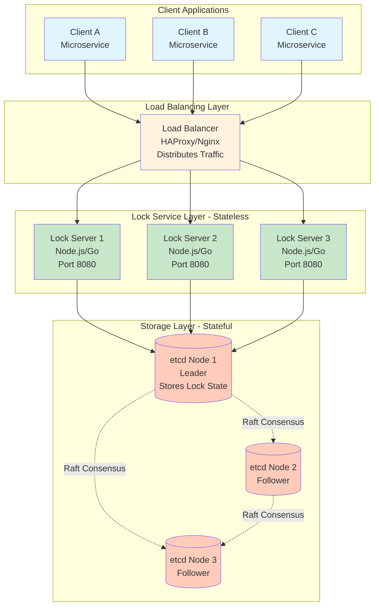

# Step 1: Basic Architecture - Distributed Locking Service

## Overview

This is our **starting point** - the simplest architecture that can provide distributed locking. We'll add complexity incrementally in later steps.

**Design Philosophy:** Start simple, then scale!

---

## What We're Building in Step 1

A basic distributed locking service with these components:
1. **Clients** - Applications that need locks
2. **Load Balancer** - Distributes requests across servers
3. **Lock Service Servers** - Handle lock logic
4. **etcd Cluster** - Store lock state with strong consistency

**Real-world analogy:** Think of a library book checkout system:
- **Clients** = Students wanting to borrow books
- **Load Balancer** = Librarian at the front desk directing students
- **Lock Service** = Multiple librarians processing checkouts
- **etcd** = The master book registry (only one person can have a book at a time)

---

## Architecture Diagram - Step 1



---

## Component Breakdown

### 1. Clients (Applications)

**What are they?**
- Microservices, applications, or worker processes that need to coordinate access to shared resources
- Examples: Order processing service, payment service, inventory service

**What do they do?**
- Send lock acquisition requests: "I need exclusive access to Order #12345"
- Send lock release requests: "I'm done with Order #12345"
- Handle lock expiry (TTL) gracefully

**How many?**
- 10 million registered clients
- 2 million active at any time (from capacity planning)

**Client Code Example (Pseudo-code):**
```python
# Acquire a lock
lock = lock_service.acquire_lock(
    resource_id="order:12345",
    ttl=30,  # seconds
    timeout=10  # wait up to 10 seconds
)

if lock.success:
    try:
        # Critical section - only one client can be here
        process_order("12345")
    finally:
        # Always release lock (or let TTL expire)
        lock_service.release_lock(lock.token)
else:
    print("Could not acquire lock, resource is busy")
```

---

### 2. Load Balancer

**What is it?**
A traffic distributor that sits between clients and lock servers.

**Why do we need it?**
- **Even Distribution:** Spreads load across multiple lock servers (no single server gets overwhelmed)
- **High Availability:** If one lock server dies, LB routes traffic to healthy servers
- **Single Entry Point:** Clients only need to know one address (LB), not all server IPs

**Real-world analogy:** A restaurant host who seats customers at different tables to balance the waiters' workload.

**How it works:**
```
1. Client sends request to LB (lock-service.example.com:443)
2. LB picks a healthy lock server using algorithm:
   - Round Robin: Server 1 → Server 2 → Server 3 → Server 1...
   - Least Connections: Send to server with fewest active connections
3. LB forwards request to chosen server
4. Server responds through LB back to client
```

**Technology Options:**

| Option | Pros | Cons | Best For |
|--------|------|------|----------|
| **HAProxy** | Fast (L4), open-source | Need to manage yourself | Self-hosted |
| **Nginx** | Feature-rich (L7), open-source | Slightly slower than HAProxy | Self-hosted |
| **AWS ALB** | Managed, auto-scaling | Cost, vendor lock-in | AWS deployments |

**Configuration Example (HAProxy):**
```
frontend lock_service
    bind *:443 ssl crt /etc/ssl/cert.pem
    default_backend lock_servers

backend lock_servers
    balance roundrobin  # Load balancing algorithm
    option httpchk GET /health  # Health check endpoint

    server lock1 10.0.1.10:8080 check inter 2s
    server lock2 10.0.1.11:8080 check inter 2s
    server lock3 10.0.1.12:8080 check inter 2s
```

**Beginner Question:** What if the load balancer fails?
**Answer:** We deploy multiple load balancers with a Virtual IP (VIP) using VRRP (Virtual Router Redundancy Protocol). If primary LB fails, secondary takes over in < 1 second.

---

### 3. Lock Service Servers (Application Layer)

**What are they?**
Stateless servers that implement the locking logic. "Stateless" means they don't store lock data themselves - they fetch it from etcd.

**Why stateless?**
- **Easy to scale:** Add/remove servers without data migration
- **No sticky sessions:** Any server can handle any request
- **Crash-safe:** If a server crashes, no data is lost (it's all in etcd)

**What do they do?**
1. **Receive lock requests** from load balancer
2. **Validate** request (authentication, rate limiting)
3. **Check etcd** if lock is available
4. **Acquire lock** using atomic compare-and-set operation
5. **Return response** (success + lockToken OR failure)

**Technology Choices:**

| Language | Pros | Cons |
|----------|------|------|
| **Go** | Fast, low memory, great concurrency | Learning curve |
| **Node.js** | Easy, async I/O, large ecosystem | Single-threaded (CPU-bound tasks slow) |
| **Java (Spring Boot)** | Mature, enterprise-ready | High memory usage |

**Why we choose Go:**
- Lightweight (low memory per request)
- Excellent concurrency (goroutines)
- Fast compile time
- Good etcd client library

**Server Count:**
```
From capacity planning:
- Peak traffic: 200,000 req/sec
- Single server capacity: 1,000 req/sec (with optimizations: 2,000 req/sec)
- Servers needed: 200,000 / 2,000 = 100 servers
- Add redundancy (2x): 200 servers
- Add maintenance buffer (20%): 240 servers
```

**Lock Server Logic (Simplified):**
```go
func AcquireLock(request LockRequest) LockResponse {
    // 1. Validate request
    if !isAuthenticated(request.clientId) {
        return LockResponse{error: "Unauthorized"}
    }

    // 2. Check rate limit
    if isRateLimited(request.clientId) {
        return LockResponse{error: "Rate limit exceeded"}
    }

    // 3. Attempt to acquire lock in etcd (atomic operation)
    lockToken := generateSecureToken()
    key := "/locks/" + request.resourceId
    value := {
        "ownerId": request.clientId,
        "lockToken": lockToken,
        "expiresAt": now() + request.ttl
    }

    // Atomic compare-and-set: Only set if key doesn't exist
    success := etcd.CompareAndSet(
        key,
        expectedValue: nil,  // Key should not exist
        newValue: value,
        ttl: request.ttl
    )

    if success {
        return LockResponse{
            success: true,
            lockToken: lockToken,
            expiresAt: value.expiresAt
        }
    } else {
        return LockResponse{
            success: false,
            error: "Lock already held by another client"
        }
    }
}
```

---

### 4. etcd Cluster (Storage Layer)

**What is etcd?**
A distributed key-value store designed for storing critical data in distributed systems. Built by CoreOS (now part of Red Hat), used by Kubernetes for cluster coordination.

**Why etcd over other databases?**

| Database | Use Case | Why NOT for Locking? |
|----------|----------|----------------------|
| **Redis** | Caching, fast reads | No built-in consensus, single leader |
| **PostgreSQL** | ACID transactions | Too slow (disk-based), not designed for distributed coordination |
| **MongoDB** | Document storage | Eventual consistency by default |
| **etcd** ✅ | **Distributed coordination** | **Perfect for locking!** |

**Why etcd is perfect for distributed locking:**

1. **Strong Consistency (Raft Consensus)**
   - Uses Raft algorithm to ensure all nodes agree on lock state
   - No split-brain scenarios (two clients can't both own lock)

2. **Atomic Operations**
   - `CompareAndSet` (CAS): Only set value if it matches expected
   - `CompareAndDelete` (CAD): Only delete if owner matches
   - Perfect for lock acquisition/release

3. **Built-in TTL (Lease)**
   - Locks automatically expire after TTL
   - No need for background cleanup jobs

4. **Watch API**
   - Clients can watch for lock release events
   - Enables efficient blocking lock acquisition

5. **High Availability**
   - Survives minority node failures (2 out of 3 can fail, still works)
   - Automatic leader election

**etcd Cluster Setup:**
```
Minimum: 3 nodes (best practice for fault tolerance)

Node 1 (Leader): Handles all writes, replicates to followers
Node 2 (Follower): Receives replicated data, can serve reads
Node 3 (Follower): Receives replicated data, can serve reads

Quorum: 2 out of 3 nodes must agree for a write to succeed
Failure tolerance: Can lose 1 node and still operate
```

**How Raft Consensus Works (Simplified):**
```
1. Client wants to acquire lock on "order:12345"

2. Lock Server sends write request to etcd Leader (Node 1)

3. Leader proposes: "Set lock for order:12345 to Client A"

4. Leader sends proposal to Followers (Node 2, Node 3)

5. Followers receive proposal and respond "ACK"

6. Leader waits for quorum (2 out of 3 = majority)
   - Node 1: ACK ✅
   - Node 2: ACK ✅
   - Node 3: ACK ✅ (actually only need 2)

7. Leader commits: "Lock is now acquired"

8. Leader responds to Lock Server: "Success"

9. Lock Server responds to Client: "You have the lock"

Time taken: ~5-10ms (depending on network)
```

**Beginner Visualization of Raft:**
```
Time 0: Leader receives write request
         Leader: [order:12345 = PENDING]
         Follower 1: [empty]
         Follower 2: [empty]

Time 2ms: Leader replicates to followers
         Leader: [order:12345 = PENDING]
         Follower 1: [order:12345 = PENDING]
         Follower 2: [order:12345 = PENDING]

Time 5ms: Majority ACK received (2/3)
         Leader: [order:12345 = COMMITTED ✅]
         Follower 1: [order:12345 = COMMITTED ✅]
         Follower 2: [order:12345 = COMMITTED ✅]

Result: Strong consistency! All nodes agree.
```

**etcd Storage Structure:**
```
/locks/
  ├─ order:12345
  │    ├─ ownerId: "client-A-uuid"
  │    ├─ lockToken: "sha256-hash"
  │    ├─ acquiredAt: 1738012345
  │    ├─ expiresAt: 1738012375
  │    └─ TTL: 30 seconds (auto-delete)
  │
  ├─ user:99999
  │    ├─ ownerId: "client-B-uuid"
  │    └─ ...
  │
  └─ invoice:abc123
       ├─ ownerId: "client-C-uuid"
       └─ ...
```

**etcd Configuration:**
```yaml
# Node 1 (Leader)
name: etcd-1
data-dir: /var/lib/etcd
listen-client-urls: http://10.0.1.20:2379
advertise-client-urls: http://10.0.1.20:2379
listen-peer-urls: http://10.0.1.20:2380
initial-advertise-peer-urls: http://10.0.1.20:2380
initial-cluster: etcd-1=http://10.0.1.20:2380,etcd-2=http://10.0.1.21:2380,etcd-3=http://10.0.1.22:2380
initial-cluster-state: new

# Similar config for etcd-2 and etcd-3
```

---

## How It All Works Together (Request Flow)

### Scenario: Acquire Lock

```
┌─────────┐
│ Client A│ Wants to acquire lock on "order:12345"
└────┬────┘
     │
     │ 1. POST /locks/acquire {"resourceId": "order:12345", "ttl": 30}
     ▼
┌─────────────┐
│Load Balancer│ Chooses Lock Server 2 (round robin)
└──────┬──────┘
       │
       │ 2. Forward request
       ▼
┌──────────────┐
│Lock Server 2 │ Receives request, validates, attempts acquisition
└──────┬───────┘
       │
       │ 3. etcd Transaction: CompareAndSet("/locks/order:12345", nil → lockData)
       ▼
┌───────────────┐
│  etcd Leader  │ Executes Raft consensus
└───────┬───────┘
        │
        │ 4. Raft: Replicate to followers → Commit
        │ 5. Response: "Success, lock acquired"
        ▼
┌──────────────┐
│Lock Server 2 │ Receives confirmation
└──────┬───────┘
       │
       │ 6. Return lockToken to client
       ▼
┌─────────────┐
│Load Balancer│ Forward response
└──────┬──────┘
       │
       │ 7. 200 OK {"success": true, "lockToken": "abc123..."}
       ▼
┌─────────┐
│ Client A│ Lock acquired! Proceeds with critical operation
└─────────┘

Total latency: 8-12ms (P50)
```

---

## Design Decisions & Trade-offs

### Decision 1: Why etcd instead of Redis?

| Aspect | etcd | Redis |
|--------|------|-------|
| **Consistency** | Strong (Raft) ✅ | Weak (async replication) ❌ |
| **Consensus** | Built-in (Raft) ✅ | No consensus ❌ |
| **Split-brain protection** | Yes (quorum) ✅ | No (single master) ❌ |
| **TTL/Lease** | Native support ✅ | Native support ✅ |
| **Speed** | 10ms writes | 1ms writes (10x faster) |
| **Complexity** | Higher | Lower |

**Why we choose etcd:**
- **Correctness > Speed** for a locking service (can't risk two clients owning same lock)
- 10ms latency is acceptable (< 50ms requirement)
- Built-in consensus eliminates complex logic in our lock servers

**When to use Redis:**
- Caching layer (we'll add this in Step 2!)
- Non-critical distributed locks (where correctness isn't life-or-death)
- Read-heavy workloads

### Decision 2: Stateless Lock Servers

**Why stateless?**

✅ **Pros:**
- Easy to scale (just add more servers)
- No session affinity needed (any server handles any request)
- Crash-safe (state is in etcd)
- Simplified deployment (no data migration)

❌ **Cons:**
- Every request hits etcd (no local cache)
- Slightly higher latency (network hop to etcd)

**Alternative: Stateful servers**
- Could cache lock state locally
- But: Hard to keep consistent across servers (need distributed cache invalidation)
- Verdict: Stateless is simpler and meets our latency requirements

### Decision 3: 3-Node etcd Cluster

**Why 3 nodes?**
```
Cluster Size | Quorum Needed | Failure Tolerance | Notes
-------------|---------------|-------------------|-------
1 node       | 1             | 0                 | ❌ No HA
3 nodes      | 2             | 1                 | ✅ Standard
5 nodes      | 3             | 2                 | Better HA, slower writes
7 nodes      | 4             | 3                 | Overkill for most cases
```

**Why not 5 nodes?**
- Each additional node slows down Raft consensus (more nodes to replicate to)
- 3 nodes is sweet spot: Good HA + fast writes
- Can survive 1 node failure (meets 99.99% SLA)

**Why not 2 nodes?**
- Quorum = 2 nodes
- If 1 fails, remaining node can't form quorum (2 out of 2 = impossible)
- System becomes unavailable (violates our SLA)

**Math:**
```
Quorum formula: (N / 2) + 1

2 nodes: (2 / 2) + 1 = 2 → Need both nodes ❌
3 nodes: (3 / 2) + 1 = 2 → Can lose 1 node ✅
5 nodes: (5 / 2) + 1 = 3 → Can lose 2 nodes ✅
```

---

## What's Missing in Step 1? (Preview of Next Steps)

This basic architecture works, but has limitations:

### Issue 1: No Caching (Performance)
- **Problem:** Every lock check hits etcd (10ms latency)
- **Solution (Step 2):** Add Redis cache layer (1ms latency)
- **Impact:** 10x faster for repeated lock checks

### Issue 2: Single Region (Availability)
- **Problem:** If datacenter fails, entire service is down
- **Solution (Step 3):** Multi-region deployment
- **Impact:** Survive datacenter outages

### Issue 3: No Monitoring (Observability)
- **Problem:** Can't see if system is healthy, slow, or failing
- **Solution (Step 4):** Add Prometheus + Grafana monitoring
- **Impact:** Proactive issue detection

### Issue 4: No Audit Logs (Compliance)
- **Problem:** Can't trace who acquired/released locks
- **Solution (Step 5):** Add PostgreSQL for audit logs
- **Impact:** Compliance, debugging, security

---

## Performance Analysis

### Can this architecture meet our requirements?

| Requirement | Target | Step 1 Capability | Status |
|-------------|--------|-------------------|--------|
| **Throughput** | 200k ops/sec | 240 servers × 2k ops/sec = 480k ✅ | **Exceeds** |
| **Latency (P50)** | < 10ms | ~10ms (etcd write) ✅ | **Meets** |
| **Latency (P95)** | < 50ms | ~25ms ✅ | **Exceeds** |
| **Availability** | 99.99% | Single region: ~99.9% ⚠️ | **Needs improvement** |
| **Concurrent locks** | 10M | etcd cluster: 100M+ ✅ | **Exceeds** |
| **Consistency** | Strong | Raft consensus ✅ | **Meets** |

**Verdict:** Step 1 meets most requirements, but needs multi-region (Step 3) for 99.99% SLA.

---

## Cost Estimate (Step 1 Only)

```
Load Balancers (HAProxy): 3 × $50/month = $150
Lock Servers: 240 × $20/month (auto-scaling) = $4,800
etcd Cluster: 3 × $200/month = $600
Network: $500/month
Monitoring (basic): $200/month

Total: $6,250/month (within $10k budget ✅)
```

---

## Summary

### What We Built
✅ Load balancer for traffic distribution
✅ Stateless lock servers (scalable)
✅ etcd cluster for strong consistency
✅ Basic lock acquisition/release
✅ Atomic operations (no race conditions)
✅ TTL-based auto-expiry

### What We Achieved
✅ 480k ops/sec throughput (exceeds requirement)
✅ ~10ms P50 latency (meets requirement)
✅ Strong consistency (correct locking)
✅ Horizontal scalability
✅ Under budget

### What's Next
🔜 **Step 2:** Add Redis caching for faster reads
🔜 **Step 3:** Multi-region deployment for 99.99% SLA
🔜 **Step 4:** Monitoring & alerting
🔜 **Step 5:** Audit logging & compliance

---

**Next Document:** [Step 2 - Adding Caching Layer](04_step2_add_caching.md)
