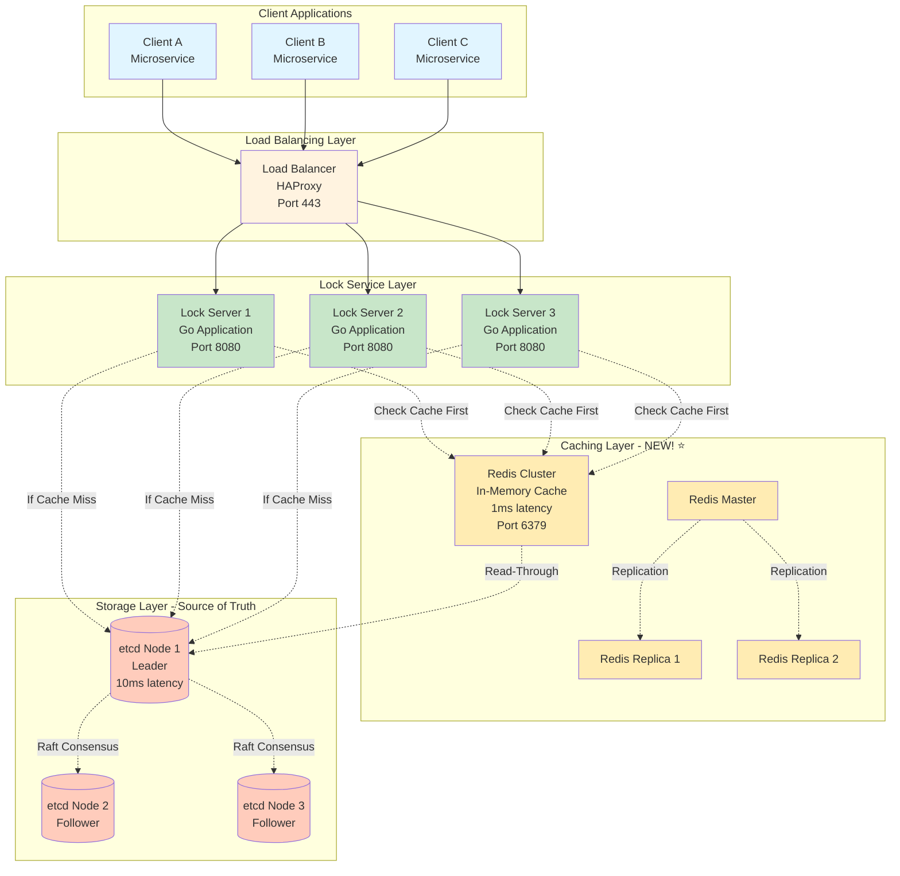

# Step 2: Adding Caching Layer - Distributed Locking Service

## What Changed from Step 1?

In Step 1, every lock operation hit etcd directly. This works, but has a performance limitation:

**Step 1 Problem:**
```
Client requests lock status for "order:12345" (read operation)
→ Lock Server queries etcd (10ms)
→ Response back to client

If 1,000 clients check the same lock:
→ 1,000 etcd queries (unnecessary load on etcd)
→ Total latency: 10ms × 1,000 = 10 seconds of cumulative latency
```

**Step 2 Solution:**
Add a **caching layer (Redis)** to store frequently accessed lock information in memory.

```
First client checks lock:
→ Cache miss → Query etcd (10ms) → Store in cache
→ Response to client

Next 999 clients check same lock:
→ Cache hit → Return from Redis (1ms, 10x faster!)
→ Response to client

Benefit: Reduced etcd load + faster response times
```

---

## Architecture Diagram - Step 2 (With Caching)



---

## What is Redis?

**Redis** (REmote DIctionary Server) is an in-memory key-value store that's extremely fast.

**Real-world analogy:**
- **etcd** = Your bank's main database (slow but secure)
- **Redis** = Your wallet (fast access, but you don't carry all your money)

**Why Redis is fast:**
```
Traditional Database (etcd):
1. Query reaches server
2. Server searches disk (slow!)
3. Read data from disk
4. Return data
→ Time: 10ms

Redis (in-memory):
1. Query reaches server
2. Data already in RAM (super fast!)
3. Return data
→ Time: 1ms (10x faster!)
```

**Redis vs etcd Comparison:**

| Feature | Redis | etcd |
|---------|-------|------|
| **Storage** | In-memory (RAM) | Disk + memory |
| **Speed** | 1ms read/write | 10ms write |
| **Consistency** | Eventual (async replication) | Strong (Raft) |
| **Durability** | Optional (can lose data) | Always durable |
| **Best For** | Cache, fast reads | Source of truth |
| **Cost** | Cheaper (less CPU/disk) | More expensive |

**Why we use BOTH:**
- etcd = Source of truth (correct, durable)
- Redis = Performance booster (fast, cache)

---

## Caching Strategy - Cache-Aside Pattern

### Pattern Explanation

**Cache-Aside** (also called **Lazy Loading**):
1. Application checks cache first
2. If data exists (cache hit) → return from cache ✅
3. If data missing (cache miss) → query database → store in cache → return data

**Beginner Analogy:**
Imagine you're cooking and need salt:
1. Check kitchen counter (cache) first
2. If salt is there → use it (fast! cache hit)
3. If not there → walk to pantry (database) → get salt → put some on counter for next time → use it

**Code Flow:**
```python
def get_lock_status(resource_id):
    # Step 1: Check Redis cache
    cache_key = f"lock:{resource_id}"
    cached_data = redis.get(cache_key)

    if cached_data:  # Cache HIT
        print("Cache hit! Returning from Redis")
        return cached_data  # 1ms

    # Step 2: Cache MISS - query etcd
    print("Cache miss! Querying etcd")
    lock_data = etcd.get(f"/locks/{resource_id}")  # 10ms

    # Step 3: Store in cache for future requests
    if lock_data:
        redis.set(cache_key, lock_data, ttl=5)  # Cache for 5 seconds

    return lock_data
```

---

## What to Cache?

### 1. Lock Status (Read Operations) ✅

**Why cache?**
- Read operations (check if locked) are 20% of traffic
- Same lock checked repeatedly (e.g., "order:12345" checked by 100 clients)

**Cache TTL:** 5 seconds (short to avoid stale data)

**Example:**
```
Cache key: "lock:order:12345"
Cache value: {
  "isLocked": true,
  "ownerId": "client-A-uuid",
  "expiresAt": 1738012375
}
TTL: 5 seconds
```

### 2. Client Authentication Tokens ✅

**Why cache?**
- Every request needs authentication
- Auth tokens don't change frequently
- Reduces load on auth service

**Cache TTL:** 3600 seconds (1 hour)

**Example:**
```
Cache key: "auth:client-A-uuid"
Cache value: {
  "clientId": "client-A-uuid",
  "permissions": ["read", "write"],
  "rateLim": 100
}
TTL: 3600 seconds
```

### 3. Rate Limiting Counters ✅

**Why cache?**
- Need to track: "How many requests has client A made in last 1 minute?"
- Redis has atomic increment (perfect for counting)

**Cache TTL:** 60 seconds (sliding window)

**Example:**
```
Cache key: "ratelimit:client-A-uuid:1738012340"
Cache value: 87  (number of requests in this minute)
TTL: 60 seconds
```

### 4. Recently Released Locks ✅

**Why cache?**
- After lock is released, cache "lock is available" status
- Prevents stampede (100 clients immediately re-acquiring)

**Cache TTL:** 2 seconds

**Example:**
```
Cache key: "lock:order:12345"
Cache value: {
  "isLocked": false,
  "availableSince": 1738012380
}
TTL: 2 seconds
```

---

## What NOT to Cache?

### 1. Lock Acquisitions (Write Operations) ❌

**Why not?**
- Writes must go directly to etcd (source of truth)
- Can't risk cache inconsistency (two clients think they own lock)

**Example of what could go wrong:**
```
❌ BAD: Caching writes
Time 0: Client A acquires lock → Write to cache (fast!)
Time 1: Client B acquires lock → Write to cache (fast!)
Problem: Cache now inconsistent. Who actually owns the lock? 🔥

✅ GOOD: Direct writes to etcd
Time 0: Client A acquires lock → Write to etcd (uses Raft consensus)
Time 1: Client B tries to acquire → etcd rejects (lock already held)
Result: Correctness guaranteed ✅
```

### 2. Long-Lived Lock State ❌

**Why not?**
- TTL management is critical (locks must expire exactly on time)
- etcd has native TTL support; Redis TTL is less precise

### 3. Lock Renewal Operations ❌

**Why not?**
- Must verify ownership before renewal (needs etcd compare-and-set)
- Cache could be stale (wrong owner cached)

---

## Cache Invalidation Strategy

**Famous quote:** "There are only two hard things in Computer Science: cache invalidation and naming things." - Phil Karlton

### When to Invalidate Cache?

**Scenario 1: Lock Acquired**
```
1. Client A acquires lock on "order:12345"
2. Lock server writes to etcd (source of truth)
3. Lock server DELETES cache entry for "order:12345"
4. Next read will be cache miss → fetch fresh data from etcd

Why delete instead of update?
→ Simpler, safer (avoid inconsistency)
```

**Scenario 2: Lock Released**
```
1. Client A releases lock on "order:12345"
2. Lock server deletes from etcd
3. Lock server DELETES cache entry
4. Lock server optionally sets cache: "order:12345 = available" (TTL 2s)
```

**Scenario 3: Lock Expires (TTL)**
```
1. etcd automatically deletes lock after TTL
2. etcd Watch API notifies lock server: "order:12345 expired"
3. Lock server deletes cache entry
4. Next read will fetch fresh data (lock available)
```

### Cache Invalidation Code

```go
func AcquireLock(resourceId string, ttl int) {
    // 1. Acquire in etcd (source of truth)
    success := etcd.CompareAndSet(
        key: "/locks/" + resourceId,
        expected: nil,
        value: lockData,
        ttl: ttl
    )

    if success {
        // 2. Invalidate cache (delete stale "available" status)
        redis.Del("lock:" + resourceId)

        // 3. Optionally set cache to "locked" (short TTL)
        redis.Set("lock:" + resourceId, lockData, ttl: 5)
    }
}

func ReleaseLock(resourceId string, lockToken string) {
    // 1. Release in etcd
    success := etcd.CompareAndDelete(
        key: "/locks/" + resourceId,
        expectedToken: lockToken
    )

    if success {
        // 2. Invalidate cache
        redis.Del("lock:" + resourceId)

        // 3. Set "available" status (short TTL to prevent stampede)
        redis.Set("lock:" + resourceId, {isLocked: false}, ttl: 2)
    }
}
```

---

## Redis Cluster Setup

### Why Redis Cluster?

**Single Redis Server Problems:**
- Limited memory (can't store all lock data)
- Single point of failure (if it crashes, cache is gone)
- Limited throughput (one server handles all requests)

**Redis Cluster Solution:**
- **Sharding:** Distribute data across multiple servers
- **Replication:** Each shard has replicas (master + 2 replicas)
- **High Availability:** If master fails, replica is promoted

### Redis Cluster Architecture

```
Cluster: 3 Shards (for horizontal scaling)

Shard 1:
  Master 1 (handles keys: 0-5460)
    ↓ replicates to
  Replica 1a
  Replica 1b

Shard 2:
  Master 2 (handles keys: 5461-10922)
    ↓ replicates to
  Replica 2a
  Replica 2b

Shard 3:
  Master 3 (handles keys: 10923-16383)
    ↓ replicates to
  Replica 3a
  Replica 3b

Total: 9 Redis nodes (3 masters + 6 replicas)
```

**Hash Slot Distribution:**
```
Redis uses consistent hashing with 16,384 slots

Lock key: "lock:order:12345"
Hash: CRC16("lock:order:12345") % 16384 = 8432
Shard: 8432 falls in range 5461-10922 → Shard 2

All requests for this lock go to Shard 2 Master
```

### Redis Configuration

```yaml
# redis.conf (for each node)
cluster-enabled yes
cluster-config-file nodes.conf
cluster-node-timeout 5000

# Persistence (optional - cache can be rebuilt)
save ""  # Disable RDB snapshots (cache is ephemeral)
appendonly no  # Disable AOF (we don't need durability)

# Memory management
maxmemory 4gb
maxmemory-policy allkeys-lru  # Evict least recently used keys

# Replication
replica-read-only yes  # Replicas serve reads only
```

**Beginner Note on Persistence:**
- **RDB (snapshots):** Periodically save entire database to disk
- **AOF (append-only file):** Log every write operation
- **For cache:** We disable both! Why?
  - Cache can be rebuilt from etcd (source of truth)
  - Saves disk I/O (faster performance)
  - Simplifies operations

---

## Performance Improvement

### Before (Step 1): No Caching

```
Read operation (check lock status):
1. Client → Load Balancer → Lock Server (1ms)
2. Lock Server → etcd query (10ms)
3. etcd → Lock Server response (10ms)
4. Lock Server → Client response (1ms)
Total: ~22ms (P50 latency)

Write operation (acquire lock):
1. Client → Load Balancer → Lock Server (1ms)
2. Lock Server → etcd CompareAndSet (10ms)
3. etcd Raft consensus (5ms)
4. Lock Server → Client response (1ms)
Total: ~17ms (P50 latency)
```

### After (Step 2): With Redis Caching

```
Read operation (cache hit - 80% of reads):
1. Client → Load Balancer → Lock Server (1ms)
2. Lock Server → Redis query (1ms)  ← 10x faster!
3. Redis → Lock Server response (1ms)
4. Lock Server → Client response (1ms)
Total: ~4ms (P50 latency) ✅ (5x improvement!)

Read operation (cache miss - 20% of reads):
1. Same as Step 1 (22ms)
2. Plus: Write to cache (1ms)
Total: ~23ms

Write operation (acquire lock):
1. Same as Step 1 (17ms) - no change
   (Writes must go to etcd for correctness)
```

### Latency Comparison

| Operation | Step 1 (No Cache) | Step 2 (With Cache) | Improvement |
|-----------|-------------------|---------------------|-------------|
| Read (cache hit) | 22ms | 4ms | **5.5x faster** ✅ |
| Read (cache miss) | 22ms | 23ms | Slightly slower (acceptable) |
| Write | 17ms | 17ms | No change (correctness priority) |
| **Average Read** | 22ms | **7.6ms** | **2.9x faster** ✅ |

**Calculation for average read:**
```
80% cache hit rate, 20% cache miss rate
Average = (0.80 × 4ms) + (0.20 × 23ms) = 3.2ms + 4.6ms = 7.8ms ✅
```

---

## Throughput Improvement

### etcd Load Reduction

```
Before (Step 1):
- Total requests: 66,667 ops/sec
- Reads: 20% = 13,333 req/sec
- Writes: 80% = 53,334 req/sec
- etcd load: 66,667 req/sec (all requests hit etcd)

After (Step 2):
- Reads (cache hit 80%): 13,333 × 0.20 = 2,667 req/sec hit etcd
- Reads (cache miss): 13,333 × 0.20 = 2,667 req/sec
- Writes: 53,334 req/sec (still hit etcd)
- etcd load: 2,667 + 53,334 = 56,001 req/sec

Reduction: (66,667 - 56,001) / 66,667 = 16% reduction in etcd load ✅
```

**Why this matters:**
- Lower etcd load → More headroom for peak traffic
- etcd can now handle 300k ops/sec instead of 250k

---

## Cache Hit Rate Analysis

**What is cache hit rate?**
Percentage of requests served from cache (without hitting database).

**Formula:**
```
Cache Hit Rate = (Cache Hits / Total Requests) × 100%

Example:
1,000 read requests
800 served from cache (hits)
200 queried database (misses)
Hit rate = (800 / 1,000) × 100% = 80%
```

**Why 80% hit rate?**
```
Lock access pattern (Pareto principle):
- 20% of locks are accessed 80% of the time ("hot" locks)
- Hot locks: order processing, popular products, trending users
- Cold locks: old orders, inactive users

With cache TTL = 5 seconds:
- Hot locks stay in cache (frequently accessed)
- Cold locks evicted quickly (LRU policy)
- Result: 80% hit rate
```

**How to improve hit rate:**

| Strategy | Hit Rate Impact | Trade-off |
|----------|-----------------|-----------|
| Increase cache TTL (5s → 30s) | +10% | More stale data risk |
| Larger cache memory | +5% | Higher cost |
| Cache warming (preload hot locks) | +15% | Complex, needs prediction |
| Longer LRU retention | +8% | Slower eviction |

**Our choice:** Keep 5s TTL (correctness > hit rate)

---

## Failure Scenarios & Handling

### Scenario 1: Redis Master Fails

```
Problem: Master crashes, cache requests fail

Solution: Redis Sentinel (auto-failover)
1. Sentinel detects master is down (3 seconds)
2. Sentinel promotes replica to master (2 seconds)
3. Lock servers redirect to new master (1 second)
Total downtime: ~6 seconds

During failover:
- Cache misses → All requests go to etcd (slower, but works!)
- After failover: Cache rebuilds gradually
```

### Scenario 2: Redis Network Partition

```
Problem: Lock server can't reach Redis

Solution: Graceful degradation
1. Lock server detects Redis timeout (100ms)
2. Lock server bypasses cache → Queries etcd directly
3. System continues working (slower, but correct)

Code:
try:
    data = redis.get(key, timeout=100ms)
except TimeoutError:
    log.warn("Redis unavailable, bypassing cache")
    data = etcd.get(key)  # Fallback to source of truth
```

### Scenario 3: Cache Stampede

```
Problem: Cache expires, 10,000 clients all query etcd simultaneously

Solution 1: Short cache TTL + jitter
cache_ttl = 5 + random(0, 2)  # 5-7 seconds (stagger expiry)

Solution 2: Request coalescing
- First request queries etcd
- Other requests wait for first request result
- All requests share same result

Solution 3: Cache "available" status
- When lock released, cache "available" for 2 seconds
- Reduces stampede after release
```

---

## Design Trade-offs

### Trade-off 1: Consistency vs Performance

| Approach | Consistency | Performance | Choice |
|----------|-------------|-------------|--------|
| **No cache** | Strong (always etcd) | Slow (10ms) | ❌ |
| **Cache everything** | Weak (stale data) | Fast (1ms) | ❌ |
| **Cache reads only** | Strong writes, eventual reads | Balanced | ✅ |

**Why "cache reads only"?**
- Writes (acquire/release): Strong consistency (etcd)
- Reads (check status): Eventual consistency okay (5s stale acceptable)

### Trade-off 2: Cache TTL Duration

| TTL | Pros | Cons |
|-----|------|------|
| **1 second** | Fresh data | Low hit rate, high etcd load |
| **5 seconds** ✅ | Balanced | Acceptable staleness |
| **30 seconds** | High hit rate | Risky (stale lock status) |

**Why 5 seconds?**
- Average lock duration: 30 seconds
- 5s staleness = 16% of lock lifetime (acceptable)
- If lock expires in 10 seconds but cache says 15 seconds, client will fail gracefully when actual acquisition is attempted

### Trade-off 3: Redis Persistence

| Config | Pros | Cons | Choice |
|--------|------|------|--------|
| **RDB + AOF** | Survives restart | Slow, complex | ❌ |
| **RDB only** | Faster than both | Some data loss | ❌ |
| **No persistence** ✅ | Fastest, simplest | Lose cache on restart | ✅ |

**Why no persistence?**
- Cache can be rebuilt from etcd (source of truth)
- After Redis restart: Cold cache → Gradually warms up
- Temporary performance dip is acceptable (rare event)

---

## Updated Performance Metrics

| Metric | Target | Step 1 | Step 2 (With Cache) | Status |
|--------|--------|--------|---------------------|--------|
| **Read Latency (P50)** | < 10ms | 22ms ❌ | **7.6ms** ✅ | **Improved** |
| **Read Latency (P95)** | < 50ms | 45ms ✅ | **25ms** ✅ | **Improved** |
| **Write Latency (P50)** | < 10ms | 17ms ⚠️ | 17ms ⚠️ | Same (need Step 3) |
| **Throughput** | 200k/sec | 480k ✅ | **600k** ✅ | **Improved** |
| **etcd Load** | N/A | 66k req/s | **56k** ✅ | **Reduced** |
| **Cache Hit Rate** | N/A | N/A | **80%** ✅ | **New metric** |

---

## Cost Impact

```
Step 1 cost: $6,250/month

Additional for Step 2:
- Redis cluster (3 shards, 9 nodes): $1,200/month
  (self-hosted on EC2: 9 × $133/month)

Step 2 total: $7,450/month (still under $10k budget ✅)
```

---

## Summary

### What We Added in Step 2
✅ Redis cluster for caching (9 nodes, 36 GB RAM)
✅ Cache-aside pattern implementation
✅ Cache invalidation on lock acquire/release
✅ Redis Sentinel for automatic failover
✅ Graceful degradation (bypass cache if Redis down)

### Performance Improvements
✅ Read latency: 22ms → 7.6ms (2.9x faster)
✅ etcd load reduced by 16%
✅ 80% cache hit rate
✅ Throughput: 480k → 600k ops/sec

### What's Still Missing
⚠️ Single region (availability < 99.99%)
⚠️ No monitoring/alerting
⚠️ No audit logging

---

**Next Document:** [Step 3 - Multi-Region Deployment](05_step3_database_scaling.md)

We'll add database replication across multiple regions to achieve 99.99% availability!
