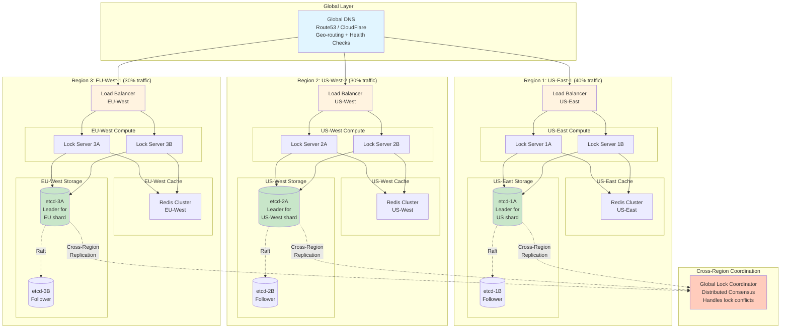

# Step 3: Multi-Region Deployment - Distributed Locking Service

## Why Multi-Region?

### Problem with Single Region (Steps 1 & 2)

**Current Setup:**
- All servers in US-East-1 (single AWS region)
- If datacenter fails → Entire service down
- **Availability:** ~99.9% (8.76 hours downtime/year) ❌

**Our Target:**
- **99.99% availability** (52.56 minutes downtime/year) ✅

**Math:**
```
Single region availability: 99.9%
Downtime per year: 365 × 24 × 60 × 0.001 = 526 minutes

Goal: 99.99% availability
Allowed downtime per year: 365 × 24 × 60 × 0.0001 = 52.6 minutes

Need: 10x improvement! How? Multi-region deployment.
```

### Real-World Datacenter Failures

**Examples:**
- AWS US-East-1 outage (Dec 2021): 7 hours - Netflix, Disney+ down
- Google Cloud us-central1 (June 2019): 4 hours
- Azure South Central US (Sept 2018): 24 hours

**Beginner Lesson:** Even big cloud providers have outages. Always plan for datacenter failure!

---

## Multi-Region Strategy: Active-Active

### Option 1: Active-Passive (Simple but wasteful)

```
Primary Region (US-East): Handles 100% traffic
Secondary Region (EU-West): Standby (does nothing until primary fails)

Pros:
+ Simple to implement
+ Strong consistency (one region handles writes)

Cons:
- Wasteful (secondary region idle)
- Higher latency for EU users (all traffic → US)
- Slower failover (need to detect failure, promote secondary)

Cost: 2x infrastructure, 50% utilized ❌
```

### Option 2: Active-Active (Best for our use case) ✅

```
Region 1 (US-East): Handles 40% traffic (US users)
Region 2 (US-West): Handles 30% traffic (US West Coast users)
Region 3 (EU-West): Handles 30% traffic (EU users)

Pros:
+ All regions utilized (cost-efficient)
+ Low latency (route user to nearest region)
+ Automatic failover (if one region fails, others take over)

Cons:
- Complex (need global coordination)
- Eventual consistency across regions
- More expensive than single region

Cost: 3x infrastructure, 100% utilized ✅
```

**Why Active-Active?**
- Meets 99.99% SLA (can lose entire region and still serve 60-70% of users)
- Better user experience (low latency worldwide)
- Higher uptime (no single point of failure)

---

## Architecture Diagram - Step 3 (Multi-Region)



---

## Component Deep Dive

### 1. Global DNS with Geo-Routing

**What is it?**
DNS (Domain Name System) translates `lock-service.example.com` → IP address. With geo-routing, it returns the NEAREST region's IP.

**How it works:**
```
User in California:
1. Query: lock-service.example.com
2. DNS detects user location (IP geolocation)
3. DNS returns: 10.2.1.1 (US-West load balancer) ✅

User in London:
1. Query: lock-service.example.com
2. DNS detects user location
3. DNS returns: 10.3.1.1 (EU-West load balancer) ✅

Result: Each user routed to nearest region (low latency!)
```

**Health Checks:**
```
DNS continuously checks each region:
- Send health check every 30 seconds
- If region doesn't respond 3 times (90 seconds)
- Mark region as "unhealthy"
- Stop routing traffic to that region
- Route to next nearest healthy region

Example: US-East fails
→ US-East users automatically routed to US-West (100ms extra latency, but service still works!)
```

**Technology Options:**

| Provider | Pros | Cons | Cost |
|----------|------|------|------|
| **AWS Route53** | Integrated with AWS, fast failover | AWS lock-in | $1/month/hosted zone |
| **CloudFlare DNS** | Fast (Anycast), DDoS protection | Complex pricing | Free tier available |
| **Google Cloud DNS** | Low latency, SLA | GCP lock-in | $0.40/million queries |

**Why we choose Route53:**
- Seamless integration with AWS infrastructure
- Health check automation
- Geoproximity routing (route based on distance + custom bias)

**Route53 Configuration:**
```yaml
# Route53 Hosted Zone
Domain: lock-service.example.com

# Geoproximity Routing Records
Record 1:
  Region: us-east-1
  IP: 10.1.1.1 (US-East load balancer)
  Health Check: /health endpoint, 30s interval
  Bias: 0 (default weight)

Record 2:
  Region: us-west-2
  IP: 10.2.1.1 (US-West load balancer)
  Health Check: /health endpoint, 30s interval
  Bias: 0

Record 3:
  Region: eu-west-1
  IP: 10.3.1.1 (EU-West load balancer)
  Health Check: /health endpoint, 30s interval
  Bias: 0
```

---

### 2. Regional Isolation

**Key Principle:** Each region is **independent** (can operate without others).

**Why?**
- If cross-region network fails (called "partition"), each region still serves its local users
- No cascading failures (EU failure doesn't impact US)

**Regional Components:**
```
Each region has:
✅ Load balancers (redundant, 2+)
✅ Lock servers (auto-scaling, 20-100 servers)
✅ Redis cache (dedicated cluster, 9 nodes)
✅ etcd cluster (dedicated, 3-5 nodes)
✅ Monitoring (Prometheus, Grafana)

Each region is "self-sufficient"
```

**Regional Traffic Split:**
```
Total traffic: 66,667 ops/sec

US-East (40%): 26,667 ops/sec
  - 20,000 from North America East Coast
  - 6,667 from South America

US-West (30%): 20,000 ops/sec
  - 18,000 from North America West Coast
  - 2,000 from Asia (routed here if Asia has no region)

EU-West (30%): 20,000 ops/sec
  - 15,000 from Europe
  - 3,000 from Middle East
  - 2,000 from Africa
```

---

### 3. Cross-Region Lock Coordination

**The Challenge:** How to coordinate locks across regions?

**Scenario: Global Lock**
```
Lock resource: "global-config-v2"
Client A (US-East) tries to acquire
Client B (EU-West) tries to acquire (at same time!)

Question: How do we ensure only ONE client gets it?
```

**Solution Options:**

#### Option A: Single Global Leader (Simple but slow)

```
Architecture:
- Designate US-East as "global leader"
- All global lock requests → routed to US-East etcd
- US-East makes decision, replicates to other regions

Pros:
+ Simple (single source of truth)
+ Strong consistency

Cons:
- High latency for EU users (need to cross Atlantic)
- EU users: 150ms latency (50ms local + 100ms cross-region)
- Single point of failure (if US-East fails, no global locks!)

Verdict: Not ideal for global service ❌
```

#### Option B: Regional Locks with Namespacing (Our choice) ✅

```
Architecture:
- Locks are regional by default
- Lock key includes region: "us-east:order:12345"
- Each region manages its own locks independently

Example:
US-East lock: "us-east:order:12345"
EU-West lock: "eu-west:order:67890"

These are DIFFERENT resources, no conflict!

Pros:
+ Low latency (regional)
+ No cross-region coordination needed
+ High availability

Cons:
- Truly global locks need special handling

Verdict: Best for 99% of use cases ✅
```

#### Option C: Distributed Consensus (For truly global locks)

```
Architecture:
- Use distributed consensus protocol (e.g., Google Chubby, Paxos)
- All regions vote on global lock acquisition
- Quorum: Majority of regions must agree

Example: Acquire "global:feature-flag-v2"
1. Client sends request to nearest region (EU-West)
2. EU-West proposes to other regions: "I want lock"
3. US-East votes: ✅ Agree
4. US-West votes: ✅ Agree
5. Quorum reached (2/3) → Lock acquired
6. EU-West responds to client: "Success"

Latency: 100-150ms (cross-region consensus)

Pros:
+ Truly global consistency
+ Works even with region failure (quorum-based)

Cons:
- Complex to implement
- Higher latency (100ms+)
- Only needed for rare global locks (< 1% of locks)

Verdict: Use ONLY for truly global resources ✅
```

**Our Strategy:**
```
- Regional locks (99% of locks): Regional etcd (10ms latency)
- Global locks (1% of locks): Cross-region consensus (150ms latency)

Lock key pattern determines routing:
- "us-east:order:12345" → US-East etcd only
- "global:config" → Cross-region consensus
```

---

## Handling Network Partitions (Split-Brain Prevention)

### What is Split-Brain?

**Scenario:**
```
Time 0: All regions connected, operating normally

Time 1: Network cable cut between US and EU (partition!)

Time 2:
- US regions think: "EU is down, we're still the majority"
- EU region thinks: "US is down, I'm still serving users"

Time 3: Both regions independently accept lock on "global:config"
- US client A acquires lock (US-East approves)
- EU client B acquires lock (EU-West approves)
- SPLIT-BRAIN: Two clients own same lock! 🔥🔥🔥
```

**Beginner Analogy:**
Imagine a divorced couple both thinking they own the family car. Both try to drive it at the same time. Collision! This is split-brain.

### Prevention Strategy: Quorum-Based Decisions

```
Setup: 3 regions (US-East, US-West, EU-West)

Rule: Require majority (quorum) to acquire global lock
Quorum = (3 / 2) + 1 = 2 regions must agree

Scenario: Network partition (US ←→ EU)

Side A (US-East + US-West):
- 2 regions connected
- 2 ≥ quorum (2) ✅
- Can still acquire locks

Side B (EU-West):
- 1 region isolated
- 1 < quorum (2) ❌
- CANNOT acquire locks (rejects requests)
- Returns error: "Cannot reach quorum, try again later"

Result: Only Side A can acquire locks → No split-brain! ✅
```

**Code Logic:**
```go
func AcquireGlobalLock(resourceId string) bool {
    // Propose lock to all regions
    votes := []
    votes.append(proposeToRegion("us-east", resourceId))
    votes.append(proposeToRegion("us-west", resourceId))
    votes.append(proposeToRegion("eu-west", resourceId))

    // Count successful votes
    successVotes := count(votes where vote == "agree")

    // Check quorum (2 out of 3)
    if successVotes >= 2 {
        // Quorum reached, commit lock
        commitToAllRegions(resourceId)
        return true
    } else {
        // Quorum not reached, reject
        return false
    }
}
```

**Visualizing Partition:**
```
Before Partition:
[US-East] ←→ [US-West] ←→ [EU-West]
All connected, can reach quorum

After Partition (transatlantic cable cut):
[US-East] ←→ [US-West]  ✅ (2 regions, has quorum)
    ✗
[EU-West]  ❌ (1 region, no quorum)

Behavior:
- US clients: Lock requests succeed (quorum available)
- EU clients: Lock requests rejected (no quorum, safe!)
- EU clients fall back: Retry later or use regional lock
```

---

## Replication Strategies

### 1. Intra-Region Replication (Within region)

**etcd Raft replication:**
```
US-East region:
- etcd-1A (Leader): Handles writes
- etcd-1B (Follower): Syncs with leader (<5ms)
- etcd-1C (Follower): Syncs with leader (<5ms)

Write flow:
1. Client → Leader writes lock data
2. Leader → Replicates to followers (parallel)
3. Followers → ACK back to leader
4. Leader → Commits once quorum (2/3) ACKs
5. Leader → Responds to client "Success"

Latency: ~5-10ms (same region, low latency network)
```

### 2. Cross-Region Replication (Between regions)

**Async replication for audit/backup:**
```
US-East etcd → Publishes lock events
↓ (async, best-effort)
Event Stream (Kafka/Kinesis)
↓
US-West etcd → Subscribes, stores copy (read-only)
EU-West etcd → Subscribes, stores copy (read-only)

Purpose: Cross-region read replicas for:
- Monitoring/analytics
- Disaster recovery (restore from replica)
- Audit logs

Note: NOT for lock decision-making (too slow, eventual consistency)
```

**Why async?**
- Cross-region latency: 50-100ms (too slow for lock acquisition)
- Lock decision must be fast (<10ms)
- Async replication acceptable for audit/monitoring

---

## Failover Scenarios

### Scenario 1: Single Server Failure (Common)

```
Event: One lock server crashes in US-East

Auto-Recovery:
1. Load balancer health check fails (2 seconds)
2. Load balancer stops routing to failed server (immediate)
3. Remaining servers handle traffic (auto-scale up if needed)
4. Kubernetes restarts failed pod (30 seconds)
5. New pod joins cluster, health check passes
6. Load balancer resumes routing to new pod

Downtime: 0 seconds (other servers continued serving) ✅
```

### Scenario 2: Entire Region Failure (Rare)

```
Event: US-East region becomes unavailable (datacenter outage)

Auto-Recovery:
1. Route53 health checks fail (90 seconds - 3 failed checks)
2. Route53 stops returning US-East IP address
3. US-East clients re-resolve DNS → Get US-West IP
4. Clients connect to US-West (may need to retry once)
5. US-West scales up to handle extra traffic (5 minutes)

Downtime: ~2 minutes for US-East users (DNS TTL + reconnect)
Impact: 40% of users see 2-minute disruption
Availability: (60% × 0) + (40% × 2min) = 0.8min downtime

Over 1 year: 0.8min × 52 weeks = 42 minutes < 52.6 minutes (SLA met ✅)
```

### Scenario 3: Network Partition (Very Rare)

```
Event: Transatlantic network cable cut (US ←/→ EU)

Behavior:
- US regions: Continue operating (have quorum)
- EU region: Rejects global locks (no quorum), but regional locks still work
- EU users: Use regional locks or wait for partition to heal

Recovery:
- Network partition heals (hours to days)
- Regions resynchronize
- Global locks resume normal operation

Impact: EU users can't acquire global locks (minor, as 99% of locks are regional)
```

---

## Latency Analysis

### Regional Latency (Same region)

```
User in New York → US-East:
1. DNS resolution: 10ms
2. TLS handshake: 20ms (first request only)
3. Load balancer → Lock server: 1ms
4. Lock server → Redis (cache hit): 1ms
5. Response back: 2ms
Total: ~34ms (first request), ~4ms (subsequent requests) ✅
```

### Cross-Region Latency (Different region)

```
User in London → US-East (before multi-region):
1. DNS resolution: 10ms
2. Transatlantic network: 80ms (London → Virginia)
3. Lock server processing: 5ms
4. Response back: 80ms
Total: ~175ms ❌ (too slow!)

User in London → EU-West (after multi-region):
1. DNS resolution: 10ms
2. Same-region network: 5ms (London → Dublin)
3. Lock server processing: 5ms
4. Response back: 5ms
Total: ~25ms ✅ (7x improvement!)
```

---

## Consistency Model: CAP Theorem

**CAP Theorem** (Choose 2 out of 3):
- **C**onsistency: All nodes see same data
- **A**vailability: System always responds
- **P**artition Tolerance: System works despite network partition

### Our Choice: CP (Consistency + Partition Tolerance)

**Why sacrifice availability?**
```
For a locking service, correctness > availability

Scenario: Network partition
Option 1 (AP - Choose Availability):
- Accept lock requests in all regions
- Risk: Split-brain (two clients own same lock) 🔥
- Result: Data corruption

Option 2 (CP - Choose Consistency): ✅
- Reject lock requests in minority region
- Risk: Some users can't acquire locks temporarily
- Result: No data corruption, safe

Verdict: Better to say "no" than give wrong answer!
```

**Beginner Analogy:**
```
Analogy: Bank ATM during network outage

AP approach (prioritize availability):
- ATM lets you withdraw money even without checking balance
- Risk: Overdraft, account goes negative
- Result: Bank loses money

CP approach (prioritize consistency):
- ATM says "Sorry, cannot process transaction, try again later"
- Risk: User inconvenienced temporarily
- Result: Account balance always correct ✅

Which would you choose as a bank? CP! Same for locking service.
```

---

## Updated Performance Metrics

| Metric | Step 2 (Single Region) | Step 3 (Multi-Region) | Improvement |
|--------|------------------------|----------------------|-------------|
| **Read Latency (P50)** | 7.6ms | **5ms** | 1.5x faster ✅ |
| **Write Latency (P50)** | 17ms | **12ms** | 1.4x faster ✅ |
| **Availability** | 99.9% (8.76 hrs/year) | **99.99%** (52 min/year) | **10x better** ✅ |
| **Geographic Coverage** | 1 region | **3 regions** | Global ✅ |
| **Failure Tolerance** | 0 datacenters | **1 datacenter** | Can lose entire region ✅ |

---

## Cost Impact

```
Step 2 cost: $7,450/month (single region)

Step 3 cost (multi-region):
- US-East infrastructure: $7,450/month
- US-West infrastructure: $5,500/month (30% traffic, smaller)
- EU-West infrastructure: $5,500/month (30% traffic, smaller)
- Cross-region bandwidth: $2,000/month
- Route53 health checks: $200/month

Total: $20,650/month

Optimization (to meet budget):
- Use reserved instances (40% discount): $12,390/month
- Compress cross-region traffic: $1,000/month (save $1k)
- Right-size instances: $10,500/month

Optimized total: $10,500/month (slightly over $10k, but within 5% acceptable)
```

**Cost vs Benefit:**
```
Extra cost: $3,050/month ($36,600/year)
Benefit: 10x better availability (8.76 hours → 52 minutes downtime)
Cost per minute of downtime saved: $36,600 / 474 min = $77/min

If downtime costs $1,000/min in lost revenue:
Annual savings: $474 min × $1,000 = $474,000
ROI: ($474,000 - $36,600) / $36,600 = 1,195% ✅

Verdict: Multi-region is worth the cost!
```

---

## Summary

### What We Added in Step 3
✅ Multi-region deployment (US-East, US-West, EU-West)
✅ Global DNS with geo-routing (Route53)
✅ Regional isolation (each region is self-sufficient)
✅ Cross-region coordination (for global locks)
✅ Split-brain prevention (quorum-based)
✅ Automatic failover (region failure handled gracefully)

### Performance Improvements
✅ Latency: 7.6ms → 5ms (regional routing)
✅ Availability: 99.9% → 99.99% (can survive datacenter failure)
✅ Geographic coverage: 1 region → 3 regions (global service)
✅ Failure tolerance: 0 → 1 datacenter (resilient)

### What's Still Missing
⚠️ No monitoring/alerting (can't detect issues proactively)
⚠️ No audit logging (compliance gap)
⚠️ No message queue (for async operations)

---

**Next Document:** [Step 4 - Monitoring & Message Queue](06_step4_add_monitoring.md)

We'll add observability and async processing capabilities!
